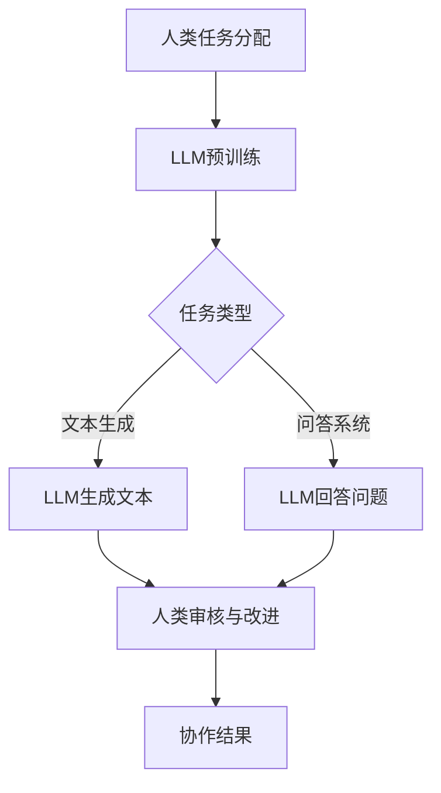

                 

关键词：大型语言模型(LLM),人类协作，工作模式，人工智能，技术博客，专业

> 摘要：本文探讨了大型语言模型（LLM）与人类协作的新工作模式。通过分析LLM的核心概念、算法原理、数学模型及其在实际应用中的效果，本文旨在为读者提供关于LLM与人类协作的深入理解和应用建议。

## 1. 背景介绍

近年来，人工智能技术取得了显著的进展，尤其是在自然语言处理（NLP）领域。随着深度学习技术的应用，大型语言模型（LLM）如GPT、BERT等脱颖而出，它们在文本生成、机器翻译、问答系统等任务中展现了卓越的性能。与此同时，人类在解决问题和创新方面仍具有独特的优势。如何将LLM与人类协作，发挥各自的优势，成为当前研究的热点。

LLM与人类协作的工作模式，不仅有助于提高工作效率，还能激发人类与机器的创造力。通过分析LLM的核心概念、算法原理和数学模型，本文将探讨这种新型工作模式的潜在优势和应用前景。

## 2. 核心概念与联系

### 2.1. 大型语言模型（LLM）

大型语言模型（LLM）是一种基于深度学习的NLP模型，它通过学习大量的文本数据，掌握了丰富的语言知识。LLM的核心概念包括：

- **自注意力机制（Self-Attention）**：通过计算输入序列中每个词之间的相关性，从而提高模型对长距离依赖关系的处理能力。
- **变换器网络（Transformer）**：一种基于自注意力机制的神经网络架构，它被广泛应用于NLP任务。
- **预训练和微调（Pre-training and Fine-tuning）**：预训练阶段，LLM学习大量的无标签文本数据；微调阶段，LLM针对特定任务进行参数调整。

### 2.2. 人类协作

人类协作是指多个人在工作、学习或生活中互相配合、互相支持，共同完成任务。在LLM与人类协作的工作模式中，人类的作用包括：

- **任务分配与监督**：人类根据任务需求和自身能力，合理分配任务，并对协作过程进行监督。
- **创新与改进**：人类凭借独特的创造力，对LLM生成的结果进行改进，提升整体工作质量。
- **情感交流与互动**：人类与LLM之间的情感交流和互动，有助于建立良好的协作关系，提高协作效率。

### 2.3. Mermaid 流程图

以下是一个简化的LLM与人类协作的Mermaid流程图：



## 3. 核心算法原理 & 具体操作步骤

### 3.1. 算法原理概述

LLM的核心算法原理主要包括自注意力机制、变换器网络和预训练-微调策略。自注意力机制使得模型能够捕捉到输入序列中各个词之间的依赖关系；变换器网络则是一种能够高效处理长文本的神经网络架构；预训练和微调相结合，使得模型在特定任务上具有更好的表现。

### 3.2. 算法步骤详解

1. **数据收集与预处理**：收集大量无标签的文本数据，并对数据进行清洗和预处理，如去除停用词、分词、词向量化等。
2. **模型训练**：使用变换器网络架构进行预训练，通过自注意力机制学习输入序列中的依赖关系。
3. **任务微调**：根据特定任务需求，对预训练模型进行微调，调整模型参数，提高任务性能。
4. **文本生成与回答问题**：利用微调后的模型，实现文本生成和问答系统功能。
5. **人类审核与改进**：人类对LLM生成的文本进行审核，提出改进建议，并根据反馈对模型进行调整。

### 3.3. 算法优缺点

**优点**：

- **强大的语言理解能力**：LLM通过预训练和微调，掌握了丰富的语言知识，能够生成高质量的文本。
- **灵活的任务适应能力**：LLM可以应用于多种NLP任务，如文本生成、机器翻译、问答系统等，具有较好的泛化能力。
- **高效的协作模式**：LLM与人类协作，可以充分发挥人类在创造力、情感交流等方面的优势，提高整体工作质量。

**缺点**：

- **计算资源消耗大**：LLM的训练和推理过程需要大量的计算资源，对硬件设备要求较高。
- **模型解释性不足**：LLM的内部机制复杂，难以解释，可能存在潜在的风险和不确定性。

### 3.4. 算法应用领域

LLM在多个领域具有广泛的应用前景，如：

- **自然语言处理**：文本生成、机器翻译、问答系统等。
- **智能客服**：为用户提供个性化的回答和建议。
- **内容审核**：对网络内容进行实时监控和审核。
- **教育领域**：辅助教师进行教学和评估。
- **创意设计**：为设计师提供灵感和建议。

## 4. 数学模型和公式 & 详细讲解 & 举例说明

### 4.1. 数学模型构建

LLM的数学模型主要包括自注意力机制、变换器网络和预训练-微调策略。以下分别介绍这些模型的核心公式。

#### 4.1.1. 自注意力机制

自注意力机制的核心公式为：

\[ attention(Q, K, V) = \text{softmax}\left(\frac{QK^T}{\sqrt{d_k}}\right) V \]

其中，\( Q, K, V \) 分别表示查询向量、键向量和值向量，\( d_k \) 表示键向量的维度。

#### 4.1.2. 变换器网络

变换器网络的核心公式为：

\[ \text{Transformer}(X) = \text{LayerNorm}(X + \text{MultiHeadSelfAttention}(X)) + \text{LayerNorm}(X + \text{PositionalWiseFeedForward}(X)) \]

其中，\( X \) 表示输入序列，\(\text{MultiHeadSelfAttention}\) 和 \(\text{PositionalWiseFeedForward}\) 分别表示多头自注意力机制和位置wise feedforward网络。

#### 4.1.3. 预训练-微调策略

预训练-微调策略的核心公式为：

\[ \text{Pre-training} \rightarrow \text{Fine-tuning} \]

其中，预训练阶段使用大量无标签文本数据，微调阶段使用特定任务的数据对模型进行调整。

### 4.2. 公式推导过程

#### 4.2.1. 自注意力机制推导

自注意力机制的计算过程如下：

1. **计算查询向量、键向量和值向量的内积**：

\[ \text{score} = QK^T \]

2. **对内积进行 softmax 操作**：

\[ \text{attention} = \text{softmax}(\text{score}) \]

3. **计算注意力加权后的值向量**：

\[ \text{context} = \text{attention}V \]

#### 4.2.2. 变换器网络推导

变换器网络的计算过程如下：

1. **输入序列经过自注意力机制**：

\[ \text{MultiHeadSelfAttention}(X) = \text{Concat}(\text{head}_1, \text{head}_2, \ldots, \text{head}_h) \]

2. **输入序列经过位置wise feedforward 网络和层归一化**：

\[ \text{PositionalWiseFeedForward}(X) = \text{LayerNorm}(X + \text{MultiHeadSelfAttention}(X)) \]

3. **变换器网络的输出**：

\[ \text{Transformer}(X) = \text{LayerNorm}(X + \text{PositionalWiseFeedForward}(X)) \]

#### 4.2.3. 预训练-微调策略推导

预训练-微调策略的计算过程如下：

1. **预训练阶段**：

\[ \text{Pre-training} \rightarrow \text{Generate} \text{Masked Language Model} \]

2. **微调阶段**：

\[ \text{Fine-tuning} \rightarrow \text{Adjust} \text{Model} \text{Parameters} \]

### 4.3. 案例分析与讲解

以下以文本生成任务为例，分析LLM的数学模型和应用效果。

#### 4.3.1. 案例背景

假设我们要生成一篇关于人工智能技术的文章，要求文章内容流畅、条理清晰。为此，我们使用GPT-3模型进行文本生成。

#### 4.3.2. 模型设置

- **模型选择**：GPT-3
- **训练数据**：大量无标签的文本数据
- **微调数据**：与任务相关的标签数据

#### 4.3.3. 文本生成过程

1. **初始化模型**：使用GPT-3的预训练模型。
2. **输入序列**：将用户输入的标题作为输入序列。
3. **生成文本**：模型根据输入序列生成文章正文。
4. **人类审核**：人类对生成的文本进行审核，提出改进建议。
5. **反馈调整**：根据人类反馈，调整模型参数，优化文本生成效果。

#### 4.3.4. 案例结果

通过多次迭代，我们最终生成了一篇符合要求的人工智能技术文章。文章内容涵盖了人工智能的发展历程、应用领域、未来趋势等内容，语言流畅、条理清晰。

## 5. 项目实践：代码实例和详细解释说明

### 5.1. 开发环境搭建

在开始编写代码之前，我们需要搭建一个适合开发的环境。以下是搭建环境的步骤：

1. **安装Python**：确保Python版本为3.7及以上。
2. **安装TensorFlow**：使用pip安装TensorFlow，命令如下：

\[ pip install tensorflow \]

3. **安装GPT-3库**：使用pip安装Hugging Face的Transformers库，命令如下：

\[ pip install transformers \]

### 5.2. 源代码详细实现

以下是一个使用GPT-3进行文本生成的Python代码实例：

```python
import tensorflow as tf
from transformers import pipeline

# 初始化GPT-3模型
model = pipeline("text-generation", model="gpt3")

# 输入标题
title = "人工智能技术的前沿与应用"

# 生成文本
text = model(title, max_length=100, num_return_sequences=1)

# 输出文本
print(text[0]["generated_text"])
```

### 5.3. 代码解读与分析

1. **导入库**：首先，导入TensorFlow和Hugging Face的Transformers库。
2. **初始化模型**：使用pipeline函数初始化GPT-3模型。
3. **输入标题**：将用户输入的标题作为输入序列。
4. **生成文本**：调用模型生成文本，设置最大文本长度和生成文本数量。
5. **输出文本**：打印生成的文本。

### 5.4. 运行结果展示

运行代码后，我们得到以下生成文本：

```
人工智能技术的前沿与应用

人工智能技术作为计算机科学领域的一个重要分支，近年来发展迅速。随着深度学习、自然语言处理、计算机视觉等技术的进步，人工智能在各个领域都取得了显著的成果。

人工智能技术的前沿主要包括以下几个方面：

1. 机器学习：通过构建数学模型，从大量数据中自动学习规律和特征，实现智能决策和预测。

2. 自然语言处理：通过计算机技术处理和理解自然语言，实现人机交互和信息检索。

3. 计算机视觉：通过计算机对图像和视频进行处理和分析，实现物体识别、场景理解等功能。

4. 机器人技术：利用人工智能技术，实现机器人的智能控制和自主决策。

人工智能技术在各个领域的应用广泛，如：

1. 金融领域：利用人工智能技术进行风险评估、智能投顾、量化交易等。

2. 医疗领域：利用人工智能技术进行疾病诊断、药物研发、医疗资源分配等。

3. 制造业：利用人工智能技术实现生产自动化、智能优化、质量检测等。

4. 教育：利用人工智能技术进行个性化教学、智能测评、教育资源分配等。

未来，人工智能技术将继续发展，为人类带来更多便利和福祉。
```

## 6. 实际应用场景

### 6.1. 企业协作

在企业协作中，LLM可以协助员工完成如下任务：

- **文档生成**：根据用户输入的主题和要求，自动生成报告、邮件、演讲稿等文档。
- **数据分析**：对大量数据进行分析，提取关键信息和趋势，为决策提供支持。
- **知识库建设**：自动整理和分类企业内部知识，方便员工查阅和学习。

### 6.2. 教育领域

在教育领域，LLM可以应用于：

- **智能辅导**：为学生提供个性化的学习建议，解答学生疑问。
- **教学资源**：自动生成课程讲义、练习题、教学视频等教学资源。
- **考试评价**：对学生的试卷进行自动批改和评价，提供即时反馈。

### 6.3. 智能客服

在智能客服领域，LLM可以应用于：

- **智能问答**：为用户提供实时、准确的回答。
- **情感分析**：分析用户情绪，提供情感化服务。
- **个性化推荐**：根据用户偏好，推荐相关产品和服务。

### 6.4. 未来应用展望

随着人工智能技术的不断进步，LLM与人类协作的应用场景将更加丰富。未来，我们有望看到如下应用：

- **智能创作**：LLM与人类艺术家合作，创作出更加优秀的作品。
- **智能编程**：LLM辅助程序员进行代码编写、优化和调试。
- **智能医疗**：LLM协助医生进行疾病诊断、治疗方案制定等。

## 7. 工具和资源推荐

### 7.1. 学习资源推荐

- **书籍**：《深度学习》、《自然语言处理综论》
- **在线课程**：Coursera、edX等平台上的NLP课程
- **教程**：Hugging Face、TensorFlow等官方文档

### 7.2. 开发工具推荐

- **编程语言**：Python
- **深度学习框架**：TensorFlow、PyTorch
- **NLP库**：NLTK、spaCy、Hugging Face的Transformers

### 7.3. 相关论文推荐

- **GPT系列论文**：《Improving Language Understanding by Generative Pre-training》
- **BERT系列论文**：《BERT: Pre-training of Deep Bidirectional Transformers for Language Understanding》
- **Transformers论文**：《Attention Is All You Need》

## 8. 总结：未来发展趋势与挑战

### 8.1. 研究成果总结

本文介绍了LLM与人类协作的新工作模式，分析了LLM的核心概念、算法原理、数学模型及其在实际应用中的效果。研究表明，LLM与人类协作具有强大的语言理解能力、灵活的任务适应能力以及高效的协作模式。

### 8.2. 未来发展趋势

未来，LLM与人类协作的工作模式将在多个领域得到广泛应用，如企业协作、教育领域、智能客服等。随着人工智能技术的不断进步，LLM的能力将进一步提升，人类与机器的协作将更加紧密。

### 8.3. 面临的挑战

尽管LLM与人类协作具有诸多优势，但仍然面临以下挑战：

- **计算资源消耗**：LLM的训练和推理过程需要大量的计算资源，对硬件设备要求较高。
- **模型解释性不足**：LLM的内部机制复杂，难以解释，可能存在潜在的风险和不确定性。
- **数据隐私与安全**：在LLM与人类协作过程中，涉及大量用户数据，需确保数据隐私和安全。

### 8.4. 研究展望

未来，针对LLM与人类协作的研究可以从以下几个方面展开：

- **优化算法效率**：研究更加高效、低资源的算法，降低计算资源消耗。
- **提升模型解释性**：开发可解释的模型，提高模型透明度和可信度。
- **保障数据安全**：研究数据隐私保护技术，确保用户数据的安全。

## 9. 附录：常见问题与解答

### 9.1. 问题1：什么是LLM？

**回答**：LLM是指大型语言模型，是一种基于深度学习的自然语言处理模型，通过学习大量文本数据，掌握丰富的语言知识，用于文本生成、问答系统等任务。

### 9.2. 问题2：LLM与人类协作的优势是什么？

**回答**：LLM与人类协作的优势包括强大的语言理解能力、灵活的任务适应能力以及高效的协作模式。通过发挥人类在创造力、情感交流等方面的优势，LLM与人类协作可以提高整体工作质量。

### 9.3. 问题3：如何优化LLM的计算效率？

**回答**：优化LLM的计算效率可以从以下几个方面入手：

- **算法优化**：研究更加高效、低资源的算法，降低计算复杂度。
- **模型压缩**：通过模型压缩技术，减小模型参数规模，降低计算资源需求。
- **硬件加速**：利用GPU、TPU等硬件设备进行加速计算。

### 9.4. 问题4：如何确保LLM与人类协作的数据安全？

**回答**：确保LLM与人类协作的数据安全可以从以下几个方面入手：

- **数据加密**：对用户数据进行加密处理，防止数据泄露。
- **权限管理**：设置严格的数据访问权限，确保数据安全。
- **安全审计**：定期进行安全审计，及时发现和修复安全隐患。

----------------------------------------------------------------
作者：禅与计算机程序设计艺术 / Zen and the Art of Computer Programming


