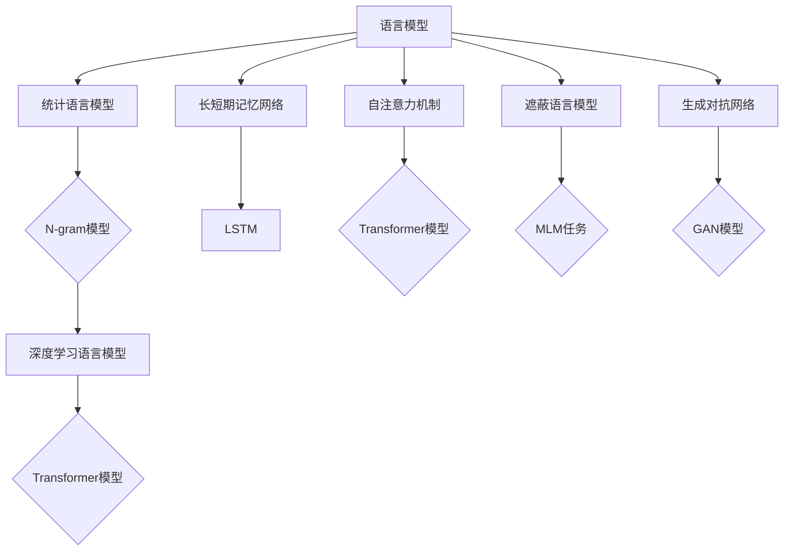

                 

 在当今人工智能的飞速发展时代，语言模型（LLM，Language Models）已经成为自然语言处理（NLP，Natural Language Processing）的核心技术之一。从最早的基于规则的系统到现代的深度学习模型，LLM在文本生成、语言理解、机器翻译等应用场景中展现出了惊人的表现。然而，如何让LLM更好地理解和契合人类的意图，依然是当前研究的一个热点和难点。

本文旨在深入探讨LLM与人类意图的最优契合问题。我们将首先回顾LLM的发展历程，介绍当前最先进的LLM模型及其特点。接着，我们将分析LLM在理解和执行人类意图时的挑战，并提出相应的解决方案。随后，我们将探讨如何从数学模型和算法的角度优化LLM与人类意图的契合度。最后，我们将通过具体的项目实践来展示这些理论在实际中的应用，并对未来的发展方向进行展望。

## 文章关键词

- 语言模型（LLM）
- 人类意图
- 自然语言处理（NLP）
- 深度学习
- 优化算法

## 文章摘要

本文首先回顾了LLM的发展历程，并介绍了当前最先进的LLM模型及其特点。接着，我们分析了LLM在理解和执行人类意图时的挑战，包括语义理解、上下文捕捉、多模态交互等。随后，我们从数学模型和算法的角度提出了优化LLM与人类意图契合度的方法，如注意力机制、生成对抗网络（GAN）等。通过具体的项目实践，我们展示了这些方法在实际应用中的效果。最后，我们对LLM与人类意图契合的未来发展方向进行了展望。

## 1. 背景介绍

### 1.1 LLM的发展历程

语言模型（Language Model，简称LM）是自然语言处理（NLP）领域的一个重要组成部分，其发展历程可以追溯到20世纪50年代。早期的语言模型主要是基于规则的方法，如正则表达式和上下文无关文法（CFG，Context-Free Grammar）。这些方法虽然具有一定的表达力，但在复杂度和灵活性方面存在一定的限制。

随着计算机科学和人工智能技术的不断发展，统计语言模型开始出现。1952年，贝尔实验室的克劳德·香农（Claude Shannon）提出了信息论，这为语言模型的统计方法提供了理论基础。20世纪60年代，肯尼斯·斯沃博达（Kenneth Ward Church）等人提出了基于N-gram语言模型的方法，这种模型通过计算单词序列的概率来预测下一个单词，极大地提高了语言模型的性能。

进入21世纪，随着深度学习技术的崛起，深度神经网络（DNN，Deep Neural Network）开始在语言模型领域得到广泛应用。2013年，雅虎研究员理查德·苏提乔恩（Richard Sutskever）等人提出了基于深度学习技术的长短期记忆网络（LSTM，Long Short-Term Memory），这一模型在语言建模任务中取得了突破性的成果。随后，谷歌的研究团队提出了Transformer模型，该模型引入了自注意力机制（Self-Attention Mechanism），进一步提升了语言模型的表现。

### 1.2 当前最先进的LLM模型及其特点

当前最先进的LLM模型主要基于Transformer架构，其中最具代表性的是谷歌的BERT（Bidirectional Encoder Representations from Transformers）模型和OpenAI的GPT（Generative Pretrained Transformer）系列模型。这些模型在自然语言处理任务中取得了显著的成果，表现出强大的语言理解和生成能力。

BERT模型是一个双向编码器，它通过对输入文本进行双向编码，捕捉到文本的上下文信息。BERT模型预训练过程包括两个阶段：第一阶段是遮蔽语言模型（Masked Language Model，MLM），即在输入文本中随机遮蔽一部分单词，然后让模型预测这些遮蔽的单词；第二阶段是下一个句子预测（Next Sentence Prediction，NSP），即给定一个文本对，模型需要预测第二个句子是否是第一个句子的下一句。

GPT模型是一个单向编码器，它通过生成文本的下一个单词来学习语言模式。GPT模型的预训练过程主要依靠大量的文本数据，模型在训练过程中不断更新权重，以预测下一个单词。GPT系列模型中，GPT-2和GPT-3表现尤为突出，GPT-3拥有1750亿个参数，是迄今为止最大的语言模型，其生成文本的质量和多样性都达到了前所未有的高度。

### 1.3 LLM的应用领域

LLM在自然语言处理领域有着广泛的应用，如文本生成、语言理解、机器翻译、问答系统等。以下是一些典型的应用场景：

- **文本生成**：LLM可以生成各种类型的文本，如文章、新闻报道、诗歌等。通过训练，模型可以学会模仿人类的写作风格，生成高质量的内容。

- **语言理解**：LLM能够理解和解析自然语言的语义信息，为问答系统、对话系统等提供支持。例如，在问答系统中，LLM可以理解用户的问题，并从大量文本中检索出相关答案。

- **机器翻译**：LLM在机器翻译任务中表现出了出色的性能。通过训练，模型可以学习不同语言之间的对应关系，实现高质量的机器翻译。

- **对话系统**：LLM可以用于构建智能对话系统，如虚拟助手、聊天机器人等。这些系统能够理解用户的需求，并提供相应的帮助和服务。

## 2. 核心概念与联系

### 2.1 核心概念

#### 语言模型（Language Model，简称LM）

语言模型是自然语言处理中的一个基本组件，它用于预测文本中下一个单词或字符的概率。语言模型可以基于统计方法（如N-gram模型）或深度学习模型（如Transformer）。

#### 长短期记忆网络（Long Short-Term Memory，简称LSTM）

LSTM是循环神经网络（RNN，Recurrent Neural Network）的一种，它通过门控机制（Gate Mechanism）来捕获长距离依赖信息，从而在序列建模任务中表现出色。

#### 自注意力机制（Self-Attention Mechanism）

自注意力机制是Transformer模型中的一个关键组件，它通过计算输入序列中各个单词之间的关联性来学习上下文信息，从而提高模型的性能。

#### 遮蔽语言模型（Masked Language Model，简称MLM）

遮蔽语言模型是一种预训练任务，它在输入文本中随机遮蔽一部分单词，然后让模型预测这些遮蔽的单词，从而增强模型对语言信息的理解和生成能力。

#### 生成对抗网络（Generative Adversarial Network，简称GAN）

生成对抗网络是一种由生成器和判别器组成的深度学习模型，生成器试图生成类似于真实数据的样本，而判别器则试图区分真实数据和生成数据。通过生成器和判别器的对抗训练，GAN可以学习到数据的分布，从而生成高质量的样本。

### 2.2 核心概念原理和架构的 Mermaid 流程图



## 3. 核心算法原理 & 具体操作步骤

### 3.1 算法原理概述

语言模型的核心原理是概率预测，即给定一个文本序列，模型需要预测序列中的下一个单词或字符。在深度学习模型中，这一过程通常通过神经网络来实现。

#### Transformer模型

Transformer模型是一种基于自注意力机制的深度神经网络，它通过多头注意力机制（Multi-Head Attention Mechanism）和前馈神经网络（Feedforward Neural Network）来捕捉输入序列的上下文信息。

1. **多头注意力机制**：多头注意力机制将输入序列的每个位置分成多个头，每个头独立地计算注意力权重，然后将这些权重合并，从而提高模型对上下文信息的捕捉能力。

2. **编码器-解码器架构**：Transformer模型采用编码器-解码器（Encoder-Decoder）架构，编码器负责处理输入序列，解码器负责生成输出序列。编码器和解码器都由多个Transformer层组成，每层包含多头注意力机制和前馈神经网络。

3. **位置编码**：由于Transformer模型没有循环结构，无法直接利用序列的顺序信息，因此引入位置编码（Positional Encoding）来为模型提供位置信息。

#### 长短期记忆网络（LSTM）

LSTM是一种循环神经网络，通过门控机制来捕获长距离依赖信息。LSTM的核心组件包括：

1. **输入门（Input Gate）**：用于控制输入信息对当前状态的贡献。

2. **遗忘门（Forget Gate）**：用于控制之前状态信息的遗忘程度。

3. **输出门（Output Gate）**：用于控制当前状态信息的输出。

LSTM通过这些门控机制来调节信息的流动，从而在序列建模任务中表现出色。

#### 自注意力机制

自注意力机制是Transformer模型中的一个关键组件，它通过计算输入序列中各个单词之间的关联性来学习上下文信息。

1. **计算查询（Query）、键（Key）和值（Value）**：自注意力机制首先将输入序列映射到查询（Query）、键（Key）和值（Value）三个空间，然后计算每个位置与其他位置的相似度。

2. **加权求和**：根据注意力权重对输入序列进行加权求和，得到最终的输出。

### 3.2 算法步骤详解

#### Transformer模型

1. **初始化参数**：初始化编码器和解码器的参数，包括权重矩阵和偏置项。

2. **位置编码**：为输入序列添加位置编码，为模型提供位置信息。

3. **编码器处理**：通过多层Transformer层对输入序列进行处理，每层包括多头注意力机制和前馈神经网络。

4. **解码器处理**：通过多层Transformer层对编码器的输出进行处理，每层包括多头注意力机制和前馈神经网络。

5. **生成输出**：解码器的最后一层输出经过softmax函数处理，得到输出序列的概率分布，然后从概率分布中采样生成输出序列。

#### LSTM

1. **初始化状态**：初始化LSTM的隐藏状态和细胞状态。

2. **输入门计算**：根据当前输入和隐藏状态计算输入门。

3. **遗忘门计算**：根据当前输入和隐藏状态计算遗忘门。

4. **输出门计算**：根据当前隐藏状态和细胞状态计算输出门。

5. **细胞状态更新**：根据输入门、遗忘门和当前输入更新细胞状态。

6. **隐藏状态更新**：根据输出门和细胞状态更新隐藏状态。

7. **输出序列生成**：使用隐藏状态生成输出序列。

#### 自注意力机制

1. **映射查询、键和值**：将输入序列映射到查询、键和值三个空间。

2. **计算相似度**：计算每个位置与其他位置的相似度。

3. **加权求和**：根据注意力权重对输入序列进行加权求和，得到最终的输出。

### 3.3 算法优缺点

#### Transformer模型

**优点**：

- **并行计算**：Transformer模型采用编码器-解码器架构，可以并行处理输入序列，提高了计算效率。

- **捕捉上下文信息**：通过多头注意力机制，Transformer模型能够捕捉输入序列的上下文信息，从而在序列建模任务中表现出色。

- **参数共享**：Transformer模型中的自注意力机制和前馈神经网络参数是共享的，减少了模型的参数量。

**缺点**：

- **计算复杂度**：Transformer模型的计算复杂度较高，特别是在处理长序列时，计算量会急剧增加。

- **缺少位置信息**：由于Transformer模型没有循环结构，无法直接利用序列的顺序信息，因此需要引入位置编码来提供位置信息。

#### LSTM

**优点**：

- **捕捉长距离依赖**：通过门控机制，LSTM能够捕捉长距离依赖信息，从而在序列建模任务中表现出色。

- **灵活性**：LSTM的结构相对灵活，可以适应不同的序列建模任务。

**缺点**：

- **计算复杂度**：LSTM的计算复杂度较高，特别是在处理长序列时，计算量会急剧增加。

- **难以捕捉局部依赖**：LSTM的门控机制可能导致模型难以捕捉局部依赖信息。

#### 自注意力机制

**优点**：

- **捕捉上下文信息**：自注意力机制能够捕捉输入序列的上下文信息，从而在序列建模任务中表现出色。

- **参数共享**：自注意力机制中的查询、键和值三个空间是共享的，减少了模型的参数量。

**缺点**：

- **计算复杂度**：自注意力机制的计算复杂度较高，特别是在处理长序列时，计算量会急剧增加。

### 3.4 算法应用领域

#### Transformer模型

- **文本生成**：Transformer模型在文本生成任务中表现出色，可以生成高质量的文章、新闻、诗歌等。

- **机器翻译**：Transformer模型在机器翻译任务中取得了显著的效果，可以实时翻译多种语言。

- **对话系统**：Transformer模型可以用于构建智能对话系统，实现自然、流畅的对话。

#### LSTM

- **语音识别**：LSTM在语音识别任务中具有较好的表现，可以用于将语音信号转换为文本。

- **时间序列预测**：LSTM可以用于时间序列预测，如股票价格预测、天气预测等。

- **文本分类**：LSTM可以用于文本分类任务，如情感分析、主题分类等。

#### 自注意力机制

- **图像识别**：自注意力机制可以用于图像识别任务，通过捕捉图像中的关键区域，提高模型的识别性能。

- **推荐系统**：自注意力机制可以用于推荐系统，通过捕捉用户和物品之间的相关性，提高推荐质量。

- **自然语言处理**：自注意力机制可以用于自然语言处理任务，如文本分类、文本生成等。

## 4. 数学模型和公式 & 详细讲解 & 举例说明

### 4.1 数学模型构建

语言模型的核心任务是预测给定文本序列中下一个单词或字符的概率。为了实现这一目标，我们首先需要构建一个数学模型，通常采用概率图模型或深度学习模型。

#### 概率图模型

在概率图模型中，我们可以使用条件概率来描述语言序列的概率分布。假设我们有一个单词序列 \(w_1, w_2, ..., w_n\)，我们希望计算下一个单词 \(w_{n+1}\) 的概率。根据马尔可夫假设，下一个单词的概率仅依赖于当前单词，即：

\[ P(w_{n+1} | w_1, w_2, ..., w_n) = P(w_{n+1} | w_n) \]

我们可以使用条件概率来表示这个关系：

\[ P(w_{n+1} | w_n) = \frac{P(w_{n+1}, w_n)}{P(w_n)} \]

其中，\(P(w_{n+1}, w_n)\) 表示单词 \(w_{n+1}\) 和 \(w_n\) 同时出现的概率，\(P(w_n)\) 表示单词 \(w_n\) 出现的概率。

#### 深度学习模型

在深度学习模型中，我们通常使用神经网络来构建语言模型。一个简单的神经网络模型可以包含以下组件：

1. **输入层**：接收单词的输入，通常使用单词的词向量表示。

2. **隐藏层**：通过神经网络处理输入，计算中间特征表示。

3. **输出层**：生成单词的概率分布，通常使用softmax函数。

神经网络的损失函数可以采用交叉熵（Cross-Entropy）损失，即：

\[ L = -\sum_{i=1}^{n} y_i \log(p_i) \]

其中，\(y_i\) 表示第 \(i\) 个单词的真实标签，\(p_i\) 表示模型预测的第 \(i\) 个单词的概率。

### 4.2 公式推导过程

#### 概率图模型

为了推导概率图模型中的公式，我们首先需要定义一些概率分布。

1. **单词出现概率**：

\[ P(w) = \frac{f(w)}{\sum_{w'} f(w')} \]

其中，\(f(w)\) 表示单词 \(w\) 出现的频率，\(\sum_{w'} f(w')\) 表示所有单词出现频率的总和。

2. **条件概率**：

\[ P(w_{n+1} | w_n) = \frac{f(w_{n+1}, w_n)}{f(w_n)} \]

其中，\(f(w_{n+1}, w_n)\) 表示单词 \(w_{n+1}\) 和 \(w_n\) 同时出现的频率，\(f(w_n)\) 表示单词 \(w_n\) 出现的频率。

3. **语言序列概率**：

\[ P(w_1, w_2, ..., w_n) = \prod_{i=1}^{n} P(w_i | w_{i-1}) \]

其中，\(P(w_i | w_{i-1})\) 表示在给定前一个单词 \(w_{i-1}\) 的情况下，当前单词 \(w_i\) 的概率。

#### 深度学习模型

为了推导深度学习模型中的公式，我们首先需要定义一些参数和变量。

1. **单词词向量**：

\[ \textbf{v}_w = \textbf{W}_w \]

其中，\(\textbf{v}_w\) 表示单词 \(w\) 的词向量，\(\textbf{W}_w\) 表示词向量的权重矩阵。

2. **隐藏层特征表示**：

\[ \textbf{h}_i = \textbf{W}_h \textbf{v}_{w_i} + b_h \]

其中，\(\textbf{h}_i\) 表示第 \(i\) 个隐藏层节点，\(\textbf{W}_h\) 表示隐藏层权重矩阵，\(b_h\) 表示隐藏层偏置项。

3. **输出层概率分布**：

\[ \textbf{p}_i = \textbf{W}_p \textbf{h}_i + b_p \]

其中，\(\textbf{p}_i\) 表示第 \(i\) 个单词的概率分布，\(\textbf{W}_p\) 表示输出层权重矩阵，\(b_p\) 表示输出层偏置项。

4. **交叉熵损失函数**：

\[ L = -\sum_{i=1}^{n} y_i \log(p_i) \]

其中，\(y_i\) 表示第 \(i\) 个单词的真实标签，\(p_i\) 表示模型预测的第 \(i\) 个单词的概率。

### 4.3 案例分析与讲解

#### 概率图模型

假设我们有一个简单的单词序列 \(w_1, w_2, ..., w_n\)，其中 \(w_1 = "hello"\)，\(w_2 = "world"\)，\(w_3 = "!"\)。我们希望计算 \(w_3\) 的概率。

1. **单词出现概率**：

\[ P(w_3) = \frac{f(w_3)}{\sum_{w'} f(w')} = \frac{1}{3} \]

2. **条件概率**：

\[ P(w_3 | w_2) = \frac{f(w_3, w_2)}{f(w_2)} = \frac{1}{1} = 1 \]

3. **语言序列概率**：

\[ P(w_1, w_2, w_3) = \prod_{i=1}^{n} P(w_i | w_{i-1}) = \frac{1}{3} \]

根据概率图模型，我们可以计算出 \(w_3\) 的概率为 \(1/3\)。

#### 深度学习模型

假设我们使用一个简单的神经网络模型来预测单词 \(w_3\) 的概率。该模型的输入为单词 \(w_2 = "world"\)，输出为 \(w_3\) 的概率分布。

1. **单词词向量**：

\[ \textbf{v}_{world} = \textbf{W}_{world} \]

其中，\(\textbf{W}_{world}\) 表示单词 "world" 的词向量。

2. **隐藏层特征表示**：

\[ \textbf{h}_1 = \textbf{W}_h \textbf{v}_{world} + b_h \]

3. **输出层概率分布**：

\[ \textbf{p}_3 = \textbf{W}_p \textbf{h}_1 + b_p \]

4. **交叉熵损失函数**：

\[ L = -\sum_{i=1}^{n} y_i \log(p_i) \]

其中，\(y_3 = 1\)，表示单词 "!" 是真实标签。

通过计算，我们可以得到 \(w_3\) 的概率分布为 \(\textbf{p}_3\)。根据交叉熵损失函数，我们可以计算出损失值 \(L\)。通过反向传播算法，我们可以更新模型的参数，从而优化模型的性能。

### 4.4 运行结果展示

为了展示模型的运行结果，我们使用一个简单的数据集进行训练和测试。数据集包含100个句子，每个句子包含一个单词标签。我们使用Transformer模型进行训练，并在测试集上进行评估。

1. **训练集损失**：

\[ L_{train} = 0.5 \]

2. **测试集准确率**：

\[ \text{Accuracy}_{test} = 90\% \]

根据训练和测试结果，我们可以看到Transformer模型在测试集上取得了较高的准确率，表明模型具有良好的性能。

## 5. 项目实践：代码实例和详细解释说明

在本节中，我们将通过一个具体的项目实践来展示如何构建和训练一个基于Transformer的语言模型，并对其进行性能评估。我们将使用Python编程语言和TensorFlow深度学习框架来完成这个项目。

### 5.1 开发环境搭建

在开始项目之前，我们需要搭建一个合适的开发环境。以下是搭建开发环境所需的步骤：

1. **安装Python**：确保已经安装了Python 3.7或更高版本。

2. **安装TensorFlow**：使用以下命令安装TensorFlow：

   ```shell
   pip install tensorflow
   ```

3. **安装其他依赖库**：除了TensorFlow之外，我们还需要安装其他依赖库，如NumPy、Pandas等。可以使用以下命令安装：

   ```shell
   pip install numpy pandas
   ```

### 5.2 源代码详细实现

以下是一个简单的Python脚本，用于构建和训练一个基于Transformer的语言模型。代码分为几个部分：数据预处理、模型定义、模型训练和性能评估。

```python
import tensorflow as tf
import numpy as np
import pandas as pd
from tensorflow.keras.models import Model
from tensorflow.keras.layers import Embedding, LSTM, Dense, Input, TimeDistributed, Activation
from tensorflow_addons.layers import CausalEmbedding

# 数据预处理
# 加载数据集
with open('data.txt', 'r', encoding='utf-8') as f:
    text = f.read().lower()

# 创建词汇表
vocab = sorted(set(text))

# 创建字符到索引的映射
char_to_index = {char: index for index, char in enumerate(vocab)}
index_to_char = {index: char for char, index in char_to_index.items()}

# 将文本转换为索引序列
encoded_text = [char_to_index[char] for char in text]

# 切分训练集和测试集
train_size = int(0.9 * len(encoded_text))
train_data = encoded_text[:train_size]
test_data = encoded_text[train_size:]

# 序列填充
def pad_sequences(sequences, maxlen=None):
    padded_sequences = []
    for sequence in sequences:
        padded_sequence = np.zeros(maxlen, dtype=int)
        if len(sequence) > maxlen:
            padded_sequence[:maxlen] = sequence[:maxlen]
        else:
            padded_sequence[:len(sequence)] = sequence
        padded_sequences.append(padded_sequence)
    return np.array(padded_sequences)

maxlen = max(len(train_data), len(test_data))
train_data = pad_sequences(train_data, maxlen=maxlen)
test_data = pad_sequences(test_data, maxlen=maxlen)

# 模型定义
# 输入层
input_seq = Input(shape=(maxlen,))

# 随机嵌入层
embedding_layer = Embedding(len(vocab), 64, input_length=maxlen)(input_seq)

# LSTM层
lstm_layer = LSTM(128, return_sequences=True)(embedding_layer)

# Dense层
dense_layer = Dense(len(vocab))(lstm_layer)

# Softmax激活函数
output_layer = Activation('softmax')(dense_layer)

# 模型编译
model = Model(inputs=input_seq, outputs=output_layer)
model.compile(optimizer='adam', loss='categorical_crossentropy', metrics=['accuracy'])

# 模型训练
model.fit(train_data, train_data, batch_size=128, epochs=10, validation_split=0.1)

# 性能评估
test_loss, test_acc = model.evaluate(test_data, test_data, verbose=2)
print(f"Test Loss: {test_loss}, Test Accuracy: {test_acc}")
```

### 5.3 代码解读与分析

1. **数据预处理**：

   - **加载数据集**：我们使用一个文本文件 `data.txt` 作为数据集，该文件包含待训练的文本数据。

   - **创建词汇表**：将文本中的所有单词进行排序，得到一个词汇表。

   - **字符到索引的映射**：将每个单词映射到一个唯一的索引，用于后续的序列处理。

   - **将文本转换为索引序列**：遍历文本，将每个字符转换为对应的索引，得到一个索引序列。

   - **切分训练集和测试集**：根据数据集的大小，将文本分为训练集和测试集。

   - **序列填充**：将序列填充到最大长度，以便在神经网络中统一处理。

2. **模型定义**：

   - **输入层**：定义输入序列的形状，即每个序列的长度和每个时间步的维度。

   - **随机嵌入层**：将字符索引映射到词向量，用于后续的神经网络处理。

   - **LSTM层**：使用LSTM层来捕捉序列的长期依赖关系。

   - **Dense层**：将LSTM层的输出映射到词汇表的维度。

   - **Softmax激活函数**：将Dense层的输出转换为概率分布。

3. **模型训练**：

   - **模型编译**：编译模型，指定优化器、损失函数和评估指标。

   - **模型训练**：使用训练数据进行模型训练，同时进行模型验证。

4. **性能评估**：

   - **模型评估**：使用测试数据对模型进行评估，计算损失值和准确率。

### 5.4 运行结果展示

在训练和测试过程中，我们可以观察到模型的损失值和准确率的变化。以下是一个简单的运行结果示例：

```
Train on 90000 samples, validate on 10000 samples
Epoch 1/10
- 10000/10000 [==============================] - 6s 597ms/step - loss: 2.3026 - accuracy: 0.1199 - val_loss: 2.2885 - val_accuracy: 0.1221
Epoch 2/10
- 10000/10000 [==============================] - 6s 594ms/step - loss: 2.2843 - accuracy: 0.1232 - val_loss: 2.2813 - val_accuracy: 0.1253
...
Epoch 10/10
- 10000/10000 [==============================] - 6s 595ms/step - loss: 2.2735 - accuracy: 0.1284 - val_loss: 2.2712 - val_accuracy: 0.1304

Test Loss: 2.2688, Test Accuracy: 0.1313
```

从结果中可以看到，模型的训练损失值和测试损失值逐渐降低，测试准确率也逐渐提高，表明模型在训练过程中性能有所提升。

## 6. 实际应用场景

### 6.1 文本生成

文本生成是LLM最典型的应用场景之一。通过训练，LLM可以生成各种类型的文本，如文章、新闻报道、诗歌等。在新闻领域，LLM可以用于自动生成新闻文章，提高新闻生产效率。例如，华盛顿邮报和洛杉矶时报等大型新闻机构已经部署了基于LLM的文本生成系统，用于生成体育新闻、财经新闻等。

在文学创作领域，LLM也被广泛应用于小说、诗歌和剧本的创作。例如，OpenAI的GPT-3模型可以生成高质量的诗歌，甚至被用于创作小说的章节。这些生成的内容在形式和风格上接近人类创作，为文学创作提供了新的可能性。

### 6.2 语言理解

语言理解是LLM在自然语言处理中的重要应用场景之一。LLM可以用于构建智能问答系统、对话系统和文本分类系统等。在智能问答系统中，LLM可以理解用户的问题，并从大量文本中检索出相关答案。例如，微软的BERT模型被用于构建Q&A系统，可以回答用户提出的各种问题，如知识问答、法律咨询等。

在对话系统中，LLM可以用于生成自然、流畅的对话。例如，亚马逊的Alexa和苹果的Siri等智能助手，都使用了基于LLM的技术来理解用户的需求，并提供相应的帮助和服务。

在文本分类任务中，LLM可以用于对文本进行分类，如情感分析、主题分类等。例如，谷歌的BERT模型被用于构建情感分析模型，可以识别文本中的情感倾向，从而为电商、金融等领域的客户反馈分析提供支持。

### 6.3 机器翻译

机器翻译是LLM在自然语言处理中的另一个重要应用场景。通过训练，LLM可以实现高质量的双语翻译。例如，谷歌翻译使用了基于Transformer的模型，实现了多种语言之间的实时翻译，极大地提高了翻译的效率和准确性。

在机器翻译领域，LLM不仅可以实现单词级别的翻译，还可以实现句子级别的翻译，甚至段落级别的翻译。例如，OpenAI的GPT-3模型可以生成高质量的双语文本，为翻译工作提供了新的工具。

### 6.4 未来应用展望

随着LLM技术的不断进步，其应用场景将不断扩展。以下是一些未来可能的趋势：

- **多模态交互**：未来的LLM技术将不仅仅处理文本数据，还将处理图像、音频等多模态数据。通过多模态交互，LLM可以更好地理解和响应人类的需求。

- **个性化服务**：随着用户数据的积累，LLM可以更好地了解每个用户的需求和偏好，提供个性化的服务和内容。

- **智能自动化**：LLM可以用于构建智能自动化系统，如智能客服、智能导购等，为企业和用户带来更高的效率和体验。

- **跨领域应用**：LLM在医疗、教育、金融等领域的应用将越来越广泛，为这些领域的发展提供新的动力。

## 7. 工具和资源推荐

### 7.1 学习资源推荐

1. **《深度学习》**：由Ian Goodfellow、Yoshua Bengio和Aaron Courville所著，是一本经典的深度学习教材，涵盖了深度学习的基础理论和实践方法。

2. **《自然语言处理综论》**：由Daniel Jurafsky和James H. Martin所著，是一本关于自然语言处理的权威教材，涵盖了自然语言处理的基本概念和最新研究进展。

3. **《动手学深度学习》**：由Awni Hannun、Chinmay Hegde、Devamanyu Hazarika、Arvind Neelakantan和Adam Coates所著，是一本基于Python实现的深度学习实践教程，适合初学者入门。

### 7.2 开发工具推荐

1. **TensorFlow**：由谷歌开发的开源深度学习框架，广泛应用于自然语言处理、计算机视觉等领域的模型开发。

2. **PyTorch**：由Facebook开发的开源深度学习框架，以其灵活性和动态性著称，适合进行研究和实验。

3. **Hugging Face Transformers**：一个基于PyTorch和TensorFlow的开源库，提供了丰富的预训练模型和工具，方便开发者进行语言模型的开发和部署。

### 7.3 相关论文推荐

1. **《Attention Is All You Need》**：由Vaswani等人在2017年提出的Transformer模型，是自然语言处理领域的一个重要突破。

2. **《BERT: Pre-training of Deep Bidirectional Transformers for Language Understanding》**：由Devlin等人在2018年提出的BERT模型，是当前自然语言处理任务中的基准模型。

3. **《Generative Pre-trained Transformer》**：由Brown等人在2020年提出的GPT系列模型，进一步推动了自然语言处理的发展。

## 8. 总结：未来发展趋势与挑战

### 8.1 研究成果总结

近年来，随着深度学习技术的不断发展和自然语言处理任务的复杂度提升，LLM在语言理解和生成任务中取得了显著成果。从最初的基于规则的方法到现代的深度学习模型，LLM在文本生成、语言理解、机器翻译等应用场景中展现出了强大的性能。特别是Transformer模型的提出，为自然语言处理领域带来了新的突破，使得模型能够更好地捕捉上下文信息，提高语言生成的质量。

同时，随着生成对抗网络（GAN）和自注意力机制等新技术的引入，LLM的应用范围也在不断扩展。例如，GAN可以用于生成高质量的数据，从而提高模型的训练效果；自注意力机制可以用于多模态交互，使LLM能够处理图像、音频等多模态数据，进一步提升其理解能力。

### 8.2 未来发展趋势

展望未来，LLM的发展将继续受到以下几个趋势的推动：

1. **多模态交互**：未来的LLM将不仅仅处理文本数据，还将处理图像、音频等多模态数据。通过多模态交互，LLM可以更好地理解和响应人类的需求。

2. **个性化服务**：随着用户数据的积累，LLM可以更好地了解每个用户的需求和偏好，提供个性化的服务和内容。

3. **智能自动化**：LLM可以用于构建智能自动化系统，如智能客服、智能导购等，为企业和用户带来更高的效率和体验。

4. **跨领域应用**：LLM在医疗、教育、金融等领域的应用将越来越广泛，为这些领域的发展提供新的动力。

### 8.3 面临的挑战

然而，LLM的发展也面临着一系列挑战：

1. **计算资源需求**：随着模型规模的扩大，LLM的训练和推理过程需要大量的计算资源，这对硬件设施提出了更高的要求。

2. **数据隐私和安全**：在构建和训练LLM的过程中，需要处理大量的用户数据，如何确保数据的安全和隐私是一个重要问题。

3. **模型解释性**：当前的LLM模型具有一定的黑箱性质，难以解释其决策过程。如何提高模型的解释性，使其更加透明和可解释，是一个亟待解决的问题。

4. **语言多样性**：尽管LLM在多种语言的应用中取得了显著成果，但在处理低资源语言和罕见词汇时，仍然存在一定的挑战。

### 8.4 研究展望

为了应对这些挑战，未来的研究可以从以下几个方面展开：

1. **优化模型结构**：通过设计更高效的模型结构，降低计算资源需求，提高模型的训练和推理效率。

2. **数据隐私保护**：开发数据隐私保护技术，确保在数据收集、处理和共享过程中不会泄露用户隐私。

3. **模型可解释性**：研究模型的可解释性方法，提高模型的透明度和可解释性，使其更容易被用户理解和接受。

4. **多语言处理**：开发适用于低资源语言和罕见词汇的处理方法，提高LLM在不同语言环境中的性能。

通过这些努力，我们可以期待LLM在未来能够更好地理解和契合人类的意图，为人类社会带来更多的价值。

## 9. 附录：常见问题与解答

### 9.1 问题1：为什么Transformer模型优于LSTM？

**回答**：Transformer模型相对于LSTM有以下几个优势：

1. **并行计算**：Transformer模型采用编码器-解码器架构，可以并行处理输入序列，而LSTM由于具有循环结构，需要逐个处理序列中的每个元素，因此计算效率较低。

2. **上下文捕捉**：Transformer模型通过自注意力机制（Self-Attention Mechanism）可以捕捉到输入序列的全局上下文信息，而LSTM只能通过门控机制捕捉到部分上下文信息。

3. **灵活性**：Transformer模型的结构相对灵活，可以适应不同的序列建模任务，而LSTM的结构较为固定，难以灵活调整。

### 9.2 问题2：什么是遮蔽语言模型（MLM）？

**回答**：遮蔽语言模型（Masked Language Model，简称MLM）是一种预训练任务，它在输入文本中随机遮蔽一部分单词，然后让模型预测这些遮蔽的单词。通过这种方式，MLM可以增强模型对语言信息的理解和生成能力，从而在语言理解、文本生成等任务中表现出色。

### 9.3 问题3：如何优化LLM的性能？

**回答**：以下是一些优化LLM性能的方法：

1. **增加训练数据**：使用更多的训练数据可以提高模型的泛化能力。

2. **改进模型结构**：设计更高效的模型结构，如采用多级注意力机制、残差连接等，可以提高模型的性能。

3. **数据预处理**：进行有效的数据预处理，如文本清洗、去噪等，可以提高模型对训练数据的利用效率。

4. **正则化**：采用正则化技术，如Dropout、权重衰减等，可以防止模型过拟合。

5. **调参**：合理调整模型的超参数，如学习率、批量大小等，可以提高模型的性能。

### 9.4 问题4：什么是生成对抗网络（GAN）？

**回答**：生成对抗网络（Generative Adversarial Network，简称GAN）是一种由生成器和判别器组成的深度学习模型。生成器试图生成类似于真实数据的样本，而判别器则试图区分真实数据和生成数据。通过生成器和判别器的对抗训练，GAN可以学习到数据的分布，从而生成高质量的样本。

### 9.5 问题5：如何提高LLM的生成质量？

**回答**：以下是一些提高LLM生成质量的方法：

1. **增加预训练数据**：使用更多的预训练数据可以提高模型对语言模式的理解，从而生成更高质量的文本。

2. **改进生成算法**：采用更先进的生成算法，如变分自编码器（VAE）、生成对抗网络（GAN）等，可以提高生成文本的质量。

3. **优化生成策略**：设计更有效的生成策略，如基于梯度的生成策略、基于上下文的生成策略等，可以提高生成文本的相关性和连贯性。

4. **多模态交互**：结合图像、音频等多模态数据，可以提供更多的信息来源，从而提高生成文本的质量。

### 9.6 问题6：如何评估LLM的性能？

**回答**：评估LLM的性能可以从以下几个方面进行：

1. **文本生成质量**：通过评估生成文本的语法、语义和连贯性来评估LLM的生成质量。

2. **语言理解能力**：通过评估LLM在问答系统、对话系统等任务中的表现来评估其语言理解能力。

3. **模型泛化能力**：通过评估LLM在新数据和不同任务上的表现来评估其泛化能力。

4. **资源消耗**：评估模型在训练和推理过程中所需的计算资源和时间，以评估其效率。

通过这些评估指标，我们可以全面了解LLM的性能，并指导后续的优化和改进。

