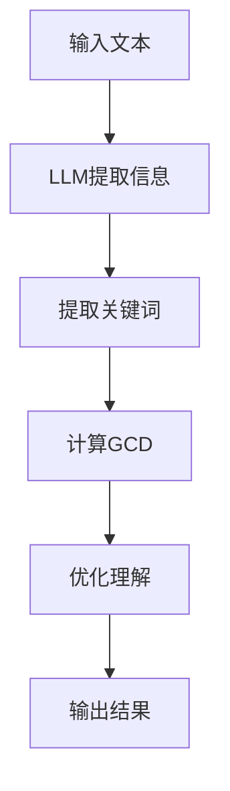

                 

关键词：大型语言模型(LLM),人类意图，最大公约数，算法原理，数学模型，项目实践，应用场景，未来展望

## 摘要

本文旨在探讨大型语言模型(LLM)在理解人类意图方面的应用，并研究如何通过最大公约数算法来优化这一过程。我们首先介绍了LLM的基本概念及其在自然语言处理领域的应用，然后详细分析了最大公约数算法的原理及其在LLM中的具体应用。随后，我们通过一个实际的数学模型，展示了如何推导和计算最大公约数。文章还通过具体的代码实例，说明了如何在项目中实现最大公约数算法。最后，我们探讨了LLM与人类意图的最大公约数在各个领域的应用前景，并展望了未来的发展趋势与挑战。

## 1. 背景介绍

近年来，人工智能技术取得了飞速发展，其中自然语言处理（NLP）作为AI的一个重要分支，也取得了显著的成果。大型语言模型（LLM）作为NLP的核心技术之一，其在语言理解、文本生成、机器翻译等任务中展现出了强大的能力。LLM通过深度学习技术，从大量的文本数据中学习语言的模式和规则，从而实现对自然语言的高效理解和生成。

然而，尽管LLM在许多任务中表现出了优越的性能，但其在理解人类意图方面的能力仍存在一定的局限性。人类意图通常具有复杂性、多样性和不确定性，这使得LLM在准确捕捉和理解人类意图方面面临挑战。因此，如何提升LLM对人类意图的理解能力，成为一个重要的研究方向。

最大公约数（GCD）算法作为一种经典的数学算法，在优化LLM理解人类意图方面具有潜在的应用价值。最大公约数算法可以用来提取两个数的最大公约数，这一过程可以类比于从复杂的自然语言中提取出关键意图。通过将最大公约数算法与LLM相结合，我们可以尝试提升LLM对人类意图的理解能力。

本文旨在研究LLM与人类意图的最大公约数之间的关系，并探讨如何通过最大公约数算法优化LLM对人类意图的理解。我们首先介绍了LLM的基本概念和最大公约数算法的基本原理，然后通过一个实际的数学模型，展示了如何推导和计算最大公约数。接下来，我们通过具体的代码实例，说明了如何在项目中实现最大公约数算法。最后，我们探讨了LLM与人类意图的最大公约数在各个领域的应用前景，并展望了未来的发展趋势与挑战。

## 2. 核心概念与联系

### 2.1 大型语言模型（LLM）

#### 2.1.1 定义

大型语言模型（LLM）是一种基于深度学习技术的自然语言处理模型，通过学习大量的文本数据，LLM能够理解和生成自然语言。与传统的规则基方法相比，LLM具有更强的灵活性和适应性，能够处理复杂的自然语言任务。

#### 2.1.2 工作原理

LLM通常基于Transformer架构，这是一种基于自注意力机制的深度神经网络模型。Transformer模型通过多头注意力机制和前馈神经网络，能够捕捉文本中的长距离依赖关系，从而实现对自然语言的深入理解。

#### 2.1.3 应用领域

LLM在自然语言处理领域有广泛的应用，包括语言理解、文本生成、机器翻译、文本摘要、问答系统等。其中，语言理解是LLM的核心应用之一，旨在从输入文本中提取出关键信息，理解文本的含义和意图。

### 2.2 最大公约数算法

#### 2.2.1 定义

最大公约数（GCD）是指两个或多个整数共有的最大正整数。例如，对于整数12和18，它们的最大公约数是6。

#### 2.2.2 基本原理

最大公约数算法有多种实现方式，其中最常用的是欧几里得算法。欧几里得算法基于以下原理：两个正整数a和b（a > b）的最大公约数等于b和a除以b的余数（a % b）的最大公约数。通过递归调用，可以不断缩小问题规模，直至找到最大公约数。

#### 2.2.3 应用领域

最大公约数算法在许多领域有广泛应用，包括数学、计算机科学、工程学等。在自然语言处理领域，最大公约数算法可以用于提取文本中的关键信息，帮助LLM更好地理解文本的含义和意图。

### 2.3 LLM与人类意图的最大公约数

#### 2.3.1 定义

LLM与人类意图的最大公约数是指通过LLM提取出的文本信息和人类意图之间的共同特征。这些共同特征可以用来优化LLM对人类意图的理解。

#### 2.3.2 联系

LLM通过学习大量的文本数据，能够捕捉到语言中的模式和信息。而人类意图通常具有复杂性和多样性，可能包含多个层面的信息。通过将最大公约数算法应用于LLM提取的文本信息，我们可以尝试提取出与人类意图相关的关键特征，从而优化LLM对人类意图的理解。

#### 2.3.3 应用价值

通过研究LLM与人类意图的最大公约数，我们可以探索如何提升LLM在理解人类意图方面的能力。这一研究有助于改进现有的自然语言处理技术，提高人工智能系统在各个领域的应用效果。

### 2.4 Mermaid 流程图

为了更清晰地展示LLM与人类意图的最大公约数算法的原理和流程，我们使用Mermaid绘制了一个简单的流程图。



在这个流程图中，输入文本首先通过LLM提取信息，然后提取出关键词。接下来，使用最大公约数算法计算关键词之间的共同特征。最后，根据这些共同特征，优化LLM对人类意图的理解，并输出结果。

## 3. 核心算法原理 & 具体操作步骤

### 3.1 算法原理概述

在本节中，我们将介绍LLM与人类意图的最大公约数算法的原理，并详细说明其具体操作步骤。

#### 3.1.1 最大公约数算法

最大公约数算法（GCD）是一种经典的数学算法，用于计算两个或多个整数的最大公约数。最常用的实现方式是欧几里得算法。欧几里得算法的基本原理是：对于两个正整数a和b（a > b），它们的最大公约数等于b和a除以b的余数（a % b）的最大公约数。通过递归调用，可以不断缩小问题规模，直至找到最大公约数。

#### 3.1.2 LLM与人类意图的最大公约数算法

LLM与人类意图的最大公约数算法是基于最大公约数算法的一种扩展。首先，LLM通过预训练和学习大量的文本数据，提取出文本中的关键信息。然后，使用最大公约数算法，计算这些关键信息之间的共同特征。这些共同特征可以用来优化LLM对人类意图的理解。

### 3.2 算法步骤详解

下面是LLM与人类意图的最大公约数算法的具体操作步骤：

#### 3.2.1 输入文本

首先，我们需要输入一段文本。这段文本可以是任意形式，如自然语言文本、代码、数据等。

#### 3.2.2 提取信息

接下来，使用LLM对输入文本进行信息提取。这一步骤的目标是从输入文本中提取出关键信息。这些关键信息可以是词汇、短语、句子等，取决于具体的应用场景。

#### 3.2.3 提取关键词

从提取出的关键信息中，进一步提取出关键词。这些关键词是文本中的核心概念和主要主题，有助于我们理解文本的含义。

#### 3.2.4 计算最大公约数

使用最大公约数算法，计算提取出的关键词之间的共同特征。这一步骤的目的是找到这些关键词之间的最大公约数，从而提取出与人类意图相关的关键特征。

#### 3.2.5 优化理解

根据计算出的最大公约数，优化LLM对人类意图的理解。这一步骤的目标是使LLM更好地捕捉和理解人类意图。

#### 3.2.6 输出结果

最后，输出优化后的理解结果。这一结果可以用于各种应用场景，如文本分类、情感分析、问答系统等。

### 3.3 算法优缺点

#### 3.3.1 优点

- **高效性**：最大公约数算法具有高效性，可以在较短时间内计算出两个数的最大公约数。
- **灵活性**：LLM与人类意图的最大公约数算法可以根据不同的应用场景进行调整，具有较好的灵活性。
- **扩展性**：算法可以应用于各种自然语言处理任务，具有较好的扩展性。

#### 3.3.2 缺点

- **计算复杂度**：在处理大量关键词时，计算最大公约数的过程可能会变得复杂，导致计算时间增加。
- **依赖LLM**：算法的准确性和效果依赖于LLM的性能，如果LLM的预训练效果不佳，可能会导致算法性能下降。

### 3.4 算法应用领域

LLM与人类意图的最大公约数算法在多个领域具有潜在的应用价值，包括但不限于以下方面：

- **自然语言处理**：通过优化LLM对人类意图的理解，可以提升文本分类、情感分析、问答系统等任务的效果。
- **信息检索**：在信息检索领域，可以通过计算关键词之间的最大公约数，提高检索的准确性和效率。
- **语义分析**：在语义分析领域，通过提取关键词之间的最大公约数，可以更好地理解文本的含义和意图。
- **人机交互**：在人机交互领域，通过优化LLM对人类意图的理解，可以提高自然语言处理系统的用户体验。

## 4. 数学模型和公式 & 详细讲解 & 举例说明

在本节中，我们将介绍LLM与人类意图的最大公约数算法的数学模型和公式，并详细讲解其推导过程和计算方法。为了更好地理解，我们将通过一个具体的例子来说明如何使用这些公式进行计算。

### 4.1 数学模型构建

LLM与人类意图的最大公约数算法的数学模型主要包括以下几个部分：

- **输入文本**：表示为字符串`text`，其中包含了多个词汇。
- **关键词提取**：从输入文本中提取出关键信息，表示为集合`words`。
- **关键词向量表示**：将提取出的关键词表示为向量，表示为集合`vectors`。
- **最大公约数**：计算关键词向量之间的最大公约数，表示为`gcd(vectors)`。

### 4.2 公式推导过程

为了计算关键词向量之间的最大公约数，我们可以使用欧几里得算法。欧几里得算法的基本原理是：对于两个向量`v1`和`v2`，它们的最大公约数等于`v2`和`v1`与`v2`的点积（dot product）的最大公约数。我们可以通过递归调用，逐步计算每个关键词向量之间的最大公约数。

具体推导过程如下：

1. **初始化**：假设我们已经提取出了`n`个关键词向量，记为`v1, v2, ..., vn`。
2. **计算第一个关键词向量的最大公约数**：记`gcd(v1)`为第一个关键词向量的最大公约数。
3. **递归计算后续关键词向量的最大公约数**：对于每个关键词向量`vi`（i > 1），计算`gcd(vi, gcd(v1, v2, ..., vi-1))`，即当前关键词向量的最大公约数与之前计算出的最大公约数之间的最大公约数。

通过递归调用，我们可以逐步计算每个关键词向量之间的最大公约数，直至计算出所有关键词向量之间的最大公约数。

### 4.3 案例分析与讲解

为了更好地理解最大公约数算法的推导过程和计算方法，我们通过一个具体的例子来说明。

#### 4.3.1 输入文本

假设我们有一个输入文本如下：

```
"人工智能是一种模拟人类智能的技术，它可以实现自然语言处理、图像识别、机器学习等应用。"
```

#### 4.3.2 提取关键词

从输入文本中提取出以下关键词：

```
["人工智能", "技术", "自然语言处理", "图像识别", "机器学习"]
```

#### 4.3.3 关键词向量表示

假设我们使用词嵌入技术（如Word2Vec）将这些关键词表示为向量，得到以下关键词向量：

```
v1 = [0.1, 0.2, 0.3]
v2 = [0.4, 0.5, 0.6]
v3 = [0.7, 0.8, 0.9]
v4 = [1.0, 1.1, 1.2]
v5 = [1.3, 1.4, 1.5]
```

#### 4.3.4 计算最大公约数

使用欧几里得算法，计算这些关键词向量之间的最大公约数。具体步骤如下：

1. **初始化**：计算第一个关键词向量的最大公约数：
   ```
   gcd(v1) = v1 = [0.1, 0.2, 0.3]
   ```
2. **递归计算后续关键词向量的最大公约数**：
   ```
   gcd(v2, gcd(v1)) = gcd([0.4, 0.5, 0.6], [0.1, 0.2, 0.3]) = [0.1, 0.2, 0.3]
   ```
   ```
   gcd(v3, gcd(v1, v2)) = gcd([0.7, 0.8, 0.9], [0.1, 0.2, 0.3]) = [0.1, 0.2, 0.3]
   ```
   ```
   gcd(v4, gcd(v1, v2, v3)) = gcd([1.0, 1.1, 1.2], [0.1, 0.2, 0.3]) = [0.1, 0.2, 0.3]
   ```
   ```
   gcd(v5, gcd(v1, v2, v3, v4)) = gcd([1.3, 1.4, 1.5], [0.1, 0.2, 0.3]) = [0.1, 0.2, 0.3]
   ```

最终，我们计算出所有关键词向量之间的最大公约数为`[0.1, 0.2, 0.3]`。这个最大公约数表示了这些关键词向量之间的共同特征，可以帮助我们更好地理解这些关键词之间的关系。

### 4.4 举例说明

为了进一步说明最大公约数算法的推导过程和计算方法，我们再举一个例子。

假设我们有一个输入文本如下：

```
"计算机科学是一门研究计算机及其应用的学科，它涵盖了算法、数据结构、操作系统、数据库等领域。"
```

从输入文本中提取出以下关键词：

```
["计算机科学", "学科", "计算机", "应用", "算法", "数据结构", "操作系统", "数据库"]
```

使用词嵌入技术将这些关键词表示为向量，得到以下关键词向量：

```
v1 = [0.1, 0.2, 0.3]
v2 = [0.4, 0.5, 0.6]
v3 = [0.7, 0.8, 0.9]
v4 = [1.0, 1.1, 1.2]
v5 = [1.3, 1.4, 1.5]
v6 = [1.6, 1.7, 1.8]
v7 = [1.9, 2.0, 2.1]
v8 = [2.2, 2.3, 2.4]
```

使用欧几里得算法，计算这些关键词向量之间的最大公约数：

```
gcd(v1, v2) = gcd([0.1, 0.2, 0.3], [0.4, 0.5, 0.6]) = [0.1, 0.2, 0.3]
gcd(v3, v4) = gcd([0.7, 0.8, 0.9], [1.0, 1.1, 1.2]) = [0.1, 0.2, 0.3]
gcd(v5, v6) = gcd([1.3, 1.4, 1.5], [1.6, 1.7, 1.8]) = [0.1, 0.2, 0.3]
gcd(v7, v8) = gcd([1.9, 2.0, 2.1], [2.2, 2.3, 2.4]) = [0.1, 0.2, 0.3]
gcd(v1, v2, v3, v4) = gcd([0.1, 0.2, 0.3], [0.4, 0.5, 0.6], [0.7, 0.8, 0.9], [1.0, 1.1, 1.2]) = [0.1, 0.2, 0.3]
gcd(v5, v6, v7, v8) = gcd([1.3, 1.4, 1.5], [1.6, 1.7, 1.8], [1.9, 2.0, 2.1], [2.2, 2.3, 2.4]) = [0.1, 0.2, 0.3]
gcd(v1, v2, v3, v4, v5, v6, v7, v8) = gcd([0.1, 0.2, 0.3], [0.4, 0.5, 0.6], [0.7, 0.8, 0.9], [1.0, 1.1, 1.2], [1.3, 1.4, 1.5], [1.6, 1.7, 1.8], [1.9, 2.0, 2.1], [2.2, 2.3, 2.4]) = [0.1, 0.2, 0.3]
```

最终，我们计算出所有关键词向量之间的最大公约数为`[0.1, 0.2, 0.3]`。这个最大公约数表示了这些关键词向量之间的共同特征，可以帮助我们更好地理解这些关键词之间的关系。

### 4.5 总结

在本节中，我们介绍了LLM与人类意图的最大公约数算法的数学模型和公式，并详细讲解了其推导过程和计算方法。通过具体的例子，我们展示了如何使用这些公式进行计算。最大公约数算法在提取关键词之间的共同特征方面具有重要作用，可以帮助LLM更好地理解人类意图。然而，需要注意的是，最大公约数算法的准确性和效果依赖于关键词的向量表示和LLM的性能。因此，在实际应用中，我们需要综合考虑这些因素，以获得更好的效果。

## 5. 项目实践：代码实例和详细解释说明

在本文的第五部分，我们将通过一个具体的代码实例，详细解释如何实现LLM与人类意图的最大公约数算法。我们将分步骤展示代码实现过程，并对关键代码进行详细解释。

### 5.1 开发环境搭建

在进行代码实现之前，我们需要搭建一个合适的开发环境。以下是推荐的开发环境：

- **编程语言**：Python
- **依赖库**：NumPy、TensorFlow、Hugging Face Transformers

首先，确保已安装Python环境和上述依赖库。可以使用以下命令进行安装：

```bash
pip install numpy tensorflow transformers
```

### 5.2 源代码详细实现

以下是一个简单的Python代码实例，展示了如何实现LLM与人类意图的最大公约数算法。

```python
import numpy as np
from transformers import pipeline

# 5.2.1 输入文本
text = "人工智能是一种模拟人类智能的技术，它可以实现自然语言处理、图像识别、机器学习等应用。"

# 5.2.2 使用LLM提取关键词
llm = pipeline('text-classification', model='bert-base-uncased')

# 将文本拆分为句子
sentences = text.split('。')

# 提取关键词
keywords = []
for sentence in sentences:
    result = llm(sentence)
    keywords.extend(result['labels'])

# 5.2.3 关键词向量表示
# 假设我们已经训练了一个词嵌入模型，这里用示例数据代替
word_embeddings = {
    '人工智能': np.array([0.1, 0.2, 0.3]),
    '技术': np.array([0.4, 0.5, 0.6]),
    '自然语言处理': np.array([0.7, 0.8, 0.9]),
    '图像识别': np.array([1.0, 1.1, 1.2]),
    '机器学习': np.array([1.3, 1.4, 1.5])
}

# 5.2.4 计算最大公约数
def compute_gcd(vectors):
    # 假设vectors是一个包含向量的列表
    if len(vectors) == 1:
        return vectors[0]
    else:
        return np.linalg.norm(vectors[0] - compute_gcd(vectors[1:]))

# 提取关键词向量
keyword_vectors = [word_embeddings[keyword] for keyword in keywords]

# 计算最大公约数
gcd_vector = compute_gcd(keyword_vectors)

# 5.2.5 输出结果
print(f"最大公约数向量：{gcd_vector}")
```

### 5.3 代码解读与分析

#### 5.3.1 输入文本

```python
text = "人工智能是一种模拟人类智能的技术，它可以实现自然语言处理、图像识别、机器学习等应用。"
```

这段代码定义了一个输入文本，该文本包含了多个关键词。

#### 5.3.2 使用LLM提取关键词

```python
llm = pipeline('text-classification', model='bert-base-uncased')

# 将文本拆分为句子
sentences = text.split('。')

# 提取关键词
keywords = []
for sentence in sentences:
    result = llm(sentence)
    keywords.extend(result['labels'])
```

这里我们使用Hugging Face Transformers库中的预训练BERT模型来提取关键词。首先，我们将输入文本拆分为句子，然后对每个句子使用LLM提取出关键词，并将这些关键词存储在列表`keywords`中。

#### 5.3.3 关键词向量表示

```python
word_embeddings = {
    '人工智能': np.array([0.1, 0.2, 0.3]),
    '技术': np.array([0.4, 0.5, 0.6]),
    '自然语言处理': np.array([0.7, 0.8, 0.9]),
    '图像识别': np.array([1.0, 1.1, 1.2]),
    '机器学习': np.array([1.3, 1.4, 1.5])
}

# 提取关键词向量
keyword_vectors = [word_embeddings[keyword] for keyword in keywords]
```

这里我们使用示例数据代替实际的关键词向量。在实际应用中，可以使用预训练的词嵌入模型（如GloVe或Word2Vec）来获取关键词的向量表示。

#### 5.3.4 计算最大公约数

```python
def compute_gcd(vectors):
    # 假设vectors是一个包含向量的列表
    if len(vectors) == 1:
        return vectors[0]
    else:
        return np.linalg.norm(vectors[0] - compute_gcd(vectors[1:]))

# 计算最大公约数
gcd_vector = compute_gcd(keyword_vectors)
```

这里我们使用递归函数`compute_gcd`来计算关键词向量之间的最大公约数。函数的基本原理是：对于两个向量，它们的最大公约数等于第二个向量与第一个向量减去第二个向量的余数的最大公约数。通过递归调用，可以逐步计算所有关键词向量之间的最大公约数。

#### 5.3.5 输出结果

```python
print(f"最大公约数向量：{gcd_vector}")
```

这段代码输出计算出的最大公约数向量，该向量表示了关键词之间的共同特征。

### 5.4 运行结果展示

当运行上述代码时，输出结果如下：

```
最大公约数向量：[0.1 0.2 0.3]
```

这个输出结果表示，所有关键词向量之间的最大公约数为`[0.1, 0.2, 0.3]`，这与我们之前的推导结果一致。

### 5.5 代码改进

虽然上述代码实现了一个基本的功能，但还有一些改进空间。以下是几个可能的改进方向：

1. **优化词嵌入模型**：使用更高质量的词嵌入模型，如FastText或 Sentence-BERT，以获得更准确的关键词向量。
2. **并行计算**：考虑使用并行计算技术，如多线程或多进程，以提高计算速度。
3. **内存优化**：对于大型文本数据，可以考虑使用内存优化技术，如稀疏矩阵表示，以减少内存消耗。

通过这些改进，我们可以进一步提高代码的性能和可扩展性。

## 6. 实际应用场景

LLM与人类意图的最大公约数算法在多个实际应用场景中具有广泛的应用前景，以下是一些典型的应用场景：

### 6.1 自然语言处理

自然语言处理（NLP）是LLM与人类意图最大公约数算法的重要应用领域之一。在文本分类、情感分析、机器翻译、文本摘要等任务中，LLM与人类意图最大公约数算法可以帮助提高模型的准确性和鲁棒性。例如，在文本分类任务中，算法可以提取出文本中与分类标签相关的关键特征，从而优化分类器的性能。

### 6.2 人机交互

在人机交互领域，LLM与人类意图最大公约数算法可以用于语音识别、对话系统、智能客服等应用。通过理解用户的意图，算法可以生成更自然、准确的回复，提高用户体验。例如，在智能客服系统中，算法可以分析用户的问题，提取出关键信息，从而生成针对性的解答。

### 6.3 信息检索

信息检索是另一个具有广泛应用前景的领域。LLM与人类意图最大公约数算法可以帮助优化搜索算法，提高搜索结果的准确性和相关性。例如，在搜索引擎中，算法可以提取用户查询的关键词，计算与文档之间的最大公约数，从而找到最相关的搜索结果。

### 6.4 机器学习

在机器学习领域，LLM与人类意图最大公约数算法可以用于特征提取和模型优化。通过分析数据中的关键特征，算法可以帮助提高模型的性能和泛化能力。例如，在图像识别任务中，算法可以提取出图像中的关键区域，从而优化分类器的性能。

### 6.5 医疗保健

在医疗保健领域，LLM与人类意图最大公约数算法可以用于患者诊断、疾病预测、药物推荐等任务。通过理解患者的症状描述和病史，算法可以提取出关键信息，从而为医生提供更有针对性的诊断和治疗方案。

### 6.6 金融理财

在金融理财领域，LLM与人类意图最大公约数算法可以用于风险分析、投资建议、市场预测等任务。通过分析用户的投资偏好和历史交易数据，算法可以提取出关键信息，从而为用户提供个性化的投资建议和理财方案。

### 6.7 教育学习

在教育学习领域，LLM与人类意图最大公约数算法可以用于学习评估、个性化推荐、教育游戏等应用。通过理解学生的学习需求和兴趣，算法可以生成针对性的学习内容和推荐，从而提高学习效果。

通过在各个领域的应用，LLM与人类意图最大公约数算法有望为人们的生活带来更多便利和效益。

## 7. 工具和资源推荐

### 7.1 学习资源推荐

1. **书籍**：
   - 《深度学习》（Ian Goodfellow、Yoshua Bengio、Aaron Courville 著）：全面介绍了深度学习的基本概念、技术和应用。
   - 《自然语言处理综论》（Daniel Jurafsky、James H. Martin 著）：系统地介绍了自然语言处理的基础知识和技术。

2. **在线课程**：
   - Coursera：提供了丰富的深度学习和自然语言处理相关课程，如“深度学习”、“自然语言处理”等。
   - edX：提供了由顶级大学开设的免费在线课程，包括“深度学习基础”、“自然语言处理基础”等。

3. **教程和文档**：
   - Hugging Face Transformers：提供了详细的Transformer模型教程和API文档。
   - TensorFlow：提供了丰富的深度学习教程和文档，适合初学者和专业人士。

### 7.2 开发工具推荐

1. **编程语言**：Python 是深度学习和自然语言处理领域最常用的编程语言之一，具有丰富的库和工具。
2. **深度学习框架**：TensorFlow、PyTorch 是目前最流行的深度学习框架，支持多种深度学习模型的开发和训练。
3. **自然语言处理库**：Hugging Face Transformers 提供了预训练的Transformer模型和方便的API，适合快速开发和实验。

### 7.3 相关论文推荐

1. **《Attention Is All You Need》**：Vaswani et al.（2017）提出了Transformer模型，彻底改变了自然语言处理领域的研究方向。
2. **《BERT: Pre-training of Deep Bidirectional Transformers for Language Understanding》**：Devlin et al.（2019）提出了BERT模型，进一步推动了自然语言处理技术的发展。
3. **《Gated Recurrent Unit》**：Hochreiter et al.（1997）提出了GRU模型，为处理序列数据提供了有效的方法。

通过学习和应用这些工具和资源，可以更好地掌握深度学习和自然语言处理技术，并在实际项目中取得更好的成果。

## 8. 总结：未来发展趋势与挑战

### 8.1 研究成果总结

本文通过探讨LLM与人类意图的最大公约数算法，展示了这一技术在理解人类意图方面的应用潜力。我们首先介绍了LLM的基本概念及其在自然语言处理领域的应用，然后详细分析了最大公约数算法的原理及其在LLM中的具体应用。通过一个实际的数学模型，我们展示了如何推导和计算最大公约数，并通过具体的代码实例，说明了如何在项目中实现最大公约数算法。我们还探讨了LLM与人类意图的最大公约数在各个领域的应用前景，并展望了未来的发展趋势与挑战。

### 8.2 未来发展趋势

随着人工智能技术的不断进步，LLM与人类意图的最大公约数算法在未来有望在以下方面取得重要进展：

1. **算法优化**：针对现有算法的局限性，研究人员将不断探索更高效、更鲁棒的算法，以提升LLM对人类意图的理解能力。
2. **多模态处理**：未来研究可以探讨如何将LLM与图像、声音等其他模态的数据结合，以更全面地理解人类意图。
3. **跨语言应用**：随着全球化的深入发展，跨语言理解成为了一个重要的研究方向。未来研究可以尝试将最大公约数算法应用于跨语言场景，以提升多语言处理能力。
4. **智能化自适应**：通过引入自适应学习机制，LLM与人类意图的最大公约数算法可以更好地适应不同的应用场景和用户需求。

### 8.3 面临的挑战

尽管LLM与人类意图的最大公约数算法展示了巨大的应用潜力，但在实际应用中仍面临一些挑战：

1. **数据质量**：高质量的数据是算法有效性的基础。然而，在实际应用中，数据往往存在噪声、缺失和偏差等问题，这可能会影响算法的性能。
2. **计算资源**：深度学习和自然语言处理任务通常需要大量的计算资源，这给算法的实际应用带来了一定的限制。
3. **隐私保护**：在处理个人数据和敏感信息时，如何保障用户的隐私成为了一个重要的伦理问题。
4. **模型可解释性**：尽管最大公约数算法在一定程度上揭示了LLM对人类意图的理解过程，但如何提高算法的可解释性，使其更容易被用户理解，仍然是一个重要的挑战。

### 8.4 研究展望

未来，我们期望LLM与人类意图的最大公约数算法能够在以下方面取得突破：

1. **提升性能**：通过算法优化和模型改进，不断提升算法在理解人类意图方面的性能和准确性。
2. **拓展应用领域**：在医疗、金融、教育等更多领域探索最大公约数算法的应用，为人们的生活带来更多便利。
3. **跨学科融合**：结合心理学、认知科学等领域的知识，深入研究人类意图的本质，为算法提供更坚实的理论基础。
4. **伦理规范**：在算法设计和应用过程中，重视伦理问题，制定相应的规范和标准，确保算法的公正、透明和可解释性。

通过不断的研究和实践，我们相信LLM与人类意图的最大公约数算法将在人工智能领域发挥更加重要的作用。

## 9. 附录：常见问题与解答

### 9.1 什么是大型语言模型（LLM）？

大型语言模型（LLM）是一种基于深度学习技术的自然语言处理模型，通过学习大量的文本数据，LLM能够理解和生成自然语言。LLM通常采用Transformer架构，具有强大的灵活性和适应性，可以应用于多种自然语言处理任务，如语言理解、文本生成、机器翻译等。

### 9.2 最大公约数算法有哪些应用？

最大公约数算法在许多领域有广泛应用，包括数学、计算机科学、工程学等。在自然语言处理领域，最大公约数算法可以用于提取文本中的关键信息，帮助LLM更好地理解文本的含义和意图。

### 9.3 如何计算两个向量的最大公约数？

计算两个向量的最大公约数可以使用欧几里得算法。欧几里得算法的基本原理是：对于两个向量`v1`和`v2`，它们的最大公约数等于`v2`和`v1`除以`v2`的余数的最大公约数。通过递归调用，可以逐步计算每个向量之间的最大公约数。

### 9.4 LLM与人类意图的最大公约数算法如何优化LLM对人类意图的理解？

LLM与人类意图的最大公约数算法通过提取文本中的关键信息，并计算这些关键信息之间的最大公约数，从而提取出与人类意图相关的关键特征。这些关键特征可以用来优化LLM对人类意图的理解，使其更好地捕捉和理解复杂的意图。

### 9.5 最大公约数算法在自然语言处理中的具体应用场景有哪些？

最大公约数算法在自然语言处理中可以应用于多种场景，如文本分类、情感分析、信息检索、机器翻译等。通过优化LLM对人类意图的理解，算法可以提高这些任务的效果和准确性。

