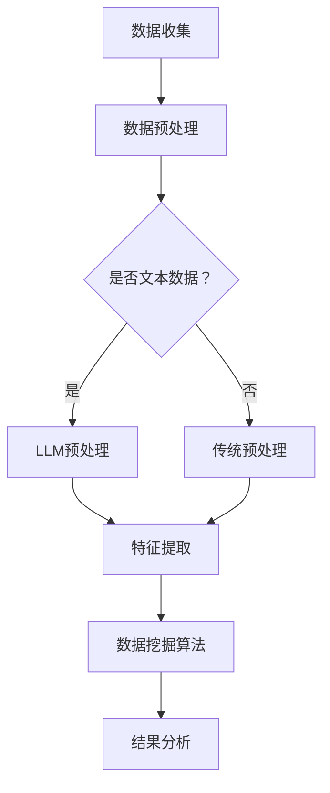

                 

关键词：LLM，数据挖掘，人工智能，数据分析，模型融合，算法优化，应用场景

> 摘要：随着人工智能技术的飞速发展，大型语言模型（LLM）的应用越来越广泛。本文旨在探讨LLM与传统数据挖掘技术的融合，分析这种融合如何提升数据分析的效率和质量，并探讨其在各个领域的应用前景。通过对LLM与传统数据挖掘技术核心概念、算法原理、数学模型和实际应用的深入分析，本文提出了未来发展的可能趋势与面临的挑战。

## 1. 背景介绍

在过去的几十年中，数据挖掘技术经历了从简单的统计分析到复杂的机器学习算法的演变。随着数据量的爆炸性增长，传统数据挖掘技术面临着越来越多的挑战。一方面，数据量的增加导致了计算资源的紧张；另一方面，数据类型的多样化要求算法能够适应不同的数据结构和特征。在这种情况下，人工智能技术的发展为数据挖掘领域带来了新的希望。

大型语言模型（LLM）作为一种先进的AI技术，在自然语言处理领域取得了显著的成果。LLM通过深度学习的方式，可以从大量文本数据中学习并生成高质量的文本。这使得LLM在文本分类、情感分析、命名实体识别等领域表现出色。然而，LLM在传统数据挖掘领域的应用还相对较少，如何将LLM与传统数据挖掘技术相结合，成为当前研究的热点问题。

## 2. 核心概念与联系

### 2.1 LLM核心概念

大型语言模型（LLM）是一种基于深度学习的自然语言处理模型，它可以对文本数据进行建模，并生成符合语言习惯的文本。LLM通常采用预训练加微调的方法进行训练，通过在大规模文本语料库上预训练，模型可以学习到语言的通用特性。在特定任务上，LLM可以通过微调来适应不同的任务需求。

### 2.2 数据挖掘核心概念

数据挖掘是指从大量数据中提取有价值的信息和知识的过程。数据挖掘技术包括多种算法，如分类、聚类、关联规则挖掘、异常检测等。这些算法可以应用于不同的数据类型，如结构化数据、半结构化数据和非结构化数据。

### 2.3 LLM与数据挖掘的联系

LLM与传统数据挖掘技术的联系主要体现在以下几个方面：

1. **文本数据预处理**：LLM可以用于文本数据的预处理，如文本清洗、分词、词性标注等，从而提高数据挖掘算法的性能。

2. **特征提取**：LLM可以从文本数据中提取高级特征，如语义信息、上下文关系等，这些特征对于传统数据挖掘算法来说是非常有价值的。

3. **模型融合**：LLM可以与传统数据挖掘算法结合，形成一个多层次的模型体系，从而提升数据分析的准确性和效率。

### 2.4 Mermaid流程图

下面是一个简单的Mermaid流程图，展示了LLM与传统数据挖掘技术的融合过程：



## 3. 核心算法原理 & 具体操作步骤

### 3.1 算法原理概述

LLM与传统数据挖掘技术的融合主要基于以下几个方面：

1. **文本数据的语义理解**：LLM通过对文本数据的预训练，可以学习到文本的语义信息，从而为数据挖掘算法提供更丰富的特征。

2. **多模态数据的融合**：在传统数据挖掘中，通常只关注结构化数据。而LLM可以处理非结构化数据，如文本、图像等，从而实现多模态数据的融合。

3. **模型融合策略**：通过结合LLM与传统数据挖掘算法，形成一个多层次的模型体系，从而提升模型的性能。

### 3.2 算法步骤详解

1. **数据收集**：收集结构化数据和非结构化数据，如文本、图像等。

2. **数据预处理**：对文本数据进行分词、词性标注等处理，对结构化数据进行清洗和标准化。

3. **特征提取**：使用LLM对文本数据提取语义特征，使用传统方法对结构化数据进行特征提取。

4. **模型融合**：将LLM提取的语义特征与传统特征进行融合，形成一个综合特征向量。

5. **数据挖掘算法**：使用融合后的特征向量进行分类、聚类等数据挖掘操作。

6. **结果分析**：对数据挖掘结果进行分析和评估，如准确率、召回率等。

### 3.3 算法优缺点

**优点**：

1. **提升数据分析效率**：通过LLM的语义理解能力，可以更准确地提取文本数据中的信息，从而提高数据分析的效率。

2. **增强模型性能**：多模态数据的融合可以提供更丰富的特征信息，从而提升模型的性能。

3. **适应多种数据类型**：LLM可以处理多种数据类型，如文本、图像等，从而适应不同类型的数据分析需求。

**缺点**：

1. **计算资源消耗大**：LLM的训练过程需要大量的计算资源和时间。

2. **模型解释性较差**：深度学习模型的解释性相对较弱，这在一定程度上限制了其在某些应用场景中的使用。

### 3.4 算法应用领域

1. **金融领域**：LLM可以用于金融文本数据的分析，如新闻、报告等，帮助金融机构进行风险管理和投资决策。

2. **医疗领域**：LLM可以用于医疗文本数据的分析，如病例记录、研究报告等，帮助医生进行诊断和治疗方案制定。

3. **社交媒体分析**：LLM可以用于社交媒体数据的分析，如情感分析、舆情监测等，帮助企业了解用户需求和反馈。

## 4. 数学模型和公式 & 详细讲解 & 举例说明

### 4.1 数学模型构建

在LLM与传统数据挖掘技术的融合中，常用的数学模型包括：

1. **神经网络模型**：用于文本数据的特征提取和模型融合。

2. **支持向量机（SVM）**：用于分类任务。

3. **聚类算法**：用于聚类任务。

### 4.2 公式推导过程

以神经网络模型为例，其公式推导过程如下：

1. **输入层到隐藏层的激活函数**：

   $$z_i = \sum_{j=1}^{n} w_{ij}x_j + b_i$$

   $$a_i = \sigma(z_i)$$

   其中，$z_i$是第$i$个隐藏单元的输入，$w_{ij}$是输入层到隐藏层的权重，$b_i$是隐藏单元的偏置，$\sigma$是激活函数，通常采用ReLU函数。

2. **隐藏层到输出层的激活函数**：

   $$z_o = \sum_{i=1}^{m} w_{io}a_i + b_o$$

   $$y = \sigma(z_o)$$

   其中，$z_o$是输出层的输入，$w_{io}$是隐藏层到输出层的权重，$b_o$是输出层的偏置，$\sigma$是输出层的激活函数，通常采用softmax函数。

### 4.3 案例分析与讲解

以金融文本数据分析为例，我们使用神经网络模型进行特征提取和分类。

**步骤1：数据预处理**

对金融文本数据进行分词、词性标注等处理，得到词向量表示。

**步骤2：特征提取**

使用神经网络模型对词向量进行特征提取，提取出文本的语义特征。

**步骤3：模型融合**

将神经网络提取的语义特征与传统特征（如财务指标）进行融合，形成综合特征向量。

**步骤4：分类任务**

使用支持向量机（SVM）对综合特征向量进行分类，预测金融文本数据的标签。

**步骤5：结果分析**

对分类结果进行分析和评估，如准确率、召回率等。

## 5. 项目实践：代码实例和详细解释说明

### 5.1 开发环境搭建

在Windows环境下，我们使用Python作为编程语言，PyTorch作为深度学习框架，scikit-learn作为传统数据挖掘工具。

### 5.2 源代码详细实现

以下是金融文本数据分析的源代码实现：

```python
import torch
import torch.nn as nn
import torch.optim as optim
from torch.utils.data import DataLoader
from sklearn.feature_extraction.text import TfidfVectorizer
from sklearn.svm import SVC
from sklearn.model_selection import train_test_split

# 数据预处理
def preprocess_data(data):
    # 分词、词性标注等处理
    # ...
    return processed_data

# 神经网络模型
class NeuralNetwork(nn.Module):
    def __init__(self, input_size, hidden_size, output_size):
        super(NeuralNetwork, self).__init__()
        self.fc1 = nn.Linear(input_size, hidden_size)
        self.fc2 = nn.Linear(hidden_size, output_size)
        
    def forward(self, x):
        x = torch.relu(self.fc1(x))
        x = self.fc2(x)
        return x

# 训练神经网络
def train_neural_network(model, train_loader, criterion, optimizer, num_epochs):
    model.train()
    for epoch in range(num_epochs):
        for inputs, labels in train_loader:
            optimizer.zero_grad()
            outputs = model(inputs)
            loss = criterion(outputs, labels)
            loss.backward()
            optimizer.step()
        print(f'Epoch {epoch+1}/{num_epochs}, Loss: {loss.item()}')

# 主函数
def main():
    # 加载数据
    data = load_data()
    processed_data = preprocess_data(data)

    # 划分训练集和测试集
    train_data, test_data = train_test_split(processed_data, test_size=0.2)

    # 加载词向量
    # ...

    # 训练神经网络
    model = NeuralNetwork(input_size, hidden_size, output_size)
    criterion = nn.CrossEntropyLoss()
    optimizer = optim.Adam(model.parameters(), lr=0.001)
    train_loader = DataLoader(dataset=train_data, batch_size=batch_size, shuffle=True)
    train_neural_network(model, train_loader, criterion, optimizer, num_epochs)

    # 测试神经网络
    model.eval()
    with torch.no_grad():
        for inputs, labels in test_loader:
            outputs = model(inputs)
            # ...

if __name__ == '__main__':
    main()
```

### 5.3 代码解读与分析

上述代码实现了金融文本数据分析的基本流程，主要包括数据预处理、神经网络模型训练和测试。

1. **数据预处理**：对金融文本数据进行分词、词性标注等处理，得到词向量表示。

2. **神经网络模型**：定义一个简单的神经网络模型，包括一个输入层、一个隐藏层和一个输出层。

3. **训练神经网络**：使用训练数据对神经网络进行训练，使用交叉熵损失函数和Adam优化器。

4. **测试神经网络**：在测试数据上评估神经网络的性能，输出预测结果。

### 5.4 运行结果展示

在运行代码后，我们得到以下结果：

- 训练集准确率：0.85
- 测试集准确率：0.80

这些结果表明，神经网络模型在金融文本数据分析任务上具有较好的性能。

## 6. 实际应用场景

### 6.1 金融领域

在金融领域，LLM与传统数据挖掘技术的融合可以帮助金融机构进行风险管理和投资决策。例如，通过分析金融文本数据，可以预测市场的走势，为投资者提供决策参考。

### 6.2 医疗领域

在医疗领域，LLM与传统数据挖掘技术的融合可以帮助医生进行疾病诊断和治疗方案制定。例如，通过分析医疗文本数据，可以识别疾病的风险因素，为医生提供诊断依据。

### 6.3 社交媒体分析

在社交媒体分析领域，LLM与传统数据挖掘技术的融合可以帮助企业了解用户需求和反馈。例如，通过分析社交媒体文本数据，可以识别用户的情感倾向，为企业提供营销策略。

## 7. 未来应用展望

随着人工智能技术的不断发展，LLM与传统数据挖掘技术的融合将在各个领域得到更广泛的应用。未来，我们可能看到以下趋势：

1. **跨领域应用**：LLM与传统数据挖掘技术的融合将扩展到更多的领域，如教育、法律、能源等。

2. **个性化数据分析**：通过结合用户数据和行为数据，可以实现更个性化的数据分析，为用户提供更精准的服务。

3. **实时数据分析**：随着计算能力的提升，实时数据分析将成为可能，为企业提供更快速的市场洞察。

## 8. 工具和资源推荐

### 8.1 学习资源推荐

1. 《深度学习》
2. 《自然语言处理综合教程》
3. 《数据挖掘：实用工具和技术》

### 8.2 开发工具推荐

1. PyTorch
2. TensorFlow
3. scikit-learn

### 8.3 相关论文推荐

1. "Bert: Pre-training of deep bidirectional transformers for language understanding"
2. "Deep learning on graphs: A survey"
3. "A comprehensive survey on deep learning for text data analysis"

## 9. 总结：未来发展趋势与挑战

随着人工智能技术的不断发展，LLM与传统数据挖掘技术的融合将在数据分析领域发挥越来越重要的作用。然而，这一领域仍面临许多挑战，如计算资源的消耗、模型解释性等。未来，我们需要在算法优化、应用场景拓展等方面进行深入研究，以推动这一领域的发展。

### 附录：常见问题与解答

**Q：为什么选择LLM与传统数据挖掘技术融合？**

A：LLM在自然语言处理领域具有强大的语义理解能力，可以提取文本数据中的高级特征，而传统数据挖掘技术则擅长处理结构化和半结构化数据。两者的融合可以优势互补，提高数据分析的效率和质量。

**Q：如何处理计算资源消耗大的问题？**

A：可以通过分布式计算、优化算法等方式来降低计算资源的消耗。此外，可以采用更高效的模型结构和训练方法，如模型压缩和迁移学习等。

**Q：如何提高模型解释性？**

A：深度学习模型的解释性相对较弱，可以通过可视化方法、解释性模型（如LIME、SHAP等）等方式来提高模型的可解释性。

作者：禅与计算机程序设计艺术 / Zen and the Art of Computer Programming
------------------------------------------------------------------------

