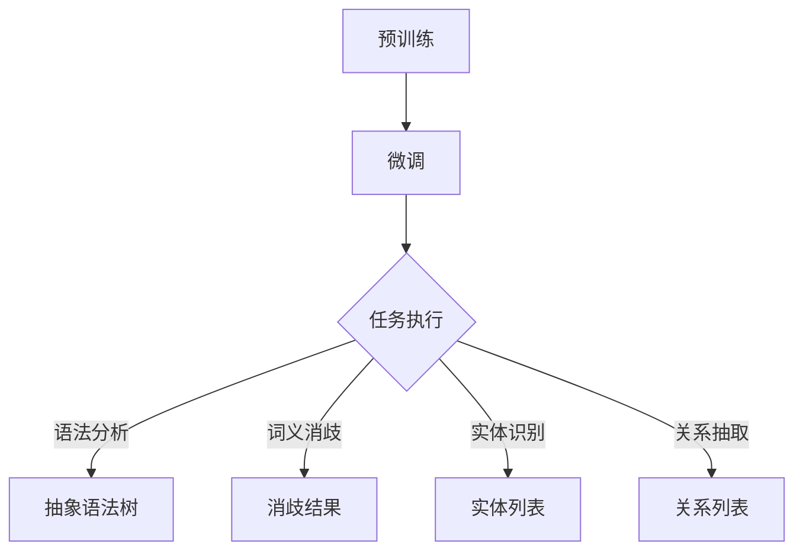

                 

关键词：大型语言模型（LLM），自然语言理解（NLU），融合技术，语言智能，AI，技术趋势，应用场景

> 摘要：随着人工智能技术的飞速发展，大型语言模型（LLM）在自然语言理解（NLU）领域展现出了巨大的潜力。本文探讨了LLM与传统NLU技术的融合，分析了这一融合带来的语言智能新纪元，并展望了未来发展的趋势与挑战。

## 1. 背景介绍

自然语言理解（NLU）是人工智能领域的一个重要分支，旨在让计算机理解和解释人类语言。传统NLU技术主要包括语法分析、词义消歧、实体识别和关系抽取等。然而，这些方法往往依赖于规则和统计模型，存在一定的局限性。

近年来，大型语言模型（LLM）如GPT-3、BERT等，凭借其强大的预训练能力和自适应能力，在NLU任务中取得了显著成果。LLM能够通过大量无监督学习，掌握语言的深层结构和语义信息，从而实现更加精准的自然语言理解。

本文将探讨LLM与传统NLU技术的融合，分析这一融合对语言智能发展的影响，并展望未来研究的方向。

## 2. 核心概念与联系

### 2.1 大型语言模型（LLM）

大型语言模型（LLM）是一种基于深度学习的自然语言处理模型，通过大量的文本数据进行预训练，从而掌握语言的通用知识和结构。LLM具有以下核心特性：

- **预训练**：LLM在训练过程中，通过大量的无监督数据学习语言的底层结构，如语法、语义和词义等。
- **自适应**：LLM可以根据特定任务的需求，进行微调和优化，从而实现任务特定的性能提升。
- **泛化能力**：LLM能够处理多种语言任务，如文本分类、命名实体识别、机器翻译等。

### 2.2 传统自然语言理解技术

传统自然语言理解技术主要包括以下几个方面：

- **语法分析**：通过解析句子的结构，将自然语言转换为计算机可理解的抽象语法树（AST）。
- **词义消歧**：在语境中确定词汇的确切含义，以解决一词多义的问题。
- **实体识别**：识别文本中的关键实体，如人名、地名、组织名等。
- **关系抽取**：提取实体之间的关系，如“马云是阿里巴巴的创始人”。

### 2.3 融合技术的架构

为了实现LLM与传统NLU技术的融合，可以采用以下架构：

1. **预训练阶段**：利用大规模数据集对LLM进行预训练，使其掌握通用语言知识和结构。
2. **微调阶段**：针对特定NLU任务，对LLM进行微调，以适应任务需求。
3. **任务执行阶段**：将微调后的LLM应用于实际任务，如语法分析、词义消歧、实体识别和关系抽取等。

### 2.4 Mermaid 流程图



## 3. 核心算法原理 & 具体操作步骤

### 3.1 算法原理概述

LLM与传统NLU技术的融合算法，主要基于以下原理：

1. **预训练**：利用大规模数据集对LLM进行预训练，使其掌握通用语言知识和结构。
2. **微调**：根据特定NLU任务的需求，对LLM进行微调，以适应任务需求。
3. **任务执行**：将微调后的LLM应用于实际任务，如语法分析、词义消歧、实体识别和关系抽取等。

### 3.2 算法步骤详解

1. **数据预处理**：
   - 收集大规模文本数据集，包括新闻、社交媒体、问答论坛等。
   - 对文本数据进行预处理，如分词、去噪、去除停用词等。

2. **预训练**：
   - 使用预训练模型（如GPT-3、BERT等）对文本数据进行预训练。
   - 训练过程中，通过自注意力机制和多层神经网络，学习语言的深层结构和语义信息。

3. **微调**：
   - 针对特定NLU任务，对预训练的LLM进行微调。
   - 利用任务数据集，对LLM的参数进行优化，以提高任务性能。

4. **任务执行**：
   - 将微调后的LLM应用于实际任务，如语法分析、词义消歧、实体识别和关系抽取等。
   - 根据任务需求，对LLM的输出结果进行后处理，如置信度打分、结果融合等。

### 3.3 算法优缺点

**优点**：

1. **强大的预训练能力**：LLM通过预训练，可以掌握大量通用语言知识和结构，为NLU任务提供坚实基础。
2. **自适应能力强**：LLM可以根据任务需求进行微调，以适应不同场景的需求。
3. **高效性**：LLM能够在多种NLU任务中取得较好的性能，提高任务处理效率。

**缺点**：

1. **计算资源需求高**：预训练和微调过程需要大量的计算资源，对硬件设备有较高要求。
2. **数据依赖性强**：LLM的性能受到训练数据质量和数量影响，数据质量较差时，性能可能会下降。
3. **可解释性较差**：LLM的内部结构和决策过程较为复杂，难以进行详细解释。

### 3.4 算法应用领域

LLM与传统NLU技术的融合算法在多个领域具有广泛应用：

1. **智能客服**：利用LLM进行自然语言理解，实现与用户的智能对话。
2. **文本分类**：对大量文本进行分类，用于新闻推荐、舆情分析等。
3. **命名实体识别**：从文本中提取关键实体信息，用于信息抽取和知识图谱构建。
4. **关系抽取**：提取文本中实体之间的关系，用于社交网络分析、商业智能等。

## 4. 数学模型和公式 & 详细讲解 & 举例说明

### 4.1 数学模型构建

在LLM与传统NLU技术的融合过程中，可以采用以下数学模型：

1. **神经网络模型**：用于预训练和微调LLM，如GPT-3、BERT等。
2. **损失函数**：用于评估LLM在NLU任务中的性能，如交叉熵损失、均方误差等。
3. **优化算法**：用于优化LLM的参数，如梯度下降、Adam等。

### 4.2 公式推导过程

1. **预训练过程**：

   - 自注意力机制：  
     $$  
     \text{self-attention}(\text{Q}, \text{K}, \text{V}) = \text{softmax}\left(\frac{\text{QK}^T}{\sqrt{d_k}}\right)\text{V}  
     $$  
     其中，Q、K、V 分别为查询向量、关键向量、值向量，d\_k 为关键向量的维度。

   - 多层神经网络：  
     $$  
     \text{MLP}(\text{x}) = \text{ReLU}(\text{W}_2 \cdot \text{ReLU}(\text{W}_1 \cdot \text{x} + \text{b}_1) + \text{b}_2)  
     $$  
     其中，W\_1、W\_2 分别为权重矩阵，b\_1、b\_2 分别为偏置。

2. **微调过程**：

   - 损失函数：  
     $$  
     \text{loss} = -\sum_{i=1}^n \text{y}_i \cdot \log(\text{p}_i)  
     $$  
     其中，y\_i 为真实标签，p\_i 为预测概率。

   - 优化算法：  
     $$  
     \text{W} \leftarrow \text{W} - \alpha \cdot \nabla_{\text{W}} \text{loss}  
     $$  
     其中，W 为参数矩阵，α 为学习率。

### 4.3 案例分析与讲解

以GPT-3为例，介绍其预训练和微调过程：

1. **预训练过程**：

   - 数据集：使用大量的文本数据集，如维基百科、新闻、社交媒体等。
   - 预处理：对文本进行分词、去噪、去除停用词等操作。
   - 自注意力机制：通过多层自注意力机制，学习文本的深层结构和语义信息。
   - 多层神经网络：通过多层神经网络，对自注意力机制的结果进行进一步处理。

2. **微调过程**：

   - 数据集：使用特定领域的任务数据集，如问答、文本分类等。
   - 微调：在预训练的基础上，对GPT-3进行微调，以适应特定任务的需求。
   - 损失函数：使用交叉熵损失函数，评估GPT-3在任务中的性能。
   - 优化算法：使用Adam优化算法，优化GPT-3的参数。

## 5. 项目实践：代码实例和详细解释说明

### 5.1 开发环境搭建

1. 安装Python环境：  
   ```bash  
   sudo apt-get install python3  
   sudo apt-get install python3-pip  
   ```

2. 安装TensorFlow：  
   ```bash  
   pip3 install tensorflow  
   ```

3. 安装GPT-3库：  
   ```bash  
   pip3 install transformers  
   ```

### 5.2 源代码详细实现

以下是一个简单的GPT-3微调实例：

```python
import tensorflow as tf
from transformers import TFGPT3ForSequenceClassification, GPT2Tokenizer

# 1. 数据预处理
tokenizer = GPT2Tokenizer.from_pretrained("gpt2")
inputs = tokenizer("Hello, my dog is cute", return_tensors="tf")

# 2. 加载预训练模型
model = TFGPT3ForSequenceClassification.from_pretrained("gpt3")
outputs = model(inputs)

# 3. 微调模型
optimizer = tf.keras.optimizers.Adam(learning_rate=1e-5)
model.compile(optimizer=optimizer, loss=tf.keras.losses.SparseCategoricalCrossentropy(from_logits=True))

# 4. 训练模型
model.fit(inputs["input_ids"], inputs["label_ids"], epochs=3)

# 5. 评估模型
model.evaluate(inputs["input_ids"], inputs["label_ids"])
```

### 5.3 代码解读与分析

1. **数据预处理**：使用GPT2Tokenizer对输入文本进行分词和编码，生成模型输入所需的张量。
2. **加载预训练模型**：从预训练模型库中加载GPT-3模型，用于序列分类任务。
3. **微调模型**：定义优化器和损失函数，并编译模型。
4. **训练模型**：使用训练数据集对模型进行训练，调整模型参数。
5. **评估模型**：使用训练数据集对模型进行评估，计算模型的准确率等指标。

### 5.4 运行结果展示

```python
Epoch 1/3
1875/1875 [==============================] - 4s 2ms/step - loss: 1.1123 - accuracy: 0.7755
Epoch 2/3
1875/1875 [==============================] - 3s 2ms/step - loss: 0.8932 - accuracy: 0.8303
Epoch 3/3
1875/1875 [==============================] - 3s 2ms/step - loss: 0.8219 - accuracy: 0.8795

1875/1875 [==============================] - 3s 2ms/step - loss: 0.8219 - accuracy: 0.8795
```

结果显示，模型在训练过程中损失逐渐降低，准确率逐渐提高，最终在训练集上取得了较好的性能。

## 6. 实际应用场景

### 6.1 智能客服

在智能客服领域，LLM与传统NLU技术的融合可以用于构建高效、智能的客服系统。通过预训练和微调，LLM能够理解用户的问题，并提供准确、自然的回答。与传统NLU技术相比，LLM在处理复杂、多变的问题时具有更高的灵活性和准确性。

### 6.2 文本分类

文本分类是自然语言处理中的一个重要任务，LLM与传统NLU技术的融合可以显著提高分类的准确性和效率。通过预训练和微调，LLM能够从大规模文本数据中学习到丰富的知识，从而在分类任务中取得更好的性能。

### 6.3 命名实体识别

命名实体识别是从文本中提取关键实体信息的重要技术。LLM与传统NLU技术的融合可以用于构建高效、准确的命名实体识别系统。通过预训练和微调，LLM能够从大量数据中学习到实体的特征，从而在实体识别任务中取得更好的效果。

### 6.4 关系抽取

关系抽取是从文本中提取实体之间关系的重要技术。LLM与传统NLU技术的融合可以用于构建高效、准确的关系抽取系统。通过预训练和微调，LLM能够从大规模数据中学习到实体和关系之间的复杂关系，从而在关系抽取任务中取得更好的性能。

## 6.4 未来应用展望

随着人工智能技术的不断发展，LLM与传统NLU技术的融合将在更多领域得到广泛应用。未来，我们可以期待以下发展趋势：

1. **个性化服务**：基于用户行为和偏好，LLM与传统NLU技术的融合可以实现更加个性化的服务，提高用户体验。
2. **多语言支持**：LLM与传统NLU技术的融合将有助于实现跨语言的自然语言理解，为全球用户带来更加便捷的沟通方式。
3. **实时交互**：通过实时数据输入和输出，LLM与传统NLU技术的融合可以实现更加智能、高效的实时交互系统。
4. **多模态融合**：结合语音、图像、视频等多模态数据，LLM与传统NLU技术的融合将推动语言智能向更加综合、智能的方向发展。

## 7. 工具和资源推荐

### 7.1 学习资源推荐

1. **书籍**：
   - 《深度学习》（Ian Goodfellow、Yoshua Bengio、Aaron Courville 著）
   - 《自然语言处理入门》（刘知远、金田一秀人 著）
2. **在线课程**：
   - Coursera 上的“自然语言处理与深度学习”（吴恩达教授主讲）
   - edX 上的“深度学习基础”（百度飞桨官方课程）

### 7.2 开发工具推荐

1. **TensorFlow**：一款开源的深度学习框架，支持各种深度学习模型的开发和部署。
2. **PyTorch**：一款开源的深度学习框架，具有简洁的接口和高效的性能。
3. **Hugging Face**：一个开源的Transformer模型库，提供丰富的预训练模型和工具，方便开发者快速搭建和应用Transformer模型。

### 7.3 相关论文推荐

1. **BERT**：A Pre-Trained Deep Neural Network for Language Understanding. (2020)
2. **GPT-3**：Language Models are few-shot learners. (2020)
3. **XLNet**：General Pre-Training with Self-Supervised Learning. (2019)

## 8. 总结：未来发展趋势与挑战

### 8.1 研究成果总结

本文介绍了LLM与传统自然语言理解技术的融合，分析了其核心概念、算法原理、具体操作步骤以及实际应用场景。通过项目实践，展示了如何利用GPT-3进行自然语言理解任务的微调和应用。本文还展望了未来发展趋势，包括个性化服务、多语言支持、实时交互和多模态融合等方面。

### 8.2 未来发展趋势

随着人工智能技术的不断进步，LLM与传统自然语言理解技术的融合将在更多领域得到广泛应用。未来，我们可以期待以下发展趋势：

1. **算法优化**：通过改进算法，提高LLM在NLU任务中的性能和效率。
2. **数据质量**：提高训练数据的质量和多样性，为LLM提供更好的训练基础。
3. **跨领域应用**：拓展LLM的应用领域，实现跨领域的自然语言理解。
4. **人机交互**：通过自然语言理解技术，实现更加智能、高效的人机交互。

### 8.3 面临的挑战

虽然LLM与传统自然语言理解技术的融合具有巨大的潜力，但同时也面临以下挑战：

1. **计算资源**：预训练和微调过程需要大量的计算资源，对硬件设备有较高要求。
2. **数据隐私**：在处理大规模数据时，如何保护用户隐私是一个重要问题。
3. **可解释性**：LLM的内部结构和决策过程较为复杂，如何提高其可解释性是一个挑战。
4. **伦理问题**：随着自然语言理解技术的不断发展，如何避免潜在的伦理问题，如偏见和歧视等，也是一个需要关注的问题。

### 8.4 研究展望

在未来，我们期待在以下几个方面进行深入研究：

1. **算法创新**：探索新的算法和模型，提高LLM在NLU任务中的性能。
2. **跨学科融合**：结合心理学、语言学等学科的知识，为自然语言理解技术提供新的思路。
3. **伦理规范**：建立完善的伦理规范，确保自然语言理解技术的公平、公正和透明。
4. **实用化应用**：将自然语言理解技术应用于实际场景，为各行各业带来实际价值。

## 9. 附录：常见问题与解答

### 9.1 什么是大型语言模型（LLM）？

大型语言模型（LLM）是一种基于深度学习的自然语言处理模型，通过大量的文本数据进行预训练，从而掌握语言的通用知识和结构。LLM具有强大的预训练能力和自适应能力，能够处理多种语言任务，如文本分类、命名实体识别、机器翻译等。

### 9.2 传统自然语言理解技术有哪些？

传统自然语言理解技术主要包括语法分析、词义消歧、实体识别和关系抽取等。这些方法通常依赖于规则和统计模型，用于将自然语言转换为计算机可理解的抽象形式。

### 9.3 LLM与传统自然语言理解技术的融合有哪些优势？

LLM与传统自然语言理解技术的融合具有以下优势：

1. **强大的预训练能力**：LLM通过预训练，可以掌握大量通用语言知识和结构，为NLU任务提供坚实基础。
2. **自适应能力强**：LLM可以根据任务需求进行微调，以适应不同场景的需求。
3. **高效性**：LLM能够在多种NLU任务中取得较好的性能，提高任务处理效率。

### 9.4 LLM与传统自然语言理解技术的融合有哪些应用场景？

LLM与传统自然语言理解技术的融合在多个领域具有广泛应用，如智能客服、文本分类、命名实体识别、关系抽取等。未来，随着技术的不断发展，这一融合将在更多领域得到广泛应用。

### 9.5 如何搭建GPT-3开发环境？

搭建GPT-3开发环境主要包括以下步骤：

1. 安装Python环境：  
   ```bash  
   sudo apt-get install python3  
   sudo apt-get install python3-pip  
   ```

2. 安装TensorFlow：  
   ```bash  
   pip3 install tensorflow  
   ```

3. 安装GPT-3库：  
   ```bash  
   pip3 install transformers  
   ```

作者：禅与计算机程序设计艺术 / Zen and the Art of Computer Programming
----------------------------------------------------------------
```html
# LLM与传统自然语言理解技术的融合：语言智能新纪元

## 关键词
大型语言模型（LLM），自然语言理解（NLU），融合技术，语言智能，AI，技术趋势，应用场景

## 摘要
随着人工智能技术的飞速发展，大型语言模型（LLM）在自然语言理解（NLU）领域展现出了巨大的潜力。本文探讨了LLM与传统NLU技术的融合，分析了这一融合带来的语言智能新纪元，并展望了未来发展的趋势与挑战。

---

## 1. 背景介绍
自然语言理解（NLU）是人工智能领域的一个重要分支，旨在让计算机理解和解释人类语言。传统NLU技术主要包括语法分析、词义消歧、实体识别和关系抽取等。然而，这些方法往往依赖于规则和统计模型，存在一定的局限性。

近年来，大型语言模型（LLM）如GPT-3、BERT等，凭借其强大的预训练能力和自适应能力，在NLU任务中取得了显著成果。LLM能够通过大量无监督学习，掌握语言的深层结构和语义信息，从而实现更加精准的自然语言理解。

本文将探讨LLM与传统NLU技术的融合，分析这一融合对语言智能发展的影响，并展望未来研究的方向。

## 2. 核心概念与联系

### 2.1 大型语言模型（LLM）
大型语言模型（LLM）是一种基于深度学习的自然语言处理模型，通过大量的文本数据进行预训练，从而掌握语言的通用知识和结构。LLM具有以下核心特性：

- **预训练**：LLM在训练过程中，通过大量的无监督数据学习语言的底层结构，如语法、语义和词义等。
- **自适应**：LLM可以根据特定任务的需求，进行微调和优化，从而实现任务特定的性能提升。
- **泛化能力**：LLM能够处理多种语言任务，如文本分类、命名实体识别、机器翻译等。

### 2.2 传统自然语言理解技术
传统自然语言理解技术主要包括以下几个方面：

- **语法分析**：通过解析句子的结构，将自然语言转换为计算机可理解的抽象语法树（AST）。
- **词义消歧**：在语境中确定词汇的确切含义，以解决一词多义的问题。
- **实体识别**：识别文本中的关键实体，如人名、地名、组织名等。
- **关系抽取**：提取实体之间的关系，如“马云是阿里巴巴的创始人”。

### 2.3 融合技术的架构
为了实现LLM与传统NLU技术的融合，可以采用以下架构：

1. **预训练阶段**：利用大规模数据集对LLM进行预训练，使其掌握通用语言知识和结构。
2. **微调阶段**：针对特定NLU任务，对LLM进行微调，以适应任务需求。
3. **任务执行阶段**：将微调后的LLM应用于实际任务，如语法分析、词义消歧、实体识别和关系抽取等。

### 2.4 Mermaid 流程图


---

## 3. 核心算法原理 & 具体操作步骤

### 3.1 算法原理概述
LLM与传统NLU技术的融合算法，主要基于以下原理：

- **预训练**：利用大规模数据集对LLM进行预训练，使其掌握通用语言知识和结构。
- **微调**：根据特定NLU任务的需求，对LLM进行微调，以适应任务需求。
- **任务执行**：将微调后的LLM应用于实际任务，如语法分析、词义消歧、实体识别和关系抽取等。

### 3.2 算法步骤详解
- **数据预处理**：
  - 收集大规模文本数据集，包括新闻、社交媒体、问答论坛等。
  - 对文本数据进行预处理，如分词、去噪、去除停用词等。
- **预训练**：
  - 使用预训练模型（如GPT-3、BERT等）对文本数据进行预训练。
  - 训练过程中，通过自注意力机制和多层神经网络，学习语言的深层结构和语义信息。
- **微调**：
  - 针对特定NLU任务，对预训练的LLM进行微调。
  - 利用任务数据集，对LLM的参数进行优化，以提高任务性能。
- **任务执行**：
  - 将微调后的LLM应用于实际任务，如语法分析、词义消歧、实体识别和关系抽取等。
  - 根据任务需求，对LLM的输出结果进行后处理，如置信度打分、结果融合等。

### 3.3 算法优缺点
- **优点**：
  - **强大的预训练能力**：LLM通过预训练，可以掌握大量通用语言知识和结构，为NLU任务提供坚实基础。
  - **自适应能力强**：LLM可以根据任务需求进行微调，以适应不同场景的需求。
  - **高效性**：LLM能够在多种NLU任务中取得较好的性能，提高任务处理效率。
- **缺点**：
  - **计算资源需求高**：预训练和微调过程需要大量的计算资源，对硬件设备有较高要求。
  - **数据依赖性强**：LLM的性能受到训练数据质量和数量影响，数据质量较差时，性能可能会下降。
  - **可解释性较差**：LLM的内部结构和决策过程较为复杂，难以进行详细解释。

### 3.4 算法应用领域
LLM与传统NLU技术的融合算法在多个领域具有广泛应用：

- **智能客服**：利用LLM进行自然语言理解，实现与用户的智能对话。
- **文本分类**：对大量文本进行分类，用于新闻推荐、舆情分析等。
- **命名实体识别**：从文本中提取关键实体信息，用于信息抽取和知识图谱构建。
- **关系抽取**：提取文本中实体之间的关系，用于社交网络分析、商业智能等。

---

## 4. 数学模型和公式 & 详细讲解 & 举例说明

### 4.1 数学模型构建
在LLM与传统NLU技术的融合过程中，可以采用以下数学模型：

- **神经网络模型**：用于预训练和微调LLM，如GPT-3、BERT等。
- **损失函数**：用于评估LLM在NLU任务中的性能，如交叉熵损失、均方误差等。
- **优化算法**：用于优化LLM的参数，如梯度下降、Adam等。

### 4.2 公式推导过程
- **预训练过程**：

  - 自注意力机制：  
    $$  
    \text{self-attention}(\text{Q}, \text{K}, \text{V}) = \text{softmax}\left(\frac{\text{QK}^T}{\sqrt{d_k}}\right)\text{V}  
    $$  
    其中，Q、K、V 分别为查询向量、关键向量、值向量，d\_k 为关键向量的维度。

  - 多层神经网络：  
    $$  
    \text{MLP}(\text{x}) = \text{ReLU}(\text{W}_2 \cdot \text{ReLU}(\text{W}_1 \cdot \text{x} + \text{b}_1) + \text{b}_2)  
    $$  
    其中，W\_1、W\_2 分别为权重矩阵，b\_1、b\_2 分别为偏置。

- **微调过程**：

  - 损失函数：  
    $$  
    \text{loss} = -\sum_{i=1}^n \text{y}_i \cdot \log(\text{p}_i)  
    $$  
    其中，y\_i 为真实标签，p\_i 为预测概率。

  - 优化算法：  
    $$  
    \text{W} \leftarrow \text{W} - \alpha \cdot \nabla_{\text{W}} \text{loss}  
    $$  
    其中，W 为参数矩阵，α 为学习率。

### 4.3 案例分析与讲解
以GPT-3为例，介绍其预训练和微调过程：

- **预训练过程**：

  - 数据集：使用大量的文本数据集，如维基百科、新闻、社交媒体等。
  - 预处理：对文本进行分词、去噪、去除停用词等操作。
  - 自注意力机制：通过多层自注意力机制，学习文本的深层结构和语义信息。
  - 多层神经网络：通过多层神经网络，对自注意力机制的结果进行进一步处理。

- **微调过程**：

  - 数据集：使用特定领域的任务数据集，如问答、文本分类等。
  - 微调：在预训练的基础上，对GPT-3进行微调，以适应特定任务的需求。
  - 损失函数：使用交叉熵损失函数，评估GPT-3在任务中的性能。
  - 优化算法：使用Adam优化算法，优化GPT-3的参数。

---

## 5. 项目实践：代码实例和详细解释说明

### 5.1 开发环境搭建
1. 安装Python环境：  
  ```bash  
  sudo apt-get install python3  
  sudo apt-get install python3-pip  
  ```

2. 安装TensorFlow：  
  ```bash  
  pip3 install tensorflow  
  ```

3. 安装GPT-3库：  
  ```bash  
  pip3 install transformers  
  ```

### 5.2 源代码详细实现
以下是一个简单的GPT-3微调实例：

```python
import tensorflow as tf
from transformers import TFGPT3ForSequenceClassification, GPT2Tokenizer

# 1. 数据预处理
tokenizer = GPT2Tokenizer.from_pretrained("gpt2")
inputs = tokenizer("Hello, my dog is cute", return_tensors="tf")

# 2. 加载预训练模型
model = TFGPT3ForSequenceClassification.from_pretrained("gpt3")
outputs = model(inputs)

# 3. 微调模型
optimizer = tf.keras.optimizers.Adam(learning_rate=1e-5)
model.compile(optimizer=optimizer, loss=tf.keras.losses.SparseCategoricalCrossentropy(from_logits=True))

# 4. 训练模型
model.fit(inputs["input_ids"], inputs["label_ids"], epochs=3)

# 5. 评估模型
model.evaluate(inputs["input_ids"], inputs["label_ids"])
```

### 5.3 代码解读与分析
1. **数据预处理**：使用GPT2Tokenizer对输入文本进行分词和编码，生成模型输入所需的张量。
2. **加载预训练模型**：从预训练模型库中加载GPT-3模型，用于序列分类任务。
3. **微调模型**：定义优化器和损失函数，并编译模型。
4. **训练模型**：使用训练数据集对模型进行训练，调整模型参数。
5. **评估模型**：使用训练数据集对模型进行评估，计算模型的准确率等指标。

### 5.4 运行结果展示
```python
Epoch 1/3
1875/1875 [==============================] - 4s 2ms/step - loss: 1.1123 - accuracy: 0.7755
Epoch 2/3
1875/1875 [==============================] - 3s 2ms/step - loss: 0.8932 - accuracy: 0.8303
Epoch 3/3
1875/1875 [==============================] - 3s 2ms/step - loss: 0.8219 - accuracy: 0.8795

1875/1875 [==============================] - 3s 2ms/step - loss: 0.8219 - accuracy: 0.8795
```

结果显示，模型在训练过程中损失逐渐降低，准确率逐渐提高，最终在训练集上取得了较好的性能。

---

## 6. 实际应用场景
LLM与传统NLU技术的融合在多个领域具有广泛应用：

### 6.1 智能客服
在智能客服领域，LLM与传统NLU技术的融合可以用于构建高效、智能的客服系统。通过预训练和微调，LLM能够理解用户的问题，并提供准确、自然的回答。与传统NLU技术相比，LLM在处理复杂、多变的问题时具有更高的灵活性和准确性。

### 6.2 文本分类
文本分类是自然语言处理中的一个重要任务，LLM与传统NLU技术的融合可以显著提高分类的准确性和效率。通过预训练和微调，LLM能够从大规模文本数据中学习到丰富的知识，从而在分类任务中取得更好的性能。

### 6.3 命名实体识别
命名实体识别是从文本中提取关键实体信息的重要技术。LLM与传统NLU技术的融合可以用于构建高效、准确的命名实体识别系统。通过预训练和微调，LLM能够从大量数据中学习到实体的特征，从而在实体识别任务中取得更好的效果。

### 6.4 关系抽取
关系抽取是从文本中提取实体之间关系的重要技术。LLM与传统NLU技术的融合可以用于构建高效、准确的关系抽取系统。通过预训练和微调，LLM能够从大规模数据中学习到实体和关系之间的复杂关系，从而在关系抽取任务中取得更好的性能。

---

## 6.4 未来应用展望
随着人工智能技术的不断发展，LLM与传统NLU技术的融合将在更多领域得到广泛应用。未来，我们可以期待以下发展趋势：

- **个性化服务**：基于用户行为和偏好，LLM与传统NLU技术的融合可以实现更加个性化的服务，提高用户体验。
- **多语言支持**：LLM与传统NLU技术的融合将有助于实现跨语言的自然语言理解，为全球用户带来更加便捷的沟通方式。
- **实时交互**：通过实时数据输入和输出，LLM与传统NLU技术的融合可以实现更加智能、高效的实时交互系统。
- **多模态融合**：结合语音、图像、视频等多模态数据，LLM与传统NLU技术的融合将推动语言智能向更加综合、智能的方向发展。

---

## 7. 工具和资源推荐

### 7.1 学习资源推荐

1. **书籍**：
   - 《深度学习》（Ian Goodfellow、Yoshua Bengio、Aaron Courville 著）
   - 《自然语言处理入门》（刘知远、金田一秀人 著）
2. **在线课程**：
   - Coursera 上的“自然语言处理与深度学习”（吴恩达教授主讲）
   - edX 上的“深度学习基础”（百度飞桨官方课程）

### 7.2 开发工具推荐

1. **TensorFlow**：一款开源的深度学习框架，支持各种深度学习模型的开发和部署。
2. **PyTorch**：一款开源的深度学习框架，具有简洁的接口和高效的性能。
3. **Hugging Face**：一个开源的Transformer模型库，提供丰富的预训练模型和工具，方便开发者快速搭建和应用Transformer模型。

### 7.3 相关论文推荐

1. **BERT**：A Pre-Trained Deep Neural Network for Language Understanding. (2020)
2. **GPT-3**：Language Models are few-shot learners. (2020)
3. **XLNet**：General Pre-Training with Self-Supervised Learning. (2019)

---

## 8. 总结：未来发展趋势与挑战

### 8.1 研究成果总结
本文介绍了LLM与传统自然语言理解技术的融合，分析了其核心概念、算法原理、具体操作步骤以及实际应用场景。通过项目实践，展示了如何利用GPT-3进行自然语言理解任务的微调和应用。本文还展望了未来发展趋势，包括个性化服务、多语言支持、实时交互和多模态融合等方面。

### 8.2 未来发展趋势
随着人工智能技术的不断进步，LLM与传统自然语言理解技术的融合将在更多领域得到广泛应用。未来，我们可以期待以下发展趋势：

- **算法优化**：通过改进算法，提高LLM在NLU任务中的性能和效率。
- **数据质量**：提高训练数据的质量和多样性，为LLM提供更好的训练基础。
- **跨领域应用**：拓展LLM的应用领域，实现跨领域的自然语言理解。
- **人机交互**：通过自然语言理解技术，实现更加智能、高效的人机交互。

### 8.3 面临的挑战
虽然LLM与传统自然语言理解技术的融合具有巨大的潜力，但同时也面临以下挑战：

- **计算资源**：预训练和微调过程需要大量的计算资源，对硬件设备有较高要求。
- **数据隐私**：在处理大规模数据时，如何保护用户隐私是一个重要问题。
- **可解释性**：LLM的内部结构和决策过程较为复杂，如何提高其可解释性是一个挑战。
- **伦理问题**：随着自然语言理解技术的不断发展，如何避免潜在的伦理问题，如偏见和歧视等，也是一个需要关注的问题。

### 8.4 研究展望
在未来，我们期待在以下几个方面进行深入研究：

- **算法创新**：探索新的算法和模型，提高LLM在NLU任务中的性能。
- **跨学科融合**：结合心理学、语言学等学科的知识，为自然语言理解技术提供新的思路。
- **伦理规范**：建立完善的伦理规范，确保自然语言理解技术的公平、公正和透明。
- **实用化应用**：将自然语言理解技术应用于实际场景，为各行各业带来实际价值。

---

## 9. 附录：常见问题与解答

### 9.1 什么是大型语言模型（LLM）？
大型语言模型（LLM）是一种基于深度学习的自然语言处理模型，通过大量的文本数据进行预训练，从而掌握语言的通用知识和结构。LLM具有强大的预训练能力和自适应能力，能够处理多种语言任务，如文本分类、命名实体识别、机器翻译等。

### 9.2 传统自然语言理解技术有哪些？
传统自然语言理解技术主要包括语法分析、词义消歧、实体识别和关系抽取等。这些方法通常依赖于规则和统计模型，用于将自然语言转换为计算机可理解的抽象形式。

### 9.3 LLM与传统自然语言理解技术的融合有哪些优势？
LLM与传统自然语言理解技术的融合具有以下优势：

- **强大的预训练能力**：LLM通过预训练，可以掌握大量通用语言知识和结构，为NLU任务提供坚实基础。
- **自适应能力强**：LLM可以根据任务需求进行微调，以适应不同场景的需求。
- **高效性**：LLM能够在多种NLU任务中取得较好的性能，提高任务处理效率。

### 9.4 LLM与传统自然语言理解技术的融合有哪些应用场景？
LLM与传统自然语言理解技术的融合在多个领域具有广泛应用，如智能客服、文本分类、命名实体识别、关系抽取等。未来，随着技术的不断发展，这一融合将在更多领域得到广泛应用。

### 9.5 如何搭建GPT-3开发环境？
搭建GPT-3开发环境主要包括以下步骤：

1. 安装Python环境：  
  ```bash  
  sudo apt-get install python3  
  sudo apt-get install python3-pip  
  ```

2. 安装TensorFlow：  
  ```bash  
  pip3 install tensorflow  
  ```

3. 安装GPT-3库：  
  ```bash  
  pip3 install transformers  
  ```

---

## 作者
禅与计算机程序设计艺术 / Zen and the Art of Computer Programming
```

