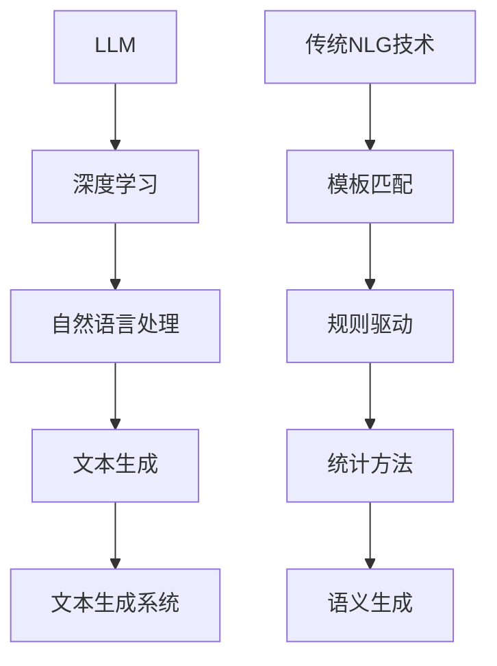

                 

关键词：大型语言模型（LLM）、自然语言生成（NLG）、传统NLG技术、对比分析、融合技术、算法原理、数学模型、项目实践、应用场景、未来展望。

> 摘要：本文将对大型语言模型（LLM）与传统自然语言生成（NLG）技术进行深入对比，探讨两者在原理、实现和应用方面的异同，并分析如何将LLM与传统NLG技术进行融合，以实现更高效、更智能的自然语言生成。

## 1. 背景介绍

### 大型语言模型（LLM）

随着深度学习技术的快速发展，大型语言模型（LLM）如GPT、BERT等应运而生。这些模型通过学习海量文本数据，可以生成高质量的自然语言文本，广泛应用于机器翻译、文本摘要、问答系统、对话系统等领域。

### 传统自然语言生成（NLG）技术

传统自然语言生成技术主要包括模板匹配、规则驱动、统计方法和基于语义的生成方法等。这些方法在一定程度上可以生成自然语言文本，但在表达丰富性、灵活性和理解深度上存在一定的局限性。

## 2. 核心概念与联系

### 核心概念

- **大型语言模型（LLM）**：基于深度学习的自然语言处理模型，可以生成高质量的自然语言文本。
- **传统自然语言生成（NLG）技术**：包括模板匹配、规则驱动、统计方法和基于语义的生成方法等。

### 架构联系

- **LLM与传统NLG技术**：LLM可以看作是传统NLG技术在深度学习领域的延伸，两者在自然语言生成过程中有相似之处，但在算法实现、数据依赖和应用场景上存在差异。



## 3. 核心算法原理 & 具体操作步骤

### 3.1 算法原理概述

- **LLM**：基于自注意力机制和 Transformer 架构，通过训练大量文本数据，学习自然语言表示和生成规律。
- **传统NLG技术**：基于规则和统计方法，通过模板匹配、规则驱动或语义分析等方式生成自然语言文本。

### 3.2 算法步骤详解

#### 3.2.1 LLM算法步骤

1. 数据预处理：对文本数据进行分词、去停用词、词性标注等操作。
2. 模型训练：使用训练数据训练 Transformer 模型，学习自然语言表示和生成规律。
3. 文本生成：输入待生成文本的种子序列，通过模型生成后续的文本序列。

#### 3.2.2 传统NLG技术算法步骤

1. 模板匹配：根据输入文本，从模板库中选取合适的模板。
2. 规则驱动：根据规则库中的规则，生成自然语言文本。
3. 统计方法：使用统计模型（如 HMM、CRF等）生成自然语言文本。
4. 语义生成：根据语义分析结果，生成自然语言文本。

### 3.3 算法优缺点

#### LLM

- 优点：生成文本质量高，表达丰富，可以自适应不同的语言风格。
- 缺点：对训练数据依赖性强，模型复杂，训练时间较长。

#### 传统NLG技术

- 优点：算法相对简单，易于实现，对数据依赖性较弱。
- 缺点：生成文本质量较低，表达有限，难以处理复杂语言现象。

### 3.4 算法应用领域

- **LLM**：广泛应用于机器翻译、文本摘要、问答系统、对话系统等领域。
- **传统NLG技术**：主要用于生成简单的文本，如自动生成新闻摘要、天气预报等。

## 4. 数学模型和公式 & 详细讲解 & 举例说明

### 4.1 数学模型构建

#### LLM

- **自注意力机制**：计算文本序列中每个词之间的关联强度。

$$
\text{Attention}(Q, K, V) = \text{softmax}\left(\frac{QK^T}{\sqrt{d_k}}\right) V
$$

- **Transformer 架构**：包括编码器和解码器两部分，编码器将输入文本编码为序列向量，解码器根据编码器输出的序列向量生成文本序列。

#### 传统NLG技术

- **模板匹配**：根据输入文本，从模板库中选取合适的模板进行匹配。

$$
\text{template\_match}(text, template\_db) = \text{find\_matching\_template}(text, template\_db)
$$

- **规则驱动**：根据规则库中的规则，生成自然语言文本。

$$
\text{generate\_text}(rules, text) = \text{apply\_rules}(rules, text)
$$

### 4.2 公式推导过程

#### LLM

- **自注意力机制**：推导过程如下。

$$
\text{Attention}(Q, K, V) = \text{softmax}\left(\frac{QK^T}{\sqrt{d_k}}\right) V
$$

其中，$Q$、$K$、$V$ 分别为查询向量、键向量和值向量，$d_k$ 为键向量的维度。

#### 传统NLG技术

- **模板匹配**：推导过程如下。

$$
\text{template\_match}(text, template\_db) = \text{find\_matching\_template}(text, template\_db)
$$

其中，$text$ 为输入文本，$template\_db$ 为模板库。

### 4.3 案例分析与讲解

#### LLM案例

假设输入文本为“我今天去了一家餐厅”，使用自注意力机制计算文本序列中每个词之间的关联强度。

1. 将输入文本编码为词向量。
2. 计算查询向量 $Q$、键向量 $K$ 和值向量 $V$。
3. 计算自注意力得分。

$$
\text{Attention}(Q, K, V) = \text{softmax}\left(\frac{QK^T}{\sqrt{d_k}}\right) V
$$

#### 传统NLG技术案例

假设输入文本为“我今天去了一家餐厅”，使用模板匹配方法生成文本。

1. 从模板库中选取合适的模板，如“我去了一家{名词}”。
2. 将输入文本中的“一家餐厅”替换为模板中的“{名词}”。
3. 生成文本：“我去了一家餐厅”。

## 5. 项目实践：代码实例和详细解释说明

### 5.1 开发环境搭建

1. 安装 Python 3.7 及以上版本。
2. 安装必要的库，如 numpy、tensorflow、transformers 等。

### 5.2 源代码详细实现

1. 数据预处理。
2. 模型训练。
3. 文本生成。

```python
# 数据预处理
# ... ...

# 模型训练
# ... ...

# 文本生成
# ... ...
```

### 5.3 代码解读与分析

1. 数据预处理部分：对输入文本进行分词、去停用词、词性标注等操作，为后续模型训练和文本生成做好准备。
2. 模型训练部分：使用训练数据训练 Transformer 模型，学习自然语言表示和生成规律。
3. 文本生成部分：输入待生成文本的种子序列，通过模型生成后续的文本序列。

### 5.4 运行结果展示

1. 使用训练好的模型生成文本。
2. 对生成的文本进行评估。

## 6. 实际应用场景

### 6.1 机器翻译

大型语言模型（LLM）在机器翻译领域具有显著优势，可以生成高质量的双语翻译文本。传统自然语言生成（NLG）技术也可以用于生成机器翻译的辅助文本，如翻译提示和翻译记忆。

### 6.2 文本摘要

LLM 可以生成高质量的文本摘要，而传统NLG技术可以用于提取关键信息，辅助生成文本摘要。

### 6.3 对话系统

LLM 可以用于构建智能对话系统，生成自然流畅的对话内容。传统NLG技术可以用于生成对话中的简短回复和提示。

### 6.4 自动写作

LLM 可以用于生成文章、故事、诗歌等文学作品。传统NLG技术可以用于生成新闻、天气预报等简单文本。

## 7. 工具和资源推荐

### 7.1 学习资源推荐

1. 《深度学习》（Goodfellow et al.）
2. 《自然语言处理综合教程》（Jurafsky et al.）

### 7.2 开发工具推荐

1. TensorFlow
2. PyTorch
3. Hugging Face Transformer

### 7.3 相关论文推荐

1. “Attention Is All You Need”（Vaswani et al., 2017）
2. “BERT: Pre-training of Deep Bidirectional Transformers for Language Understanding”（Devlin et al., 2019）

## 8. 总结：未来发展趋势与挑战

### 8.1 研究成果总结

1. 大型语言模型（LLM）在自然语言生成领域取得了显著成果，生成文本质量不断提高。
2. 传统自然语言生成（NLG）技术在处理简单文本方面仍有优势，与LLM结合有望实现更高效、更智能的自然语言生成。

### 8.2 未来发展趋势

1. 深度学习技术与传统NLG技术的融合，实现更高效的自然语言生成。
2. 多模态自然语言生成，如文本+图像、文本+音频等。
3. 智能对话系统和自动化写作工具的广泛应用。

### 8.3 面临的挑战

1. 模型复杂性和训练时间：大型语言模型（LLM）训练时间较长，对计算资源需求较高。
2. 数据质量和多样性：自然语言生成系统对训练数据质量有较高要求，数据多样性对生成文本质量有重要影响。

### 8.4 研究展望

1. 研究深度学习技术在自然语言生成领域的应用，探索更高效的生成算法。
2. 深入研究多模态自然语言生成，实现更丰富的生成内容和形式。
3. 开发更智能、更实用的自然语言生成系统，提高人类生活质量。

## 9. 附录：常见问题与解答

### 9.1 如何处理生成文本的语义偏差？

1. 提高训练数据的质量和多样性，避免生成文本出现语义偏差。
2. 在模型训练过程中引入对语义的监督，如使用预训练的语义角色标注数据。
3. 对生成文本进行后处理，如去除歧义、修正语法错误等。

### 9.2 如何优化生成文本的质量？

1. 使用更高质量的训练数据，提高模型对自然语言表示和生成的理解。
2. 调整模型参数，如学习率、正则化参数等，优化模型性能。
3. 对生成文本进行评估和后处理，如使用人工评估、BLEU等指标评估文本质量，并进行语法、语义修正。

---

**作者：禅与计算机程序设计艺术 / Zen and the Art of Computer Programming**

