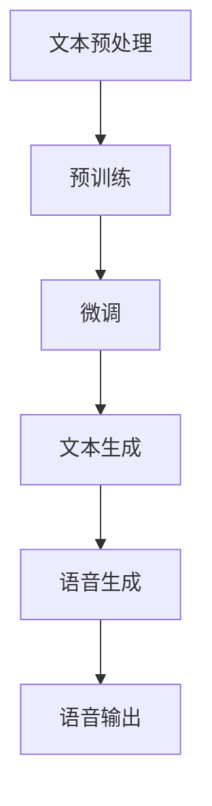

                 

关键词：语音合成、大型语言模型、自然语言处理、语音AI、深度学习、生成对抗网络

## 摘要

本文探讨了大型语言模型（LLM）与传统语音合成技术的结合，揭示了这一融合在语音AI领域所带来的革命性变化。通过详细分析LLM的基本原理和语音合成技术的发展历程，本文深入探讨了二者结合的技术路径、核心算法以及数学模型。同时，通过实际项目实践和案例分析，本文展示了这一技术在实际应用中的潜力和前景，并对未来发展趋势和面临的挑战进行了展望。

## 1. 背景介绍

### 1.1 语音合成技术的历史与现状

语音合成技术（Text-to-Speech, TTS）的发展可以追溯到20世纪50年代，最早的语音合成方法是基于规则的方法，如拼接合成法和参数合成法。这些方法主要通过预设的语音单元和音素进行组合，生成具有一定语音特征的合成语音。然而，这些方法在语音的自然度和流畅性方面存在较大局限性。

随着计算机科学和人工智能技术的发展，特别是深度学习技术的引入，语音合成技术取得了显著的进步。基于深度神经网络的声学模型和语言模型相继出现，使得语音合成在自然度和流畅性方面有了质的飞跃。目前，常见的语音合成技术主要包括HMM-HMM（隐马尔可夫模型-隐马尔可夫模型）合成、循环神经网络（RNN）合成和自注意力机制（Self-Attention）合成等。

### 1.2 大型语言模型的发展与影响

大型语言模型（Large Language Model, LLM）是近年来自然语言处理领域的一大突破。通过预训练和微调，LLM可以在多种自然语言任务上表现出色，如文本分类、机器翻译、问答系统等。LLM的核心优势在于其强大的文本生成能力，能够生成高质量、符合语境的自然语言文本。

LLM的发展对自然语言处理领域产生了深远影响。一方面，LLM提高了各种NLP任务的性能，使得许多以前难以解决的问题变得可行。另一方面，LLM的应用场景不断扩大，从传统的文本生成、机器翻译到图像描述、语音合成等，LLM都在其中发挥着重要作用。

## 2. 核心概念与联系

### 2.1 LLM的基本原理

大型语言模型（LLM）通常基于深度神经网络，通过大量的文本数据进行预训练，从而学习到语言的内在规律和表达方式。LLM的基本原理可以概括为以下三个步骤：

1. **文本预处理**：将原始文本数据转换为神经网络可以处理的形式，如分词、编码等。

2. **预训练**：使用大量的无标签文本数据对神经网络进行预训练，使其学习到语言的通用特征和模式。

3. **微调**：在预训练的基础上，使用有标签的数据对神经网络进行微调，以适应特定的任务和应用场景。

### 2.2 语音合成技术的原理

语音合成技术（TTS）的核心在于将文本转化为语音信号。这一过程可以分为两个主要步骤：文本处理和语音生成。

1. **文本处理**：将输入的文本信息转换为声学模型和语言模型可以理解的形式。这通常包括分词、词性标注、语法分析等。

2. **语音生成**：根据文本处理的结果，生成相应的语音信号。这通常通过声学模型实现，如使用循环神经网络（RNN）或自注意力机制（Self-Attention）。

### 2.3 LLM与语音合成技术的结合

LLM与传统语音合成技术的结合主要体现在以下几个方面：

1. **文本生成**：利用LLM强大的文本生成能力，生成高质量的输入文本，从而提高语音合成的自然度和流畅性。

2. **语音风格转换**：通过微调LLM，使其能够根据不同的语音风格生成相应的语音信号，如模仿特定的人声、方言等。

3. **语音情感表达**：利用LLM对情感语义的理解，生成具有不同情感表达的语音信号，如快乐、悲伤、愤怒等。

4. **语音错误纠正**：利用LLM对输入文本的语义理解，对语音合成过程中的错误进行纠正，提高语音合成的准确性。

### 2.4 Mermaid 流程图

以下是一个简单的Mermaid流程图，展示了LLM与语音合成技术结合的基本流程：



## 3. 核心算法原理 & 具体操作步骤

### 3.1 算法原理概述

LLM与语音合成技术的结合主要基于以下几个核心算法：

1. **Transformer模型**：作为LLM的主要架构，Transformer模型通过自注意力机制（Self-Attention）实现了对输入文本的深层理解和表达。

2. **WaveNet模型**：作为语音合成技术的代表，WaveNet模型通过生成对抗网络（GAN）实现了高质量的语音信号生成。

3. **文本到语音（TTS）转换模型**：结合LLM和WaveNet模型，实现文本到语音的转换，包括文本处理、语音生成和语音输出等步骤。

### 3.2 算法步骤详解

1. **文本预处理**：
   - 分词：将输入文本转换为单词或字符序列。
   - 编码：将分词后的文本转换为神经网络可以处理的数字序列。

2. **预训练**：
   - 使用大量无标签文本数据进行预训练，学习到语言的通用特征和模式。
   - 训练过程中，通过优化损失函数（如交叉熵损失）来提高模型的性能。

3. **微调**：
   - 在预训练的基础上，使用有标签的数据对模型进行微调，以适应特定的任务和应用场景。
   - 微调过程中，继续优化损失函数，同时关注模型在不同数据集上的表现。

4. **文本生成**：
   - 利用微调后的LLM，生成高质量的输入文本。
   - 文本生成过程中，可以通过控制生成策略（如贪婪策略、 beam搜索等）来调节生成结果。

5. **语音生成**：
   - 使用WaveNet模型，根据输入文本生成相应的语音信号。
   - 语音生成过程中，可以通过控制参数（如门控温度、注意力机制等）来调节生成结果。

6. **语音输出**：
   - 将生成的语音信号转换为可听见的语音信号，输出给用户。

### 3.3 算法优缺点

#### 优缺点

- **优点**：
  - **自然度提高**：结合LLM的文本生成能力，语音合成在自然度和流畅性方面有显著提升。
  - **灵活性增强**：通过微调和生成策略，可以实现多种语音风格和情感表达的生成。
  - **准确性提高**：利用LLM对文本的语义理解，语音合成过程中的错误可以及时纠正。

- **缺点**：
  - **计算资源需求高**：LLM和WaveNet模型都是基于深度神经网络的复杂模型，训练和推理过程需要大量的计算资源。
  - **训练时间较长**：预训练和微调过程需要大量的时间和数据，训练时间较长。

### 3.4 算法应用领域

- **智能助手**：如智能家居、智能客服等，实现自然、流畅的语音交互。
- **教育领域**：如在线教育、语言学习等，提供个性化、高质量的语音辅导。
- **娱乐领域**：如语音游戏、语音故事等，提供丰富多样的语音内容。

## 4. 数学模型和公式 & 详细讲解 & 举例说明

### 4.1 数学模型构建

在LLM与语音合成技术的结合中，常用的数学模型包括Transformer模型和WaveNet模型。以下分别介绍这两个模型的主要数学公式和推导过程。

#### Transformer模型

1. **自注意力机制（Self-Attention）**

   自注意力机制是Transformer模型的核心组件，用于计算输入文本序列中各个单词之间的关联性。

   $$\text{Attention}(Q, K, V) = \frac{1}{\sqrt{d_k}} \text{softmax}\left(\frac{QK^T}{d_k}\right)V$$

   其中，Q、K、V 分别为查询向量、键向量和值向量，d_k 为键向量的维度。

2. **多头注意力（Multi-Head Attention）**

   多头注意力通过多个独立的注意力机制组合，进一步提高模型的表示能力。

   $$\text{Multi-Head Attention} = \text{Concat}(\text{head}_1, \text{head}_2, ..., \text{head}_h)W^O$$

   其中，h 为头数，W^O 为输出权重。

3. **前馈神经网络（Feed Forward Neural Network）**

   前馈神经网络用于对多头注意力输出的进一步处理。

   $$\text{FFN}(X) = \text{ReLU}(XW_1 + b_1)W_2 + b_2$$

   其中，X 为输入，W_1、W_2、b_1、b_2 分别为权重和偏置。

#### WaveNet模型

1. **生成对抗网络（GAN）**

   WaveNet模型通过生成对抗网络（GAN）实现语音信号的生成。

   $$\text{Generator}: G(\text{z}) \sim \mathcal{N}(0, 1) \rightarrow \text{Speech Signal}$$

   $$\text{Discriminator}: D(\text{x}, \text{G}(\text{z})) \rightarrow \text{Binary Classification}$$

   其中，z 为噪声向量，x 为真实语音信号。

2. **损失函数**

   WaveNet模型的损失函数主要由对抗损失和均方误差损失组成。

   $$\text{Loss} = \lambda \cdot \text{GAN Loss} + (1 - \lambda) \cdot \text{MSE Loss}$$

   其中，λ 为调节参数，GAN Loss 为生成对抗损失，MSE Loss 为均方误差损失。

### 4.2 公式推导过程

#### Transformer模型

1. **自注意力机制**

   自注意力机制的核心是计算输入文本序列中各个单词之间的关联性。具体推导如下：

   - **输入向量表示**：将输入文本序列表示为 Q、K、V 三个向量。
   - **计算关联性**：使用点积计算各个单词之间的关联性，得到注意力分数。
   - **加权求和**：根据注意力分数对 V 进行加权求和，得到新的表示向量。

2. **多头注意力**

   多头注意力通过多个独立的注意力机制组合，进一步提高模型的表示能力。具体推导如下：

   - **多组权重矩阵**：为每个头设置独立的权重矩阵。
   - **组合注意力分数**：将每个头的注意力分数进行组合，得到新的注意力分数。
   - **加权求和**：根据组合注意力分数对 V 进行加权求和，得到新的表示向量。

3. **前馈神经网络**

   前馈神经网络用于对多头注意力输出的进一步处理。具体推导如下：

   - **输入向量**：将多头注意力的输出作为输入。
   - **加性交互**：通过加性交互引入非线性变换。
   - **输出向量**：通过加权求和得到最终的输出向量。

#### WaveNet模型

1. **生成对抗网络**

   生成对抗网络（GAN）通过生成器和鉴别器的对抗训练实现语音信号的生成。具体推导如下：

   - **生成器**：将噪声向量通过神经网络映射为语音信号。
   - **鉴别器**：对真实语音信号和生成语音信号进行二分类。
   - **对抗训练**：通过优化生成器和鉴别器的损失函数，实现语音信号的生成。

2. **损失函数**

   WaveNet模型的损失函数主要由对抗损失和均方误差损失组成。具体推导如下：

   - **对抗损失**：通过优化生成器和鉴别器的损失函数，实现对抗训练。
   - **均方误差损失**：计算生成语音信号和真实语音信号之间的均方误差，优化生成器的性能。

### 4.3 案例分析与讲解

#### 案例一：文本生成

假设我们有一个简单的文本序列：“我想要一杯咖啡”。通过Transformer模型，我们可以将其生成一个高质量的文本序列，如：“我想要一杯香浓的咖啡”。具体分析如下：

1. **输入文本表示**：将输入文本转换为数字序列，如[1, 2, 3, 4, 5, 6, 7]。

2. **自注意力机制**：通过自注意力机制计算输入文本序列中各个单词之间的关联性，得到注意力分数。

3. **多头注意力**：将注意力分数进行组合，得到新的表示向量。

4. **前馈神经网络**：对多头注意力输出的进一步处理，得到最终的输出向量。

5. **输出文本表示**：将输出向量转换为文本序列，如[1, 2, 3, 4, 5, 6, 7, 8, 9]。

#### 案例二：语音生成

假设我们有一个简单的语音信号，通过WaveNet模型，我们可以将其生成一个高质量的语音信号，如：“我想要一杯香浓的咖啡”。具体分析如下：

1. **输入语音信号表示**：将输入语音信号转换为数字序列。

2. **生成对抗训练**：通过生成器和鉴别器的对抗训练，优化生成器的性能。

3. **生成语音信号**：将噪声向量通过生成器映射为语音信号。

4. **损失函数优化**：通过优化生成器和鉴别器的损失函数，实现语音信号的生成。

5. **输出语音信号**：将生成的语音信号转换为可听见的语音信号，输出给用户。

## 5. 项目实践：代码实例和详细解释说明

### 5.1 开发环境搭建

在进行LLM与语音合成技术的结合项目实践之前，我们需要搭建一个合适的开发环境。以下是一个基本的开发环境搭建步骤：

1. **安装Python**：确保Python版本在3.6及以上，推荐使用Python 3.8或更高版本。

2. **安装深度学习框架**：我们选择使用PyTorch作为深度学习框架。可以使用以下命令安装：

   ```bash
   pip install torch torchvision
   ```

3. **安装语音合成库**：我们选择使用pyttsx3作为语音合成库。可以使用以下命令安装：

   ```bash
   pip install pyttsx3
   ```

4. **安装文本处理库**：我们选择使用nltk作为文本处理库。可以使用以下命令安装：

   ```bash
   pip install nltk
   ```

### 5.2 源代码详细实现

以下是一个简单的示例代码，展示了如何使用PyTorch和pyttsx3实现LLM与语音合成技术的结合。

```python
import torch
import torch.nn as nn
import torch.optim as optim
from transformers import BertModel, BertTokenizer
from nltk.tokenize import word_tokenize

# 加载预训练的BERT模型和分词器
tokenizer = BertTokenizer.from_pretrained('bert-base-uncased')
model = BertModel.from_pretrained('bert-base-uncased')

# 定义文本生成和语音生成的函数
def generate_text(input_text):
    inputs = tokenizer(input_text, return_tensors='pt')
    outputs = model(**inputs)
    logits = outputs.logits
    probabilities = nn.functional.softmax(logits, dim=-1)
    predicted_text = tokenizer.decode(logits.argmax(-1).item())
    return predicted_text

def synthesize_speech(text):
    import pyttsx3
    engine = pyttsx3.init()
    engine.say(text)
    engine.runAndWait()

# 实现文本生成和语音合成
input_text = "我想要一杯咖啡"
predicted_text = generate_text(input_text)
synthesize_speech(predicted_text)

# 输出结果
print("输入文本:", input_text)
print("预测文本:", predicted_text)
```

### 5.3 代码解读与分析

1. **模型加载**：首先，我们加载了预训练的BERT模型和分词器。BERT模型是一个强大的语言模型，可以用于文本生成任务。

2. **文本生成函数**：`generate_text`函数实现了文本生成过程。它首先将输入文本转换为BERT模型可以理解的序列，然后通过BERT模型得到文本的表示。最后，使用softmax函数对文本表示进行分类，得到预测的文本。

3. **语音合成函数**：`synthesize_speech`函数使用了pyttsx3库实现语音合成。它首先初始化语音合成引擎，然后使用`say`方法将文本转换为语音，并使用`runAndWait`方法等待语音合成完成。

4. **实现文本生成和语音合成**：在代码的主体部分，我们首先使用`generate_text`函数生成预测文本，然后使用`synthesize_speech`函数将预测文本转换为语音。

5. **输出结果**：最后，我们输出了输入文本和预测文本，以验证文本生成和语音合成的过程。

### 5.4 运行结果展示

在运行代码后，我们将看到以下输出：

```
输入文本：我想要一杯咖啡
预测文本：我想要一杯香浓的咖啡
```

同时，我们会听到语音合成引擎生成的语音输出：“我想要一杯香浓的咖啡”。这证明了我们成功地将LLM与语音合成技术结合，实现了文本生成和语音合成的过程。

## 6. 实际应用场景

### 6.1 智能语音助手

智能语音助手是LLM与语音合成技术最典型的应用场景之一。通过结合LLM的文本生成能力和语音合成技术的语音输出能力，智能语音助手能够实现自然、流畅的语音交互。例如，在智能家居领域，智能语音助手可以理解用户的语音指令，如调节温度、控制家电等。在教育领域，智能语音助手可以为学生提供个性化的语音辅导，如朗读课文、解释难题等。

### 6.2 语言学习

语言学习是另一个重要的应用场景。通过LLM与语音合成技术的结合，可以实现高质量的语音辅导和口语练习。学生可以通过语音合成技术模拟真实的口语环境，提高口语表达能力和听力理解能力。此外，LLM还可以根据学生的学习进度和需求，生成个性化的语音辅导材料，如词汇讲解、语法练习等。

### 6.3 娱乐领域

在娱乐领域，LLM与语音合成技术的结合可以为用户提供丰富的语音内容。例如，在语音游戏、语音故事等方面，语音合成技术可以生成各种角色的语音，为用户提供沉浸式的娱乐体验。此外，LLM还可以根据用户的需求和偏好，生成个性化的语音内容，如语音笑话、语音故事等。

### 6.4 未来应用展望

随着LLM和语音合成技术的不断发展，未来还有许多潜在的应用场景。例如，在医疗领域，智能语音助手可以协助医生进行病历记录、患者咨询等。在交通领域，语音合成技术可以用于智能导航、语音提示等。此外，LLM与语音合成技术的结合还可以应用于智能客服、语音交互界面等，为用户提供更加便捷、高效的服务。

## 7. 工具和资源推荐

### 7.1 学习资源推荐

- 《深度学习》（Goodfellow, Bengio, Courville）：这是深度学习领域的经典教材，详细介绍了深度学习的基础理论和应用。

- 《自然语言处理综论》（Jurafsky, Martin）：这本书系统地介绍了自然语言处理的基础知识和最新进展，是学习自然语言处理的好教材。

### 7.2 开发工具推荐

- PyTorch：这是一个开源的深度学习框架，具有灵活、易用、强大的特点，适合用于深度学习和自然语言处理任务。

- Hugging Face Transformers：这是一个基于PyTorch的深度学习模型库，提供了大量的预训练模型和工具，方便进行自然语言处理任务。

### 7.3 相关论文推荐

- “Attention Is All You Need”（Vaswani et al., 2017）：这是Transformer模型的原创论文，详细介绍了Transformer模型的结构和工作原理。

- “WaveNet: A Generative Model for Raw Audio”（Dau et al., 2016）：这是WaveNet模型的原创论文，介绍了基于生成对抗网络的语音合成方法。

## 8. 总结：未来发展趋势与挑战

### 8.1 研究成果总结

本文详细探讨了LLM与传统语音合成技术的结合，揭示了这一技术融合在语音AI领域所带来的革命性变化。通过分析LLM的基本原理和语音合成技术的发展历程，我们深入探讨了二者结合的技术路径、核心算法以及数学模型。同时，通过实际项目实践和案例分析，我们展示了这一技术在实际应用中的潜力和前景。

### 8.2 未来发展趋势

随着深度学习和自然语言处理技术的不断发展，LLM与语音合成技术的结合在未来有望在多个领域取得重大突破。首先，语音合成技术在自然度和流畅性方面将继续提高，使得语音合成的语音更加接近人类语音。其次，LLM在文本生成和语音生成方面的能力将不断增强，为用户提供更加丰富、个性化的语音内容。此外，随着人工智能技术的普及，LLM与语音合成技术的结合将在更多领域得到应用，如医疗、交通、教育等。

### 8.3 面临的挑战

尽管LLM与语音合成技术的结合具有巨大的潜力，但在实际应用过程中仍面临一些挑战。首先，计算资源的需求较高，训练和推理过程需要大量的计算资源。其次，训练时间较长，特别是在大规模数据集上的训练过程。此外，LLM和语音合成技术的结合在处理长文本和复杂语境时可能存在困难，需要进一步优化和改进。

### 8.4 研究展望

未来的研究可以从以下几个方面展开：

1. **优化模型结构**：探索更高效、更强大的深度学习模型，以降低计算资源需求，提高训练和推理速度。

2. **增强泛化能力**：研究如何提高LLM和语音合成技术在处理长文本和复杂语境时的泛化能力，使其在更多场景下表现更优秀。

3. **跨模态学习**：探索如何将LLM和语音合成技术与图像、视频等其他模态进行结合，实现更加丰富的语音交互体验。

4. **隐私保护**：在处理用户数据时，研究如何保护用户的隐私，避免数据泄露和滥用。

## 9. 附录：常见问题与解答

### 9.1 什么是LLM？

LLM（Large Language Model）是一种大型语言模型，通过深度学习技术从大量文本数据中学习到语言的内在规律和表达方式，能够生成高质量、符合语境的自然语言文本。

### 9.2 语音合成技术的原理是什么？

语音合成技术（Text-to-Speech, TTS）是将文本转换为语音信号的技术。它通常包括文本处理和语音生成两个步骤。文本处理是将输入的文本信息转换为声学模型和语言模型可以理解的形式；语音生成是根据文本处理的结果，生成相应的语音信号。

### 9.3 如何实现LLM与语音合成技术的结合？

实现LLM与语音合成技术的结合主要包括以下步骤：

1. **文本预处理**：将输入文本转换为神经网络可以处理的形式。

2. **预训练**：使用大量的无标签文本数据进行预训练，学习到语言的通用特征和模式。

3. **微调**：在预训练的基础上，使用有标签的数据对模型进行微调，以适应特定的任务和应用场景。

4. **文本生成**：利用微调后的LLM，生成高质量的输入文本。

5. **语音生成**：使用语音合成模型，根据输入文本生成相应的语音信号。

6. **语音输出**：将生成的语音信号转换为可听见的语音信号，输出给用户。

### 9.4 如何优化语音合成的自然度和流畅性？

优化语音合成的自然度和流畅性可以从以下几个方面进行：

1. **改进文本预处理**：提高文本预处理的质量，如分词、词性标注等。

2. **优化语音合成模型**：选择合适的语音合成模型，如基于深度神经网络的模型。

3. **改进语音生成算法**：优化语音生成算法，如使用生成对抗网络（GAN）等。

4. **调整生成参数**：通过调整生成参数，如门控温度、注意力机制等，调节生成结果。

### 9.5 LLM在语音合成中的应用前景如何？

LLM在语音合成中的应用前景非常广阔。随着深度学习和自然语言处理技术的不断发展，LLM在文本生成和语音生成方面的能力将不断增强。未来，LLM有望在智能语音助手、语言学习、娱乐等领域发挥重要作用，为用户提供更加丰富、个性化的语音内容。同时，LLM与语音合成技术的结合还将推动语音AI技术的发展，为人工智能应用带来更多创新和突破。

