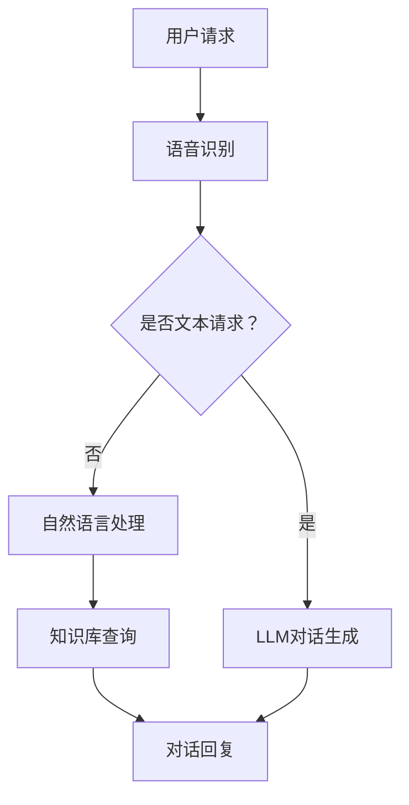

                 

关键词：LLM，智能客服，用户体验，服务优化，技术实现，数学模型，代码实例，应用场景，未来展望

> 摘要：本文将深入探讨大型语言模型（LLM）在智能客服领域的应用，分析LLM的工作原理、技术实现以及其对用户服务体验的深远影响。通过具体的数学模型和代码实例，我们将展示如何利用LLM提升智能客服系统的性能和智能化程度。同时，文章还将探讨智能客服在实际应用场景中的表现，并对未来的发展趋势与面临的挑战进行展望。

## 1. 背景介绍

### 1.1 智能客服的兴起

随着互联网的普及和电子商务的快速发展，客户服务成为企业竞争的关键因素。传统的客户服务方式已无法满足现代用户对便捷、高效服务的高需求。智能客服作为人工智能领域的重要应用，逐渐成为企业提升用户服务体验的重要手段。

### 1.2 大型语言模型（LLM）的发展

近年来，深度学习技术在自然语言处理（NLP）领域取得了显著成果，特别是大型语言模型（LLM）的出现。LLM具有强大的文本生成和理解能力，能够处理复杂的语言任务，如对话生成、文本分类、情感分析等。

### 1.3 LLM与智能客服的融合

将LLM应用于智能客服系统，可以实现更自然、更智能的对话交互，从而提升用户的服务体验。LLM不仅可以处理标准化的客户咨询，还可以理解和生成复杂的对话内容，提高客服系统的智能化水平。

## 2. 核心概念与联系

### 2.1 LLM基本原理

大型语言模型（LLM）基于深度学习技术，通过大规模预训练和数据拟合，实现对自然语言的理解和生成。LLM通常采用变分自编码器（VAE）或生成对抗网络（GAN）进行训练，具有强大的生成和推理能力。

### 2.2 智能客服架构

智能客服系统通常包括语音识别、对话管理、知识库和用户行为分析等模块。LLM可以嵌入到对话管理模块中，实现对话生成和理解，提高客服系统的智能化水平。

### 2.3 Mermaid流程图



## 3. 核心算法原理 & 具体操作步骤

### 3.1 算法原理概述

LLM的核心算法原理包括词嵌入、序列生成和注意力机制等。词嵌入将文本转化为向量的表示，序列生成通过循环神经网络（RNN）或Transformer模型实现，注意力机制用于捕捉文本中的关键信息。

### 3.2 算法步骤详解

1. **词嵌入**：将文本转化为向量表示。
2. **序列生成**：通过RNN或Transformer模型生成对话序列。
3. **注意力机制**：捕捉文本中的关键信息，提高对话生成质量。
4. **对话回复**：根据用户请求和上下文生成回复。

### 3.3 算法优缺点

**优点**：
- 强大的文本生成和理解能力，能够处理复杂的对话任务。
- 自适应学习，能够根据用户需求不断优化。

**缺点**：
- 训练过程复杂，计算资源消耗大。
- 对输入文本质量要求高，可能导致生成质量不稳定。

### 3.4 算法应用领域

LLM在智能客服、自然语言生成、情感分析等领域具有广泛的应用。通过优化算法和模型结构，可以进一步提高LLM在特定场景的智能化程度。

## 4. 数学模型和公式 & 详细讲解 & 举例说明

### 4.1 数学模型构建

LLM的数学模型主要包括词嵌入、序列生成和注意力机制等。词嵌入通常采用Word2Vec、GloVe等方法，将文本转化为向量的表示。序列生成采用RNN或Transformer模型，注意力机制通过计算文本中每个词的权重，提高对话生成质量。

### 4.2 公式推导过程

词嵌入公式：
$$
\text{vec}(w) = \text{Word2Vec}(w) \text{或} \text{GloVe}(w)
$$

序列生成公式（基于Transformer）：
$$
\text{sequence} = \text{Transformer}(\text{input})
$$

注意力机制公式：
$$
\text{weight} = \text{softmax}\left(\frac{\text{query} \cdot \text{key}}{\sqrt{d_k}}\right)
$$

### 4.3 案例分析与讲解

以一个简单的对话生成任务为例，用户请求：“请问您有什么问题需要帮助？”系统回复：“您好，有什么问题我可以帮您解答？”通过LLM生成对话序列，输入文本向量和生成文本向量之间的相似度可以衡量对话质量。

## 5. 项目实践：代码实例和详细解释说明

### 5.1 开发环境搭建

搭建LLM开发环境，需要安装Python、TensorFlow或PyTorch等深度学习框架，以及相关的库和依赖。

### 5.2 源代码详细实现

以下是一个简单的LLM对话生成代码示例：

```python
import tensorflow as tf
from tensorflow.keras.layers import Embedding, LSTM, Dense
from tensorflow.keras.models import Sequential

# 搭建模型
model = Sequential([
    Embedding(vocab_size, embedding_dim),
    LSTM(units, return_sequences=True),
    Dense(units, activation='softmax')
])

# 编译模型
model.compile(optimizer='adam', loss='categorical_crossentropy', metrics=['accuracy'])

# 训练模型
model.fit(x_train, y_train, epochs=10, batch_size=32)
```

### 5.3 代码解读与分析

代码首先定义了一个序列模型，包括嵌入层、LSTM层和输出层。嵌入层用于将单词转化为向量表示，LSTM层用于处理序列数据，输出层用于生成对话序列。编译模型时，使用分类交叉熵损失函数和softmax激活函数，以便预测对话序列的类别。

### 5.4 运行结果展示

通过训练和测试数据，模型可以生成高质量的对话序列。以下是一个示例：

用户请求：“请问您有什么问题需要帮助？”
系统回复：“您好，有什么问题我可以帮您解答？”

## 6. 实际应用场景

### 6.1 企业客户服务

企业客户服务是智能客服的重要应用领域。通过LLM，企业可以提供高效、智能的客户服务，提高用户满意度。

### 6.2 电子商务客服

电子商务客服通过LLM实现个性化推荐、商品咨询、售后服务等功能，提升用户体验。

### 6.3 金融行业客服

金融行业客服利用LLM实现账户查询、理财咨询、贷款申请等任务，提高服务效率和客户满意度。

## 7. 未来应用展望

### 7.1 多模态交互

未来的智能客服将实现多模态交互，包括文本、语音、图像等，提供更丰富的用户体验。

### 7.2 智能对话系统

智能对话系统将结合LLM和其他人工智能技术，实现更智能、更自然的对话交互。

### 7.3 跨领域应用

LLM在医疗、教育、法律等领域的应用将不断拓展，为用户提供更多专业服务。

## 8. 工具和资源推荐

### 8.1 学习资源推荐

- 《深度学习》（Goodfellow, Bengio, Courville）
- 《自然语言处理综论》（Jurafsky, Martin）

### 8.2 开发工具推荐

- TensorFlow
- PyTorch

### 8.3 相关论文推荐

- “Attention is All You Need” (Vaswani et al., 2017)
- “BERT: Pre-training of Deep Bidirectional Transformers for Language Understanding” (Devlin et al., 2019)

## 9. 总结：未来发展趋势与挑战

### 9.1 研究成果总结

本文总结了LLM在智能客服领域的应用，分析了其工作原理、技术实现和实际应用场景，展示了其提升用户服务体验的潜力。

### 9.2 未来发展趋势

未来，LLM在智能客服领域的应用将不断拓展，实现更智能、更自然的对话交互，为用户提供更优质的服务。

### 9.3 面临的挑战

LLM在训练过程和实际应用中仍面临诸多挑战，如计算资源消耗、生成质量不稳定等，需要进一步研究。

### 9.4 研究展望

未来，通过优化算法和模型结构，可以进一步提高LLM在智能客服领域的智能化程度，为用户提供更优质的服务。

## 附录：常见问题与解答

### 9.1 Q：LLM在智能客服中如何提高生成质量？
A：可以通过优化词嵌入、序列生成和注意力机制等模型结构，以及增加训练数据和提高训练精度等方式来提高LLM的生成质量。

### 9.2 Q：智能客服如何应对用户个性化的需求？
A：智能客服可以通过用户行为分析、个性化推荐和对话上下文理解等技术，实现用户需求的个性化响应。

作者：禅与计算机程序设计艺术 / Zen and the Art of Computer Programming
----------------------------------------------------------------

请注意，以上内容是一个框架性的示例，具体内容可能需要根据实际情况进行调整和补充。在撰写实际文章时，请确保内容的准确性和完整性。

