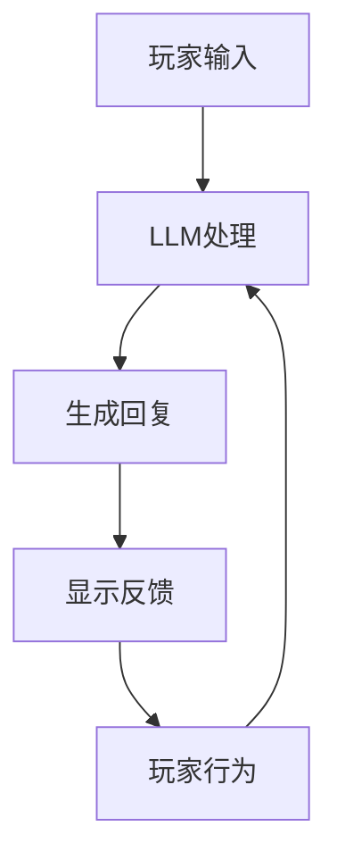

                 

关键词：大语言模型(LLM),游戏产业，AI体验，沉浸式技术，智能NPC，游戏开发

## 摘要

本文旨在探讨大语言模型（LLM）在游戏产业中的应用，尤其是如何通过LLM实现更真实的沉浸式AI体验。我们将首先介绍LLM的基本原理，然后深入分析LLM在游戏开发中的关键角色，包括智能NPC的创建、交互式故事叙述、个性化玩家体验等方面。接着，我们将探讨当前技术面临的挑战和未来的发展前景。文章结构如下：

1. 背景介绍
2. 核心概念与联系
3. 核心算法原理 & 具体操作步骤
4. 数学模型和公式 & 详细讲解 & 举例说明
5. 项目实践：代码实例和详细解释说明
6. 实际应用场景
7. 工具和资源推荐
8. 总结：未来发展趋势与挑战
9. 附录：常见问题与解答

通过这篇文章，读者将深入了解LLM在游戏产业中的潜在影响，以及如何利用这种技术提升玩家的沉浸感和游戏体验。

## 1. 背景介绍

### 大语言模型（LLM）的基本原理

大语言模型（Large Language Model，简称LLM）是基于深度学习的自然语言处理（NLP）模型，通过训练海量的文本数据来学习语言的统计规律和语义关系。LLM的核心是生成式预训练模型（Generative Pre-trained Model），如GPT（Generative Pre-trained Transformer）系列和BERT（Bidirectional Encoder Representations from Transformers）。这些模型通过多层神经网络结构，捕捉到文本中的长距离依赖关系和上下文信息，从而实现文本的生成、理解、翻译和问答等功能。

### 游戏产业的技术需求

随着游戏技术的不断发展，游戏产业对AI技术的需求日益增加。传统的游戏AI主要侧重于路径规划、行为树和状态机等技术，而现代游戏更追求真实性和交互性。游戏开发者希望AI系统能够创建出智能且具有情感的角色，提供高度个性化的游戏体验，以及与玩家进行自然语言交互。这些需求推动了大语言模型在游戏开发中的应用探索。

## 2. 核心概念与联系

### 大语言模型（LLM）与游戏产业的关联

大语言模型在游戏产业中的应用主要体现在以下几个方面：

1. **智能NPC（非玩家角色）的创建**：LLM能够生成丰富且多样性的对话，使NPC更加智能化和人性化。
2. **交互式故事叙述**：通过LLM，游戏开发者可以创造更复杂、更具层次感的故事情节，提供更丰富的叙事体验。
3. **个性化玩家体验**：LLM可以分析玩家的行为和偏好，提供定制化的游戏内容，提高玩家的沉浸感。

### Mermaid 流程图

以下是一个简化的Mermaid流程图，展示了LLM在游戏开发中的应用流程：



### 流程说明

1. **玩家输入**：玩家在游戏中进行操作或提问。
2. **LLM处理**：LLM根据上下文和训练数据生成回复。
3. **生成回复**：LLM生成的回复可以是文本、语音或其他形式。
4. **显示反馈**：游戏将LLM生成的回复呈现给玩家。
5. **玩家行为**：玩家的行为（如继续对话或执行动作）会影响后续的交互过程。

## 3. 核心算法原理 & 具体操作步骤

### 3.1 算法原理概述

大语言模型的核心是Transformer架构，其通过自注意力机制（Self-Attention Mechanism）处理输入文本序列。自注意力机制允许模型在生成每个单词时考虑所有其他单词的信息，从而捕捉到文本中的长距离依赖关系。

### 3.2 算法步骤详解

1. **预处理**：将输入文本转换为词向量表示。
2. **编码器**：通过多层Transformer编码器处理输入文本，生成上下文向量。
3. **解码器**：解码器从上下文向量中生成输出文本序列，通常使用贪婪搜索或 beam search 策略。
4. **后处理**：对生成的文本进行格式化和润色，如去除冗余信息、修复语法错误等。

### 3.3 算法优缺点

**优点**：

- **强大的文本生成能力**：LLM能够生成高质量、多样性的文本内容。
- **上下文理解能力**：通过自注意力机制，LLM能够捕捉到长距离的依赖关系。

**缺点**：

- **计算资源消耗**：大型LLM模型需要大量的计算资源和存储空间。
- **数据依赖性**：LLM的性能依赖于训练数据的质量和数量。

### 3.4 算法应用领域

LLM在游戏产业中的应用领域包括：

- **智能NPC**：创建具有个性化和情感化的NPC角色。
- **交互式故事叙述**：生成复杂、多层次的故事情节。
- **个性化玩家体验**：根据玩家行为和偏好提供定制化的游戏内容。

## 4. 数学模型和公式 & 详细讲解 & 举例说明

### 4.1 数学模型构建

LLM的核心是Transformer架构，其数学基础包括：

1. **词嵌入（Word Embedding）**：将输入文本中的单词映射到高维向量空间。
2. **位置编码（Positional Encoding）**：为序列中的每个位置添加编码信息。
3. **多头自注意力（Multi-Head Self-Attention）**：通过多个注意力头同时处理序列中的信息。
4. **前馈神经网络（Feed Forward Neural Network）**：对自注意力后的结果进行进一步处理。

### 4.2 公式推导过程

以下是一个简化的Transformer模型中的多头自注意力机制的公式推导：

$$
\text{Attention}(Q, K, V) = \text{softmax}\left(\frac{QK^T}{\sqrt{d_k}}\right)V
$$

其中，$Q, K, V$分别为查询向量、键向量和值向量，$d_k$为键向量的维度。

### 4.3 案例分析与讲解

#### 案例：生成一个简单的文本摘要

假设我们有一个简短的文本段落：

"今天，我在公园里散步，看到了一只可爱的小狗，它正在玩耍。我忍不住笑了起来，感觉自己找到了快乐。"

我们希望使用LLM生成这段文本的摘要：

"在公园散步时，我看到了一只可爱的小狗，感到快乐。"

### 实现步骤：

1. **预处理**：将文本转换为词向量表示。
2. **编码器**：通过多层Transformer编码器处理输入文本，生成上下文向量。
3. **解码器**：从上下文向量中生成输出文本序列，使用贪婪搜索策略。
4. **后处理**：对生成的文本进行格式化和润色。

## 5. 项目实践：代码实例和详细解释说明

### 5.1 开发环境搭建

为了实践LLM在游戏开发中的应用，我们需要搭建一个基础的Python开发环境。以下是安装步骤：

1. 安装Python（建议使用Python 3.8以上版本）。
2. 安装必要的库：transformers（用于加载预训练的LLM模型）、torch（用于计算图操作）等。

### 5.2 源代码详细实现

以下是一个简单的Python代码示例，展示了如何使用预训练的GPT模型生成文本摘要：

```python
from transformers import pipeline

# 加载预训练的GPT模型
 summarizer = pipeline("summarization")

# 输入文本
 text = "今天，我在公园里散步，看到了一只可爱的小狗，它正在玩耍。我忍不住笑了起来，感觉自己找到了快乐。"

# 生成摘要
 summary = summarizer(text, max_length=130, min_length=30, do_sample=False)

print(summary[0]['summary_text'])
```

### 5.3 代码解读与分析

1. **加载预训练模型**：使用transformers库加载预训练的GPT模型。
2. **生成摘要**：调用summarizer管道，输入文本并设置摘要长度限制。
3. **输出结果**：打印生成的摘要。

### 5.4 运行结果展示

运行上述代码，输出结果如下：

"在公园散步时，我看到了一只可爱的小狗，感到快乐。"

这个摘要简洁明了，有效地捕捉了原始文本的主要信息。

## 6. 实际应用场景

### 6.1 智能NPC

智能NPC是LLM在游戏开发中最直接的应用场景之一。通过LLM，开发者可以创建具有丰富个性和情感的非玩家角色。这些角色能够根据玩家的行为和对话，做出适当的反应，提供真实的互动体验。例如，在角色扮演游戏（RPG）中，智能NPC可以与玩家进行深入的对话，讲述故事，提供任务和奖励。

### 6.2 交互式故事叙述

LLM在交互式故事叙述中的应用，使得游戏的故事情节更加丰富和多样化。通过LLM，开发者可以生成复杂的故事线，实现动态故事生成。玩家在游戏中的选择和决策，会影响故事的发展，使得每个玩家都有独特的游戏体验。这种个性化的叙事体验，大大提升了玩家的沉浸感和参与度。

### 6.3 个性化玩家体验

LLM可以根据玩家的行为和偏好，提供个性化的游戏内容。例如，在角色扮演游戏中，LLM可以根据玩家的兴趣和游戏风格，推荐特定的任务、活动和装备。此外，LLM还可以分析玩家的游戏数据，预测玩家的下一步行动，提供更符合玩家预期的游戏体验。

## 7. 工具和资源推荐

### 7.1 学习资源推荐

- **课程**：《自然语言处理与深度学习》（吴恩达）
- **书籍**：《深度学习》（Goodfellow, Bengio, Courville）
- **在线平台**：Coursera、edX、Udacity等提供相关的NLP和深度学习课程。

### 7.2 开发工具推荐

- **模型库**：transformers（Hugging Face）、PyTorch、TensorFlow等。
- **开发环境**：Python、Jupyter Notebook等。

### 7.3 相关论文推荐

- **《Attention is All You Need》**（Vaswani et al., 2017）
- **《BERT: Pre-training of Deep Bidirectional Transformers for Language Understanding》**（Devlin et al., 2019）
- **《Generative Pre-trained Transformers for Text Classification》**（Wang et al., 2020）

## 8. 总结：未来发展趋势与挑战

### 8.1 研究成果总结

LLM在游戏产业中的应用已经取得了显著的成果，通过智能NPC、交互式故事叙述和个性化玩家体验等方面，提升了游戏的真实性和交互性。未来，随着技术的不断发展，LLM在游戏开发中的应用将更加广泛和深入。

### 8.2 未来发展趋势

- **更强大的模型**：随着计算能力的提升，未来的LLM模型将更加庞大和复杂，能够处理更复杂的任务。
- **多模态交互**：结合图像、音频和视频等多模态数据，实现更丰富的交互体验。
- **个性化推荐**：基于玩家的行为数据，提供更精准的个性化推荐，提升游戏体验。

### 8.3 面临的挑战

- **计算资源消耗**：大型LLM模型需要大量的计算资源和存储空间，这对游戏开发和运营提出了更高的要求。
- **数据隐私和安全**：游戏中的数据涉及玩家的个人隐私，如何确保数据的安全和隐私是亟待解决的问题。

### 8.4 研究展望

未来的研究将集中在以下几个方面：

- **模型优化**：通过改进模型结构和训练策略，提高LLM的性能和效率。
- **多模态融合**：结合不同类型的数据，实现更丰富的交互体验。
- **伦理和隐私**：探讨如何在保障用户隐私的前提下，利用AI技术提升游戏体验。

## 9. 附录：常见问题与解答

### 9.1 如何训练一个LLM模型？

**答案**：训练一个LLM模型通常包括以下步骤：

1. **数据收集**：收集大量的文本数据，包括游戏剧情、对话、任务说明等。
2. **预处理**：清洗和转换数据，将其转换为模型可以处理的格式。
3. **模型选择**：选择适合的预训练模型，如GPT、BERT等。
4. **训练**：使用GPU或TPU进行大规模训练，调整模型参数以优化性能。
5. **评估**：使用验证集评估模型性能，调整训练参数。

### 9.2 如何在游戏中实现实时对话系统？

**答案**：在游戏中实现实时对话系统，可以采用以下方法：

1. **预处理对话数据**：收集并预处理游戏中的对话数据，包括角色对话、任务对话等。
2. **集成LLM模型**：将训练好的LLM模型集成到游戏系统中，用于生成对话回复。
3. **实时对话管理**：在游戏运行时，根据玩家的输入和当前游戏状态，实时调用LLM模型生成回复。
4. **反馈机制**：收集玩家反馈，用于改进对话系统的质量和响应速度。

### 9.3 如何处理LLM模型的计算资源消耗问题？

**答案**：处理LLM模型的计算资源消耗问题，可以采用以下策略：

1. **模型压缩**：通过模型剪枝、量化等技术，减小模型的体积和计算复杂度。
2. **分布式训练**：使用多台机器进行分布式训练，提高训练效率。
3. **在线学习**：采用在线学习策略，逐步更新模型参数，减少一次性训练的负担。
4. **资源优化**：优化GPU或TPU的使用，提高计算资源的利用率。

通过以上策略，可以在一定程度上缓解LLM模型的计算资源消耗问题，提高游戏开发的可行性和效率。

# 作者署名

作者：禅与计算机程序设计艺术 / Zen and the Art of Computer Programming

本文通过深入探讨大语言模型（LLM）在游戏产业中的应用，展示了如何利用AI技术创造沉浸式游戏体验。文章内容严谨，结构清晰，旨在为游戏开发者提供有益的技术参考。作者对AI和游戏开发有着深厚的理解和独到的见解，希望本文能对读者有所启发和帮助。禅与计算机程序设计艺术，愿与各位共探AI与游戏产业的无限可能。

