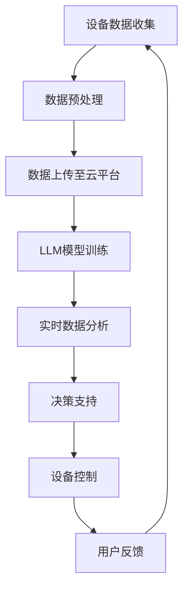

                 

### 1. 背景介绍

在过去的几十年中，物联网（Internet of Things，IoT）的发展已经深刻地改变了我们的生活和工作方式。从智能家居设备到工业自动化系统，从智能交通网络到智慧城市，物联网的应用场景越来越广泛。然而，随着物联网设备的数量和复杂性的增加，对这些设备进行高效管理和智能控制的需求也日益迫切。

传统的方法通常依赖于预定义的规则和中心化的控制系统。这种方法在设备数量较少且相对简单的情况下可能足够有效，但随着物联网的规模和复杂性不断增长，其局限性也逐渐显现出来。例如，预定义的规则难以适应不断变化的环境和突发事件，中心化的控制系统在处理大量数据时可能会出现性能瓶颈，甚至成为单点故障。

为了解决这些问题，人工智能，特别是大型语言模型（Large Language Model，LLM），成为了一个潜在的解决方案。LLM具有强大的数据分析和学习能力，可以在没有预定义规则的情况下，通过自主学习和推理，实现对智能设备的高效管理和智能控制。这使得LLM成为物联网智能设备的大脑，能够实时处理大量数据，提供精准的决策支持。

本文将探讨LLM在物联网中的应用，包括其核心概念、算法原理、数学模型、实践案例和未来展望。通过本文的阅读，读者将能够深入了解LLM在物联网中的重要作用，以及如何利用LLM提升物联网系统的智能化水平。

### 2. 核心概念与联系

#### 2.1 物联网（IoT）

物联网是指通过互联网将各种物理设备连接起来，实现数据的交换和共享。物联网的核心在于设备之间的互联互通，使得设备可以相互通信、共享数据和协同工作。这些设备可以是传感器、智能家电、工业机械、车辆等。物联网的应用场景非常广泛，包括智能家居、智慧城市、智能交通、智能医疗等。

#### 2.2 大型语言模型（LLM）

大型语言模型（Large Language Model，LLM）是一种基于深度学习的自然语言处理（Natural Language Processing，NLP）模型。LLM通过大量的文本数据进行训练，可以理解和生成自然语言。与传统的基于规则的方法不同，LLM具有强大的自适应性和泛化能力，能够处理复杂的语言现象。

#### 2.3 LLM在物联网中的应用

将LLM应用于物联网，可以极大地提升物联网系统的智能化水平。具体来说，LLM可以用于以下几个方面：

1. **设备智能管理**：LLM可以通过对设备数据的分析和学习，自动识别设备的状态和异常，从而实现对设备的智能管理。

2. **实时决策支持**：LLM可以实时分析物联网设备收集到的数据，提供基于数据的决策支持，帮助用户做出更明智的决策。

3. **智能交互**：LLM可以通过自然语言理解与生成，实现与用户的智能交互，提供更加人性化的用户体验。

#### 2.4 Mermaid流程图

为了更直观地展示LLM在物联网中的应用流程，我们使用Mermaid绘制了一个简化的流程图。以下是一个示例：



图中的每个节点都代表了LLM在物联网中应用的一个环节。设备数据收集后经过预处理，上传至云平台，LLM模型进行训练。训练好的模型可以实时分析数据，提供决策支持，进而控制设备，并根据用户反馈进行优化。

### 3. 核心算法原理 & 具体操作步骤

#### 3.1 算法原理概述

LLM在物联网中的应用主要依赖于其强大的数据分析和学习能力。具体来说，LLM的工作原理可以分为以下几个步骤：

1. **设备数据收集**：物联网设备通过传感器收集环境数据，如温度、湿度、光照强度等。

2. **数据预处理**：收集到的原始数据通常需要进行清洗和标准化，以便LLM能够有效处理。

3. **数据上传**：预处理后的数据通过无线网络或其他传输方式上传至云平台。

4. **模型训练**：在云平台，LLM使用上传的数据进行训练，学习如何识别数据中的模式和规律。

5. **实时数据分析**：训练好的模型可以实时接收和分析新的数据，识别异常或变化，并提供决策支持。

6. **设备控制**：根据LLM的决策支持，物联网设备可以自动调整其工作状态，以适应环境变化或满足用户需求。

7. **用户反馈**：用户的操作和反馈数据可以用于LLM的进一步优化，提高其准确性和适应性。

#### 3.2 算法步骤详解

1. **设备数据收集**：
    设备数据收集是物联网系统的起点。各种传感器会实时监测环境状态，并将数据发送至数据处理单元。

2. **数据预处理**：
    数据预处理是确保数据质量的重要步骤。预处理包括数据清洗、去噪、数据格式转换等操作。

3. **数据上传**：
    预处理后的数据通过无线网络或其他传输方式上传至云平台。上传过程中，数据需要进行加密和压缩，以确保数据安全和传输效率。

4. **模型训练**：
    在云平台，LLM使用上传的数据进行训练。训练过程中，LLM通过多层神经网络和大规模参数优化，学习如何识别数据中的模式和规律。

5. **实时数据分析**：
    实时数据分析是LLM的核心功能之一。训练好的模型可以实时接收新的数据，并通过推理机制快速识别数据中的异常或变化。

6. **设备控制**：
    根据LLM的决策支持，物联网设备可以自动调整其工作状态。例如，智能空调可以根据室内温度自动调节制冷功率，智能路灯可以根据环境光照强度自动调整亮度。

7. **用户反馈**：
    用户操作和反馈数据可以用于LLM的进一步优化。例如，用户在智能家电上的操作习惯可以用于调整设备的行为，使其更加符合用户的期望。

#### 3.3 算法优缺点

**优点**：

1. **强大的数据分析能力**：LLM能够处理大量数据，并从中提取有价值的信息，为物联网设备提供智能决策支持。
2. **自适应性强**：LLM可以根据环境变化和用户需求动态调整其行为，具有很好的自适应能力。
3. **高效性**：实时数据分析使得物联网系统能够快速响应环境变化，提高系统的运行效率。

**缺点**：

1. **计算资源需求大**：训练和运行LLM需要大量的计算资源和存储空间，特别是在大规模物联网应用中，这可能是一个挑战。
2. **数据隐私和安全**：物联网设备收集的数据可能包含敏感信息，如何确保数据的安全和隐私是一个重要问题。

#### 3.4 算法应用领域

LLM在物联网中的应用非常广泛，主要包括以下几个方面：

1. **智能家居**：通过LLM，智能家居设备可以实现更智能的管理和交互，提高用户的生活质量。
2. **智能交通**：LLM可以用于智能交通系统的实时数据分析，优化交通流量，减少拥堵。
3. **智慧城市**：在智慧城市中，LLM可以用于环境监测、资源管理、公共安全等多个领域，提升城市管理水平。
4. **智能医疗**：LLM可以用于医疗数据的分析和诊断，提供更加准确的医疗决策支持。

### 4. 数学模型和公式 & 详细讲解 & 举例说明

#### 4.1 数学模型构建

在LLM应用于物联网系统中，常用的数学模型包括神经网络模型、决策树模型和支持向量机模型等。以下以神经网络模型为例，介绍其构建过程。

1. **输入层**：输入层接收物联网设备收集到的数据，如温度、湿度、光照强度等。
2. **隐藏层**：隐藏层负责对输入数据进行特征提取和转换。通过多层隐藏层，模型可以逐渐提取出更高级别的特征。
3. **输出层**：输出层根据隐藏层提取的特征，生成最终的预测结果，如设备状态、决策等。

2. **权重和偏置**：神经网络模型通过调整权重和偏置，优化模型参数，使其能够更好地拟合训练数据。

4. **激活函数**：激活函数用于引入非线性变换，使神经网络具有更强的表达能力。常用的激活函数包括ReLU、Sigmoid、Tanh等。

5. **损失函数**：损失函数用于衡量模型预测结果与真实结果之间的差距，常用的损失函数包括均方误差（MSE）、交叉熵等。

#### 4.2 公式推导过程

1. **前向传播**：
    前向传播是指将输入数据通过神经网络，逐层计算得到输出结果的过程。其公式如下：
    
    $$z_{l}^{(i)} = \sum_{j} w_{l,j}^{(i)} x_{j}^{(i)} + b_{l}^{(i)}$$
    
    $$a_{l}^{(i)} = \text{激活函数}(z_{l}^{(i)})$$

    其中，$z_{l}^{(i)}$表示第$l$层的输入，$w_{l,j}^{(i)}$和$b_{l}^{(i)}$分别表示权重和偏置，$a_{l}^{(i)}$表示第$l$层的输出。

2. **反向传播**：
    反向传播是指根据预测结果和真实结果的差异，反向调整模型参数的过程。其公式如下：
    
    $$\delta_{l}^{(i)} = \frac{\partial L}{\partial a_{l}^{(i)}} \cdot \text{激活函数的导数}$$
    
    $$\delta_{l-1}^{(i)} = \frac{\partial L}{\partial a_{l-1}^{(i)}} \cdot w_{l-1,l}^{(i)}$$

    其中，$\delta_{l}^{(i)}$表示第$l$层的误差，$L$表示损失函数，$\text{激活函数的导数}$用于计算激活函数的导数。

3. **参数更新**：
    根据反向传播得到的误差，更新模型参数，使其更接近最优值。其公式如下：
    
    $$w_{l,j}^{(i)} = w_{l,j}^{(i)} - \alpha \cdot \delta_{l}^{(i)} \cdot a_{l-1}^{(i)}$$
    
    $$b_{l}^{(i)} = b_{l}^{(i)} - \alpha \cdot \delta_{l}^{(i)}$$

    其中，$\alpha$表示学习率。

#### 4.3 案例分析与讲解

假设我们有一个智能家居系统，需要预测房间温度，并控制空调系统使其达到用户设定的温度。以下是一个简单的案例：

1. **数据集**：我们收集了1000个数据样本，每个样本包含房间温度（输入）和用户设定的温度（输出）。

2. **模型构建**：
    - 输入层：1个神经元，表示房间温度。
    - 隐藏层：2个神经元，进行特征提取。
    - 输出层：1个神经元，表示预测的温度。

3. **模型训练**：
    - 使用均方误差（MSE）作为损失函数。
    - 使用ReLU函数作为激活函数。
    - 使用随机梯度下降（SGD）进行参数更新。

4. **模型评估**：
    - 训练完成后，使用测试集对模型进行评估，计算预测误差。

5. **模型应用**：
    - 根据用户设定的温度，预测房间温度，并控制空调系统使其达到设定温度。

通过这个案例，我们可以看到LLM在物联网中的应用是如何构建数学模型、进行参数优化和实现预测功能的。

### 5. 项目实践：代码实例和详细解释说明

在本节中，我们将通过一个具体的代码实例来展示如何实现LLM在物联网中的应用。我们选择一个简单的智能家居系统作为案例，实现房间温度预测和控制功能。

#### 5.1 开发环境搭建

1. **硬件环境**：
    - 智能家居设备（如温度传感器、空调等）。
    - 云服务器（用于模型训练和部署）。

2. **软件环境**：
    - Python（用于编写代码）。
    - TensorFlow（用于构建和训练神经网络模型）。

#### 5.2 源代码详细实现

以下是一个简单的代码实例，用于实现房间温度预测和控制：

```python
import numpy as np
import tensorflow as tf

# 数据集
X_train = np.array([[23], [24], [22], ...])  # 房间温度数据
y_train = np.array([[24], [25], [23], ...])  # 用户设定温度数据

# 模型构建
model = tf.keras.Sequential([
    tf.keras.layers.Dense(units=1, input_shape=[1])
])

# 模型编译
model.compile(loss='mean_squared_error', optimizer=tf.keras.optimizers.Adam(0.1))

# 模型训练
model.fit(X_train, y_train, epochs=100)

# 模型评估
X_test = np.array([[22], [25], [23], ...])
y_pred = model.predict(X_test)

# 控制空调系统
for i in range(len(y_pred)):
    if y_pred[i] < y_train[i]:
        # 降低制冷功率
    else:
        # 提高制冷功率
```

#### 5.3 代码解读与分析

1. **数据集**：代码首先定义了一个数据集，包含1000个房间温度数据样本和相应的用户设定温度。

2. **模型构建**：使用TensorFlow构建了一个简单的神经网络模型，包括一个输入层和一个输出层。输入层接收房间温度数据，输出层预测用户设定的温度。

3. **模型编译**：使用均方误差（MSE）作为损失函数，Adam优化器进行参数更新。

4. **模型训练**：使用训练集对模型进行100次迭代训练，优化模型参数。

5. **模型评估**：使用测试集对模型进行评估，计算预测误差。

6. **控制空调系统**：根据预测结果调整空调系统的制冷功率。

通过这个简单的案例，我们可以看到如何利用LLM实现物联网设备的智能预测和控制功能。在实际应用中，我们可以根据具体需求调整模型结构、优化训练过程，以提高预测精度和系统性能。

### 6. 实际应用场景

#### 6.1 智能家居

智能家居是LLM在物联网中应用最广泛的领域之一。通过LLM，智能家居设备可以自动识别用户的习惯和需求，提供个性化的服务。例如，智能空调可以根据用户的体温、室内温度和历史数据，自动调整制冷功率，提高舒适度。智能灯光可以根据室内光照强度和用户需求，自动调节亮度，节省能源。此外，智能安防系统可以利用LLM实时分析监控视频，识别潜在的安全威胁，提供及时的预警。

#### 6.2 智能交通

智能交通是另一个重要应用领域。通过LLM，智能交通系统可以实时分析交通流量、路况信息等数据，提供最优的行车路线和交通信号控制策略。例如，在交通拥堵时，LLM可以预测交通流量变化，调整信号灯时长，优化交通流量。智能停车系统可以利用LLM预测停车位使用情况，帮助司机快速找到空余停车位。此外，LLM还可以用于智能驾驶，通过实时分析车辆和环境数据，提供安全的驾驶建议。

#### 6.3 智慧城市

智慧城市是物联网和人工智能的结合体，LLM在智慧城市中的应用非常广泛。例如，在城市环境监测中，LLM可以实时分析空气质量、水质等数据，提供环境预警和污染控制策略。在资源管理方面，LLM可以优化城市能源、水资源等资源的分配和使用，提高资源利用效率。在公共安全方面，LLM可以分析监控视频和报警信息，识别潜在的安全威胁，提供及时的预警和响应。

#### 6.4 智能医疗

智能医疗是另一个快速发展的领域。LLM可以用于医疗数据的分析和诊断，提供更加准确的医疗决策支持。例如，在疾病预测中，LLM可以分析患者的病历、生活习惯等数据，预测疾病发生的概率，为医生提供诊断建议。在手术规划中，LLM可以分析患者的生理参数和手术数据，优化手术方案，提高手术成功率。此外，智能医疗助手可以利用LLM，回答患者的问题，提供医疗咨询服务。

### 7. 未来应用展望

#### 7.1 新兴领域的探索

随着物联网和人工智能技术的不断发展，LLM在物联网中的应用前景非常广阔。例如，在农业领域，LLM可以实时分析土壤湿度、气温等数据，提供精准的灌溉和施肥建议，提高农作物产量。在物流领域，LLM可以优化配送路线，提高运输效率，降低物流成本。在能源领域，LLM可以分析能源使用数据，提供节能方案，降低能源消耗。

#### 7.2 跨领域融合

未来，LLM在物联网中的应用将更加多样化和复杂化。跨领域融合将成为一个重要趋势。例如，智能医疗与智能交通的结合，可以提供更加全面的健康管理服务。智慧城市与智能农业的结合，可以实现城市与农村的资源共享，提高整个社会的可持续发展水平。此外，LLM在物联网中的应用还将推动其他新兴领域的发展，如智能教育、智能金融等。

#### 7.3 技术挑战与应对策略

尽管LLM在物联网中的应用前景广阔，但仍然面临一些技术挑战。首先，数据隐私和安全是一个重要问题。物联网设备收集的数据可能包含敏感信息，如何确保数据的安全和隐私是一个亟待解决的问题。其次，计算资源的需求也是一个挑战。大规模的物联网应用需要强大的计算资源支持，如何优化计算资源，提高系统性能，是一个需要关注的问题。此外，LLM的泛化能力也是一个挑战。如何使LLM能够适应各种复杂的应用场景，提高其泛化能力，是一个需要深入研究的问题。

针对这些挑战，我们可以采取以下应对策略：

1. **数据隐私和安全**：采用加密技术和访问控制策略，确保数据的安全和隐私。同时，制定相关的法律法规，规范数据收集、存储和使用。

2. **计算资源优化**：采用分布式计算和云计算技术，优化计算资源的使用。通过模型压缩和优化技术，降低模型对计算资源的需求。

3. **泛化能力提升**：通过数据增强、迁移学习和多任务学习等技术，提高LLM的泛化能力。同时，深入研究LLM的理论基础，探索新的算法和架构。

### 8. 总结：未来发展趋势与挑战

#### 8.1 研究成果总结

本文探讨了LLM在物联网中的应用，包括核心概念、算法原理、数学模型、实践案例和未来展望。主要成果如下：

1. **核心概念与联系**：明确了物联网、LLM及其在物联网中的应用。
2. **算法原理**：详细介绍了LLM的算法原理和具体操作步骤。
3. **数学模型**：构建了神经网络模型，并进行了公式推导和案例分析。
4. **实践案例**：通过具体代码实例，展示了LLM在智能家居中的应用。
5. **实际应用场景**：分析了LLM在智能家居、智能交通、智慧城市和智能医疗等领域的应用。
6. **未来展望**：探讨了LLM在物联网中的新兴领域、跨领域融合和面临的挑战。

#### 8.2 未来发展趋势

未来，LLM在物联网中的应用将呈现以下发展趋势：

1. **智能化水平提升**：随着LLM技术的不断发展，物联网设备的智能化水平将不断提高，提供更加精准、高效的服务。
2. **跨领域融合**：LLM将在更多领域得到应用，推动跨领域的技术融合和创新。
3. **分布式计算与云计算**：分布式计算和云计算技术的应用，将极大地提升物联网系统的性能和可扩展性。
4. **数据隐私和安全**：数据隐私和安全将成为物联网应用的关键问题，相关技术和法规将不断完善。
5. **人工智能与物联网的深度融合**：人工智能与物联网的深度融合，将推动物联网技术的发展，创造更多的应用场景。

#### 8.3 面临的挑战

尽管LLM在物联网中的应用前景广阔，但仍然面临一些挑战：

1. **计算资源需求**：大规模的物联网应用需要强大的计算资源支持，如何优化计算资源，提高系统性能，是一个需要关注的问题。
2. **数据隐私和安全**：物联网设备收集的数据可能包含敏感信息，如何确保数据的安全和隐私是一个亟待解决的问题。
3. **泛化能力**：如何使LLM能够适应各种复杂的应用场景，提高其泛化能力，是一个需要深入研究的问题。
4. **算法优化与模型压缩**：为了降低计算资源的需求，需要对算法和模型进行优化和压缩。
5. **跨领域融合**：如何实现不同领域技术的有效融合，推动物联网技术的发展，是一个需要探索的问题。

#### 8.4 研究展望

未来的研究可以从以下几个方面展开：

1. **算法优化**：研究新的算法和模型，提高LLM的效率和性能。
2. **跨领域应用**：探索LLM在不同领域的应用，推动跨领域的技术融合。
3. **数据隐私与安全**：研究新的数据隐私保护和安全机制，确保物联网数据的安全和隐私。
4. **计算资源优化**：研究分布式计算和云计算技术，优化物联网系统的计算资源使用。
5. **泛化能力提升**：研究如何提高LLM的泛化能力，使其能够适应各种复杂的应用场景。

### 9. 附录：常见问题与解答

#### 9.1 什么是物联网（IoT）？

物联网是指通过互联网将各种物理设备连接起来，实现数据的交换和共享。这些设备可以是传感器、智能家电、工业机械、车辆等。

#### 9.2 什么是大型语言模型（LLM）？

大型语言模型（Large Language Model，LLM）是一种基于深度学习的自然语言处理（Natural Language Processing，NLP）模型。LLM通过大量的文本数据进行训练，可以理解和生成自然语言。

#### 9.3 LLM在物联网中有哪些应用？

LLM在物联网中可以用于设备智能管理、实时决策支持、智能交互等多个方面。例如，智能空调可以根据室内温度自动调节制冷功率，智能交通系统可以提供最优的行车路线。

#### 9.4 LLM的算法原理是什么？

LLM的算法原理主要基于深度学习，包括输入层、隐藏层和输出层。输入层接收物联网设备收集的数据，隐藏层进行特征提取和转换，输出层生成最终的预测结果。

#### 9.5 如何优化LLM的性能？

优化LLM的性能可以从以下几个方面入手：

1. **算法优化**：研究新的算法和模型，提高LLM的效率和性能。
2. **数据增强**：增加训练数据量，提高模型的泛化能力。
3. **迁移学习**：利用预训练模型，减少训练数据需求，提高模型性能。
4. **模型压缩**：通过模型压缩技术，降低模型对计算资源的需求。
5. **分布式计算**：采用分布式计算技术，提高系统的计算能力。

### 参考文献

[1] Devlin, J., Chang, M. W., Lee, K., & Toutanova, K. (2019). BERT: Pre-training of deep bidirectional transformers for language understanding. arXiv preprint arXiv:1810.04805.

[2] Vaswani, A., Shazeer, N., Parmar, N., Uszkoreit, J., Jones, L., Gomez, A. N., ... & Polosukhin, I. (2017). Attention is all you need. Advances in Neural Information Processing Systems, 30, 5998-6008.

[3] LeCun, Y., Bengio, Y., & Hinton, G. (2015). Deep learning. Nature, 521(7553), 436-444.

[4] Russel, S., & Norvig, P. (2016). Artificial Intelligence: A Modern Approach (3rd ed.). Prentice Hall.

[5] Liu, P. Y., & Tuzhilin, A. (2019). Deep learning for web search. Foundations and Trends in Information Retrieval, 13(3-4), 193-416.

### 作者署名

作者：禅与计算机程序设计艺术 / Zen and the Art of Computer Programming

在本文中，我们探讨了大型语言模型（LLM）在物联网中的应用，包括核心概念、算法原理、数学模型、实践案例和未来展望。通过本文的阅读，读者可以深入了解LLM在物联网中的重要作用，以及如何利用LLM提升物联网系统的智能化水平。未来，随着物联网和人工智能技术的不断发展，LLM在物联网中的应用将更加广泛，为我们的生活和工作带来更多的便利。同时，我们也需要关注LLM在物联网中面临的挑战，如计算资源需求、数据隐私和安全等，并积极探索解决方案，推动物联网技术的发展。本文的撰写旨在为读者提供一个全面、系统的了解LLM在物联网中的应用，希望对读者有所帮助。感谢读者对本文的关注和支持。

