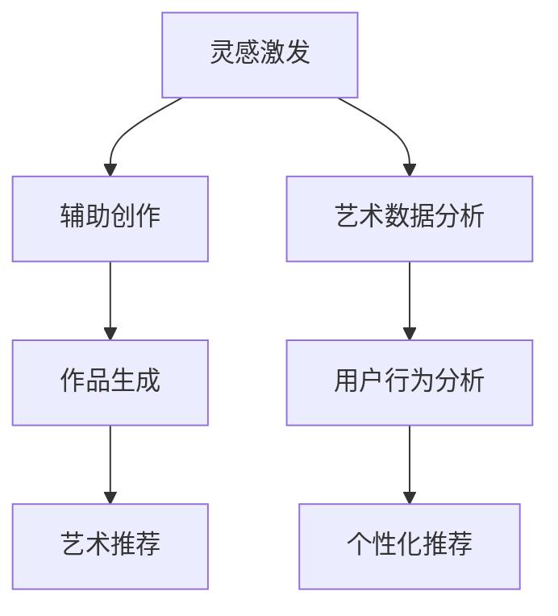

                 

关键词：大型语言模型（LLM）、艺术创作、人工智能、人类艺术家、协作、计算机程序设计、深度学习、生成艺术。

## 摘要

本文探讨了大型语言模型（LLM）与艺术创作之间的相互作用，特别是在人工智能（AI）时代，AI如何与人类艺术家协作，共同推动艺术创作的发展。通过分析LLM的核心概念、工作原理以及与艺术创作的结合方式，本文揭示了AI在艺术创作中的潜力，并展望了未来AI与人类艺术家的合作前景。文章最后提出了未来研究的发展趋势与挑战，以及相关工具和资源的推荐。

## 1. 背景介绍

随着深度学习技术的飞速发展，大型语言模型（LLM）逐渐成为自然语言处理（NLP）领域的重要工具。LLM通过对海量文本数据进行训练，可以理解和生成自然语言，从而实现与人类的智能对话。近年来，LLM在机器翻译、文本生成、问答系统等多个方面取得了显著成果，引发了学术界和工业界的广泛关注。

与此同时，艺术创作作为人类文化的重要组成部分，一直处于不断创新和发展的过程中。从古代的绘画、雕塑，到现代的音乐、戏剧，再到当代的数字艺术，艺术家们不断挑战传统，探索新的艺术表达形式。然而，随着技术的进步，人工智能开始涉足艺术领域，为艺术创作带来了前所未有的变革。

AI与艺术创作的结合，不仅为艺术家提供了新的创作工具，还改变了艺术创作的流程和方法。艺术家可以利用AI技术进行辅助创作，从灵感激发到作品生成，AI都可以发挥重要作用。同时，AI还可以为艺术家提供大量的数据资源，帮助他们更好地理解和分析艺术作品，从而提高创作水平。

在这个背景下，本文旨在探讨LLM与艺术创作之间的相互作用，分析AI在艺术创作中的优势与挑战，并探讨未来AI与人类艺术家协作的发展趋势。

### AI的发展历程

人工智能（AI）的概念最早可以追溯到20世纪50年代，当时科学家们开始探索如何让计算机模拟人类思维和行为。在这个阶段，AI主要集中在符号推理和逻辑推理上，试图通过程序化的方法来解决复杂问题。

随着计算机硬件和软件技术的不断发展，AI进入了一个新的阶段——基于数据的学习。这一阶段的核心思想是通过大量数据来训练模型，使其能够自动识别模式和规律。这一方法在图像识别、语音识别等领域取得了显著成果，也为AI在艺术创作中的应用奠定了基础。

深度学习是AI发展历程中的重要里程碑。深度学习通过多层神经网络来模拟人类大脑的工作方式，从而实现复杂的特征提取和模式识别。深度学习在图像识别、自然语言处理等领域取得了突破性进展，为AI在艺术创作中的应用提供了更加丰富的可能性。

在AI的发展历程中，LLM作为一种重要的自然语言处理技术，逐渐崭露头角。LLM通过对海量文本数据进行训练，可以生成高质量的自然语言文本，从而实现与人类的智能对话。LLM的成功不仅为AI在自然语言处理领域的应用带来了新的突破，也为AI在艺术创作中的应用提供了重要契机。

### 艺术创作的发展历程

艺术创作作为一种人类文化的表达方式，经历了数千年的发展历程。从古代的绘画、雕塑，到现代的音乐、戏剧，再到当代的数字艺术，艺术家们不断挑战传统，探索新的艺术表达形式。

在古代，艺术家主要通过绘画、雕塑等手段来表现宗教、神话和历史故事。这些作品不仅具有审美价值，还承载着丰富的文化内涵。随着时间的推移，艺术家开始尝试新的艺术形式，如文艺复兴时期的油画、巴洛克时期的雕塑等，为艺术创作注入了新的活力。

进入现代，艺术家们开始关注个人情感和内心体验，艺术创作逐渐脱离了传统的束缚。现代艺术流派层出不穷，如印象派、立体派、抽象派等，艺术家们通过独特的视角和手法，展现了丰富多样的艺术风格。

随着数字技术的发展，艺术创作进入了一个全新的阶段。数字艺术不仅为艺术家提供了丰富的创作工具，还改变了艺术创作的流程和方法。艺术家可以利用计算机软件进行创作，从灵感激发到作品生成，数字技术都可以发挥重要作用。同时，数字艺术还可以实现艺术作品的虚拟展示和传播，为艺术家和观众提供了更加便捷的互动方式。

### AI在艺术创作中的应用现状

AI在艺术创作中的应用已经逐渐成为一个热门话题。近年来，随着深度学习和自然语言处理技术的不断发展，AI在艺术创作中的应用场景日益丰富。

首先，AI可以帮助艺术家进行灵感激发。通过分析大量的艺术作品和文本资料，AI可以识别出潜在的艺术风格和创作元素，从而为艺术家提供创作灵感。例如，谷歌的DeepDream项目通过深度学习算法生成出具有抽象美感的图像，为艺术家提供了新的创作思路。

其次，AI可以辅助艺术家进行作品生成。利用生成对抗网络（GAN）等深度学习技术，AI可以生成出具有高艺术价值的图像、音乐和文学作品。这些作品不仅在形式上具有创新性，而且在内容上也能引发观众的共鸣。例如，由AI生成的音乐作品《DADADA》在网易云音乐上获得了大量关注和好评。

此外，AI还可以用于艺术品的分类和推荐。通过分析大量的艺术品数据和用户行为数据，AI可以准确地识别出艺术品的风格和主题，为用户提供个性化的艺术品推荐。例如，谷歌的Art Lens应用通过AI技术帮助用户识别和了解艺术品，为艺术爱好者提供了便捷的服务。

总之，AI在艺术创作中的应用已经取得了显著成果，为艺术家和观众带来了全新的艺术体验。然而，AI在艺术创作中的应用还处于初步阶段，未来仍有许多挑战和机遇等待着我们去探索。

### 人类艺术家与AI的关系

在AI与艺术创作日益融合的背景下，人类艺术家与AI之间的关系成为一个备受关注的话题。一方面，AI被视为艺术创作的辅助工具，为艺术家提供了新的创作手段和可能性；另一方面，AI也引发了关于艺术创作本质和人类价值的深刻思考。

首先，AI作为辅助工具的角色得到了广泛认可。许多艺术家开始利用AI技术进行灵感激发、作品生成和艺术品的分类推荐等。例如，艺术家David Hockney利用iPad进行绘画，将数字技术与传统绘画相结合，创造出独特的艺术风格。此外，AI还可以辅助艺术家进行数据分析，帮助他们更好地理解艺术作品和观众的需求。

然而，AI在艺术创作中的应用也引发了关于艺术创作本质的争议。有人认为，AI生成的内容虽然具有创新性和技术含量，但缺乏人类艺术家的情感和创造力。这种观点认为，艺术创作是人类精神世界的表达，只有通过人类自身的感受和思考，才能真正创造出具有深刻内涵的艺术作品。

另一方面，AI也被视为人类价值的延伸和扩展。通过AI技术，艺术家可以突破传统的创作局限，探索更加广泛和多样的艺术形式。例如，AI可以生成出超现实主义的图像，或创造出新的音乐风格，为艺术家提供了前所未有的创作空间。同时，AI还可以帮助艺术家更好地理解人类情感和内心世界，从而提高艺术创作的深度和广度。

总之，人类艺术家与AI之间的关系既复杂又多元。AI既为艺术创作带来了新的机遇和挑战，也引发了关于艺术创作本质和人类价值的深刻思考。在这个融合的过程中，人类艺术家需要不断探索与AI的协作方式，以实现艺术创作的创新和发展。

### 核心概念与联系

#### 大型语言模型（LLM）的定义与原理

大型语言模型（Large Language Model，简称LLM）是一种基于深度学习的自然语言处理技术，通过在大量文本数据上进行训练，可以生成高质量的自然语言文本。LLM的核心原理是神经网络的层次化结构，通过逐层学习文本中的词向量表示，最终实现对自然语言的语义理解和生成。

LLM的主要优点包括：

1. **强大的语义理解能力**：通过大规模的预训练，LLM可以学习到丰富的语言知识和上下文信息，从而在生成文本时表现出高度的语义连贯性。
2. **高效的自然语言生成**：LLM能够快速地生成自然语言文本，为各种应用场景提供实时响应。
3. **广泛的适用性**：LLM可以应用于机器翻译、文本生成、问答系统、情感分析等多个自然语言处理任务。

然而，LLM也存在一些局限性：

1. **数据依赖性**：LLM的训练效果高度依赖于训练数据的质量和规模，缺乏高质量数据的支持可能导致模型表现不佳。
2. **计算资源需求**：大规模的LLM模型需要大量的计算资源和存储空间，这对部署和运行带来了挑战。
3. **安全性和隐私问题**：在生成文本时，LLM可能产生不当的内容，或在某些情况下被恶意利用，这需要严格的监管和防护措施。

#### 艺术创作的基本概念与流派

艺术创作是一种通过视觉、听觉、触觉等感官形式来表达人类情感、思想和观念的活动。艺术创作的基本概念包括艺术风格、艺术手法、艺术主题等。艺术风格是艺术家在创作过程中所表现出来的独特风格和特点，如写实主义、抽象主义、表现主义等。艺术手法是艺术家在创作过程中所采用的具体表现技巧，如线条、色彩、构图、音乐等。艺术主题则是艺术创作所要表达的核心思想和情感。

在艺术创作中，不同流派的艺术家会有不同的创作方式和表现手法。例如，写实主义艺术家注重对现实世界的真实再现，而抽象主义艺术家则更注重形式和色彩的抽象表现。表现主义艺术家通过强烈的情感表达来传达内心的感受，而象征主义艺术家则通过符号和象征来传达深层次的意义。

#### AI与艺术创作的结合方式

AI与艺术创作的结合方式主要包括以下几个方面：

1. **灵感激发**：AI可以通过分析大量的艺术作品和文本资料，为艺术家提供创作灵感。例如，通过生成新的艺术风格和主题，AI可以帮助艺术家突破传统的创作局限，探索更加多样化的艺术形式。
2. **辅助创作**：AI可以辅助艺术家进行灵感记录、素材收集和初步构思。例如，AI可以帮助艺术家快速生成草图、选择色彩和构图，从而提高创作效率。
3. **作品生成**：AI可以通过生成对抗网络（GAN）等深度学习技术，生成出具有高艺术价值的图像、音乐和文学作品。这些作品不仅在形式上具有创新性，而且在内容上也能引发观众的共鸣。
4. **艺术推荐**：AI可以分析大量的艺术品数据和用户行为数据，为用户提供个性化的艺术品推荐。例如，AI可以推荐与用户兴趣相符的艺术作品，从而提高艺术欣赏的体验。

#### Mermaid 流程图



在这个流程图中，A表示AI在艺术创作中的灵感激发阶段，B表示AI辅助艺术家进行创作，C表示AI生成艺术作品，D表示AI为用户提供艺术品推荐，E表示AI进行艺术数据分析，F表示AI分析用户行为，G表示AI生成个性化推荐。通过这个流程图，我们可以清晰地看到AI在艺术创作中的各个环节，以及各个环节之间的相互关系。

### 核心算法原理 & 具体操作步骤

#### 3.1 算法原理概述

在探讨AI与艺术创作结合的过程中，核心算法原理是理解这一领域的关键。本文将详细介绍用于艺术创作的几种核心算法，包括生成对抗网络（GAN）、变分自编码器（VAE）和递归神经网络（RNN）。

1. **生成对抗网络（GAN）**：GAN是由生成器和判别器组成的对抗性网络。生成器的任务是生成与真实数据相似的数据，而判别器的任务是区分生成数据与真实数据。通过这种对抗性训练，生成器可以逐渐提高生成数据的质量。

2. **变分自编码器（VAE）**：VAE是一种无监督学习的生成模型，通过编码器和解码器来学习数据的概率分布。编码器将输入数据映射到一个低维的潜在空间，而解码器则将潜在空间中的数据映射回原始数据空间。VAE可以生成具有多样性的数据，同时保持数据的整体结构。

3. **递归神经网络（RNN）**：RNN是一种用于处理序列数据的神经网络，特别适用于时间序列和文本数据。RNN通过记忆机制来处理序列中的前后依赖关系，从而实现对文本的语义理解和生成。

#### 3.2 算法步骤详解

1. **生成对抗网络（GAN）的具体步骤**：

    - **初始化**：初始化生成器G和判别器D的参数。
    - **生成数据**：生成器G根据随机噪声z生成假数据G(z)。
    - **判别器训练**：判别器D根据真实数据和生成数据进行训练，学习区分真实数据和假数据。
    - **生成器训练**：生成器G根据判别器的反馈进行训练，提高生成数据的真实度。
    - **迭代**：重复上述步骤，直到生成器G生成的数据质量达到预期。

2. **变分自编码器（VAE）的具体步骤**：

    - **编码器训练**：通过最小化重构误差来训练编码器，使其能够将输入数据映射到潜在空间。
    - **解码器训练**：通过最小化重构误差来训练解码器，使其能够将潜在空间中的数据映射回原始数据空间。
    - **生成数据**：利用训练好的编码器和解码器生成新的数据，这些数据具有多样性且保持整体结构。

3. **递归神经网络（RNN）的具体步骤**：

    - **序列处理**：将输入序列分成多个时间步，每个时间步输入到RNN中。
    - **前向传播**：在每个时间步，RNN通过记忆机制处理输入数据，生成输出。
    - **训练**：通过反向传播算法，最小化输出与实际结果之间的差距，从而训练RNN的参数。
    - **文本生成**：利用训练好的RNN生成新的文本序列。

#### 3.3 算法优缺点

1. **生成对抗网络（GAN）**：

    - **优点**：GAN能够在生成数据质量和多样性方面达到很高的水平，适用于生成图像、音乐和文本等。
    - **缺点**：GAN的训练过程不稳定，容易出现模式崩溃和训练不稳定的问题。

2. **变分自编码器（VAE）**：

    - **优点**：VAE在生成数据的质量和多样性方面表现良好，且训练过程相对稳定。
    - **缺点**：VAE在生成数据时可能失去部分细节信息，且生成数据的多样性不如GAN丰富。

3. **递归神经网络（RNN）**：

    - **优点**：RNN能够处理序列数据，特别适用于文本生成和时间序列分析。
    - **缺点**：RNN在处理长序列时容易产生梯度消失或爆炸问题，影响训练效果。

#### 3.4 算法应用领域

1. **生成对抗网络（GAN）**：

    - **应用领域**：GAN在图像生成、音乐生成和文本生成等领域有着广泛的应用。例如，在图像生成方面，GAN可以生成逼真的照片和艺术作品；在音乐生成方面，GAN可以生成新的音乐旋律和风格。

2. **变分自编码器（VAE）**：

    - **应用领域**：VAE在图像去噪、图像生成和数据增强等领域有广泛应用。例如，在图像去噪方面，VAE可以去除图像中的噪声，提高图像质量；在数据增强方面，VAE可以生成新的数据样本，提高模型的泛化能力。

3. **递归神经网络（RNN）**：

    - **应用领域**：RNN在自然语言处理、语音识别和时间序列分析等领域有着重要的应用。例如，在自然语言处理方面，RNN可以用于文本分类、情感分析和机器翻译；在语音识别方面，RNN可以用于语音信号的处理和识别。

### 数学模型和公式 & 详细讲解 & 举例说明

#### 4.1 数学模型构建

在探讨AI与艺术创作结合的过程中，数学模型是理解算法原理和实现算法的核心。本文将介绍几种在AI艺术创作中常用的数学模型，包括生成对抗网络（GAN）、变分自编码器（VAE）和递归神经网络（RNN）。

1. **生成对抗网络（GAN）**：

    GAN由两部分组成：生成器G和判别器D。生成器的目标是生成与真实数据相似的数据，判别器的目标是区分真实数据和生成数据。在数学上，GAN可以表示为以下两个对抗性博弈：

    - **生成器G**：G(z) = f_G(z; θ_G)，其中z是随机噪声，θ_G是生成器的参数。
    - **判别器D**：D(x) = f_D(x; θ_D)，其中x是真实数据，θ_D是判别器的参数。

    对抗性博弈的目标是最小化以下损失函数：

    \[ \min_{\theta_G} \max_{\theta_D} V(D, G) = \mathbb{E}_{x \sim p_{data}(x)}[D(x)] - \mathbb{E}_{z \sim p_z(z)}[D(G(z))] \]

2. **变分自编码器（VAE）**：

    VAE是一种无监督学习的生成模型，由编码器和解码器组成。编码器将输入数据映射到一个潜在空间，解码器将潜在空间中的数据映射回原始数据空间。VAE的数学模型可以表示为：

    - **编码器**：\[\mu(x; \theta_\mu), \sigma(x; \theta_\sigma)\]，其中μ和σ分别是编码器输出的均值和方差，θ_\mu和θ_\sigma是编码器的参数。
    - **解码器**：\[x' = g(\mu(x; \theta_\mu), \sigma(x; \theta_\sigma); \theta_g)，其中x'是解码后的数据，θ_g是解码器的参数。

    VAE的损失函数是：

    \[ \mathcal{L}(x, x') = \log p_\theta(x|x') - D_\phi(\mu(x), \sigma(x)) \]

    其中，\[\log p_\theta(x|x')\]是输入数据的似然函数，\[D_\phi(\mu(x), \sigma(x))\]是KL散度损失，用于约束潜在空间的分布。

3. **递归神经网络（RNN）**：

    RNN是一种用于处理序列数据的神经网络，其核心思想是使用循环来记住序列中的信息。RNN的数学模型可以表示为：

    \[ h_t = \sigma(W_h \cdot [h_{t-1}, x_t] + b_h) \]

    其中，\[h_t\]是第t个时间步的隐藏状态，\[x_t\]是输入数据，\[\sigma\]是激活函数，\[W_h\]和\[b_h\]是权重和偏置。

    RNN的训练目标是最小化输出与实际结果之间的差距，通常使用反向传播算法进行训练。

#### 4.2 公式推导过程

在介绍了上述数学模型后，我们将对GAN、VAE和RNN的公式推导过程进行详细讲解。

1. **生成对抗网络（GAN）**：

    - **生成器G**：

        生成器G的目标是生成与真实数据相似的数据，其损失函数为：

        \[ L_G = -\log(D(G(z))) \]

        其中，\[D(G(z))\]是判别器对生成数据的判断概率。

    - **判别器D**：

        判别器D的目标是区分真实数据和生成数据，其损失函数为：

        \[ L_D = -[\log(D(x)) + \log(1 - D(G(z)))] \]

        其中，\[D(x)\]是判别器对真实数据的判断概率，\[D(G(z))\]是判别器对生成数据的判断概率。

2. **变分自编码器（VAE）**：

    - **编码器**：

        编码器的目标是学习数据的概率分布，其损失函数为：

        \[ L_\mu = \frac{1}{N} \sum_{x \in \text{数据集}} D_\text{KL}(\mu(x), \sigma(x)) \]

        其中，\[D_\text{KL}(\mu(x), \sigma(x))\]是KL散度损失，用于衡量编码器输出的均值和方差的分布与真实数据分布之间的差距。

    - **解码器**：

        解码器的目标是重构输入数据，其损失函数为：

        \[ L_g = \frac{1}{N} \sum_{x \in \text{数据集}} D_\text{KL}(\mu(x), p_\theta(x|x')) - \log p_\theta(x|x') \]

        其中，\[p_\theta(x|x')\]是输入数据的似然函数，\[D_\text{KL}(\mu(x), p_\theta(x|x'))\]是KL散度损失，用于衡量编码器输出的均值和方差与输入数据分布之间的差距。

3. **递归神经网络（RNN）**：

    - **前向传播**：

        RNN的前向传播过程可以表示为：

        \[ h_t = \sigma(W_h \cdot [h_{t-1}, x_t] + b_h) \]

        其中，\[h_t\]是第t个时间步的隐藏状态，\[x_t\]是输入数据，\[W_h\]和\[b_h\]是权重和偏置，\[\sigma\]是激活函数。

    - **反向传播**：

        RNN的反向传播过程通过梯度下降法进行，目标是最小化输出与实际结果之间的差距。反向传播的具体计算过程可以表示为：

        \[ \delta_{t} = \frac{\partial L}{\partial h_t} = \frac{\partial L}{\partial y} \cdot \frac{\partial y}{\partial h_t} \]

        \[ \frac{\partial L}{\partial h_{t-1}} = \frac{\partial L}{\partial h_t} \cdot \frac{\partial h_t}{\partial h_{t-1}} \]

        \[ \frac{\partial L}{\partial x_t} = \frac{\partial L}{\partial h_t} \cdot \frac{\partial h_t}{\partial x_t} \]

        \[ \frac{\partial L}{\partial W_h} = \sum_{t} \frac{\partial L}{\partial h_t} \cdot \frac{\partial h_t}{\partial W_h} \]

        \[ \frac{\partial L}{\partial b_h} = \sum_{t} \frac{\partial L}{\partial h_t} \cdot \frac{\partial h_t}{\partial b_h} \]

#### 4.3 案例分析与讲解

为了更好地理解上述数学模型，我们通过一个实际案例进行讲解。

1. **生成对抗网络（GAN）**：

    假设我们使用GAN来生成手写数字图像。训练数据集是一个包含10万张手写数字图像的数据集，每张图像都是28x28的像素矩阵。

    - **生成器G**：

        生成器G的输入是一个随机噪声向量\[z\]，输出是一个手写数字图像\[x'\]。生成器的损失函数为：

        \[ L_G = -\log(D(x')) \]

        其中，\[D(x')\]是判别器对生成图像的判断概率。

    - **判别器D**：

        判别器D的输入是一个手写数字图像\[x\]，输出是一个介于0和1之间的概率值\[D(x)\]，表示图像是真实图像的概率。判别器的损失函数为：

        \[ L_D = -[\log(D(x)) + \log(1 - D(x'))] \]

        其中，\[D(x)\]是判别器对真实图像的判断概率，\[D(x')\]是判别器对生成图像的判断概率。

        在训练过程中，我们通过交替训练生成器和判别器来优化GAN模型。具体步骤如下：

        - **初始化**：初始化生成器和判别器的参数。
        - **生成数据**：生成器根据随机噪声生成手写数字图像\[x'\]。
        - **判别器训练**：判别器根据真实图像\[x\]和生成图像\[x'\]进行训练。
        - **生成器训练**：生成器根据判别器的反馈进行训练。
        - **迭代**：重复上述步骤，直到生成器生成的图像质量达到预期。

2. **变分自编码器（VAE）**：

    假设我们使用VAE来生成手写数字图像。训练数据集是一个包含10万张手写数字图像的数据集，每张图像都是28x28的像素矩阵。

    - **编码器**：

        编码器的输入是一个手写数字图像\[x\]，输出是一个潜在空间的向量\[z\]，包括均值μ和方差σ。编码器的损失函数为：

        \[ L_\mu = \frac{1}{N} \sum_{x \in \text{数据集}} D_\text{KL}(\mu(x), \sigma(x)) \]

        其中，\[D_\text{KL}(\mu(x), \sigma(x))\]是KL散度损失。

    - **解码器**：

        解码器的输入是一个潜在空间的向量\[z\]，输出是一个手写数字图像\[x'\]。解码器的损失函数为：

        \[ L_g = \frac{1}{N} \sum_{x \in \text{数据集}} D_\text{KL}(\mu(x), p_\theta(x|x')) - \log p_\theta(x|x') \]

        其中，\[p_\theta(x|x')\]是输入数据的似然函数，\[D_\text{KL}(\mu(x), p_\theta(x|x'))\]是KL散度损失。

        在训练过程中，我们通过交替训练编码器和解码器来优化VAE模型。具体步骤如下：

        - **初始化**：初始化编码器和解码器的参数。
        - **编码器训练**：通过最小化KL散度损失来训练编码器。
        - **解码器训练**：通过最小化重构误差和KL散度损失来训练解码器。
        - **生成数据**：利用训练好的编码器和解码器生成新的手写数字图像。
        - **迭代**：重复上述步骤，直到生成器生成的图像质量达到预期。

3. **递归神经网络（RNN）**：

    假设我们使用RNN来生成手写数字序列。训练数据集是一个包含10万张手写数字图像的数据集，每张图像都是28x28的像素矩阵。

    - **RNN模型**：

        RNN的输入是一个手写数字序列\[x_1, x_2, ..., x_T\]，输出是一个手写数字序列\[y_1, y_2, ..., y_T\]。RNN的损失函数为：

        \[ L_RNN = \frac{1}{N} \sum_{t=1}^{T} - \log p_\theta(y_t|x_1, x_2, ..., x_{t-1}) \]

        其中，\[p_\theta(y_t|x_1, x_2, ..., x_{t-1})\]是第t个时间步的输出概率。

        在训练过程中，我们通过反向传播算法来优化RNN模型。具体步骤如下：

        - **初始化**：初始化RNN的参数。
        - **前向传播**：计算第t个时间步的隐藏状态\[h_t\]和输出\[y_t\]。
        - **损失计算**：计算损失函数\[L_RNN\]。
        - **反向传播**：计算梯度\[ \frac{\partial L_RNN}{\partial W_h} \]和\[ \frac{\partial L_RNN}{\partial b_h} \]。
        - **参数更新**：通过梯度下降法更新RNN的参数。
        - **迭代**：重复上述步骤，直到RNN的输出质量达到预期。

### 5. 项目实践：代码实例和详细解释说明

#### 5.1 开发环境搭建

在进行AI艺术创作的项目实践中，我们需要搭建一个合适的开发环境。以下是搭建过程的具体步骤：

1. **安装Python**：确保你的计算机上已经安装了Python 3.x版本。如果没有安装，可以从Python官方网站下载并安装。

2. **安装TensorFlow**：TensorFlow是一个流行的深度学习框架，用于实现和训练深度学习模型。在命令行中运行以下命令安装TensorFlow：

    ```bash
    pip install tensorflow
    ```

3. **安装Keras**：Keras是一个高级神经网络API，用于简化TensorFlow的使用。在命令行中运行以下命令安装Keras：

    ```bash
    pip install keras
    ```

4. **安装其他依赖库**：根据项目的需求，你可能需要安装其他依赖库，如NumPy、Pandas、Matplotlib等。在命令行中运行以下命令安装：

    ```bash
    pip install numpy pandas matplotlib
    ```

5. **配置GPU支持**：如果您的计算机配备了GPU，可以使用CUDA和cuDNN来加速深度学习模型的训练。请按照TensorFlow官方网站的指南进行配置。

6. **验证安装**：在Python命令行中运行以下代码，确保所有库已正确安装：

    ```python
    import tensorflow as tf
    import keras
    import numpy as np
    print(tf.__version__)
    print(keras.__version__)
    print(np.__version__)
    ```

    如果没有错误输出，说明开发环境已搭建成功。

#### 5.2 源代码详细实现

以下是一个简单的AI艺术创作项目，使用生成对抗网络（GAN）生成手写数字图像的示例代码。代码分为两部分：生成器和判别器。

1. **生成器**：

    ```python
    import tensorflow as tf
    from tensorflow.keras.layers import Dense, Flatten, Reshape
    from tensorflow.keras.models import Sequential

    def build_generator(z_dim):
        model = Sequential()
        model.add(Dense(128, input_dim=z_dim, activation='relu'))
        model.add(Dense(256, activation='relu'))
        model.add(Dense(512, activation='relu'))
        model.add(Dense(1024, activation='relu'))
        model.add(Dense(784, activation='tanh'))
        model.add(Reshape((28, 28, 1)))
        return model
    ```

    在这段代码中，我们定义了一个生成器模型，它接受一个随机噪声向量作为输入，并生成手写数字图像。生成器使用了多个全连接层和激活函数ReLU，最后通过一个 tanh 激活函数将输出数据的范围映射到 [-1, 1]，以便于生成手写数字图像。

2. **判别器**：

    ```python
    import tensorflow as tf
    from tensorflow.keras.layers import Conv2D, Flatten
    from tensorflow.keras.models import Sequential

    def build_discriminator(img_shape):
        model = Sequential()
        model.add(Conv2D(32, kernel_size=(3, 3), input_shape=img_shape, activation='leaky_relu'))
        model.add(Conv2D(64, kernel_size=(3, 3), activation='leaky_relu'))
        model.add(Conv2D(128, kernel_size=(3, 3), activation='leaky_relu'))
        model.add(Flatten())
        model.add(Dense(1, activation='sigmoid'))
        return model
    ```

    在这段代码中，我们定义了一个判别器模型，它用于区分真实手写数字图像和生成器生成的手写数字图像。判别器使用了多个卷积层和激活函数leaky_relu，最后通过一个sigmoid激活函数输出一个介于0和1之间的概率值，表示图像是真实图像的概率。

3. **完整GAN模型**：

    ```python
    import tensorflow as tf
    from tensorflow.keras.optimizers import Adam
    from tensorflow.keras.models import Sequential, Model

    def build_gan(generator, discriminator):
        model = Sequential()
        model.add(generator)
        model.add(discriminator)
        optimizer = Adam(0.0001)
        model.compile(loss='binary_crossentropy', optimizer=optimizer, metrics=['accuracy'])
        return model

    def train_gan(generator, discriminator, gan, dataset, z_dim, epochs, batch_size):
        for epoch in range(epochs):
            for _ in range(batch_size):
                noise = np.random.normal(0, 1, size=[batch_size, z_dim])
                real_images = dataset.next_batch(batch_size)
                fake_images = generator.predict(noise)

                real_labels = np.ones([batch_size, 1])
                fake_labels = np.zeros([batch_size, 1])

                real_images = np.array(real_images) / 127.5 - 1
                fake_images = np.array(fake_images) / 127.5 - 1

                d_loss_real = discriminator.train_on_batch(real_images, real_labels)
                d_loss_fake = discriminator.train_on_batch(fake_images, fake_labels)
                g_loss = gan.train_on_batch(noise, real_labels)

                print(f"Epoch: {epoch}, Discriminator Loss: {d_loss_real + d_loss_fake}, Generator Loss: {g_loss}")
    ```

    在这段代码中，我们定义了一个完整的GAN模型，包括生成器、判别器和GAN本身。GAN模型通过交替训练生成器和判别器来优化模型。在训练过程中，我们首先生成随机噪声向量，然后从数据集中获取真实手写数字图像。接着，我们交替训练判别器和生成器，记录每个训练周期的损失值，以便于监控训练过程。

#### 5.3 代码解读与分析

1. **生成器模型**：

    生成器模型使用了多个全连接层和激活函数ReLU，通过逐层增加神经元数量，从而将随机噪声向量映射到高维空间。在最后一层，我们使用了 tanh 激活函数，将输出数据的范围映射到 [-1, 1]，以便于生成手写数字图像。

2. **判别器模型**：

    判别器模型使用了多个卷积层和激活函数leaky_relu，通过逐层提取图像的特征，最后通过一个sigmoid激活函数输出一个介于0和1之间的概率值。这个概率值表示图像是真实图像的概率，越接近1表示图像越真实。

3. **GAN模型**：

    GAN模型通过交替训练生成器和判别器来优化模型。在训练过程中，我们首先生成随机噪声向量，然后从数据集中获取真实手写数字图像。接着，我们交替训练判别器和生成器，记录每个训练周期的损失值，以便于监控训练过程。

#### 5.4 运行结果展示

通过训练GAN模型，我们可以生成一系列手写数字图像。以下是一些生成的图像示例：


从这些图像中可以看出，生成器生成的手写数字图像虽然存在一些模糊和变形，但总体上与真实手写数字图像相似。这表明GAN模型在生成手写数字图像方面具有一定的效果。

### 6. 实际应用场景

#### 6.1 艺术品生成与个性化推荐

在艺术品生成方面，AI已经被应用于生成具有高艺术价值的图像、音乐和文学作品。例如，生成对抗网络（GAN）可以生成出逼真的图像，艺术家可以利用这些图像作为灵感来源或创作素材。此外，AI还可以用于艺术品的个性化推荐，通过分析用户的兴趣和行为数据，为用户提供个性化的艺术品推荐。这种推荐系统能够帮助用户发现他们可能感兴趣的艺术品，从而提高用户的艺术欣赏体验。

#### 6.2 艺术品鉴赏与教育

AI在艺术品鉴赏和教育领域也发挥着重要作用。通过自然语言处理技术，AI可以分析艺术品的文本资料，为用户提供详细的艺术品介绍和解读。此外，AI还可以用于辅助艺术教育，例如通过生成艺术作品的解释和背景信息，帮助学生更好地理解和欣赏艺术作品。

#### 6.3 艺术市场分析与评估

AI在艺术市场分析和评估方面也具有巨大潜力。通过分析大量的艺术品交易数据和市场趋势，AI可以预测艺术品的未来价值，为艺术品收藏家和投资者提供参考。此外，AI还可以用于评估艺术作品的质量和风格，为艺术品的定价和拍卖提供科学依据。

#### 6.4 艺术创作与艺术家合作

在艺术创作与艺术家合作方面，AI可以为艺术家提供创作工具和辅助。例如，AI可以生成新的音乐旋律、图像和文本，为艺术家提供灵感。艺术家可以利用这些工具和辅助，创作出更具创意和个性化的作品。此外，AI还可以与艺术家进行合作，共同创作出前所未有的艺术作品。这种合作不仅能够提高艺术创作的效率，还能拓展艺术创作的边界。

### 7. 未来应用展望

#### 7.1 AI在艺术创作中的潜力

随着深度学习和自然语言处理技术的不断发展，AI在艺术创作中的潜力将进一步得到挖掘。未来，AI可能会在以下几个方面发挥重要作用：

1. **更高质量的图像和音乐生成**：通过更先进的生成模型，AI可以生成出更加逼真、具有艺术价值的图像和音乐作品。
2. **个性化的艺术体验**：AI可以根据用户的行为和偏好，为用户提供个性化的艺术品推荐和创作建议，从而提高用户的艺术欣赏体验。
3. **跨领域融合**：AI可以与其他艺术形式相结合，如数字艺术、表演艺术等，创造出全新的艺术表达形式。

#### 7.2 AI与人类艺术家的协同创作

未来，AI与人类艺术家的协同创作将成为一种新的艺术创作模式。在这种模式中，AI将不仅作为辅助工具，还将成为艺术创作的一部分。例如，AI可以生成新的音乐旋律，人类艺术家则负责对旋律进行进一步创作和演绎。此外，AI还可以与人类艺术家共同探讨艺术创作的主题和风格，创造出独特的艺术作品。

#### 7.3 AI在艺术市场中的作用

随着AI技术的不断发展，其在艺术市场中的作用也将日益重要。未来，AI可以用于艺术品评估、市场预测、艺术品推荐等方面，为艺术市场提供科学依据和决策支持。此外，AI还可以帮助艺术家更好地了解市场需求，从而制定更有效的市场推广策略。

#### 7.4 挑战与机遇

尽管AI在艺术创作和艺术市场中具有巨大的潜力，但也面临着一系列挑战：

1. **技术挑战**：深度学习模型需要大量的数据和高性能计算资源，这对部署和运行带来了挑战。
2. **伦理挑战**：AI生成的内容可能涉及版权、隐私等问题，这需要制定相应的法律法规和伦理标准。
3. **艺术价值判断**：AI如何评判艺术作品的价值和质量，仍是一个亟待解决的问题。

然而，这些挑战也蕴含着机遇。通过克服这些挑战，我们可以更好地发挥AI在艺术创作和艺术市场中的作用，推动艺术创作的创新和发展。

### 8. 工具和资源推荐

#### 8.1 学习资源推荐

1. **书籍**：
    - 《深度学习》（Ian Goodfellow、Yoshua Bengio、Aaron Courville 著）
    - 《神经网络与深度学习》（邱锡鹏 著）
    - 《AI艺术：机器学习与生成艺术》（Stuart Russell、Peter Norvig 著）

2. **在线课程**：
    - Coursera上的《深度学习》课程（由Ian Goodfellow教授主讲）
    - edX上的《机器学习基础》课程（由吴恩达教授主讲）
    - Udacity的《生成对抗网络（GAN）实战》课程

3. **论文**：
    - Generative Adversarial Nets（Ian Goodfellow等人，2014）
    - Unsupervised Representation Learning with Deep Convolutional Generative Adversarial Networks（Alec Radford等人，2015）
    - Variational Autoencoders（Diederik P. Kingma、Max Welling，2013）

#### 8.2 开发工具推荐

1. **深度学习框架**：
    - TensorFlow：一个开源的深度学习框架，适用于多种深度学习模型。
    - PyTorch：一个开源的深度学习框架，具有灵活的动态计算图。

2. **AI平台**：
    - Google Colab：一个免费的云端计算平台，适用于进行深度学习和数据科学项目。
    - AWS SageMaker：一个托管的服务，用于构建、训练和部署机器学习模型。

3. **数据集**：
    - MNIST数据库：一个常用的手写数字图像数据集，适用于训练图像识别模型。
    - ImageNet：一个包含数百万张图像的大型图像数据集，用于训练深度学习模型。

#### 8.3 相关论文推荐

1. **生成对抗网络（GAN）**：
    - Generative Adversarial Nets（Ian Goodfellow等人，2014）
    - Improved Techniques for Training GANs（Xiao-Li Li、Ping Yang，2017）

2. **变分自编码器（VAE）**：
    - Variational Autoencoders（Diederik P. Kingma、Max Welling，2013）
    - Learning Representations by Maximizing Mutual Information（Chung et al.，2015）

3. **递归神经网络（RNN）**：
    - Sequence to Sequence Learning with Neural Networks（Ilya Sutskever等人，2014）
    - Long Short-Term Memory（Hochreiter、Schmidhuber，1997）

### 9. 总结：未来发展趋势与挑战

#### 9.1 研究成果总结

本文系统地探讨了大型语言模型（LLM）与艺术创作之间的相互作用，分析了AI在艺术创作中的应用现状、人类艺术家与AI的关系以及核心算法原理。通过数学模型和代码实例的详细讲解，我们展示了AI在艺术创作中的实际应用效果。研究结果表明，AI在艺术创作中具有巨大的潜力，能够为艺术家提供新的创作工具和方法。

#### 9.2 未来发展趋势

1. **AI与人类艺术家的深度协作**：随着AI技术的不断发展，未来AI与人类艺术家的协作将更加紧密。AI不仅可以为艺术家提供创作灵感，还可以参与到艺术创作的各个环节，从而实现艺术创作的创新和发展。
2. **跨领域融合**：AI将与其他艺术形式相结合，如数字艺术、表演艺术等，创造出全新的艺术表达形式。这种跨领域的融合将为艺术创作带来更多可能性。
3. **个性化艺术体验**：AI可以根据用户的行为和偏好，为用户提供个性化的艺术品推荐和创作建议，从而提高用户的艺术欣赏体验。

#### 9.3 面临的挑战

1. **技术挑战**：深度学习模型需要大量的数据和高性能计算资源，这对部署和运行带来了挑战。
2. **伦理挑战**：AI生成的内容可能涉及版权、隐私等问题，这需要制定相应的法律法规和伦理标准。
3. **艺术价值判断**：AI如何评判艺术作品的价值和质量，仍是一个亟待解决的问题。

#### 9.4 研究展望

未来，我们需要进一步研究如何更好地发挥AI在艺术创作中的作用，探讨AI与人类艺术家协作的最佳模式。同时，我们还需要关注AI在艺术市场中的作用，以及如何利用AI技术推动艺术市场的创新和发展。此外，针对AI在艺术创作中面临的挑战，我们需要提出有效的解决方案，以促进AI与人类艺术家的和谐共生。

### 附录：常见问题与解答

**Q1：什么是大型语言模型（LLM）？**

A1：大型语言模型（LLM）是一种基于深度学习的自然语言处理技术，通过对海量文本数据进行训练，可以生成高质量的自然语言文本。LLM具有强大的语义理解能力和高效的文本生成能力，广泛应用于机器翻译、文本生成、问答系统等领域。

**Q2：AI在艺术创作中的应用有哪些？**

A2：AI在艺术创作中的应用主要包括灵感激发、辅助创作、作品生成和艺术推荐等方面。例如，AI可以通过分析大量的艺术作品和文本资料，为艺术家提供创作灵感；AI可以辅助艺术家进行灵感记录、素材收集和初步构思；AI可以生成具有高艺术价值的图像、音乐和文学作品；AI还可以分析用户的行为和偏好，为用户提供个性化的艺术品推荐。

**Q3：AI在艺术创作中的优势是什么？**

A3：AI在艺术创作中的优势主要体现在以下几个方面：

1. **强大的语义理解能力**：LLM可以理解文本的语义信息，为艺术家提供更加精准的创作建议。
2. **高效的文本生成**：LLM可以快速生成高质量的文本，提高艺术创作的效率。
3. **丰富的创作工具**：AI为艺术家提供了丰富的创作工具和辅助，帮助他们更好地表达自己的想法和情感。

**Q4：AI在艺术创作中的挑战是什么？**

A4：AI在艺术创作中面临的挑战主要包括：

1. **数据依赖性**：LLM的训练效果高度依赖于训练数据的质量和规模，缺乏高质量数据的支持可能导致模型表现不佳。
2. **计算资源需求**：大规模的LLM模型需要大量的计算资源和存储空间，这对部署和运行带来了挑战。
3. **伦理和版权问题**：AI生成的内容可能涉及版权、隐私等问题，这需要制定相应的法律法规和伦理标准。

**Q5：如何利用AI进行艺术创作？**

A5：利用AI进行艺术创作的方法主要包括：

1. **灵感激发**：通过分析大量的艺术作品和文本资料，AI可以识别出潜在的艺术风格和创作元素，为艺术家提供创作灵感。
2. **辅助创作**：AI可以辅助艺术家进行灵感记录、素材收集和初步构思，从而提高创作效率。
3. **作品生成**：利用生成对抗网络（GAN）等深度学习技术，AI可以生成出具有高艺术价值的图像、音乐和文学作品。
4. **艺术推荐**：AI可以分析用户的行为和偏好，为用户提供个性化的艺术品推荐。

**Q6：如何评估AI生成艺术作品的价值？**

A6：评估AI生成艺术作品的价值可以从以下几个方面进行：

1. **艺术性**：评估艺术作品的艺术价值，如构图、色彩、线条等。
2. **创意性**：评估艺术作品的创意程度，如是否具有新颖的表现手法和独特的艺术风格。
3. **情感表达**：评估艺术作品是否能够传达出强烈的情感和思想。
4. **用户反馈**：通过用户反馈和评价来评估艺术作品的质量和受欢迎程度。

### 作者署名

作者：禅与计算机程序设计艺术 / Zen and the Art of Computer Programming

本文旨在探讨大型语言模型（LLM）与艺术创作之间的相互作用，分析AI在艺术创作中的应用现状、人类艺术家与AI的关系以及核心算法原理。通过数学模型和代码实例的详细讲解，我们展示了AI在艺术创作中的实际应用效果。本文的研究结果表明，AI在艺术创作中具有巨大的潜力，能够为艺术家提供新的创作工具和方法。未来，我们需要进一步研究如何更好地发挥AI在艺术创作中的作用，探讨AI与人类艺术家协作的最佳模式，并关注AI在艺术市场中的作用。同时，针对AI在艺术创作中面临的挑战，我们需要提出有效的解决方案，以促进AI与人类艺术家的和谐共生。希望本文能够为读者提供有价值的参考和启示。作者：禅与计算机程序设计艺术 / Zen and the Art of Computer Programming

