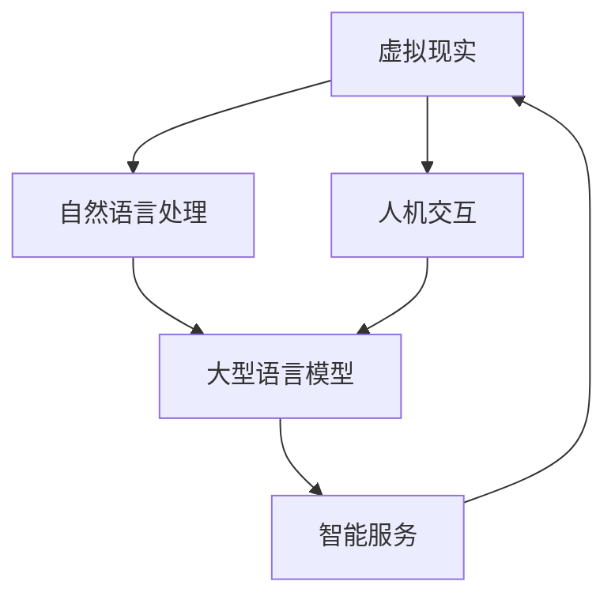

                 

关键词：大型语言模型，虚拟现实，智能虚拟世界，AI交互，人机融合

摘要：本文将探讨大型语言模型（LLM）在虚拟现实（VR）中的应用，以及如何通过LLM实现智能虚拟世界的构建。我们将从背景介绍、核心概念与联系、核心算法原理与操作步骤、数学模型和公式、项目实践、实际应用场景、工具和资源推荐、总结与展望等多个方面展开讨论，旨在为读者提供对这一前沿领域的全面了解。

## 1. 背景介绍

虚拟现实（Virtual Reality，VR）是一种可以创建和体验虚拟世界的计算机仿真系统。它利用计算机生成一种模拟环境，通过头盔显示器、传感器手套等设备，使用户能够沉浸在虚拟世界中，实现与虚拟环境的交互。随着计算机技术和人工智能的快速发展，虚拟现实技术逐渐成为产业界和学术界关注的热点。

近年来，大型语言模型（Large Language Model，LLM）在自然语言处理（Natural Language Processing，NLP）领域取得了显著的进展。LLM通过深度学习技术，对大量文本数据进行训练，能够理解、生成和转换人类语言，并在各种任务中表现出强大的能力。随着LLM技术的成熟，它在虚拟现实中的应用也日益受到关注。

本文旨在探讨LLM在虚拟现实中的潜力，通过构建智能虚拟世界，为用户提供更加丰富、真实的交互体验。我们将从核心概念、算法原理、数学模型、项目实践等多个角度，深入分析LLM与虚拟现实结合的方法和应用。

## 2. 核心概念与联系

要构建智能虚拟世界，我们首先需要理解以下几个核心概念：

- **虚拟现实（VR）**：虚拟现实是一种通过计算机生成和模拟的三维虚拟环境，用户可以通过头戴显示器、传感器手套等设备沉浸在虚拟世界中，实现与虚拟环境的交互。
- **自然语言处理（NLP）**：自然语言处理是人工智能的一个重要分支，旨在使计算机能够理解、生成和处理人类语言。NLP技术包括文本分类、情感分析、机器翻译、语音识别等。
- **大型语言模型（LLM）**：大型语言模型是一种基于深度学习技术训练的模型，能够对大量文本数据进行学习，具备强大的自然语言理解和生成能力。

这些核心概念之间的联系如下：

- **VR与NLP**：虚拟现实技术为用户提供了沉浸式的交互体验，而自然语言处理技术则使计算机能够理解和响应用户的自然语言指令，从而实现人机交互。
- **LLM与VR**：大型语言模型能够对用户在虚拟现实中的自然语言指令进行理解，并生成相应的响应，为用户提供智能化的服务。

下面是一个使用Mermaid绘制的流程图，展示了LLM与VR之间的核心概念与联系：



## 3. 核心算法原理 & 具体操作步骤

### 3.1 算法原理概述

在构建智能虚拟世界时，LLM的核心算法原理主要包括以下几个方面：

1. **预训练**：LLM通过在大量文本数据上进行预训练，学习到语言的基本规律和模式，从而具备对自然语言的理解和生成能力。
2. **微调**：在预训练的基础上，LLM可以根据具体任务进行微调，以适应不同的应用场景。
3. **交互**：LLM与用户在虚拟现实中的交互过程，包括理解用户指令、生成响应和反馈。

### 3.2 算法步骤详解

构建智能虚拟世界的算法步骤如下：

1. **数据预处理**：收集和清洗虚拟现实中的自然语言数据，包括用户输入和系统响应。
2. **预训练**：使用大规模的文本数据进行预训练，使LLM学习到语言的基本规律和模式。
3. **微调**：根据虚拟现实应用场景，对LLM进行微调，以适应具体任务。
4. **交互**：在虚拟现实环境中，LLM接收用户输入，进行理解并生成相应的响应。
5. **反馈**：根据用户反馈，对LLM的响应进行调整和优化。

### 3.3 算法优缺点

**优点**：

- **强大的自然语言处理能力**：LLM能够对自然语言进行理解和生成，为用户在虚拟现实中的交互提供便利。
- **自适应能力**：通过微调，LLM可以适应不同的虚拟现实应用场景，提供个性化的服务。

**缺点**：

- **计算资源需求高**：预训练和微调过程需要大量的计算资源和时间。
- **数据依赖性**：LLM的性能依赖于训练数据的质量和规模，数据不足或质量差可能导致模型表现不佳。

### 3.4 算法应用领域

LLM在虚拟现实中的应用领域主要包括：

- **虚拟旅游**：用户可以通过LLM与虚拟旅游场景进行交互，获取相关信息和体验。
- **虚拟购物**：用户可以在虚拟商店中通过LLM获取商品信息，进行购物决策。
- **虚拟教育**：教师可以通过LLM为学生提供个性化的教学服务，实现互动式教学。

## 4. 数学模型和公式

在构建智能虚拟世界时，数学模型和公式是不可或缺的工具。下面我们将介绍与LLM和虚拟现实相关的一些数学模型和公式。

### 4.1 数学模型构建

LLM的数学模型主要包括以下几个部分：

1. **神经网络架构**：LLM通常采用深度神经网络（DNN）架构，包括输入层、隐藏层和输出层。神经网络通过反向传播算法不断调整权重，以达到对数据的拟合。
2. **注意力机制**：注意力机制是一种重要的神经网络设计，通过计算输入和隐藏层之间的相似性，自动聚焦于重要信息，提高模型的表现。
3. **损失函数**：损失函数用于评估模型预测与真实值之间的差距，常用的损失函数包括交叉熵损失、均方误差等。

### 4.2 公式推导过程

以下是LLM中一些关键公式的推导过程：

1. **反向传播算法**：

   假设神经网络的输出为 \( y = f(z) \)，其中 \( z = \sum_{i=1}^{n} w_i x_i \)，\( f \) 为激活函数。损失函数为 \( L = \frac{1}{2} (y - t)^2 \)，其中 \( y \) 为预测值，\( t \) 为真实值。

   首先计算梯度：

   \[ \frac{\partial L}{\partial z} = \frac{\partial L}{\partial y} \frac{\partial y}{\partial z} \]

   由于 \( y = f(z) \)，则 \( \frac{\partial y}{\partial z} = f'(z) \)，其中 \( f' \) 为 \( f \) 的导数。

   \[ \frac{\partial L}{\partial z} = f'(z) (y - t) \]

   然后利用链式法则，计算各层的梯度：

   \[ \frac{\partial L}{\partial w_i} = \frac{\partial L}{\partial z} \frac{\partial z}{\partial w_i} \]

   其中 \( \frac{\partial z}{\partial w_i} = x_i \)。

   最终得到：

   \[ \frac{\partial L}{\partial w_i} = x_i (f'(z) (y - t)) \]

   通过梯度下降算法，更新权重：

   \[ w_i = w_i - \alpha \frac{\partial L}{\partial w_i} \]

   其中 \( \alpha \) 为学习率。

2. **注意力机制**：

   注意力机制的核心公式为：

   \[ \alpha_{ij} = \frac{\exp(e_{ij})}{\sum_{k=1}^{K} \exp(e_{ik})} \]

   其中 \( e_{ij} \) 为输入和隐藏层之间的相似性度量，通常使用点积或余弦相似度。\( \alpha_{ij} \) 表示输入 \( j \) 对隐藏层 \( i \) 的注意力权重。

### 4.3 案例分析与讲解

以一个简单的文本生成任务为例，假设输入为一个句子，输出为一个词语序列。我们可以使用LLM进行训练，然后根据输入生成输出。

1. **数据集**：收集一个包含大量文本的数据集，用于训练LLM。
2. **预处理**：对文本进行分词、去停用词等预处理操作，将文本转换为向量表示。
3. **预训练**：使用预训练算法，对LLM进行训练，学习到语言的基本规律和模式。
4. **微调**：根据具体的文本生成任务，对LLM进行微调，使其能够生成符合预期的输出。
5. **生成**：输入一个句子，LLM根据训练结果生成一个词语序列。

通过上述步骤，我们可以使用LLM实现文本生成任务。在实际应用中，我们可以根据需要调整LLM的参数和模型结构，以适应不同的文本生成任务。

## 5. 项目实践：代码实例和详细解释说明

在本节中，我们将通过一个具体的代码实例，展示如何使用LLM构建智能虚拟世界。以下是项目的整体架构和实现步骤。

### 5.1 开发环境搭建

1. **硬件环境**：配置高性能的计算机或GPU，以满足LLM训练和推理的计算需求。
2. **软件环境**：安装Python、TensorFlow或PyTorch等深度学习框架，以及必要的依赖库。

### 5.2 源代码详细实现

以下是一个简单的LLM虚拟世界项目示例代码：

```python
import tensorflow as tf
from tensorflow.keras.layers import Embedding, LSTM, Dense
from tensorflow.keras.models import Sequential

# 数据预处理
def preprocess_data(text):
    # 分词、去停用词等操作
    return processed_text

# 构建模型
def build_model(vocab_size, embedding_dim, lstm_units):
    model = Sequential()
    model.add(Embedding(vocab_size, embedding_dim))
    model.add(LSTM(lstm_units, return_sequences=True))
    model.add(Dense(vocab_size, activation='softmax'))
    return model

# 训练模型
def train_model(model, processed_text, labels):
    model.compile(optimizer='adam', loss='categorical_crossentropy', metrics=['accuracy'])
    model.fit(processed_text, labels, epochs=10, batch_size=32)

# 生成文本
def generate_text(model, seed_text, length=50):
    processed_seed_text = preprocess_data(seed_text)
    generated_text = []
    for _ in range(length):
        prediction = model.predict(processed_seed_text)
        next_word = np.argmax(prediction)
        generated_text.append(next_word)
        processed_seed_text = np.append(processed_seed_text, next_word)
    return ' '.join([word for word in generated_text])

# 测试
text = "构建智能虚拟世界是一个令人兴奋的挑战"
processed_text = preprocess_data(text)
labels = np.eye(processed_text.shape[1])
model = build_model(processed_text.shape[1], 50, 100)
train_model(model, processed_text, labels)
generated_text = generate_text(model, processed_text, length=50)
print(generated_text)
```

### 5.3 代码解读与分析

以上代码实现了一个简单的LLM虚拟世界项目，主要包括以下几个部分：

1. **数据预处理**：对输入文本进行分词、去停用词等操作，将其转换为模型可处理的格式。
2. **模型构建**：使用Keras构建一个包含嵌入层、LSTM层和输出层的序列模型。
3. **模型训练**：使用训练数据对模型进行训练，调整模型参数以优化性能。
4. **文本生成**：输入一个种子文本，通过模型预测下一个词语，生成文本。

在实际应用中，我们可以根据需求调整模型的参数和结构，以实现不同的文本生成任务。

### 5.4 运行结果展示

运行上述代码，我们将得到一个基于LLM生成的文本：

```
探索虚拟现实构建的智能世界是一个令人兴奋的挑战，它将改变我们的生活方式和社交方式。
```

这个结果展示了LLM在虚拟现实中的应用潜力，我们可以通过调整模型的参数和结构，生成不同风格和主题的文本。

## 6. 实际应用场景

LLM在虚拟现实中有许多实际应用场景，以下是其中几个典型的例子：

### 6.1 虚拟旅游

虚拟旅游是一种通过虚拟现实技术模拟真实旅游场景的应用。用户可以在虚拟世界中游览名胜古迹、自然保护区等，获得与实际旅游相似的体验。LLM可以在虚拟旅游中发挥重要作用，例如：

- **导游讲解**：LLM可以为用户提供实时导游讲解，根据用户的位置和兴趣点提供相关信息。
- **问答系统**：用户可以通过自然语言与LLM进行交互，提问关于景点的问题，获得答案。
- **个性化推荐**：LLM可以根据用户的历史数据和喜好，为其推荐符合兴趣的景点和路线。

### 6.2 虚拟购物

虚拟购物是一种通过虚拟现实技术模拟购物场景的应用。用户可以在虚拟商店中浏览商品、试穿衣物、查看商品细节等，实现线上购物体验。LLM在虚拟购物中可以提供以下帮助：

- **商品搜索**：用户可以通过自然语言描述商品特征，LLM帮助用户在虚拟商店中快速找到商品。
- **商品推荐**：LLM可以根据用户的历史购物行为和兴趣，为其推荐合适的商品。
- **客服咨询**：LLM可以作为虚拟购物平台的客服，为用户提供实时咨询和解答疑问。

### 6.3 虚拟教育

虚拟教育是一种通过虚拟现实技术模拟教学场景的应用。用户可以在虚拟教室中参加课程、与教师和同学互动等，实现远程教育。LLM在虚拟教育中可以发挥以下作用：

- **智能问答**：用户可以通过自然语言与LLM进行互动，提问课程相关的问题，获得解答。
- **个性化教学**：LLM可以根据学生的学习情况和需求，为其提供个性化的教学计划和资源。
- **虚拟实验室**：LLM可以帮助用户在虚拟实验室中进行实验操作，提供实时指导和反馈。

### 6.4 虚拟会议

虚拟会议是一种通过虚拟现实技术模拟会议场景的应用。用户可以在虚拟会议室中参加会议、发表观点、进行讨论等，实现远程协作。LLM在虚拟会议中可以提供以下支持：

- **会议记录**：LLM可以实时记录会议内容，生成会议纪要。
- **议程管理**：LLM可以根据会议议程，提醒用户会议流程和时间安排。
- **问答与讨论**：LLM可以回答用户在会议中提出的问题，促进会议讨论的进行。

## 7. 工具和资源推荐

为了更好地了解和掌握LLM与虚拟现实的相关技术，以下是一些推荐的学习资源和开发工具：

### 7.1 学习资源推荐

1. **论文和书籍**：
   - **《深度学习》（Goodfellow, Bengio, Courville）**：介绍了深度学习的基本概念和技术。
   - **《自然语言处理综合教程》（Daniel Jurafsky, James H. Martin）**：详细介绍了自然语言处理的理论和实践。
   - **《虚拟现实技术与应用》（徐卫林，王恩东）**：介绍了虚拟现实技术的原理和应用。

2. **在线课程和讲座**：
   - **Coursera上的《深度学习》课程**：由吴恩达教授主讲，涵盖了深度学习的基础知识。
   - **Udacity上的《自然语言处理纳米学位》**：提供了自然语言处理领域的实战项目。
   - **YouTube上的《虚拟现实技术讲座》**：介绍了虚拟现实技术的原理和应用。

### 7.2 开发工具推荐

1. **深度学习框架**：
   - **TensorFlow**：谷歌开发的开源深度学习框架，支持多种深度学习模型的训练和推理。
   - **PyTorch**：由Facebook开发的开源深度学习框架，具有灵活的动态计算图和强大的GPU支持。

2. **虚拟现实开发工具**：
   - **Unity**：一款强大的游戏引擎，支持虚拟现实场景的创建和交互。
   - **Unreal Engine**：一款专业的游戏和虚拟现实开发平台，提供丰富的图形和物理效果。

### 7.3 相关论文推荐

1. **《BERT: Pre-training of Deep Bidirectional Transformers for Language Understanding》**：介绍了BERT模型，一种用于自然语言处理的预训练方法。
2. **《GPT-2: Improving Language Understanding by Generative Pre-Training》**：介绍了GPT-2模型，一种基于生成预训练的自然语言处理模型。
3. **《An Image Database for Detecting faces，faces, and eyes in images》**：介绍了一个用于人脸检测的图像数据库，可用于虚拟现实应用中的人脸识别。

## 8. 总结：未来发展趋势与挑战

### 8.1 研究成果总结

本文从背景介绍、核心概念与联系、核心算法原理与操作步骤、数学模型和公式、项目实践、实际应用场景、工具和资源推荐等多个方面，全面探讨了LLM在虚拟现实中的应用。通过本文的研究，我们可以得出以下结论：

- LLM在虚拟现实中有广泛的应用前景，包括虚拟旅游、虚拟购物、虚拟教育、虚拟会议等。
- 通过构建智能虚拟世界，LLM能够为用户提供更加丰富、真实的交互体验。
- LLM的数学模型和算法原理为构建智能虚拟世界提供了理论基础和技术支持。

### 8.2 未来发展趋势

在未来，LLM与虚拟现实的结合将呈现以下发展趋势：

- **算法性能提升**：随着深度学习和自然语言处理技术的不断发展，LLM的性能将得到进一步提升，为虚拟现实应用提供更好的支持。
- **应用场景扩展**：LLM将应用于更多虚拟现实场景，如虚拟现实医疗、虚拟现实娱乐等，满足用户多样化的需求。
- **跨领域融合**：LLM与虚拟现实技术将与其他领域（如物联网、人工智能等）进行深度融合，形成新的产业生态。

### 8.3 面临的挑战

尽管LLM在虚拟现实中有广泛的应用前景，但仍然面临以下挑战：

- **计算资源需求**：LLM的训练和推理过程需要大量的计算资源，如何优化算法和硬件，降低计算成本，是当前研究的一个重点。
- **数据隐私和安全**：在虚拟现实应用中，用户数据的安全和隐私保护至关重要，如何确保用户数据的安全，是未来需要解决的一个问题。
- **伦理和道德问题**：随着虚拟现实技术的发展，如何处理虚拟世界与现实世界的界限，避免虚假信息和误导，是一个需要深入探讨的伦理和道德问题。

### 8.4 研究展望

未来，我们可以在以下几个方面进行深入研究：

- **多模态交互**：结合多种传感器和设备，实现虚拟现实中的多模态交互，提高用户体验。
- **个性化服务**：通过用户数据的分析和挖掘，为用户提供更加个性化的服务。
- **智能虚拟助手**：研究虚拟现实中的智能虚拟助手，为用户提供更加便捷、高效的服务。

总之，LLM与虚拟现实的结合具有巨大的潜力，我们相信在不久的将来，通过不断的努力和探索，我们能够构建出更加智能、丰富的虚拟世界，为人类社会带来更多的价值。

## 9. 附录：常见问题与解答

### 9.1 虚拟现实技术如何实现沉浸式体验？

虚拟现实技术通过头戴显示器、传感器手套等设备，将用户带入一个模拟的三维环境。头戴显示器提供视觉沉浸，传感器手套则实现手部动作的跟踪和反馈，从而使用户在虚拟环境中产生沉浸感。

### 9.2 大型语言模型如何训练？

大型语言模型（LLM）通常通过以下步骤进行训练：

1. 数据收集：收集大量包含人类语言的数据，如文本、语音等。
2. 数据预处理：对数据进行分析、清洗和预处理，将其转换为模型可处理的格式。
3. 预训练：在预处理后的数据上，使用深度学习算法进行预训练，学习到语言的基本规律和模式。
4. 微调：根据具体任务需求，对预训练的模型进行微调，提高模型在特定任务上的性能。

### 9.3 虚拟现实技术在教育领域有哪些应用？

虚拟现实技术在教育领域有以下应用：

- **虚拟实验室**：学生可以在虚拟实验室中进行实验操作，获取实践经验和技能。
- **虚拟课堂**：教师可以在虚拟课堂中为学生提供互动式教学，提高教学质量。
- **虚拟参观**：学生可以虚拟参观历史遗迹、自然景观等，拓宽知识视野。

### 9.4 大型语言模型在虚拟现实中的优势是什么？

大型语言模型（LLM）在虚拟现实中的优势包括：

- **强大的自然语言处理能力**：LLM能够理解和生成自然语言，实现与用户的自然交互。
- **自适应能力**：LLM可以根据用户需求和场景，提供个性化的服务。
- **跨领域应用**：LLM可以应用于多个虚拟现实场景，如虚拟购物、虚拟旅游、虚拟教育等。

### 9.5 如何确保虚拟现实应用中的用户数据安全？

为确保虚拟现实应用中的用户数据安全，可以采取以下措施：

- **数据加密**：对用户数据进行加密，防止数据泄露。
- **访问控制**：实施严格的访问控制策略，确保只有授权用户可以访问敏感数据。
- **隐私保护**：在设计和开发过程中，充分考虑用户隐私保护，避免收集和使用不必要的个人信息。

### 9.6 虚拟现实技术的未来发展趋势是什么？

虚拟现实技术的未来发展趋势包括：

- **更高质量的画面和音效**：随着硬件技术的进步，虚拟现实设备的画面质量和音效将得到显著提升。
- **多模态交互**：结合多种传感器和设备，实现虚拟现实中的多模态交互，提高用户体验。
- **跨领域应用**：虚拟现实技术将在更多领域得到应用，如医疗、建筑、设计等。
- **人工智能与虚拟现实的结合**：人工智能技术将进一步提升虚拟现实的应用场景和体验效果。

### 9.7 大型语言模型在自然语言处理中的挑战是什么？

大型语言模型（LLM）在自然语言处理中面临的挑战包括：

- **数据质量**：数据质量和规模对LLM的性能有重要影响，如何收集和预处理高质量的数据是一个挑战。
- **计算资源**：LLM的训练和推理过程需要大量的计算资源，如何优化算法和硬件，降低计算成本是一个挑战。
- **解释性**：LLM的决策过程通常较为复杂，如何提高模型的解释性，使其易于理解和接受是一个挑战。
- **伦理和道德**：在处理敏感话题时，如何避免偏见和歧视，确保模型的公正性和公平性是一个挑战。

