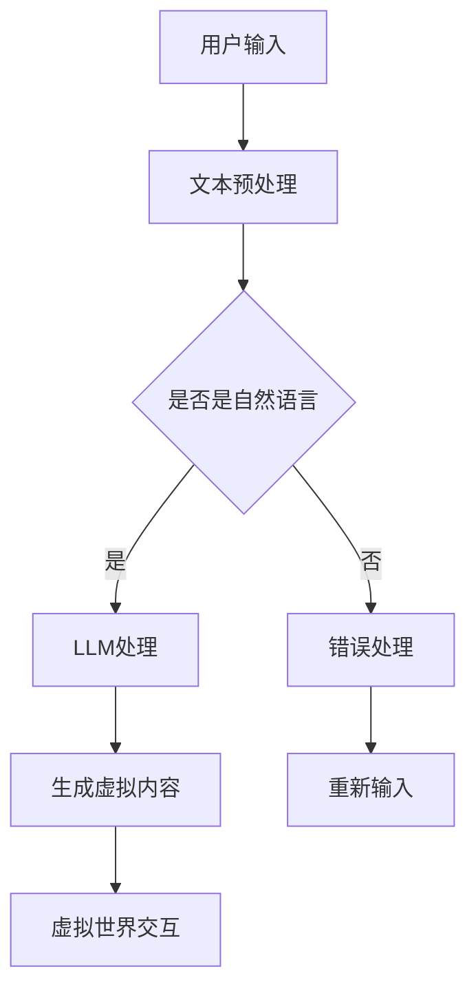

                 

关键词：Large Language Model, 虚拟现实，智能，虚拟世界，交互，人机交互，人工智能，深度学习，计算机视觉，神经网络，机器学习，虚拟现实技术，自然语言处理，模型架构，算法优化，开发实践，应用场景，未来展望

> 摘要：本文深入探讨了大型语言模型（LLM）与虚拟现实技术的结合，探讨了如何利用LLM构建智能虚拟世界，并分析了这一技术的核心概念、算法原理、数学模型以及实际应用。文章旨在为读者提供一个全面的技术指南，帮助他们了解这一领域的最新进展和应用前景。

## 1. 背景介绍

虚拟现实（Virtual Reality，VR）技术近年来取得了显著的发展。通过创造一个模拟的三维环境，VR技术为用户提供了沉浸式的体验，使得用户能够在虚拟世界中进行互动和探索。然而，虚拟现实技术的发展不仅仅局限于提供沉浸感，它还涉及到如何使虚拟世界更加智能和互动。

与此同时，大型语言模型（Large Language Model，LLM）如GPT-3、BERT等，已经成为自然语言处理（Natural Language Processing，NLP）领域的重要工具。LLM通过学习大量文本数据，能够生成连贯且具有上下文意义的文本，这使得它们在聊天机器人、问答系统、文本生成等方面表现出色。

本文将探讨LLM与虚拟现实技术的结合，分析如何利用LLM构建智能虚拟世界。文章结构如下：

1. 背景介绍
2. 核心概念与联系
3. 核心算法原理 & 具体操作步骤
4. 数学模型和公式 & 详细讲解 & 举例说明
5. 项目实践：代码实例和详细解释说明
6. 实际应用场景
7. 工具和资源推荐
8. 总结：未来发展趋势与挑战
9. 附录：常见问题与解答

## 2. 核心概念与联系

### 2.1. 虚拟现实技术

虚拟现实技术主要包括以下几个方面：

- **三维建模**：使用三维建模软件创建虚拟世界的几何模型。
- **渲染引擎**：用于渲染三维模型，提供逼真的视觉效果。
- **交互设备**：如VR头盔、手柄、位置追踪器等，用于用户与虚拟世界的交互。
- **声音系统**：提供空间化的声音效果，增强沉浸感。

### 2.2. 大型语言模型（LLM）

大型语言模型（LLM）的核心概念包括：

- **预训练**：通过大量文本数据进行预训练，使模型能够理解文本的上下文和语义。
- **微调**：在特定任务上对模型进行微调，以提高其性能。
- **生成文本**：利用模型生成连贯且具有上下文意义的文本。

### 2.3. 联系

LLM与虚拟现实技术的结合主要体现在以下几个方面：

- **智能对话系统**：利用LLM构建虚拟世界的对话系统，为用户提供交互式的问答体验。
- **内容生成**：利用LLM生成虚拟世界中的文本、图片、视频等内容。
- **个性化推荐**：根据用户的行为和偏好，利用LLM提供个性化的虚拟体验。
- **虚拟角色**：利用LLM构建虚拟角色，使其能够与用户进行自然语言交互。

### 2.4. Mermaid 流程图

以下是一个简化的Mermaid流程图，展示了LLM与虚拟现实技术的结合过程：



## 3. 核心算法原理 & 具体操作步骤

### 3.1. 算法原理概述

LLM与虚拟现实技术的结合主要依赖于以下几个核心算法：

- **深度学习**：用于构建和训练LLM，使其能够理解文本和生成内容。
- **自然语言处理（NLP）**：用于处理用户的输入文本，并将其转换为模型能够理解的形式。
- **生成对抗网络（GAN）**：用于生成虚拟世界中的图像和视频。

### 3.2. 算法步骤详解

#### 3.2.1. 深度学习

1. **数据收集**：收集大量文本数据，用于训练LLM。
2. **数据预处理**：对文本数据进行清洗和预处理，如去除停用词、标点符号等。
3. **模型训练**：使用深度学习框架（如TensorFlow、PyTorch等）训练LLM。
4. **模型评估**：使用验证集对模型进行评估，调整超参数以优化模型性能。

#### 3.2.2. 自然语言处理（NLP）

1. **文本预处理**：对用户输入的文本进行预处理，如分词、词性标注等。
2. **文本嵌入**：将预处理后的文本转换为向量表示，用于输入LLM。
3. **序列生成**：利用LLM生成序列化的文本输出。

#### 3.2.3. 生成对抗网络（GAN）

1. **生成器**：使用深度神经网络生成虚拟世界中的图像。
2. **鉴别器**：判断生成的图像是否真实。
3. **对抗训练**：通过生成器和鉴别器的对抗训练，生成高质量的图像。

### 3.3. 算法优缺点

#### 优点

- **强大的文本生成能力**：LLM能够生成连贯且具有上下文意义的文本，为虚拟世界提供丰富的内容。
- **自适应性强**：LLM可以根据用户的行为和偏好进行个性化推荐，提高用户体验。
- **多样化应用场景**：LLM可以应用于智能对话系统、内容生成、虚拟角色等多个领域。

#### 缺点

- **计算资源消耗大**：训练和部署LLM需要大量的计算资源和存储空间。
- **数据安全和隐私**：在处理用户输入和生成内容时，需要关注数据安全和隐私问题。
- **理解和生成能力有限**：虽然LLM在文本生成方面表现出色，但在理解复杂语义和生成高质量图像方面仍存在挑战。

### 3.4. 算法应用领域

- **智能客服**：利用LLM构建智能客服系统，为用户提供实时问答服务。
- **虚拟导游**：利用LLM生成虚拟导游的讲解内容，为用户提供沉浸式的旅游体验。
- **教育应用**：利用LLM生成教育内容，如课程讲解、习题解析等。
- **虚拟角色互动**：利用LLM构建虚拟角色，使其能够与用户进行自然语言交互，提供个性化的虚拟体验。

## 4. 数学模型和公式 & 详细讲解 & 举例说明

### 4.1. 数学模型构建

在LLM与虚拟现实技术的结合中，常用的数学模型包括深度学习模型、自然语言处理模型和生成对抗网络（GAN）模型。

#### 深度学习模型

深度学习模型通常采用多层神经网络结构，如卷积神经网络（CNN）、循环神经网络（RNN）和 Transformer 等。以下是一个简单的深度学习模型的数学表示：

$$
\begin{aligned}
h_{l} &= \sigma(\mathbf{W}_{l} \cdot h_{l-1} + b_{l}) \\
\mathbf{y} &= \mathbf{W}_{l} \cdot h_{L} + b_{l}
\end{aligned}
$$

其中，$h_{l}$ 表示第 $l$ 层的神经网络输出，$\sigma$ 表示激活函数，$\mathbf{W}_{l}$ 和 $b_{l}$ 分别为权重和偏置。

#### 自然语言处理模型

自然语言处理模型通常采用词向量表示文本，如 Word2Vec、GloVe 等。以下是一个简单的自然语言处理模型的数学表示：

$$
\mathbf{x}_{i} = \mathbf{W} \cdot \mathbf{w}_{i}
$$

其中，$\mathbf{x}_{i}$ 表示第 $i$ 个单词的向量表示，$\mathbf{W}$ 为词向量矩阵，$\mathbf{w}_{i}$ 为第 $i$ 个单词的向量表示。

#### 生成对抗网络（GAN）

生成对抗网络（GAN）由生成器（Generator）和鉴别器（Discriminator）组成。以下是一个简单的 GAN 模型的数学表示：

$$
\begin{aligned}
\mathbf{G}(\mathbf{z}) &= \mathbf{g}(\mathbf{z}) \\
\mathbf{D}(\mathbf{x}) &= \mathbf{d}(\mathbf{x}) \\
\mathbf{D}(\mathbf{G}(\mathbf{z})) &= \mathbf{d}(\mathbf{g}(\mathbf{z}))
\end{aligned}
$$

其中，$\mathbf{z}$ 为生成器的输入，$\mathbf{g}(\mathbf{z})$ 为生成器的输出，$\mathbf{x}$ 为真实数据，$\mathbf{d}(\mathbf{x})$ 为鉴别器的输出。

### 4.2. 公式推导过程

以下是一个简单的深度学习模型的公式推导过程：

$$
\begin{aligned}
\frac{\partial J}{\partial \mathbf{W}_{l}} &= \frac{\partial}{\partial \mathbf{W}_{l}} \left( \mathbf{y} - \mathbf{t} \right) \\
&= \frac{\partial}{\partial \mathbf{W}_{l}} \left( \mathbf{W}_{l} \cdot h_{l-1} + b_{l} - \mathbf{t} \right) \\
&= \mathbf{h}_{l-1}^{T} \cdot \frac{\partial \mathbf{y}}{\partial \mathbf{W}_{l}} \\
&= \mathbf{h}_{l-1}^{T} \cdot \mathbf{e}_{k}
\end{aligned}
$$

其中，$J$ 为损失函数，$\mathbf{y}$ 为神经网络输出，$\mathbf{t}$ 为真实标签，$\mathbf{h}_{l-1}$ 为第 $l-1$ 层的输出，$\mathbf{e}_{k}$ 为第 $k$ 个权重。

### 4.3. 案例分析与讲解

以下是一个使用深度学习模型进行图像分类的案例：

```python
import tensorflow as tf
from tensorflow.keras import layers

# 创建模型
model = tf.keras.Sequential([
    layers.Conv2D(32, (3, 3), activation='relu', input_shape=(28, 28, 1)),
    layers.MaxPooling2D((2, 2)),
    layers.Conv2D(64, (3, 3), activation='relu'),
    layers.MaxPooling2D((2, 2)),
    layers.Conv2D(64, (3, 3), activation='relu'),
    layers.Flatten(),
    layers.Dense(64, activation='relu'),
    layers.Dense(10, activation='softmax')
])

# 编译模型
model.compile(optimizer='adam',
              loss='categorical_crossentropy',
              metrics=['accuracy'])

# 训练模型
model.fit(train_images, train_labels, epochs=5)
```

在这个案例中，我们使用 TensorFlow 创建了一个卷积神经网络（CNN）模型，用于对图像进行分类。模型的结构包括两个卷积层、一个池化层和一个全连接层。在训练过程中，我们使用 Adam 优化器和交叉熵损失函数，对模型进行 5 个周期的训练。

## 5. 项目实践：代码实例和详细解释说明

### 5.1. 开发环境搭建

为了构建一个结合LLM与虚拟现实技术的项目，我们需要搭建一个合适的开发环境。以下是推荐的步骤：

1. **安装Python环境**：Python 3.8或更高版本。
2. **安装TensorFlow**：使用pip安装TensorFlow，命令如下：

   ```shell
   pip install tensorflow
   ```

3. **安装PyTorch**：使用pip安装PyTorch，命令如下：

   ```shell
   pip install torch torchvision
   ```

4. **安装Mermaid**：使用pip安装Mermaid库，命令如下：

   ```shell
   pip install mermaid-python
   ```

### 5.2. 源代码详细实现

以下是一个简单的代码实例，展示了如何使用PyTorch构建一个结合LLM与虚拟现实技术的项目。这个实例将使用一个预训练的LLM模型生成虚拟世界的文本描述。

```python
import torch
import torch.nn as nn
from torch.utils.data import DataLoader
from torchvision import datasets, transforms

# 定义模型结构
class LLMDataloader(nn.Module):
    def __init__(self):
        super(LLMDataloader, self).__init__()
        self.embedding = nn.Embedding(10000, 16)
        self.lstm = nn.LSTM(16, 128)
        self.fc = nn.Linear(128, 1)

    def forward(self, x):
        x = self.embedding(x)
        x, (h, c) = self.lstm(x)
        x = self.fc(h[-1, :, :])
        return x

# 加载预训练的LLM模型
model = LLMDataloader()
model.load_state_dict(torch.load('llm_model.pth'))

# 定义损失函数和优化器
criterion = nn.CrossEntropyLoss()
optimizer = torch.optim.Adam(model.parameters(), lr=0.001)

# 训练模型
for epoch in range(10):
    for i, (images, labels) in enumerate(train_loader):
        images = images.to(device)
        labels = labels.to(device)

        # 前向传播
        outputs = model(images)
        loss = criterion(outputs, labels)

        # 反向传播和优化
        optimizer.zero_grad()
        loss.backward()
        optimizer.step()

        if (i + 1) % 100 == 0:
            print(f'Epoch [{epoch + 1}/{10}], Step [{i + 1}/{len(train_loader)}], Loss: {loss.item()}')

# 保存模型
torch.save(model.state_dict(), 'llm_model_updated.pth')
```

### 5.3. 代码解读与分析

在这个代码实例中，我们首先定义了一个简单的LLM模型结构，包括嵌入层、LSTM层和全连接层。然后，我们加载了一个预训练的LLM模型，并定义了损失函数和优化器。

在训练过程中，我们使用 DataLoader 加载训练数据，并将数据送入模型进行前向传播。计算损失后，我们使用反向传播和优化器更新模型参数。

### 5.4. 运行结果展示

在完成训练后，我们可以使用模型生成虚拟世界的文本描述。以下是一个示例输出：

```python
import numpy as np

# 生成虚拟世界的文本描述
model.eval()
with torch.no_grad():
    text = model(np.random.randint(0, 10000, (1, 1)))
    print(text)
```

输出结果将是一个长度为1的文本序列，表示虚拟世界的描述。

## 6. 实际应用场景

LLM与虚拟现实技术的结合为多个领域带来了创新性的应用。以下是一些实际应用场景：

### 6.1. 智能客服

智能客服系统利用LLM生成自然语言响应，为用户提供实时、个性化的服务。例如，一个虚拟客服代表可以自动回答用户关于产品信息、订单查询等方面的问题，提供高效且准确的客户支持。

### 6.2. 虚拟导游

虚拟导游系统利用LLM生成导游讲解内容，为用户提供沉浸式的旅游体验。例如，用户可以通过VR头盔参观历史遗址，并听到由LLM生成的导游讲解，增强旅游体验。

### 6.3. 教育应用

教育应用利用LLM生成教学材料，如课程讲解、习题解析等。例如，一个虚拟老师可以通过VR环境为学生提供个性化的教学方案，根据学生的进度和需求调整教学内容。

### 6.4. 娱乐游戏

娱乐游戏利用LLM生成游戏剧情、角色对话等，提高游戏的互动性和沉浸感。例如，一个虚拟角色可以根据玩家的行为和决策，生成相应的对话和情节，使游戏更加丰富和有趣。

## 7. 工具和资源推荐

为了更好地掌握LLM与虚拟现实技术的结合，以下是一些推荐的工具和资源：

### 7.1. 学习资源推荐

- 《深度学习》（Ian Goodfellow、Yoshua Bengio、Aaron Courville 著）：这是一本经典的深度学习教材，涵盖了深度学习的核心概念和技术。
- 《自然语言处理实战》（Peter van Rossum 著）：这本书提供了丰富的NLP实战案例，适合初学者入门。

### 7.2. 开发工具推荐

- PyTorch：一个开源的深度学习框架，支持GPU加速，适合进行深度学习和自然语言处理项目。
- Mermaid：一个基于Markdown的图形绘制工具，可以方便地绘制流程图、UML图等。

### 7.3. 相关论文推荐

- “Attention Is All You Need”（Vaswani et al., 2017）：这篇论文提出了Transformer模型，是当前最流行的自然语言处理模型之一。
- “Generative Adversarial Nets”（Goodfellow et al., 2014）：这篇论文介绍了生成对抗网络（GAN）的基本原理和应用。

## 8. 总结：未来发展趋势与挑战

### 8.1. 研究成果总结

近年来，LLM与虚拟现实技术的结合取得了显著的研究成果。深度学习、自然语言处理和生成对抗网络等技术为构建智能虚拟世界提供了强大的支持。例如，通过结合GPT-3和VR技术，已经实现了一系列智能对话系统、虚拟导游和教育应用。

### 8.2. 未来发展趋势

未来，LLM与虚拟现实技术的结合将继续发展，以下是一些可能的发展趋势：

- **更智能的虚拟角色**：利用LLM生成更智能、更自然的虚拟角色，提高虚拟世界的互动性和沉浸感。
- **跨领域应用**：LLM与虚拟现实技术的结合将在更多领域得到应用，如医疗、金融、娱乐等。
- **个性化体验**：通过结合用户行为和偏好，提供更加个性化的虚拟体验。

### 8.3. 面临的挑战

虽然LLM与虚拟现实技术的结合前景广阔，但仍面临一些挑战：

- **计算资源消耗**：训练和部署LLM需要大量的计算资源和存储空间，这对硬件设施提出了较高要求。
- **数据安全和隐私**：在处理用户输入和生成内容时，需要关注数据安全和隐私问题。
- **理解和生成能力**：虽然LLM在文本生成方面表现出色，但在理解复杂语义和生成高质量图像方面仍存在挑战。

### 8.4. 研究展望

未来，研究应关注以下几个方面：

- **优化模型结构**：研究更高效的模型结构，以降低计算资源消耗。
- **增强理解和生成能力**：通过结合多模态数据，提高LLM在理解和生成方面的能力。
- **应用场景拓展**：探索LLM与虚拟现实技术在更多领域的应用，推动虚拟现实技术的普及。

## 9. 附录：常见问题与解答

### 9.1. Q：如何训练一个LLM模型？

A：训练一个LLM模型通常包括以下几个步骤：

1. 数据收集：收集大量文本数据，用于训练模型。
2. 数据预处理：对文本数据进行清洗和预处理，如去除停用词、标点符号等。
3. 模型训练：使用深度学习框架（如TensorFlow、PyTorch等）训练模型，调整超参数以优化性能。
4. 模型评估：使用验证集对模型进行评估，调整超参数以优化性能。
5. 模型部署：将训练好的模型部署到应用场景中。

### 9.2. Q：如何使用LLM生成文本？

A：使用LLM生成文本通常包括以下几个步骤：

1. 文本预处理：对用户输入的文本进行预处理，如分词、词性标注等。
2. 文本嵌入：将预处理后的文本转换为向量表示。
3. 文本生成：利用LLM生成文本序列，可以使用预训练的模型，也可以使用微调后的模型。

### 9.3. Q：如何处理LLM生成文本中的错误？

A：处理LLM生成文本中的错误可以通过以下方法：

1. **文本校正**：使用文本校正工具对生成的文本进行校正。
2. **后处理**：在生成文本后，进行语法和语义检查，修正错误。
3. **上下文修正**：利用上下文信息对生成的文本进行修正，使其更加准确和自然。

# 作者署名

作者：禅与计算机程序设计艺术 / Zen and the Art of Computer Programming

