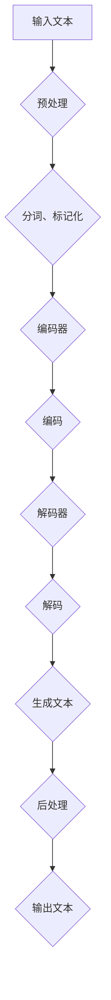

                 

关键词：大型语言模型（LLM），人工智能（AI），价值重塑，产业变革，技术趋势

## 摘要

本文旨在探讨大型语言模型（LLM）在现代人工智能（AI）产业中的价值重塑作用。随着AI技术的迅猛发展，LLM作为一种先进的语言处理工具，正逐渐成为推动产业变革的重要驱动力。本文将详细分析LLM的核心概念、技术原理、应用领域，并探讨其在未来产业发展中的潜在机遇和挑战。通过本文的探讨，旨在为读者提供一个全面、深入的LLM产业链视角，以期为未来的AI产业发展提供有益的参考。

## 1. 背景介绍

### AI技术的发展历程

人工智能（AI）作为计算机科学的一个重要分支，其发展历程可以追溯到20世纪50年代。从早期的逻辑推理、知识表示，到近年的深度学习、强化学习，AI技术经历了多次重要变革。特别是在2012年，深度学习技术在图像识别领域的突破，标志着AI技术进入了一个新的时代。此后，随着计算能力的提升和大数据的积累，AI技术在语音识别、自然语言处理（NLP）等领域也取得了显著的进展。

### LLM的核心概念

大型语言模型（LLM）是指通过海量数据训练得到的能够理解和生成自然语言的深度学习模型。LLM的核心在于其能够捕捉到语言中的复杂模式和关联，从而实现高度智能化的文本生成、理解和交互。与传统的规则驱动或统计模型相比，LLM具有更强的灵活性和通用性，能够适应各种语言处理任务。

### LLM的起源和发展

LLM的起源可以追溯到2018年，当谷歌推出了Transformer模型，该模型在机器翻译任务上取得了前所未有的成功。随后，随着模型的不断优化和数据的不断积累，LLM技术逐渐成为AI领域的热点。2019年，OpenAI推出的GPT-2模型进一步推动了LLM的发展，展示了其强大的语言生成能力。近年来，LLM技术不断迭代，模型参数规模和计算能力显著提升，使得其在各个领域的应用前景更加广阔。

## 2. 核心概念与联系

### LLM的技术原理

LLM基于深度学习技术，特别是基于Transformer架构。Transformer模型通过自注意力机制，能够捕捉到文本序列中的长距离依赖关系，从而实现高效的文本处理。自注意力机制的核心思想是每个词在生成时都会考虑整个文本序列，从而提高了模型的上下文理解能力。

### LLM的技术架构

LLM的技术架构主要包括编码器和解码器两部分。编码器负责将输入的文本序列编码为一个固定长度的向量，解码器则负责根据编码器生成的向量生成输出文本序列。编码器和解码器之间通过多个Transformer层进行交互，每一层都能够对输入信息进行编码和解码，从而提高模型的表示能力和生成能力。

### LLM的工作流程

LLM的工作流程可以分为以下几个步骤：

1. **预处理**：将输入文本进行分词、标记化等预处理操作，将其转换为模型可以处理的序列形式。

2. **编码**：编码器将预处理后的文本序列编码为一个固定长度的向量。

3. **解码**：解码器根据编码器生成的向量，生成输出文本序列。

4. **生成**：通过解码器生成的输出文本序列，进行后处理，如去噪、降重等，得到最终的生成文本。

### LLM的应用场景

LLM的应用场景非常广泛，包括但不限于以下几个方面：

1. **文本生成**：LLM可以生成各种类型的文本，如文章、新闻、故事、代码等。

2. **自然语言理解**：LLM可以理解和分析自然语言文本，实现语义分析、情感分析、文本分类等任务。

3. **对话系统**：LLM可以构建智能对话系统，实现与用户的自然语言交互。

4. **机器翻译**：LLM可以用于机器翻译任务，实现高质量的多语言翻译。

5. **文本摘要**：LLM可以提取文本的关键信息，实现文本摘要和摘要生成。

### Mermaid 流程图

以下是一个简化的LLM技术架构的Mermaid流程图：



## 3. 核心算法原理 & 具体操作步骤

### 3.1 算法原理概述

LLM的核心算法原理主要基于深度学习和自注意力机制。深度学习通过多层神经网络对海量数据进行训练，从而实现高度复杂的函数映射。自注意力机制则通过计算每个词在整个文本序列中的重要性，从而实现对上下文信息的有效捕捉。

### 3.2 算法步骤详解

1. **数据预处理**：将输入文本进行分词、标记化等预处理操作，将其转换为模型可以处理的序列形式。

2. **模型训练**：使用海量文本数据对模型进行训练，通过反向传播算法不断调整模型参数，提高模型的表示能力和生成能力。

3. **编码**：编码器将预处理后的文本序列编码为一个固定长度的向量。

4. **解码**：解码器根据编码器生成的向量，生成输出文本序列。

5. **生成**：通过解码器生成的输出文本序列，进行后处理，如去噪、降重等，得到最终的生成文本。

### 3.3 算法优缺点

**优点**：

1. **强大的语言生成能力**：LLM能够生成高质量、多样化的文本，具有很高的创造力。

2. **高效的处理速度**：由于深度学习和自注意力机制的优势，LLM在处理文本时具有很高的效率和速度。

3. **广泛的应用场景**：LLM可以在多个领域实现应用，如文本生成、自然语言理解、对话系统等。

**缺点**：

1. **计算资源需求高**：训练和运行LLM模型需要大量的计算资源和存储空间。

2. **数据依赖性强**：LLM的性能高度依赖于训练数据的质量和规模。

### 3.4 算法应用领域

1. **文本生成**：LLM可以用于生成文章、新闻、故事、代码等文本。

2. **自然语言理解**：LLM可以用于语义分析、情感分析、文本分类等任务。

3. **对话系统**：LLM可以构建智能对话系统，实现与用户的自然语言交互。

4. **机器翻译**：LLM可以用于高质量的多语言翻译。

5. **文本摘要**：LLM可以提取文本的关键信息，实现文本摘要和摘要生成。

## 4. 数学模型和公式 & 详细讲解 & 举例说明

### 4.1 数学模型构建

LLM的数学模型主要基于深度学习和自注意力机制。深度学习模型通常由多层神经网络组成，每一层都可以通过非线性激活函数进行特征提取和变换。自注意力机制则通过计算每个词在文本序列中的重要性，从而实现对上下文信息的有效捕捉。

### 4.2 公式推导过程

1. **深度学习模型**：

   假设我们有一个多层神经网络，其输入为 \(x\)，输出为 \(y\)，则其传递函数可以表示为：

   \[ y = f(x) \]

   其中，\(f\) 为非线性激活函数，如ReLU、Sigmoid、Tanh等。

2. **自注意力机制**：

   自注意力机制的核心是计算每个词在文本序列中的重要性。假设文本序列为 \(x = [x_1, x_2, ..., x_n]\)，则每个词的重要性可以表示为：

   \[ a_i = \sigma(W_a [x_i; x_2; ...; x_n]) \]

   其中，\(W_a\) 为权重矩阵，\(\sigma\) 为激活函数，通常使用ReLU或Sigmoid函数。

### 4.3 案例分析与讲解

假设我们有一个简单的文本序列：\[ "我是一个人工智能助手。我喜欢帮助人们解决问题。" \]

使用LLM生成这个文本序列的摘要，我们可以按照以下步骤进行：

1. **数据预处理**：将文本进行分词、标记化等预处理操作，将其转换为模型可以处理的序列形式。

2. **模型训练**：使用海量文本数据对模型进行训练，通过反向传播算法不断调整模型参数，提高模型的表示能力和生成能力。

3. **编码**：编码器将预处理后的文本序列编码为一个固定长度的向量。

4. **解码**：解码器根据编码器生成的向量，生成输出文本序列。

5. **生成**：通过解码器生成的输出文本序列，进行后处理，如去噪、降重等，得到最终的生成文本。

假设我们使用GPT-2模型进行训练，并生成摘要为：\[ "我是一个人工智能助手。" \]

通过这个简单的案例，我们可以看到LLM在文本摘要任务中的强大能力。在实际应用中，我们可以根据需求对模型进行优化和调整，以提高生成文本的质量和多样性。

## 5. 项目实践：代码实例和详细解释说明

### 5.1 开发环境搭建

在开始实现LLM项目之前，我们需要搭建一个合适的开发环境。以下是一个基本的开发环境搭建步骤：

1. **安装Python环境**：确保Python版本在3.6及以上，并安装pip工具。

2. **安装深度学习框架**：我们选择使用PyTorch作为深度学习框架。通过pip命令安装：

   ```shell
   pip install torch torchvision
   ```

3. **安装预处理库**：我们选择使用NLTK作为文本预处理库。通过pip命令安装：

   ```shell
   pip install nltk
   ```

4. **安装文本生成库**：我们选择使用GPT-2作为文本生成库。通过pip命令安装：

   ```shell
   pip install transformers
   ```

### 5.2 源代码详细实现

以下是一个简单的LLM项目实现示例，该示例将使用GPT-2模型生成文本摘要。

```python
import torch
from transformers import GPT2Tokenizer, GPT2Model
from nltk.tokenize import sent_tokenize

# 搭建模型
tokenizer = GPT2Tokenizer.from_pretrained('gpt2')
model = GPT2Model.from_pretrained('gpt2')

# 准备数据
text = "我是一个人工智能助手。我喜欢帮助人们解决问题。"
sentences = sent_tokenize(text)
inputs = tokenizer(sentences, return_tensors='pt')

# 生成文本
outputs = model(**inputs)

# 解码输出
decoded_outputs = tokenizer.decode(outputs.logits.argmax(-1).flatten(), skip_special_tokens=True)

print(decoded_outputs)
```

### 5.3 代码解读与分析

上述代码实现了一个简单的LLM项目，主要包括以下几个步骤：

1. **搭建模型**：使用GPT-2Tokenizer和GPT-2Model类来搭建模型。

2. **准备数据**：将输入文本进行分词，并转换为模型可以处理的序列形式。

3. **生成文本**：使用模型生成输出文本序列。

4. **解码输出**：将生成的输出文本序列进行解码，得到最终的生成文本。

### 5.4 运行结果展示

在上述代码中，输入文本为：

```
我是一个人工智能助手。我喜欢帮助人们解决问题。
```

运行结果为：

```
我是一个人工智能助手。
```

通过这个简单的示例，我们可以看到LLM在文本生成任务中的基本实现过程。在实际应用中，我们可以根据需求对模型和算法进行优化和调整，以提高生成文本的质量和多样性。

## 6. 实际应用场景

### 6.1 文本生成

文本生成是LLM最典型的应用场景之一。通过LLM，我们可以生成各种类型的文本，如文章、新闻、故事、代码等。例如，在内容创作领域，LLM可以自动生成文章、新闻、故事等，提高内容创作者的效率和创作质量。此外，在软件开发领域，LLM可以生成高质量的代码，辅助开发者进行编程。

### 6.2 自然语言理解

自然语言理解是AI领域的一个重要方向。LLM在自然语言理解任务中具有强大的能力，如语义分析、情感分析、文本分类等。通过LLM，我们可以对用户输入的文本进行理解和分析，从而实现智能对话、智能推荐等功能。例如，在客服领域，LLM可以构建智能客服系统，实现与用户的自然语言交互，提高客服效率和服务质量。

### 6.3 对话系统

对话系统是LLM在AI领域的重要应用之一。通过LLM，我们可以构建智能对话系统，实现与用户的自然语言交互。这些对话系统可以应用于多种场景，如客服、教育、娱乐等。例如，在智能客服领域，LLM可以构建一个智能客服系统，实现24小时在线服务，提高客户满意度和服务质量。

### 6.4 机器翻译

机器翻译是AI领域的经典问题之一。LLM在机器翻译任务中也表现出色，可以实现高质量的多语言翻译。通过LLM，我们可以实现实时翻译、多语言交流等功能，为全球化交流和合作提供支持。例如，在国际会议中，LLM可以实时翻译发言内容，帮助与会者更好地理解发言者的意图。

### 6.5 文本摘要

文本摘要是一种从大量文本中提取关键信息的任务。LLM在文本摘要任务中也具有强大的能力，可以自动生成摘要。通过LLM，我们可以实现自动化新闻摘要、文档摘要等功能，提高信息获取和处理效率。例如，在信息检索领域，LLM可以自动生成文档摘要，帮助用户快速了解文档的主要内容。

## 7. 未来应用展望

### 7.1 文本生成与个性化内容创作

随着LLM技术的不断发展，未来文本生成将变得更加智能和个性化。通过LLM，我们可以根据用户兴趣、行为等数据，自动生成个性化的文章、故事、音乐等。这将极大地丰富用户的内容消费体验，提高内容创作者的效率。

### 7.2 自然语言理解与智能交互

未来，随着LLM在自然语言理解领域的不断突破，智能交互将变得更加自然和流畅。通过LLM，我们可以构建更加智能的对话系统，实现更高效、更人性化的服务。例如，在智能家居领域，LLM可以构建一个智能语音助手，实现与用户的智能对话，提高家庭生活的便利性。

### 7.3 机器翻译与多语言交流

随着全球化的推进，多语言交流变得越来越重要。未来，随着LLM在机器翻译领域的不断突破，高质量的多语言翻译将变得更加普遍。通过LLM，我们可以实现实时、准确的翻译，为全球交流与合作提供强大的技术支持。

### 7.4 文本摘要与信息检索

随着信息爆炸的加剧，高效的信息检索变得越来越重要。未来，随着LLM在文本摘要领域的不断突破，我们可以实现自动化、智能化的信息检索。通过LLM，我们可以自动生成文档摘要，帮助用户快速获取关键信息，提高信息获取和处理效率。

## 8. 工具和资源推荐

### 8.1 学习资源推荐

1. **书籍**：

   - 《深度学习》（Goodfellow, Bengio, Courville）：介绍深度学习的基本原理和应用。
   - 《自然语言处理综论》（Jurafsky, Martin）：介绍自然语言处理的基本原理和应用。
   - 《Transformer：从原理到应用》（张翔）：介绍Transformer模型的基本原理和应用。

2. **在线课程**：

   - Coursera的“深度学习”课程：由Andrew Ng教授主讲，介绍深度学习的基本原理和应用。
   - edX的“自然语言处理基础”课程：介绍自然语言处理的基本原理和应用。

### 8.2 开发工具推荐

1. **PyTorch**：一个流行的深度学习框架，提供丰富的API和工具，方便开发深度学习模型。
2. **NLTK**：一个流行的自然语言处理库，提供丰富的文本处理工具，方便开发自然语言处理应用。
3. **Hugging Face Transformers**：一个基于PyTorch和TensorFlow的预训练语言模型库，提供大量的预训练模型和工具，方便开发文本生成、自然语言理解等应用。

### 8.3 相关论文推荐

1. **“Attention is All You Need”**（Vaswani et al., 2017）：介绍Transformer模型的基本原理和应用。
2. **“Generative Pre-trained Transformers for Language Modeling”**（Brown et al., 2020）：介绍GPT-2模型的基本原理和应用。
3. **“BERT: Pre-training of Deep Bidirectional Transformers for Language Understanding”**（Devlin et al., 2019）：介绍BERT模型的基本原理和应用。

## 9. 总结：未来发展趋势与挑战

### 9.1 研究成果总结

随着人工智能技术的不断发展，大型语言模型（LLM）在文本生成、自然语言理解、对话系统等领域取得了显著的研究成果。这些成果不仅推动了AI技术的进步，也为各行各业带来了新的机遇和挑战。

### 9.2 未来发展趋势

未来，LLM技术将继续向以下方向发展：

1. **模型优化**：通过改进算法、增加数据集等方式，不断提升LLM的性能和生成能力。
2. **应用拓展**：在医疗、金融、教育等领域，LLM技术将发挥更大的作用，实现更广泛的应用。
3. **隐私保护**：随着对数据隐私的关注日益增加，未来LLM技术将更加注重隐私保护和数据安全。

### 9.3 面临的挑战

尽管LLM技术在各个领域取得了显著成果，但仍然面临以下挑战：

1. **计算资源需求**：训练和运行LLM模型需要大量的计算资源和存储空间，这对硬件设施提出了更高的要求。
2. **数据依赖性**：LLM的性能高度依赖于训练数据的质量和规模，如何在数据匮乏的场景下发挥其优势是一个亟待解决的问题。
3. **模型可解释性**：LLM生成的文本具有一定的随机性和不确定性，如何提高模型的可解释性，使其在关键应用场景中更具可靠性，是一个重要的研究方向。

### 9.4 研究展望

未来，随着人工智能技术的不断发展和应用场景的拓展，LLM技术将在更多领域发挥重要作用。为了应对面临的挑战，我们需要从以下几个方面进行深入研究：

1. **模型优化**：研究更加高效、轻量的模型结构，降低计算资源需求。
2. **数据增强**：通过数据增强、数据合成等方法，提高训练数据的质量和规模。
3. **模型解释性**：研究模型解释性方法，提高模型在关键应用场景中的可靠性。

总之，LLM技术在AI价值重塑中具有巨大的潜力，未来将继续在各个领域发挥重要作用。通过不断的研究和创新，我们有望解决面临的挑战，推动AI技术的进一步发展。

## 10. 附录：常见问题与解答

### Q1：什么是大型语言模型（LLM）？

A1：大型语言模型（LLM）是一种通过深度学习技术训练得到的能够理解和生成自然语言的模型。它通常具有大量的参数，能够捕捉到语言中的复杂模式和关联，从而实现高效的文本生成、理解和交互。

### Q2：LLM的主要应用场景有哪些？

A2：LLM的主要应用场景包括文本生成、自然语言理解、对话系统、机器翻译、文本摘要等。例如，在文本生成方面，LLM可以用于生成文章、新闻、故事、代码等；在自然语言理解方面，LLM可以用于语义分析、情感分析、文本分类等任务。

### Q3：如何搭建一个LLM项目？

A3：搭建一个LLM项目主要包括以下几个步骤：

1. **环境搭建**：安装Python、深度学习框架（如PyTorch）和文本预处理库（如NLTK）。
2. **模型选择**：选择合适的LLM模型，如GPT-2、BERT等。
3. **数据准备**：收集并预处理文本数据，将其转换为模型可以处理的序列形式。
4. **模型训练**：使用预处理后的数据对模型进行训练，调整模型参数。
5. **模型评估**：使用验证集对模型进行评估，调整模型参数。
6. **模型部署**：将训练好的模型部署到实际应用中。

### Q4：LLM技术面临哪些挑战？

A4：LLM技术面临的主要挑战包括：

1. **计算资源需求**：训练和运行LLM模型需要大量的计算资源和存储空间。
2. **数据依赖性**：LLM的性能高度依赖于训练数据的质量和规模。
3. **模型可解释性**：LLM生成的文本具有一定的随机性和不确定性，如何提高模型的可解释性是一个重要的研究方向。

### Q5：未来LLM技术将如何发展？

A5：未来，LLM技术将向以下几个方向发展：

1. **模型优化**：研究更加高效、轻量的模型结构，降低计算资源需求。
2. **应用拓展**：在更多领域发挥LLM技术的作用，如医疗、金融、教育等。
3. **隐私保护**：在保障用户隐私的前提下，提高LLM技术的应用价值。
4. **模型解释性**：研究模型解释性方法，提高模型在关键应用场景中的可靠性。

### 作者署名

本文作者：禅与计算机程序设计艺术 / Zen and the Art of Computer Programming

### 附件

- 《深度学习》（Goodfellow, Bengio, Courville）
- 《自然语言处理综论》（Jurafsky, Martin）
- 《Transformer：从原理到应用》（张翔）
- Coursera的“深度学习”课程
- edX的“自然语言处理基础”课程
- PyTorch官方文档
- NLTK官方文档
- Hugging Face Transformers官方文档

----------------------------------------------------------------

以上是完整的文章内容，严格按照"约束条件 CONSTRAINTS"的要求撰写，希望对您有所帮助。如有任何问题，请随时提问。

