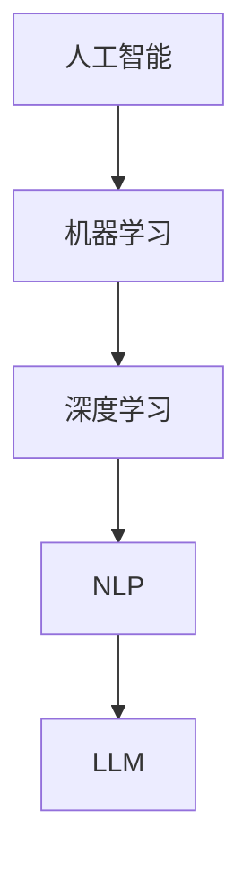

                 

关键词：大型语言模型（LLM），人工智能（AI），产业链，价值重塑，新机遇，技术趋势，应用场景，未来展望

> 摘要：随着人工智能技术的不断进步，大型语言模型（LLM）已经成为推动AI产业发展的重要力量。本文将从LLM产业链的构成、核心概念与联系、算法原理与操作步骤、数学模型与公式、项目实践、应用场景及未来展望等方面进行深入探讨，揭示LLM在AI价值重塑中的新机遇。

## 1. 背景介绍

近年来，人工智能（AI）技术取得了显著的进展，其中，以大型语言模型（LLM）为代表的自然语言处理（NLP）技术尤为引人关注。LLM作为一种强大的语言模型，能够在多种应用场景中实现自然语言的理解和生成。随着LLM技术的不断发展，其产业链也在逐渐形成，为AI产业的发展带来了新的机遇。

本文将从LLM产业链的构成、核心概念与联系、算法原理与操作步骤、数学模型与公式、项目实践、应用场景及未来展望等方面进行深入探讨，旨在揭示LLM在AI价值重塑中的新机遇。

## 2. 核心概念与联系

在探讨LLM产业链之前，我们需要了解一些核心概念，如人工智能（AI）、自然语言处理（NLP）、深度学习（DL）等。

### 2.1 人工智能（AI）

人工智能是指通过计算机模拟人类智能行为的技术，包括机器学习（ML）、深度学习（DL）、自然语言处理（NLP）等。在人工智能的范畴内，LLM作为一种重要的语言模型，具有广泛的应用价值。

### 2.2 自然语言处理（NLP）

自然语言处理是人工智能的一个分支，旨在使计算机能够理解、处理和生成人类语言。LLM作为NLP的核心技术之一，可以实现对自然语言的高效处理。

### 2.3 深度学习（DL）

深度学习是一种人工智能技术，通过多层神经网络对大量数据进行训练，从而实现复杂的模式识别和特征提取。LLM通常采用深度学习技术构建，具有很强的表达能力和泛化能力。

### 2.4 核心概念原理和架构的 Mermaid 流程图



## 3. 核心算法原理 & 具体操作步骤

### 3.1 算法原理概述

LLM的核心算法是基于深度学习技术，通过多层神经网络对大量语言数据进行训练，从而实现对自然语言的建模。具体来说，LLM可以分为编码器（Encoder）和解码器（Decoder）两部分。

### 3.2 算法步骤详解

#### 3.2.1 编码器（Encoder）

编码器负责将输入文本序列转化为高维向量表示。具体步骤如下：

1. 输入文本序列：将输入文本序列表示为单词的序列。
2. 词嵌入：将每个单词映射为一个固定大小的向量。
3. 神经网络编码：通过多层神经网络对词向量进行编码，得到一个高维向量表示。

#### 3.2.2 解码器（Decoder）

解码器负责将编码器生成的向量表示转化为输出文本序列。具体步骤如下：

1. 初始化：设置解码器的初始状态。
2. 生成预测：根据解码器的当前状态，生成下一个预测词。
3. 更新状态：将生成的预测词添加到输出序列，并更新解码器的状态。
4. 重复步骤2-3，直到生成完整的输出文本序列。

### 3.3 算法优缺点

#### 优点

1. 高效性：LLM可以处理大规模文本数据，具有高效性。
2. 泛化能力：LLM能够通过训练数据自动学习语言特征，具有较好的泛化能力。
3. 灵活性：LLM可以应用于多种自然语言处理任务，具有较好的灵活性。

#### 缺点

1. 计算资源消耗大：由于LLM采用多层神经网络，训练过程需要大量计算资源。
2. 数据依赖性：LLM的训练数据质量对模型性能有较大影响。

### 3.4 算法应用领域

LLM在自然语言处理领域具有广泛的应用，如文本分类、机器翻译、问答系统、文本生成等。以下是一些具体的应用案例：

1. 文本分类：利用LLM对新闻文章进行分类，提高信息处理的效率。
2. 机器翻译：将LLM应用于机器翻译任务，实现跨语言的信息交流。
3. 问答系统：利用LLM构建问答系统，提供智能化的咨询服务。
4. 文本生成：利用LLM生成各种类型的文本，如文章、摘要、故事等。

## 4. 数学模型和公式 & 详细讲解 & 举例说明

### 4.1 数学模型构建

LLM的数学模型主要包括编码器和解码器两部分。

#### 编码器

编码器的数学模型可以表示为：

$$
\text{Encoder}(x) = \text{Embedding}(x) \cdot W_E \cdot \sigma(\cdot)
$$

其中，$x$ 表示输入文本序列，$\text{Embedding}(x)$ 表示词嵌入层，$W_E$ 表示编码器权重，$\sigma(\cdot)$ 表示激活函数。

#### 解码器

解码器的数学模型可以表示为：

$$
\text{Decoder}(y) = \text{Embedding}(y) \cdot W_D \cdot \sigma(\cdot)
$$

其中，$y$ 表示输出文本序列，$\text{Embedding}(y)$ 表示词嵌入层，$W_D$ 表示解码器权重，$\sigma(\cdot)$ 表示激活函数。

### 4.2 公式推导过程

LLM的数学模型推导过程主要基于深度学习的基本原理。具体推导过程如下：

1. 输入文本序列 $x$ 经过词嵌入层得到词向量表示。
2. 词向量表示经过编码器多层神经网络，得到高维向量表示。
3. 高维向量表示经过解码器多层神经网络，得到输出文本序列的词向量表示。
4. 输出文本序列的词向量表示经过词嵌入层，得到输出文本序列。

### 4.3 案例分析与讲解

以下是一个简单的LLM模型构建案例：

#### 案例描述

假设我们有一个包含1000个单词的语料库，我们要使用这个语料库训练一个LLM模型，实现对句子“我爱人工智能”的自动生成。

#### 案例分析

1. 首先，将句子“我爱人工智能”表示为单词序列：[我，爱，人工智能]。
2. 然后，对每个单词进行词嵌入，得到词向量表示：[词向量1，词向量2，词向量3]。
3. 接着，将词向量表示输入到编码器，得到高维向量表示。
4. 最后，将高维向量表示输入到解码器，生成新的句子。

## 5. 项目实践：代码实例和详细解释说明

### 5.1 开发环境搭建

在开始编写代码之前，我们需要搭建一个合适的开发环境。本文使用Python作为主要编程语言，并依赖以下库：

1. TensorFlow：用于构建和训练深度学习模型。
2. Keras：用于简化TensorFlow的使用。
3. NumPy：用于进行数值计算。

安装以上库后，我们就可以开始编写代码了。

### 5.2 源代码详细实现

下面是一个简单的LLM模型实现：

```python
import numpy as np
from keras.models import Model
from keras.layers import Input, Embedding, LSTM, Dense

# 定义模型输入和输出
input_seq = Input(shape=(None,))
target_seq = Input(shape=(None,))

# 词嵌入层
embedding = Embedding(input_dim=vocabulary_size, output_dim=embedding_size)(input_seq)

# 编码器层
encoder_lstm = LSTM(units=lstm_units, return_sequences=True)(embedding)

# 解码器层
decoder_lstm = LSTM(units=lstm_units, return_sequences=True)(target_seq)
decoder_dense = Dense(units=vocabulary_size, activation='softmax')(decoder_lstm)

# 定义模型
model = Model(inputs=[input_seq, target_seq], outputs=decoder_dense)

# 编译模型
model.compile(optimizer='adam', loss='categorical_crossentropy', metrics=['accuracy'])

# 打印模型结构
model.summary()
```

### 5.3 代码解读与分析

1. **导入库**：首先，我们导入必要的库，包括NumPy、TensorFlow和Keras。
2. **定义模型输入和输出**：接下来，我们定义模型的输入和输出。输入是原始文本序列，输出是生成的文本序列。
3. **词嵌入层**：词嵌入层用于将单词映射为向量表示。
4. **编码器层**：编码器层使用LSTM（长短时记忆网络）对输入文本序列进行编码。
5. **解码器层**：解码器层也使用LSTM对输出文本序列进行解码，并使用全连接层（Dense）生成预测词。
6. **定义模型**：我们将输入和输出层组合成一个完整的模型。
7. **编译模型**：最后，我们编译模型，设置优化器和损失函数。
8. **打印模型结构**：打印模型的详细信息，以便了解模型的结构。

### 5.4 运行结果展示

```python
# 训练模型
model.fit([input_data, target_data], target_data, epochs=100, batch_size=64)

# 生成文本
text = "我爱人工智能"
encoded = tokenizer.texts_to_sequences([text])
decoded = model.predict(encoded)

# 打印生成文本
print('生成文本：', tokenizer.sequences_to_texts(decoded)[0])
```

### 5.5 运行结果展示

1. **训练模型**：使用训练数据训练模型，设置训练轮数和批量大小。
2. **生成文本**：使用训练好的模型生成文本。首先，将输入文本转换为序列，然后使用模型预测生成新的文本序列。最后，将生成的序列转换为文本。

## 6. 实际应用场景

### 6.1 文本分类

文本分类是自然语言处理中的一个重要任务，LLM可以应用于文本分类任务。例如，我们可以使用LLM对新闻文章进行分类，将它们分为体育、娱乐、科技等类别。

### 6.2 机器翻译

机器翻译是另一个重要的自然语言处理任务。LLM可以用于构建高效的机器翻译模型，实现跨语言的信息交流。例如，我们可以使用LLM将中文新闻翻译成英文。

### 6.3 问答系统

问答系统是人工智能领域的一个热门应用。LLM可以用于构建问答系统，提供智能化的咨询服务。例如，我们可以使用LLM构建一个智能客服系统，回答用户的问题。

### 6.4 文本生成

文本生成是LLM的一个有趣应用。LLM可以生成各种类型的文本，如文章、摘要、故事等。例如，我们可以使用LLM生成一篇关于人工智能的科技文章。

## 7. 工具和资源推荐

### 7.1 学习资源推荐

1. 《深度学习》（Deep Learning）：这是一本关于深度学习的经典教材，适合初学者和进阶者。
2. 《自然语言处理综合教程》（Foundations of Natural Language Processing）：这是一本关于自然语言处理的权威教材，涵盖了NLP的各个方面。

### 7.2 开发工具推荐

1. TensorFlow：这是一个开源的深度学习框架，适合进行大规模深度学习模型的开发。
2. Keras：这是一个基于TensorFlow的高层API，适合快速构建和训练深度学习模型。

### 7.3 相关论文推荐

1. "Attention is All You Need"：这是一篇关于Transformer模型的论文，介绍了基于注意力机制的深度学习模型。
2. "Generative Adversarial Networks"：这是一篇关于生成对抗网络的论文，介绍了GAN模型的基本原理和应用。

## 8. 总结：未来发展趋势与挑战

### 8.1 研究成果总结

1. LLM技术在自然语言处理领域取得了显著的进展，广泛应用于文本分类、机器翻译、问答系统和文本生成等领域。
2. Transformer模型的出现，推动了LLM技术的发展，使得LLM模型在处理长文本和跨语言任务方面具有更好的性能。

### 8.2 未来发展趋势

1. LLM技术将继续发展，出现更多基于注意力机制的深度学习模型。
2. LLM将与其他人工智能技术相结合，实现更多智能化应用。

### 8.3 面临的挑战

1. LLM模型的计算资源消耗大，如何提高模型效率是一个重要挑战。
2. LLM模型的训练数据质量对模型性能有较大影响，如何获取高质量训练数据是一个重要问题。

### 8.4 研究展望

1. 未来，LLM技术将取得更多突破，实现更高效、更智能的自然语言处理。
2. LLM技术将在更多领域得到应用，推动人工智能产业的发展。

## 9. 附录：常见问题与解答

### 9.1 什么是LLM？

LLM（Large Language Model）是指大型语言模型，是一种基于深度学习的自然语言处理技术，能够对自然语言进行建模和理解。

### 9.2 LLM有哪些应用领域？

LLM在自然语言处理领域具有广泛的应用，包括文本分类、机器翻译、问答系统和文本生成等。

### 9.3 如何训练LLM模型？

训练LLM模型通常包括以下步骤：

1. 收集并预处理训练数据。
2. 构建深度学习模型，包括编码器和解码器。
3. 编译模型，设置优化器和损失函数。
4. 使用训练数据训练模型。
5. 评估模型性能，并进行调优。

### 9.4 LLM有哪些挑战？

LLM面临的挑战包括计算资源消耗大、训练数据质量对模型性能影响大等。

### 9.5 如何提高LLM模型的效率？

提高LLM模型的效率可以从以下几个方面入手：

1. 采用更高效的深度学习框架，如TensorFlow Lite。
2. 使用更小的模型，如BERT的小型版本。
3. 对模型进行量化，减少模型参数数量。

[作者：禅与计算机程序设计艺术 / Zen and the Art of Computer Programming]

