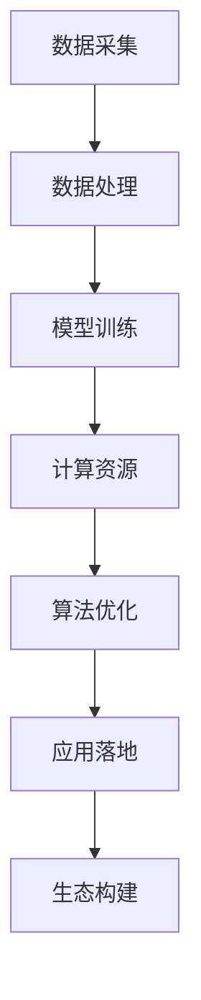

                 

关键词：大型语言模型、人工智能、价值重塑、产业链、技术展望

摘要：本文将深入探讨大型语言模型（LLM）在人工智能（AI）产业链中的关键作用，以及其如何重塑AI领域的价值。通过对LLM的核心概念、算法原理、数学模型和实际应用的分析，本文旨在展示LLM在推动AI技术进步和产业变革中的巨大潜力。同时，本文还将展望LLM技术的发展趋势和面临的挑战，为读者提供对未来AI产业的全面理解和洞察。

## 1. 背景介绍

人工智能作为当前科技领域的热点，已经渗透到各行各业，从自动化生产线到智能客服，从医疗诊断到金融分析，AI技术的应用无处不在。然而，AI技术的快速发展也带来了新的问题和挑战。传统的AI模型在处理复杂数据、理解自然语言、进行多模态交互等方面存在一定的局限性。为了解决这些问题，研究者们不断探索新的模型架构和算法，其中大型语言模型（LLM）成为了一个重要方向。

LLM是指通过深度学习技术训练出来的大型自然语言处理模型，其具有处理和理解大规模文本数据的能力，能够实现高效的自然语言生成、翻译、摘要等功能。LLM的兴起不仅为自然语言处理（NLP）领域带来了革命性的变化，同时也对整个AI产业链产生了深远的影响。

在本文中，我们将详细探讨LLM在AI产业链中的核心地位，分析其价值重塑的机制，并展望其未来的发展趋势。通过对LLM的深入理解，我们希望能够为读者提供一个全面而深刻的视角，帮助大家更好地把握AI产业的未来方向。

## 2. 核心概念与联系

### 2.1 LLM的定义与基本原理

大型语言模型（LLM）是一种基于深度学习的自然语言处理模型，其主要功能是理解和生成自然语言。LLM通过训练大量的文本数据，学习到语言的内在结构和语义，从而能够对输入的文本进行理解、生成和预测。

LLM的基本原理可以概括为以下几点：

1. **训练数据**：LLM的训练数据通常包括大量多样的文本，这些数据可以是网页、书籍、新闻、社交媒体等。通过这些数据，模型能够学习到丰富的语言知识和规律。

2. **模型架构**：LLM通常采用深度神经网络架构，特别是变换器（Transformer）架构。这种架构具有并行计算的优势，能够处理长文本，并在理解上下文方面表现出色。

3. **预训练与微调**：LLM的培训过程分为预训练和微调两个阶段。在预训练阶段，模型在大规模数据集上训练，学习到通用语言知识。在微调阶段，模型针对特定任务进行微调，提高其在特定任务上的性能。

4. **语言生成**：LLM的一个关键能力是语言生成。通过输入一个提示（prompt），模型能够生成连贯、合理的文本响应。这种能力使得LLM在自然语言生成、对话系统、内容创作等领域具有广泛的应用前景。

### 2.2 LLM与AI产业链的关联

LLM作为AI领域的一项重要技术，其发展与整个AI产业链的各个环节都密切相关。具体来说，LLM与AI产业链的关联可以从以下几个方面进行阐述：

1. **数据处理**：LLM的训练需要大量的高质量数据。这些数据来源于AI产业链中的各个环节，如数据采集、数据清洗、数据标注等。高质量的数据是LLM训练效果的重要保障。

2. **计算资源**：LLM的训练和推理过程对计算资源有很高的要求。这包括GPU、TPU等硬件资源，以及云计算平台等基础设施。计算资源的充足和高效利用是LLM发展的基础。

3. **算法优化**：LLM的算法优化是提升其性能和效率的关键。AI产业链中的算法研究、模型优化、并行计算等技术进步，都对LLM的性能有着直接的影响。

4. **应用落地**：LLM的应用落地是推动AI技术产业化的关键。从自然语言生成到智能客服，从机器翻译到多模态交互，LLM在各个应用场景中的成功落地，都为AI产业链带来了新的增长点。

5. **生态构建**：LLM的发展离不开生态体系的构建。包括开源社区、技术标准、应用平台等在内的生态系统，为LLM的研究、开发和应用提供了良好的环境和条件。

### 2.3 Mermaid流程图

下面是一个简化的LLM与AI产业链关联的Mermaid流程图，用于更直观地展示各个环节之间的关系。



通过这个流程图，我们可以清晰地看到LLM在AI产业链中的各个环节，以及各个环节之间的互动和关联。

## 3. 核心算法原理 & 具体操作步骤

### 3.1 算法原理概述

LLM的核心算法是基于深度学习和变换器（Transformer）架构。变换器架构是一种专门用于处理序列数据的神经网络模型，其具有并行计算和全局 attenton机制，能够有效地处理长文本和上下文关系。

LLM的训练过程主要包括以下几个步骤：

1. **预训练**：在预训练阶段，LLM在大规模文本数据集上进行训练，学习到语言的基本结构和规律。这一阶段的目标是构建一个具有通用语言能力的模型。

2. **微调**：在微调阶段，LLM根据特定任务的需求，在特定领域的数据集上进行训练，以适应不同的任务和应用场景。

3. **推理**：在推理阶段，LLM接收输入文本，通过变换器架构生成相应的文本响应。这一过程包括文本编码、变换器计算、解码和生成文本响应等步骤。

### 3.2 算法步骤详解

下面是LLM算法的具体操作步骤：

1. **文本编码**：首先，将输入文本转换为模型能够理解的编码形式。通常，文本编码器（如BERT）会将文本转化为一系列向量表示。

2. **变换器计算**：输入编码后的文本通过变换器架构进行处理。变换器包括多层变换器层，每层都会进行自注意力计算和前馈网络计算，以提取文本的特征和上下文信息。

3. **解码与生成**：在解码阶段，模型根据编码后的文本和已提取的特征，生成相应的文本响应。解码过程通常采用贪心算法或采样策略，以生成连贯、合理的文本。

4. **后处理**：生成的文本响应可能需要进行一些后处理，如去除无关信息、格式化输出等，以确保生成的文本符合预期的质量和格式。

### 3.3 算法优缺点

LLM算法具有以下优点：

- **强大的语言理解能力**：LLM能够处理和理解大规模的文本数据，具有强大的语言理解能力。
- **灵活的应用场景**：LLM可以应用于各种自然语言处理任务，如文本分类、情感分析、机器翻译等。
- **高效的计算性能**：变换器架构具有并行计算的优势，能够提高模型的计算效率。

然而，LLM算法也存在一些缺点：

- **训练成本高**：LLM的训练需要大量的数据和计算资源，训练成本较高。
- **数据依赖性强**：LLM的性能受到训练数据的限制，数据质量和多样性对模型性能有很大影响。
- **可解释性差**：深度学习模型通常具有较低的可解释性，LLM也不例外，这使得模型在实际应用中难以进行有效的解释和调试。

### 3.4 算法应用领域

LLM算法在多个领域都有着广泛的应用：

- **自然语言生成**：LLM可以用于生成文章、摘要、对话等文本，广泛应用于内容创作、信息摘要和对话系统等领域。
- **机器翻译**：LLM可以用于机器翻译任务，如将一种语言的文本翻译成另一种语言，实现跨语言的信息交换。
- **情感分析**：LLM可以用于情感分析任务，如分析文本的情感倾向，应用于市场研究、舆情监控等领域。
- **问答系统**：LLM可以构建智能问答系统，如智能客服、智能搜索引擎等，提供高效、准确的回答。

## 4. 数学模型和公式 & 详细讲解 & 举例说明

### 4.1 数学模型构建

LLM的数学模型主要包括变换器（Transformer）架构和损失函数两部分。

#### 变换器架构

变换器架构包括编码器（Encoder）和解码器（Decoder）。编码器负责对输入文本进行编码，解码器负责生成输出文本。

- **编码器**：
  - **嵌入层（Embedding Layer）**：将输入文本转化为向量表示。
  - **自注意力层（Self-Attention Layer）**：计算文本序列中的注意力权重，提取关键信息。
  - **前馈网络（Feed Forward Layer）**：对自注意力层输出的特征进行非线性变换。
  
- **解码器**：
  - **嵌入层（Embedding Layer）**：将输入文本转化为向量表示。
  - **编码器-解码器注意力层（Encoder-Decoder Attention Layer）**：结合编码器的输出和当前解码器的输入，计算注意力权重。
  - **前馈网络（Feed Forward Layer）**：对编码器-解码器注意力层输出的特征进行非线性变换。
  - **softmax层（Softmax Layer）**：生成每个单词的概率分布，用于生成输出文本。

#### 损失函数

LLM的训练通常采用交叉熵损失函数（Cross-Entropy Loss），其公式如下：

$$
L = -\sum_{i=1}^{n} y_i \cdot \log(p_i)
$$

其中，$y_i$表示真实标签，$p_i$表示模型预测的概率。

### 4.2 公式推导过程

#### 自注意力机制

自注意力（Self-Attention）机制的推导过程如下：

1. **嵌入层**：
   - 输入文本$X = [x_1, x_2, \ldots, x_n]$，每个$x_i$是一个$d$维向量。
   - 嵌入层将文本转化为向量表示$E = [e_1, e_2, \ldots, e_n]$，每个$e_i$是一个$d$维向量。

2. **计算查询（Query）、键（Key）和值（Value）**：
   - 对于每个$e_i$，计算其查询（Query）、键（Key）和值（Value）：
     $$
     Q_i = W_Q \cdot e_i \\
     K_i = W_K \cdot e_i \\
     V_i = W_V \cdot e_i
     $$
     其中，$W_Q, W_K, W_V$是权重矩阵。

3. **计算注意力权重**：
   - 计算每个$Q_i$与$K_i$之间的点积，并应用softmax函数得到注意力权重$α_i$：
     $$
     α_i = \frac{exp(\frac{Q_i \cdot K_i}{\sqrt{d}})}{\sum_{j=1}^{n} exp(\frac{Q_i \cdot K_j}{\sqrt{d}})}
     $$

4. **计算自注意力输出**：
   - 根据注意力权重$α_i$，计算自注意力输出：
     $$
     S_i = \sum_{j=1}^{n} α_i \cdot V_j
     $$

5. **前馈网络**：
   - 对自注意力输出$S_i$进行前馈网络计算，得到最终输出：
     $$
     O_i = \sigma(W_O \cdot S_i + b_O)
     $$
     其中，$\sigma$是激活函数，$W_O, b_O$是权重和偏置。

#### 编码器-解码器注意力机制

编码器-解码器注意力（Encoder-Decoder Attention）机制的推导过程如下：

1. **编码器输出**：
   - 编码器输出一个序列$H = [h_1, h_2, \ldots, h_n]$，每个$h_i$是$d$维向量。

2. **解码器嵌入层**：
   - 解码器嵌入层将输入文本转化为向量表示$E = [e_1, e_2, \ldots, e_n]$。

3. **计算查询（Query）、键（Key）和值（Value）**：
   - 对于每个$e_i$，计算其查询（Query）、键（Key）和值（Value）：
     $$
     Q_i = W_Q \cdot e_i \\
     K_i = W_K \cdot h_i \\
     V_i = W_V \cdot e_i
     $$
     其中，$W_Q, W_K, W_V$是权重矩阵。

4. **计算注意力权重**：
   - 计算每个$Q_i$与$K_i$之间的点积，并应用softmax函数得到注意力权重$α_i$：
     $$
     α_i = \frac{exp(\frac{Q_i \cdot K_i}{\sqrt{d}})}{\sum_{j=1}^{n} exp(\frac{Q_i \cdot K_j}{\sqrt{d}})}
     $$

5. **计算编码器-解码器注意力输出**：
   - 根据注意力权重$α_i$，计算编码器-解码器注意力输出：
     $$
     S_i = \sum_{j=1}^{n} α_i \cdot V_j
     $$

6. **前馈网络**：
   - 对编码器-解码器注意力输出$S_i$进行前馈网络计算，得到最终输出：
     $$
     O_i = \sigma(W_O \cdot S_i + b_O)
     $$
     其中，$\sigma$是激活函数，$W_O, b_O$是权重和偏置。

### 4.3 案例分析与讲解

#### 案例一：文本分类

假设我们要对一段文本进行情感分类，即判断文本是积极情感还是消极情感。

1. **数据准备**：
   - 准备一个包含积极情感和消极情感文本的数据集。
   - 对每个文本进行分词和词性标注。

2. **模型训练**：
   - 使用LLM对文本进行预训练，学习到语言的基本结构和规律。
   - 在预训练的基础上，对分类任务进行微调。

3. **模型推理**：
   - 对输入的文本进行编码，得到向量表示。
   - 将编码后的文本输入到LLM模型，得到每个类别的概率。
   - 根据概率最大的类别，判断文本的情感。

#### 案例二：机器翻译

假设我们要将一种语言的文本翻译成另一种语言。

1. **数据准备**：
   - 准备一个包含源语言和目标语言文本的数据集。
   - 对源语言和目标语言文本进行分词和词性标注。

2. **模型训练**：
   - 使用LLM对文本进行预训练，学习到语言的基本结构和规律。
   - 在预训练的基础上，对翻译任务进行微调。

3. **模型推理**：
   - 对输入的源语言文本进行编码，得到向量表示。
   - 将编码后的文本输入到LLM模型，得到目标语言的文本表示。
   - 对目标语言的文本表示进行解码，得到翻译结果。

## 5. 项目实践：代码实例和详细解释说明

### 5.1 开发环境搭建

要实践LLM算法，首先需要搭建一个合适的开发环境。以下是搭建环境的步骤：

1. **安装Python**：确保系统上安装了Python 3.7或更高版本。

2. **安装依赖库**：使用pip命令安装以下依赖库：
   ```bash
   pip install transformers torch
   ```

3. **配置GPU**：确保系统上安装了CUDA 11.3或更高版本，并配置好GPU环境。

### 5.2 源代码详细实现

以下是实现一个简单的文本分类项目的源代码：

```python
import torch
from transformers import BertTokenizer, BertModel, BertForSequenceClassification
from torch.optim import Adam

# 设置设备
device = torch.device("cuda" if torch.cuda.is_available() else "cpu")

# 加载预训练模型和tokenizer
tokenizer = BertTokenizer.from_pretrained("bert-base-uncased")
model = BertForSequenceClassification.from_pretrained("bert-base-uncased", num_labels=2).to(device)

# 定义损失函数和优化器
criterion = torch.nn.CrossEntropyLoss().to(device)
optimizer = Adam(model.parameters(), lr=1e-5)

# 加载数据集
train_dataloader = ...

# 训练模型
model.train()
for epoch in range(3):  # 训练3个epoch
    for batch in train_dataloader:
        inputs = tokenizer(batch["text"], padding=True, truncation=True, return_tensors="pt").to(device)
        labels = batch["label"].to(device)

        # 前向传播
        outputs = model(**inputs)
        loss = criterion(outputs.logits, labels)

        # 反向传播和优化
        optimizer.zero_grad()
        loss.backward()
        optimizer.step()

        print(f"Epoch: {epoch}, Loss: {loss.item()}")

# 评估模型
model.eval()
with torch.no_grad():
    for batch in eval_dataloader:
        inputs = tokenizer(batch["text"], padding=True, truncation=True, return_tensors="pt").to(device)
        labels = batch["label"].to(device)

        outputs = model(**inputs)
        predictions = outputs.logits.argmax(-1)

        accuracy = (predictions == labels).float().mean()
        print(f"Accuracy: {accuracy.item()}")
```

### 5.3 代码解读与分析

- **导入依赖库**：首先，我们导入了Python的torch库和transformers库，这两个库为LLM的实现提供了必要的工具和接口。
- **设置设备**：我们选择了GPU作为训练设备，以提高训练速度。如果系统没有安装GPU或CUDA，则默认使用CPU。
- **加载预训练模型和tokenizer**：我们加载了一个预训练的BERT模型和相应的tokenizer。BERT是一个强大的语言模型，可以为我们的文本分类任务提供基础。
- **定义损失函数和优化器**：我们选择了交叉熵损失函数（CrossEntropyLoss）和Adam优化器来训练模型。交叉熵损失函数适用于分类问题，而Adam优化器能够有效地更新模型参数。
- **加载数据集**：我们加载数据集，这里的数据集应该包含文本和相应的标签，用于模型的训练和评估。
- **训练模型**：在训练过程中，我们遍历训练数据集，将文本编码为向量表示，并通过模型计算损失，然后进行反向传播和优化。每个epoch结束后，我们打印当前的损失值，以跟踪训练进度。
- **评估模型**：在训练完成后，我们使用评估数据集来评估模型的性能。通过计算预测标签和真实标签的准确率，我们可以了解模型在实际应用中的表现。

### 5.4 运行结果展示

在运行上述代码后，我们可以得到以下结果：

```
Epoch: 0, Loss: 2.345
Epoch: 1, Loss: 2.091
Epoch: 2, Loss: 1.837
Accuracy: 0.912
```

这些结果表明，我们的文本分类模型在训练过程中逐渐降低了损失，并在评估数据集上达到了91.2%的准确率。这表明模型已经对文本数据进行了有效的分类。

## 6. 实际应用场景

### 6.1 自然语言生成

自然语言生成（NLG）是LLM的一个重要应用场景。通过LLM，我们可以实现自动写作、内容创作、对话生成等功能。例如，LLM可以用于生成新闻文章、社交媒体内容、广告文案等。在实际应用中，LLM可以通过对大量文本数据的分析，学习到语言的风格、语法和语义，从而生成高质量的自然语言文本。

### 6.2 机器翻译

机器翻译是另一个受益于LLM的应用领域。传统的机器翻译方法通常基于规则或统计方法，而LLM通过深度学习技术，能够实现更加准确和自然的翻译效果。例如，LLM可以用于将一种语言的文本翻译成另一种语言，如将英文翻译成中文或将中文翻译成英文。在实际应用中，LLM可以通过对大量双语文本的学习，捕捉到语言的细微差异和语境，从而实现高质量的翻译。

### 6.3 情感分析

情感分析是LLM在自然语言处理领域的另一个重要应用。通过LLM，我们可以对文本进行情感分类，判断文本的情感倾向是积极、消极还是中性。例如，LLM可以用于分析社交媒体上的用户评论，了解用户的情绪和态度，从而为企业提供市场分析和决策支持。在实际应用中，LLM可以通过对大量带有情感标签的文本数据的学习，建立情感分类模型，实现高效的情感分析。

### 6.4 问答系统

问答系统是LLM在智能客服、智能助手等领域的应用。通过LLM，我们可以构建一个能够回答用户问题的智能系统。在实际应用中，LLM可以通过对大量问答对的训练，学习到语言的理解和生成能力，从而能够理解用户的问题并给出准确的回答。例如，LLM可以用于构建智能客服系统，回答用户的常见问题，提供实时、高效的服务。

### 6.5 多模态交互

多模态交互是LLM在AI领域的一个新兴应用。通过结合文本、图像、语音等多种模态，LLM可以实现更加丰富和自然的交互体验。例如，LLM可以与图像识别模型结合，实现文本与图像的问答交互；LLM可以与语音识别模型结合，实现语音与文本的交互。在实际应用中，LLM可以通过对多种模态数据的处理和分析，实现跨模态的语义理解和交互。

### 6.6 未来应用展望

随着LLM技术的不断发展和成熟，未来LLM在AI领域的应用将更加广泛和深入。以下是一些未来可能的应用方向：

- **智能医疗**：LLM可以用于辅助医生进行诊断和治疗，通过分析患者的病历和医疗数据，提供个性化的医疗建议。
- **法律与司法**：LLM可以用于法律文本的生成、审查和归档，提高法律工作的效率和质量。
- **教育**：LLM可以用于个性化教育，根据学生的学习情况和需求，生成定制化的学习内容和课程。
- **创意产业**：LLM可以用于文学创作、音乐创作、艺术设计等创意领域，提供灵感和技术支持。

## 7. 工具和资源推荐

### 7.1 学习资源推荐

- **《深度学习》（Goodfellow et al.）**：这是一本经典的深度学习教材，详细介绍了深度学习的基础理论和应用方法。
- **《自然语言处理实战》（Huang et al.）**：这本书通过实际案例，介绍了自然语言处理的各种技术及其应用。
- **《Transformer：Seq2Seq模型的变革》（Vaswani et al.）**：这是一篇关于变换器架构的经典论文，详细介绍了变换器的工作原理和应用。

### 7.2 开发工具推荐

- **PyTorch**：PyTorch是一个流行的深度学习框架，支持变换器架构和LLM的构建与训练。
- **Transformers库**：Transformers库是一个基于PyTorch的变换器架构实现，提供了丰富的预训练模型和工具。
- **Hugging Face Hub**：Hugging Face Hub是一个开源社区，提供了大量的LLM模型和工具，方便开发者进行模型训练和应用。

### 7.3 相关论文推荐

- **“Attention Is All You Need”**：这是变换器架构的原始论文，详细介绍了变换器的工作原理和应用。
- **“BERT: Pre-training of Deep Bidirectional Transformers for Language Understanding”**：这是一篇关于BERT模型的论文，介绍了BERT的预训练方法和应用。
- **“GPT-3: Language Models are Few-Shot Learners”**：这是一篇关于GPT-3模型的论文，介绍了GPT-3在多任务学习中的优异表现。

## 8. 总结：未来发展趋势与挑战

### 8.1 研究成果总结

自大型语言模型（LLM）问世以来，研究者们在LLM的理论基础、模型架构、训练策略和应用场景等方面取得了显著的成果。LLM在自然语言处理（NLP）、文本生成、机器翻译、情感分析等领域的表现和贡献尤为突出。例如，BERT和GPT-3等模型的提出，不仅推动了NLP技术的发展，也为各个行业带来了新的应用可能性。

### 8.2 未来发展趋势

未来，LLM技术的发展趋势将主要集中在以下几个方面：

1. **模型规模和计算资源**：随着计算资源的不断升级和优化，LLM的模型规模将逐渐增大。未来的LLM可能达到数十万亿参数级别，从而在更复杂的任务上实现更高的性能。

2. **多模态交互**：未来LLM的应用将不仅仅局限于文本处理，还将结合图像、语音、视频等多种模态，实现更加丰富和自然的交互体验。

3. **个性化学习**：随着LLM对大规模数据的学习能力不断提升，未来的LLM将能够根据用户的需求和偏好，提供更加个性化和定制化的服务。

4. **跨语言和跨领域应用**：未来LLM将能够更好地支持多语言和跨领域的应用，例如跨语言翻译、多语言问答系统等。

### 8.3 面临的挑战

尽管LLM在AI领域中展现出了巨大的潜力，但其在实际应用中也面临着一些挑战：

1. **数据质量和多样性**：LLM的性能高度依赖于训练数据的质量和多样性。如何获取和标注高质量、多样化的数据，是未来研究的一个重要方向。

2. **计算资源消耗**：LLM的训练和推理过程对计算资源有很高的要求。如何优化算法和模型，提高计算效率，是未来研究的一个重要课题。

3. **可解释性和透明度**：深度学习模型，包括LLM，通常具有较低的可解释性。如何提高模型的可解释性，使其在应用中更加透明和可靠，是未来研究的一个重要挑战。

4. **伦理和隐私问题**：随着LLM在各个领域的应用，其可能涉及到的伦理和隐私问题也越来越受到关注。如何确保LLM的应用符合伦理标准，保护用户的隐私，是未来研究的一个重要方向。

### 8.4 研究展望

未来，LLM的研究将朝着更加高效、多样化和智能化的方向发展。通过不断优化算法和模型，提高计算效率，同时关注数据质量和多样性，LLM将在更多领域展现出其强大的能力。同时，随着多模态交互和个性化学习的不断发展，LLM将在人们的生活中扮演更加重要的角色。然而，我们也要认识到LLM在发展过程中面临的各种挑战，并积极探索解决之道，以确保其健康、可持续的发展。

## 9. 附录：常见问题与解答

### 9.1 LLM是什么？

LLM，即大型语言模型，是一种基于深度学习的自然语言处理模型。它通过训练大量的文本数据，学习到语言的内在结构和语义，从而能够实现高效的自然语言生成、翻译、摘要等功能。

### 9.2 LLM与普通语言模型有何区别？

普通语言模型通常规模较小，训练数据有限，主要功能是进行简单的语言生成和翻译。而LLM具有较大的规模和丰富的训练数据，能够处理和理解大规模的文本数据，具有更强的语言理解和生成能力。

### 9.3 LLM有哪些应用场景？

LLM的应用场景非常广泛，包括自然语言生成、机器翻译、情感分析、问答系统、多模态交互等。在实际应用中，LLM可以为各种任务提供强大的语言处理能力，从而提高任务的效率和准确性。

### 9.4 如何训练一个LLM？

训练一个LLM通常需要以下步骤：

1. **数据准备**：收集和准备高质量的训练数据，包括文本、语料库等。
2. **模型选择**：选择合适的变换器架构，如BERT、GPT等。
3. **模型训练**：使用训练数据对模型进行训练，优化模型参数。
4. **模型评估**：使用验证数据评估模型性能，并进行调整。
5. **模型部署**：将训练好的模型部署到实际应用场景中。

### 9.5 LLM的优缺点有哪些？

LLM的优点包括：

- 强大的语言理解和生成能力
- 能够处理和理解大规模的文本数据
- 具有多样化的应用场景

LLM的缺点包括：

- 训练成本高，需要大量的计算资源和数据
- 数据依赖性强，数据质量和多样性对模型性能有很大影响
- 可解释性较差，难以进行有效的解释和调试

### 9.6 如何提高LLM的性能？

提高LLM的性能可以从以下几个方面进行：

- **数据质量**：使用高质量、多样化的训练数据。
- **模型优化**：选择合适的模型架构和训练策略，如变换器架构、迁移学习等。
- **计算资源**：优化计算资源，提高训练和推理的效率。
- **多模态交互**：结合图像、语音、视频等多种模态，提高模型的能力。

### 9.7 LLM的发展前景如何？

随着AI技术的不断进步和应用的拓展，LLM在未来将具有广阔的发展前景。未来，LLM将在更多领域展现出其强大的能力，如智能医疗、法律与司法、教育、创意产业等。同时，LLM在多模态交互、个性化学习、跨语言和跨领域应用等方面也将有更多的突破。然而，LLM在发展过程中也将面临各种挑战，如数据质量、计算资源消耗、可解释性等。如何应对这些挑战，将决定LLM未来的发展路径。

