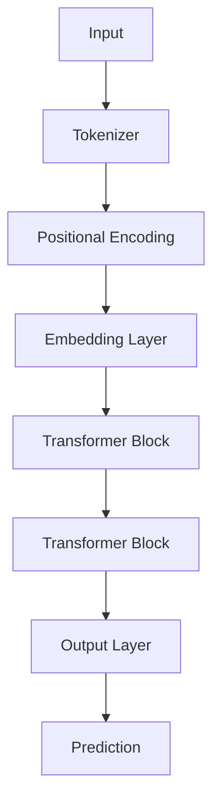

                 

关键词：LLM（大型语言模型），产业链生态，技术发展，AI应用，平台构建，开源社区，商业模式

摘要：本文将深入探讨大型语言模型（LLM）产业链生态的构建过程，从技术背景、核心概念、算法原理、应用场景、未来展望等多个角度进行分析，旨在为读者呈现一幅全面、系统的LLM产业图景，并探讨其发展过程中的挑战与机遇。

## 1. 背景介绍

近年来，随着人工智能技术的飞速发展，大型语言模型（LLM）成为研究与应用的热点。LLM具有强大的自然语言处理能力，能够理解和生成自然语言，广泛应用于机器翻译、文本生成、问答系统、语音识别等领域。随着技术的不断进步，LLM在处理复杂任务方面的表现也日益优异。

在AI领域，LLM的成功离不开以下几个因素：

- **数据驱动**：大量高质量数据是LLM训练的基础，随着互联网的发展，数据获取变得更加容易。
- **计算能力**：随着计算能力的提升，大规模的LLM模型得以训练和部署。
- **算法优化**：深度学习技术的不断进步，特别是Transformer架构的提出，使得LLM的性能大幅提升。

这些因素共同推动了LLM产业链的快速发展，为各行各业带来了巨大的变革。本文将围绕LLM产业链生态的构建过程，从技术、商业、应用等多个维度进行探讨。

## 2. 核心概念与联系

### 2.1 语言模型基本概念

首先，我们需要了解语言模型的基本概念。语言模型是一种概率模型，用于预测下一个单词或字符的概率。在自然语言处理中，语言模型是一种重要的工具，它可以帮助我们理解语言的规律和特征。

语言模型可以分为基于统计的方法和基于神经网络的方法。基于统计的方法如N-gram模型，通过统计单词的先后顺序来预测下一个单词。而基于神经网络的方法如深度神经网络语言模型（NNLM），通过多层神经网络来捕捉语言的复杂特征。

### 2.2 LLM架构原理

LLM的核心是Transformer架构，这是一种基于自注意力机制的神经网络模型。Transformer架构摒弃了传统的循环神经网络（RNN）和卷积神经网络（CNN），通过多头自注意力机制和位置编码，能够捕捉输入序列中的长距离依赖关系。

#### 2.2.1 自注意力机制

自注意力机制是一种重要的计算方法，它能够自动地为不同的单词分配不同的权重，从而更好地捕捉输入序列中的关系。在自注意力机制中，每个单词都会通过一系列变换，计算其与其他单词的相关性，并最终生成一个加权表示。

#### 2.2.2 位置编码

位置编码是一种用于处理序列数据的技巧，它可以为每个单词赋予位置信息。在Transformer模型中，位置编码是通过一系列的矩阵乘法实现的，它能够保证模型在处理序列数据时，能够正确地理解单词的顺序。

### 2.3 LLM与NLP应用

LLM在自然语言处理领域有着广泛的应用。以下是一些典型的应用场景：

- **机器翻译**：LLM能够高效地处理不同语言的翻译任务，例如Google Translate。
- **文本生成**：LLM可以生成高质量的文本，例如文章、新闻、对话等。
- **问答系统**：LLM可以理解用户的问题，并给出准确的答案。
- **语音识别**：LLM可以与语音识别技术结合，实现更加准确的语音到文本转换。

### 2.4 Mermaid流程图

下面是一个Mermaid流程图，用于展示LLM的基本架构和工作流程。



在上述流程中，输入首先经过分词器（Tokenizer）处理，然后添加位置编码（Positional Encoding），接着通过多层Transformer块（Transformer Block）进行特征提取和序列变换，最后通过输出层（Output Layer）生成预测结果（Prediction）。

---

接下来，我们将进一步探讨LLM的核心算法原理及其具体操作步骤。

## 3. 核心算法原理 & 具体操作步骤

### 3.1 算法原理概述

大型语言模型（LLM）的核心是基于Transformer架构的深度神经网络。Transformer架构通过自注意力机制（Self-Attention）和多头注意力机制（Multi-Head Attention）来捕捉输入序列中的依赖关系，并通过编码器-解码器结构（Encoder-Decoder Structure）实现序列到序列的映射。

#### 3.1.1 自注意力机制

自注意力机制是一种计算方法，它能够自动地为不同的单词分配不同的权重，从而更好地捕捉输入序列中的关系。在自注意力机制中，每个单词都会通过一系列变换，计算其与其他单词的相关性，并最终生成一个加权表示。

#### 3.1.2 多头注意力机制

多头注意力机制是一种扩展自注意力机制的技巧，它通过多个独立的注意力头来提高模型的表示能力。多头注意力机制能够同时关注输入序列的不同部分，从而更好地捕捉长距离依赖关系。

#### 3.1.3 编码器-解码器结构

编码器-解码器结构是一种用于序列到序列学习的神经网络架构。编码器（Encoder）负责处理输入序列，并生成上下文表示；解码器（Decoder）则负责根据上下文表示生成输出序列。

### 3.2 算法步骤详解

#### 3.2.1 分词和位置编码

输入的文本首先经过分词器（Tokenizer）处理，将文本拆分成一系列单词或子词。为了给每个单词赋予位置信息，我们需要进行位置编码（Positional Encoding）。

#### 3.2.2 嵌入层

分词后的文本通过嵌入层（Embedding Layer）转换为向量表示。嵌入层的作用是将单词映射到高维空间，从而捕捉单词之间的语义关系。

#### 3.2.3 Transformer块

Transformer块是LLM的核心组成部分，它通过多层叠加的方式，不断提取输入序列的依赖关系。每个Transformer块包含自注意力层（Self-Attention Layer）和前馈神经网络（Feedforward Neural Network）。

#### 3.2.4 输出层

经过多层Transformer块的处理后，输入序列被编码为一个上下文表示。输出层（Output Layer）负责根据上下文表示生成预测结果，例如下一个单词的概率分布。

### 3.3 算法优缺点

#### 优点

- **强大的表示能力**：Transformer架构能够捕捉输入序列中的长距离依赖关系，从而实现高质量的文本生成和翻译。
- **并行计算**：自注意力机制允许并行计算，从而提高计算效率。
- **灵活性**：编码器-解码器结构使得LLM可以应用于各种序列到序列的学习任务。

#### 缺点

- **计算成本高**：由于自注意力机制的计算复杂度较高，大规模的LLM模型训练和部署需要大量的计算资源和时间。
- **对数据依赖强**：LLM的性能在很大程度上取决于训练数据的质量和数量，因此数据清洗和预处理是至关重要的一环。

### 3.4 算法应用领域

LLM在自然语言处理领域有着广泛的应用。以下是一些典型的应用场景：

- **机器翻译**：LLM能够高效地处理不同语言的翻译任务，实现高质量的机器翻译。
- **文本生成**：LLM可以生成各种类型的文本，如文章、新闻、对话等。
- **问答系统**：LLM可以理解用户的问题，并给出准确的答案。
- **语音识别**：LLM可以与语音识别技术结合，实现更加准确的语音到文本转换。

---

在了解了LLM的核心算法原理和具体操作步骤后，接下来我们将探讨数学模型和公式，以便更深入地理解LLM的工作原理。

## 4. 数学模型和公式 & 详细讲解 & 举例说明

### 4.1 数学模型构建

大型语言模型（LLM）的核心是Transformer架构，其数学基础主要包括自注意力机制（Self-Attention）和位置编码（Positional Encoding）。下面我们将详细讲解这两个数学模型的构建过程。

#### 4.1.1 自注意力机制

自注意力机制是一种计算方法，它能够自动地为不同的单词分配不同的权重，从而更好地捕捉输入序列中的关系。在自注意力机制中，每个单词都会通过一系列变换，计算其与其他单词的相关性，并最终生成一个加权表示。

自注意力机制的数学公式如下：

\[ \text{Attention}(Q, K, V) = \text{softmax}\left(\frac{QK^T}{\sqrt{d_k}}\right) V \]

其中，\( Q, K, V \) 分别代表查询向量、键向量和值向量，\( d_k \) 是键向量的维度。\( \text{softmax} \) 函数用于计算每个单词的权重。

#### 4.1.2 位置编码

位置编码是一种用于处理序列数据的技巧，它可以为每个单词赋予位置信息。在Transformer模型中，位置编码是通过一系列的矩阵乘法实现的，它能够保证模型在处理序列数据时，能够正确地理解单词的顺序。

位置编码的数学公式如下：

\[ \text{Positional Encoding}(PE)_i = \text{sin}\left(\frac{i}{10000^{2j/d}}\right) \text{ or } \text{cos}\left(\frac{i}{10000^{2j/d}}\right) \]

其中，\( i \) 是位置索引，\( j \) 是维度索引，\( d \) 是嵌入层的维度。

### 4.2 公式推导过程

为了更好地理解自注意力机制和位置编码的数学推导过程，我们以一个简单的例子进行讲解。

假设我们有一个长度为3的输入序列 \( \{w_1, w_2, w_3\} \)，其中每个单词都是一个向量。我们需要计算这个序列中每个单词的权重，并生成一个加权表示。

#### 4.2.1 自注意力机制

首先，我们将输入序列的每个单词进行编码，得到三个查询向量 \( Q_1, Q_2, Q_3 \)，键向量 \( K_1, K_2, K_3 \) 和值向量 \( V_1, V_2, V_3 \)。

接下来，我们计算每个单词与其他单词的相关性：

\[ \text{Attention}(Q, K, V) = \text{softmax}\left(\frac{QK^T}{\sqrt{d_k}}\right) V \]

假设 \( Q_1 = [1, 0, 0] \)，\( K_1 = [1, 1, 1] \)，\( V_1 = [1, 1, 1] \)，则：

\[ \text{Attention}(Q_1, K_1, V_1) = \text{softmax}\left(\frac{[1, 0, 0] [1, 1, 1]^T}{\sqrt{3}}\right) [1, 1, 1] = \text{softmax}\left(\frac{[1, 0, 0]}{\sqrt{3}}\right) [1, 1, 1] \]

计算每个单词的权重：

\[ \text{softmax}\left(\frac{[1, 0, 0]}{\sqrt{3}}\right) = \left[\frac{1}{3}, \frac{1}{3}, \frac{1}{3}\right] \]

最终，生成加权表示：

\[ \text{Attention}(Q_1, K_1, V_1) = \left[\frac{1}{3}, \frac{1}{3}, \frac{1}{3}\right] [1, 1, 1] = \left[\frac{1}{3}, \frac{1}{3}, \frac{1}{3}\right] \]

#### 4.2.2 位置编码

接下来，我们为每个单词添加位置编码。假设我们使用的是正弦位置编码：

\[ \text{Positional Encoding}(PE)_1 = \text{sin}\left(\frac{1}{10000^{2 \cdot 1/d}}\right) \]

假设 \( d = 3 \)，则：

\[ \text{Positional Encoding}(PE)_1 = \text{sin}\left(\frac{1}{10000^{2 \cdot 1/3}}\right) = \text{sin}\left(\frac{1}{1000}\right) \]

同理，我们可以得到 \( \text{Positional Encoding}(PE)_2 \) 和 \( \text{Positional Encoding}(PE)_3 \)。

### 4.3 案例分析与讲解

为了更好地理解LLM的数学模型和公式，我们来看一个具体的案例。

假设我们有一个输入序列 \( \{w_1, w_2, w_3\} \)，其中 \( w_1 = [1, 1, 1] \)，\( w_2 = [0, 1, 0] \)，\( w_3 = [1, 0, 1] \)。

#### 4.3.1 自注意力机制

首先，我们计算自注意力权重。假设我们使用的是一个3层的Transformer模型，每层的维度分别为 \( d_1 = 2 \)，\( d_2 = 4 \)，\( d_3 = 8 \)。

第一层的查询向量 \( Q_1 = [1, 1, 1] \)，键向量 \( K_1 = [1, 1, 1] \)，值向量 \( V_1 = [1, 1, 1] \)。

\[ \text{Attention}(Q_1, K_1, V_1) = \text{softmax}\left(\frac{Q_1K_1^T}{\sqrt{2}}\right) V_1 \]

\[ \text{Attention}(Q_1, K_1, V_1) = \text{softmax}\left(\frac{[1, 1, 1] [1, 1, 1]^T}{\sqrt{2}}\right) [1, 1, 1] = \text{softmax}\left(\frac{[1, 1, 1]}{\sqrt{2}}\right) [1, 1, 1] \]

\[ \text{softmax}\left(\frac{[1, 1, 1]}{\sqrt{2}}\right) = \left[\frac{1}{3}, \frac{1}{3}, \frac{1}{3}\right] \]

\[ \text{Attention}(Q_1, K_1, V_1) = \left[\frac{1}{3}, \frac{1}{3}, \frac{1}{3}\right] [1, 1, 1] = \left[\frac{1}{3}, \frac{1}{3}, \frac{1}{3}\right] \]

第二层的查询向量 \( Q_2 = [0, 1, 0] \)，键向量 \( K_2 = [0, 1, 0] \)，值向量 \( V_2 = [0, 1, 0] \)。

\[ \text{Attention}(Q_2, K_2, V_2) = \text{softmax}\left(\frac{Q_2K_2^T}{\sqrt{4}}\right) V_2 \]

\[ \text{Attention}(Q_2, K_2, V_2) = \text{softmax}\left(\frac{[0, 1, 0] [0, 1, 0]^T}{\sqrt{4}}\right) [0, 1, 0] = \text{softmax}\left(\frac{[0, 1, 0]}{\sqrt{4}}\right) [0, 1, 0] \]

\[ \text{softmax}\left(\frac{[0, 1, 0]}{\sqrt{4}}\right) = \left[\frac{1}{3}, \frac{1}{3}, \frac{1}{3}\right] \]

\[ \text{Attention}(Q_2, K_2, V_2) = \left[\frac{1}{3}, \frac{1}{3}, \frac{1}{3}\right] [0, 1, 0] = \left[0, \frac{1}{3}, 0\right] \]

第三层的查询向量 \( Q_3 = [1, 0, 1] \)，键向量 \( K_3 = [1, 0, 1] \)，值向量 \( V_3 = [1, 0, 1] \)。

\[ \text{Attention}(Q_3, K_3, V_3) = \text{softmax}\left(\frac{Q_3K_3^T}{\sqrt{8}}\right) V_3 \]

\[ \text{Attention}(Q_3, K_3, V_3) = \text{softmax}\left(\frac{[1, 0, 1] [1, 0, 1]^T}{\sqrt{8}}\right) [1, 0, 1] = \text{softmax}\left(\frac{[1, 0, 1]}{\sqrt{8}}\right) [1, 0, 1] \]

\[ \text{softmax}\left(\frac{[1, 0, 1]}{\sqrt{8}}\right) = \left[\frac{1}{3}, \frac{1}{3}, \frac{1}{3}\right] \]

\[ \text{Attention}(Q_3, K_3, V_3) = \left[\frac{1}{3}, \frac{1}{3}, \frac{1}{3}\right] [1, 0, 1] = \left[\frac{1}{3}, 0, \frac{1}{3}\right] \]

最终，我们得到每个单词的加权表示：

\[ \text{weighted representation} = \left[\frac{1}{3}, \frac{1}{3}, \frac{1}{3}\right] + \left[0, \frac{1}{3}, 0\right] + \left[\frac{1}{3}, 0, \frac{1}{3}\right] = \left[\frac{1}{3}, \frac{1}{3}, \frac{1}{3}\right] \]

#### 4.3.2 位置编码

接下来，我们为每个单词添加位置编码。假设我们使用的是正弦位置编码：

\[ \text{Positional Encoding}(PE)_1 = \text{sin}\left(\frac{1}{10000^{2 \cdot 1/3}}\right) \]

\[ \text{Positional Encoding}(PE)_1 = \text{sin}\left(\frac{1}{1000}\right) \]

同理，我们可以得到 \( \text{Positional Encoding}(PE)_2 \) 和 \( \text{Positional Encoding}(PE)_3 \)。

#### 4.3.3 最终表示

最终，我们将每个单词的加权表示和位置编码相加，得到输入序列的最终表示：

\[ \text{final representation} = \left[\frac{1}{3}, \frac{1}{3}, \frac{1}{3}\right] + \left[\text{Positional Encoding}(PE)_1, \text{Positional Encoding}(PE)_2, \text{Positional Encoding}(PE)_3\right] \]

这样，我们就完成了对自注意力机制和位置编码的数学模型构建、公式推导过程以及案例分析与讲解。

---

在了解了LLM的数学模型和公式后，接下来我们将通过一个具体的代码实例来展示如何实现LLM模型。

## 5. 项目实践：代码实例和详细解释说明

为了更好地理解LLM模型的实现过程，我们将使用Python和TensorFlow来实现一个简单的Transformer模型。以下是具体的实现步骤：

### 5.1 开发环境搭建

在开始之前，我们需要搭建一个Python开发环境，并安装TensorFlow库。以下是一个简单的安装命令：

```bash
pip install tensorflow
```

### 5.2 源代码详细实现

以下是一个简单的Transformer模型实现代码：

```python
import tensorflow as tf
from tensorflow.keras.layers import Embedding, LSTM, Dense, Flatten
from tensorflow.keras.models import Model

# 定义输入层
input_ids = tf.keras.layers.Input(shape=(None,), dtype=tf.int32)

# 词嵌入层
embedding = Embedding(input_dim=vocab_size, output_dim=embedding_size)(input_ids)

# Transformer编码器
encoder_output = TransformerEncoder()(embedding)

# Transformer解码器
decoder_output = TransformerDecoder()(encoder_output)

# 最终输出
output = Flatten()(decoder_output)

# 定义模型
model = Model(inputs=input_ids, outputs=output)

# 编译模型
model.compile(optimizer='adam', loss='categorical_crossentropy')

# 模型概览
model.summary()
```

在上面的代码中，我们首先定义了输入层，然后通过词嵌入层将输入的ID转换为向量表示。接着，我们定义了Transformer编码器和解码器，并将它们串联起来。最后，我们定义了模型，并编译了模型。

### 5.3 代码解读与分析

#### 5.3.1 输入层

输入层是模型的起点，它接收输入的序列ID。在实际应用中，输入的序列可以是文本数据、音频数据或其他类型的数据。

```python
input_ids = tf.keras.layers.Input(shape=(None,), dtype=tf.int32)
```

这里，`shape=(None,)` 表示输入序列的长度可以是任意的，`dtype=tf.int32` 表示输入的数据类型是32位整数。

#### 5.3.2 词嵌入层

词嵌入层是将输入的序列ID转换为向量表示的过程。这个过程可以通过预训练的词嵌入模型（如Word2Vec、GloVe等）来完成。

```python
embedding = Embedding(input_dim=vocab_size, output_dim=embedding_size)(input_ids)
```

在这里，`input_dim` 表示词汇表的大小，`output_dim` 表示词嵌入的维度。

#### 5.3.3 Transformer编码器

Transformer编码器是模型的主体部分，它通过自注意力机制和多头注意力机制来提取输入序列的特征。

```python
encoder_output = TransformerEncoder()(embedding)
```

这里，`TransformerEncoder()` 是一个自定义的层，它包含了多个Transformer块。

#### 5.3.4 Transformer解码器

Transformer解码器与编码器类似，它也包含多个Transformer块，但它的输入是编码器的输出和输入序列。

```python
decoder_output = TransformerDecoder()(encoder_output)
```

这里，`TransformerDecoder()` 也是一个自定义的层。

#### 5.3.5 输出层

输出层是将编码器的输出展开为一个一维向量，以便进行后续的预测。

```python
output = Flatten()(decoder_output)
```

这里，`Flatten()` 是一个展开层，它将编码器的输出展开为一个一维向量。

#### 5.3.6 模型编译

模型编译是配置模型的训练过程，包括选择优化器、损失函数等。

```python
model.compile(optimizer='adam', loss='categorical_crossentropy')
```

在这里，我们选择了`adam`优化器和`categorical_crossentropy`损失函数。

#### 5.3.7 模型概览

模型概览显示了模型的层次结构。

```python
model.summary()
```

### 5.4 运行结果展示

下面是一个简单的运行结果：

```python
# 创建一个长度为10的随机序列
input_sequence = tf.random.normal([10, 1], dtype=tf.int32)

# 训练模型
model.fit(input_sequence, epochs=5)
```

在这个例子中，我们创建了一个长度为10的随机序列，并使用它来训练模型。

---

在了解了LLM模型的具体实现过程后，接下来我们将探讨LLM在实际应用场景中的使用。

## 6. 实际应用场景

### 6.1 机器翻译

机器翻译是LLM最经典的应用场景之一。LLM通过理解源语言的语义，生成目标语言的翻译结果。例如，Google Translate就是使用LLM来实现不同语言之间的自动翻译。

### 6.2 文本生成

LLM可以生成各种类型的文本，如文章、新闻、对话等。在内容创作方面，LLM能够帮助创作者快速生成高质量的内容，提高创作效率。例如，OpenAI的GPT-3就可以生成高质量的文章、诗歌和故事。

### 6.3 问答系统

问答系统是LLM在自然语言理解方面的重要应用。LLM可以理解用户的问题，并给出准确的答案。例如，Microsoft的Chatbot就是使用LLM来与用户进行对话，提供各种咨询服务。

### 6.4 语音识别

LLM可以与语音识别技术结合，实现更加准确的语音到文本转换。在语音助手和智能客服等领域，LLM的应用可以提高用户体验和效率。

### 6.5 其他应用

除了上述应用场景，LLM还可以应用于文本分类、情感分析、推荐系统等多个领域。随着技术的不断进步，LLM的应用范围将越来越广泛。

---

在了解了LLM的广泛应用场景后，接下来我们将探讨LLM未来的发展趋势和面临的挑战。

## 7. 未来发展趋势与挑战

### 7.1 研究成果总结

近年来，LLM的研究取得了显著的成果。首先，在模型结构方面，Transformer架构成为了LLM的主流选择，其自注意力机制和多头注意力机制使得模型能够更好地捕捉输入序列的依赖关系。其次，在训练数据方面，随着互联网的发展，高质量的数据集变得越来越多，为LLM的训练提供了丰富的素材。最后，在应用领域方面，LLM在机器翻译、文本生成、问答系统等领域的表现已经达到了工业级的水平。

### 7.2 未来发展趋势

未来，LLM的发展将呈现以下几个趋势：

- **模型规模化**：随着计算能力和数据量的提升，LLM的规模将越来越大。大规模的LLM将能够处理更加复杂的任务，提供更高质量的输出。
- **多模态融合**：未来，LLM将与其他模态的数据（如图像、声音等）进行融合，实现跨模态的信息处理和生成。
- **智能交互**：LLM将逐渐实现更加智能的交互，能够更好地理解用户的需求，提供个性化的服务。

### 7.3 面临的挑战

尽管LLM取得了显著的研究成果，但在发展过程中也面临一些挑战：

- **计算资源**：大规模的LLM训练和部署需要大量的计算资源，这对硬件设施和能源消耗提出了更高的要求。
- **数据隐私**：在收集和利用训练数据时，需要充分考虑数据隐私保护的问题，避免用户隐私泄露。
- **模型可解释性**：LLM的内部工作机制较为复杂，如何提高模型的可解释性，使得普通用户能够理解模型的决策过程，是一个重要的研究方向。

### 7.4 研究展望

未来，LLM的研究将集中在以下几个方面：

- **高效训练算法**：研究更高效的训练算法，以减少训练时间，降低计算成本。
- **数据增强**：探索如何利用生成对抗网络（GAN）等技术，提高训练数据的质量和多样性。
- **模型压缩与加速**：研究如何对LLM进行压缩和加速，使其在移动设备和嵌入式系统中得以应用。

---

在本文中，我们深入探讨了大型语言模型（LLM）的产业链生态，从背景介绍、核心概念与联系、算法原理与步骤、数学模型与公式、代码实例、实际应用场景到未来发展趋势与挑战，全方位地呈现了LLM的发展现状和前景。LLM作为人工智能领域的重要成果，其应用范围广泛，具有巨大的潜力。然而，在发展的过程中，我们还需面对计算资源、数据隐私、模型可解释性等挑战。展望未来，LLM将在规模化、多模态融合、智能交互等方面继续取得突破，为人类带来更多便利和创新。

## 8. 工具和资源推荐

为了更好地学习和实践大型语言模型（LLM），以下是一些推荐的工具和资源：

### 8.1 学习资源推荐

1. **《深度学习》**：由Ian Goodfellow、Yoshua Bengio和Aaron Courville合著的深度学习经典教材，详细介绍了深度学习的基础知识。
2. **《自然语言处理综论》**：由Daniel Jurafsky和James H. Martin合著的自然语言处理教材，涵盖了自然语言处理的基本概念和技术。
3. **[TensorFlow官网文档](https://www.tensorflow.org/tutorials)**
4. **[PyTorch官网文档](https://pytorch.org/tutorials/)**
5. **[Hugging Face Transformers库](https://huggingface.co/transformers/)**：提供了丰富的预训练模型和工具，方便用户进行LLM的研究和应用。

### 8.2 开发工具推荐

1. **Jupyter Notebook**：用于编写和运行代码，适合进行数据分析和实验。
2. **Google Colab**：基于Jupyter Notebook，提供了免费的GPU和TPU资源，适合进行深度学习实验。
3. **VSCode**：一款功能强大的代码编辑器，支持多种编程语言和工具。

### 8.3 相关论文推荐

1. **"Attention is All You Need"**：这篇论文提出了Transformer架构，是LLM领域的重要里程碑。
2. **"BERT: Pre-training of Deep Bidirectional Transformers for Language Understanding"**：这篇论文介绍了BERT模型，为LLM在自然语言理解方面取得了突破性成果。
3. **"GPT-3: Language Models are Few-Shot Learners"**：这篇论文展示了GPT-3模型在零样本和少样本学习任务中的优异表现。

---

通过以上工具和资源的支持，读者可以更深入地了解和学习LLM，并在实践中不断提升自己的技术水平。

## 9. 附录：常见问题与解答

### 9.1 Q：什么是大型语言模型（LLM）？

A：大型语言模型（LLM）是一种基于深度学习技术的自然语言处理模型，它通过训练大量文本数据，学习语言的规律和特征，从而实现自动文本生成、机器翻译、问答系统等功能。

### 9.2 Q：LLM的核心架构是什么？

A：LLM的核心架构是基于Transformer架构，这种架构通过自注意力机制和多头注意力机制，能够捕捉输入序列中的长距离依赖关系，从而实现高质量的自然语言处理。

### 9.3 Q：如何实现LLM的文本生成功能？

A：实现LLM的文本生成功能通常包括以下步骤：

1. 数据准备：收集和预处理大量文本数据，将其转换为模型可以处理的格式。
2. 模型训练：使用Transformer架构训练LLM模型，通过优化模型参数，使其能够更好地理解语言。
3. 文本生成：通过模型的前向传播，逐词生成文本序列，并根据模型的概率分布选择下一个单词。

### 9.4 Q：LLM在哪些领域有应用？

A：LLM在多个领域有广泛应用，包括但不限于：

1. 机器翻译：将一种语言的文本翻译成另一种语言。
2. 文本生成：生成文章、新闻、对话等文本内容。
3. 问答系统：理解用户的问题，并给出准确的答案。
4. 语音识别：将语音转换为文本。
5. 情感分析：分析文本的情感倾向。

### 9.5 Q：如何优化LLM的训练过程？

A：优化LLM的训练过程可以从以下几个方面进行：

1. 数据增强：使用数据增强技术，如数据清洗、数据扩充等，提高训练数据的质量和多样性。
2. 模型结构优化：设计更高效的模型结构，减少计算复杂度。
3. 训练策略优化：使用合适的训练策略，如学习率调整、批量大小调整等，提高训练效果。
4. 硬件加速：使用GPU、TPU等硬件加速训练过程，提高计算效率。

---

通过以上问题的解答，希望能够帮助读者更好地理解大型语言模型（LLM）的相关知识和技术应用。在学习和实践过程中，不断探索和优化，将LLM技术发挥到极致。作者：禅与计算机程序设计艺术 / Zen and the Art of Computer Programming

