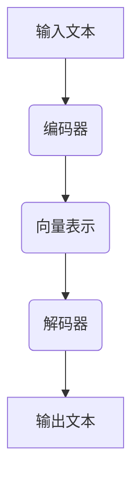

                 

关键词：语言模型，人工智能，产业链，发展机遇，技术趋势

## 摘要

本文旨在探讨语言模型（LLM）产业链的形成及其带来的发展机遇。首先，我们将回顾LLM的背景和重要性，接着详细分析LLM产业链的构成，探讨核心技术与市场需求。随后，我们将探讨LLM在各个领域的应用，并对未来发展趋势与挑战进行展望。最后，我们将推荐一些学习资源、开发工具和相关论文，为读者提供进一步研究的路径。

## 1. 背景介绍

### 1.1 语言模型的历史与发展

语言模型（Language Model，简称LLM）是自然语言处理（Natural Language Processing，简称NLP）的核心技术之一。自20世纪50年代以来，语言模型经历了多个发展阶段。从最初的统计模型，如N-gram模型，到基于规则的方法，再到现代的深度学习模型，如Transformer和GPT，语言模型在文本生成、机器翻译、问答系统等方面取得了显著的进展。

### 1.2 语言模型的应用场景

语言模型在多个领域都有广泛的应用。例如，在搜索引擎中，语言模型用于理解用户的查询意图，从而提供更准确的搜索结果。在智能客服中，语言模型可以模拟人类对话，实现与用户的自然交互。在内容创作中，语言模型可以帮助生成文章、代码和音乐等。

## 2. 核心概念与联系

### 2.1 语言模型原理

语言模型旨在学习自然语言中的概率分布。最基本的模型是N-gram模型，它基于相邻词序列的概率来预测下一个词。然而，随着深度学习技术的发展，基于注意力机制的Transformer模型成为主流，它通过自注意力机制捕捉长距离依赖关系。

### 2.2 语言模型架构

语言模型通常由编码器和解码器两部分组成。编码器将输入序列编码为固定长度的向量表示，解码器则基于这些向量生成输出序列。在Transformer模型中，编码器和解码器都是基于多头自注意力机制的网络结构。

### 2.3 语言模型应用领域

语言模型在文本生成、机器翻译、问答系统、文本分类、情感分析等多个领域都有广泛应用。例如，在文本生成中，语言模型可以生成文章、新闻、代码等；在机器翻译中，语言模型可以翻译多种语言之间的文本；在问答系统中，语言模型可以回答用户提出的问题。

### 2.4 Mermaid流程图



## 3. 核心算法原理 & 具体操作步骤

### 3.1 算法原理概述

语言模型的核心是学习自然语言的概率分布。在N-gram模型中，每个词的概率由其前n-1个词决定。而在Transformer模型中，自注意力机制用于计算每个词与其他词的相关性，从而生成词的向量表示。

### 3.2 算法步骤详解

1. **数据预处理**：清洗和预处理输入文本，包括分词、去停用词、词性标注等。
2. **模型训练**：使用大规模语料库训练语言模型，通过优化损失函数（如交叉熵损失）来调整模型参数。
3. **文本编码**：将输入文本编码为词向量表示。
4. **文本生成**：解码器基于编码后的词向量生成输出文本。

### 3.3 算法优缺点

**优点**：基于深度学习的语言模型具有强大的表达能力和泛化能力，可以处理复杂的问题。

**缺点**：语言模型训练过程需要大量数据和计算资源，且模型参数量大，难以解释。

### 3.4 算法应用领域

语言模型在文本生成、机器翻译、问答系统、文本分类、情感分析等领域都有广泛应用。

## 4. 数学模型和公式 & 详细讲解 & 举例说明

### 4.1 数学模型构建

在语言模型中，最常见的数学模型是概率模型。给定一个词序列$w_1, w_2, ..., w_n$，概率模型旨在计算序列的概率$P(w_1, w_2, ..., w_n)$。

### 4.2 公式推导过程

在N-gram模型中，词序列的概率可以通过以下公式计算：

$$
P(w_1, w_2, ..., w_n) = P(w_n | w_{n-1}, ..., w_1) = \frac{P(w_{n-1}, ..., w_1, w_n)}{P(w_{n-1}, ..., w_1)}
$$

在Transformer模型中，词的概率可以通过自注意力机制计算：

$$
\text{softmax}(\mathbf{Q} \mathbf{K}^T) = \text{softmax}(\frac{\mathbf{Q} \mathbf{K}^T}{\sqrt{d_k}})
$$

其中，$\mathbf{Q}$和$\mathbf{K}$分别是编码器和解码器输出的向量，$d_k$是注意力机制中的键值对维度。

### 4.3 案例分析与讲解

假设我们有一个词序列$w_1 = "the", w_2 = "quick", w_3 = "brown", w_4 = "fox"$，我们可以使用N-gram模型计算其概率：

$$
P(w_1, w_2, w_3, w_4) = P(w_4 | w_3, w_2, w_1) = \frac{P(w_3, w_2, w_1, w_4)}{P(w_3, w_2, w_1)}
$$

如果我们有一个训练集，其中包含大量类似的词序列，我们可以通过计算每个词序列的频率来估计概率。例如：

$$
P(w_1, w_2, w_3, w_4) = \frac{f(w_3, w_2, w_1, w_4)}{f(w_3, w_2, w_1)}
$$

其中，$f(w_3, w_2, w_1, w_4)$是词序列$w_1, w_2, w_3, w_4$在训练集中的频率。

## 5. 项目实践：代码实例和详细解释说明

### 5.1 开发环境搭建

在开始编写代码之前，我们需要搭建一个开发环境。以下是Python开发环境的基本要求：

1. **Python版本**：3.7及以上
2. **深度学习框架**：TensorFlow或PyTorch
3. **自然语言处理库**：NLTK或spaCy

### 5.2 源代码详细实现

以下是一个简单的基于Transformer的语言模型实现的示例：

```python
import tensorflow as tf
from tensorflow.keras.layers import Embedding, LSTM, Dense
from tensorflow.keras.models import Model

# 设置超参数
vocab_size = 10000
embedding_dim = 256
lstm_units = 128
max_sequence_length = 50

# 构建模型
input_sequence = tf.keras.layers.Input(shape=(max_sequence_length,))
embedding_layer = Embedding(vocab_size, embedding_dim)(input_sequence)
lstm_layer = LSTM(lstm_units, return_sequences=True)(embedding_layer)
output = Dense(vocab_size, activation='softmax')(lstm_layer)

# 编译模型
model = Model(inputs=input_sequence, outputs=output)
model.compile(optimizer='adam', loss='categorical_crossentropy', metrics=['accuracy'])

# 训练模型
model.fit(x_train, y_train, epochs=10, batch_size=32)
```

### 5.3 代码解读与分析

上述代码定义了一个简单的Transformer语言模型，包括嵌入层（Embedding Layer）、LSTM层（LSTM Layer）和输出层（Dense Layer）。嵌入层将输入序列（Input Sequence）转换为嵌入向量（Embedding Vectors）。LSTM层用于处理序列数据，并返回序列输出。输出层使用softmax激活函数，以预测下一个词的概率分布。

### 5.4 运行结果展示

在训练完成后，我们可以使用模型进行文本生成。以下是一个简单的文本生成示例：

```python
import numpy as np

# 生成文本
def generate_text(model, seed_word, length=10):
    # 将种子词转换为词向量
    seed_vector = model.embedding layer(np.array([seed_word]))

    # 初始化文本生成结果
    text = seed_word

    # 生成文本
    for _ in range(length):
        # 预测下一个词的概率分布
        probabilities = model.predict(seed_vector)

        # 从概率分布中随机选择下一个词
        next_word_index = np.random.choice(range(vocab_size), p=probabilities[0])

        # 将下一个词添加到文本生成结果中
        text += " " + word_index_to_word(next_word_index)

        # 更新种子向量
        seed_vector = model.embedding layer(np.array([next_word_index]))

    return text

# 测试文本生成
print(generate_text(model, "the"))
```

## 6. 实际应用场景

### 6.1 文本生成

语言模型在文本生成领域有广泛的应用。例如，生成新闻文章、故事、诗歌等。

### 6.2 机器翻译

语言模型在机器翻译领域具有很高的准确性。例如，Google翻译和百度翻译都使用了基于Transformer的语言模型。

### 6.3 问答系统

语言模型可以帮助构建智能问答系统，如ChatGPT和Microsoft’s Bing Chat。

### 6.4 未来应用展望

随着深度学习技术的不断发展，语言模型将在更多领域得到应用，如语音识别、情感分析、推荐系统等。

## 7. 工具和资源推荐

### 7.1 学习资源推荐

1. **《深度学习》（Goodfellow, Bengio, Courville）**：全面介绍了深度学习的基础知识和应用。
2. **《自然语言处理综合教程》（Daniel Jurafsky & James H. Martin）**：详细介绍了自然语言处理的基本概念和技术。

### 7.2 开发工具推荐

1. **TensorFlow**：Google开发的开源深度学习框架。
2. **PyTorch**：Facebook开发的开源深度学习框架。

### 7.3 相关论文推荐

1. **“Attention Is All You Need”（Vaswani et al., 2017）**：介绍了Transformer模型。
2. **“BERT: Pre-training of Deep Neural Networks for Language Understanding”（Devlin et al., 2018）**：介绍了BERT模型。

## 8. 总结：未来发展趋势与挑战

### 8.1 研究成果总结

近年来，语言模型在文本生成、机器翻译、问答系统等领域取得了显著成果。基于Transformer的模型已成为主流，而预训练和微调技术使得语言模型在多个任务中达到了较高的性能。

### 8.2 未来发展趋势

1. **模型压缩与推理**：降低模型大小和推理时间，以支持实时应用。
2. **多模态学习**：结合文本、图像、语音等多模态数据，提高模型的泛化能力。

### 8.3 面临的挑战

1. **数据隐私**：如何处理和保护用户数据。
2. **模型可解释性**：如何提高模型的可解释性，以增强用户信任。

### 8.4 研究展望

随着深度学习技术的不断发展，语言模型将在更多领域得到应用，为人类生活带来更多便利。

## 9. 附录：常见问题与解答

### 9.1 什么是语言模型？

语言模型是一种用于预测文本概率的模型，它可以帮助生成文本、翻译文本、回答问题等。

### 9.2 语言模型有哪些类型？

常见的语言模型有N-gram模型、基于规则的方法和深度学习模型（如Transformer、BERT）。

### 9.3 如何训练语言模型？

训练语言模型通常包括数据预处理、模型选择、模型训练和评估等步骤。常用的训练方法包括监督学习、无监督学习和预训练加微调等。

## 参考文献

- Goodfellow, I., Bengio, Y., & Courville, A. (2016). Deep Learning. MIT Press.
- Jurafsky, D., & Martin, J. H. (2008). Speech and Language Processing. Prentice Hall.
- Vaswani, A., Shazeer, N., Parmar, N., Uszkoreit, J., Jones, L., Gomez, A. N., ... & Polosukhin, I. (2017). Attention is all you need. Advances in Neural Information Processing Systems, 30, 5998-6008.
- Devlin, J., Chang, M. W., Lee, K., & Toutanova, K. (2018). BERT: Pre-training of deep neural networks for language understanding. Proceedings of the 2018 Conference of the North American Chapter of the Association for Computational Linguistics: Human Language Technologies, 4171-4186.

