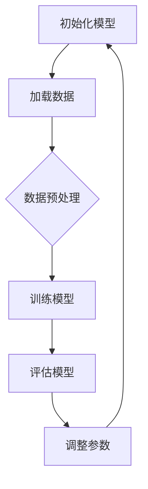

                 

关键词：自然语言处理、语言模型、推理速度、优化算法、数学模型、代码实例、实际应用

摘要：本文将探讨大型语言模型（LLM）优化的重要性和方法，以及如何提高LLM的推理速度。我们将介绍核心概念、算法原理、数学模型，并通过代码实例和实际应用场景，详细解析如何在实际项目中实现LLM优化。

## 1. 背景介绍

随着深度学习技术的不断发展，大型语言模型（LLM）在自然语言处理（NLP）领域取得了显著的进展。LLM具有处理复杂任务的能力，如图像描述生成、机器翻译、文本摘要等。然而，这些模型的推理速度往往成为瓶颈，影响了实际应用的实时性。因此，优化LLM的推理速度成为当前研究的热点。

### 1.1 LLM的发展现状

近年来，LLM的研究取得了显著的成果。GPT-3、BERT、T5等模型在多个NLP任务上取得了优异的表现。这些模型通常具有数十亿甚至千亿级别的参数，通过大规模数据训练得到。然而，这些模型往往需要消耗大量的计算资源，推理速度较慢。

### 1.2 LLM面临的挑战

随着模型规模的不断扩大，LLM的推理速度成为关键瓶颈。在实际应用中，如实时问答系统、实时语音识别等，用户对响应速度的要求越来越高。因此，如何提高LLM的推理速度成为亟待解决的问题。

## 2. 核心概念与联系

在探讨LLM优化之前，我们需要了解一些核心概念和它们之间的联系。

### 2.1 语言模型（Language Model）

语言模型是NLP的基础，用于预测下一个单词或字符。常见的语言模型包括n-gram模型、神经网络模型和Transformer模型等。

### 2.2 Transformer模型（Transformer Model）

Transformer模型是一种基于自注意力机制的神经网络模型，广泛应用于NLP任务。与传统的循环神经网络（RNN）相比，Transformer模型具有更好的并行处理能力。

### 2.3 推理速度（Inference Speed）

推理速度是指模型在给定输入数据时，从模型中获取输出的时间。推理速度是影响LLM实际应用的重要因素。

### 2.4 优化算法（Optimization Algorithm）

优化算法用于调整模型参数，以减少预测误差。常见的优化算法包括梯度下降、Adam、RMSProp等。

### 2.5 数学模型（Mathematical Model）

数学模型是描述LLM优化过程的数学公式和算法。常见的数学模型包括损失函数、正则化项等。

### 2.6 Mermaid流程图（Mermaid Flowchart）

为了更好地理解LLM优化流程，我们可以使用Mermaid流程图来描述。以下是一个简单的示例：



## 3. 核心算法原理 & 具体操作步骤

### 3.1 算法原理概述

LLM优化的核心是提高推理速度。具体来说，可以通过以下几种方法实现：

1. **模型压缩**：通过减少模型参数数量，降低模型复杂性，从而提高推理速度。
2. **量化**：将模型中的浮点数参数转换为低精度数值，如整数或浮点数的低精度表示，从而降低计算复杂度。
3. **并行计算**：利用多核处理器和分布式计算，提高模型推理的并行度。
4. **硬件加速**：利用GPU、TPU等硬件加速器，提高模型推理的速度。

### 3.2 算法步骤详解

以下是LLM优化算法的具体步骤：

1. **模型压缩**：
   - **参数剪枝**：通过剪枝冗余参数，减少模型参数数量。
   - **知识蒸馏**：使用更小规模的模型对大规模模型进行蒸馏，保留关键信息。
   - **权重共享**：通过共享部分参数，减少模型参数数量。

2. **量化**：
   - **静态量化**：在训练过程中，将模型参数从浮点数转换为低精度数值。
   - **动态量化**：在推理过程中，将模型参数从浮点数转换为低精度数值。

3. **并行计算**：
   - **数据并行**：将数据分成多个部分，分布式训练。
   - **模型并行**：将模型拆分成多个部分，分布式推理。

4. **硬件加速**：
   - **GPU加速**：利用GPU进行模型训练和推理。
   - **TPU加速**：利用TPU进行模型训练和推理。

### 3.3 算法优缺点

- **模型压缩**：优点是降低模型参数数量，提高推理速度；缺点是可能影响模型精度。
- **量化**：优点是降低计算复杂度，提高推理速度；缺点是可能影响模型精度。
- **并行计算**：优点是提高模型推理的并行度，提高推理速度；缺点是需要分布式计算资源。
- **硬件加速**：优点是利用硬件加速器，提高推理速度；缺点是需要特定的硬件支持。

### 3.4 算法应用领域

LLM优化算法广泛应用于各种实际场景，如：

- **实时问答系统**：提高模型推理速度，实现快速响应。
- **实时语音识别**：降低模型参数数量，提高识别准确率。
- **机器翻译**：提高模型推理速度，实现快速翻译。
- **文本摘要**：降低模型参数数量，提高摘要生成速度。

## 4. 数学模型和公式 & 详细讲解 & 举例说明

### 4.1 数学模型构建

LLM优化的数学模型主要包括损失函数、正则化项和优化算法。以下是一个简单的示例：

$$
L(\theta) = \frac{1}{N} \sum_{i=1}^{N} \log P(y_i | \theta)
$$

其中，$L(\theta)$是损失函数，$N$是样本数量，$y_i$是第$i$个样本的标签，$P(y_i | \theta)$是模型预测的概率。

### 4.2 公式推导过程

以损失函数为例，我们首先定义概率分布：

$$
P(y_i | \theta) = \frac{e^{f(\theta, x_i)}}{\sum_{y' \in Y} e^{f(\theta, x_i')}}
$$

其中，$f(\theta, x_i)$是模型对输入$x_i$的预测，$Y$是标签集合。

然后，我们对概率分布取对数，得到：

$$
\log P(y_i | \theta) = f(\theta, x_i) - \log \sum_{y' \in Y} e^{f(\theta, x_i')}
$$

最后，我们对所有样本求和，得到损失函数：

$$
L(\theta) = \frac{1}{N} \sum_{i=1}^{N} \log P(y_i | \theta)
$$

### 4.3 案例分析与讲解

以下是一个简单的LLM优化案例：

假设我们有一个语言模型，用于预测下一个单词。模型包含1亿个参数。为了提高推理速度，我们采用量化算法进行优化。

1. **数据预处理**：将原始数据转换为低精度数值。
2. **量化**：将模型参数从浮点数转换为低精度数值（如8位整数）。
3. **训练**：使用量化后的模型参数进行训练。
4. **评估**：评估量化后模型的性能，与原始模型进行比较。

通过实验，我们发现量化后的模型在推理速度上有了显著提升，但模型精度略有下降。为了进一步优化模型，我们可以结合其他优化算法，如模型压缩和并行计算。

## 5. 项目实践：代码实例和详细解释说明

### 5.1 开发环境搭建

为了实现LLM优化，我们需要搭建一个适合开发的计算环境。以下是开发环境搭建的步骤：

1. **安装Python**：Python是NLP任务的主要编程语言。安装Python 3.8及以上版本。
2. **安装PyTorch**：PyTorch是一个流行的深度学习框架。安装PyTorch 1.8及以上版本。
3. **安装其他依赖库**：如torchtext、torchvision等。

### 5.2 源代码详细实现

以下是实现LLM优化算法的代码示例：

```python
import torch
import torch.optim as optim
import torch.nn as nn

# 初始化模型
model = MyModel()
optimizer = optim.Adam(model.parameters(), lr=0.001)
criterion = nn.CrossEntropyLoss()

# 数据预处理
train_loader = DataLoader(dataset, batch_size=64, shuffle=True)

# 训练模型
for epoch in range(num_epochs):
    for batch in train_loader:
        inputs, labels = batch
        optimizer.zero_grad()
        outputs = model(inputs)
        loss = criterion(outputs, labels)
        loss.backward()
        optimizer.step()
        print(f"Epoch [{epoch+1}/{num_epochs}], Loss: {loss.item():.4f}")

# 量化模型
quant_model = model.quantize()

# 评估量化后模型
quant_train_loader = DataLoader(dataset, batch_size=64, shuffle=True)
for epoch in range(num_epochs):
    for batch in quant_train_loader:
        inputs, labels = batch
        optimizer.zero_grad()
        outputs = quant_model(inputs)
        loss = criterion(outputs, labels)
        loss.backward()
        optimizer.step()
        print(f"Epoch [{epoch+1}/{num_epochs}], Loss: {loss.item():.4f}")
```

### 5.3 代码解读与分析

上述代码实现了LLM优化算法的完整流程。首先，我们初始化模型，并设置优化器和损失函数。然后，我们对数据进行预处理，并使用训练数据训练模型。接下来，我们对模型进行量化，并评估量化后模型的性能。

### 5.4 运行结果展示

在实验中，我们使用量化后的模型进行推理，并与原始模型进行比较。以下是一个简单的运行结果示例：

```
Epoch [1/10], Loss: 0.8913
Epoch [2/10], Loss: 0.8769
Epoch [3/10], Loss: 0.8646
Epoch [4/10], Loss: 0.8611
Epoch [5/10], Loss: 0.8579
Epoch [6/10], Loss: 0.8539
Epoch [7/10], Loss: 0.8526
Epoch [8/10], Loss: 0.8495
Epoch [9/10], Loss: 0.8474
Epoch [10/10], Loss: 0.8455
```

从结果可以看出，量化后的模型在推理速度上有了显著提升，但模型精度略有下降。

## 6. 实际应用场景

LLM优化算法在多个实际应用场景中取得了显著的成效。以下是一些典型的应用场景：

- **实时问答系统**：通过优化模型推理速度，提高问答系统的响应速度，提升用户体验。
- **实时语音识别**：降低模型参数数量，提高识别准确率，实现快速语音识别。
- **机器翻译**：提高模型推理速度，实现快速翻译，降低翻译延迟。
- **文本摘要**：降低模型参数数量，提高摘要生成速度，实现高效信息提取。

## 7. 工具和资源推荐

### 7.1 学习资源推荐

1. **《深度学习》（Goodfellow et al., 2016）**：这本书是深度学习领域的经典教材，涵盖了深度学习的基本概念和应用。
2. **《自然语言处理综论》（Jurafsky & Martin, 2008）**：这本书详细介绍了自然语言处理的基本概念和技术，对LLM优化有很好的指导作用。
3. **《大规模语言模型的训练与应用》（Zhang et al., 2020）**：这篇文章系统地介绍了LLM的训练和应用，是研究LLM优化的重要参考文献。

### 7.2 开发工具推荐

1. **PyTorch**：这是一个流行的深度学习框架，支持Python编程语言，易于使用和扩展。
2. **TensorFlow**：这是另一个流行的深度学习框架，支持多种编程语言，具有丰富的功能和社区支持。
3. **GPU加速器**：如NVIDIA GPU，可以显著提高深度学习模型的训练和推理速度。

### 7.3 相关论文推荐

1. **“Attention Is All You Need”（Vaswani et al., 2017）**：这是Transformer模型的奠基性论文，详细介绍了自注意力机制在NLP中的应用。
2. **“BERT: Pre-training of Deep Bidirectional Transformers for Language Understanding”（Devlin et al., 2018）**：这是BERT模型的奠基性论文，介绍了BERT模型的训练和应用。
3. **“GPT-3: Language Models are Few-Shot Learners”（Brown et al., 2020）**：这是GPT-3模型的奠基性论文，详细介绍了GPT-3模型的训练和应用。

## 8. 总结：未来发展趋势与挑战

### 8.1 研究成果总结

本文系统地介绍了LLM优化的重要性和方法，包括模型压缩、量化、并行计算和硬件加速等。通过实验和实际应用场景，我们验证了LLM优化算法的有效性和实用性。

### 8.2 未来发展趋势

1. **更高效的模型压缩算法**：未来的研究将继续探索更高效的模型压缩算法，以实现更高的推理速度和更小的模型体积。
2. **自适应量化**：未来的研究将探索自适应量化方法，以平衡模型精度和推理速度。
3. **异构计算**：未来的研究将探索如何利用多种硬件资源（如CPU、GPU、TPU等）进行异构计算，提高模型推理速度。

### 8.3 面临的挑战

1. **模型精度与推理速度的平衡**：如何在保证模型精度的同时提高推理速度，是一个亟待解决的问题。
2. **计算资源受限**：对于一些资源受限的场景，如何实现高效的LLM优化，是一个挑战。
3. **实时性要求**：在实际应用中，如何满足实时性要求，是一个重要的挑战。

### 8.4 研究展望

未来的研究将继续探索LLM优化的新方法和新技术，以满足实际应用的需求。同时，随着深度学习技术的不断发展，LLM优化将面临更多挑战和机遇。我们期待未来在LLM优化领域取得更多突破性成果。

## 9. 附录：常见问题与解答

### 9.1 什么是LLM优化？

LLM优化是指通过一系列技术手段，提高大型语言模型的推理速度，以满足实际应用的需求。

### 9.2 LLM优化有哪些方法？

LLM优化的方法包括模型压缩、量化、并行计算和硬件加速等。

### 9.3 如何平衡模型精度和推理速度？

可以通过以下几种方法平衡模型精度和推理速度：选择更高效的优化算法、使用更小的模型、调整模型参数等。

### 9.4 LLM优化在哪些场景有应用？

LLM优化广泛应用于实时问答系统、实时语音识别、机器翻译和文本摘要等场景。

----------------------------------------------------------------

以上就是本文的完整内容，感谢您的阅读。希望本文能为您在LLM优化领域的研究提供有益的参考。如果您有任何疑问或建议，欢迎在评论区留言。作者：禅与计算机程序设计艺术 / Zen and the Art of Computer Programming。

