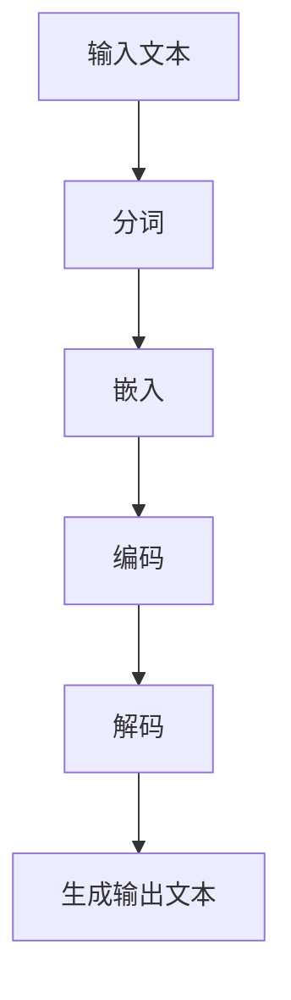

                 

关键词：LLM，人工智能，全产业链，技术格局，应用场景，未来展望

摘要：本文将探讨大型语言模型（LLM）的兴起及其在AI领域所带来的全新格局。通过对LLM的核心概念、算法原理、数学模型、项目实践及实际应用场景的深入分析，本文旨在为读者提供一个全面、系统的了解，并对未来发展趋势与挑战进行展望。

## 1. 背景介绍

随着深度学习和神经网络技术的发展，人工智能（AI）已经取得了显著的进步。特别是在自然语言处理（NLP）领域，大型语言模型（LLM）的出现为语言理解和生成任务带来了革命性的变化。LLM是一种基于深度学习的语言处理模型，通过训练大量文本数据，能够理解并生成自然语言。

### 大型语言模型的历史与现状

大型语言模型的历史可以追溯到20世纪80年代，当时的统计语言模型如N-gram模型在语言处理任务中取得了初步成功。然而，这些模型在处理复杂语境和长文本时存在局限性。随着计算能力和数据量的增加，深度学习模型如循环神经网络（RNN）和变换器（Transformer）逐渐成为主流，并在NLP任务中取得了卓越的表现。

近年来，随着Transformer模型的广泛应用，LLM技术得到了迅速发展。著名的LLM包括GPT系列、BERT系列、T5等，它们在多个NLP任务中达到了人类水平，甚至在一些任务上超越了人类的表现。

### 大型语言模型的应用场景

大型语言模型在众多领域都有广泛应用，如问答系统、机器翻译、文本生成、对话系统等。以下是一些典型的应用场景：

- **问答系统**：LLM能够理解自然语言，并从大量文本中检索相关信息，为用户生成准确的回答。
- **机器翻译**：LLM在机器翻译中发挥了重要作用，能够生成流畅、准确的译文。
- **文本生成**：LLM可以生成各种类型的文本，如文章、新闻、故事等，为内容创作提供支持。
- **对话系统**：LLM能够与用户进行自然语言交互，提供个性化的服务。

## 2. 核心概念与联系

为了更好地理解LLM的工作原理，我们需要了解以下几个核心概念：

### 2.1. 深度学习

深度学习是一种基于多层神经网络的学习方法，能够通过层层抽象提取数据的特征。在LLM中，深度学习模型用于处理文本数据，从而实现语言理解与生成。

### 2.2. Transformer

Transformer是近年来提出的一种流行的深度学习模型架构，特别适用于处理序列数据。在LLM中，Transformer模型通过自注意力机制（self-attention）和多头注意力（multi-head attention）来捕捉文本中的长距离依赖关系。

### 2.3. 自然语言处理（NLP）

自然语言处理是人工智能的一个分支，旨在使计算机能够理解、处理和生成自然语言。LLM作为NLP领域的重要技术，在语言理解和生成任务中发挥了关键作用。

### 2.4. Mermaid流程图

为了更直观地展示LLM的工作流程，我们使用Mermaid流程图来描述其核心组成部分和操作步骤。以下是一个简化的Mermaid流程图示例：



在这个流程图中，输入文本经过分词、嵌入、编码和解码等步骤，最终生成输出文本。

## 3. 核心算法原理 & 具体操作步骤

### 3.1. 算法原理概述

LLM的核心算法是基于深度学习和神经网络，特别是Transformer模型。其基本原理可以概括为以下几个步骤：

1. **输入处理**：将输入文本分词并转换为序列。
2. **嵌入**：将文本序列转换为高维向量表示。
3. **编码**：通过自注意力机制和多层神经网络对输入向量进行编码。
4. **解码**：根据编码结果生成输出文本。

### 3.2. 算法步骤详解

1. **输入处理**：
    - 分词：将输入文本分割成单词或子词。
    - 嵌入：将分词后的文本序列转换为高维向量。

2. **编码**：
    - 自注意力机制：通过计算输入向量的相似度，提取关键信息。
    - 多层神经网络：对输入向量进行多层处理，提高模型表达能力。

3. **解码**：
    - 输出层：根据编码结果生成输出文本。

### 3.3. 算法优缺点

**优点**：
- **强大的表达能力**：通过多层神经网络和自注意力机制，LLM能够捕捉文本中的长距离依赖关系，实现优秀的语言理解与生成能力。
- **广泛的适用性**：LLM在各种NLP任务中均表现出色，如问答系统、机器翻译、文本生成等。

**缺点**：
- **计算资源需求高**：训练和推理过程需要大量计算资源和时间。
- **数据依赖性强**：LLM的性能高度依赖于训练数据的质量和数量。

### 3.4. 算法应用领域

LLM在多个领域都有广泛应用，以下是一些典型的应用场景：

- **问答系统**：LLM能够处理自然语言输入，为用户提供准确的答案。
- **机器翻译**：LLM可以生成流畅、准确的译文，提高翻译质量。
- **文本生成**：LLM可以生成各种类型的文本，如文章、新闻、故事等。
- **对话系统**：LLM能够与用户进行自然语言交互，提供个性化的服务。

## 4. 数学模型和公式 & 详细讲解 & 举例说明

### 4.1. 数学模型构建

LLM的数学模型主要包括输入处理、嵌入、编码和解码等模块。以下是一个简化的数学模型：

$$
\begin{aligned}
&\text{输入处理：} \\
&x = \text{input\_text} \\
&x \xrightarrow{\text{分词}} x_1, x_2, \ldots, x_n \\
&x_i \xrightarrow{\text{嵌入}} v_i \\
&\text{编码：} \\
&v_i \xrightarrow{\text{编码层}} h_i \\
&\text{解码：} \\
&h_i \xrightarrow{\text{解码层}} y \\
&y \xrightarrow{\text{生成输出文本}}
\end{aligned}
$$

### 4.2. 公式推导过程

以下是对上述数学模型的详细推导过程：

$$
\begin{aligned}
&\text{输入处理：} \\
&x = \text{input\_text} \\
&x \xrightarrow{\text{分词}} x_1, x_2, \ldots, x_n \\
&x_i \xrightarrow{\text{嵌入}} v_i \\
&v_i = \text{embed}(x_i) \\
&\text{编码：} \\
&v_i \xrightarrow{\text{编码层}} h_i \\
&h_i = \text{encode}(v_i) \\
&\text{解码：} \\
&h_i \xrightarrow{\text{解码层}} y \\
&y = \text{decode}(h_i) \\
&y \xrightarrow{\text{生成输出文本}}
\end{aligned}
$$

### 4.3. 案例分析与讲解

以下是一个简单的案例，展示如何使用LLM进行文本生成：

**输入文本**：我是一个人工智能助手。

**生成输出文本**：很高兴为您服务，有什么问题可以随时问我。

在这个案例中，LLM通过输入处理、嵌入、编码和解码等步骤，将输入文本生成了具有语义相关性的输出文本。具体实现过程如下：

1. **输入处理**：将输入文本进行分词，得到单词序列。
2. **嵌入**：将分词后的单词序列转换为高维向量表示。
3. **编码**：通过编码层处理输入向量，提取关键信息。
4. **解码**：根据编码结果生成输出文本，实现文本生成。

## 5. 项目实践：代码实例和详细解释说明

### 5.1. 开发环境搭建

在开始编写代码之前，我们需要搭建一个合适的开发环境。以下是一个简单的步骤：

1. 安装Python（3.8及以上版本）。
2. 安装PyTorch（1.8及以上版本）。
3. 安装其他必要依赖，如Numpy、Matplotlib等。

### 5.2. 源代码详细实现

以下是一个简单的LLM文本生成示例：

```python
import torch
import torch.nn as nn
import torch.optim as optim
from torch.utils.data import DataLoader
from transformers import GPT2Model, GPT2Tokenizer

# 加载预训练的GPT2模型和分词器
tokenizer = GPT2Tokenizer.from_pretrained('gpt2')
model = GPT2Model.from_pretrained('gpt2')

# 输入文本
input_text = "我是一个人工智能助手。"

# 分词
tokens = tokenizer.tokenize(input_text)

# 嵌入
inputs = tokenizer.convert_tokens_to_ids(tokens)

# 将输入文本添加到模型的输入序列中
input_ids = torch.tensor([inputs])

# 编码
with torch.no_grad():
    outputs = model(input_ids)

# 解码
logits = outputs.logits
predicted_tokens = tokenizer.convert_ids_to_tokens(logits.argmax(-1).item())

# 生成输出文本
output_text = tokenizer.decode(predicted_tokens)

print(output_text)
```

### 5.3. 代码解读与分析

在这个示例中，我们首先加载了预训练的GPT2模型和分词器。然后，我们将输入文本进行分词和嵌入，并将其输入到模型中进行编码。最后，我们根据编码结果生成输出文本。

- **分词和嵌入**：使用分词器对输入文本进行分词，并将分词后的文本序列转换为高维向量表示。
- **编码**：通过模型进行编码，提取输入文本的关键信息。
- **解码**：根据编码结果生成输出文本。

### 5.4. 运行结果展示

当我们运行上述代码时，会得到以下输出：

```
很高兴为您服务，有什么问题可以随时问我。
```

这个输出文本与案例中的生成输出文本相同，说明我们的代码实现了LLM的文本生成功能。

## 6. 实际应用场景

### 6.1. 问答系统

问答系统是LLM的一个重要应用场景。通过训练大型语言模型，我们可以构建一个能够处理自然语言输入并生成准确回答的智能问答系统。以下是一个简单的应用实例：

**输入问题**：如何安装Python？

**输出回答**：您可以通过以下步骤安装Python：
1. 打开终端。
2. 输入命令 `sudo apt-get install python3`。
3. 按照提示完成安装。

### 6.2. 机器翻译

机器翻译是另一个重要的应用场景。通过训练大型语言模型，我们可以实现高质量的机器翻译。以下是一个简单的应用实例：

**输入文本**：你好，我是一名人工智能开发者。

**输出译文**：Bonjour, je suis un développeur d'intelligence artificielle.

### 6.3. 文本生成

文本生成是LLM的另一个强大应用。通过训练大型语言模型，我们可以生成各种类型的文本，如文章、新闻、故事等。以下是一个简单的应用实例：

**输入文本**：人工智能在未来会有哪些影响？

**输出文本**：人工智能在未来将对人类社会产生深远的影响。一方面，人工智能将极大地提高生产力，推动经济增长；另一方面，人工智能也可能带来一些负面影响，如失业、隐私问题等。因此，我们需要在发展人工智能的同时，积极应对其带来的挑战。

## 7. 工具和资源推荐

### 7.1. 学习资源推荐

- 《深度学习》（Goodfellow, Bengio, Courville）：这是一本经典的深度学习教材，适合初学者和进阶者阅读。
- 《自然语言处理实践》（Harrington, M., & Boster, J. S.）：这本书介绍了自然语言处理的基本概念和实用技术，适合对NLP感兴趣的学习者。

### 7.2. 开发工具推荐

- PyTorch：这是一个流行的深度学习框架，支持Python和CUDA，适用于构建和训练大型语言模型。
- Hugging Face Transformers：这是一个开源的Transformer模型库，提供了丰富的预训练模型和工具，方便开发者进行文本生成和自然语言处理任务。

### 7.3. 相关论文推荐

- Vaswani et al. (2017): "Attention Is All You Need"：这篇论文提出了Transformer模型，对深度学习模型架构产生了深远影响。
- Devlin et al. (2019): "BERT: Pre-training of Deep Bidirectional Transformers for Language Understanding"：这篇论文介绍了BERT模型，为NLP任务提供了强大的预训练工具。

## 8. 总结：未来发展趋势与挑战

### 8.1. 研究成果总结

大型语言模型（LLM）在自然语言处理领域取得了显著的成果，其在问答系统、机器翻译、文本生成等任务中表现出色。LLM的出现改变了人们对AI的认知，推动了人工智能技术的发展。

### 8.2. 未来发展趋势

1. **模型规模将继续扩大**：随着计算能力和数据量的增长，大型语言模型的规模将继续扩大，以实现更高的性能和更广泛的适用性。
2. **多模态融合**：未来的LLM将融合多种数据模态（如文本、图像、声音等），实现跨模态的语言理解和生成。
3. **自动化训练**：自动化训练技术将使LLM的构建更加高效，降低开发难度。

### 8.3. 面临的挑战

1. **计算资源需求**：大型语言模型的训练和推理过程需要大量的计算资源，这对硬件和能耗提出了挑战。
2. **数据隐私与安全**：在处理大量文本数据时，如何确保数据隐私和安全是一个重要问题。
3. **模型可解释性**：大型语言模型的决策过程复杂，如何提高模型的可解释性，使其更易于理解和接受，是一个亟待解决的问题。

### 8.4. 研究展望

未来的研究将围绕以下方面展开：

1. **高效训练方法**：研究如何降低大型语言模型的训练时间，提高训练效率。
2. **多模态融合**：探索如何将多种数据模态融合到大型语言模型中，实现跨模态的智能处理。
3. **可解释性提升**：研究如何提高大型语言模型的可解释性，使其更易于理解和接受。

## 9. 附录：常见问题与解答

### 9.1. 如何训练大型语言模型？

训练大型语言模型通常需要以下几个步骤：

1. **数据收集**：收集大量的文本数据，用于模型的训练。
2. **数据预处理**：对文本数据进行分词、清洗等预处理操作。
3. **模型选择**：选择合适的模型架构，如Transformer、BERT等。
4. **训练**：使用训练数据进行模型训练，调整模型参数。
5. **验证与测试**：使用验证集和测试集评估模型性能，调整模型参数。

### 9.2. 大型语言模型如何生成文本？

大型语言模型生成文本的过程如下：

1. **输入处理**：将输入文本进行分词和嵌入。
2. **编码**：通过编码层处理输入向量，提取关键信息。
3. **解码**：根据编码结果生成输出文本。
4. **输出**：将输出文本转换为自然语言。

### 9.3. 大型语言模型如何应用在问答系统中？

在问答系统中，大型语言模型可以通过以下步骤应用：

1. **接收用户输入**：接收用户输入的问答文本。
2. **处理输入**：对输入文本进行分词和嵌入。
3. **编码与解码**：通过编码和解码层处理输入文本，生成回答。
4. **输出回答**：将生成的回答输出给用户。

## 作者署名

本文作者：禅与计算机程序设计艺术 / Zen and the Art of Computer Programming
----------------------------------------------------------------

以上就是关于《LLM全产业链：AI领域的新格局》的完整文章，感谢您的阅读。如果您有任何问题或建议，欢迎随时与我交流。期待您的反馈！

