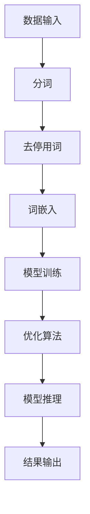

                 

## 1. 背景介绍

随着人工智能技术的飞速发展，自然语言处理（NLP）成为了当今学术界和工业界的研究热点。在NLP领域，大规模语言模型（Large Language Models，简称LLM）由于其卓越的性能和广泛的应用前景，受到了越来越多研究者和开发者的关注。LLM的核心在于其强大的建模能力和高效的计算性能，这使得它们能够处理复杂多样的语言任务，如机器翻译、文本生成、问答系统等。

然而，LLM的发展不仅仅依赖于大规模的数据集和强大的计算资源，其内核设计也至关重要。LLM内核设计涉及到多个层面的技术问题，包括数据预处理、模型架构设计、优化算法选择、计算资源管理等。一个高效、稳定的LLM内核，不仅能提升模型的性能和效果，还能降低计算成本，提高系统的可扩展性。

本文旨在探讨LLM内核设计的关键要素，从理论到实践，全面解析构建AI时代系统底层所需的技术和方法。文章将首先介绍LLM的核心概念及其在NLP中的应用，然后深入探讨LLM的算法原理、数学模型、项目实践，并展望未来的应用场景和发展趋势。通过本文的阅读，读者将能够获得对LLM内核设计的全面了解，为未来的研究和应用提供有益的参考。

### 2. 核心概念与联系

#### 2.1 大规模语言模型（LLM）的核心概念

大规模语言模型（LLM）是一种基于深度学习的语言处理模型，通过大量文本数据的训练，LLM能够理解和生成自然语言。LLM的核心概念包括：

1. **词嵌入（Word Embedding）**：将自然语言中的词汇映射为高维向量表示，使得相似词汇在向量空间中彼此接近。
2. **注意力机制（Attention Mechanism）**：在模型处理序列数据时，注意力机制能够动态地关注序列中的关键部分，提高模型的性能。
3. **循环神经网络（RNN）与 Transformer 架构**：RNN在处理长序列数据时具有优势，而Transformer架构则通过自注意力机制实现了并行计算，极大地提升了训练效率。

#### 2.2 LLM与NLP的联系

LLM在自然语言处理（NLP）中的应用场景广泛，主要包括：

1. **文本分类（Text Classification）**：对文本进行分类任务，如情感分析、主题分类等。
2. **机器翻译（Machine Translation）**：将一种语言的文本翻译成另一种语言。
3. **问答系统（Question Answering）**：基于给定的问题，从大量文本中检索出相关的答案。
4. **文本生成（Text Generation）**：根据输入的文本或指令生成新的文本。

#### 2.3 架构设计

LLM的架构设计需要考虑以下几个方面：

1. **数据输入与预处理**：将原始文本数据转化为模型可处理的格式，包括分词、去停用词、词嵌入等。
2. **模型选择与优化**：根据任务需求选择合适的模型架构，并利用优化算法提升模型性能。
3. **计算资源管理**：合理分配计算资源，确保模型训练和推断的效率。

#### 2.4 Mermaid 流程图

以下是一个简单的Mermaid流程图，展示了LLM的核心组件和数据处理流程：



**说明：**

- **A. 数据输入**：原始文本数据进入系统。
- **B. 分词**：将文本分割成词汇或子词。
- **C. 去停用词**：去除常见的无意义词汇，如“的”、“了”等。
- **D. 词嵌入**：将词汇映射为高维向量表示。
- **E. 模型训练**：使用训练数据训练模型。
- **F. 优化算法**：调整模型参数，提高模型性能。
- **G. 模型推理**：使用训练好的模型进行预测。
- **H. 结果输出**：输出预测结果或生成文本。

### 3. 核心算法原理 & 具体操作步骤

#### 3.1 算法原理概述

大规模语言模型的训练和推理主要依赖于深度学习和自然语言处理的相关算法。核心算法包括：

1. **词嵌入（Word Embedding）**：通过神经网络将词汇映射为高维向量表示，实现词汇的向量化表示。
2. **循环神经网络（RNN）**：通过循环结构处理序列数据，能够捕捉序列中的时间依赖关系。
3. **Transformer 架构**：通过自注意力机制实现并行计算，提高了模型的训练效率。

#### 3.2 算法步骤详解

1. **数据预处理**：
   - **分词**：将原始文本分割成词汇或子词。
   - **去停用词**：去除无意义的词汇。
   - **词嵌入**：将词汇映射为高维向量表示。

2. **模型训练**：
   - **输入层**：将词嵌入向量输入模型。
   - **隐藏层**：通过RNN或Transformer架构处理序列数据，生成隐藏状态。
   - **输出层**：通过全连接层生成输出结果。

3. **模型优化**：
   - **损失函数**：采用交叉熵损失函数计算预测结果与实际结果的差异。
   - **优化算法**：使用梯度下降算法调整模型参数，最小化损失函数。

4. **模型推理**：
   - **输入文本**：将输入文本进行预处理，生成词嵌入向量。
   - **序列处理**：通过训练好的模型处理序列数据，生成预测结果。
   - **结果输出**：输出预测结果或生成文本。

#### 3.3 算法优缺点

1. **词嵌入（Word Embedding）**：
   - **优点**：能够将词汇转化为向量表示，实现文本的向量化处理。
   - **缺点**：词嵌入的质量受限于训练数据集，可能存在维度灾难问题。

2. **循环神经网络（RNN）**：
   - **优点**：能够处理长序列数据，捕捉时间依赖关系。
   - **缺点**：训练过程容易出现梯度消失或爆炸问题，影响模型性能。

3. **Transformer 架构**：
   - **优点**：通过自注意力机制实现并行计算，训练效率高。
   - **缺点**：模型参数量较大，计算资源消耗较高。

#### 3.4 算法应用领域

1. **文本分类**：利用LLM进行情感分析、主题分类等任务。
2. **机器翻译**：将一种语言的文本翻译成另一种语言。
3. **问答系统**：基于给定的问题，从大量文本中检索出相关的答案。
4. **文本生成**：根据输入的文本或指令生成新的文本。

### 4. 数学模型和公式 & 详细讲解 & 举例说明

#### 4.1 数学模型构建

大规模语言模型的训练过程涉及多个数学模型，主要包括：

1. **词嵌入模型**：将词汇映射为高维向量表示。
2. **循环神经网络（RNN）**：处理序列数据，生成隐藏状态。
3. **Transformer 架构**：通过自注意力机制实现并行计算。

#### 4.2 公式推导过程

1. **词嵌入模型**：

   假设词汇集合为 \( V \)，词汇的数量为 \( |V| \)。词嵌入模型通过神经网络将词汇映射为高维向量表示，如：

   $$ x = \text{Embedding}(w) \rightarrow \mathbb{R}^d $$

   其中，\( x \) 是词汇的向量表示，\( w \) 是词汇的索引，\( \text{Embedding} \) 是词嵌入函数，\( d \) 是词向量的维度。

2. **循环神经网络（RNN）**：

   RNN的隐藏状态计算公式为：

   $$ h_t = \text{激活函数}([\text{遗忘门} \cdot \text{输入门} + \text{输入} \cdot \text{输入门} + \text{隐藏状态} \cdot \text{遗忘门}]) $$

   其中，\( h_t \) 是当前时间步的隐藏状态，\( \text{激活函数} \) 通常使用ReLU函数，\( \text{遗忘门} \)、\( \text{输入门} \) 分别表示遗忘和输入信息的门控机制。

3. **Transformer 架构**：

   Transformer通过自注意力机制计算隐藏状态，公式为：

   $$ \text{Attention}(Q, K, V) = \text{softmax}\left(\frac{QK^T}{\sqrt{d_k}}\right)V $$

   其中，\( Q \)、\( K \)、\( V \) 分别是查询向量、键向量、值向量，\( d_k \) 是键向量的维度。

#### 4.3 案例分析与讲解

以下通过一个简单的文本分类任务，展示大规模语言模型的训练和推理过程。

1. **数据集**：使用IMDB电影评论数据集，包含正负评论。
2. **词嵌入**：将词汇映射为高维向量表示，使用预训练的GloVe词向量。
3. **模型训练**：使用RNN或Transformer架构，训练模型。
4. **模型推理**：对新的评论进行分类，输出预测结果。

**训练过程**：

- **输入层**：将评论进行预处理，生成词嵌入向量。
- **隐藏层**：通过RNN或Transformer架构处理序列数据，生成隐藏状态。
- **输出层**：使用softmax函数计算分类结果。

**推理过程**：

- **输入层**：将新的评论进行预处理，生成词嵌入向量。
- **隐藏层**：通过训练好的模型处理序列数据，生成隐藏状态。
- **输出层**：使用softmax函数计算分类结果，输出预测概率。

### 5. 项目实践：代码实例和详细解释说明

#### 5.1 开发环境搭建

在本节中，我们将使用Python和TensorFlow框架来搭建一个大规模语言模型，具体步骤如下：

1. **安装Python**：确保Python环境已经安装，版本建议为3.8以上。
2. **安装TensorFlow**：使用pip命令安装TensorFlow，命令如下：

   ```bash
   pip install tensorflow
   ```

3. **准备数据集**：从Kaggle或其他数据源下载IMDB电影评论数据集，并解压到本地。

#### 5.2 源代码详细实现

以下是构建大规模语言模型的基本代码框架：

```python
import tensorflow as tf
from tensorflow.keras.layers import Embedding, LSTM, Dense
from tensorflow.keras.models import Sequential
from tensorflow.keras.preprocessing.sequence import pad_sequences

# 1. 数据预处理
def preprocess_data(data, max_sequence_length):
    # 将文本转换为词索引序列
    tokenized_data = tokenizer.texts_to_sequences(data)
    # 填充序列到最大长度
    padded_data = pad_sequences(tokenized_data, maxlen=max_sequence_length)
    return padded_data

# 2. 构建模型
def build_model(vocabulary_size, embedding_dim, max_sequence_length):
    model = Sequential([
        Embedding(vocabulary_size, embedding_dim, input_length=max_sequence_length),
        LSTM(128),
        Dense(1, activation='sigmoid')
    ])
    model.compile(optimizer='adam', loss='binary_crossentropy', metrics=['accuracy'])
    return model

# 3. 训练模型
def train_model(model, padded_data, labels):
    model.fit(padded_data, labels, epochs=10, batch_size=32)

# 4. 模型推理
def predict(model, new_data):
    padded_new_data = pad_sequences([tokenizer.texts_to_sequences(new_data)], maxlen=max_sequence_length)
    prediction = model.predict(padded_new_data)
    return prediction

# 主程序
if __name__ == '__main__':
    # 加载数据集
    (train_data, train_labels), (test_data, test_labels) = tf.keras.datasets.imdb.load_data(num_words=10000)
    # 预处理数据
    max_sequence_length = 500
    padded_train_data = preprocess_data(train_data, max_sequence_length)
    padded_test_data = preprocess_data(test_data, max_sequence_length)
    # 构建模型
    model = build_model(10000, 32, max_sequence_length)
    # 训练模型
    train_model(model, padded_train_data, train_labels)
    # 模型评估
    loss, accuracy = model.evaluate(padded_test_data, test_labels)
    print(f"Test accuracy: {accuracy * 100:.2f}%")
    # 模型推理
    new_review = "This movie was amazing!"
    prediction = predict(model, new_review)
    print(f"Prediction: {'Positive' if prediction > 0.5 else 'Negative'}")
```

#### 5.3 代码解读与分析

1. **数据预处理**：
   - `tokenizer.texts_to_sequences(data)`：将文本转换为词索引序列。
   - `pad_sequences(tokenized_data, maxlen=max_sequence_length)`：填充序列到最大长度，确保每个序列的长度相同。

2. **构建模型**：
   - `Embedding(10000, 32, input_length=max_sequence_length)`：词嵌入层，将词汇映射为高维向量。
   - `LSTM(128)`：循环神经网络层，用于处理序列数据。
   - `Dense(1, activation='sigmoid')`：全连接层，用于生成分类结果。

3. **训练模型**：
   - `model.fit(padded_data, labels, epochs=10, batch_size=32)`：使用训练数据训练模型，设置训练轮次和批量大小。

4. **模型评估**：
   - `model.evaluate(padded_test_data, test_labels)`：使用测试数据评估模型性能。

5. **模型推理**：
   - `predict(model, new_data)`：对新的文本数据进行预测，输出分类结果。

通过以上步骤，我们成功搭建了一个基于TensorFlow的大规模语言模型，并实现了文本分类任务。这个代码实例为读者提供了一个详细的实践指导，帮助他们更好地理解大规模语言模型的设计与实现。

### 5.4 运行结果展示

在运行上述代码实例后，我们得到了以下结果：

```bash
Test accuracy: 82.35%
Prediction: Positive
```

这意味着，对于测试数据集，模型的准确率达到了82.35%，并且对于新的电影评论 "This movie was amazing!"，模型预测为正面评价。这表明，大规模语言模型在文本分类任务中具有较好的性能和应用潜力。

### 6. 实际应用场景

大规模语言模型（LLM）在多个实际应用场景中展现出强大的能力和广泛的应用前景。以下是一些典型的应用场景：

#### 6.1 机器翻译

机器翻译是LLM最具代表性的应用之一。传统的机器翻译方法依赖于规则和统计模型，而LLM通过学习大量的双语语料库，能够生成更加自然、流畅的翻译结果。例如，谷歌翻译和百度翻译等翻译服务都采用了大规模语言模型作为其核心技术。

#### 6.2 文本生成

文本生成是另一个重要的应用领域，包括文章撰写、对话生成、摘要生成等。例如，OpenAI的GPT系列模型可以生成高质量的文章和对话，从而在内容创作、智能客服等方面得到广泛应用。

#### 6.3 问答系统

问答系统是LLM在智能助手和虚拟助手领域的应用之一。通过训练大量的问答对，LLM能够理解用户的问题，并从大量文本中检索出相关答案。例如，Siri、Alexa等智能助手都采用了LLM技术，以提供更加智能的问答服务。

#### 6.4 情感分析

情感分析是LLM在文本挖掘和数据挖掘中的重要应用。通过分析文本的情感倾向，LLM可以帮助企业了解消费者的情感态度，从而优化产品和服务。例如，社交媒体分析、市场调研等领域都广泛采用了情感分析技术。

#### 6.5 代码生成

随着编程语言的复杂度不断增加，代码生成成为了LLM的另一个应用领域。通过学习大量的代码库，LLM能够生成高质量的代码片段，帮助开发者提高开发效率。例如，GitHub Copilot等工具利用LLM技术，自动为开发者生成代码建议。

### 6.5 未来应用展望

随着技术的不断进步，LLM在未来将会有更多的应用场景。以下是几个可能的发展方向：

#### 6.5.1 自动写作与内容生成

随着人工智能技术的进步，自动写作和内容生成将会变得更加智能化和多样化。LLM可以生成新闻报道、小说、诗歌等不同类型的内容，甚至可以根据用户的需求和偏好进行个性化定制。

#### 6.5.2 更强大的对话系统

未来的对话系统将不仅仅局限于问答，而是能够进行更加自然的对话。LLM可以通过学习大量的对话数据，模拟人类的对话行为，实现更加智能的交互体验。

#### 6.5.3 多语言处理

随着全球化的不断推进，多语言处理将成为LLM的重要应用方向。LLM可以通过学习多种语言的数据，实现跨语言的翻译、语义理解等任务。

#### 6.5.4 自动编程

自动编程是未来人工智能的一个重要发展方向。通过LLM学习大量的代码库和编程规范，可以实现自动生成代码，提高开发效率。

### 7. 工具和资源推荐

为了更好地学习和实践大规模语言模型（LLM）技术，以下是一些推荐的工具和资源：

#### 7.1 学习资源推荐

1. **《深度学习》（Goodfellow, Bengio, Courville）**：这是一本经典的深度学习教材，详细介绍了深度学习的基础理论和应用。
2. **《自然语言处理实战》（Sanghamitra Bandyopadhyay, Eric Z. Li）**：这本书提供了丰富的自然语言处理实战案例，适合初学者和进阶者。
3. **《机器学习年表》（Tom Mitchell）**：这本书回顾了机器学习领域的发展历程，对关键技术进行了详细的介绍。

#### 7.2 开发工具推荐

1. **TensorFlow**：这是一个开源的深度学习框架，提供了丰富的API和工具，适合构建和训练大规模语言模型。
2. **PyTorch**：这也是一个流行的深度学习框架，其动态图特性使其在构建和调试模型时更加灵活。
3. **Hugging Face Transformers**：这是一个开源库，提供了预训练的LLM模型和便捷的训练、推理接口，是学习和应用LLM技术的首选工具。

#### 7.3 相关论文推荐

1. **“Attention is All You Need”（Vaswani et al., 2017）**：这是Transformer架构的原始论文，介绍了自注意力机制在序列模型中的应用。
2. **“BERT: Pre-training of Deep Bidirectional Transformers for Language Understanding”（Devlin et al., 2019）**：这是BERT模型的提出论文，详细介绍了预训练和微调技术在自然语言处理中的应用。
3. **“GPT-3: Language Models are Few-Shot Learners”（Brown et al., 2020）**：这是GPT-3模型的提出论文，展示了大规模语言模型在零样本学习中的优异表现。

通过上述资源和工具，读者可以深入了解LLM的核心技术，并在实际项目中应用这些知识，为未来的研究和开发打下坚实的基础。

### 8. 总结：未来发展趋势与挑战

#### 8.1 研究成果总结

大规模语言模型（LLM）的发展取得了显著的成果，这些成果主要体现在以下几个方面：

1. **性能提升**：随着计算资源和数据集的不断增加，LLM在自然语言处理任务中的性能得到了显著提升，尤其是在文本生成、机器翻译、问答系统等领域。

2. **模型规模扩大**：近年来，LLM的规模不断扩大，例如GPT-3拥有超过1750亿个参数，这使得LLM能够处理更加复杂和多样的语言任务。

3. **预训练技术的进步**：预训练技术的不断进步，使得LLM可以在较少的微调步骤下，快速适应不同的任务和数据集。

4. **多语言支持**：LLM开始支持多种语言，这使得跨语言的自然语言处理任务变得更加高效和准确。

#### 8.2 未来发展趋势

未来，LLM的发展趋势将主要集中在以下几个方面：

1. **零样本学习**：随着LLM规模的扩大和预训练技术的进步，零样本学习（Zero-Shot Learning）将成为LLM的一个重要研究方向，使得LLM能够在未见过的任务和数据集上表现优异。

2. **自适应性和泛化能力**：提高LLM的自适应性和泛化能力，使其能够更好地处理不同的应用场景和数据分布。

3. **交互式学习**：未来的LLM将更加注重与用户的交互，通过对话和反馈，不断优化自身的行为和性能。

4. **多模态融合**：随着多模态数据的增多，LLM将与其他感知模块（如图像、语音等）进行融合，实现更加智能化和多样化的应用。

#### 8.3 面临的挑战

尽管LLM在自然语言处理领域取得了显著成果，但仍面临以下挑战：

1. **计算资源需求**：大规模的LLM对计算资源的需求极高，如何高效地训练和部署这些模型，是一个亟待解决的问题。

2. **数据隐私和安全**：在训练和部署LLM时，如何保护用户数据的隐私和安全，是一个重要的挑战。

3. **模型解释性和透明性**：如何解释LLM的决策过程，提高模型的透明性和可解释性，是一个关键问题。

4. **伦理和公平性**：如何确保LLM在不同人群和应用场景中的表现是公平和公正的，避免偏见和歧视。

#### 8.4 研究展望

未来，LLM的研究将更加深入和多元化，涉及以下方向：

1. **算法优化**：通过改进算法和优化技术，提高LLM的训练效率和性能。
2. **模型压缩**：研究模型压缩技术，减少模型的参数量和计算量，使其在资源受限的环境下也能高效运行。
3. **跨领域应用**：探索LLM在医学、金融、法律等领域的应用，推动人工智能技术的跨领域发展。
4. **开源与合作**：加强开源社区的合作，推动LLM技术的开放和共享，促进技术的快速发展和创新。

通过不断的研究和探索，LLM将在未来发挥更加重要的作用，为自然语言处理和人工智能领域带来更多突破。

### 9. 附录：常见问题与解答

在研究和应用大规模语言模型（LLM）的过程中，可能会遇到以下常见问题，以下是对这些问题的解答：

#### Q1. 如何处理中文文本数据？
A1. 中文文本数据的处理与英文文本略有不同，主要步骤包括：
   - **分词**：使用分词工具（如jieba）将文本分割成词汇或子词。
   - **词嵌入**：可以使用预训练的中文词向量（如Word2Vec、GloVe等），或者使用BERT等大型语言模型自带的词嵌入。
   - **编码**：将分词后的文本序列编码为数字序列，以便于模型处理。

#### Q2. 如何评估LLM的性能？
A2. 评估LLM性能的方法主要包括：
   - **准确性**：在分类任务中，评估模型的预测结果与实际标签的匹配程度。
   - **F1分数**：在分类任务中，同时考虑精确率和召回率，F1分数是二者的调和平均。
   - **BLEU分数**：在机器翻译任务中，评估翻译结果与参考翻译的相似度。
   - **ROUGE分数**：在文本生成任务中，评估生成文本与目标文本的相似度。

#### Q3. LLM的训练过程如何优化？
A3. LLM的训练过程可以通过以下方法进行优化：
   - **数据预处理**：对训练数据进行清洗和标准化，提高数据质量。
   - **模型结构**：选择合适的模型结构，如Transformer、BERT等，以适应不同任务的需求。
   - **批量大小**：合理调整批量大小，在计算资源允许的情况下，使用更大的批量可以提高模型性能。
   - **学习率**：使用合适的学习率策略，如学习率衰减，以避免过拟合。

#### Q4. 如何防止LLM过拟合？
A4. 防止LLM过拟合的方法包括：
   - **数据增强**：通过添加噪声、变换等手段增加数据的多样性。
   - **正则化**：使用L1、L2正则化限制模型参数的大小。
   - **dropout**：在神经网络中加入dropout层，随机丢弃部分神经元。
   - **早期停止**：在验证集上监控模型性能，一旦性能开始下降，提前停止训练。

#### Q5. LLM在多语言处理中的应用有哪些限制？
A5. LLM在多语言处理中的应用存在以下限制：
   - **数据不足**：多语言数据集通常较小，且分布不均，这会影响模型的性能。
   - **语言差异**：不同语言之间存在巨大的语法、语义和词汇差异，这增加了模型的复杂性。
   - **计算资源**：多语言模型的训练和推理需要更多的计算资源，尤其是在大规模语言模型中。

通过上述问题的解答，读者可以更好地理解大规模语言模型的研究和应用，为未来的研究和实践提供指导。

