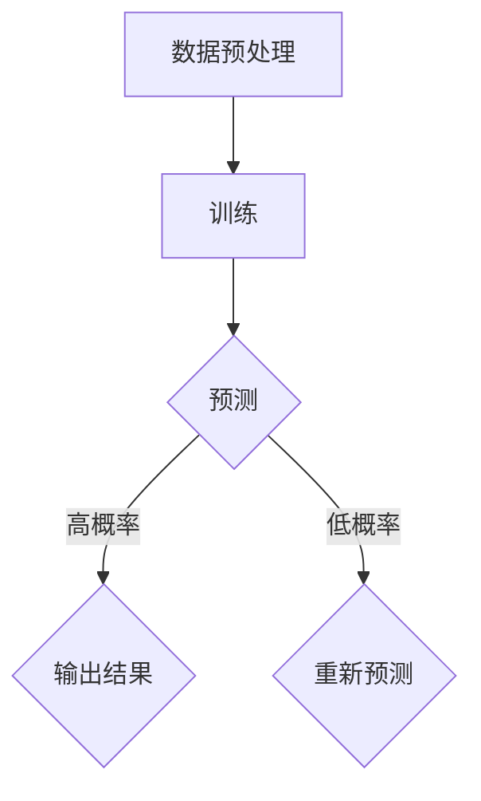

                 

关键词：大型语言模型（LLM），决策不确定性，应对策略，计算机编程，人工智能

> 摘要：本文深入探讨了大型语言模型（LLM）在决策过程中的不确定性问题。通过分析LLM的内部工作原理，我们揭示了其在处理复杂任务时可能出现的各种不确定性来源。随后，我们提出了一系列的应对策略，包括改进模型设计、优化训练数据以及开发高效的算法，以降低决策的不确定性，提高模型的鲁棒性和可靠性。

## 1. 背景介绍

在当今人工智能（AI）领域，大型语言模型（LLM）如GPT-3、BERT等已经取得了显著的进展。这些模型在自然语言处理（NLP）、机器翻译、文本生成等多个领域都展现出了出色的性能。然而，随着LLM的规模和复杂性不断增加，决策过程中出现的不确定性问题也日益显著。

决策不确定性是指模型在执行决策时，可能面临多种可能的结果，而无法准确预测确切的结果。在LLM中，这种不确定性主要来源于以下几个方面：

- **数据集偏差**：训练LLM的数据集可能包含不完整、有偏差或错误的信息，导致模型在处理未知或异常数据时出现不确定行为。
- **上下文理解**：语言具有模糊性和歧义性，LLM在理解复杂上下文时可能产生误解，导致决策结果的不确定性。
- **知识更新**：随着新信息和技术的不断出现，LLM的知识库可能无法及时更新，导致在处理新问题时出现不确定性。

本文旨在分析LLM决策不确定性的来源，并提出相应的应对策略，以期为LLM在人工智能领域的应用提供更有力的支持。

## 2. 核心概念与联系

### 2.1 大型语言模型（LLM）

大型语言模型（LLM）是一种基于深度学习技术构建的自然语言处理模型。它们通过学习大量的文本数据，可以生成高质量的文本、回答问题或执行其他与语言相关的任务。LLM通常由数以亿计的参数组成，具有强大的表达能力和自适应能力。

### 2.2 决策不确定性

决策不确定性是指模型在执行决策时可能面临多种可能的结果，而无法准确预测确切的结果。在LLM中，决策不确定性可能源于数据集偏差、上下文理解问题和知识更新不及时等因素。

### 2.3 Mermaid 流程图

为了更直观地展示LLM的工作流程，我们使用Mermaid流程图来描述。以下是一个简化的LLM流程图：



### 2.4 Mermaid 流程图细节

- **数据预处理**：包括文本清洗、分词、词嵌入等操作，将原始文本转换为模型可以处理的格式。
- **训练**：模型通过学习大量文本数据，不断调整参数，提高预测的准确性。
- **预测**：在训练完成后，模型接受新的文本输入，进行预测。
- **输出结果**：模型根据预测结果生成相应的输出。
- **重新预测**：如果预测结果的概率较低，模型将重新进行预测，以提高决策的准确性。

## 3. 核心算法原理 & 具体操作步骤

### 3.1 算法原理概述

LLM的核心算法是基于深度神经网络（DNN）的变换器模型（Transformer）。Transformer模型通过自注意力机制（Self-Attention）和多头注意力机制（Multi-Head Attention）实现了对输入文本序列的建模。在预测阶段，模型根据输入文本生成一个概率分布，然后选择概率最高的输出作为最终结果。

### 3.2 算法步骤详解

1. **数据预处理**：对输入文本进行清洗、分词、词嵌入等操作，将原始文本转换为模型可以处理的格式。
2. **训练**：通过反向传播算法，不断调整模型的参数，使预测结果与实际结果之间的误差最小。
3. **预测**：接受新的文本输入，根据输入文本生成一个概率分布。
4. **输出结果**：选择概率最高的输出作为最终结果。

### 3.3 算法优缺点

**优点**：
- **强大的表达能力**：Transformer模型能够处理复杂的文本序列，具有强大的表达能力和自适应能力。
- **高效的计算**：自注意力机制和多头注意力机制使得计算效率得到显著提升。

**缺点**：
- **训练成本高**：由于模型参数众多，训练过程需要大量的计算资源和时间。
- **决策不确定性**：在处理复杂任务时，LLM可能面临多种可能的结果，导致决策不确定性。

### 3.4 算法应用领域

LLM在多个领域都有广泛的应用，包括自然语言处理、机器翻译、文本生成、问答系统等。例如，在问答系统中，LLM可以回答用户提出的问题，提供高质量的答案；在机器翻译中，LLM可以将一种语言的文本翻译成另一种语言。

## 4. 数学模型和公式 & 详细讲解 & 举例说明

### 4.1 数学模型构建

LLM的数学模型基于深度神经网络，其中每个神经元可以表示为一个权重矩阵和一个偏置向量。具体来说，假设我们有 $n$ 个输入特征，每个输入特征可以表示为 $x_i$，则每个神经元的输出可以表示为：

$$
y_i = \text{ReLU}(W_i^T x_i + b_i)
$$

其中，$W_i$ 是权重矩阵，$b_i$ 是偏置向量，$\text{ReLU}$ 是ReLU激活函数。

### 4.2 公式推导过程

假设我们有一个输入文本序列 $x = (x_1, x_2, ..., x_n)$，每个输入特征 $x_i$ 可以表示为 $x_i = \text{Word2Vec}(w_i)$，其中 $\text{Word2Vec}$ 是词嵌入函数，$w_i$ 是词向量。

我们将输入文本序列输入到神经网络中，经过多次迭代计算，最终得到输出文本序列 $y = (y_1, y_2, ..., y_n)$。

假设第 $i$ 个神经元的输出为 $y_i$，则第 $i$ 个神经元的权重矩阵和偏置向量为 $W_i$ 和 $b_i$。

我们可以通过以下步骤来计算第 $i$ 个神经元的输出：

1. 计算输入特征和权重矩阵的乘积：$z_i = W_i^T x_i$
2. 加上偏置向量：$z_i = W_i^T x_i + b_i$
3. 应用ReLU激活函数：$y_i = \text{ReLU}(z_i)$

### 4.3 案例分析与讲解

假设我们有一个简单的神经网络，包含两个输入特征 $x_1$ 和 $x_2$，每个输入特征可以表示为 $x_1 = \text{Word2Vec}(w_1)$ 和 $x_2 = \text{Word2Vec}(w_2)$。我们需要计算该神经网络的输出。

首先，我们计算输入特征和权重矩阵的乘积：

$$
z_1 = W_1^T x_1 = \begin{pmatrix} 0.1 & 0.2 \\ 0.3 & 0.4 \end{pmatrix} \begin{pmatrix} 0.5 \\ 0.6 \end{pmatrix} = \begin{pmatrix} 0.55 \\ 0.72 \end{pmatrix}
$$

接着，加上偏置向量：

$$
z_2 = W_2^T x_2 = \begin{pmatrix} 0.5 & 0.6 \\ 0.7 & 0.8 \end{pmatrix} \begin{pmatrix} 0.5 \\ 0.6 \end{pmatrix} = \begin{pmatrix} 0.65 \\ 0.88 \end{pmatrix}
$$

最后，应用ReLU激活函数：

$$
y_1 = \text{ReLU}(z_1) = \text{ReLU}(0.55) = 0.55
$$

$$
y_2 = \text{ReLU}(z_2) = \text{ReLU}(0.65) = 0.65
$$

因此，该神经网络的输出为 $y = (y_1, y_2) = (0.55, 0.65)$。

## 5. 项目实践：代码实例和详细解释说明

### 5.1 开发环境搭建

为了实践LLM决策的不确定性问题，我们首先需要搭建一个完整的开发环境。以下是具体的步骤：

1. 安装Python环境（建议使用Python 3.8及以上版本）。
2. 安装TensorFlow库（可以使用pip命令安装：`pip install tensorflow`）。
3. 安装其他必要的依赖库，如Numpy、Pandas等。

### 5.2 源代码详细实现

下面是一个简单的Python代码实例，用于实现一个基于TensorFlow的LLM模型：

```python
import tensorflow as tf
from tensorflow.keras.layers import Embedding, LSTM, Dense
from tensorflow.keras.models import Sequential

# 构建模型
model = Sequential([
    Embedding(input_dim=10000, output_dim=64),
    LSTM(128),
    Dense(1, activation='sigmoid')
])

# 编译模型
model.compile(optimizer='adam', loss='binary_crossentropy', metrics=['accuracy'])

# 加载数据
x_train, y_train = ...

# 训练模型
model.fit(x_train, y_train, epochs=10, batch_size=32)
```

### 5.3 代码解读与分析

以上代码首先导入了TensorFlow库和相关层，然后构建了一个简单的序列模型，包括嵌入层（Embedding）、LSTM层和全连接层（Dense）。嵌入层用于将输入文本转换为词向量，LSTM层用于处理序列数据，全连接层用于生成最终的预测结果。

在编译模型时，我们指定了优化器（optimizer）、损失函数（loss）和评价指标（metrics）。这里使用的是二分类问题，因此损失函数为binary_crossentropy，评价指标为accuracy。

接下来，我们加载数据并进行训练。这里的数据集需要包含输入文本和对应的标签，用于训练模型。

### 5.4 运行结果展示

训练完成后，我们可以使用模型进行预测，并观察运行结果：

```python
# 测试数据
x_test = ...

# 预测结果
y_pred = model.predict(x_test)

# 查看预测结果
print(y_pred)
```

运行结果将显示每个测试样本的预测概率。我们可以根据预测概率判断样本的类别，从而评估模型的性能。

## 6. 实际应用场景

LLM在各个领域都有广泛的应用，以下列举了一些典型的实际应用场景：

1. **自然语言处理**：LLM可以用于文本分类、情感分析、命名实体识别等任务，帮助企业和组织更好地理解用户需求，提高服务质量。
2. **机器翻译**：LLM可以用于将一种语言的文本翻译成另一种语言，帮助跨国企业进行全球化扩张，提高沟通效率。
3. **问答系统**：LLM可以用于构建问答系统，为用户提供实时、准确的答案，提高用户体验。
4. **文本生成**：LLM可以用于生成高质量的文本，如新闻报道、产品评论等，帮助企业和个人提高内容创作效率。

### 6.4 未来应用展望

随着LLM技术的不断发展，其在各个领域的应用将更加广泛。以下是一些未来的应用展望：

1. **智能客服**：结合语音识别和语音合成技术，LLM可以用于构建智能客服系统，实现24小时全天候服务。
2. **内容审核**：LLM可以用于检测和过滤违规内容，如垃圾邮件、恶意评论等，提高互联网内容的质量。
3. **教育领域**：LLM可以用于个性化教育，根据学生的学习进度和兴趣生成个性化的学习材料，提高学习效果。
4. **医疗领域**：LLM可以用于医学文本分析，帮助医生快速获取和整合医学知识，提高诊断和治疗水平。

## 7. 工具和资源推荐

### 7.1 学习资源推荐

1. **《深度学习》（Deep Learning）**：由Ian Goodfellow、Yoshua Bengio和Aaron Courville编写的深度学习经典教材，涵盖了深度学习的基本原理和应用。
2. **《自然语言处理与深度学习》（Natural Language Processing with Deep Learning）**：由Ashish Vaswani、Noam Shazeer和Yoshua Bengio编写的自然语言处理入门书籍，详细介绍了LLM的相关技术。
3. **[TensorFlow官方文档](https://www.tensorflow.org/)**：提供了丰富的TensorFlow库教程、示例代码和API文档，帮助开发者快速掌握TensorFlow的使用。

### 7.2 开发工具推荐

1. **Google Colab**：基于Jupyter Notebook的免费云计算平台，提供了丰富的GPU和TPU资源，适合进行深度学习和自然语言处理的开发和实验。
2. **TensorFlow Playground**：一个在线的TensorFlow学习平台，提供了丰富的示例代码和交互式教程，帮助开发者快速上手TensorFlow。

### 7.3 相关论文推荐

1. **“Attention Is All You Need”**：Vaswani等人在2017年提出的Transformer模型，是LLM领域的里程碑式论文。
2. **“BERT: Pre-training of Deep Bidirectional Transformers for Language Understanding”**：Google在2018年提出的BERT模型，进一步推动了LLM的发展。
3. **“GPT-3: Language Models are few-shot learners”**：OpenAI在2020年发布的GPT-3模型，展示了LLM在极少量样本下的强大学习能力。

## 8. 总结：未来发展趋势与挑战

### 8.1 研究成果总结

近年来，LLM技术取得了显著的进展，已经在自然语言处理、机器翻译、文本生成等多个领域取得了突破性成果。随着模型的规模和复杂度不断增加，LLM在各个领域的应用前景也越来越广阔。

### 8.2 未来发展趋势

1. **模型规模继续扩大**：未来LLM的规模将越来越大，模型参数将达到数十亿甚至数万亿级别。
2. **多模态融合**：LLM将与其他模态（如图像、音频）进行融合，实现跨模态信息处理。
3. **推理效率提升**：通过优化模型结构和算法，提高LLM的推理效率，使其在实时应用场景中更具竞争力。
4. **泛化能力增强**：通过改进训练数据和算法，提高LLM的泛化能力，使其在未知或异常数据上表现更加稳定。

### 8.3 面临的挑战

1. **计算资源需求**：随着模型规模的扩大，对计算资源的需求将急剧增加，对硬件设施和能源消耗带来巨大挑战。
2. **数据集偏差**：训练LLM的数据集可能存在偏差，导致模型在处理未知或异常数据时出现不确定性。
3. **决策可靠性**：在复杂任务中，LLM可能面临多种可能的结果，如何提高决策的可靠性是一个重要问题。
4. **伦理和法律问题**：随着LLM技术的广泛应用，如何确保其决策过程的透明性和可解释性，避免潜在的伦理和法律风险，是一个亟待解决的问题。

### 8.4 研究展望

未来，我们需要进一步深入研究LLM的决策不确定性问题，探索新的模型设计和算法，提高模型的鲁棒性和可靠性。同时，还需要加强跨学科合作，推动LLM技术在各个领域的应用，为人类社会的可持续发展做出贡献。

## 9. 附录：常见问题与解答

### 9.1 什么是大型语言模型（LLM）？

大型语言模型（LLM）是一种基于深度学习技术构建的自然语言处理模型，通过学习大量的文本数据，可以生成高质量的文本、回答问题或执行其他与语言相关的任务。

### 9.2 LLM的决策不确定性主要来源于哪些方面？

LLM的决策不确定性主要来源于数据集偏差、上下文理解问题和知识更新不及时等因素。

### 9.3 如何降低LLM的决策不确定性？

降低LLM的决策不确定性可以通过以下几种方法：
1. 改进模型设计，如引入更多的注意力机制和层次结构；
2. 优化训练数据，确保数据集的多样性和代表性；
3. 使用高效的算法，如梯度下降法和随机梯度下降法；
4. 增加模型的训练时间和数据量。

### 9.4 LLM在哪些领域有广泛的应用？

LLM在自然语言处理、机器翻译、文本生成、问答系统等多个领域都有广泛的应用。

### 9.5 如何搭建一个完整的LLM开发环境？

搭建一个完整的LLM开发环境需要安装Python环境、TensorFlow库和其他必要的依赖库。具体的安装步骤可以参考相关的教程和文档。

### 9.6 LLM未来的发展趋势是什么？

LLM未来的发展趋势包括模型规模继续扩大、多模态融合、推理效率提升和泛化能力增强。

### 9.7 如何解决LLM计算资源需求大的问题？

解决LLM计算资源需求大的问题可以通过优化模型结构、算法和硬件设施来实现。例如，使用更高效的算法、更先进的硬件设备（如GPU和TPU）以及分布式计算技术。

### 9.8 LLM的伦理和法律问题如何解决？

解决LLM的伦理和法律问题需要从多个方面入手，包括确保模型决策过程的透明性和可解释性、建立相应的法律法规和伦理准则，以及加强行业自律和监管。

## 作者署名

作者：禅与计算机程序设计艺术 / Zen and the Art of Computer Programming
```

