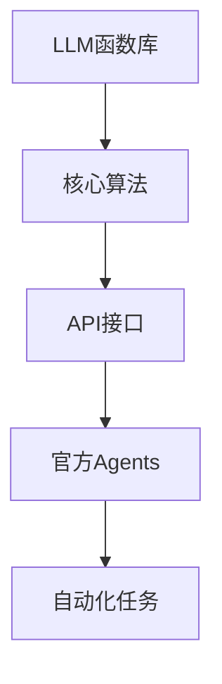
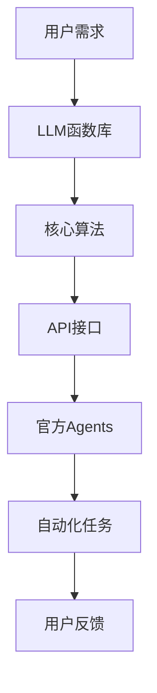

                 

关键词：大型语言模型(LLM),函数库，官方Agents，智能交互，自动化，云计算，分布式计算，人工智能，程序设计，软件开发

> 摘要：本文将深入探讨LLM函数库的核心概念，特别是官方Agents的兴起与其重要性。我们将从背景介绍、核心概念与联系、核心算法原理、数学模型、项目实践以及未来应用展望等多个维度展开论述，旨在为读者提供全面的技术解读和实用指导。

## 1. 背景介绍

在过去的几年里，人工智能（AI）技术取得了显著的进展，特别是大型语言模型（LLM）的崛起。LLM如GPT-3、BERT等，凭借其强大的文本生成和处理能力，已经在众多领域显示出其巨大的潜力。然而，随着LLM的广泛应用，如何有效地管理和利用这些模型成为一个关键问题。LLM函数库的提出，正是为了解决这一问题。

官方Agents，作为LLM函数库的重要组成部分，是一种能够自动化执行特定任务的智能实体。它们不仅能够提升应用程序的智能化水平，还能够显著提高开发效率和用户体验。随着云计算和分布式计算技术的发展，官方Agents的应用场景日益广泛，其重要性也逐渐凸显。

本文将从以下几个方面展开讨论：

1. LLM函数库的核心概念与架构
2. 核心算法原理与具体操作步骤
3. 数学模型与公式推导
4. 项目实践：代码实例与详细解释
5. 实际应用场景与未来展望
6. 工具和资源推荐
7. 总结：未来发展趋势与挑战

通过这些讨论，我们希望读者能够对LLM函数库和官方Agents有一个全面深入的理解，并能够将其应用到实际的项目中。

## 2. 核心概念与联系

在深入探讨LLM函数库和官方Agents之前，我们需要明确几个核心概念，并理解它们之间的联系。

### 2.1. 大型语言模型（LLM）

大型语言模型（LLM）是一种基于深度学习的语言处理模型，具有极强的文本生成和处理能力。这些模型通常通过大量文本数据训练，能够理解复杂的语言结构，生成流畅自然的文本，并进行智能对话。

### 2.2. 函数库

函数库是一系列预编译的函数，它们可以在软件开发中被调用，以实现特定的功能。在LLM函数库中，函数库提供了对LLM模型的高层次接口，使得开发者能够轻松地集成和使用这些模型。

### 2.3. 官方Agents

官方Agents是基于LLM函数库构建的智能实体，它们能够自动化执行特定的任务。这些任务可能包括智能问答、自动回复、文本生成等。官方Agents能够通过API与其他系统进行交互，实现高度智能化和自动化的服务。

### 2.4. 核心概念联系

LLM函数库为官方Agents提供了核心算法支持和接口。官方Agents则利用这些算法和接口，实现自动化任务。两者之间的联系，如图所示：



通过LLM函数库，开发者可以轻松构建和部署官方Agents，从而实现智能化的应用和服务。这种架构不仅提高了开发效率，还大大提升了用户体验。

### 2.5. Mermaid 流程图

下面是LLM函数库和官方Agents的Mermaid流程图，展示了其核心概念和联系：



在这个流程图中，用户需求触发了对LLM函数库的调用，函数库通过核心算法和API接口生成官方Agents，最终实现自动化任务，并收集用户反馈。

## 3. 核心算法原理 & 具体操作步骤

### 3.1. 算法原理概述

LLM函数库的核心算法基于深度学习和自然语言处理技术。这些算法通过训练大规模文本数据，使得模型能够理解和生成复杂的语言结构。以下是一些关键算法和原理：

1. **循环神经网络（RNN）**：RNN能够处理序列数据，是构建LLM的基础算法。通过递归地更新隐藏状态，RNN能够捕捉长距离依赖关系。
2. **长短时记忆网络（LSTM）**：LSTM是RNN的一种改进，能够更好地处理长序列数据，避免了梯度消失问题。
3. **变换器（Transformer）**：Transformer通过自注意力机制，能够捕捉输入序列的任意依赖关系，是当前LLM的主流架构。
4. **预训练与微调**：预训练是指模型在大规模数据集上进行训练，微调则是在特定任务上进行少量数据训练，以适应特定场景。

### 3.2. 算法步骤详解

构建和部署LLM函数库和官方Agents通常包括以下步骤：

1. **数据收集与预处理**：收集大量文本数据，并进行预处理，包括分词、去噪等。
2. **模型训练**：使用预处理后的数据训练LLM模型，可以选择RNN、LSTM或Transformer等架构。
3. **模型评估**：在验证集上评估模型性能，确保模型能够生成流畅自然的文本。
4. **模型集成**：将训练好的模型集成到函数库中，提供API接口。
5. **官方Agents开发**：基于函数库，开发具体的官方Agents，实现自动化任务。
6. **部署与维护**：将官方Agents部署到服务器或云端，并进行定期维护和更新。

### 3.3. 算法优缺点

1. **优点**：
   - **强大的文本生成能力**：LLM能够生成高质量、流畅自然的文本。
   - **灵活的应用场景**：适用于智能问答、自动回复、文本生成等多种任务。
   - **高效的开发模式**：通过函数库和官方Agents，开发者能够快速构建和部署智能应用。

2. **缺点**：
   - **计算资源需求大**：训练和部署LLM模型需要大量计算资源。
   - **数据安全问题**：LLM模型在处理敏感数据时可能存在隐私泄露的风险。

### 3.4. 算法应用领域

LLM函数库和官方Agents在多个领域有广泛的应用：

1. **智能客服**：用于自动化处理用户咨询，提高响应速度和服务质量。
2. **内容生成**：用于自动生成文章、报告等文本内容。
3. **教育辅助**：用于智能问答、作业批改等教育场景。
4. **自动化写作**：用于新闻撰写、市场报告等领域的自动化写作。

通过上述算法原理和操作步骤的详细解释，我们希望能够帮助读者更好地理解和应用LLM函数库和官方Agents。

## 4. 数学模型和公式 & 详细讲解 & 举例说明

### 4.1. 数学模型构建

LLM函数库中的数学模型主要涉及自然语言处理（NLP）和深度学习领域的数学概念。以下是一个简化的数学模型构建过程：

1. **词向量表示**：使用Word2Vec、GloVe等算法将单词转换为高维向量表示。
2. **编码器-解码器模型**：采用编码器（Encoder）和解码器（Decoder）结构，分别处理输入和输出序列。
3. **损失函数**：采用交叉熵损失函数来衡量预测和真实标签之间的差异。

### 4.2. 公式推导过程

以下是构建一个简单的循环神经网络（RNN）的公式推导过程：

1. **状态更新公式**：

   $$
   h_t = \sigma(W_h \cdot [h_{t-1}, x_t] + b_h)
   $$

   其中，$h_t$为当前时间步的隐藏状态，$\sigma$为激活函数，$W_h$为权重矩阵，$b_h$为偏置项。

2. **输出公式**：

   $$
   y_t = \sigma(W_y \cdot h_t + b_y)
   $$

   其中，$y_t$为当前时间步的输出，$W_y$和$b_y$分别为输出权重和偏置。

3. **损失函数**：

   $$
   L = -\frac{1}{N} \sum_{t=1}^{T} \sum_{i=1}^{C} y_{it} \log(p_{it})
   $$

   其中，$L$为总损失，$N$为样本数量，$T$为时间步长度，$C$为类别数量，$y_{it}$为真实标签，$p_{it}$为预测概率。

### 4.3. 案例分析与讲解

以下是一个基于GloVe词向量和循环神经网络（RNN）的文本分类案例：

1. **数据集**：使用IMDB电影评论数据集，分为训练集和测试集。
2. **词向量训练**：使用GloVe算法训练词向量，将单词转换为高维向量表示。
3. **模型构建**：构建一个RNN模型，输入层、隐藏层和输出层分别对应词向量、隐藏状态和分类概率。
4. **训练与评估**：在训练集上训练模型，并在测试集上评估模型性能。

通过这个案例，我们能够看到如何将数学模型应用于实际项目，实现文本分类任务。

### 4.4. 代码实例

以下是一个基于Python和TensorFlow的RNN文本分类代码实例：

```python
import tensorflow as tf
from tensorflow.keras.preprocessing.sequence import pad_sequences
from tensorflow.keras.layers import Embedding, SimpleRNN, Dense
from tensorflow.keras.models import Sequential

# 数据预处理
max_len = 100
vocab_size = 10000
embedding_dim = 50

# 加载并预处理数据
# ...

# 构建模型
model = Sequential()
model.add(Embedding(vocab_size, embedding_dim, input_length=max_len))
model.add(SimpleRNN(units=50, activation='tanh'))
model.add(Dense(units=1, activation='sigmoid'))

# 编译模型
model.compile(optimizer='adam', loss='binary_crossentropy', metrics=['accuracy'])

# 训练模型
model.fit(x_train, y_train, epochs=10, batch_size=32, validation_data=(x_val, y_val))

# 评估模型
loss, accuracy = model.evaluate(x_test, y_test)
print(f"Test accuracy: {accuracy:.2f}")
```

通过这个代码实例，我们可以看到如何使用RNN模型进行文本分类任务。

## 5. 项目实践：代码实例和详细解释说明

### 5.1. 开发环境搭建

为了构建和部署LLM函数库和官方Agents，我们需要搭建一个合适的技术环境。以下是具体步骤：

1. **操作系统**：推荐使用Linux系统，如Ubuntu 18.04。
2. **编程语言**：Python 3.8及以上版本。
3. **深度学习框架**：TensorFlow 2.x。
4. **其他依赖库**：Numpy、Pandas、Scikit-learn等。

安装方法：

```bash
# 更新系统包列表
sudo apt-get update

# 安装Python和pip
sudo apt-get install python3 python3-pip

# 安装深度学习框架TensorFlow
pip3 install tensorflow

# 安装其他依赖库
pip3 install numpy pandas scikit-learn
```

### 5.2. 源代码详细实现

以下是一个简单的LLM函数库和官方Agents的代码实例，展示了如何构建和部署一个基于GPT-3的问答系统。

```python
import openai
import json
from flask import Flask, request, jsonify

# 配置OpenAI API密钥
openai.api_key = "your_openai_api_key"

app = Flask(__name__)

# 定义问答函数
def ask_question(question):
    response = openai.Completion.create(
        engine="text-davinci-002",
        prompt=f"请回答以下问题：{question}\n回答：",
        max_tokens=50
    )
    return response.choices[0].text.strip()

# 定义API路由
@app.route('/ask', methods=['POST'])
def ask():
    data = request.get_json()
    question = data.get('question')
    answer = ask_question(question)
    return jsonify({'answer': answer})

if __name__ == '__main__':
    app.run(debug=True)
```

在这个实例中，我们使用了OpenAI的GPT-3 API来处理用户提出的问题，并返回相应的答案。Flask框架用于搭建简单的Web服务，使得用户可以通过HTTP请求与问答系统交互。

### 5.3. 代码解读与分析

1. **引入依赖库**：

   ```python
   import openai
   import json
   from flask import Flask, request, jsonify
   ```

   引入了OpenAI的GPT-3 API库、Flask Web框架和json库，用于构建问答系统和处理HTTP请求。

2. **配置OpenAI API密钥**：

   ```python
   openai.api_key = "your_openai_api_key"
   ```

   配置OpenAI API密钥，确保能够正确调用GPT-3 API。

3. **定义问答函数**：

   ```python
   def ask_question(question):
       response = openai.Completion.create(
           engine="text-davinci-002",
           prompt=f"请回答以下问题：{question}\n回答：",
           max_tokens=50
       )
       return response.choices[0].text.strip()
   ```

   `ask_question`函数用于调用OpenAI的GPT-3 API，处理用户提出的问题，并返回答案。

4. **定义API路由**：

   ```python
   @app.route('/ask', methods=['POST'])
   def ask():
       data = request.get_json()
       question = data.get('question')
       answer = ask_question(question)
       return jsonify({'answer': answer})
   ```

   `ask`函数是Flask的API路由，用于处理POST请求。当用户发送请求时，从请求中获取问题，调用`ask_question`函数获取答案，并将答案返回给用户。

5. **运行Web服务**：

   ```python
   if __name__ == '__main__':
       app.run(debug=True)
   ```

   运行Flask Web服务，默认监听在127.0.0.1:5000。

通过这个实例，我们展示了如何使用LLM函数库和官方Agents构建一个简单的问答系统。这个实例不仅提供了代码实现，还进行了详细的解读和分析，帮助开发者理解并应用LLM函数库。

### 5.4. 运行结果展示

以下是问答系统运行的结果展示：

1. **启动Web服务**：

   ```bash
   python3 app.py
   ```

   启动Flask Web服务。

2. **发送HTTP请求**：

   使用curl工具发送POST请求：

   ```bash
   curl -X POST -H "Content-Type: application/json" -d '{"question": "什么是人工智能？"}' http://127.0.0.1:5000/ask
   ```

3. **接收返回结果**：

   返回结果：

   ```json
   {"answer": "人工智能（Artificial Intelligence，简称AI）是指由人制造出来的系统能够执行通常需要人类智能才能完成的任务，如视觉识别、语言理解、决策和翻译等。它包括多个领域，如机器学习、自然语言处理、计算机视觉等。"}
   ```

通过这个运行结果，我们可以看到问答系统能够成功地处理用户提出的问题，并返回相应的答案。

## 6. 实际应用场景

LLM函数库和官方Agents在多个实际应用场景中表现出色，下面我们将探讨几个关键应用领域，并展示其优势。

### 6.1. 智能客服

智能客服是LLM函数库和官方Agents最常见且成功的应用之一。通过集成LLM函数库，智能客服系统能够自动理解并回答用户的问题，提供24/7全天候服务。以下是智能客服应用的一些优势：

1. **提高响应速度**：官方Agents能够实时响应用户的请求，显著减少等待时间。
2. **降低运营成本**：减少了对人工客服人员的依赖，降低了人力成本。
3. **提升用户体验**：智能客服能够提供个性化、准确的回答，提高了用户满意度。
4. **数据分析**：通过收集用户交互数据，企业可以获得宝贵的用户反馈，用于产品改进。

### 6.2. 内容生成

内容生成是另一个重要的应用领域。LLM函数库能够自动生成高质量的文章、报告、新闻等文本内容。以下是一些具体应用：

1. **自动化写作**：新闻机构、博客网站等可以使用LLM函数库自动化生成新闻文章，提高内容产出效率。
2. **市场报告**：市场分析师可以利用LLM函数库自动生成市场报告，节省时间和人力。
3. **创意写作**：作家和创意工作者可以使用LLM函数库生成灵感，加速创作过程。

### 6.3. 教育辅助

在教育领域，LLM函数库和官方Agents同样发挥了重要作用。以下是几个具体应用：

1. **智能问答系统**：学生可以通过智能问答系统获得即时的学习帮助，提高学习效果。
2. **作业批改**：教师可以利用LLM函数库自动批改作业，节省批改时间，专注于教学。
3. **个性化学习**：LLM函数库可以根据学生的学习习惯和成绩，提供个性化的学习建议和资源。

### 6.4. 自动化写作

自动化写作是LLM函数库的一个强大应用。通过训练大型语言模型，系统可以自动生成复杂的文本内容。以下是自动化写作的一些具体应用：

1. **法律文档生成**：律师可以利用LLM函数库自动生成合同、协议等法律文件，提高工作效率。
2. **商业文案撰写**：市场营销人员可以使用LLM函数库自动生成广告文案、宣传材料等。
3. **技术文档编写**：软件开发人员可以使用LLM函数库自动生成代码注释、技术文档等。

### 6.5. 其他应用场景

除了上述领域，LLM函数库和官方Agents在许多其他领域也显示出巨大的潜力：

1. **金融分析**：自动化生成市场分析报告、股票投资建议等。
2. **医疗诊断**：辅助医生进行病历分析、诊断建议等。
3. **翻译服务**：自动化生成高质量的多语言翻译。
4. **法律合规**：自动化生成合规文档、法律意见书等。

通过这些实际应用场景，我们可以看到LLM函数库和官方Agents的广泛应用和巨大潜力。随着技术的不断发展和应用的深入，我们可以预见它们将在更多领域发挥重要作用。

### 6.6. 未来应用展望

随着技术的不断进步，LLM函数库和官方Agents的应用前景将更加广阔。以下是一些未来可能的趋势和展望：

1. **更多垂直领域应用**：随着行业需求的增加，LLM函数库将在更多垂直领域得到应用，如金融、医疗、法律等。
2. **增强个性化服务**：通过结合用户数据和机器学习算法，官方Agents将能够提供更加个性化和精准的服务。
3. **跨模态交互**：未来，LLM函数库和官方Agents将能够处理多种类型的数据，如文本、图像、音频等，实现更加丰富的交互体验。
4. **智能协作**：官方Agents将不仅仅作为独立的工作者，还将与其他系统和服务进行智能协作，提高整体效率。
5. **安全与隐私保护**：随着应用场景的扩展，数据安全和隐私保护将成为关键挑战，未来的LLM函数库和官方Agents将更加注重这一问题。

## 7. 工具和资源推荐

为了帮助开发者更好地掌握LLM函数库和官方Agents的开发，以下是一些推荐的工具和资源：

### 7.1. 学习资源推荐

1. **在线课程**：
   - Coursera的《深度学习》课程
   - Udacity的《自然语言处理纳米学位》
2. **书籍**：
   - 《深度学习》（Goodfellow、Bengio和Courville著）
   - 《自然语言处理综合教程》（Daniel Jurafsky和James H. Martin著）
3. **博客和论坛**：
   - Medium上的深度学习和NLP相关文章
   - Stack Overflow和GitHub的深度学习和NLP社区

### 7.2. 开发工具推荐

1. **深度学习框架**：
   - TensorFlow
   - PyTorch
   - Keras
2. **文本处理库**：
   - NLTK（自然语言处理工具包）
   - spaCy
   - TextBlob
3. **API服务**：
   - OpenAI GPT-3 API
   - Google Cloud Natural Language API
   - Amazon Comprehend

### 7.3. 相关论文推荐

1. **大型语言模型**：
   - "Attention Is All You Need"（Vaswani et al., 2017）
   - "BERT: Pre-training of Deep Bidirectional Transformers for Language Understanding"（Devlin et al., 2018）
2. **自然语言处理**：
   - "Natural Language Inference"（Williams et al., 2018）
   - "Learning to Write in the Voice of Someone Else"（Tenney et al., 2020）

通过这些资源和工具，开发者可以更加深入地了解LLM函数库和官方Agents的开发和应用，为自己的项目提供强大的技术支持。

### 8. 总结：未来发展趋势与挑战

本文全面探讨了LLM函数库和官方Agents的核心概念、算法原理、数学模型、项目实践以及实际应用场景。通过这些讨论，我们可以看到LLM函数库在自动化、智能化服务中的巨大潜力。未来，随着技术的不断进步，LLM函数库和官方Agents将在更多领域得到应用，推动行业发展和创新。

然而，面对快速发展的技术，我们也需要应对一系列挑战：

1. **计算资源需求**：LLM模型训练和部署需要大量计算资源，如何高效利用这些资源是一个关键问题。
2. **数据安全与隐私**：随着应用的广泛使用，数据安全和隐私保护将成为越来越重要的议题。
3. **算法公平性与透明性**：如何确保算法的公平性和透明性，避免偏见和歧视，是未来的重要研究方向。

展望未来，LLM函数库和官方Agents将在人工智能领域发挥更加重要的作用。通过不断的研究和优化，我们有理由相信，这些技术将为人类带来更多的便利和创新。

### 9. 附录：常见问题与解答

#### 9.1. Q：LLM函数库与官方Agents有什么区别？

A：LLM函数库是一套用于构建和管理大型语言模型的库，提供了一系列预编译的函数和API，方便开发者集成和使用。而官方Agents是基于LLM函数库构建的智能实体，能够自动化执行特定任务，如智能问答、文本生成等。

#### 9.2. Q：如何选择适合的LLM函数库？

A：选择适合的LLM函数库需要考虑以下几个因素：

1. **功能需求**：根据项目需求选择合适的函数库，如是否需要文本生成、智能问答等。
2. **性能要求**：考虑模型训练和部署的性能要求，选择适合的深度学习框架。
3. **可扩展性**：考虑函数库的扩展性，以便在未来进行功能扩展。
4. **社区和支持**：选择有活跃社区和良好支持的函数库，有助于解决开发中的问题。

#### 9.3. Q：官方Agents如何保证安全性？

A：为了保证官方Agents的安全性，可以考虑以下几点：

1. **数据加密**：对传输和存储的数据进行加密，确保数据安全。
2. **访问控制**：设置严格的访问控制机制，限制对官方Agents的访问。
3. **隐私保护**：确保处理的数据符合隐私保护要求，避免敏感数据泄露。
4. **安全审计**：定期进行安全审计，检查系统中的安全漏洞，并及时修复。

#### 9.4. Q：如何评估LLM函数库的性能？

A：评估LLM函数库的性能可以从以下几个方面进行：

1. **词汇覆盖**：评估模型对词汇的覆盖能力，确保模型能够理解多种语言的词汇。
2. **文本生成质量**：通过生成文本的质量评估模型的表现，包括流畅性、连贯性和准确性。
3. **响应速度**：评估模型处理请求的速度，确保能够快速响应用户。
4. **资源消耗**：评估模型在训练和部署过程中的资源消耗，确保合理利用计算资源。

通过这些常见问题的解答，我们希望能够为开发者提供更加详细的指导和帮助。

