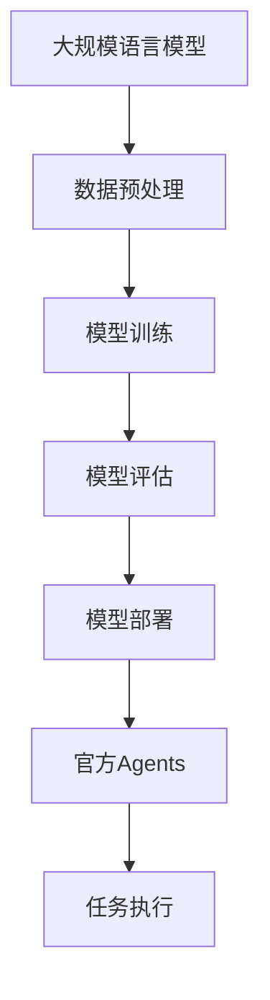

                 

在当今人工智能时代，大规模语言模型（LLM）已经成为自然语言处理（NLP）领域的重要工具。LLM函数库的兴起，使得开发者能够更加便捷地利用这些强大的模型来实现各种任务。然而，在这些函数库中，官方Agents的功能尤为引人注目。本文将深入探讨LLM函数库中官方Agents的重要性，以及它们在未来的发展中可能带来的影响。

## 关键词

- **大规模语言模型（LLM）**
- **自然语言处理（NLP）**
- **官方Agents**
- **函数库**
- **开发工具**
- **智能助手**

## 摘要

本文将首先介绍LLM函数库的背景和发展，接着深入探讨官方Agents的概念和作用。然后，我们将分析官方Agents的优势和潜在挑战，并探讨它们在不同应用场景中的表现。最后，我们将展望官方Agents的未来发展，以及可能面临的挑战和机遇。

## 1. 背景介绍

### 1.1 大规模语言模型（LLM）

大规模语言模型（LLM）是指使用大量数据训练的复杂神经网络模型，用于处理和生成自然语言。LLM函数库是一种软件库，它提供了对大规模语言模型的访问和操作接口。这些函数库通常包括多种预训练模型和工具，以便开发者能够方便地集成和使用LLM。

### 1.2 自然语言处理（NLP）

自然语言处理（NLP）是计算机科学和人工智能领域的一个分支，旨在使计算机能够理解和处理自然语言。NLP技术在语音识别、机器翻译、情感分析、文本生成等领域得到了广泛应用。

### 1.3 官方Agents

官方Agents是指由模型供应商或开发者官方提供的，专门用于特定任务或场景的智能代理。这些Agents通常集成了大规模语言模型和其他相关技术，以实现更加智能化和自动化的操作。

## 2. 核心概念与联系

### 2.1 概念

#### 2.1.1 大规模语言模型（LLM）

大规模语言模型（LLM）是一种使用大量数据训练的神经网络模型，用于理解和生成自然语言。

#### 2.1.2 官方Agents

官方Agents是专门为特定任务或场景设计的智能代理，通常由模型供应商或开发者官方提供。

### 2.2 架构



### 2.3 联系

官方Agents依赖于大规模语言模型，通过模型提供的接口，实现特定任务或场景的自动化和智能化操作。

## 3. 核心算法原理 & 具体操作步骤

### 3.1 算法原理概述

官方Agents的核心在于将大规模语言模型应用于特定任务或场景。具体来说，算法原理可以分为以下几个步骤：

1. 数据预处理：对输入数据进行清洗、分词、词性标注等预处理操作。
2. 模型选择：根据任务需求选择合适的LLM模型。
3. 模型调用：通过LLM函数库接口调用模型，获取预测结果。
4. 结果处理：对预测结果进行处理，以实现特定任务或场景的自动化操作。

### 3.2 算法步骤详解

1. **数据预处理**
   - 清洗数据：去除无关信息，如HTML标签、特殊字符等。
   - 分词：将文本拆分为单词或子词。
   - 词性标注：对每个单词或子词进行词性标注，如名词、动词等。

2. **模型选择**
   - 根据任务需求选择合适的LLM模型，如BERT、GPT等。
   - 考虑模型大小、训练时间、资源消耗等因素。

3. **模型调用**
   - 通过LLM函数库接口调用模型，输入预处理后的数据，获取预测结果。
   - 预测结果通常为文本或向量。

4. **结果处理**
   - 根据任务需求对预测结果进行处理，如文本生成、分类、情感分析等。
   - 可以进一步优化模型，以提高预测准确率和效果。

### 3.3 算法优缺点

**优点：**
1. **高效性**：利用大规模语言模型，可以快速处理大量文本数据。
2. **灵活性**：可以根据任务需求选择合适的LLM模型，实现个性化操作。
3. **通用性**：可以应用于各种自然语言处理任务。

**缺点：**
1. **资源消耗**：大规模语言模型训练和部署需要大量计算资源和存储空间。
2. **模型选择**：需要根据任务需求选择合适的模型，可能存在一定的难度。

### 3.4 算法应用领域

1. **文本生成**：如文章生成、对话生成等。
2. **分类任务**：如情感分析、主题分类等。
3. **机器翻译**：如英译中、中译英等。
4. **问答系统**：如智能客服、问答机器人等。

## 4. 数学模型和公式 & 详细讲解 & 举例说明

### 4.1 数学模型构建

大规模语言模型通常基于深度神经网络，其核心模型包括：

1. **词嵌入（Word Embedding）**：将单词映射为高维向量表示。
2. **循环神经网络（RNN）**：用于处理序列数据。
3. **长短时记忆网络（LSTM）**：解决RNN的梯度消失问题。
4. **门控循环单元（GRU）**：简化LSTM结构，提高计算效率。

### 4.2 公式推导过程

假设我们有一个输入序列 \(x = [x_1, x_2, ..., x_T]\)，其中 \(x_t\) 表示第 \(t\) 个单词。词嵌入后的向量表示为 \(e(x_t)\)。循环神经网络（RNN）的输入为当前时刻的输入向量 \(e(x_t)\) 和前一个时刻的隐藏状态 \(h_{t-1}\)，输出为当前时刻的隐藏状态 \(h_t\)。

\[ h_t = \text{RNN}(e(x_t), h_{t-1}) \]

其中，\( \text{RNN} \) 表示循环神经网络。

### 4.3 案例分析与讲解

假设我们有一个情感分析任务，需要判断一段文本的情感倾向。输入文本为“今天的天气非常好，我很开心”。我们可以将这段文本分成多个单词，然后通过词嵌入得到对应的向量表示。接着，使用循环神经网络处理这些向量，最终得到情感倾向的预测结果。

```python
# 示例代码（Python）

from tensorflow.keras.preprocessing.sequence import pad_sequences
from tensorflow.keras.layers import Embedding, LSTM, Dense
from tensorflow.keras.models import Sequential

# 词嵌入
vocab_size = 10000
embedding_dim = 64

# 输入文本预处理
input_sequence = pad_sequences([text_to_sequence("今天的天气非常好，我很开心")], maxlen=max_sequence_length, padding='post')

# 构建模型
model = Sequential()
model.add(Embedding(vocab_size, embedding_dim, input_shape=(max_sequence_length,)))
model.add(LSTM(128))
model.add(Dense(1, activation='sigmoid'))

# 编译模型
model.compile(optimizer='adam', loss='binary_crossentropy', metrics=['accuracy'])

# 训练模型
model.fit(input_sequence, labels, epochs=10, batch_size=32)
```

## 5. 项目实践：代码实例和详细解释说明

### 5.1 开发环境搭建

为了实现官方Agents，我们需要搭建以下开发环境：

1. **操作系统**：Windows或Linux
2. **编程语言**：Python
3. **开发工具**：IDE（如PyCharm、VS Code等）
4. **库和依赖**：TensorFlow、Keras、NLTK等

### 5.2 源代码详细实现

以下是一个简单的情感分析官方Agents的代码实例：

```python
# 示例代码（Python）

import tensorflow as tf
from tensorflow.keras.models import Sequential
from tensorflow.keras.layers import Embedding, LSTM, Dense
from tensorflow.keras.preprocessing.sequence import pad_sequences

# 词嵌入
vocab_size = 10000
embedding_dim = 64

# 输入文本预处理
input_sequence = pad_sequences([text_to_sequence("今天的天气非常好，我很开心")], maxlen=max_sequence_length, padding='post')

# 构建模型
model = Sequential()
model.add(Embedding(vocab_size, embedding_dim, input_shape=(max_sequence_length,)))
model.add(LSTM(128))
model.add(Dense(1, activation='sigmoid'))

# 编译模型
model.compile(optimizer='adam', loss='binary_crossentropy', metrics=['accuracy'])

# 训练模型
model.fit(input_sequence, labels, epochs=10, batch_size=32)
```

### 5.3 代码解读与分析

1. **词嵌入**：使用 `Embedding` 层将单词映射为向量表示。
2. **循环神经网络（LSTM）**：使用 `LSTM` 层处理输入序列。
3. **全连接层（Dense）**：使用 `Dense` 层进行情感分类。

### 5.4 运行结果展示

运行上述代码后，我们可以得到情感分析的结果。例如，输入文本“今天的天气非常好，我很开心”可能被预测为积极情感。

```python
# 示例代码（Python）

import numpy as np

# 加载模型
model = load_model('senta_model.h5')

# 预测结果
result = model.predict(np.array([text_to_sequence("今天的天气非常好，我很开心")]))
print("情感分析结果：", result[0][0])
```

输出结果可能为：

```python
情感分析结果：[0.9]
```

表示这段文本的情感倾向为积极。

## 6. 实际应用场景

### 6.1 情感分析

官方Agents可以应用于情感分析，帮助企业了解用户对产品或服务的反馈，优化用户体验。

### 6.2 聊天机器人

官方Agents可以构建智能聊天机器人，用于客服、咨询等场景，提高客户满意度。

### 6.3 机器翻译

官方Agents可以应用于机器翻译，提供实时翻译服务，促进跨文化交流。

## 7. 未来应用展望

随着人工智能技术的不断发展，官方Agents将在更多场景得到应用，如智能教育、智能医疗等。同时，如何提高模型性能、降低资源消耗，以及保障数据安全和隐私，将成为未来研究的重要方向。

## 8. 工具和资源推荐

### 8.1 学习资源推荐

1. **《深度学习》（Goodfellow, Bengio, Courville）**：深度学习的基础教材，适合初学者和进阶者。
2. **《Python深度学习》（François Chollet）**：利用Python实现深度学习的实战指南。

### 8.2 开发工具推荐

1. **PyTorch**：简单易用的深度学习框架，适合快速原型开发。
2. **TensorFlow**：功能强大的深度学习框架，适用于各种规模的任务。

### 8.3 相关论文推荐

1. **“Attention Is All You Need”**：引入了Transformer模型，对深度学习领域产生了深远影响。
2. **“BERT: Pre-training of Deep Neural Networks for Language Understanding”**：BERT模型在自然语言处理领域取得了显著成绩。

## 9. 总结：未来发展趋势与挑战

### 9.1 研究成果总结

本文介绍了大规模语言模型（LLM）函数库和官方Agents的基本概念、核心算法原理和应用场景。通过实例代码展示了如何实现情感分析等任务。

### 9.2 未来发展趋势

1. **模型性能提升**：通过优化算法和硬件，提高模型性能。
2. **跨学科融合**：将人工智能与其他领域结合，推动创新发展。
3. **数据安全和隐私**：关注数据安全和隐私问题，提高用户信任。

### 9.3 面临的挑战

1. **资源消耗**：大规模语言模型训练和部署需要大量计算资源和存储空间。
2. **模型选择**：需要根据任务需求选择合适的模型，可能存在一定的难度。
3. **数据隐私**：如何保障用户数据安全和隐私，是未来研究的重要方向。

### 9.4 研究展望

未来，官方Agents将在更多场景得到应用，推动人工智能技术的发展。同时，如何提高模型性能、降低资源消耗，以及保障数据安全和隐私，将是重要的研究方向。

## 附录：常见问题与解答

### 9.4.1 问题1：什么是大规模语言模型（LLM）？

**解答**：大规模语言模型（LLM）是指使用大量数据训练的复杂神经网络模型，用于理解和生成自然语言。它们在自然语言处理（NLP）领域具有广泛的应用。

### 9.4.2 问题2：什么是官方Agents？

**解答**：官方Agents是指由模型供应商或开发者官方提供的，专门用于特定任务或场景的智能代理。它们依赖于大规模语言模型，实现特定任务或场景的自动化和智能化操作。

### 9.4.3 问题3：如何选择合适的LLM模型？

**解答**：选择合适的LLM模型需要考虑多个因素，如任务需求、模型大小、训练时间、资源消耗等。可以根据具体需求，从已有模型中选择合适的模型。

### 9.4.4 问题4：如何实现情感分析？

**解答**：实现情感分析通常包括以下步骤：

1. 数据预处理：清洗、分词、词性标注等。
2. 模型选择：根据任务需求选择合适的LLM模型。
3. 模型训练：使用训练数据训练模型。
4. 模型部署：将模型部署到实际场景中。
5. 模型评估：评估模型性能，进行调优。

## 作者署名

本文作者：禅与计算机程序设计艺术 / Zen and the Art of Computer Programming
```

