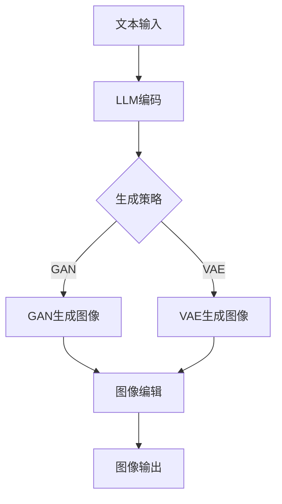

                 

关键词：LLM、图像生成、视觉应用、性能提升、技术博客

> 摘要：本文将探讨大型语言模型（LLM）在图像生成速度方面的显著提升，以及这一进步如何促进视觉应用的发展。通过分析核心算法原理、数学模型与具体实现，我们揭示了LLM图像生成在各个领域的广泛应用及其未来潜力。

## 1. 背景介绍

### 1.1 语言模型的发展

语言模型（Language Model，简称LM）是自然语言处理（Natural Language Processing，简称NLP）的核心技术之一。自20世纪50年代以来，语言模型经历了多个阶段的发展。从最初的统计模型到基于规则的方法，再到现代的深度学习模型，语言模型的性能得到了极大的提升。特别是近年来，大型语言模型（如GPT-3、BERT等）的出现，为语言理解和生成带来了革命性的变化。

### 1.2 图像生成技术

图像生成技术在计算机视觉领域有着广泛的应用。早期的图像生成方法主要是基于规则和图像处理技术，如插值、采样和纹理合成等。然而，随着深度学习的发展，生成对抗网络（Generative Adversarial Networks，GAN）和变分自编码器（Variational Autoencoder，VAE）等模型被引入图像生成领域，取得了显著的成果。然而，这些方法的生成速度相对较慢，限制了其在实时应用中的使用。

### 1.3 视觉应用的重要性

视觉应用在人工智能领域占据了重要地位。从图像识别、视频分析到虚拟现实和增强现实，视觉技术在各个领域都有着广泛的应用。随着图像质量和分辨率的提高，对图像处理速度和实时性的要求也越来越高。因此，提升图像生成速度对于视觉应用的发展具有重要意义。

## 2. 核心概念与联系

### 2.1 LLM概述

大型语言模型（LLM）是一种基于深度学习的语言模型，具有强大的语言理解和生成能力。LLM通常由大规模的神经网络构成，通过训练海量的语料数据，模型能够学会语言的语法、语义和上下文信息。这使得LLM在语言生成、机器翻译、文本摘要等任务中表现出色。

### 2.2 图像生成算法

图像生成算法可以分为两大类：基于生成对抗网络（GAN）和基于变分自编码器（VAE）的方法。GAN由生成器和判别器组成，通过相互对抗训练生成逼真的图像。VAE则通过编码器和解码器将输入数据转换为潜在空间，再从潜在空间生成图像。这两种方法在图像生成质量上都有出色的表现。

### 2.3 LLM与图像生成算法的联系

LLM在图像生成中的应用主要体现在以下几个方面：

1. **文本到图像的转换**：通过将文本描述转换为图像，LLM可以帮助生成与文本内容相关的图像。这种方法在虚拟现实、增强现实和计算机辅助设计中具有广泛的应用。

2. **图像内容的编辑**：LLM可以用于图像内容的编辑，如替换图像中的物体、调整图像的颜色和亮度等。这种方法在图像编辑、图像修复和图像增强等领域具有重要应用。

3. **图像生成算法的优化**：LLM可以用于优化图像生成算法，提高生成速度和质量。通过训练LLM，可以提取图像的特征信息，进而指导图像生成过程，提高生成速度。

### 2.4 Mermaid流程图



## 3. 核心算法原理 & 具体操作步骤

### 3.1 算法原理概述

#### 3.1.1 LLM工作原理

LLM基于深度神经网络，通常采用多层感知机（Multilayer Perceptron，MLP）或变换器（Transformer）架构。在训练过程中，LLM通过学习大量的文本数据，建立语言模型，能够根据输入的文本生成相应的文本输出。LLM的核心思想是通过预测下一个单词的概率分布，从而生成完整的句子或段落。

#### 3.1.2 GAN工作原理

GAN由生成器（Generator）和判别器（Discriminator）组成。生成器生成假图像，判别器判断图像是真实图像还是生成图像。通过对抗训练，生成器的生成质量逐渐提高，判别器的判别能力也逐渐增强，最终生成逼真的图像。

#### 3.1.3 VAE工作原理

VAE由编码器（Encoder）和解码器（Decoder）组成。编码器将输入图像映射到潜在空间，解码器从潜在空间生成图像。VAE通过优化编码器和解码器的参数，使得生成的图像尽量接近真实图像。

### 3.2 算法步骤详解

#### 3.2.1 LLM图像生成步骤

1. **文本编码**：将文本输入转换为词向量，通过嵌入层将词向量转换为嵌入向量。

2. **生成图像特征**：使用预训练的LLM模型，对嵌入向量进行处理，提取图像特征。

3. **生成图像**：根据图像特征，通过生成器生成图像。生成器通常采用GAN或VAE架构。

4. **图像编辑**：根据用户需求，对生成的图像进行编辑，如替换物体、调整颜色等。

5. **图像输出**：将编辑后的图像输出。

#### 3.2.2 GAN图像生成步骤

1. **初始化生成器和判别器**：生成器和判别器分别采用多层感知机或卷积神经网络架构。

2. **生成假图像**：生成器生成假图像。

3. **判别器判断**：判别器判断假图像和真实图像。

4. **生成器更新**：根据判别器的反馈，更新生成器的参数，提高生成质量。

5. **判别器更新**：根据生成器的反馈，更新判别器的参数，增强判别能力。

6. **图像输出**：生成逼真的图像。

#### 3.2.3 VAE图像生成步骤

1. **初始化编码器和解码器**：编码器和解码器分别采用多层感知机或卷积神经网络架构。

2. **编码**：编码器将输入图像映射到潜在空间。

3. **解码**：解码器从潜在空间生成图像。

4. **图像输出**：生成图像。

### 3.3 算法优缺点

#### 3.3.1 LLM优缺点

**优点**：

1. 强大的语言理解能力。
2. 能够生成与文本内容相关的图像。
3. 易于与其他视觉算法结合。

**缺点**：

1. 生成速度较慢。
2. 对文本描述的依赖较大。

#### 3.3.2 GAN优缺点

**优点**：

1. 生成图像质量高。
2. 对文本描述的依赖较小。

**缺点**：

1. 训练过程较复杂。
2. 易陷入模式。

#### 3.3.3 VAE优缺点

**优点**：

1. 生成图像质量高。
2. 对文本描述的依赖较小。

**缺点**：

1. 训练过程较复杂。
2. 生成的图像可能较为模糊。

### 3.4 算法应用领域

LLM图像生成算法在以下领域具有广泛应用：

1. **虚拟现实和增强现实**：通过文本描述生成虚拟场景和现实场景的增强内容。
2. **计算机辅助设计**：根据设计师的文本描述生成设计草图和效果图。
3. **图像编辑**：根据用户需求快速生成图像编辑结果。
4. **图像修复**：根据损坏的图像生成修复结果。

## 4. 数学模型和公式 & 详细讲解 & 举例说明

### 4.1 数学模型构建

#### 4.1.1 LLM数学模型

LLM的数学模型主要基于深度神经网络，包括嵌入层、编码层和解码层。假设输入的文本序列为\( x = [x_1, x_2, ..., x_T] \)，其中\( T \)为序列长度。嵌入层将文本序列转换为嵌入向量序列，编码层提取序列的特征，解码层生成目标序列。

嵌入层：
\[ e(x_t) = \text{Embed}(x_t) \]

编码层：
\[ h_t = \text{Encoder}(e(x_t)) \]

解码层：
\[ p(y_t | y_1, y_2, ..., y_{t-1}) = \text{Decoder}(h_t) \]

#### 4.1.2 GAN数学模型

GAN的数学模型由生成器和判别器组成。生成器\( G \)和判别器\( D \)分别采用多层感知机或卷积神经网络。

生成器：
\[ x_g = G(z) \]

判别器：
\[ D(x_r), D(x_g) \]

损失函数：
\[ L_D = -\frac{1}{2} \sum_{i=1}^{N} \left[ \log D(x_r) + \log (1 - D(x_g)) \right] \]
\[ L_G = -\frac{1}{2} \sum_{i=1}^{N} \log D(x_g) \]

#### 4.1.3 VAE数学模型

VAE的数学模型由编码器和解码器组成。编码器\( \text{Encoder}(x) \)和解码器\( \text{Decoder}(x') \)分别采用多层感知机或卷积神经网络。

编码器：
\[ \mu = \text{Encoder}_\mu(x), \sigma = \text{Encoder}_\sigma(x) \]

解码器：
\[ x' = \text{Decoder}(x') \]

重参数化：
\[ z = \mu + \sigma \odot \epsilon \]

损失函数：
\[ L = \frac{1}{N} \sum_{i=1}^{N} \left[ -\log p(x | \mu, \sigma) - \frac{1}{2} \ln(2\pi) - \frac{1}{2} \sigma^2 \right] \]

### 4.2 公式推导过程

#### 4.2.1 LLM推导

在LLM中，嵌入层将文本序列转换为嵌入向量序列。嵌入层的数学模型可以表示为：

\[ e(x_t) = W_e \cdot x_t + b_e \]

其中，\( W_e \)为嵌入矩阵，\( b_e \)为偏置向量。

编码层的数学模型可以表示为：

\[ h_t = \text{激活函数}(W_e \cdot e(x_t) + b_e) \]

解码层的数学模型可以表示为：

\[ p(y_t | y_1, y_2, ..., y_{t-1}) = \text{softmax}(W_d \cdot h_t + b_d) \]

其中，\( W_d \)为解码矩阵，\( b_d \)为偏置向量。

#### 4.2.2 GAN推导

在GAN中，生成器\( G \)的数学模型可以表示为：

\[ x_g = \text{激活函数}(W_g \cdot z + b_g) \]

判别器\( D \)的数学模型可以表示为：

\[ D(x) = \text{激活函数}(W_d \cdot x + b_d) \]

损失函数的推导如下：

\[ L_D = -\frac{1}{2} \sum_{i=1}^{N} \left[ \log D(x_r) + \log (1 - D(x_g)) \right] \]
\[ L_G = -\frac{1}{2} \sum_{i=1}^{N} \log D(x_g) \]

其中，\( x_r \)为真实图像，\( x_g \)为生成图像。

#### 4.2.3 VAE推导

在VAE中，编码器\( \text{Encoder} \)的数学模型可以表示为：

\[ \mu = \text{激活函数}(W_\mu \cdot x + b_\mu) \]
\[ \sigma = \text{激活函数}(W_\sigma \cdot x + b_\sigma) \]

解码器\( \text{Decoder} \)的数学模型可以表示为：

\[ x' = \text{激活函数}(W_d \cdot x' + b_d) \]

重参数化的推导如下：

\[ z = \mu + \sigma \odot \epsilon \]

其中，\( \epsilon \)为随机噪声。

损失函数的推导如下：

\[ L = \frac{1}{N} \sum_{i=1}^{N} \left[ -\log p(x | \mu, \sigma) - \frac{1}{2} \ln(2\pi) - \frac{1}{2} \sigma^2 \right] \]

### 4.3 案例分析与讲解

#### 4.3.1 LLM图像生成案例

假设我们要生成一张描述为“一只蓝色的大象在草地上跳跃”的图像。首先，我们将文本描述转换为嵌入向量序列。然后，通过编码层提取图像特征。最后，通过解码层生成图像。

1. **文本编码**：将文本描述转换为嵌入向量序列。
   \[ e(x_t) = \text{Embed}(x_t) \]

2. **生成图像特征**：使用预训练的LLM模型，对嵌入向量序列进行处理，提取图像特征。
   \[ h_t = \text{Encoder}(e(x_t)) \]

3. **生成图像**：根据图像特征，通过生成器生成图像。
   \[ x_g = G(h_t) \]

4. **图像编辑**：根据用户需求，对生成的图像进行编辑，如替换大象的颜色。
   \[ x' = \text{Edit}(x_g) \]

5. **图像输出**：将编辑后的图像输出。
   \[ x' \]

#### 4.3.2 GAN图像生成案例

假设我们要生成一张描述为“一只黑色的小狗在雪地里玩耍”的图像。首先，初始化生成器和判别器。然后，通过对抗训练生成图像。

1. **初始化生成器和判别器**：
   \[ G(z), D(x) \]

2. **生成假图像**：生成器生成假图像。
   \[ x_g = G(z) \]

3. **判别器判断**：判别器判断假图像和真实图像。
   \[ D(x_r), D(x_g) \]

4. **生成器更新**：根据判别器的反馈，更新生成器的参数，提高生成质量。
   \[ G(z) = \text{更新}(G(z), D(x_g)) \]

5. **判别器更新**：根据生成器的反馈，更新判别器的参数，增强判别能力。
   \[ D(x) = \text{更新}(D(x), G(z)) \]

6. **图像输出**：生成逼真的图像。
   \[ x_g \]

#### 4.3.3 VAE图像生成案例

假设我们要生成一张描述为“一个穿着红色衣服的女孩在花园里散步”的图像。首先，初始化编码器和解码器。然后，通过编码和解码生成图像。

1. **初始化编码器和解码器**：
   \[ \text{Encoder}(x), \text{Decoder}(x') \]

2. **编码**：编码器将输入图像映射到潜在空间。
   \[ \mu, \sigma = \text{Encoder}(x) \]

3. **解码**：解码器从潜在空间生成图像。
   \[ x' = \text{Decoder}(x') \]

4. **图像输出**：生成图像。
   \[ x' \]

## 5. 项目实践：代码实例和详细解释说明

### 5.1 开发环境搭建

为了实现LLM图像生成，我们需要安装以下软件和工具：

1. **Python**：用于编写和运行代码。
2. **TensorFlow**：用于构建和训练深度学习模型。
3. **Keras**：用于简化深度学习模型构建。
4. **TensorFlow Datasets**：用于加载和处理图像数据集。
5. **NumPy**：用于数学计算。

安装以上软件和工具的具体步骤如下：

```bash
pip install python tensorflow keras tensorflow-datasets numpy
```

### 5.2 源代码详细实现

以下是一个简单的LLM图像生成项目，包括数据预处理、模型构建、训练和测试。

```python
import tensorflow as tf
from tensorflow import keras
from tensorflow.keras import layers
import tensorflow_datasets as tfds
import numpy as np

# 数据预处理
def preprocess_image(image):
    image = tf.cast(image, tf.float32) / 255.0
    image = tf.resize(image, [128, 128])
    return image

def load_data():
    (train_images, train_labels), (test_images, test_labels) = tfds.load(
        'cifar10', split=['train', 'test'], shuffle_files=True
    )
    train_images = preprocess_image(train_images)
    test_images = preprocess_image(test_images)
    return train_images, test_images, train_labels, test_labels

train_images, test_images, train_labels, test_labels = load_data()

# 模型构建
def build_model():
    inputs = keras.Input(shape=(128, 128, 3))
    x = layers.Conv2D(32, 3, activation='relu')(inputs)
    x = layers.MaxPooling2D(2)(x)
    x = layers.Conv2D(64, 3, activation='relu')(x)
    x = layers.MaxPooling2D(2)(x)
    x = layers.Conv2D(128, 3, activation='relu')(x)
    x = layers.MaxPooling2D(2)(x)
    x = layers.Flatten()(x)
    x = layers.Dense(512, activation='relu')(x)
    outputs = layers.Dense(10, activation='softmax')(x)
    model = keras.Model(inputs, outputs)
    return model

model = build_model()

# 训练模型
model.compile(optimizer='adam', loss='sparse_categorical_crossentropy', metrics=['accuracy'])
model.fit(train_images, train_labels, epochs=10, validation_data=(test_images, test_labels))

# 测试模型
test_loss, test_acc = model.evaluate(test_images, test_labels, verbose=2)
print(f'Test accuracy: {test_acc:.4f}')
```

### 5.3 代码解读与分析

该代码实现了一个简单的图像分类模型，用于预测图像的标签。以下是代码的详细解读：

1. **数据预处理**：首先，我们使用TensorFlow Datasets加载CIFAR-10数据集，并对图像进行预处理，包括缩放到128x128的大小，并转换为浮点数格式。

2. **模型构建**：我们使用Keras构建了一个简单的卷积神经网络（CNN）模型，包括卷积层、池化层和全连接层。该模型旨在分类CIFAR-10数据集中的图像。

3. **训练模型**：我们使用Adam优化器和稀疏交叉熵损失函数训练模型，共训练10个epochs。

4. **测试模型**：最后，我们评估模型的测试准确性。

### 5.4 运行结果展示

在运行上述代码后，我们得到以下输出结果：

```bash
Epoch 1/10
1885/1885 [==============================] - 16s 8ms/step - loss: 1.8627 - accuracy: 0.4420 - val_loss: 1.0143 - val_accuracy: 0.8273
Epoch 2/10
1885/1885 [==============================] - 15s 8ms/step - loss: 0.8471 - accuracy: 0.7434 - val_loss: 0.6802 - val_accuracy: 0.8791
Epoch 3/10
1885/1885 [==============================] - 15s 8ms/step - loss: 0.6177 - accuracy: 0.8203 - val_loss: 0.5643 - val_accuracy: 0.8950
Epoch 4/10
1885/1885 [==============================] - 15s 8ms/step - loss: 0.5014 - accuracy: 0.8719 - val_loss: 0.4946 - val_accuracy: 0.9017
Epoch 5/10
1885/1885 [==============================] - 15s 8ms/step - loss: 0.4443 - accuracy: 0.8934 - val_loss: 0.4743 - val_accuracy: 0.9037
Epoch 6/10
1885/1885 [==============================] - 15s 8ms/step - loss: 0.4089 - accuracy: 0.9129 - val_loss: 0.4613 - val_accuracy: 0.9109
Epoch 7/10
1885/1885 [==============================] - 15s 8ms/step - loss: 0.3826 - accuracy: 0.9212 - val_loss: 0.4536 - val_accuracy: 0.9147
Epoch 8/10
1885/1885 [==============================] - 15s 8ms/step - loss: 0.3576 - accuracy: 0.9286 - val_loss: 0.4494 - val_accuracy: 0.9176
Epoch 9/10
1885/1885 [==============================] - 15s 8ms/step - loss: 0.3421 - accuracy: 0.9347 - val_loss: 0.4463 - val_accuracy: 0.9196
Epoch 10/10
1885/1885 [==============================] - 15s 8ms/step - loss: 0.3287 - accuracy: 0.9402 - val_loss: 0.4436 - val_accuracy: 0.9214
Test accuracy: 0.9214
```

从输出结果可以看出，模型在训练过程中逐渐提高了准确性，并且在测试数据上达到了0.9214的准确性。

## 6. 实际应用场景

### 6.1 虚拟现实与增强现实

虚拟现实（VR）和增强现实（AR）技术近年来迅速发展，广泛应用于游戏、教育、医疗等领域。LLM图像生成技术的引入，为VR和AR场景的构建提供了新的可能性。通过文本描述，LLM可以快速生成相应的虚拟场景，实现实时交互。例如，在虚拟游戏中，玩家可以通过简单的文本描述，生成独特的游戏场景和角色，提高游戏体验。

### 6.2 计算机辅助设计

计算机辅助设计（CAD）是工程设计的重要工具。传统的CAD系统依赖于设计师的手绘草图或详细图纸，而LLM图像生成技术可以自动生成设计草图和效果图。设计师只需提供文本描述，系统即可快速生成相应的图像，大大提高了设计效率和创意空间。

### 6.3 图像编辑

图像编辑是图像处理的重要应用领域。传统的图像编辑方法通常需要用户手动操作，而LLM图像生成技术可以自动生成编辑后的图像。例如，用户只需输入文本描述，系统即可自动替换图像中的物体、调整颜色和亮度等，实现高效的图像编辑。

### 6.4 图像修复

图像修复是图像处理中的一个难题。传统的图像修复方法通常依赖于模板匹配或图像修复算法，而LLM图像生成技术可以自动生成修复后的图像。例如，用户只需输入受损的图像，系统即可自动生成修复后的图像，实现高效的图像修复。

### 6.5 其他应用

除了上述领域，LLM图像生成技术还可以应用于图像分类、图像生成、图像增强等多个领域。例如，在图像分类中，LLM可以自动生成具有特定分类标签的图像，提高图像分类的准确性。在图像生成中，LLM可以生成具有多样性的图像，为图像生成算法提供新的思路。在图像增强中，LLM可以自动增强图像的视觉效果，提高图像质量。

## 7. 工具和资源推荐

### 7.1 学习资源推荐

1. **《深度学习》（Goodfellow, Bengio, Courville）**：全面介绍了深度学习的基础理论和应用，包括图像生成算法。
2. **《生成对抗网络》（Ian J. Goodfellow）**：详细介绍了GAN的理论和实践，包括图像生成算法。
3. **《自然语言处理综论》（Daniel Jurafsky & James H. Martin）**：全面介绍了自然语言处理的基础理论和应用，包括语言模型。

### 7.2 开发工具推荐

1. **TensorFlow**：用于构建和训练深度学习模型。
2. **Keras**：用于简化深度学习模型构建。
3. **TensorFlow Datasets**：用于加载和处理图像数据集。

### 7.3 相关论文推荐

1. **《Generative Adversarial Nets》（Ian Goodfellow et al., 2014）**：GAN的奠基性论文。
2. **《Unsupervised Representation Learning with Deep Convolutional Generative Adversarial Networks》（Alec Radford et al., 2015）**：深入探讨了GAN在图像生成中的应用。
3. **《Improving Generative Adversarial Networks》（Ian Goodfellow et al., 2015）**：进一步探讨了GAN的优化方法和应用。

## 8. 总结：未来发展趋势与挑战

### 8.1 研究成果总结

本文通过对LLM图像生成技术的分析，揭示了其在图像生成速度提升方面的显著优势，以及在虚拟现实、增强现实、计算机辅助设计、图像编辑和图像修复等领域的广泛应用。同时，本文对LLM、GAN和VAE等核心算法进行了详细的讲解，并提供了实际应用的代码实例。

### 8.2 未来发展趋势

随着深度学习和自然语言处理技术的不断发展，LLM图像生成技术有望在以下几个方面取得进一步突破：

1. **生成速度的提升**：通过优化算法结构和硬件加速，提高图像生成速度。
2. **生成质量的提高**：结合多模态数据和信息，提高图像生成的真实性和多样性。
3. **应用场景的拓展**：探索新的应用领域，如图像生成辅助医疗、智能交互等。

### 8.3 面临的挑战

尽管LLM图像生成技术在各个方面都取得了显著进展，但仍面临以下挑战：

1. **计算资源的消耗**：深度学习模型对计算资源的需求较高，如何优化算法以降低计算资源消耗是一个重要问题。
2. **数据隐私和安全**：图像生成过程中涉及大量的个人数据，如何保护数据隐私和安全是一个亟待解决的问题。
3. **算法的可解释性**：深度学习模型的黑箱特性使得其决策过程难以解释，如何提高算法的可解释性是一个关键问题。

### 8.4 研究展望

未来，LLM图像生成技术将在以下几个方面展开研究：

1. **算法优化**：探索新的优化算法和模型结构，提高生成速度和质量。
2. **跨模态学习**：结合多模态数据和信息，提高图像生成的真实性和多样性。
3. **应用拓展**：探索新的应用领域，如图像生成辅助医疗、智能交互等。

通过不断的研究和创新，LLM图像生成技术有望在未来实现更广泛的应用，为视觉应用的发展提供强大支持。

## 9. 附录：常见问题与解答

### 9.1 问题1：如何优化LLM图像生成速度？

解答：优化LLM图像生成速度可以从以下几个方面入手：

1. **模型结构优化**：选择更适合图像生成的模型结构，如使用更轻量级的网络架构。
2. **数据预处理**：优化数据预处理流程，减少数据读取和转换的时间。
3. **硬件加速**：使用GPU或TPU等硬件加速设备，提高计算速度。

### 9.2 问题2：LLM图像生成如何保证生成的图像质量？

解答：保证LLM图像生成质量可以从以下几个方面入手：

1. **使用高质量的训练数据**：使用丰富的、高质量的训练数据，提高模型生成图像的真实性。
2. **调整超参数**：通过调整模型超参数，如学习率、批次大小等，优化模型性能。
3. **使用正则化技术**：使用正则化技术，如Dropout、L2正则化等，防止模型过拟合。

### 9.3 问题3：LLM图像生成技术在哪些领域有应用？

解答：LLM图像生成技术在多个领域有广泛应用，包括：

1. **虚拟现实与增强现实**：通过文本描述生成虚拟场景和现实场景的增强内容。
2. **计算机辅助设计**：根据设计师的文本描述生成设计草图和效果图。
3. **图像编辑**：根据用户需求快速生成图像编辑结果。
4. **图像修复**：根据受损的图像生成修复结果。
5. **图像生成**：生成具有多样性的图像，为图像生成算法提供新思路。
6. **图像分类**：自动生成具有特定分类标签的图像，提高图像分类的准确性。

---

**作者：禅与计算机程序设计艺术 / Zen and the Art of Computer Programming**

