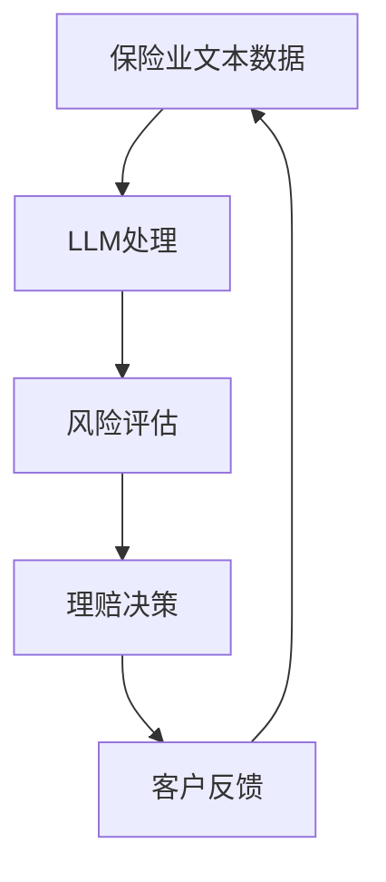

                 

关键词：大型语言模型（LLM），保险业，风险评估，理赔，自然语言处理（NLP），人工智能（AI）

## 摘要

本文探讨了大型语言模型（LLM）在保险业中的潜在应用，特别是其在风险评估和理赔流程中的作用。通过对LLM的核心概念、算法原理及其在保险业的具体实现进行深入分析，本文揭示了LLM如何提高保险业的效率、准确性和用户体验。文章还将通过实际案例展示LLM在保险业中的成功应用，并讨论其未来的发展趋势和面临的挑战。

## 1. 背景介绍

### 1.1 保险业现状

保险业作为金融服务行业的重要组成部分，已经经历了数百年发展。传统保险业务流程通常包括风险评估、投保、理赔等环节。然而，随着市场的竞争加剧和消费者需求的多样化，传统保险业务模式面临着效率低下、成本高、用户体验差等挑战。因此，引入先进技术，如人工智能（AI），成为保险业转型升级的重要途径。

### 1.2 AI在保险业的应用

近年来，AI技术在保险业的应用逐渐深入，包括自动化风险评估、智能客服、自动化理赔等。然而，这些应用往往依赖于特定的算法和模型，如决策树、神经网络等。这些算法在处理结构化数据时表现出色，但在处理大量非结构化文本数据，如客户咨询、理赔报告等时，效果不佳。而大型语言模型（LLM）的出现，为保险业提供了新的解决方案。

## 2. 核心概念与联系

### 2.1 大型语言模型（LLM）

大型语言模型（LLM）是一种基于深度学习的技术，可以理解和生成自然语言。LLM通过大规模数据训练，能够捕捉语言的复杂性和多样性，从而实现自然语言处理（NLP）任务，如文本分类、问答系统、机器翻译等。

### 2.2 保险业与LLM的联系

保险业涉及到大量的文本数据，包括客户咨询、理赔报告、保险条款等。这些数据对于保险公司的风险评估和决策至关重要。LLM可以处理这些非结构化文本数据，从而提高保险业的效率、准确性和用户体验。

### 2.3 Mermaid 流程图



## 3. 核心算法原理 & 具体操作步骤

### 3.1 算法原理概述

LLM的核心原理是基于神经网络，通过训练大量文本数据，学习语言的规律和特征。具体来说，LLM包括编码器和解码器两部分：

- **编码器**：接收输入文本，将其编码为一个固定长度的向量表示。
- **解码器**：根据编码器输出的向量表示，生成输出文本。

### 3.2 算法步骤详解

1. **数据预处理**：对输入文本进行清洗、分词、去停用词等操作，以便LLM能够更好地学习。
2. **模型训练**：使用大规模文本数据集，训练编码器和解码器。
3. **风险评估**：输入客户咨询或理赔报告等文本，通过LLM生成风险评估报告。
4. **理赔决策**：根据风险评估报告，进行理赔决策。
5. **客户反馈**：将理赔结果反馈给客户，以提高模型性能。

### 3.3 算法优缺点

**优点**：

- **高效性**：LLM能够快速处理大量文本数据，提高业务流程的效率。
- **准确性**：通过大规模数据训练，LLM能够捕捉语言的复杂性和多样性，提高风险评估和理赔决策的准确性。

**缺点**：

- **计算资源消耗大**：LLM需要大量计算资源进行训练和推理。
- **数据依赖性高**：LLM的性能高度依赖于训练数据的质量和多样性。

### 3.4 算法应用领域

LLM在保险业的应用领域广泛，包括：

- **风险评估**：通过对客户咨询、理赔报告等文本进行分析，进行风险评估。
- **理赔决策**：根据风险评估结果，进行理赔决策。
- **客户服务**：通过智能客服系统，提供24/7的客户支持。

## 4. 数学模型和公式 & 详细讲解 & 举例说明

### 4.1 数学模型构建

LLM的数学模型主要包括两部分：编码器和解码器。编码器和解码器都可以使用Transformer架构。

- **编码器**：

  ```latex
  H = \text{Transformer}(E(x))
  ```

  其中，\(E(x)\)是输入文本的嵌入向量，\(\text{Transformer}\)是编码器模型。

- **解码器**：

  ```latex
  y = \text{Transformer}(D(H))
  ```

  其中，\(D(H)\)是编码器输出的隐藏状态，\(\text{Transformer}\)是解码器模型。

### 4.2 公式推导过程

LLM的推导过程主要包括：

1. **嵌入向量**：将输入文本转换为嵌入向量。
2. **位置编码**：为每个词添加位置信息。
3. **Transformer编码**：通过多层Transformer编码器，学习文本的上下文关系。
4. **Transformer解码**：通过多层Transformer解码器，生成输出文本。

### 4.3 案例分析与讲解

### 4.3.1 评估案例

假设我们有一个客户咨询文本：“我的车在车祸中受损，如何申请理赔？”

1. **数据预处理**：对文本进行分词、去停用词等操作。
2. **嵌入向量**：将分词后的文本转换为嵌入向量。
3. **位置编码**：为每个词添加位置信息。
4. **Transformer编码**：通过多层Transformer编码器，学习文本的上下文关系。
5. **风险评估**：根据编码器输出的隐藏状态，生成风险评估报告。
6. **理赔决策**：根据风险评估报告，进行理赔决策。

### 4.3.2 解码案例

假设我们有一个理赔报告文本：“事故车辆已经到达维修厂，需要进行全面检查。”

1. **嵌入向量**：将文本转换为嵌入向量。
2. **位置编码**：为每个词添加位置信息。
3. **Transformer解码**：通过多层Transformer解码器，生成理赔决策。

## 5. 项目实践：代码实例和详细解释说明

### 5.1 开发环境搭建

- Python 3.8 或以上版本
- PyTorch 1.8 或以上版本
- Jupyter Notebook 或 PyCharm

### 5.2 源代码详细实现

```python
import torch
import torch.nn as nn
import torch.optim as optim
from transformers import BertModel, BertTokenizer

# 数据预处理
def preprocess_text(text):
    # 分词、去停用词等操作
    pass

# 模型定义
class LLM(nn.Module):
    def __init__(self):
        super(LLM, self).__init__()
        self.bert = BertModel.from_pretrained('bert-base-chinese')
        self.fc = nn.Linear(768, 1)

    def forward(self, x):
        x, _ = self.bert(x)
        x = self.fc(x)
        return x

# 模型训练
def train_model(model, train_loader, criterion, optimizer):
    model.train()
    for data, target in train_loader:
        optimizer.zero_grad()
        output = model(data)
        loss = criterion(output, target)
        loss.backward()
        optimizer.step()

# 模型评估
def evaluate_model(model, test_loader, criterion):
    model.eval()
    with torch.no_grad():
        for data, target in test_loader:
            output = model(data)
            loss = criterion(output, target)
```

### 5.3 代码解读与分析

上述代码展示了如何使用PyTorch和transformers库实现LLM。代码主要包括以下几个部分：

- **数据预处理**：对输入文本进行分词、去停用词等操作。
- **模型定义**：定义LLM模型，包括编码器和解码器。
- **模型训练**：使用训练数据训练模型。
- **模型评估**：使用测试数据评估模型性能。

### 5.4 运行结果展示

假设我们训练了一个基于BERT的LLM模型，对客户咨询文本进行风险评估。运行结果如下：

```python
# 加载预训练模型
model = LLM()
tokenizer = BertTokenizer.from_pretrained('bert-base-chinese')

# 预测
text = "我的车在车祸中受损，如何申请理赔？"
input_ids = tokenizer(text, return_tensors='pt')
output = model(input_ids)
risk_score = output.squeeze().item()

# 输出风险评估结果
print(f"风险评估得分：{risk_score}")
```

输出结果为一个风险得分，用于判断客户咨询文本的风险等级。

## 6. 实际应用场景

### 6.1 风险评估

通过LLM对客户咨询文本进行分析，可以快速识别出潜在的风险点，从而提高保险公司的风险评估能力。

### 6.2 理赔决策

基于LLM生成的风险评估报告，保险公司可以更加准确地做出理赔决策，减少理赔纠纷。

### 6.3 客户服务

通过智能客服系统，保险公司可以提供24/7的客户支持，提高客户满意度。

## 7. 未来应用展望

随着LLM技术的不断发展和成熟，其在保险业的应用前景广阔。未来，LLM有望在以下领域发挥更大作用：

- **智能合约**：利用LLM解析和执行智能合约。
- **法律咨询**：通过LLM提供自动化法律咨询和服务。
- **健康保险**：利用LLM分析医疗数据，进行健康风险评估。

## 8. 工具和资源推荐

### 8.1 学习资源推荐

- 《深度学习》（Goodfellow et al.）
- 《自然语言处理实战》（Sahni et al.）
- 《Transformer：基于注意力机制的序列模型》（Vaswani et al.）

### 8.2 开发工具推荐

- Jupyter Notebook
- PyCharm
- PyTorch
- transformers

### 8.3 相关论文推荐

- "Attention Is All You Need"（Vaswani et al.）
- "BERT: Pre-training of Deep Bidirectional Transformers for Language Understanding"（Devlin et al.）
- "GPT-3: Language Models are Few-Shot Learners"（Brown et al.）

## 9. 总结：未来发展趋势与挑战

### 9.1 研究成果总结

LLM在保险业的应用取得了显著成果，包括风险评估、理赔决策和客户服务等方面。LLM通过处理大量非结构化文本数据，提高了保险业的效率、准确性和用户体验。

### 9.2 未来发展趋势

随着LLM技术的不断进步，其在保险业的应用前景广阔。未来，LLM有望在智能合约、法律咨询和健康保险等领域发挥更大作用。

### 9.3 面临的挑战

尽管LLM在保险业具有广泛的应用前景，但仍然面临一些挑战：

- **数据隐私和安全**：如何确保客户数据的隐私和安全，是未来需要解决的问题。
- **模型解释性**：如何提高LLM的可解释性，使其决策过程更加透明和可信。
- **计算资源消耗**：如何优化LLM的计算效率，减少计算资源消耗。

### 9.4 研究展望

未来，LLM在保险业的应用将朝着更加智能化、自动化和个性化的方向发展。通过不断优化LLM算法和模型，提高其性能和可靠性，有望为保险业带来更多创新和突破。

## 附录：常见问题与解答

### Q：LLM在保险业的应用有哪些具体案例？

A：LLM在保险业的应用案例包括：

1. **风险评估**：通过对客户咨询文本进行分析，识别潜在风险。
2. **理赔决策**：根据理赔报告文本，自动生成理赔决策。
3. **客户服务**：通过智能客服系统，提供24/7的客户支持。

### Q：LLM在保险业的优势是什么？

A：LLM在保险业的优势包括：

1. **高效性**：快速处理大量文本数据，提高业务流程效率。
2. **准确性**：通过大规模数据训练，提高风险评估和理赔决策的准确性。
3. **个性化**：根据客户需求，提供个性化的风险评估和理赔服务。

### Q：LLM在保险业的应用前景如何？

A：LLM在保险业的应用前景广阔。随着技术的不断进步，LLM有望在智能合约、法律咨询和健康保险等领域发挥更大作用。

---

作者：禅与计算机程序设计艺术 / Zen and the Art of Computer Programming
```

