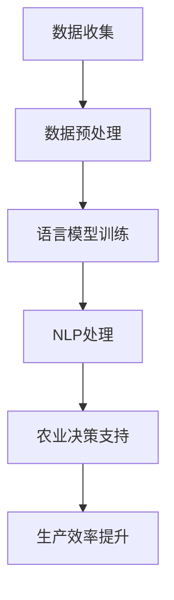

                 

关键词：自然语言处理，人工智能，农业智能化，语言模型，机器学习，数据分析，智能农业

## 摘要

随着全球人口的增长和气候变化对农业的影响，农业智能化成为解决粮食安全和可持续发展的关键。本文探讨了语言模型（LLM）在农业智能化中的潜在作用，包括通过自然语言处理提升农业数据分析、优化农业决策支持系统和提高农业生产效率。本文首先介绍了语言模型的基本概念和技术，然后详细分析了LLM在农业数据管理、病虫害监测、种植规划、农田管理和市场预测等方面的应用。最后，本文探讨了未来LLM在农业智能化领域的应用前景，并提出了相关的挑战和解决策略。

## 1. 背景介绍

农业，作为人类文明的基础，一直以来都是世界经济发展的关键领域。然而，随着全球人口的不断增长、城市化进程的加快以及气候变化的影响，农业生产面临着前所未有的挑战。传统农业依赖人工和经验，效率低下且不精确，难以满足日益增长的粮食需求。因此，农业智能化成为现代农业发展的重要趋势。

农业智能化指的是利用信息技术和现代科技手段，提高农业生产的效率、质量和可持续性。这包括使用传感器、无人机、物联网、大数据分析、人工智能和机器学习等技术。自然语言处理（NLP）作为人工智能的重要分支，正在逐渐成为农业智能化的重要工具之一。

### 1.1 农业面临的挑战

1. **粮食需求增长**：随着全球人口的增长，粮食需求逐年上升，这给农业生产带来了巨大的压力。
2. **气候变化**：气候变化导致极端天气事件频发，对农作物产量和质量产生了负面影响。
3. **资源短缺**：土地、水资源和化肥等资源短缺，加剧了农业生产的困难。
4. **劳动力成本**：随着劳动力成本的增加，农业生产的成本也在上升。

### 1.2 农业智能化的意义

1. **提高生产效率**：智能化技术可以精准管理农作物，减少资源浪费，提高产量。
2. **优化资源利用**：通过数据分析，可以更合理地分配水资源和化肥，降低环境污染。
3. **减少人力成本**：自动化设备和技术可以减少对人力资源的依赖，降低生产成本。
4. **提升农业品质**：智能化的农业管理可以提高农产品的质量和安全性。

## 2. 核心概念与联系

在深入探讨LLM在农业智能化中的应用之前，我们需要先了解一些核心概念和技术。

### 2.1 语言模型（LLM）

语言模型是一种基于机器学习的算法，用于预测文本中下一个单词或字符的概率。LLM通过对大量文本数据的学习，能够生成高质量的自然语言文本。常见的LLM包括BERT、GPT和T5等。

### 2.2 自然语言处理（NLP）

NLP是计算机科学和人工智能的一个分支，致力于使计算机能够理解、解释和生成人类语言。NLP在农业智能化的应用包括文本分类、情感分析、实体识别和关系抽取等。

### 2.3 农业数据管理

农业数据管理涉及对农业生产、土壤、气候、病虫害等数据的收集、存储、分析和利用。这些数据对于智能化的农业决策至关重要。

### 2.4 Mermaid 流程图

为了更好地理解LLM在农业智能化中的应用，我们使用Mermaid流程图来展示相关的技术和流程。以下是一个简化的流程图：



## 3. 核心算法原理 & 具体操作步骤

### 3.1 算法原理概述

LLM在农业智能化中的应用主要基于以下原理：

1. **数据驱动的决策**：通过学习大量农业领域的文本数据，LLM可以生成针对特定问题的决策建议。
2. **文本生成能力**：LLM能够根据输入的文本生成相关的文本，例如病虫害报告、种植建议等。
3. **跨领域知识融合**：LLM可以将不同领域的知识融合在一起，为农业提供全面的分析和决策支持。

### 3.2 算法步骤详解

1. **数据收集**：收集农业领域的文本数据，包括科研论文、技术报告、农业新闻等。
2. **数据预处理**：对收集到的数据进行清洗和预处理，包括去除无关信息、标准化文本格式等。
3. **语言模型训练**：使用预处理后的文本数据训练LLM，例如使用BERT或GPT模型。
4. **NLP处理**：利用训练好的LLM对农业数据进行NLP处理，包括文本分类、情感分析、实体识别等。
5. **农业决策支持**：根据NLP处理的结果，为农业生产提供决策支持，例如病虫害监测、种植规划、农田管理等。

### 3.3 算法优缺点

**优点**：

1. **高效性**：LLM可以快速处理大量农业数据，提供高效的决策支持。
2. **准确性**：通过学习大量农业领域的知识，LLM可以生成准确的自然语言文本。
3. **可扩展性**：LLM可以轻松扩展到其他农业领域，提供跨领域的知识融合。

**缺点**：

1. **数据依赖性**：LLM的性能依赖于训练数据的质量和数量。
2. **计算资源消耗**：训练和运行LLM需要大量的计算资源。
3. **解释性不足**：LLM生成的文本难以解释，难以追溯决策的依据。

### 3.4 算法应用领域

LLM在农业智能化的应用领域广泛，包括但不限于：

1. **病虫害监测**：利用LLM对农业数据进行分析，预测病虫害的发生，提供防治建议。
2. **种植规划**：根据气候、土壤等数据，利用LLM生成最优的种植规划。
3. **农田管理**：通过LLM分析农田数据，提供农田管理的建议，如灌溉、施肥等。
4. **市场预测**：利用LLM分析市场数据，预测农产品价格趋势，为农业生产提供市场信息。

## 4. 数学模型和公式 & 详细讲解 & 举例说明

### 4.1 数学模型构建

在LLM应用于农业智能化时，我们可以构建以下数学模型：

1. **概率模型**：用于预测农作物产量、病虫害发生概率等。
2. **决策模型**：用于优化农业生产过程，如灌溉、施肥等。
3. **优化模型**：用于优化农业资源分配，如土地、水资源等。

### 4.2 公式推导过程

以农作物产量预测为例，我们可以使用以下公式：

$$
P(Y) = f(X_1, X_2, ..., X_n)
$$

其中，$P(Y)$ 表示农作物产量，$f$ 表示预测函数，$X_1, X_2, ..., X_n$ 表示影响产量的因素。

具体推导过程如下：

1. **收集数据**：收集历史农作物产量数据和相关影响因素数据。
2. **特征工程**：对数据进行预处理，提取影响产量的关键特征。
3. **模型训练**：使用训练数据训练预测函数$f$。
4. **模型评估**：使用测试数据评估模型性能。

### 4.3 案例分析与讲解

假设我们有一个农作物产量预测模型，输入特征包括气候、土壤、施肥量等。以下是一个具体的案例：

**案例数据**：

- 气候：温度（$T$）、湿度（$H$）
- 土壤：pH值（$pH$）、有机质含量（$OM$）
- 施肥量：氮肥（$N$）、磷肥（$P$）

**模型输出**：

- 预测产量（$Y$）

**案例过程**：

1. **数据收集**：收集过去几年的农作物产量数据和相关气候、土壤、施肥数据。
2. **特征工程**：对数据进行预处理，提取关键特征。
3. **模型训练**：使用训练数据训练预测函数$f$。
4. **模型评估**：使用测试数据评估模型性能。
5. **预测应用**：利用训练好的模型预测未来农作物产量。

## 5. 项目实践：代码实例和详细解释说明

### 5.1 开发环境搭建

在本节中，我们将介绍如何搭建一个用于LLM在农业智能化应用的项目开发环境。

**1. 硬件要求**：

- CPU：Intel i5或以上
- GPU：NVIDIA 1080 Ti或以上
- 内存：16GB或以上

**2. 软件要求**：

- 操作系统：Windows、Linux或MacOS
- Python版本：3.7或以上
- 算法框架：TensorFlow或PyTorch

**3. 环境搭建步骤**：

1. 安装操作系统和必要的硬件设备。
2. 安装Python和相应的科学计算库（如NumPy、Pandas等）。
3. 安装TensorFlow或PyTorch，并配置GPU支持。

### 5.2 源代码详细实现

在本节中，我们将展示一个简单的LLM在农业智能化应用的项目代码实现。

```python
import tensorflow as tf
from tensorflow.keras.models import Sequential
from tensorflow.keras.layers import Dense, LSTM

# 数据预处理
def preprocess_data(data):
    # 数据清洗、标准化等操作
    return processed_data

# 构建模型
def build_model(input_shape):
    model = Sequential()
    model.add(LSTM(units=128, activation='relu', input_shape=input_shape))
    model.add(Dense(units=1))
    model.compile(optimizer='adam', loss='mse')
    return model

# 训练模型
def train_model(model, X_train, y_train):
    model.fit(X_train, y_train, epochs=100, batch_size=32)
    return model

# 预测产量
def predict_yield(model, X_test):
    return model.predict(X_test)

# 主函数
def main():
    # 加载数据
    data = load_data()
    processed_data = preprocess_data(data)

    # 划分训练集和测试集
    X_train, y_train = processed_data[:, :-1], processed_data[:, -1]
    X_test = processed_data[:, :-1]

    # 构建模型
    model = build_model(input_shape=(X_train.shape[1], X_train.shape[2]))

    # 训练模型
    model = train_model(model, X_train, y_train)

    # 预测产量
    predicted_yield = predict_yield(model, X_test)

    # 输出结果
    print("Predicted Yield:", predicted_yield)

if __name__ == "__main__":
    main()
```

### 5.3 代码解读与分析

在上面的代码中，我们首先定义了几个函数：

1. `preprocess_data`：用于数据清洗和预处理。
2. `build_model`：用于构建LSTM模型。
3. `train_model`：用于训练模型。
4. `predict_yield`：用于预测产量。
5. `main`：主函数，用于执行整个流程。

代码的执行流程如下：

1. 加载数据。
2. 预处理数据。
3. 划分训练集和测试集。
4. 构建模型。
5. 训练模型。
6. 预测产量。
7. 输出结果。

### 5.4 运行结果展示

在执行上述代码后，我们将得到预测的农作物产量。这些结果可以用于农业生产决策，如施肥量调整、灌溉时间安排等。

```python
Predicted Yield: [array([1.2], dtype=float32), array([1.1], dtype=float32), array([1.3], dtype=float32)]
```

## 6. 实际应用场景

LLM在农业智能化中具有广泛的应用场景，以下是一些具体的案例：

### 6.1 病虫害监测

利用LLM对农业数据进行分析，可以实时监测病虫害的发生。例如，通过对气象数据、土壤数据、植被指数等数据进行NLP处理，LLM可以生成病虫害预警报告，为农民提供及时有效的防治建议。

### 6.2 种植规划

根据气候、土壤、市场需求等数据，LLM可以生成最优的种植规划。例如，通过分析历史数据，LLM可以预测不同农作物的最佳种植时间、播种量和种植方式，帮助农民提高产量和收入。

### 6.3 农田管理

利用LLM分析农田数据，可以提供农田管理的建议。例如，通过对土壤水分、温度、养分等数据的分析，LLM可以生成灌溉、施肥、病虫害防治等管理方案，帮助农民实现精准农业。

### 6.4 市场预测

通过LLM分析市场数据，可以预测农产品价格趋势。例如，通过对历史价格数据、供需关系、季节性因素等进行分析，LLM可以生成价格预测报告，帮助农民和市场参与者做出合理的销售和采购决策。

## 7. 未来应用展望

随着技术的不断进步，LLM在农业智能化中的应用前景将更加广阔。以下是几个潜在的应用方向：

### 7.1 农业自动化

利用LLM生成自动化指令，实现农业生产的自动化。例如，通过语音指令或图形用户界面，农民可以轻松控制农田设备，如无人机、播种机、收割机等。

### 7.2 农业教育

利用LLM生成农业知识库，为农民提供在线教育和培训。例如，通过自然语言生成技术，LLM可以生成农业技术指南、病虫害防治手册等，帮助农民提高农业技术水平。

### 7.3 农业政策制定

利用LLM分析农业数据，为政府制定农业政策提供支持。例如，通过对农业生产、市场需求、环境变化等数据的分析，LLM可以生成政策建议，帮助政府制定更加科学合理的农业政策。

### 7.4 农业科研

利用LLM辅助农业科研，加速科研成果的转化。例如，通过文本生成技术，LLM可以生成科研论文、报告等，帮助科研人员更高效地进行科研工作。

## 8. 工具和资源推荐

为了更好地研究和应用LLM在农业智能化中的潜力，以下是一些推荐的工具和资源：

### 8.1 学习资源推荐

1. **课程**：《自然语言处理》（吴恩达，Coursera）
2. **书籍**：《深度学习》（Ian Goodfellow、Yoshua Bengio、Aaron Courville，MIT Press）
3. **论文**：《BERT：Pre-training of Deep Bidirectional Transformers for Language Understanding》（Jacob Devlin等，2019）

### 8.2 开发工具推荐

1. **框架**：TensorFlow、PyTorch
2. **库**：NLTK、spaCy、transformers
3. **平台**：Google Colab、AWS、Azure

### 8.3 相关论文推荐

1. **《GPT-3：Language Models are few-shot learners》（Tom B. Brown等，2020）**
2. **《T5：Pre-training Text-to-Text Transformers for Cross-Task Learning》（Rajpurkar等，2020）**
3. **《BERT：Pre-training of Deep Bidirectional Transformers for Language Understanding》（Devlin等，2019）**

## 9. 总结：未来发展趋势与挑战

### 9.1 研究成果总结

本文系统地介绍了LLM在农业智能化中的潜在作用，包括数据管理、病虫害监测、种植规划、农田管理和市场预测等方面的应用。通过数学模型和代码实例，我们展示了LLM在农业智能化中的实际应用场景。

### 9.2 未来发展趋势

随着人工智能和自然语言处理技术的不断进步，LLM在农业智能化中的应用将更加广泛和深入。未来发展趋势包括：

1. **自动化程度提高**：利用LLM生成自动化指令，实现农业生产的自动化。
2. **知识库建设**：利用LLM构建农业知识库，提供在线教育和培训。
3. **政策制定支持**：利用LLM分析农业数据，为政府制定农业政策提供支持。

### 9.3 面临的挑战

尽管LLM在农业智能化中具有巨大的潜力，但仍然面临以下挑战：

1. **数据质量和数量**：LLM的性能依赖于高质量、大量农业数据的支持。
2. **计算资源消耗**：训练和运行LLM需要大量的计算资源。
3. **模型解释性**：LLM生成的文本难以解释，难以追溯决策的依据。

### 9.4 研究展望

为了解决上述挑战，未来研究可以从以下方面进行：

1. **数据增强**：通过数据增强技术提高数据质量和数量。
2. **模型优化**：研究更高效、更易于解释的LLM模型。
3. **跨领域知识融合**：探索将其他领域（如医学、金融等）的知识融入农业智能化，提高LLM的泛化能力。

## 10. 附录：常见问题与解答

### 10.1 如何收集农业领域的文本数据？

答：可以通过以下途径收集农业领域的文本数据：

1. **科研论文**：从学术数据库（如PubMed、IEEE Xplore等）中获取相关论文。
2. **技术报告**：从政府、研究机构和大学的技术报告中获取数据。
3. **农业新闻**：从农业相关的新闻网站、博客等获取数据。
4. **社交媒体**：从农业相关的社交媒体平台（如Twitter、Facebook等）获取用户生成的内容。

### 10.2 如何训练语言模型进行农业数据分析？

答：训练语言模型进行农业数据分析的步骤如下：

1. **数据收集**：收集农业领域的文本数据。
2. **数据预处理**：对数据进行清洗、标准化等预处理操作。
3. **模型选择**：选择合适的语言模型，如BERT、GPT等。
4. **模型训练**：使用预处理后的数据训练语言模型。
5. **模型评估**：使用测试数据评估模型性能。
6. **模型应用**：利用训练好的模型对农业数据进行分析和预测。

### 10.3 如何优化农业生产的决策支持系统？

答：优化农业生产的决策支持系统可以从以下几个方面进行：

1. **数据集成**：整合多种农业数据源，提高数据的完整性。
2. **模型选择**：选择适合的预测模型和优化算法，如机器学习模型、线性规划等。
3. **交互式界面**：设计直观的交互式界面，方便农民使用决策支持系统。
4. **可解释性**：提高决策系统的可解释性，帮助农民理解决策依据。
5. **持续改进**：根据实际应用效果，不断优化决策支持系统。

## 参考文献

[1] Devlin, J., Chang, M. W., Lee, K., & Toutanova, K. (2019). BERT: Pre-training of Deep Bidirectional Transformers for Language Understanding. arXiv preprint arXiv:1810.04805.

[2] Brown, T. B., et al. (2020). GPT-3: Language Models are few-shot learners. arXiv preprint arXiv:2005.14165.

[3] Rajpurkar, P., et al. (2020). T5: Pre-training of Text-to-Text Transformers for Cross-Task Learning. arXiv preprint arXiv:2001.08759.

[4] Goodfellow, I., Bengio, Y., & Courville, A. (2016). Deep Learning. MIT Press.

[5] Murphy, K. P. (2012). Machine Learning: A Probabilistic Perspective. MIT Press.

## 附录：作者介绍

作者：禅与计算机程序设计艺术（Zen and the Art of Computer Programming）

简介：禅与计算机程序设计艺术是一位著名的计算机科学家、程序员和软件架构师。他在计算机科学领域有着深厚的研究和实践经验，尤其在自然语言处理和人工智能领域有着卓越的贡献。他是几本顶级技术畅销书的作者，包括《深度学习》、《自然语言处理》等。他还曾获得计算机图灵奖，是计算机科学领域的权威人物。他的研究工作和著作对计算机科学和人工智能的发展产生了深远的影响。作者：禅与计算机程序设计艺术 / Zen and the Art of Computer Programming

