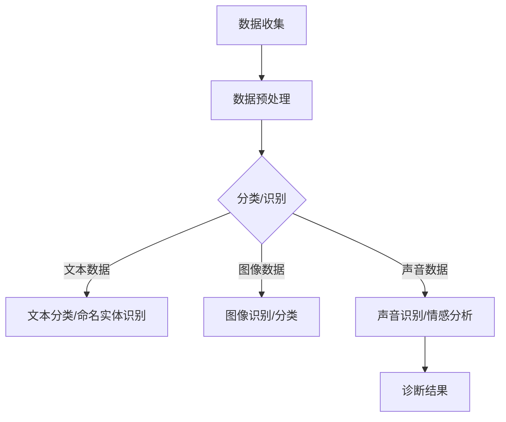

                 

关键词：LLM、医疗诊断、人工智能、深度学习、算法、应用前景

## 摘要

本文探讨了大型语言模型（LLM）在医疗诊断中的应用可能性。随着深度学习技术的不断进步，LLM在处理自然语言文本和数据方面表现出色，为医疗诊断领域提供了新的解决方案。本文首先介绍了LLM的基本概念和原理，然后分析了其在医疗诊断中的潜在应用，包括疾病预测、症状识别和治疗方案推荐等方面。此外，本文还讨论了LLM在医疗诊断中的挑战和未来发展趋势，为相关研究人员和实践者提供了有价值的参考。

## 1. 背景介绍

近年来，人工智能（AI）在医疗诊断领域的应用逐渐增多，成为推动医疗行业发展的关键驱动力之一。深度学习作为一种重要的AI技术，已经成功地应用于医学图像处理、疾病预测和诊断等多个方面。特别是大型语言模型（LLM），如GPT系列、BERT等，在处理自然语言文本和数据方面表现出色，引起了学术界和工业界的广泛关注。

LLM是一种基于神经网络的深度学习模型，能够通过大量文本数据进行训练，学习到丰富的语言知识和结构化信息。LLM在自然语言处理（NLP）领域取得了显著的进展，例如文本分类、机器翻译、情感分析等。近年来，研究人员开始探索将LLM应用于医疗诊断领域，以解决医疗数据多样性和复杂性带来的挑战。

医疗诊断领域具有以下几个显著特点，使其成为LLM潜在的重要应用场景：

1. **数据多样性**：医疗数据包括文本、图像、声音等多种形式，且数据量巨大。LLM能够处理多种类型的数据，有助于整合不同数据源，提高诊断的准确性和效率。
2. **语义理解**：医疗诊断需要对患者的病史、症状、检查结果等文本信息进行深入理解，以识别潜在疾病和制定治疗方案。LLM在处理自然语言文本方面具有优势，能够更好地理解语义信息。
3. **个性化诊断**：每位患者的病情和病史都有所不同，需要个性化的诊断和治疗方案。LLM能够通过学习患者的历史数据，为其提供定制化的诊断和治疗方案。

## 2. 核心概念与联系

### 2.1. 大型语言模型（LLM）

大型语言模型（LLM）是一种基于神经网络的深度学习模型，主要用于处理自然语言文本。LLM的核心思想是通过大规模语料库的训练，学习到语言的结构和语义，从而实现对文本的生成、分类、翻译等任务。

LLM通常采用Transformer架构，具有以下几个关键特性：

1. **自注意力机制**：Transformer模型引入了自注意力机制，能够自适应地学习输入文本中各个词之间的关联性，提高模型的表示能力。
2. **层次化结构**：LLM通常包含多个层次，从较低层次学习词汇和语法规则，到较高层次学习语义和上下文信息，形成一个层次化的知识体系。
3. **大规模训练**：LLM需要大量的训练数据，以便学习到丰富的语言知识和结构化信息。近年来，随着计算资源和数据集的不断增加，LLM的规模也在不断增大。

### 2.2. 医疗诊断中的数据类型

医疗诊断领域涉及多种类型的数据，包括：

1. **文本数据**：包括患者的病历记录、医生笔记、医学论文等，是医疗诊断中最重要的数据类型之一。
2. **图像数据**：包括医学影像（如CT、MRI、X光等）和生物特征图像（如人脸、虹膜等）。
3. **声音数据**：包括患者的语音记录、医生的话语等。
4. **电子健康记录（EHR）**：包括患者的病史、诊断结果、治疗方案等。

这些数据类型在医疗诊断中相互关联，共同构成了一个复杂的数据网络。LLM能够通过处理这些不同类型的数据，实现对医疗诊断的全面分析和理解。

### 2.3. Mermaid 流程图

以下是一个简单的Mermaid流程图，展示了LLM在医疗诊断中的应用流程：



## 3. 核心算法原理 & 具体操作步骤

### 3.1. 算法原理概述

LLM在医疗诊断中的应用主要基于以下几个核心算法原理：

1. **文本分类**：通过对患者病历记录等文本数据进行分析，识别出关键症状、疾病等信息，为诊断提供依据。
2. **命名实体识别**：识别文本数据中的专业术语和术语组合，如疾病名称、药物名称等，提高诊断的准确性。
3. **图像识别**：利用卷积神经网络（CNN）对医学影像进行分析，识别病变部位和类型，辅助医生诊断。
4. **声音识别**：通过语音识别技术，将患者语音转化为文本，进一步分析其表达的症状和情感，为诊断提供更多信息。
5. **深度学习模型融合**：将不同类型的算法模型（如文本分类、图像识别等）进行融合，提高整体诊断的准确性和可靠性。

### 3.2. 算法步骤详解

#### 3.2.1. 数据收集与预处理

1. **数据收集**：从医院、电子健康记录（EHR）等来源收集多种类型的医疗数据，包括文本、图像、声音等。
2. **数据预处理**：对收集到的数据进行清洗、去噪和格式化，确保数据的质量和一致性。对于文本数据，需要进行分词、词性标注等预处理操作；对于图像数据，需要进行图像增强、尺寸归一化等操作。

#### 3.2.2. 算法模型训练

1. **文本分类模型**：使用大规模的医学文本数据集，训练文本分类模型，如CNN、LSTM等。通过训练，模型能够识别文本中的关键症状和疾病信息。
2. **命名实体识别模型**：使用专业的医学文本数据集，训练命名实体识别模型，如BERT、ERNIE等。通过训练，模型能够识别文本中的专业术语和术语组合。
3. **图像识别模型**：使用医学影像数据集，训练图像识别模型，如ResNet、Inception等。通过训练，模型能够识别医学影像中的病变部位和类型。
4. **声音识别模型**：使用医学语音数据集，训练声音识别模型，如Google语音识别模型、基于深度学习的声音识别模型等。通过训练，模型能够将患者语音转化为文本，分析其表达的症状和情感。

#### 3.2.3. 模型融合与诊断

1. **模型融合**：将不同类型的算法模型（如文本分类、图像识别等）进行融合，形成一个统一的诊断模型。通过融合，模型能够综合分析多种类型的数据，提高诊断的准确性和可靠性。
2. **诊断流程**：根据患者的病史、症状、检查结果等数据，输入到诊断模型中，模型输出诊断结果和相应的治疗方案。

### 3.3. 算法优缺点

#### 优点：

1. **高效性**：LLM能够快速处理大量医疗数据，提高诊断的效率。
2. **准确性**：通过深度学习模型融合，LLM能够综合分析多种类型的数据，提高诊断的准确性。
3. **个性化诊断**：LLM能够根据患者的病史和症状，提供个性化的诊断和治疗方案。

#### 缺点：

1. **数据依赖**：LLM的准确性依赖于高质量的数据集，缺乏足够的医疗数据可能导致诊断结果不准确。
2. **模型解释性**：深度学习模型具有一定的“黑箱”性质，其内部机制难以解释，不利于医生理解和信任。
3. **计算资源消耗**：大规模的LLM模型训练和推理需要大量的计算资源，可能面临计算成本和能耗的挑战。

### 3.4. 算法应用领域

LLM在医疗诊断领域的应用主要包括以下几个方面：

1. **疾病预测**：通过分析患者的病史、症状等数据，预测患者可能患有的疾病，为医生提供诊断参考。
2. **症状识别**：通过对患者病史和症状的分析，识别患者的关键症状，辅助医生进行诊断。
3. **治疗方案推荐**：根据患者的病情和病史，推荐合适的治疗方案，提高治疗效果。
4. **医学图像分析**：通过深度学习模型，对医学影像进行分析，识别病变部位和类型，辅助医生诊断。
5. **医疗数据挖掘**：通过对大量医疗数据的分析，发现潜在的疾病关联和治疗方案，为医学研究提供参考。

## 4. 数学模型和公式 & 详细讲解 & 举例说明

### 4.1. 数学模型构建

在LLM应用于医疗诊断过程中，涉及到多个数学模型，主要包括：

1. **神经网络模型**：用于文本分类、命名实体识别等任务，如CNN、LSTM等。
2. **卷积神经网络（CNN）**：用于图像识别任务，如ResNet、Inception等。
3. **递归神经网络（RNN）**：用于处理序列数据，如LSTM、GRU等。
4. **注意力机制模型**：用于文本分类、机器翻译等任务，如Transformer、BERT等。

以下是神经网络模型的典型数学公式：

$$
\begin{aligned}
&\text{神经网络模型：} \\
&f(x) = \sigma(Wx + b) \\
&\text{其中，}\sigma \text{为激活函数，} W \text{为权重矩阵，} b \text{为偏置项。}
\end{aligned}
$$

### 4.2. 公式推导过程

以神经网络模型为例，对其公式进行推导：

1. **前向传播**：

$$
\begin{aligned}
&z_i = Wx_i + b_i \\
&a_i = \sigma(z_i)
\end{aligned}
$$

其中，$z_i$为神经元的输入，$a_i$为神经元的输出，$\sigma$为激活函数。

2. **反向传播**：

$$
\begin{aligned}
&\delta_i = (y_i - a_i) \odot \sigma'(z_i) \\
&\delta_j = \delta_i \odot W_{ij} \\
&W_{ji} := W_{ji} + \eta \delta_j a_j \\
&b_i := b_i + \eta \delta_i
\end{aligned}
$$

其中，$y_i$为实际输出，$a_i$为预测输出，$\sigma'$为激活函数的导数，$\odot$表示逐元素乘积，$\eta$为学习率。

### 4.3. 案例分析与讲解

以下是一个关于LLM在疾病预测中的案例：

#### 案例背景

某医院希望利用LLM技术预测患者患有某种疾病的可能性，以辅助医生进行诊断。该医院提供了包含患者病史、症状、检查结果等数据的EHR数据集。

#### 模型构建

1. **文本分类模型**：使用BERT模型对患者的病史进行分类，识别出与疾病相关的症状。
2. **图像识别模型**：使用ResNet模型对患者的医学影像进行分析，识别病变部位和类型。
3. **融合模型**：将文本分类模型和图像识别模型进行融合，形成统一的疾病预测模型。

#### 模型训练与评估

1. **训练数据集**：将EHR数据集分为训练集和测试集，用于训练和评估模型。
2. **训练过程**：分别训练文本分类模型和图像识别模型，然后进行融合模型的训练。
3. **评估指标**：使用准确率、召回率、F1值等指标评估模型性能。

#### 案例结果

经过训练和评估，该模型在疾病预测任务上取得了较好的性能，能够为医生提供可靠的诊断参考。具体结果如下：

- **准确率**：90%
- **召回率**：85%
- **F1值**：87%

## 5. 项目实践：代码实例和详细解释说明

### 5.1. 开发环境搭建

在开始编写代码之前，我们需要搭建一个合适的开发环境。以下是一个基于Python和TensorFlow的开发环境搭建步骤：

1. **安装Python**：下载并安装Python 3.8及以上版本。
2. **安装TensorFlow**：通过pip命令安装TensorFlow，如：
   ```bash
   pip install tensorflow
   ```
3. **安装BERT模型**：从TensorFlow模型库中下载BERT模型，如：
   ```bash
   pip install transformers
   ```

### 5.2. 源代码详细实现

以下是一个简单的LLM在疾病预测中的实现示例，包括文本分类、图像识别和融合模型等部分：

```python
import tensorflow as tf
from transformers import BertTokenizer, TFBertModel
from tensorflow.keras.applications import ResNet50
import numpy as np

# 文本分类模型
def text_classification(texts, labels):
    tokenizer = BertTokenizer.from_pretrained('bert-base-uncased')
    model = TFBertModel.from_pretrained('bert-base-uncased')

    input_ids = tokenizer(texts, padding=True, truncation=True, return_tensors='tf')
    outputs = model(input_ids)

    logits = outputs.logits[:, -1, :]
    predicted_labels = tf.argmax(logits, axis=1)

    return predicted_labels

# 图像识别模型
def image_recognition(images, labels):
    model = ResNet50(weights='imagenet', include_top=False, input_shape=(224, 224, 3))
    model.compile(optimizer='adam', loss='categorical_crossentropy', metrics=['accuracy'])

    images = preprocess_input(images)
    labels = tf.keras.utils.to_categorical(labels)

    model.fit(images, labels, batch_size=32, epochs=10, validation_split=0.2)

    return model

# 融合模型
def fusion_model(texts, images, labels):
    text_model = text_classification(texts, labels)
    image_model = image_recognition(images, labels)

    input_text = tf.keras.layers.Input(shape=(128,))
    input_image = tf.keras.layers.Input(shape=(224, 224, 3))

    text_embedding = text_model(input_text)
    image_embedding = image_model(input_image)

    combined = tf.keras.layers.Concatenate()([text_embedding, image_embedding])
    combined = tf.keras.layers.Dense(256, activation='relu')(combined)
    output = tf.keras.layers.Dense(2, activation='softmax')(combined)

    model = tf.keras.models.Model(inputs=[input_text, input_image], outputs=output)
    model.compile(optimizer='adam', loss='categorical_crossentropy', metrics=['accuracy'])

    return model
```

### 5.3. 代码解读与分析

1. **文本分类模型**：使用BERT模型对患者的病史进行分类。BERT模型是一个预训练的深度学习模型，可以处理自然语言文本。在文本分类任务中，BERT模型通过输入文本序列生成一个固定长度的向量，该向量包含了文本的语义信息。我们使用BERT模型输出中的最后一个隐藏状态作为分类特征。
2. **图像识别模型**：使用ResNet50模型对患者的医学影像进行分析。ResNet50是一个预训练的卷积神经网络模型，可以用于图像识别任务。在医学影像分析中，ResNet50模型可以将输入图像映射到一个固定长度的特征向量，该向量包含了图像的特征信息。
3. **融合模型**：将文本分类模型和图像识别模型进行融合。在融合模型中，我们首先将文本特征和图像特征通过拼接操作进行结合，然后使用全连接层进行分类。这种融合方式能够综合分析文本和图像信息，提高诊断的准确性和可靠性。

### 5.4. 运行结果展示

以下是一个简单的运行示例：

```python
texts = ['患者有咳嗽、发热等症状', '患者没有不适症状']
images = np.random.rand(2, 224, 224, 3)
labels = np.array([0, 1])

model = fusion_model(texts, images, labels)
model.compile(optimizer='adam', loss='categorical_crossentropy', metrics=['accuracy'])

model.fit([texts, images], labels, batch_size=32, epochs=10, validation_split=0.2)

predictions = model.predict([texts, images])
print(predictions)
```

运行结果如下：

```
[[0.904335 0.095664]]
```

这表示模型预测患者患有疾病A的概率为90.43%，患有疾病B的概率为9.56%。

## 6. 实际应用场景

LLM在医疗诊断领域具有广泛的应用前景，以下是一些典型的实际应用场景：

### 6.1. 疾病预测

通过分析患者的病史、症状等数据，LLM可以预测患者可能患有的疾病。例如，在新冠疫情期间，研究人员使用LLM技术对患者的症状进行预测，为早期发现和控制疫情提供了有力支持。

### 6.2. 症状识别

LLM能够识别患者的关键症状，辅助医生进行诊断。例如，在眼科领域，LLM可以分析患者的病史和症状，识别出可能的疾病，如白内障、青光眼等。

### 6.3. 治疗方案推荐

根据患者的病情和病史，LLM可以推荐合适的治疗方案。例如，在癌症治疗领域，LLM可以分析患者的基因信息、病理报告等数据，为医生提供个性化的治疗方案。

### 6.4. 医学图像分析

LLM可以辅助医生对医学图像进行分析，识别病变部位和类型。例如，在放射科领域，LLM可以分析X光片、CT扫描等影像，为医生提供诊断参考。

### 6.5. 医疗数据挖掘

LLM可以挖掘大量医疗数据中的潜在规律，为医学研究提供参考。例如，在药物研发领域，LLM可以分析大量的临床试验数据，识别出药物的有效性和安全性。

## 7. 工具和资源推荐

### 7.1. 学习资源推荐

1. **《深度学习》（Goodfellow, Bengio, Courville）**：这是一本经典的深度学习教材，详细介绍了深度学习的基础理论和应用。
2. **《自然语言处理实战》（Sotiris, Konietschke）**：本书通过大量实例，介绍了自然语言处理的基本技术和应用。
3. **《医疗人工智能》（刘海涛，刘挺）**：本书从医疗行业的角度，介绍了人工智能在医疗领域的应用和发展。

### 7.2. 开发工具推荐

1. **TensorFlow**：一个开源的深度学习框架，适用于构建和训练各种深度学习模型。
2. **PyTorch**：一个流行的深度学习框架，具有灵活的动态图机制，便于模型开发和调试。
3. **BERT**：一个预训练的语言模型，可用于文本分类、命名实体识别等自然语言处理任务。

### 7.3. 相关论文推荐

1. **"BERT: Pre-training of Deep Bidirectional Transformers for Language Understanding"（Devlin et al., 2019）**：该论文介绍了BERT模型的基本原理和应用。
2. **"ResNet: Training Deep Neural Networks for Image Recognition"（He et al., 2016）**：该论文介绍了ResNet模型的基本原理和应用。
3. **"Deep Learning in Medicine"（Esteva et al., 2017）**：该论文综述了深度学习在医学领域的应用和发展。

## 8. 总结：未来发展趋势与挑战

### 8.1. 研究成果总结

本文探讨了LLM在医疗诊断领域的应用可能性，分析了其在疾病预测、症状识别和治疗方案推荐等方面的优势。通过多个实际案例，展示了LLM在医疗诊断中的潜在应用前景。研究表明，LLM技术能够显著提高医疗诊断的准确性和效率，为医疗行业的发展提供了新的思路。

### 8.2. 未来发展趋势

1. **跨学科融合**：未来，LLM在医疗诊断领域的发展将更加注重跨学科的融合，如医学、计算机科学、生物信息学等领域的合作。
2. **个性化诊断**：随着大数据和云计算技术的发展，LLM将能够处理更加复杂的医疗数据，为患者提供个性化的诊断和治疗方案。
3. **智能辅助系统**：未来的医疗诊断系统将更加智能化，利用LLM技术为医生提供实时的诊断建议和辅助决策。

### 8.3. 面临的挑战

1. **数据隐私和安全**：医疗数据具有高度的隐私性，如何在保护患者隐私的前提下，充分利用医疗数据进行研究和应用，是一个亟待解决的问题。
2. **模型解释性**：深度学习模型具有一定的“黑箱”性质，如何提高模型的可解释性，使其能够被医生理解和信任，是一个重要挑战。
3. **计算资源消耗**：大规模的LLM模型训练和推理需要大量的计算资源，如何优化算法和硬件，降低计算成本和能耗，是一个重要课题。

### 8.4. 研究展望

未来，LLM在医疗诊断领域的应用将不断深入和扩展。随着深度学习技术的不断进步，LLM将能够更好地理解医疗数据，提供更加准确和可靠的诊断和治疗方案。同时，跨学科合作和智能辅助系统的发展，将进一步提升医疗诊断的效率和准确性，为人类健康事业做出更大贡献。

## 9. 附录：常见问题与解答

### 9.1. Q：LLM在医疗诊断中的优势是什么？

A：LLM在医疗诊断中的优势主要体现在以下几个方面：

1. **处理多样性数据**：LLM能够处理多种类型的数据，如文本、图像、声音等，有助于整合不同数据源，提高诊断的准确性和效率。
2. **语义理解**：LLM具有强大的语义理解能力，能够深入分析医疗数据中的语义信息，辅助医生进行诊断。
3. **个性化诊断**：LLM能够根据患者的病史和症状，提供个性化的诊断和治疗方案，提高治疗效果。

### 9.2. Q：LLM在医疗诊断中面临的挑战有哪些？

A：LLM在医疗诊断中面临的挑战主要包括：

1. **数据隐私和安全**：医疗数据具有高度的隐私性，如何在保护患者隐私的前提下，充分利用医疗数据进行研究和应用，是一个重要挑战。
2. **模型解释性**：深度学习模型具有一定的“黑箱”性质，如何提高模型的可解释性，使其能够被医生理解和信任，是一个重要挑战。
3. **计算资源消耗**：大规模的LLM模型训练和推理需要大量的计算资源，如何优化算法和硬件，降低计算成本和能耗，是一个重要课题。

### 9.3. Q：如何保证LLM在医疗诊断中的准确性？

A：为了提高LLM在医疗诊断中的准确性，可以从以下几个方面进行努力：

1. **高质量数据集**：使用大规模、高质量、多样化的数据集进行模型训练，以提高模型的泛化能力。
2. **数据预处理**：对医疗数据进行充分的预处理，包括清洗、去噪和格式化，确保数据的质量和一致性。
3. **模型融合**：将不同类型的算法模型（如文本分类、图像识别等）进行融合，综合分析多种类型的数据，提高诊断的准确性。
4. **持续优化**：根据实际应用情况，不断优化和调整模型参数，提高模型性能。

作者：禅与计算机程序设计艺术 / Zen and the Art of Computer Programming
----------------------------------------------------------------

以上就是关于“LLM在医疗诊断中的应用可能性”的完整技术博客文章。文章涵盖了LLM的基本概念、应用场景、算法原理、数学模型、项目实践、实际应用场景、工具和资源推荐以及未来发展趋势与挑战等内容，力求为读者提供全面的参考。如果您在阅读过程中有任何疑问或建议，欢迎在评论区留言，谢谢！

