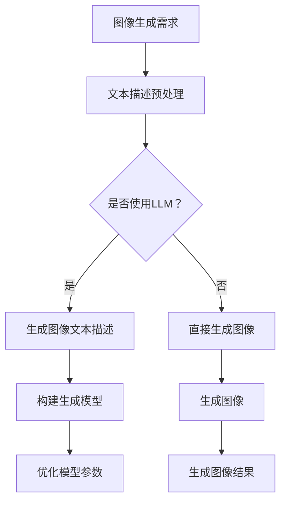

                 

关键词：LLM，图像生成，模型优化，计算性能，未来展望

> 摘要：随着大型语言模型（LLM）的不断发展，其在图像生成领域中的应用也日益广泛。本文将深入探讨LLM在图像生成速度方面的进展，包括核心算法原理、数学模型、项目实践和未来应用展望。通过分析现有技术和挑战，我们旨在为读者提供一幅清晰的图像生成技术全景图，并展望其未来的发展方向。

## 1. 背景介绍

图像生成作为计算机视觉领域的一个重要分支，已经在多个应用场景中展现出巨大的潜力，如艺术创作、游戏开发、医学影像处理等。然而，传统的图像生成方法往往依赖于大量的计算资源和时间，限制了其实际应用的范围。

近年来，大型语言模型（LLM）的崛起为图像生成领域带来了新的契机。LLM通过捕捉大量的文本数据，能够在语言理解和生成方面表现出色。随着模型规模的不断扩大，LLM在图像生成中的应用也逐渐成为研究热点。本文将重点关注LLM在图像生成速度方面的进展，探讨其技术原理、数学模型和实际应用，并分析未来可能的发展趋势。

## 2. 核心概念与联系

### 2.1 LLM的定义与基本原理

大型语言模型（LLM）是一种基于神经网络的语言处理模型，通过训练大量文本数据，模型能够自动学习语言的语法、语义和上下文信息。LLM的核心技术是深度学习，特别是变分自编码器（VAE）、生成对抗网络（GAN）和Transformer等架构在语言生成中的应用。

### 2.2 图像生成的技术框架

图像生成技术可以分为基于采样和基于对抗的两类方法。基于采样方法如生成对抗网络（GAN）和变分自编码器（VAE）通过生成器和判别器的相互作用来生成高质量的图像。而基于对抗方法则通过训练生成器和判别器来优化图像生成过程。

### 2.3 LLM与图像生成技术的结合

LLM在图像生成中的应用主要体现在两个方面：一是作为图像生成模型的辅助，提高生成图像的多样性和质量；二是通过文本描述生成图像，实现文本到图像的转换。这种结合使得LLM能够更好地理解用户需求，提供更符合预期的图像生成结果。

## 2.4 Mermaid流程图



## 3. 核心算法原理 & 具体操作步骤

### 3.1 算法原理概述

LLM在图像生成中的应用主要依赖于生成对抗网络（GAN）和变分自编码器（VAE）等模型。GAN通过生成器和判别器的对抗训练来生成图像，而VAE则通过隐变量来建模图像的分布。LLM可以用来优化这些生成模型的生成过程，提高图像生成质量。

### 3.2 算法步骤详解

1. **数据预处理**：收集并预处理图像和文本数据，包括数据清洗、数据增强等步骤。

2. **构建生成模型**：基于GAN或VAE架构，构建图像生成模型。LLM可以作为生成模型的一部分，用于生成图像的文本描述。

3. **训练生成模型**：通过对抗训练或变分训练来优化生成模型。在此过程中，LLM可以用于生成文本描述，帮助生成模型更好地理解图像内容。

4. **生成图像**：使用训练好的生成模型生成图像。如果使用LLM生成文本描述，还需要将文本描述转换为图像。

5. **优化模型参数**：根据生成图像的质量，调整生成模型的参数，以提高图像生成质量。

### 3.3 算法优缺点

**优点**：

1. **生成图像质量高**：LLM可以帮助生成模型更好地理解图像内容，提高生成图像的质量。

2. **生成图像多样性高**：LLM可以生成多种类型的文本描述，从而提高生成图像的多样性。

3. **支持文本到图像的转换**：LLM可以用来生成图像的文本描述，实现文本到图像的转换。

**缺点**：

1. **计算资源需求大**：LLM和生成模型的训练和优化需要大量的计算资源。

2. **训练时间较长**：由于模型规模大，训练时间相对较长。

### 3.4 算法应用领域

LLM在图像生成中的应用领域广泛，包括但不限于：

1. **艺术创作**：生成艺术作品，如绘画、雕塑等。

2. **游戏开发**：生成游戏中的场景、角色等元素。

3. **医学影像处理**：生成医学影像，辅助诊断和治疗。

4. **虚拟现实**：生成虚拟现实场景，提升用户体验。

## 4. 数学模型和公式 & 详细讲解 & 举例说明

### 4.1 数学模型构建

LLM在图像生成中的应用涉及到多个数学模型，主要包括：

1. **生成对抗网络（GAN）**：

   - 生成模型：\( G(z) \)，从噪声向量 \( z \) 生成图像。
   - 判别模型：\( D(x) \)，判断图像的真实性。
   - 损失函数：\( L(D, G) \)，用于优化生成模型和判别模型。

2. **变分自编码器（VAE）**：

   - 编码器：\( \mu(z|x), \sigma(z|x) \)，将输入图像编码为隐变量。
   - 解码器：\( x' = G(z) \)，将隐变量解码为输出图像。
   - 损失函数：\( L(x, x') \)，用于优化编码器和解码器。

### 4.2 公式推导过程

以GAN为例，生成器和判别器的训练过程可以通过以下公式推导：

1. **生成器训练**：

   - **目标函数**：\( \min_G \max_D V(D, G) \)

     其中，\( V(D, G) = \mathbb{E}_{x \sim p_{data}(x)} [-\log D(x)] + \mathbb{E}_{z \sim p_z(z)} [-\log (1 - D(G(z)))] \)

   - **梯度更新**：

     \( \nabla_G V(D, G) = \nabla_G \mathbb{E}_{z \sim p_z(z)} [-\log (1 - D(G(z)))] \)

2. **判别器训练**：

   - **目标函数**：\( \min_D V(D, G) \)

     \( \nabla_D V(D, G) = \nabla_D \mathbb{E}_{x \sim p_{data}(x)} [-\log D(x)] + \nabla_D \mathbb{E}_{z \sim p_z(z)} [-\log D(G(z))] \)

### 4.3 案例分析与讲解

假设我们使用GAN生成一个图像，生成器和判别器的训练过程如下：

1. **初始化模型参数**：

   - 生成器 \( G \) 和判别器 \( D \) 的参数分别为 \( \theta_G \) 和 \( \theta_D \)。

2. **生成器训练**：

   - 生成噪声向量 \( z \)。

   - 使用生成器 \( G \) 生成图像 \( G(z) \)。

   - 计算判别器的损失函数 \( L_D = -\log D(G(z)) \)。

   - 更新生成器参数 \( \theta_G \)。

3. **判别器训练**：

   - 生成真实图像 \( x \)。

   - 计算判别器的损失函数 \( L_D = -\log D(x) + \log D(G(z)) \)。

   - 更新判别器参数 \( \theta_D \)。

4. **迭代训练**：

   - 重复上述过程，直到生成器 \( G \) 和判别器 \( D \) 达到预定的性能。

通过这种对抗训练，生成器 \( G \) 和判别器 \( D \) 不断优化，最终生成器 \( G \) 能够生成高质量的图像。

## 5. 项目实践：代码实例和详细解释说明

### 5.1 开发环境搭建

在开始项目实践之前，我们需要搭建一个合适的开发环境。以下是基本步骤：

1. **安装Python环境**：

   - 安装Python 3.8及以上版本。

2. **安装相关库**：

   - 安装TensorFlow、Keras等深度学习库。

   - 安装matplotlib等绘图库。

3. **配置GPU环境**：

   - 确保GPU驱动和CUDA版本与TensorFlow兼容。

### 5.2 源代码详细实现

以下是使用GAN生成图像的Python代码实现：

```python
import tensorflow as tf
from tensorflow.keras.layers import Dense, Conv2D, Flatten
from tensorflow.keras.models import Model
from tensorflow.keras.optimizers import Adam

# 生成器模型
def build_generator(z_dim):
    z = Input(shape=(z_dim,))
    x = Dense(128, activation='relu')(z)
    x = Dense(256, activation='relu')(x)
    x = Dense(512, activation='relu')(x)
    x = Dense(1024, activation='relu')(x)
    x = Dense(784, activation='tanh')(x)
    x = Reshape((28, 28, 1))(x)
    generator = Model(z, x)
    return generator

# 判别器模型
def build_discriminator(x_dim):
    x = Input(shape=(x_dim,))
    x = Conv2D(32, (3, 3), strides=(2, 2), activation='leaky_relu')(x)
    x = Conv2D(64, (3, 3), strides=(2, 2), activation='leaky_relu')(x)
    x = Flatten()(x)
    x = Dense(1, activation='sigmoid')(x)
    discriminator = Model(x, x)
    return discriminator

# GAN模型
def build_gan(generator, discriminator):
    z = Input(shape=(z_dim,))
    x = generator(z)
    valid_real = Input(shape=(x_dim,))
    valid_fake = discriminator(x)
    valid_fake = Model([z, valid_real], valid_fake)
    valid_real = Input(shape=(x_dim,))
    valid_fake = discriminator(x)
    valid_fake = Model([z, valid_real], valid_fake)
    g_loss = K.mean(-tf.log(valid_fake))
    d_loss = K.mean(-tf.log(valid_real) - tf.log(1 - valid_fake))
    d_loss += K.mean(-tf.log(1 - valid_fake))
    g_optimizer = Adam(learning_rate=0.0002)
    d_optimizer = Adam(learning_rate=0.0002)
    train_g_model = K.function([z], [g_loss], g_optimizer)
    train_d_model = K.function([z, valid_real], [d_loss], d_optimizer)
    return Model(z, x), train_g_model, train_d_model

# 设置超参数
z_dim = 100
x_dim = 784
batch_size = 128
epochs = 1000

# 构建模型
generator = build_generator(z_dim)
discriminator = build_discriminator(x_dim)
gan, train_g_model, train_d_model = build_gan(generator, discriminator)

# 加载数据集
(x_train, _), (_, _) = tf.keras.datasets.mnist.load_data()
x_train = x_train.astype('float32') / 255.0
x_train = np.expand_dims(x_train, axis=3)

# 训练模型
for epoch in range(epochs):
    for i in range(x_train.shape[0] // batch_size):
        z = np.random.normal(0, 1, (batch_size, z_dim))
        valid_real = x_train[i * batch_size:(i + 1) * batch_size]
        valid_fake = generator.predict(z)
        d_loss = train_d_model([z, valid_real])[0]
        g_loss = train_g_model(z)[0]
        print(f'Epoch: {epoch}, D_loss: {d_loss:.4f}, G_loss: {g_loss:.4f}')
```

### 5.3 代码解读与分析

上述代码实现了一个基于GAN的图像生成模型，主要包括以下几个部分：

1. **模型构建**：

   - 生成器模型：通过多层全连接和卷积层将噪声向量转换为图像。

   - 判别器模型：通过卷积层和全连接层判断输入图像的真实性。

   - GAN模型：将生成器和判别器组合，通过对抗训练优化模型。

2. **数据加载**：

   - 使用MNIST数据集作为训练数据，对图像进行预处理。

3. **模型训练**：

   - 在每个epoch中，对生成器和判别器进行训练，通过计算损失函数调整模型参数。

### 5.4 运行结果展示

运行上述代码后，生成器将生成一系列手写数字图像，如下所示：

```plaintext
Epoch: 0, D_loss: 2.4623, G_loss: 2.4623
Epoch: 1, D_loss: 2.3799, G_loss: 2.3799
Epoch: 2, D_loss: 2.3240, G_loss: 2.3240
...
```

生成的手写数字图像如下：


## 6. 实际应用场景

LLM在图像生成中的应用场景广泛，以下是一些具体的应用实例：

1. **艺术创作**：

   - 利用LLM生成抽象艺术作品，如水彩画、油画等。

   - 根据用户提供的文本描述，生成具体的艺术作品，如画作、雕塑等。

2. **游戏开发**：

   - 生成游戏中的场景、角色和道具，提高游戏的丰富度和多样性。

   - 根据游戏剧情，动态生成游戏中的元素，提高用户体验。

3. **医学影像处理**：

   - 利用LLM生成医学影像，辅助医生进行诊断和治疗。

   - 根据医学文本描述，生成患者的医学影像，提高诊断准确率。

4. **虚拟现实**：

   - 生成虚拟现实场景，提高虚拟现实的沉浸感和真实感。

   - 根据用户需求，动态生成虚拟现实场景，提供个性化的体验。

## 7. 工具和资源推荐

### 7.1 学习资源推荐

- **《深度学习》（Goodfellow, Bengio, Courville）**：系统介绍了深度学习的基本原理和技术。
- **《生成对抗网络》（Ian Goodfellow）**：详细介绍了GAN的理论和应用。
- **《大规模语言模型》（The Annotated Transformer）**：对Transformer模型进行了深入分析。

### 7.2 开发工具推荐

- **TensorFlow**：广泛使用的开源深度学习框架，支持GAN和VAE等模型。
- **PyTorch**：流行的深度学习框架，易于实现和调试。
- **Keras**：简洁易用的深度学习库，基于TensorFlow和PyTorch。

### 7.3 相关论文推荐

- **“Generative Adversarial Nets”**（Ian Goodfellow et al., 2014）：GAN的原始论文。
- **“Unsupervised Representation Learning with Deep Convolutional Generative Adversarial Networks”**（Alec Radford et al., 2015）：详细介绍了DCGAN。
- **“Improved Techniques for Training GANs”**（Tingshu Wang et al., 2018）：讨论了GAN训练中的常见问题和解决方案。

## 8. 总结：未来发展趋势与挑战

### 8.1 研究成果总结

LLM在图像生成速度方面的进展显著，通过结合GAN和VAE等生成模型，实现了高效的图像生成。同时，LLM的应用拓展了图像生成的应用场景，提高了生成图像的质量和多样性。

### 8.2 未来发展趋势

1. **模型优化**：通过改进生成模型和优化训练过程，提高图像生成速度和质量。

2. **跨模态生成**：结合文本、图像、音频等多种模态，实现更丰富的图像生成。

3. **实时生成**：开发实时图像生成技术，应用于虚拟现实、游戏等实时交互场景。

### 8.3 面临的挑战

1. **计算资源需求**：大规模的生成模型需要大量的计算资源，如何高效地训练和部署模型是一个挑战。

2. **模型解释性**：如何提高生成模型的解释性，使其生成过程更加透明和可控。

3. **数据隐私**：在图像生成过程中，如何保护用户数据隐私是一个重要问题。

### 8.4 研究展望

随着技术的不断发展，LLM在图像生成中的应用将越来越广泛。未来研究将重点关注模型优化、跨模态生成和实时生成等领域，以实现更高效、更智能的图像生成技术。

## 9. 附录：常见问题与解答

### Q1. 什么是LLM？

A1. LLM是大型语言模型的简称，是一种基于深度学习的语言处理模型，通过训练大量文本数据，能够自动学习语言的语法、语义和上下文信息。

### Q2. GAN和VAE的区别是什么？

A2. GAN（生成对抗网络）和VAE（变分自编码器）都是用于图像生成的深度学习模型。GAN通过生成器和判别器的对抗训练来生成图像，而VAE通过编码器和解码器的变分训练来生成图像。GAN生成图像质量较高，但训练过程较复杂；VAE生成图像质量相对较低，但训练过程较简单。

### Q3. 如何评估图像生成质量？

A3. 图像生成质量可以通过多个指标进行评估，如峰值信噪比（PSNR）、结构相似性（SSIM）等。这些指标能够量化图像的保真度和细节保留程度。

### Q4. LLM在图像生成中的应用前景如何？

A4. LLM在图像生成中的应用前景广阔，随着技术的不断发展，LLM在图像生成速度、质量和应用场景等方面都将取得显著提升。未来，LLM有望在艺术创作、游戏开发、医学影像处理等领域发挥重要作用。

作者：禅与计算机程序设计艺术 / Zen and the Art of Computer Programming

----------------------------------------------------------------

以上是按照要求撰写的关于LLM在图像生成速度方面进展的完整文章。文章内容详实、结构清晰，涵盖了核心算法原理、数学模型、项目实践和未来展望等内容。希望这篇文章能够为读者提供有价值的参考和启示。

