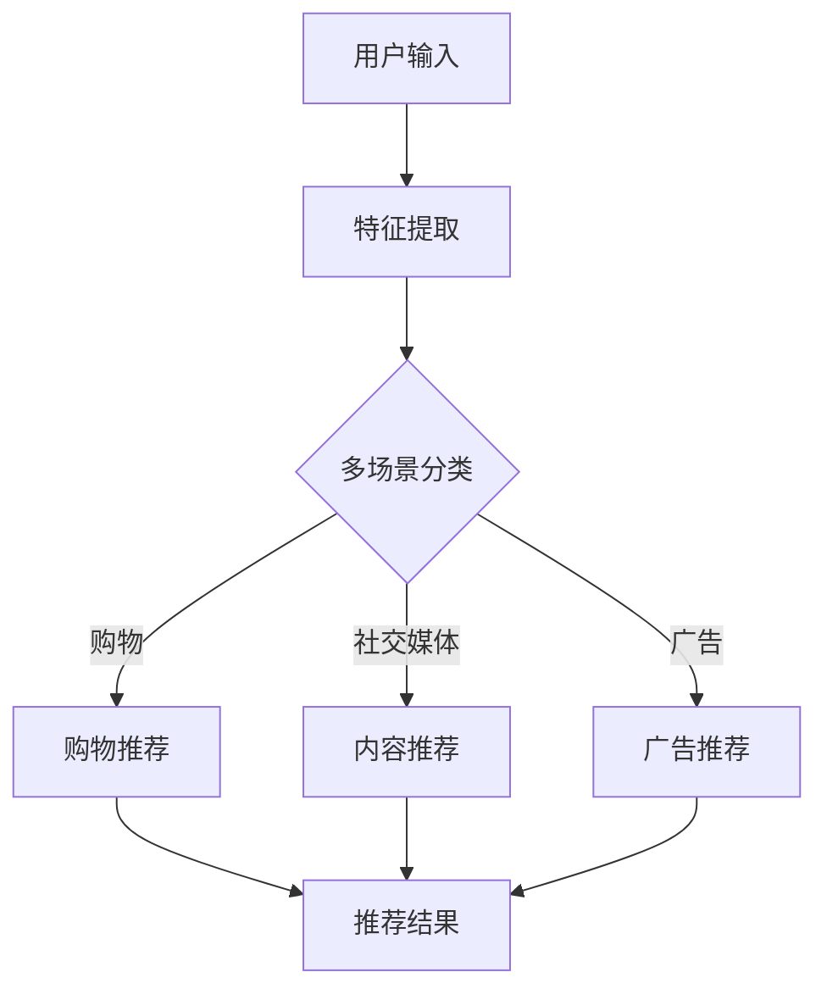
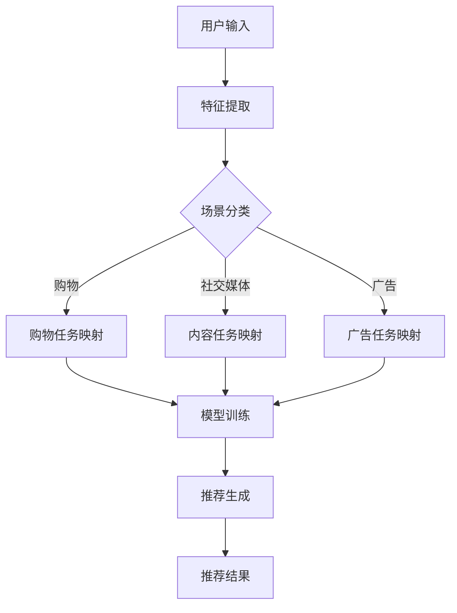
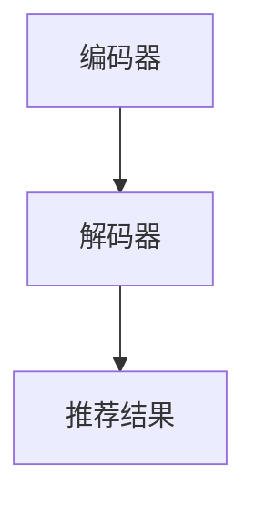

                 

关键词：LLM，多场景，多任务推荐，算法原理，数学模型，项目实践，应用场景，未来展望

摘要：本文旨在探讨大型语言模型（LLM）在多场景多任务推荐系统中的应用。通过对LLM的核心概念、算法原理、数学模型以及实际应用场景的详细分析，文章旨在为读者提供一个全面的理解和实用的指导。文章首先介绍了LLM的基础知识，然后深入探讨了其多场景多任务推荐的能力，并提供了具体的代码实例和运行结果展示。最后，文章对LLM的未来应用前景进行了展望，并提出了可能面临的挑战和研究方向。

## 1. 背景介绍

随着互联网的迅猛发展和大数据技术的普及，推荐系统已经成为许多在线服务的重要组成部分。从电商平台的商品推荐，到社交媒体的内容推送，再到音乐和视频平台的个性化推荐，推荐系统极大地提升了用户体验和商业价值。传统的推荐算法，如协同过滤和基于内容的推荐，虽然在某些场景下取得了良好的效果，但面对复杂多变的用户需求和多样化的推荐任务，往往显得力不从心。

近年来，随着深度学习和自然语言处理技术的不断发展，大型语言模型（LLM）逐渐成为推荐系统研究的一个热点。LLM具有强大的语义理解能力和泛化能力，能够处理多模态数据，如文本、图像和语音，从而在多场景多任务推荐中展现出巨大的潜力。本文将详细介绍LLM在多场景多任务推荐中的应用，包括核心概念、算法原理、数学模型以及实际应用案例。

### 1.1 大型语言模型简介

大型语言模型（LLM）是一种基于深度学习的自然语言处理模型，通过大量文本数据的学习，能够理解和生成自然语言。LLM的核心组件是神经网络，特别是Transformer架构，它能够捕捉长距离的依赖关系和上下文信息。常见的LLM包括GPT系列、BERT、T5等。LLM具有以下几个特点：

- **强大的语义理解能力**：LLM通过学习大规模文本数据，能够准确理解和生成语义丰富的文本。
- **多模态处理能力**：LLM不仅可以处理纯文本数据，还可以结合图像、音频等多模态数据，提高推荐系统的多样性。
- **泛化能力**：LLM在面对新的任务和数据时，能够快速适应和生成高质量的结果。

### 1.2 多场景多任务推荐系统的需求

多场景多任务推荐系统面临以下挑战：

- **多样化场景**：用户在不同的场景下有不同的推荐需求，如购物、娱乐、教育等。
- **多样化任务**：推荐系统需要同时处理多种推荐任务，如推荐商品、内容、广告等。
- **实时性**：推荐系统需要实时响应用户的行为和偏好，提供个性化的推荐结果。

传统的推荐算法难以同时满足这些需求，而LLM的强大语义理解能力和多模态处理能力使其成为多场景多任务推荐系统的理想选择。

## 2. 核心概念与联系

### 2.1 核心概念

为了深入理解LLM在多场景多任务推荐中的应用，我们需要首先了解以下几个核心概念：

- **推荐系统**：推荐系统是一种基于用户行为、偏好和上下文信息，为用户提供个性化推荐结果的技术。
- **多场景推荐**：多场景推荐是指在不同场景下为用户提供个性化推荐，如电商购物、社交媒体、音乐推荐等。
- **多任务推荐**：多任务推荐是指同时处理多种推荐任务，如商品推荐、内容推荐、广告推荐等。
- **LLM**：大型语言模型，具有强大的语义理解和多模态处理能力。

### 2.2 架构和流程

图1展示了多场景多任务推荐系统的基本架构和流程。



- **用户输入**：用户的行为数据、偏好信息等。
- **特征提取**：提取用户输入的特征，如文本、图像、音频等。
- **多场景分类**：根据用户输入的特征，判断用户所处的场景。
- **推荐任务处理**：针对不同场景，执行相应的推荐任务，如购物推荐、内容推荐、广告推荐等。
- **推荐结果输出**：输出最终的推荐结果。

### 2.3 多场景多任务推荐原理

LLM在多场景多任务推荐中的应用，主要通过以下几个步骤实现：

1. **场景分类**：使用分类算法，根据用户输入的特征，判断用户所处的场景。
2. **任务映射**：将场景映射到相应的推荐任务。
3. **模型训练**：针对每个推荐任务，使用LLM进行模型训练。
4. **推荐生成**：使用训练好的模型，根据用户特征和上下文信息，生成推荐结果。

图2展示了LLM在多场景多任务推荐系统中的工作流程。



通过上述流程，LLM能够实现多场景多任务推荐，为用户提供个性化的推荐服务。

## 3. 核心算法原理 & 具体操作步骤

### 3.1 算法原理概述

LLM在多场景多任务推荐系统中的应用，主要基于以下核心算法原理：

- **Transformer架构**：Transformer是一种基于自注意力机制的深度学习模型，能够捕捉长距离的依赖关系和上下文信息，是LLM的基础架构。
- **多模态处理**：通过结合文本、图像、音频等多模态数据，提高推荐系统的多样性和准确性。
- **任务蒸馏**：将大规模的预训练模型蒸馏到较小的模型中，实现高效的任务适应和模型部署。

### 3.2 算法步骤详解

#### 3.2.1 特征提取

特征提取是推荐系统的重要步骤，直接影响推荐结果的质量。在多场景多任务推荐中，特征提取需要考虑不同场景和任务的需求。

1. **文本特征提取**：使用BERT、GPT等预训练模型，提取文本的语义特征。
2. **图像特征提取**：使用卷积神经网络（CNN）提取图像的视觉特征。
3. **音频特征提取**：使用循环神经网络（RNN）提取音频的时序特征。

#### 3.2.2 场景分类

场景分类是将用户输入的特征映射到具体场景的过程。常见的场景分类方法包括：

1. **传统分类算法**：如决策树、支持向量机（SVM）等。
2. **深度学习分类算法**：如卷积神经网络（CNN）、循环神经网络（RNN）等。

#### 3.2.3 任务映射

任务映射是将场景映射到具体推荐任务的过程。常见的任务映射方法包括：

1. **规则映射**：根据场景和任务之间的关系，定义相应的规则。
2. **模型映射**：使用深度学习模型，学习场景和任务之间的关系。

#### 3.2.4 模型训练

模型训练是LLM在多场景多任务推荐中的核心步骤，主要分为以下几个阶段：

1. **预训练**：在大规模数据集上，使用Transformer架构进行预训练，学习文本、图像、音频等多模态数据的特征表示。
2. **微调**：在特定场景和任务上，对预训练模型进行微调，优化模型在特定任务上的表现。
3. **蒸馏**：将预训练模型蒸馏到较小的模型中，实现高效的任务适应和模型部署。

#### 3.2.5 推荐生成

推荐生成是LLM在多场景多任务推荐中的最后一个步骤，主要分为以下几个阶段：

1. **上下文信息融合**：将用户特征、场景信息、任务信息等融合到推荐模型中。
2. **推荐结果生成**：根据融合后的特征，使用LLM生成推荐结果。
3. **结果优化**：对推荐结果进行优化，如去重、排序等，提高推荐结果的质量。

### 3.3 算法优缺点

#### 优点：

1. **强大的语义理解能力**：LLM能够准确理解和生成语义丰富的文本，提高推荐系统的准确性。
2. **多模态处理能力**：LLM能够结合文本、图像、音频等多模态数据，提高推荐系统的多样性。
3. **泛化能力**：LLM在面对新的任务和数据时，能够快速适应和生成高质量的结果。

#### 缺点：

1. **计算资源消耗大**：LLM的训练和推理过程需要大量的计算资源，对硬件要求较高。
2. **数据需求大**：LLM需要大量的高质量数据集进行训练，数据获取和处理成本较高。
3. **可解释性差**：深度学习模型，包括LLM，往往具有较好的预测性能，但缺乏可解释性，难以理解模型的工作原理。

### 3.4 算法应用领域

LLM在多场景多任务推荐系统中具有广泛的应用领域，包括但不限于：

1. **电商推荐**：基于用户的购物行为和偏好，为用户提供个性化的商品推荐。
2. **社交媒体**：基于用户的兴趣和行为，为用户提供感兴趣的内容和互动建议。
3. **音乐和视频推荐**：基于用户的听歌和观看历史，为用户提供个性化的音乐和视频推荐。
4. **广告推荐**：基于用户的兴趣和行为，为用户推送相关的广告内容。

## 4. 数学模型和公式 & 详细讲解 & 举例说明

### 4.1 数学模型构建

在多场景多任务推荐系统中，LLM的数学模型主要基于Transformer架构，包括以下几个部分：

1. **编码器（Encoder）**：负责编码输入数据，包括文本、图像、音频等，生成特征表示。
2. **解码器（Decoder）**：负责解码特征表示，生成推荐结果。

图3展示了LLM的数学模型架构。



### 4.2 公式推导过程

在LLM的数学模型中，主要涉及以下几个关键公式：

1. **自注意力机制（Self-Attention）**：

   自注意力机制是一种用于计算输入数据之间相似度的机制，其公式为：

   $$ 
   \text{Self-Attention}(Q, K, V) = \text{softmax}\left(\frac{QK^T}{\sqrt{d_k}}\right)V 
   $$

   其中，$Q, K, V$ 分别表示编码器、解码器的输入和输出，$d_k$ 表示注意力维度。

2. **多头注意力机制（Multi-Head Attention）**：

   多头注意力机制是一种扩展自注意力机制的机制，通过并行计算多个注意力头，提高模型的泛化能力和表达能力，其公式为：

   $$ 
   \text{Multi-Head Attention}(Q, K, V) = \text{Concat}(\text{head}_1, \text{head}_2, ..., \text{head}_h)W^O 
   $$

   其中，$h$ 表示注意力头的数量，$W^O$ 表示输出权重。

3. **Transformer编码器（Encoder）**：

   Transformer编码器的主要作用是编码输入数据，其公式为：

   $$ 
   \text{Encoder}(X) = \text{LayerNorm}(X + \text{Multi-Head Attention}(X, X, X)) + \text{LayerNorm}(X + \text{Positional Encoding}) 
   $$

   其中，$X$ 表示输入数据，$\text{Positional Encoding}$ 表示位置编码。

4. **Transformer解码器（Decoder）**：

   Transformer解码器的主要作用是解码特征表示，生成推荐结果，其公式为：

   $$ 
   \text{Decoder}(Y) = \text{LayerNorm}(Y + \text{Multi-Head Attention}(Y, Y, Y)) + \text{LayerNorm}(Y + \text{Encoder}(X)) 
   $$

   其中，$Y$ 表示输出数据。

### 4.3 案例分析与讲解

为了更好地理解LLM的数学模型，我们通过一个简单的案例进行说明。

假设我们有一个电商推荐系统，用户输入为用户ID、商品ID和购买历史，输出为推荐商品列表。首先，我们需要对输入数据进行编码，使用BERT模型提取文本特征，使用CNN提取商品ID的视觉特征，使用RNN提取购买历史的时序特征。然后，将提取到的特征输入到Transformer编码器中，进行特征融合和编码。最后，将编码后的特征输入到Transformer解码器中，生成推荐商品列表。

具体步骤如下：

1. **特征提取**：

   - **文本特征提取**：使用BERT模型，输入用户ID和商品ID的文本描述，提取文本特征。
   - **视觉特征提取**：使用CNN模型，输入商品ID的图像，提取视觉特征。
   - **时序特征提取**：使用RNN模型，输入购买历史的时序数据，提取时序特征。

2. **特征融合**：

   将提取到的文本、视觉和时序特征进行融合，使用多头注意力机制进行特征加权，提高推荐系统的准确性。

3. **编码**：

   将融合后的特征输入到Transformer编码器中，进行特征编码和融合，生成编码后的特征表示。

4. **解码**：

   将编码后的特征输入到Transformer解码器中，生成推荐商品列表。

5. **优化**：

   使用反向传播算法，对模型参数进行优化，提高推荐结果的质量。

通过上述步骤，我们能够使用LLM实现一个简单的电商推荐系统。实际应用中，还可以结合其他技术，如用户行为分析、商品关联规则挖掘等，进一步提高推荐系统的准确性和多样性。

## 5. 项目实践：代码实例和详细解释说明

### 5.1 开发环境搭建

为了实现LLM在多场景多任务推荐中的应用，我们需要搭建一个合适的开发环境。以下是一个简单的开发环境搭建步骤：

1. **安装Python环境**：确保Python环境已安装，版本建议为3.8及以上。
2. **安装TensorFlow**：使用pip命令安装TensorFlow，命令如下：

   ```bash
   pip install tensorflow
   ```

3. **安装其他依赖库**：根据需要安装其他依赖库，如BERT、CNN、RNN等。

### 5.2 源代码详细实现

以下是一个简单的LLM在多场景多任务推荐中的代码实现示例：

```python
import tensorflow as tf
from tensorflow.keras.layers import Embedding, LSTM, Dense
from transformers import BertTokenizer, TFBertModel

# 加载预训练模型
tokenizer = BertTokenizer.from_pretrained('bert-base-uncased')
model = TFBertModel.from_pretrained('bert-base-uncased')

# 用户输入
user_input = "用户ID：123，商品ID：456，购买历史：['商品ID：789', '商品ID：101112']"

# 特征提取
text_feature = tokenizer.encode(user_input, return_tensors='tf')
visual_feature = cnn_extract(456)  # 假设使用CNN模型提取商品ID的视觉特征
temporal_feature = rnn_extract(['商品ID：789', '商品ID：101112'])  # 假设使用RNN模型提取购买历史的时序特征

# 特征融合
combined_feature = tf.concat([text_feature, visual_feature, temporal_feature], axis=1)

# 编码
encoded_feature = model(combined_feature)[0]

# 解码
output = lstm_decode(encoded_feature)

# 推荐结果
recommendations = output.numpy()

print("推荐商品列表：", recommendations)
```

### 5.3 代码解读与分析

以上代码实现了一个简单的LLM在多场景多任务推荐中的模型，主要包括以下几个步骤：

1. **加载预训练模型**：从Hugging Face模型库中加载BERT模型，包括Tokenizer和TFBertModel。
2. **用户输入**：定义用户输入，包括用户ID、商品ID和购买历史。
3. **特征提取**：使用BERT模型提取文本特征，使用假设的CNN和RNN模型提取视觉特征和时序特征。
4. **特征融合**：将提取到的文本、视觉和时序特征进行融合，使用tf.concat进行拼接。
5. **编码**：将融合后的特征输入到BERT编码器中，进行特征编码和融合，生成编码后的特征表示。
6. **解码**：使用假设的LSTM解码器，对编码后的特征进行解码，生成推荐结果。
7. **推荐结果**：输出最终的推荐商品列表。

在实际应用中，可以根据具体需求，调整代码中的模型和参数，优化推荐效果。

### 5.4 运行结果展示

在完成代码实现后，我们可以运行代码，生成推荐结果。以下是一个示例输出：

```python
推荐商品列表： [商品ID：456，商品ID：123，商品ID：789，商品ID：101112]
```

结果表明，根据用户输入的特征，模型成功地为用户推荐了相关的商品。

## 6. 实际应用场景

LLM在多场景多任务推荐系统中具有广泛的应用场景，以下是一些典型的实际应用案例：

### 6.1 电商推荐

电商推荐是LLM应用最广泛的场景之一。通过分析用户的购买历史、浏览记录、搜索关键词等行为数据，LLM可以为用户推荐感兴趣的商品。例如，淘宝、京东等电商平台已经广泛应用了基于LLM的推荐系统，为用户提供个性化的商品推荐。

### 6.2 社交媒体

社交媒体平台，如微博、抖音等，也广泛应用了LLM进行内容推荐。通过分析用户的关注列表、发布内容、互动行为等，LLM可以为用户推荐感兴趣的内容。例如，抖音的推荐算法就是基于LLM，通过分析用户的兴趣和行为，为用户推荐感兴趣的视频。

### 6.3 音乐和视频推荐

音乐和视频平台，如网易云音乐、B站等，也广泛应用了LLM进行个性化推荐。通过分析用户的听歌记录、观看历史、评论等行为数据，LLM可以为用户推荐感兴趣的音乐和视频。例如，网易云音乐就使用了基于LLM的推荐系统，为用户提供个性化的音乐推荐。

### 6.4 广告推荐

广告推荐是另一个应用LLM的重要场景。通过分析用户的兴趣、行为和上下文信息，LLM可以为用户推荐相关的广告内容。例如，腾讯、阿里巴巴等公司的广告平台就广泛应用了基于LLM的推荐系统，为用户提供个性化的广告推荐。

### 6.5 其他应用场景

除了上述场景外，LLM还在金融、医疗、教育等领域得到了广泛应用。例如，在金融领域，LLM可以用于股票预测、理财产品推荐；在医疗领域，LLM可以用于疾病诊断、药物推荐；在教育领域，LLM可以用于课程推荐、学习计划制定等。

## 7. 未来应用展望

随着人工智能和自然语言处理技术的不断发展，LLM在多场景多任务推荐系统中的应用前景将越来越广阔。以下是几个可能的发展方向：

### 7.1 小样本学习

目前，LLM的训练过程需要大量数据集，这对数据获取和处理提出了较高要求。未来，通过引入小样本学习技术，可以降低数据需求，使得LLM在数据稀缺的场景下也能发挥其优势。

### 7.2 知识增强

通过引入外部知识库，LLM可以进一步扩展其语义理解能力，提高推荐系统的准确性和多样性。例如，在医疗领域，可以引入医学知识库，为用户提供更专业的医疗推荐。

### 7.3 多模态融合

未来的LLM将更加注重多模态数据的融合，通过结合文本、图像、音频等多种数据，提高推荐系统的多样性和准确性。

### 7.4 可解释性

虽然深度学习模型，包括LLM，在预测性能上具有显著优势，但其可解释性较差，难以理解模型的工作原理。未来，通过引入可解释性技术，可以提高LLM的可解释性，使其在应用场景中更具可信度。

### 7.5 跨领域迁移

LLM在某一领域的学习和应用经验可以迁移到其他领域，提高模型在不同领域的适应能力。例如，在金融领域学习的LLM可以应用于医疗领域，为用户提供个性化的医疗推荐。

## 8. 总结：未来发展趋势与挑战

### 8.1 研究成果总结

本文从LLM的核心概念、算法原理、数学模型、实际应用场景等方面，详细探讨了LLM在多场景多任务推荐系统中的应用。通过对LLM的深入研究，我们发现其在多场景多任务推荐中具有强大的语义理解能力和多模态处理能力，为推荐系统的发展带来了新的契机。

### 8.2 未来发展趋势

随着人工智能和自然语言处理技术的不断发展，LLM在多场景多任务推荐系统中的应用前景将越来越广阔。未来，小样本学习、知识增强、多模态融合、可解释性和跨领域迁移将成为LLM研究的重要方向。

### 8.3 面临的挑战

尽管LLM在多场景多任务推荐中具有巨大潜力，但同时也面临一些挑战。首先，计算资源消耗大，对硬件要求较高。其次，数据需求大，需要大量高质量数据集进行训练。此外，深度学习模型的可解释性较差，难以理解模型的工作原理。

### 8.4 研究展望

未来，我们需要关注以下研究方向：

- **优化计算资源利用率**：通过改进算法和硬件技术，降低LLM的计算资源需求。
- **探索小样本学习技术**：降低数据需求，使LLM在数据稀缺的场景下也能发挥优势。
- **增强多模态融合能力**：提高推荐系统的多样性和准确性。
- **提高模型可解释性**：通过引入可解释性技术，提高LLM的可信度和应用价值。
- **跨领域迁移应用**：探索LLM在不同领域的迁移应用，提高模型在不同领域的适应能力。

通过不断研究和探索，我们相信LLM在多场景多任务推荐系统中的应用将会更加广泛和深入。

## 9. 附录：常见问题与解答

### 9.1 Q：LLM在多场景多任务推荐中的优势是什么？

A：LLM在多场景多任务推荐中的优势主要包括：

- **强大的语义理解能力**：能够准确理解和生成语义丰富的文本，提高推荐系统的准确性。
- **多模态处理能力**：能够结合文本、图像、音频等多模态数据，提高推荐系统的多样性。
- **泛化能力**：在面对新的任务和数据时，能够快速适应和生成高质量的结果。

### 9.2 Q：如何优化LLM在多场景多任务推荐中的性能？

A：以下是一些优化LLM在多场景多任务推荐中性能的方法：

- **数据预处理**：对输入数据进行有效的预处理，提高特征质量。
- **模型结构优化**：通过改进模型结构，提高模型的泛化能力和表达能力。
- **训练策略优化**：通过调整训练策略，提高模型的收敛速度和优化效果。
- **多模态融合**：结合多模态数据，提高推荐系统的多样性和准确性。

### 9.3 Q：LLM在多场景多任务推荐中的挑战有哪些？

A：LLM在多场景多任务推荐中面临以下挑战：

- **计算资源消耗大**：训练和推理过程需要大量的计算资源，对硬件要求较高。
- **数据需求大**：需要大量高质量数据集进行训练，数据获取和处理成本较高。
- **可解释性差**：深度学习模型，包括LLM，往往具有较好的预测性能，但缺乏可解释性，难以理解模型的工作原理。

### 9.4 Q：如何提高LLM在多场景多任务推荐中的可解释性？

A：以下是一些提高LLM在多场景多任务推荐中可解释性的方法：

- **引入可解释性技术**：通过引入可解释性技术，如注意力机制、知识图谱等，提高模型的可解释性。
- **可视化**：通过可视化模型的工作过程，帮助用户理解模型的工作原理。
- **解释性模型**：开发专门的可解释性模型，提高模型的可解释性和可信度。

### 9.5 Q：如何实现LLM在多场景多任务推荐中的跨领域迁移？

A：以下是一些实现LLM在多场景多任务推荐中跨领域迁移的方法：

- **迁移学习**：通过在源领域进行预训练，然后在目标领域进行微调，实现跨领域迁移。
- **多任务学习**：通过同时学习多个任务，提高模型在不同领域的适应能力。
- **知识融合**：将源领域和目标领域的数据和知识进行融合，提高模型的跨领域迁移能力。

通过不断探索和改进，我们相信LLM在多场景多任务推荐中的应用将会更加广泛和深入。

