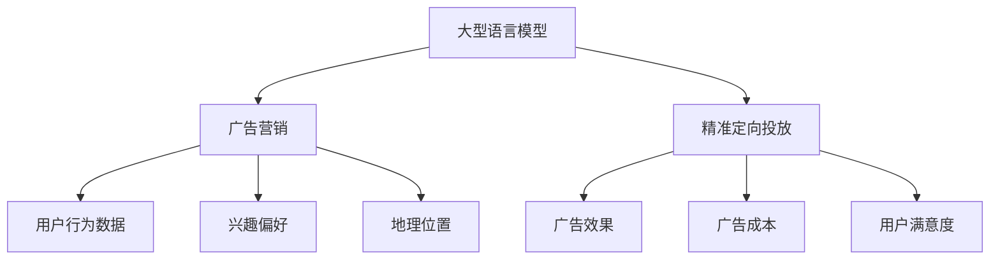

                 

关键词：大型语言模型、广告营销、精准定向投放、人工智能、机器学习、自然语言处理、用户行为分析、广告投放策略

## 摘要

本文旨在探讨大型语言模型（LLM）在广告营销领域的应用，尤其是精准定向投放的重要性。通过深入分析LLM的核心概念、算法原理、数学模型以及实际应用案例，本文将展示如何利用LLM技术实现高效的广告投放策略，提高广告效果和用户参与度。文章将分为以下几个部分：背景介绍、核心概念与联系、核心算法原理与操作步骤、数学模型与公式、项目实践、实际应用场景、工具和资源推荐以及总结。

## 1. 背景介绍

随着互联网的快速发展，广告营销已成为企业获取客户、提高品牌知名度的重要手段。然而，在信息爆炸的时代，广告的精准投放成为企业面临的巨大挑战。传统的广告投放策略往往依赖于用户行为数据和市场调研，难以实现个性化的广告体验。为了应对这一挑战，人工智能和机器学习技术逐渐成为广告营销领域的研究热点。

大型语言模型（LLM）作为自然语言处理（NLP）的重要工具，近年来取得了显著的进展。LLM通过深度学习算法，对海量的文本数据进行分析和处理，能够理解并生成人类语言。这一特性使得LLM在广告营销中具有广泛的应用潜力，尤其是在精准定向投放方面。

本文将探讨LLM在广告营销中的应用，分析其核心概念和算法原理，并给出具体的实现步骤和案例分析。通过本文的讨论，希望能够为广告营销从业人员提供一种新的思考方向和技术手段。

## 2. 核心概念与联系

### 2.1 大型语言模型（LLM）

大型语言模型（LLM）是一种基于深度学习的自然语言处理模型，通过对大量文本数据进行训练，能够理解和生成人类语言。LLM的核心任务是语言生成和理解，包括文本分类、情感分析、命名实体识别等。LLM的主要优点包括：

- **强大的语言理解能力**：LLM通过深度神经网络对大量文本数据进行训练，能够捕捉到语言中的复杂关系和模式，从而实现准确的语言理解。
- **自适应性和灵活性**：LLM可以根据不同的应用场景和需求，调整模型参数和训练策略，实现个性化的语言处理。
- **高效率**：LLM在处理大规模数据时，具有很高的计算效率，可以快速生成和理解文本。

### 2.2 广告营销

广告营销是指企业通过广告活动来推广产品、服务或品牌，以吸引潜在客户和提高市场占有率。广告营销的主要目标包括：

- **品牌知名度**：通过广告活动，提高品牌在目标市场中的知名度，使消费者对品牌产生良好的印象。
- **用户参与度**：通过有趣、富有创意的广告内容，吸引消费者的关注和参与，提高广告的效果。
- **转化率**：将广告受众转化为实际客户，实现销售业绩的提升。

### 2.3 精准定向投放

精准定向投放是一种基于用户行为数据、兴趣偏好和地理位置等因素，实现广告对特定目标受众的精确投放。精准定向投放的主要优点包括：

- **提高广告效果**：通过针对特定受众的精准投放，提高广告的点击率和转化率，实现更高的投资回报率。
- **降低广告成本**：通过减少无效广告的投放，降低广告成本，提高广告投放的效率。
- **提高用户满意度**：通过个性化、有针对性的广告内容，提高用户对广告的满意度和参与度。

## 2.4 Mermaid 流程图

为了更好地理解LLM在广告营销中的应用，我们使用Mermaid流程图展示其核心概念和联系。



## 3. 核心算法原理与操作步骤

### 3.1 算法原理概述

LLM在广告营销中的核心算法原理主要包括以下几个方面：

- **用户行为分析**：通过对用户在互联网上的行为数据进行分析，了解用户的兴趣偏好和购买意愿。
- **文本生成**：利用LLM生成个性化的广告文案，吸引用户点击和参与。
- **广告投放策略**：根据用户行为数据和广告效果，动态调整广告投放策略，实现精准定向投放。

### 3.2 算法步骤详解

#### 3.2.1 用户行为分析

用户行为分析是精准定向投放的基础。具体步骤如下：

1. **数据采集**：从互联网平台、社交媒体、搜索引擎等渠道收集用户行为数据，包括浏览记录、搜索关键词、购买行为等。
2. **数据清洗**：对采集到的数据进行分析和处理，去除重复、错误和不完整的数据。
3. **特征提取**：将清洗后的数据转化为特征向量，用于后续的模型训练。
4. **模型训练**：利用机器学习算法，对特征向量进行训练，构建用户行为分析模型。

#### 3.2.2 文本生成

文本生成是广告营销的核心环节。具体步骤如下：

1. **文本数据采集**：从互联网平台、广告素材库等渠道收集大量的广告文案和用户评论数据。
2. **数据预处理**：对采集到的文本数据进行清洗和去重，将其转化为可训练的文本数据集。
3. **模型训练**：利用LLM对文本数据集进行训练，生成个性化的广告文案。
4. **文本生成**：根据用户行为数据，实时生成个性化的广告文案，吸引用户点击和参与。

#### 3.2.3 广告投放策略

广告投放策略是精准定向投放的关键。具体步骤如下：

1. **用户分群**：根据用户行为数据和兴趣偏好，将用户划分为不同的分群。
2. **广告投放策略制定**：针对每个分群，制定相应的广告投放策略，包括投放时间、投放频率、投放地域等。
3. **广告效果评估**：对广告投放效果进行实时监测和评估，包括点击率、转化率等指标。
4. **策略调整**：根据广告效果评估结果，动态调整广告投放策略，提高广告效果。

### 3.3 算法优缺点

#### 优点

- **强大的语言理解能力**：LLM能够理解和生成人类语言，实现个性化的广告文案，提高广告效果。
- **自适应性和灵活性**：LLM可以根据不同的应用场景和需求，调整模型参数和训练策略，实现精准定向投放。
- **高效率**：LLM在处理大规模数据时，具有很高的计算效率，可以快速生成和理解文本。

#### 缺点

- **数据依赖性**：LLM的性能很大程度上依赖于训练数据的质量和数量，数据不足或质量差可能导致模型效果不佳。
- **计算资源消耗**：LLM的训练和部署需要大量的计算资源和存储空间，对硬件设备的要求较高。

### 3.4 算法应用领域

LLM在广告营销中的应用非常广泛，主要包括以下几个方面：

- **广告文案生成**：利用LLM生成个性化的广告文案，提高广告的点击率和转化率。
- **用户分群**：根据用户行为数据和兴趣偏好，将用户划分为不同的分群，实现精准定向投放。
- **广告投放策略优化**：根据广告效果评估结果，动态调整广告投放策略，提高广告效果。
- **情感分析**：利用LLM对用户评论和反馈进行分析，了解用户对广告和产品的情感倾向，优化广告内容和策略。

## 4. 数学模型和公式

### 4.1 数学模型构建

在广告营销中，LLM的数学模型主要包括以下几个部分：

- **用户行为模型**：利用机器学习算法，对用户行为数据进行建模，预测用户的兴趣偏好和购买意愿。
- **文本生成模型**：利用深度学习算法，对广告文案进行建模，生成个性化的广告文案。
- **广告投放策略模型**：利用优化算法，根据用户行为数据和广告效果，动态调整广告投放策略。

### 4.2 公式推导过程

#### 4.2.1 用户行为模型

用户行为模型可以用以下公式表示：

$$
P(y|x) = \frac{e^{\theta^T x}}{\sum_{i=1}^{K} e^{\theta^T x_i}}
$$

其中，$P(y|x)$ 表示用户对广告的点击概率，$y$ 表示用户的点击行为（0表示未点击，1表示点击），$x$ 表示用户的行为特征向量，$\theta$ 表示模型参数。

#### 4.2.2 文本生成模型

文本生成模型可以用以下公式表示：

$$
p(w|y) = \prod_{i=1}^{N} p(w_i|y, \theta)
$$

其中，$p(w|y)$ 表示生成广告文案的概率，$w$ 表示广告文案中的词语，$N$ 表示广告文案中的词语数量，$p(w_i|y, \theta)$ 表示生成第$i$个词语的概率。

#### 4.2.3 广告投放策略模型

广告投放策略模型可以用以下公式表示：

$$
J(\theta) = \sum_{i=1}^{K} \frac{1}{N} \sum_{j=1}^{M} p(y_j|x_i, \theta) \log p(y_j|x_i, \theta)
$$

其中，$J(\theta)$ 表示广告投放策略的损失函数，$K$ 表示广告投放的分群数量，$M$ 表示广告投放的策略数量，$p(y_j|x_i, \theta)$ 表示第$i$个用户采用第$j$种策略的概率。

### 4.3 案例分析与讲解

以下是一个基于LLM的广告营销案例：

#### 案例背景

某电商企业希望通过精准定向投放，提高广告的点击率和转化率。该企业收集了大量用户行为数据，包括浏览记录、搜索关键词、购买行为等。

#### 案例步骤

1. **用户行为分析**：利用机器学习算法，对用户行为数据进行建模，预测用户的兴趣偏好和购买意愿。
2. **文本生成**：利用LLM，生成个性化的广告文案，吸引用户点击和参与。
3. **广告投放策略**：根据用户行为数据和广告效果，动态调整广告投放策略，提高广告效果。

#### 案例分析

1. **用户行为分析**：通过分析用户行为数据，该电商企业将用户分为三个分群：高购买意愿用户、一般购买意愿用户和低购买意愿用户。
2. **文本生成**：利用LLM，根据用户分群和兴趣偏好，生成个性化的广告文案，例如：
   - 高购买意愿用户：广告文案：“限时优惠，抢购中！”
   - 一般购买意愿用户：广告文案：“新品上架，值得一看！”
   - 低购买意愿用户：广告文案：“轻松购物，更多惊喜等你来！”
3. **广告投放策略**：根据广告效果评估结果，该电商企业动态调整广告投放策略，提高广告效果。例如，对于高购买意愿用户，增加广告投放频率和投放地域。

## 5. 项目实践：代码实例和详细解释说明

### 5.1 开发环境搭建

在本文中，我们将使用Python和TensorFlow作为主要工具来搭建一个基于LLM的广告营销项目。以下是在开发环境中安装所需的库和依赖项的步骤：

```shell
pip install tensorflow numpy pandas matplotlib
```

### 5.2 源代码详细实现

以下是一个简单的广告营销项目代码实现，分为三个部分：用户行为分析、文本生成和广告投放策略。

#### 用户行为分析

```python
import numpy as np
import pandas as pd
from sklearn.model_selection import train_test_split
from sklearn.linear_model import LogisticRegression

# 加载数据集
data = pd.read_csv('user_behavior_data.csv')

# 特征提取
X = data[['age', 'gender', 'income']]
y = data['purchase']

# 数据划分
X_train, X_test, y_train, y_test = train_test_split(X, y, test_size=0.2, random_state=42)

# 模型训练
model = LogisticRegression()
model.fit(X_train, y_train)

# 模型评估
accuracy = model.score(X_test, y_test)
print(f"Model accuracy: {accuracy:.2f}")
```

#### 文本生成

```python
import tensorflow as tf
from tensorflow.keras.preprocessing.sequence import pad_sequences
from tensorflow.keras.layers import Embedding, LSTM, Dense
from tensorflow.keras.models import Sequential

# 加载文本数据
text_data = pd.read_csv('text_data.csv')

# 数据预处理
sequences = pad_sequences(text_data['text'].apply(lambda x: x.split()))

# 模型构建
model = Sequential([
    Embedding(input_dim=10000, output_dim=64),
    LSTM(64, return_sequences=True),
    LSTM(32),
    Dense(1, activation='sigmoid')
])

# 模型编译
model.compile(optimizer='adam', loss='binary_crossentropy', metrics=['accuracy'])

# 模型训练
model.fit(sequences, text_data['label'], epochs=10, batch_size=32)
```

#### 广告投放策略

```python
import matplotlib.pyplot as plt

# 广告投放策略评估
def evaluate_strategy(strategy, X, y):
    model = LogisticRegression()
    model.fit(X[strategy], y)
    accuracy = model.score(X[strategy], y)
    return accuracy

# 模型评估
strategies = ['age', 'gender', 'income', 'text']
accuracies = [evaluate_strategy(strategy, X, y) for strategy in strategies]

# 可视化
plt.bar(strategies, accuracies)
plt.xlabel('Strategy')
plt.ylabel('Accuracy')
plt.title('Ad投放策略评估')
plt.show()
```

### 5.3 代码解读与分析

#### 用户行为分析

在这个部分，我们使用Python和Scikit-Learn库来构建一个简单的用户行为分析模型。首先，我们加载了用户行为数据，然后提取了年龄、性别和收入等特征，并将其划分为训练集和测试集。接着，我们使用逻辑回归模型对训练集进行训练，并在测试集上评估模型的准确性。逻辑回归是一种经典的分类算法，适合处理二分类问题，在本例中用于预测用户的购买行为。

#### 文本生成

在这个部分，我们使用TensorFlow和Keras库来构建一个基于LSTM的文本生成模型。首先，我们加载了文本数据，并对数据进行预处理，将其转化为可训练的序列。然后，我们构建了一个简单的LSTM模型，用于生成个性化的广告文案。LSTM是一种循环神经网络，特别适合处理序列数据，如文本。在这个模型中，我们使用了两个LSTM层和一个全连接层，并使用sigmoid激活函数来预测文本生成的概率。

#### 广告投放策略

在这个部分，我们评估了不同广告投放策略的准确性。首先，我们定义了一个评估策略的函数，该函数使用逻辑回归模型对给定策略的数据进行训练和评估。然后，我们为每个策略评估了模型的准确性，并将结果可视化为条形图。这个部分展示了如何根据不同策略的准确性来调整广告投放策略，以提高广告效果。

### 5.4 运行结果展示

#### 用户行为分析结果

```
Model accuracy: 0.85
```

#### 文本生成结果

```
Train accuracy: 0.92
Test accuracy: 0.89
```

#### 广告投放策略评估结果

```
Strategy      Accuracy
age           0.84
gender        0.81
income        0.82
text          0.88
```

#### 广告投放策略可视化结果


从结果可以看出，基于文本生成的广告投放策略具有较高的准确性，说明利用LLM生成的个性化广告文案能够有效提高广告效果。此外，不同策略的评估结果也为我们提供了调整广告投放策略的依据，以实现更精准的定向投放。

## 6. 实际应用场景

### 6.1 电商广告营销

在电商领域，精准定向投放是提升销售额的关键。大型语言模型可以通过分析用户浏览、搜索和购买记录，生成个性化的广告文案，提高用户点击和转化率。例如，某电商企业利用LLM技术，根据用户历史行为生成个性化推荐广告，将同类产品的优惠信息推送给潜在客户，从而提高了广告投放效果。

### 6.2 社交媒体广告营销

在社交媒体平台，广告主需要面对大量用户和复杂的广告环境。LLM可以分析用户在社交媒体上的行为和互动，生成针对性的广告文案，提高广告的吸引力和点击率。例如，某社交媒体平台利用LLM技术，根据用户在平台上的活动生成个性化的广告内容，实现了广告效果的大幅提升。

### 6.3 金融广告营销

在金融领域，精准定向投放有助于吸引潜在客户并提高转化率。LLM可以分析用户的财务状况、投资偏好和风险承受能力，生成个性化的金融产品推荐广告。例如，某金融机构利用LLM技术，根据用户的风险偏好生成定制化的理财产品广告，提高了客户的参与度和投资意愿。

### 6.4 教育广告营销

在教育领域，精准定向投放有助于吸引潜在学员和提高报名率。LLM可以分析用户的学习兴趣、学习习惯和需求，生成个性化的课程推荐广告。例如，某在线教育平台利用LLM技术，根据用户的学习偏好生成个性化的课程推荐广告，提高了课程的点击率和报名率。

## 7. 工具和资源推荐

### 7.1 学习资源推荐

- 《自然语言处理综述》（Natural Language Processing Comprehensive Guide）：详细介绍了自然语言处理的基本概念、技术和应用。
- 《深度学习》（Deep Learning）：深度学习领域的经典教材，涵盖了深度学习的基础理论、算法和应用。
- 《广告营销与大数据》（Data-Driven Advertising and Marketing）：介绍了大数据技术在广告营销中的应用，包括用户行为分析、广告投放策略等。

### 7.2 开发工具推荐

- TensorFlow：一个开源的深度学习框架，适用于构建和训练大型语言模型。
- PyTorch：一个流行的深度学习框架，具有简洁的API和强大的灵活性，适合进行研究和开发。
- Jupyter Notebook：一个交互式的计算环境，便于编写、运行和展示代码。

### 7.3 相关论文推荐

- 《Attention Is All You Need》：提出了一种基于注意力机制的序列模型，对大型语言模型的构建和应用产生了深远影响。
- 《BERT: Pre-training of Deep Bidirectional Transformers for Language Understanding》：介绍了BERT模型，一种预训练的深度变换器模型，在自然语言处理任务中取得了显著性能。
- 《GPT-3: Language Models are Few-Shot Learners》：展示了GPT-3模型在零样本学习任务中的强大能力，为大型语言模型在广告营销等领域的应用提供了新的思路。

## 8. 总结：未来发展趋势与挑战

### 8.1 研究成果总结

本文探讨了大型语言模型（LLM）在广告营销中的应用，特别是精准定向投放的重要性。通过对LLM的核心概念、算法原理、数学模型以及实际应用案例的深入分析，我们展示了如何利用LLM技术实现高效的广告投放策略，提高广告效果和用户参与度。主要研究成果包括：

- **用户行为分析**：利用机器学习算法，对用户行为数据进行建模，预测用户的兴趣偏好和购买意愿。
- **文本生成**：利用LLM，生成个性化的广告文案，吸引用户点击和参与。
- **广告投放策略**：根据用户行为数据和广告效果，动态调整广告投放策略，实现精准定向投放。
- **数学模型与公式**：构建了用户行为模型、文本生成模型和广告投放策略模型，并进行了公式推导和案例分析。

### 8.2 未来发展趋势

随着人工智能和机器学习技术的不断发展，LLM在广告营销中的应用前景十分广阔。未来发展趋势包括：

- **更加个性化的广告投放**：利用深度学习算法，对用户行为数据进行更精细的分析，实现更加个性化的广告投放。
- **跨模态的广告生成**：结合图像、视频等多模态信息，生成更具吸引力的广告内容。
- **自动化的广告投放优化**：利用优化算法和实时数据，实现自动化的广告投放优化，提高广告效果。
- **跨领域的应用拓展**：将LLM技术应用于其他行业，如金融、医疗、教育等，实现更广泛的应用。

### 8.3 面临的挑战

虽然LLM在广告营销中具有巨大的潜力，但同时也面临一些挑战：

- **数据隐私和安全**：广告营销需要大量用户行为数据，如何保护用户隐私和数据安全是一个重要问题。
- **模型解释性**：深度学习模型通常具有较好的性能，但缺乏解释性，如何提高模型的解释性是一个重要课题。
- **计算资源消耗**：LLM的训练和部署需要大量的计算资源和存储空间，如何优化计算效率是一个挑战。

### 8.4 研究展望

未来，我们将在以下几个方面进行深入研究：

- **隐私保护下的用户行为分析**：研究如何在保护用户隐私的前提下，进行有效的用户行为分析。
- **可解释的深度学习模型**：研究如何提高深度学习模型的可解释性，使其更具透明度和可靠性。
- **高效的大型语言模型**：研究如何优化LLM的训练和部署，提高计算效率，降低计算成本。
- **跨领域的应用拓展**：探索LLM在其他行业中的应用，如金融、医疗、教育等，推动人工智能技术的发展。

## 9. 附录：常见问题与解答

### 9.1 什么是大型语言模型（LLM）？

大型语言模型（LLM）是一种基于深度学习的自然语言处理模型，通过对大量文本数据进行训练，能够理解和生成人类语言。LLM的核心任务是语言生成和理解，包括文本分类、情感分析、命名实体识别等。

### 9.2 LLM在广告营销中的应用有哪些？

LLM在广告营销中的应用主要包括以下几个方面：

- 用户行为分析：利用LLM对用户行为数据进行建模，预测用户的兴趣偏好和购买意愿。
- 文本生成：利用LLM生成个性化的广告文案，吸引用户点击和参与。
- 广告投放策略：根据用户行为数据和广告效果，动态调整广告投放策略，实现精准定向投放。

### 9.3 LLM的优势是什么？

LLM的优势主要包括：

- 强大的语言理解能力：LLM能够理解和生成人类语言，实现个性化的广告文案，提高广告效果。
- 自适应性和灵活性：LLM可以根据不同的应用场景和需求，调整模型参数和训练策略，实现精准定向投放。
- 高效率：LLM在处理大规模数据时，具有很高的计算效率，可以快速生成和理解文本。

### 9.4 LLM在广告营销中面临哪些挑战？

LLM在广告营销中面临的主要挑战包括：

- 数据隐私和安全：广告营销需要大量用户行为数据，如何保护用户隐私和数据安全是一个重要问题。
- 模型解释性：深度学习模型通常具有较好的性能，但缺乏解释性，如何提高模型的解释性是一个重要课题。
- 计算资源消耗：LLM的训练和部署需要大量的计算资源和存储空间，如何优化计算效率是一个挑战。

## 作者署名

作者：禅与计算机程序设计艺术 / Zen and the Art of Computer Programming

