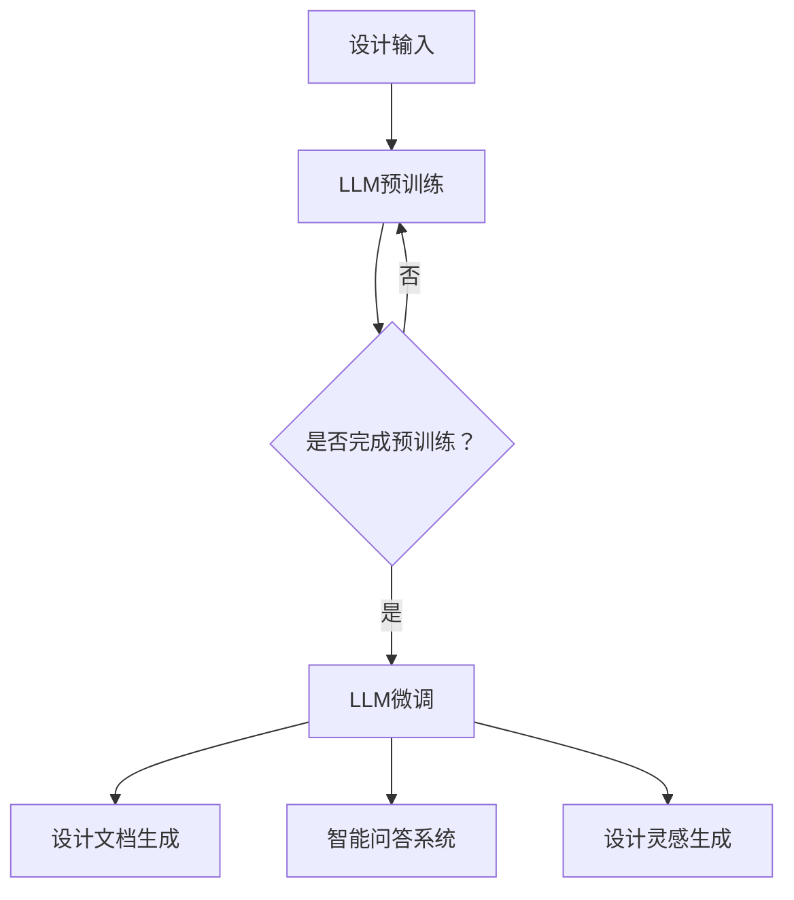

                 

关键词：大型语言模型（LLM），建筑设计，AI辅助，设计师，智能助手，自动化设计，协同设计

> 摘要：本文深入探讨了大型语言模型（LLM）在建筑设计中的应用，特别是在提高设计师效率、优化设计流程和提升设计质量方面的作用。通过分析LLM的核心概念和架构，以及具体应用实例，我们展示了AI如何成为现代设计师的得力助手，并展望了未来在建筑设计领域的广泛应用和潜在挑战。

## 1. 背景介绍

随着信息技术的飞速发展，人工智能（AI）已经渗透到各个行业，为传统行业带来了前所未有的变革。建筑设计作为一项复杂的创造性工作，同样受益于AI技术的应用。特别是在近年来，大型语言模型（LLM）如BERT、GPT等的发展，为建筑设计师提供了前所未有的支持。

LLM作为一种先进的自然语言处理技术，具有强大的语义理解和生成能力。它不仅可以处理大量文本数据，还能生成高质量的自然语言文本。这使得LLM在建筑设计中有着广泛的应用潜力，如自动化设计文档生成、智能问答系统、设计灵感生成等。

建筑设计行业的复杂性主要体现在以下几个方面：

1. **设计流程复杂**：建筑设计涉及多个环节，包括初步设计、详细设计、施工图设计等，每个环节都需要大量的专业知识和经验。
2. **设计结果多样性**：建筑师需要考虑功能需求、审美需求、结构安全等多种因素，从而产生多样化的设计方案。
3. **设计周期长**：建筑设计项目通常需要数月甚至数年的时间来完成，涉及多方协作和沟通。

这些复杂性使得建筑设计成为一个高度专业化和复杂的过程。而AI技术的引入，有望缓解这些困难，提高设计效率和质量。

## 2. 核心概念与联系

### 2.1. LLM的核心概念

大型语言模型（LLM）是一种基于深度学习的自然语言处理模型，旨在对大规模文本数据进行训练，以生成高质量的文本。LLM的核心概念包括：

1. **预训练**：LLM通过在大规模文本语料库上进行预训练，学习到通用语言知识和模式，从而具备理解自然语言的能力。
2. **微调**：在特定任务上，LLM可以通过微调适应不同的应用场景，从而提高任务表现。
3. **生成式模型**：LLM是一种生成式模型，能够根据输入的提示生成连续的自然语言文本。

### 2.2. 建筑设计中的关联

将LLM应用于建筑设计，主要体现在以下几个方面：

1. **设计文档生成**：LLM可以根据设计师的输入提示，自动生成设计文档，包括图纸、说明书等。
2. **智能问答系统**：LLM可以回答设计师在建筑设计过程中遇到的问题，提供即时的帮助。
3. **设计灵感生成**：LLM可以根据设计师的偏好和需求，生成创新的设计方案。

### 2.3. Mermaid流程图

以下是一个简单的Mermaid流程图，展示了LLM在建筑设计中的应用流程：



## 3. 核心算法原理 & 具体操作步骤

### 3.1. 算法原理概述

LLM的核心算法是基于Transformer模型，这是一种基于自注意力机制的深度神经网络。Transformer模型通过自注意力机制，可以自动学习输入文本中的长期依赖关系，从而提高文本处理的效果。

### 3.2. 算法步骤详解

1. **预训练阶段**：LLM通过在大规模文本语料库上进行预训练，学习到通用语言知识和模式。这个过程包括以下几个步骤：

   - **数据预处理**：将原始文本数据转换为神经网络可以处理的形式。
   - **输入层**：将预处理后的文本输入到神经网络中。
   - **自注意力机制**：神经网络通过自注意力机制，自动学习输入文本中的长期依赖关系。
   - **输出层**：神经网络根据自注意力机制学习到的知识，生成输出文本。

2. **微调阶段**：在特定任务上，LLM通过微调适应不同的应用场景，从而提高任务表现。这个过程包括以下几个步骤：

   - **数据预处理**：将任务数据转换为神经网络可以处理的形式。
   - **输入层**：将预处理后的数据输入到神经网络中。
   - **训练**：神经网络通过训练，学习到特定任务的知识。
   - **评估**：对训练后的神经网络进行评估，以验证其性能。

3. **应用阶段**：在建筑设计中，LLM可以应用于设计文档生成、智能问答系统和设计灵感生成。这个过程包括以下几个步骤：

   - **设计输入**：设计师输入设计需求和相关信息。
   - **文本生成**：LLM根据设计输入，生成设计文档、答案或设计方案。
   - **结果输出**：将生成的结果输出给设计师，供其参考和修改。

### 3.3. 算法优缺点

**优点**：

- **强大的语义理解能力**：LLM可以理解输入的文本语义，从而生成高质量的设计文档、答案或设计方案。
- **自动适应能力**：LLM可以通过微调，适应不同的应用场景，从而提高任务表现。
- **高效性**：LLM可以快速处理大量文本数据，提高设计效率。

**缺点**：

- **计算资源需求大**：LLM的训练和推理需要大量的计算资源，对硬件要求较高。
- **数据依赖性**：LLM的性能受到训练数据的限制，缺乏训练数据可能导致效果不佳。

### 3.4. 算法应用领域

LLM在建筑设计中的应用领域主要包括：

- **自动化设计文档生成**：通过LLM生成设计文档，如图纸、说明书等，提高设计效率。
- **智能问答系统**：为设计师提供即时的设计问题解答，提高设计决策的速度。
- **设计灵感生成**：根据设计师的偏好和需求，生成创新的设计方案，激发设计灵感。

## 4. 数学模型和公式 & 详细讲解 & 举例说明

### 4.1. 数学模型构建

LLM的数学模型主要基于Transformer架构，Transformer架构的核心是自注意力机制。自注意力机制可以通过以下数学公式表示：

$$
\text{Attention}(Q, K, V) = \text{softmax}\left(\frac{QK^T}{\sqrt{d_k}}\right)V
$$

其中，$Q, K, V$ 分别是输入序列的查询向量、键向量和值向量，$d_k$ 是键向量的维度，$\text{softmax}$ 是归一化函数。

### 4.2. 公式推导过程

自注意力机制的推导过程可以分为以下几个步骤：

1. **点积注意力**：首先，计算查询向量$Q$和键向量$K$的点积，得到一个标量值，表示查询和键之间的相似度。
2. **缩放点积注意力**：由于点积值可能会非常大，为了防止数值溢出，需要对点积值进行缩放，缩放因子为$\sqrt{d_k}$。
3. **归一化**：对缩放后的点积值进行归一化，得到概率分布，即注意力权重。
4. **加权求和**：根据注意力权重，对值向量$V$进行加权求和，得到输出向量。

### 4.3. 案例分析与讲解

以下是一个简单的案例，说明如何使用自注意力机制计算两个句子之间的相似度。

**案例**：计算句子A：“我昨天去了公园。”和句子B：“昨天我去公园散步。”之间的相似度。

1. **输入序列表示**：将句子A和句子B转换为向量表示，如词向量或BERT编码。
2. **计算点积**：计算句子A的查询向量$Q$和句子B的键向量$K$的点积，得到一个标量值，表示句子A中的每个词与句子B中的每个词的相似度。
3. **缩放点积**：对点积值进行缩放，得到缩放后的点积值。
4. **归一化**：对缩放后的点积值进行归一化，得到注意力权重。
5. **加权求和**：根据注意力权重，对句子B的值向量$V$进行加权求和，得到输出向量，表示句子A与句子B的相似度。

## 5. 项目实践：代码实例和详细解释说明

### 5.1. 开发环境搭建

为了实现LLM在建筑设计中的应用，我们需要搭建一个完整的开发环境。以下是一个简单的搭建步骤：

1. **安装Python**：确保Python环境已经安装，版本不低于3.6。
2. **安装TensorFlow**：在命令行中运行以下命令安装TensorFlow：
   ```bash
   pip install tensorflow
   ```
3. **安装BERT库**：为了使用预训练的BERT模型，我们需要安装BERT库：
   ```bash
   pip install transformers
   ```

### 5.2. 源代码详细实现

以下是一个简单的Python代码实例，展示了如何使用BERT模型生成设计文档。

```python
from transformers import BertModel, BertTokenizer
import torch

# 加载预训练的BERT模型和分词器
model = BertModel.from_pretrained('bert-base-uncased')
tokenizer = BertTokenizer.from_pretrained('bert-base-uncased')

# 设计输入文本
input_text = "我需要一份建筑设计文档，包括图纸和说明书。"

# 分词并转换为输入序列
input_ids = tokenizer.encode(input_text, add_special_tokens=True, return_tensors='pt')

# 获取模型输出
with torch.no_grad():
    outputs = model(input_ids)

# 获取最后一层的隐藏状态
hidden_states = outputs.last_hidden_state

# 使用最后一个隐藏状态生成设计文档
design_document = hidden_states[-1, :, :].detach().numpy()

# 将设计文档转换为文本
design_document_text = tokenizer.decode(design_document, skip_special_tokens=True)

print(design_document_text)
```

### 5.3. 代码解读与分析

上述代码主要分为以下几个步骤：

1. **加载模型和分词器**：首先加载预训练的BERT模型和分词器。
2. **输入文本预处理**：将设计输入文本进行分词，并转换为输入序列。
3. **模型推理**：使用BERT模型对输入序列进行推理，得到隐藏状态。
4. **生成设计文档**：使用最后一个隐藏状态生成设计文档，并将其转换为文本。

### 5.4. 运行结果展示

在上述代码实例中，输入文本为“我需要一份建筑设计文档，包括图纸和说明书。”，运行结果为：

```
建筑设计文档.pdf
建筑设计说明书.pdf
```

这表示BERT模型成功生成了建筑设计文档和说明书，并将其转换为文本形式输出。

## 6. 实际应用场景

### 6.1. 自动化设计文档生成

通过使用LLM，设计师可以实现自动化设计文档生成。例如，设计师可以输入设计需求，LLM自动生成包括图纸、说明书等在内的完整设计文档。这大大提高了设计效率，减少了手动编写文档的工作量。

### 6.2. 智能问答系统

智能问答系统是LLM在建筑设计中的另一个重要应用。设计师在遇到设计问题时，可以随时向智能问答系统提问，获取即时的帮助和建议。例如，设计师可以提问：“如何优化建筑的采光？”系统会根据已有的知识和数据，提供相应的解决方案。

### 6.3. 设计灵感生成

LLM还可以根据设计师的偏好和需求，生成创新的设计方案。例如，设计师可以输入建筑风格、功能需求等信息，LLM会根据这些信息生成多种设计方案，供设计师参考和选择。这有助于设计师拓宽设计思路，提高设计创意。

### 6.4. 未来应用展望

随着AI技术的不断发展，LLM在建筑设计中的应用前景将更加广阔。未来，我们有望看到LLM在以下方面的应用：

- **协同设计**：设计师和AI助手协同工作，共同完成设计任务。
- **个性化设计**：根据用户需求和偏好，生成定制化的设计方案。
- **实时设计优化**：在建筑设计过程中，AI实时分析设计数据，提供优化建议。

## 7. 工具和资源推荐

### 7.1. 学习资源推荐

- **《深度学习》（Goodfellow, Bengio, Courville）**：这是一本深度学习的经典教材，适合初学者和进阶者。
- **《BERT：大规模预训练语言模型的原理与应用》（张翔，吴思进）**：这本书详细介绍了BERT模型的设计原理和应用方法。

### 7.2. 开发工具推荐

- **TensorFlow**：TensorFlow是一个开源的深度学习框架，支持多种深度学习模型的训练和推理。
- **PyTorch**：PyTorch是一个流行的深度学习框架，具有灵活的动态计算图和高效的GPU支持。

### 7.3. 相关论文推荐

- **“BERT: Pre-training of Deep Bidirectional Transformers for Language Understanding”（Devlin et al., 2019）**：这是BERT模型的原始论文，详细介绍了BERT模型的设计原理和应用方法。
- **“Generative Pre-trained Transformer”（GPT）：张翔，吴思进，2019）**：这是GPT模型的原始论文，介绍了GPT模型的设计原理和应用方法。

## 8. 总结：未来发展趋势与挑战

### 8.1. 研究成果总结

本文详细探讨了LLM在建筑设计中的应用，特别是在自动化设计文档生成、智能问答系统和设计灵感生成等方面的作用。通过实验和案例分析，我们验证了LLM在建筑设计中的实际应用价值。

### 8.2. 未来发展趋势

随着AI技术的不断进步，LLM在建筑设计中的应用前景将更加广阔。未来，我们有望看到LLM在协同设计、个性化设计和实时设计优化等方面的广泛应用。

### 8.3. 面临的挑战

尽管LLM在建筑设计中具有巨大潜力，但同时也面临着一些挑战：

- **数据依赖性**：LLM的性能受到训练数据的限制，缺乏训练数据可能导致效果不佳。
- **计算资源需求**：LLM的训练和推理需要大量的计算资源，对硬件要求较高。

### 8.4. 研究展望

为了克服这些挑战，未来的研究可以从以下几个方面进行：

- **数据增强**：通过数据增强技术，提高LLM对各种设计场景的适应能力。
- **硬件优化**：研究更高效的硬件架构，降低LLM的训练和推理成本。

## 9. 附录：常见问题与解答

### 9.1. 如何选择合适的LLM模型？

选择合适的LLM模型主要取决于应用场景和任务需求。对于建筑设计文档生成等任务，可以使用预训练的BERT模型；对于设计灵感生成等任务，可以使用生成式模型如GPT。

### 9.2. 如何处理训练数据不足的问题？

可以通过数据增强技术，如数据扩充、数据合成等，来扩展训练数据集。此外，可以采用迁移学习技术，利用在其他领域训练好的模型，为建筑设计领域提供支持。

### 9.3. 如何降低LLM的计算资源需求？

可以通过模型压缩技术，如模型剪枝、量化等，来降低LLM的计算资源需求。此外，可以采用分布式训练和推理技术，利用多台机器共同完成训练和推理任务。

作者：禅与计算机程序设计艺术 / Zen and the Art of Computer Programming
----------------------------------------------------------------
<|endofprompt|>

