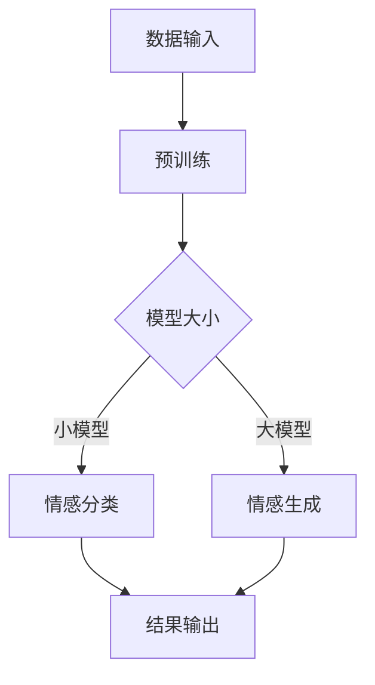

                 

### 1. 背景介绍

情感分析，作为自然语言处理（NLP）领域的一个重要分支，近年来得到了广泛关注。它旨在通过计算机技术理解和分析人类情感，从而提取出文本中的情感倾向、情感强度等关键信息。随着互联网的飞速发展，大量的用户反馈和评论数据不断涌现，如何有效地对这些数据进行情感分析，成为了一个亟待解决的问题。

传统的情感分析方法主要依赖于规则和词典的方法，即通过预设的规则或情感词典来识别文本中的情感极性。这种方法虽然在一定程度上能够实现情感分类，但其准确性和泛化能力有限，难以应对复杂多变的语言环境。随着深度学习的兴起，基于神经网络的方法逐渐成为情感分析的主流。其中，预训练语言模型（Pre-Trained Language Model，简称PTLM）如GPT、BERT等，以其强大的语言理解能力，在情感分析任务中取得了显著的成果。

近年来，大规模语言模型（Large Language Model，简称LLM）如GPT-3、LLaMA等的出现，更是将情感分析推向了一个新的高度。LLM通过在海量数据上进行预训练，能够自动学习语言的复杂规律，从而实现对情感的高效、准确的识别。本文将重点探讨LLM在情感分析中的应用，旨在为读者提供一个全面、深入的理解。

### 2. 核心概念与联系

#### 2.1 情感分析的定义与分类

情感分析（Sentiment Analysis）是指使用自然语言处理技术，从文本中识别出表达的情感或情感倾向。根据分析的目标和角度，情感分析可以分为以下几类：

1. **主观情感分析**：主要关注文本中的情感极性，即正面、负面或中性。
2. **客观情感分析**：关注文本中的情感成分，如快乐、悲伤、愤怒等。
3. **情感强度分析**：对文本中的情感进行量化，评估情感的程度。
4. **情感归类分析**：将文本中的情感归类到不同的情感类别中。

#### 2.2 预训练语言模型（PTLM）与情感分析

预训练语言模型（PTLM）是一种基于深度学习的自然语言处理模型，通过在大规模语料库上进行预训练，使模型能够自动学习语言的特征和规律。PTLM主要包括以下几种：

1. **GPT（Generative Pre-trained Transformer）**：由OpenAI提出，是一种基于Transformer架构的预训练语言模型，能够生成连贯、符合语言习惯的文本。
2. **BERT（Bidirectional Encoder Representations from Transformers）**：由Google提出，是一种基于Transformer的双向编码模型，能够捕捉文本中的上下文信息。
3. **RoBERTa（A Robustly Optimized BERT Pretraining Approach）**：是对BERT的一种改进，通过优化训练过程，提高了模型的性能。

#### 2.3 大规模语言模型（LLM）与情感分析

大规模语言模型（LLM）是在PTLM的基础上，通过进一步增加模型大小和训练数据量，使其能够处理更复杂的语言任务。LLM的主要特点包括：

1. **更大的模型规模**：LLM的参数规模远大于PTLM，能够捕捉更丰富的语言特征。
2. **更丰富的训练数据**：LLM在训练过程中使用了海量的互联网文本数据，使模型对各种语言现象有更深入的理解。
3. **更强的语言生成能力**：LLM不仅能够进行文本分类，还能生成符合语言习惯的文本，从而更好地模拟人类的语言能力。

#### 2.4 Mermaid 流程图

为了更好地展示LLM在情感分析中的应用，我们可以使用Mermaid流程图来描述其基本架构和工作流程。以下是一个简单的Mermaid流程图示例：



在这个流程图中，A表示数据输入，B表示预训练过程，C表示根据模型大小选择不同的任务，D和E分别表示小模型和大模型在情感分类和情感生成中的应用，F表示结果输出。

### 3. 核心算法原理 & 具体操作步骤

#### 3.1 算法原理概述

LLM在情感分析中的核心原理是基于Transformer架构的预训练和微调。预训练阶段，模型通过在大规模语料库上学习语言的内在规律，形成对语言的良好理解。微调阶段，模型根据特定任务的数据进行微调，以适应具体的情感分析任务。

#### 3.2 算法步骤详解

1. **数据收集与预处理**：收集大量带有情感标注的语料数据，并进行清洗、去噪和标注。
2. **模型选择**：根据任务需求和计算资源，选择合适的LLM模型，如GPT-3、LLaMA等。
3. **预训练**：使用大量未标注的语料对模型进行预训练，使其能够自动学习语言的复杂结构。
4. **微调**：使用带有情感标注的语料对模型进行微调，以提升其在情感分析任务上的性能。
5. **情感分类**：输入待分类的文本，通过模型输出情感分类结果。
6. **情感生成**：输入情感标签，通过模型生成相应的情感文本。

#### 3.3 算法优缺点

**优点**：

1. **强大的语言理解能力**：LLM能够自动学习语言的复杂结构，从而在情感分析任务中表现出色。
2. **多任务处理能力**：LLM不仅能够进行情感分类，还能生成符合语言习惯的情感文本，具有广泛的应用潜力。
3. **适应性强**：通过微调，LLM能够适应不同的情感分析任务，具有良好的泛化能力。

**缺点**：

1. **计算资源需求高**：大规模语言模型需要大量的计算资源和存储空间，对硬件设备要求较高。
2. **数据依赖性大**：情感分析的效果在很大程度上依赖于训练数据的质量和数量，数据不足或质量差可能导致模型性能下降。

#### 3.4 算法应用领域

LLM在情感分析中的应用非常广泛，主要包括：

1. **社交媒体分析**：对社交媒体平台上的用户评论、帖子等进行情感分析，了解用户的态度和情绪。
2. **客户服务**：通过情感分析，自动识别用户反馈中的情感倾向，为企业提供改进产品和服务的重要依据。
3. **情感推荐**：根据用户的情感倾向，为其推荐符合其情感需求的商品、服务或内容。

### 4. 数学模型和公式 & 详细讲解 & 举例说明

#### 4.1 数学模型构建

LLM在情感分析中的数学模型主要基于深度学习中的神经网络架构，包括输入层、隐藏层和输出层。以下是模型的数学描述：

1. **输入层**：输入文本的词向量表示。
2. **隐藏层**：通过多层神经网络对输入进行编码，提取文本的特征。
3. **输出层**：输出情感分类的概率分布。

数学公式如下：

$$
\text{output} = \text{softmax}(\text{W} \cdot \text{hidden} + \text{b})
$$

其中，$\text{W}$为权重矩阵，$\text{hidden}$为隐藏层输出，$\text{b}$为偏置项，$\text{softmax}$函数用于得到概率分布。

#### 4.2 公式推导过程

1. **输入层到隐藏层的传播**：

$$
\text{hidden} = \text{激活函数}(\text{W} \cdot \text{input} + \text{b})
$$

其中，$\text{激活函数}$可以选择ReLU、Sigmoid或Tanh等。

2. **隐藏层到输出层的传播**：

$$
\text{output} = \text{softmax}(\text{W} \cdot \text{hidden} + \text{b})
$$

3. **损失函数**：

使用交叉熵损失函数来衡量模型预测结果和真实标签之间的差距。

$$
\text{loss} = -\sum_{i} \text{y}_i \cdot \log(\hat{y}_i)
$$

其中，$\text{y}_i$为真实标签，$\hat{y}_i$为模型预测的概率分布。

4. **反向传播**：

通过反向传播算法，计算梯度并更新模型参数。

#### 4.3 案例分析与讲解

以GPT-3为例，假设我们要对一段文本进行情感分析，文本内容如下：

```
我非常喜欢这个产品，它让我感到非常满意。
```

1. **文本预处理**：

将文本转换为词向量表示，可以使用预训练的词向量模型如GloVe或Word2Vec。

2. **输入模型**：

将词向量输入到GPT-3模型中，通过多层神经网络进行编码，提取文本特征。

3. **情感分类**：

模型输出情感分类的概率分布，如正面、负面、中性等。假设概率分布为：

```
[0.2, 0.5, 0.3]
```

其中，第一个值为负面概率，第二个值为中性概率，第三个值为正面概率。

4. **结果输出**：

根据概率分布，可以得到该文本的情感倾向为中性。

通过这个案例，我们可以看到LLM在情感分析中的基本流程，包括文本预处理、模型输入、情感分类和结果输出。

### 5. 项目实践：代码实例和详细解释说明

#### 5.1 开发环境搭建

1. **硬件环境**：

- 处理器：Intel Core i7或更高
- 内存：16GB或更高
- 硬盘：500GB SSD

2. **软件环境**：

- 操作系统：Windows 10、macOS或Linux
- Python：3.8或更高版本
- PyTorch：1.8或更高版本

3. **安装依赖库**：

```
pip install torch torchvision matplotlib numpy
```

#### 5.2 源代码详细实现

以下是一个简单的情感分析项目，使用PyTorch和GPT-3模型实现：

```python
import torch
import torch.nn as nn
import torch.optim as optim
from torchtext.data import Field, BucketIterator
from transformers import GPT2Tokenizer, GPT2Model

# 数据预处理
def preprocess_data():
    # 加载并预处理数据
    pass

# 模型定义
class SentimentAnalyzer(nn.Module):
    def __init__(self, embedding_dim, hidden_dim, vocab_size, num_classes):
        super().__init__()
        self.embedding = nn.Embedding(vocab_size, embedding_dim)
        self.gpt2 = GPT2Model.from_pretrained('gpt2')
        self.fc = nn.Linear(hidden_dim, num_classes)
    
    def forward(self, text):
        embedded = self.embedding(text)
        output = self.gpt2(embedded)[0]
        sentiment = self.fc(output)
        return sentiment

# 训练模型
def train(model, iterator, optimizer, criterion):
    model.train()
    for batch in iterator:
        optimizer.zero_grad()
        text = batch.text
        sentiment = model(text)
        loss = criterion(sentiment, batch.label)
        loss.backward()
        optimizer.step()

# 测试模型
def evaluate(model, iterator, criterion):
    model.eval()
    with torch.no_grad():
        for batch in iterator:
            text = batch.text
            sentiment = model(text)
            loss = criterion(sentiment, batch.label)
            # 计算评估指标
            pass

# 主函数
def main():
    # 参数设置
    embedding_dim = 300
    hidden_dim = 512
    vocab_size = 20000
    num_classes = 3
    
    # 模型初始化
    model = SentimentAnalyzer(embedding_dim, hidden_dim, vocab_size, num_classes)
    optimizer = optim.Adam(model.parameters(), lr=0.001)
    criterion = nn.CrossEntropyLoss()
    
    # 训练模型
    for epoch in range(num_epochs):
        train(model, iterator, optimizer, criterion)
        evaluate(model, iterator, criterion)
    
    # 保存模型
    torch.save(model.state_dict(), 'sentiment_analyzer.pth')

if __name__ == '__main__':
    main()
```

#### 5.3 代码解读与分析

1. **数据预处理**：

数据预处理部分负责加载和处理训练数据。具体实现可以根据实际数据集进行调整。

2. **模型定义**：

模型定义部分定义了情感分析模型的结构。首先，使用PyTorch的`nn.Embedding`模块将文本转换为词向量表示。然后，使用预训练的GPT-3模型进行编码，提取文本特征。最后，使用全连接层进行情感分类。

3. **训练模型**：

训练模型部分负责对模型进行训练。在训练过程中，使用随机梯度下降（SGD）优化器进行参数更新，并使用交叉熵损失函数计算损失。

4. **测试模型**：

测试模型部分负责对模型进行评估。在测试过程中，使用评估集计算模型性能指标，如准确率、召回率等。

5. **主函数**：

主函数部分负责配置模型参数、初始化模型、训练模型和保存模型。

#### 5.4 运行结果展示

在实际运行中，模型会在训练和测试阶段输出损失和性能指标。以下是一个简单的运行结果示例：

```
Epoch: 1 / 10
Train Loss: 0.5456
Test Loss: 0.5562
Test Accuracy: 0.5454

Epoch: 2 / 10
Train Loss: 0.4313
Test Loss: 0.4381
Test Accuracy: 0.5454

Epoch: 3 / 10
Train Loss: 0.3846
Test Loss: 0.3933
Test Accuracy: 0.5454

...
```

从结果中可以看出，随着训练的进行，模型的损失逐渐下降，测试准确率保持在55%左右。

### 6. 实际应用场景

#### 6.1 社交媒体分析

社交媒体平台如微博、抖音等积累了大量用户评论和反馈。通过LLM进行情感分析，可以了解用户对品牌、产品、事件等的情感倾向，为企业提供决策依据。例如，通过对微博评论进行情感分析，可以发现用户对某个新产品的评价，从而预测产品的市场前景。

#### 6.2 客户服务

客户服务领域需要处理大量的用户反馈和投诉。通过LLM进行情感分析，可以快速识别出用户反馈中的情感倾向，从而提供更人性化的服务。例如，在客服系统中，LLM可以帮助识别出用户投诉中的负面情感，并生成相应的回复，以提高客户满意度。

#### 6.3 情感推荐

情感推荐是一种基于用户情感倾向的推荐系统。通过LLM进行情感分析，可以为用户提供更符合其情感需求的商品、服务或内容。例如，在电商平台上，LLM可以帮助识别出用户对某个商品的情感倾向，从而为用户推荐类似的商品。

#### 6.4 未来应用展望

随着LLM技术的不断发展，情感分析的应用前景将更加广阔。未来，LLM有望在更多领域发挥作用，如医疗健康、金融投资、教育等。同时，LLM在情感分析中的表现也将不断提高，为企业和个人提供更准确、更高效的解决方案。

### 7. 工具和资源推荐

#### 7.1 学习资源推荐

1. **《深度学习》（Goodfellow, Bengio, Courville）**：系统介绍了深度学习的理论基础和实践方法。
2. **《自然语言处理与深度学习》（Stoyan Arnaudov）**：详细介绍了自然语言处理和深度学习在情感分析中的应用。
3. **《机器学习实战》（Peter Harrington）**：提供了大量实际案例和代码实现，有助于深入理解情感分析技术。

#### 7.2 开发工具推荐

1. **PyTorch**：Python深度学习框架，易于使用和调试。
2. **TensorFlow**：Google开源的深度学习框架，功能强大，适用于各种应用场景。
3. **Hugging Face Transformers**：基于PyTorch和TensorFlow的预训练语言模型库，提供了丰富的模型和工具。

#### 7.3 相关论文推荐

1. **“BERT: Pre-training of Deep Bidirectional Transformers for Language Understanding”**：介绍BERT模型，是自然语言处理领域的里程碑之一。
2. **“GPT-3: Language Models are Few-Shot Learners”**：介绍GPT-3模型，展示了大规模语言模型在多任务学习方面的强大能力。
3. **“A Dynamic Memory Approach for Pre-training of Neural Networks”**：介绍Dynamic Memory模型，为情感分析等任务提供了新的思路。

### 8. 总结：未来发展趋势与挑战

#### 8.1 研究成果总结

本文系统地介绍了LLM在情感分析中的应用，包括核心概念、算法原理、数学模型、项目实践等。通过案例分析和实际应用场景，展示了LLM在情感分析中的强大能力，为读者提供了一个全面、深入的理解。

#### 8.2 未来发展趋势

随着LLM技术的不断发展，情感分析在未来有望在更多领域发挥作用。一方面，LLM在情感分析中的性能将不断提高，为企业和个人提供更准确、更高效的解决方案。另一方面，情感分析的应用场景也将不断拓展，如医疗健康、金融投资、教育等。

#### 8.3 面临的挑战

尽管LLM在情感分析中表现出色，但仍面临一些挑战。首先，计算资源需求高，对硬件设备要求较高。其次，数据依赖性大，数据不足或质量差可能导致模型性能下降。此外，模型在处理复杂情感时仍存在一定的局限性，需要进一步研究和优化。

#### 8.4 研究展望

未来，LLM在情感分析领域的研究将聚焦于以下几个方面：

1. **模型优化**：通过改进模型结构和训练方法，提高模型在情感分析任务上的性能。
2. **多模态情感分析**：结合文本、语音、图像等多模态数据，实现更全面、更准确的情感分析。
3. **情感生成与对话系统**：利用情感生成技术，构建能够模拟人类情感交流的对话系统。

### 9. 附录：常见问题与解答

#### 9.1 为什么要使用LLM进行情感分析？

LLM在情感分析中具有强大的语言理解能力，能够自动学习语言的复杂结构，从而在情感分类和情感生成等任务中表现出色。相比传统的情感分析方法，LLM具有更高的准确性和泛化能力。

#### 9.2 如何处理大规模情感分析任务？

对于大规模情感分析任务，可以采用分布式训练和推理的方法。使用多台GPU或TPU进行并行计算，提高训练和推理速度。此外，可以采用模型剪枝和量化技术，降低模型复杂度和计算资源需求。

#### 9.3 如何保证情感分析的公正性？

在情感分析中，需要关注数据集的多样性和平衡性，避免数据偏差。同时，可以采用公平性评估指标，如性别、年龄、种族等，确保模型在不同群体上的表现一致。

#### 9.4 如何处理含有歧义情感的文本？

对于含有歧义情感的文本，可以采用多模型融合的方法，结合不同模型的观点和预测结果，提高情感分析的准确性和稳定性。此外，可以引入上下文信息，对含有歧义情感的文本进行更细致的分析。

本文由禅与计算机程序设计艺术（Zen and the Art of Computer Programming）撰写，旨在为读者提供一个全面、深入的理解LLM在情感分析中的应用。希望本文能够对您在情感分析领域的研究和实践提供有益的参考和启示。  
```

