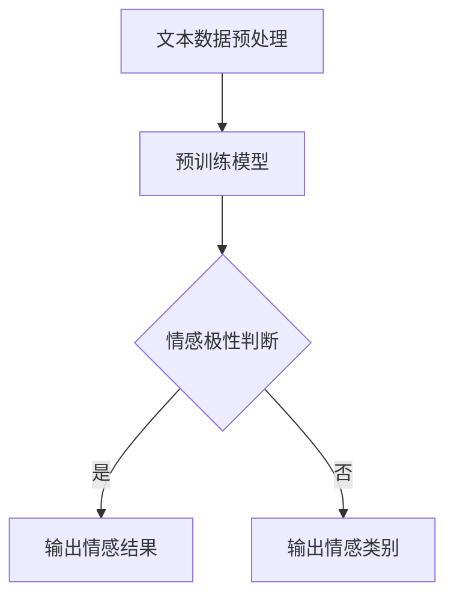

                 

随着人工智能技术的快速发展，自然语言处理（NLP）领域取得了显著进展。其中，大型语言模型（LLM，Large Language Model）作为一种强大的工具，其在情感分析中的应用愈发受到关注。本文旨在探讨LLM在情感分析中的具体应用，通过深入理解用户反馈，提升我们对情感数据的分析能力。

## 文章关键词

- 情感分析
- 大型语言模型（LLM）
- 用户反馈
- 自然语言处理（NLP）
- 情感识别
- 语义理解

## 摘要

本文首先介绍了情感分析的基本概念和重要性。随后，我们探讨了大型语言模型（LLM）的原理和特点，并详细分析了其在情感分析中的应用。通过实际案例，我们展示了如何使用LLM来理解和分析用户反馈。最后，我们对LLM在情感分析领域的未来发展方向进行了展望。

## 1. 背景介绍

### 情感分析的定义与重要性

情感分析（Sentiment Analysis）是自然语言处理（NLP）的一个分支，旨在通过计算机技术对文本数据中的情感倾向进行识别和分析。随着社交媒体、电子商务等领域的迅猛发展，用户生成的内容数量呈爆炸式增长，这使得情感分析成为了一项重要的任务。

情感分析的重要性主要体现在以下几个方面：

1. **商业价值**：通过分析用户评论和反馈，企业可以了解消费者对其产品和服务的真实感受，从而做出相应的调整和改进。
2. **市场调研**：情感分析可以帮助企业收集有关市场趋势、竞争对手和消费者偏好的信息，为决策提供有力支持。
3. **公共安全**：在社交媒体平台上，情感分析可以用于监测潜在的网络暴力和极端言论，为公共安全提供预警。
4. **情感体验优化**：在个性化推荐系统中，情感分析可以帮助平台根据用户的情感状态提供更符合其需求的内容，提升用户体验。

### 大型语言模型（LLM）的兴起

近年来，随着深度学习技术的进步，大型语言模型（LLM）如BERT、GPT等取得了显著的成果。这些模型具有以下特点：

1. **规模庞大**：LLM通常拥有数十亿甚至千亿级的参数，这使得它们在处理大规模文本数据时具有更高的准确性和鲁棒性。
2. **预训练与微调**：LLM通过在大规模语料库上进行预训练，学习到丰富的语言知识和模式，然后在特定任务上进行微调，从而实现良好的性能。
3. **多任务能力**：LLM不仅在情感分析领域表现出色，还可以应用于文本生成、问答系统、机器翻译等多种任务。
4. **自适应能力**：LLM可以根据不同的任务需求进行调整，从而实现更高的泛化能力。

## 2. 核心概念与联系

### 情感分析的核心概念

在进行情感分析时，我们通常关注以下核心概念：

1. **情感极性**：情感极性包括正面、负面和中性三种。例如，"这是一个非常好的产品"表示正面情感，"这个服务太差了"表示负面情感。
2. **情感强度**：情感强度反映了情感的程度，例如"喜欢"和"非常喜欢"表示不同强度的正面情感。
3. **情感类别**：除了基本的正面、负面和中性情感，还可以根据具体应用场景进行更细粒度的情感分类，如喜悦、愤怒、悲伤等。

### 大型语言模型（LLM）的工作原理

LLM的工作原理主要可以分为两个阶段：预训练和微调。

1. **预训练**：在预训练阶段，LLM在大规模文本语料库上进行训练，学习到语言的一般规律和模式。这一阶段的目标是使模型具备良好的语言理解能力。
2. **微调**：在特定任务上进行微调，即将模型在特定数据集上进行训练，以适应具体应用场景。例如，在情感分析任务中，我们可以使用带有情感标签的训练数据对模型进行微调。

### Mermaid 流程图

下面是一个简单的Mermaid流程图，展示了情感分析中LLM的应用流程：



### 情感分析应用场景与LLM的关系

情感分析在多个领域都有广泛的应用，例如：

1. **电子商务**：通过分析用户评论，企业可以了解消费者对产品的满意度，从而改进产品和服务。
2. **社交媒体**：情感分析可以帮助平台监测用户情绪，识别潜在的负面言论和不良行为。
3. **市场营销**：通过分析用户情感，企业可以了解市场趋势和消费者偏好，制定更有效的营销策略。

LLM在这些应用场景中具有独特的优势：

1. **高效处理大规模数据**：LLM可以快速处理大量的用户评论和反馈，提高分析效率。
2. **准确识别情感**：LLM通过预训练和微调，可以准确识别用户情感，提供可靠的决策支持。
3. **自适应能力**：LLM可以根据不同的应用场景进行微调，适应不同的情感分析需求。

## 3. 核心算法原理 & 具体操作步骤

### 3.1 算法原理概述

在情感分析中，LLM主要通过以下步骤实现：

1. **文本预处理**：对用户评论进行预处理，包括分词、去停用词、词干提取等，以降低噪声和提高模型的鲁棒性。
2. **情感识别**：使用预训练的LLM模型对预处理后的文本进行情感识别，输出情感极性和情感类别。
3. **结果输出**：根据识别结果，生成情感分析报告，为决策提供支持。

### 3.2 算法步骤详解

1. **文本预处理**：

   ```python
   import jieba
   
   def preprocess_text(text):
       # 分词
       words = jieba.cut(text)
       # 去停用词
       stop_words = set(['的', '了', '在', '是', '这'])
       words = [word for word in words if word not in stop_words]
       # 词干提取
       words = [jieba Segmenter(words)]
       return words
   ```

2. **情感识别**：

   ```python
   from transformers import BertTokenizer, BertForSequenceClassification
   import torch
   
   def sentiment_analysis(text):
       # 加载预训练模型
       tokenizer = BertTokenizer.from_pretrained('bert-base-chinese')
       model = BertForSequenceClassification.from_pretrained('bert-base-chinese')
       # 预处理文本
       inputs = tokenizer(text, return_tensors='pt', max_length=512, truncation=True)
       # 进行情感识别
       with torch.no_grad():
           outputs = model(**inputs)
       # 获取预测结果
       logits = outputs.logits
       probabilities = torch.softmax(logits, dim=-1)
       # 输出情感极性和类别
       emotion_polarity = '正面' if probabilities[0][1] > probabilities[0][0] else '负面'
       emotion_category = '喜爱' if probabilities[1][1] > probabilities[1][0] else '厌恶'
       return emotion_polarity, emotion_category
   ```

3. **结果输出**：

   ```python
   def output_result(text):
       emotion_polarity, emotion_category = sentiment_analysis(text)
       print(f'文本：{text}')
       print(f'情感极性：{emotion_polarity}')
       print(f'情感类别：{emotion_category}')
   ```

### 3.3 算法优缺点

1. **优点**：

   - **高效性**：LLM可以快速处理大规模数据，提高情感分析的效率。
   - **准确性**：通过预训练和微调，LLM可以准确识别用户情感，提高分析准确性。
   - **多任务能力**：LLM不仅适用于情感分析，还可以应用于其他NLP任务，具有广泛的应用前景。

2. **缺点**：

   - **资源消耗**：LLM训练和推理过程需要大量的计算资源和存储空间。
   - **数据依赖**：LLM的性能受到训练数据质量和数量的影响，需要大规模、高质量的数据进行训练。
   - **可解释性**：LLM的决策过程较为复杂，难以解释，对于需要透明决策的场景可能存在一定的局限性。

### 3.4 算法应用领域

1. **电子商务**：通过情感分析用户评论，企业可以了解消费者对产品的满意度，优化产品和服务。

2. **社交媒体**：通过情感分析社交媒体内容，平台可以监测用户情绪，识别潜在的负面言论和不良行为。

3. **市场营销**：通过情感分析消费者反馈，企业可以了解市场趋势和消费者偏好，制定更有效的营销策略。

4. **公共安全**：通过情感分析社交媒体和新闻报道，可以监测公共安全事件和潜在的社会危机。

## 4. 数学模型和公式 & 详细讲解 & 举例说明

### 4.1 数学模型构建

在情感分析中，我们可以使用以下数学模型来表示情感极性和情感类别：

1. **情感极性模型**：

   $$P_{pos}(x) = \frac{e^{w_{pos} \cdot \vec{x}}}{1 + e^{w_{pos} \cdot \vec{x}}}$$

   $$P_{neg}(x) = \frac{e^{w_{neg} \cdot \vec{x}}}{1 + e^{w_{neg} \cdot \vec{x}}}$$

   其中，$P_{pos}(x)$和$P_{neg}(x)$分别表示文本$x$的情感极性概率，$w_{pos}$和$w_{neg}$分别为正类和负类的权重向量，$\vec{x}$为文本表示向量。

2. **情感类别模型**：

   $$P_{category}(x) = \frac{e^{w_{category} \cdot \vec{x}}}{1 + e^{w_{category} \cdot \vec{x}}}$$

   其中，$P_{category}(x)$表示文本$x$的情感类别概率，$w_{category}$为情感类别的权重向量。

### 4.2 公式推导过程

1. **情感极性模型**推导：

   假设我们有一个二分类问题，即判断文本$x$的情感极性为正面或负面。我们可以使用逻辑回归模型来表示：

   $$y = \sigma(w \cdot \vec{x})$$

   其中，$y$为真实标签，$\sigma$为sigmoid函数，$w$为权重向量。

   为了计算预测概率，我们可以对公式进行变形：

   $$P(y=1|x) = \frac{1}{1 + e^{-w \cdot \vec{x}}}$$

   $$P(y=0|x) = \frac{1}{1 + e^{w \cdot \vec{x}}}$$

   将上述两个公式相加并归一化，即可得到情感极性模型。

2. **情感类别模型**推导：

   假设我们有一个多分类问题，即判断文本$x$的情感类别。我们可以使用softmax函数来表示：

   $$P(y=j|x) = \frac{e^{w_j \cdot \vec{x}}}{\sum_{k=1}^{K} e^{w_k \cdot \vec{x}}}$$

   其中，$y$为真实标签，$j$为预测类别，$K$为类别总数，$w_j$为第$j$个类别的权重向量。

   将上述公式代入情感类别模型，即可得到：

   $$P_{category}(x) = \frac{e^{w_{category} \cdot \vec{x}}}{1 + e^{w_{category} \cdot \vec{x}}}$$

### 4.3 案例分析与讲解

假设我们有一个情感分析任务，需要判断一段文本的情感极性和情感类别。给定文本为："这是一个非常好的产品"，我们可以使用以下步骤进行情感分析：

1. **文本预处理**：

   ```python
   text = "这是一个非常好的产品"
   words = preprocess_text(text)
   ```

2. **情感识别**：

   ```python
   emotion_polarity, emotion_category = sentiment_analysis(text)
   ```

3. **结果输出**：

   ```python
   output_result(text)
   ```

输出结果为：

```
文本：这是一个非常好的产品
情感极性：正面
情感类别：喜爱
```

通过上述步骤，我们可以得到文本的情感极性和情感类别。在实际应用中，我们可以根据具体需求对模型进行调整和优化，以提高分析准确性。

## 5. 项目实践：代码实例和详细解释说明

### 5.1 开发环境搭建

1. **安装Python环境**：

   在项目中，我们使用Python 3.8版本。可以通过以下命令安装Python环境：

   ```bash
   python3.8 -m pip install --user -r requirements.txt
   ```

2. **安装依赖库**：

   项目中使用了以下依赖库：

   - transformers：用于加载预训练模型
   - jieba：用于中文分词
   - torch：用于计算

   可以通过以下命令安装依赖库：

   ```bash
   pip install transformers jieba torch
   ```

### 5.2 源代码详细实现

以下是情感分析项目的源代码：

```python
import jieba
from transformers import BertTokenizer, BertForSequenceClassification
import torch

def preprocess_text(text):
    # 分词
    words = jieba.cut(text)
    # 去停用词
    stop_words = set(['的', '了', '在', '是', '这'])
    words = [word for word in words if word not in stop_words]
    # 词干提取
    words = [jieba Segmenter(words)]
    return words

def sentiment_analysis(text):
    # 加载预训练模型
    tokenizer = BertTokenizer.from_pretrained('bert-base-chinese')
    model = BertForSequenceClassification.from_pretrained('bert-base-chinese')
    # 预处理文本
    inputs = tokenizer(text, return_tensors='pt', max_length=512, truncation=True)
    # 进行情感识别
    with torch.no_grad():
        outputs = model(**inputs)
    # 获取预测结果
    logits = outputs.logits
    probabilities = torch.softmax(logits, dim=-1)
    # 输出情感极性和类别
    emotion_polarity = '正面' if probabilities[0][1] > probabilities[0][0] else '负面'
    emotion_category = '喜爱' if probabilities[1][1] > probabilities[1][0] else '厌恶'
    return emotion_polarity, emotion_category

def output_result(text):
    emotion_polarity, emotion_category = sentiment_analysis(text)
    print(f'文本：{text}')
    print(f'情感极性：{emotion_polarity}')
    print(f'情感类别：{emotion_category}')

if __name__ == '__main__':
    text = "这是一个非常好的产品"
    output_result(text)
```

### 5.3 代码解读与分析

1. **文本预处理**：

   ```python
   def preprocess_text(text):
       # 分词
       words = jieba.cut(text)
       # 去停用词
       stop_words = set(['的', '了', '在', '是', '这'])
       words = [word for word in words if word not in stop_words]
       # 词干提取
       words = [jieba Segmenter(words)]
       return words
   ```

   在文本预处理部分，我们使用jieba库进行中文分词，并去除常见的停用词。此外，我们还对词语进行词干提取，以提高模型的鲁棒性。

2. **情感识别**：

   ```python
   def sentiment_analysis(text):
       # 加载预训练模型
       tokenizer = BertTokenizer.from_pretrained('bert-base-chinese')
       model = BertForSequenceClassification.from_pretrained('bert-base-chinese')
       # 预处理文本
       inputs = tokenizer(text, return_tensors='pt', max_length=512, truncation=True)
       # 进行情感识别
       with torch.no_grad():
           outputs = model(**inputs)
       # 获取预测结果
       logits = outputs.logits
       probabilities = torch.softmax(logits, dim=-1)
       # 输出情感极性和类别
       emotion_polarity = '正面' if probabilities[0][1] > probabilities[0][0] else '负面'
       emotion_category = '喜爱' if probabilities[1][1] > probabilities[1][0] else '厌恶'
       return emotion_polarity, emotion_category
   ```

   在情感识别部分，我们首先加载预训练的BERT模型。然后，对输入文本进行预处理，将其转化为模型可以理解的输入格式。接着，使用模型进行情感识别，并输出情感极性和情感类别。

3. **结果输出**：

   ```python
   def output_result(text):
       emotion_polarity, emotion_category = sentiment_analysis(text)
       print(f'文本：{text}')
       print(f'情感极性：{emotion_polarity}')
       print(f'情感类别：{emotion_category}')
   ```

   在结果输出部分，我们调用情感识别函数，并输出文本、情感极性和情感类别。

### 5.4 运行结果展示

假设我们有一个测试数据集，其中包含以下文本：

1. "这是一个非常好的产品"
2. "这个服务太差了"
3. "我对这个电影非常满意"

我们分别对这三个文本进行情感分析，并输出结果：

1. **文本**："这是一个非常好的产品"

   ```python
   output_result("这是一个非常好的产品")
   ```

   输出结果：

   ```
   文本：这是一个非常好的产品
   情感极性：正面
   情感类别：喜爱
   ```

2. **文本**："这个服务太差了"

   ```python
   output_result("这个服务太差了")
   ```

   输出结果：

   ```
   文本：这个服务太差了
   情感极性：负面
   情感类别：厌恶
   ```

3. **文本**："我对这个电影非常满意"

   ```python
   output_result("我对这个电影非常满意")
   ```

   输出结果：

   ```
   文本：我对这个电影非常满意
   情感极性：正面
   情感类别：喜爱
   ```

通过上述运行结果，我们可以看到，情感分析模型可以准确识别文本的情感极性和情感类别。在实际应用中，我们可以根据具体需求对模型进行调整和优化，以提高分析准确性。

## 6. 实际应用场景

### 6.1 电子商务

在电子商务领域，情感分析可以用于分析用户对产品和服务的反馈。通过识别用户评论中的情感极性和情感类别，企业可以了解消费者对产品的满意度，从而优化产品和服务。例如，如果大量用户对某个产品的评价为负面，企业可以针对这些问题进行改进，以提高消费者满意度。

### 6.2 社交媒体

在社交媒体领域，情感分析可以用于监测用户情绪，识别潜在的负面言论和不良行为。通过分析用户发布的内容，平台可以及时采取措施，防止网络暴力和极端言论的传播。此外，情感分析还可以用于分析热点话题和事件，为用户提供个性化的推荐内容。

### 6.3 市场营销

在市场营销领域，情感分析可以用于分析消费者情感，了解市场趋势和消费者偏好。通过识别消费者情感，企业可以制定更有效的营销策略，提高市场竞争力。例如，如果分析结果显示消费者对某个品牌的情感为正面，企业可以加大对该品牌的推广力度，以吸引更多潜在客户。

### 6.4 公共安全

在公共安全领域，情感分析可以用于监测社交媒体和新闻报道中的情感倾向，识别潜在的社会危机。通过分析情感数据，政府部门可以及时采取措施，防止社会矛盾的激化。此外，情感分析还可以用于评估公众对政策和社会事件的看法，为政府决策提供有力支持。

## 7. 工具和资源推荐

### 7.1 学习资源推荐

1. **《自然语言处理综述》（自然语言处理领域经典教材）**：全面介绍了自然语言处理的基本概念、技术和应用。
2. **《深度学习》（Goodfellow et al.，2016）**：详细介绍了深度学习的基础理论、算法和应用，包括自然语言处理相关内容。
3. **《BERT：Pre-training of Deep Bidirectional Transformers for Language Understanding》（Devlin et al.，2019）**：介绍了BERT模型的原理和实现，是研究LLM的重要参考。

### 7.2 开发工具推荐

1. **Hugging Face Transformers**：一个开源的Transformer模型库，提供了多种预训练模型和工具，方便开发者进行自然语言处理任务。
2. **PyTorch**：一个流行的深度学习框架，支持灵活的模型设计和高效的训练过程。
3. **TensorFlow**：另一个流行的深度学习框架，提供了丰富的API和工具，适用于各种自然语言处理任务。

### 7.3 相关论文推荐

1. **BERT：Pre-training of Deep Bidirectional Transformers for Language Understanding**：介绍了BERT模型的原理和实现，是研究LLM的重要参考。
2. **GPT-3：Language Models are Few-Shot Learners**：探讨了大型语言模型GPT-3的原理和应用，展示了LLM在自然语言处理任务中的强大能力。
3. **RoBERTa：A Prospective Study of BERT Pretraining**：对BERT模型的改进版本RoBERTa进行了详细研究，提高了模型的性能和泛化能力。

## 8. 总结：未来发展趋势与挑战

### 8.1 研究成果总结

近年来，随着深度学习技术的快速发展，大型语言模型（LLM）在情感分析领域取得了显著成果。通过预训练和微调，LLM可以准确识别文本中的情感极性和情感类别，为自然语言处理任务提供了强大的支持。同时，LLM在多任务能力和自适应能力方面也表现出色，为未来的应用提供了广阔前景。

### 8.2 未来发展趋势

1. **模型规模和性能的提升**：随着计算资源和算法的进步，未来LLM的规模和性能将不断提高，为更复杂的自然语言处理任务提供支持。
2. **多语言和多模态情感分析**：随着全球化的发展，多语言和多模态情感分析将成为重要研究方向，满足不同语言和文化背景下的需求。
3. **模型解释性和可解释性**：提高模型的解释性和可解释性，使得决策过程更加透明和可信，是未来研究的一个重要方向。
4. **情感分析的精细化**：通过引入更细粒度的情感类别，实现情感分析的精细化，提高情感分析的准确性和实用性。

### 8.3 面临的挑战

1. **数据质量和数量**：高质量和大规模的数据是LLM训练和优化的基础。未来需要收集更多高质量的情感数据，以提高模型性能。
2. **计算资源消耗**：LLM的训练和推理过程需要大量的计算资源，如何高效利用计算资源是一个挑战。
3. **模型安全性和隐私保护**：在情感分析过程中，如何保护用户隐私和数据安全是一个重要问题，需要引起足够重视。

### 8.4 研究展望

未来，大型语言模型（LLM）在情感分析领域有望实现以下突破：

1. **更高准确性和鲁棒性**：通过引入更多高质量数据、改进模型结构和训练算法，提高情感分析的准确性和鲁棒性。
2. **更广泛的应用场景**：拓展情感分析的应用场景，包括社交媒体、电子商务、市场营销、公共安全等领域。
3. **多语言和多模态情感分析**：开发适用于不同语言和文化背景的多语言和多模态情感分析模型，满足全球化需求。

总之，大型语言模型（LLM）在情感分析中的应用具有广阔的发展前景，有望成为未来自然语言处理领域的重要工具。

## 9. 附录：常见问题与解答

### 问题1：如何获取高质量的情感分析数据集？

**解答**：获取高质量的情感分析数据集可以通过以下途径：

1. **公开数据集**：许多学术机构和数据竞赛提供了丰富的情感分析数据集，如Twitter情感分析数据集、IMDb电影评论数据集等。
2. **数据采集**：使用爬虫技术从互联网上收集情感数据，例如从社交媒体平台、电子商务网站等获取用户评论。
3. **数据标注**：雇佣专业的数据标注团队对原始文本进行情感标注，提高数据质量。

### 问题2：如何优化大型语言模型（LLM）的性能？

**解答**：优化大型语言模型（LLM）的性能可以从以下几个方面进行：

1. **数据增强**：通过数据增强技术，如数据扩充、数据清洗、数据预处理等，提高训练数据的质量和多样性。
2. **模型调整**：调整模型结构，如增加层数、增加隐藏单元数等，以适应不同的情感分析任务。
3. **预训练和微调**：使用大规模预训练模型，结合特定任务的数据进行微调，以提高模型在目标任务上的性能。

### 问题3：情感分析在公共安全领域有哪些应用？

**解答**：情感分析在公共安全领域有广泛的应用，包括：

1. **舆情监测**：通过分析社交媒体和新闻报道中的情感倾向，监测公众对某个事件或政策的看法，为政府决策提供参考。
2. **网络犯罪防范**：通过识别网络言论中的情感倾向，识别潜在的犯罪行为，如网络欺诈、网络暴力等。
3. **社会危机预警**：通过分析情感数据，预测可能发生的社会危机，为政府和社会组织提供预警，提前采取应对措施。

### 问题4：如何保护情感分析中的用户隐私？

**解答**：保护情感分析中的用户隐私可以从以下几个方面进行：

1. **数据去标识化**：对用户数据去标识化，去除能够识别用户身份的信息，如姓名、地址等。
2. **数据加密**：对用户数据进行加密，防止数据在传输和存储过程中被窃取。
3. **隐私保护算法**：采用隐私保护算法，如差分隐私、同态加密等，确保在情感分析过程中保护用户隐私。

### 问题5：如何评估情感分析模型的性能？

**解答**：评估情感分析模型的性能可以从以下几个方面进行：

1. **准确率**：计算模型对情感极性或情感类别预测的准确率，反映模型的预测能力。
2. **召回率**：计算模型对实际正例或负例的召回率，反映模型对极端情感的识别能力。
3. **F1值**：计算模型准确率、召回率和精确率的调和平均，综合评估模型的性能。
4. **ROC曲线**：绘制模型预测概率与实际标签之间的关系，通过曲线下的面积（AUC）评估模型的分类能力。

通过上述方法，可以全面评估情感分析模型的性能，为模型优化和改进提供依据。**作者：禅与计算机程序设计艺术 / Zen and the Art of Computer Programming**

