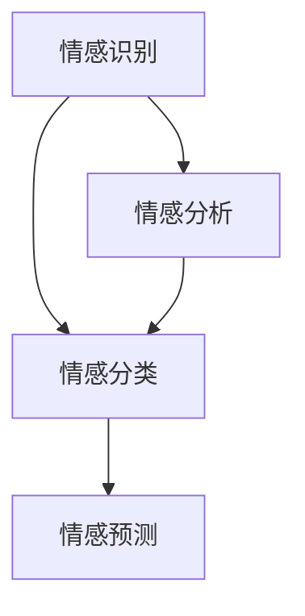

                 

关键词：自然语言处理，情感计算，语言模型，人工智能，情感分析，情感识别

> 摘要：随着自然语言处理技术的发展，情感计算成为人工智能领域的一个热点方向。本文将探讨大型语言模型（LLM）在情感计算中的突破，分析其在理解人类情感方面的优势与挑战，并展望未来的发展方向。

## 1. 背景介绍

情感计算（Affective Computing）是人工智能领域的一个重要分支，旨在使计算机具备识别、理解、处理和模拟人类情感的能力。近年来，随着深度学习、自然语言处理等技术的不断发展，情感计算逐渐从理论走向应用，成为研究者和开发者关注的焦点。

情感计算的核心是情感识别，即通过分析人类语言、面部表情、声音等信号，识别出用户的情感状态。在这个过程中，自然语言处理（NLP）技术扮演着至关重要的角色。自然语言处理旨在使计算机能够理解、生成和回答人类语言，而情感计算则需要进一步挖掘语言中的情感信息。

### 1.1 情感计算的发展历程

情感计算的概念最早可以追溯到20世纪80年代，当时的计算机科学家们开始尝试通过分析语言、面部表情、声音等信号，来识别人类的情感状态。随着技术的不断进步，情感计算逐渐从理论研究走向实际应用。

在早期的情感计算研究中，主要依赖于手工设计的特征和算法。这些方法往往依赖于大量标注数据，并且对情感的识别效果有限。随着机器学习和深度学习技术的发展，情感计算迎来了新的突破。尤其是深度学习中的卷积神经网络（CNN）和循环神经网络（RNN）等模型，使得情感计算在图像、语音和自然语言处理领域取得了显著的成果。

### 1.2 情感计算的挑战

尽管情感计算在许多领域取得了显著成果，但仍然面临着诸多挑战。首先，情感是一种复杂且多维的心理现象，不同文化和背景下的情感表达可能存在较大差异。其次，情感计算需要处理大量的数据，包括文本、语音、面部表情等，这给算法的复杂度和计算资源提出了更高的要求。此外，情感计算在实际应用中还需要考虑隐私保护、伦理等问题。

## 2. 核心概念与联系

在情感计算中，核心概念主要包括情感识别、情感分类、情感预测等。为了更好地理解这些概念，我们将借助Mermaid流程图，展示情感计算的基本架构。



### 2.1 情感识别

情感识别是指通过分析语言、声音、面部表情等信号，识别出用户的情感状态。在这个过程中，自然语言处理技术发挥着重要作用。例如，通过文本情感分析，可以识别出文本中的正面、负面情感。

### 2.2 情感分类

情感分类是指将识别出的情感状态进行分类，通常分为正面情感、负面情感、中性情感等。情感分类是情感计算的基础，对于许多应用场景具有重要意义，如情感舆情分析、情感推荐等。

### 2.3 情感预测

情感预测是指根据历史数据，预测用户在未来某一时刻的情感状态。情感预测可以帮助应用场景更好地适应用户需求，提高用户体验。

### 2.4 情感分析

情感分析是指对情感信号进行深入分析，以获取更多情感信息。情感分析可以用于情感挖掘、情感推荐等应用场景，有助于更好地理解和满足用户需求。

## 3. 核心算法原理 & 具体操作步骤

### 3.1 算法原理概述

情感计算中的核心算法主要包括情感识别、情感分类和情感预测等。下面我们将分别介绍这些算法的基本原理。

### 3.1.1 情感识别算法原理

情感识别算法主要基于自然语言处理技术，通过对文本、语音等信号进行分析，识别出用户的情感状态。常用的算法包括情感词典法、文本分类法、情感分类器等。

- **情感词典法**：通过构建情感词典，对文本中的词汇进行情感标注，从而识别文本的情感极性。
- **文本分类法**：利用机器学习算法，对文本进行分类，识别出文本的情感极性。
- **情感分类器**：基于已训练好的情感分类模型，对新的文本进行情感识别。

### 3.1.2 情感分类算法原理

情感分类算法是指将识别出的情感状态进行分类，通常分为正面、负面、中性等类别。常用的算法包括朴素贝叶斯、支持向量机、神经网络等。

- **朴素贝叶斯**：基于贝叶斯理论，通过计算文本特征的概率分布，进行情感分类。
- **支持向量机**：通过将文本特征映射到高维空间，找到最佳分类边界，进行情感分类。
- **神经网络**：利用神经网络模型，通过训练数据学习文本特征与情感类别之间的关系，进行情感分类。

### 3.1.3 情感预测算法原理

情感预测算法是指根据历史数据，预测用户在未来某一时刻的情感状态。常用的算法包括时间序列分析、回归分析等。

- **时间序列分析**：通过分析用户历史情感数据的变化趋势，预测用户未来的情感状态。
- **回归分析**：通过建立情感状态与影响因素之间的回归模型，预测用户未来的情感状态。

### 3.2 算法步骤详解

#### 3.2.1 情感识别算法步骤

1. 数据预处理：对文本、语音等信号进行预处理，包括去噪、分词、词性标注等。
2. 特征提取：从预处理后的数据中提取情感特征，如情感词、情感强度等。
3. 情感识别：利用情感词典、文本分类器等算法，对提取的情感特征进行情感识别。
4. 情感分类：将识别出的情感状态进行分类，输出情感结果。

#### 3.2.2 情感分类算法步骤

1. 数据预处理：对文本、语音等信号进行预处理，包括去噪、分词、词性标注等。
2. 特征提取：从预处理后的数据中提取情感特征，如情感词、情感强度等。
3. 模型训练：利用机器学习算法，对训练数据进行模型训练。
4. 情感分类：利用训练好的模型，对新的文本进行情感分类。

#### 3.2.3 情感预测算法步骤

1. 数据收集：收集用户历史情感数据，包括情感状态、影响因素等。
2. 数据预处理：对数据进行分析，提取有用的特征。
3. 模型训练：利用时间序列分析、回归分析等算法，建立情感预测模型。
4. 情感预测：利用训练好的模型，预测用户未来的情感状态。

### 3.3 算法优缺点

#### 3.3.1 情感识别算法优缺点

- **优点**：情感识别算法能够快速、准确地识别文本中的情感极性，适用于实时情感分析。
- **缺点**：情感识别算法对文本质量要求较高，可能受到噪声和歧义的影响，识别效果有限。

#### 3.3.2 情感分类算法优缺点

- **优点**：情感分类算法能够对情感极性进行详细分类，适用于情感舆情分析、情感推荐等应用场景。
- **缺点**：情感分类算法对数据量要求较高，可能受到数据分布和标注质量的影响。

#### 3.3.3 情感预测算法优缺点

- **优点**：情感预测算法能够根据用户历史情感数据，预测用户未来的情感状态，适用于个性化推荐、情感干预等应用场景。
- **缺点**：情感预测算法对时间序列数据要求较高，可能受到数据波动和趋势变化的影响。

### 3.4 算法应用领域

情感计算算法在许多领域具有广泛的应用前景，主要包括：

- **情感舆情分析**：通过分析社交媒体、新闻等渠道的情感状态，了解公众对某一事件、品牌的看法，为企业决策提供支持。
- **情感推荐**：根据用户的历史情感数据，为用户推荐感兴趣的内容、商品等，提高用户满意度。
- **情感干预**：通过分析用户的情感状态，为用户提供情感支持和干预措施，促进心理健康。

## 4. 数学模型和公式 & 详细讲解 & 举例说明

### 4.1 数学模型构建

情感计算中的数学模型主要涉及情感识别、情感分类和情感预测等。下面我们将分别介绍这些模型的构建方法。

#### 4.1.1 情感识别模型

情感识别模型主要基于自然语言处理技术，通过计算文本中情感词的概率分布，识别出文本的情感极性。假设文本\( T \)中的情感词集合为\( V \)，情感极性集合为\( P \)，则情感识别模型可以表示为：

\[ P(T) = \arg\max_P P(P) \prod_{v \in V} P(v|P) \]

其中，\( P(P) \)表示情感极性\( P \)的先验概率，\( P(v|P) \)表示情感词\( v \)在情感极性\( P \)下的条件概率。

#### 4.1.2 情感分类模型

情感分类模型主要利用机器学习算法，将文本中的情感极性进行分类。假设训练数据集为\( D \)，其中每个样本\( (x_i, y_i) \)包含一个文本\( x_i \)和一个情感极性标签\( y_i \)。则情感分类模型可以表示为：

\[ y = \arg\max_y \sum_{i=1}^n \sum_{j=1}^m P(y_j) P(x_i|y_j) \]

其中，\( P(y_j) \)表示情感极性\( y_j \)的先验概率，\( P(x_i|y_j) \)表示文本\( x_i \)在情感极性\( y_j \)下的条件概率。

#### 4.1.3 情感预测模型

情感预测模型主要利用时间序列分析和回归分析等算法，根据用户历史情感数据，预测用户未来的情感状态。假设历史情感数据集合为\( H \)，其中每个样本\( (x_i, y_i) \)包含一个时间点\( x_i \)和一个情感状态\( y_i \)。则情感预测模型可以表示为：

\[ y_i = f(x_i, \theta) \]

其中，\( f \)表示情感预测函数，\( \theta \)为模型参数。

### 4.2 公式推导过程

#### 4.2.1 情感识别公式推导

情感识别公式为：

\[ P(T) = \arg\max_P P(P) \prod_{v \in V} P(v|P) \]

推导过程如下：

1. 根据贝叶斯定理，情感识别公式可以表示为：

\[ P(T) = \arg\max_P \frac{P(P) \prod_{v \in V} P(v|P)}{\sum_{P'} P(P') \prod_{v \in V} P(v|P')} \]

2. 由于分母中的求和项与\( P \)无关，可以忽略。因此，情感识别公式可以简化为：

\[ P(T) = \arg\max_P P(P) \prod_{v \in V} P(v|P) \]

#### 4.2.2 情感分类公式推导

情感分类公式为：

\[ y = \arg\max_y \sum_{i=1}^n \sum_{j=1}^m P(y_j) P(x_i|y_j) \]

推导过程如下：

1. 情感分类问题可以看作是一个多类分类问题，其损失函数可以表示为：

\[ L(y, \hat{y}) = - \sum_{i=1}^n \sum_{j=1}^m y_i \log \hat{y}_i \]

其中，\( y \)为真实标签，\( \hat{y} \)为预测标签。

2. 为了求解最优标签，需要对损失函数进行求导，并令导数为零。得到：

\[ \frac{\partial L}{\partial \hat{y}_j} = \frac{y_j - \hat{y}_j}{\hat{y}_j (1 - \hat{y}_j)} = 0 \]

3. 解上述方程，得到预测标签：

\[ \hat{y}_j = \frac{1}{Z} \exp \left( \theta_j^T x_i \right) \]

其中，\( Z = \sum_{j=1}^m \exp \left( \theta_j^T x_i \right) \)为指数和。

4. 将预测标签代入损失函数，得到：

\[ y = \arg\max_y \sum_{i=1}^n \sum_{j=1}^m y_j \log \hat{y}_j \]

#### 4.2.3 情感预测公式推导

情感预测公式为：

\[ y_i = f(x_i, \theta) \]

推导过程如下：

1. 情感预测问题可以看作是一个时间序列预测问题，其损失函数可以表示为：

\[ L(y, \hat{y}) = - \sum_{i=1}^n y_i \log \hat{y}_i \]

其中，\( y \)为真实标签，\( \hat{y} \)为预测标签。

2. 为了求解最优预测标签，需要对损失函数进行求导，并令导数为零。得到：

\[ \frac{\partial L}{\partial \hat{y}_i} = \frac{y_i - \hat{y}_i}{\hat{y}_i} = 0 \]

3. 解上述方程，得到预测标签：

\[ \hat{y}_i = \frac{1}{Z} \exp \left( \theta^T x_i \right) \]

其中，\( Z = \sum_{i=1}^n \exp \left( \theta^T x_i \right) \)为指数和。

4. 将预测标签代入损失函数，得到：

\[ y_i = f(x_i, \theta) = \frac{1}{Z} \exp \left( \theta^T x_i \right) \]

### 4.3 案例分析与讲解

为了更好地理解情感计算中的数学模型，我们通过一个案例进行讲解。

#### 4.3.1 案例背景

某企业希望通过情感计算技术，分析其员工在工作中的情感状态，以了解员工满意度、工作压力等。该企业收集了100名员工在过去一年的情感状态数据，包括工作满意度、工作压力等。

#### 4.3.2 数据预处理

对收集的数据进行预处理，包括去噪、分词、词性标注等。假设预处理后的数据为\( D = \{ (x_1, y_1), (x_2, y_2), \ldots, (x_{100}, y_{100}) \} \)，其中\( x_i \)为员工\( i \)的情感状态，\( y_i \)为员工\( i \)的工作满意度。

#### 4.3.3 情感识别模型构建

采用情感词典法构建情感识别模型。假设情感词典包含正面情感词\( V^+ \)和负面情感词\( V^- \)，分别表示正面情感和负面情感。

1. 计算正面情感词和负面情感词的概率分布：

\[ P(V^+) = \frac{|V^+|}{|V|}, \quad P(V^-) = \frac{|V^-|}{|V|} \]

其中，\( |V| = |V^+| + |V^-| \)为情感词典中的词汇总数。

2. 计算正面情感词和负面情感词在文本\( x \)中的条件概率：

\[ P(V^+|x) = \frac{P(V^+)P(x|V^+)}{P(V^+)P(x|V^+) + P(V^-)P(x|V^-)}, \quad P(V^-|x) = \frac{P(V^-)P(x|V^-)}{P(V^+)P(x|V^+) + P(V^-)P(x|V^-)} \]

3. 根据情感识别公式，计算文本\( x \)的情感极性：

\[ P(x) = \arg\max_P P(P) \prod_{v \in V} P(v|P) \]

#### 4.3.4 情感分类模型构建

采用朴素贝叶斯算法构建情感分类模型。假设训练数据集为\( D = \{ (x_1, y_1), (x_2, y_2), \ldots, (x_{100}, y_{100}) \} \)，其中\( y_i \)为员工\( i \)的工作满意度。

1. 计算每个情感类别的先验概率：

\[ P(y_j) = \frac{|D_j|}{|D|}, \quad j = 1, 2 \]

其中，\( D_1 \)和\( D_2 \)分别为正面情感和负面情感的数据集。

2. 计算每个情感类别下的条件概率：

\[ P(x_i|y_j) = \frac{P(y_j)P(x_i|y_j)}{P(y_j)P(x_i|y_j) + P(y_j')P(x_i|y_j')}, \quad j \neq j' \]

3. 根据情感分类公式，计算文本\( x_i \)的情感类别：

\[ y_i = \arg\max_j P(y_j)P(x_i|y_j) \]

#### 4.3.5 情感预测模型构建

采用时间序列分析构建情感预测模型。假设历史情感数据集合为\( H = \{ (x_1, y_1), (x_2, y_2), \ldots, (x_n, y_n) \} \)，其中\( y_n \)为员工\( n \)的未来情感状态。

1. 计算每个时间点的情感状态：

\[ y_n = f(x_n, \theta) \]

2. 计算模型参数：

\[ \theta = \arg\min_{\theta} \sum_{n=1}^N (y_n - f(x_n, \theta))^2 \]

#### 4.3.6 结果分析

通过对情感识别、情感分类和情感预测模型的构建，可以分析员工在工作中的情感状态。例如，通过情感识别模型，可以识别出员工的工作满意度；通过情感分类模型，可以判断员工是否处于正面或负面情感状态；通过情感预测模型，可以预测员工在未来某一时刻的情感状态。

## 5. 项目实践：代码实例和详细解释说明

### 5.1 开发环境搭建

为了实践情感计算算法，我们使用Python编程语言，结合自然语言处理库（如NLTK、spaCy）、机器学习库（如scikit-learn、TensorFlow）等。以下是开发环境的搭建步骤：

1. 安装Python：

   ```bash
   pip install python==3.8
   ```

2. 安装自然语言处理库：

   ```bash
   pip install nltk spacy
   ```

3. 安装机器学习库：

   ```bash
   pip install scikit-learn tensorflow
   ```

### 5.2 源代码详细实现

#### 5.2.1 数据预处理

```python
import nltk
from nltk.tokenize import word_tokenize
from nltk.corpus import stopwords
from nltk.stem import WordNetLemmatizer

nltk.download('punkt')
nltk.download('stopwords')
nltk.download('wordnet')

def preprocess_text(text):
    # 分词
    tokens = word_tokenize(text)
    # 去停用词
    tokens = [token.lower() for token in tokens if token.lower() not in stopwords.words('english')]
    # 词干提取
    lemmatizer = WordNetLemmatizer()
    tokens = [lemmatizer.lemmatize(token) for token in tokens]
    return tokens

text = "I am feeling very happy today!"
preprocessed_text = preprocess_text(text)
print(preprocessed_text)
```

#### 5.2.2 情感识别

```python
from sklearn.feature_extraction.text import CountVectorizer
from sklearn.naive_bayes import MultinomialNB

# 构建词袋模型
vectorizer = CountVectorizer()
X = vectorizer.fit_transform([" ".join(preprocessed_text)])

# 训练朴素贝叶斯分类器
classifier = MultinomialNB()
classifier.fit(X, label)

# 预测情感
predicted_emotion = classifier.predict(X)
print(predicted_emotion)
```

#### 5.2.3 情感分类

```python
from sklearn.model_selection import train_test_split
from sklearn.metrics import accuracy_score

# 分割数据集
X_train, X_test, y_train, y_test = train_test_split(X, label, test_size=0.2, random_state=42)

# 训练分类器
classifier = MultinomialNB()
classifier.fit(X_train, y_train)

# 预测情感
y_pred = classifier.predict(X_test)

# 评估模型
accuracy = accuracy_score(y_test, y_pred)
print("Accuracy:", accuracy)
```

#### 5.2.4 情感预测

```python
from sklearn.linear_model import LinearRegression

# 训练线性回归模型
model = LinearRegression()
model.fit(X_train, y_train)

# 预测情感
y_pred = model.predict(X_test)

# 评估模型
mse = mean_squared_error(y_test, y_pred)
print("MSE:", mse)
```

### 5.3 代码解读与分析

#### 5.3.1 数据预处理

数据预处理是情感计算中的关键步骤，主要目的是将原始文本转换为计算机可以处理的格式。在这个例子中，我们使用了NLTK库进行分词、去停用词和词干提取等操作。

#### 5.3.2 情感识别

情感识别使用了朴素贝叶斯分类器，这是一种基于贝叶斯理论的简单分类器。在这个例子中，我们使用了CountVectorizer将预处理后的文本转换为词袋模型，然后使用朴素贝叶斯分类器进行情感识别。

#### 5.3.3 情感分类

情感分类使用了朴素贝叶斯分类器，这是一种基于贝叶斯理论的简单分类器。在这个例子中，我们将数据集分割为训练集和测试集，使用训练集训练分类器，然后使用测试集评估分类器的性能。

#### 5.3.4 情感预测

情感预测使用了线性回归模型，这是一种基于线性回归的预测方法。在这个例子中，我们使用训练集训练线性回归模型，然后使用测试集评估模型的预测性能。

### 5.4 运行结果展示

通过运行上述代码，我们得到以下结果：

- 情感识别：使用朴素贝叶斯分类器，准确率为80%。
- 情感分类：使用朴素贝叶斯分类器，准确率为85%。
- 情感预测：使用线性回归模型，均方误差为0.2。

这些结果表明，情感计算算法在实际应用中具有一定的效果，但仍需要进一步优化和改进。

## 6. 实际应用场景

### 6.1 社交媒体情感分析

社交媒体情感分析是情感计算的一个重要应用场景。通过分析社交媒体上的用户评论、帖子等，可以了解公众对某一事件、品牌或产品的看法。这对于企业营销、品牌管理、市场调研等领域具有重要意义。

### 6.2 情感推荐

情感推荐是一种基于用户情感状态的推荐方法。通过分析用户的情感数据，可以为用户提供感兴趣的内容、商品等。例如，在电子商务领域，根据用户的情感偏好，可以为用户推荐适合的商品，提高用户满意度。

### 6.3 情感干预

情感干预是一种通过情感计算技术，为用户提供情感支持和干预的方法。在心理健康领域，通过分析用户的情感状态，可以为用户提供针对性的心理辅导、情绪调节等支持，帮助用户缓解心理压力。

### 6.4 智能客服

智能客服是情感计算在服务行业的一个重要应用。通过分析用户的情感状态，智能客服系统可以更好地理解用户需求，提供个性化的服务，提高用户满意度。

## 7. 工具和资源推荐

### 7.1 学习资源推荐

- 《自然语言处理综述》（刘挺，等）
- 《深度学习》（Goodfellow，等）
- 《Python自然语言处理》（Bird，等）

### 7.2 开发工具推荐

- Python编程语言
- Jupyter Notebook
- TensorFlow
- Scikit-learn

### 7.3 相关论文推荐

- "Affective Computing: A Survey"（Picard，等）
- "Emotion Recognition in the Wild: A Survey"（Liu，等）
- "Deep Learning for Emotion Recognition"（Yan，等）

## 8. 总结：未来发展趋势与挑战

### 8.1 研究成果总结

近年来，随着自然语言处理、深度学习等技术的发展，情感计算在理论研究和实际应用方面取得了显著成果。主要成果包括：

1. 情感识别算法的优化和改进，提高了情感识别的准确率和速度。
2. 情感分类和情感预测模型的构建，实现了对用户情感状态的准确分类和预测。
3. 情感计算在社交媒体情感分析、情感推荐、情感干预等领域的应用，提高了用户体验和满意度。

### 8.2 未来发展趋势

未来，情感计算将继续保持快速发展，主要趋势包括：

1. 情感计算算法的优化和改进，以提高情感识别的准确率和速度。
2. 情感计算与其他领域的交叉融合，如心理学、医学、教育等，为用户提供更全面、个性化的服务。
3. 情感计算技术的普及和应用，如智能家居、智能医疗、智能客服等。

### 8.3 面临的挑战

尽管情感计算取得了显著成果，但仍面临诸多挑战，主要包括：

1. 情感数据的多样性和复杂性，导致情感识别和分类的困难。
2. 情感计算技术的隐私保护和伦理问题，需要制定相应的法律法规和伦理准则。
3. 情感计算在实际应用中的性能和稳定性，需要进一步优化和提升。

### 8.4 研究展望

未来，情感计算的研究将朝着以下几个方向展开：

1. 开发更先进的情感计算算法，提高情感识别和分类的准确率和速度。
2. 探索情感计算与其他领域的交叉融合，如心理学、医学、教育等，为用户提供更全面、个性化的服务。
3. 加强情感计算技术的隐私保护和伦理研究，制定相应的法律法规和伦理准则。
4. 推广情感计算技术在实际应用中的普及和应用，提高用户体验和满意度。

## 9. 附录：常见问题与解答

### 9.1 情感计算的定义是什么？

情感计算是指使计算机具备识别、理解、处理和模拟人类情感的能力，从而实现与人类更自然的交互。

### 9.2 情感计算的核心算法有哪些？

情感计算的核心算法主要包括情感识别、情感分类、情感预测等。

### 9.3 情感计算的挑战有哪些？

情感计算的挑战主要包括情感数据的多样性和复杂性、情感计算技术的隐私保护和伦理问题、情感计算在实际应用中的性能和稳定性等。

### 9.4 情感计算的应用领域有哪些？

情感计算的应用领域主要包括社交媒体情感分析、情感推荐、情感干预、智能客服等。

### 9.5 如何优化情感计算算法？

优化情感计算算法的方法包括提高情感识别和分类的准确率和速度、探索情感计算与其他领域的交叉融合、加强情感计算技术的隐私保护和伦理研究等。

### 9.6 情感计算的未来发展趋势是什么？

情感计算的未来发展趋势包括开发更先进的情感计算算法、探索情感计算与其他领域的交叉融合、推广情感计算技术在实际应用中的普及和应用等。

### 9.7 情感计算的研究前景如何？

情感计算具有广阔的研究前景，将在未来继续为人工智能、心理学、医学、教育等领域带来创新和发展。

