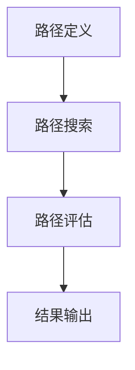

                 

### 关键词 Keywords

- LLM (大型语言模型)
- 推荐系统
- 元路径挖掘
- 元数据
- 图神经网络
- 机器学习算法
- 数据可视化
- 人机交互
- 跨领域知识融合

### 摘要 Abstract

本文探讨了大型语言模型（LLM）在推荐系统中的元路径挖掘应用。通过分析推荐系统的需求，本文提出了一个基于图神经网络的元路径挖掘方法，并详细阐述了其核心算法原理、数学模型和具体操作步骤。随后，文章通过实际项目实践，展示了代码实例和运行结果，探讨了该方法在不同应用场景中的实际效果。最后，文章总结了未来发展的趋势与面临的挑战，并对相关工具和资源进行了推荐。本文旨在为研究人员和开发者提供一种全新的视角和实用的技术，以提升推荐系统的智能化水平。

## 1. 背景介绍 Background

### 1.1 推荐系统的现状

推荐系统作为电子商务、社交媒体、在线视频等互联网应用的核心理构件，已经成为现代信息社会中不可或缺的一部分。随着用户生成内容和数据量的爆炸性增长，如何有效地从海量数据中提取有价值的信息，并准确地向用户推荐他们可能感兴趣的内容，成为推荐系统研究的热点问题。

传统的推荐系统主要基于基于内容的推荐（Content-based Recommendation）和协同过滤（Collaborative Filtering）两种方法。基于内容的推荐方法依赖于用户的历史行为和偏好，通过分析用户兴趣标签、关键词等来推荐相似内容。然而，这种方法在处理冷启动问题（即新用户或新商品缺少足够历史数据时）时效果不佳。协同过滤方法则通过分析用户之间的相似度来推荐商品，常见的方法包括用户基于的协同过滤（User-based Collaborative Filtering）和物品基于的协同过滤（Item-based Collaborative Filtering）。虽然协同过滤方法在处理冷启动问题方面有一定优势，但其存在预测准确性不高、数据稀疏、易受到噪声数据影响等问题。

### 1.2 元路径挖掘在推荐系统中的应用

随着图神经网络（Graph Neural Networks, GNN）在人工智能领域的兴起，基于图的推荐系统逐渐成为研究热点。元路径挖掘（Meta-path Mining）作为一种从图结构中提取路径信息的方法，为推荐系统提供了一种新的思路。元路径挖掘的目标是从图数据库中找出具有潜在关联的路径模式，并将其作为新的特征用于预测或分类任务。

在推荐系统中，元路径挖掘可以用于以下几个方面：

1. **新用户冷启动**：通过挖掘新用户与已有用户之间的潜在关联路径，为新用户推荐与其兴趣相似的内容。
2. **商品推荐**：通过挖掘商品之间的关联路径，为用户推荐与其兴趣相关的商品。
3. **个性化推荐**：利用用户的历史行为数据和元路径挖掘结果，生成更精确的个性化推荐列表。

### 1.3 LLM在元路径挖掘中的应用

近年来，大型语言模型（Large Language Model, LLM）如GPT-3、BERT等取得了显著的进展，并在自然语言处理（Natural Language Processing, NLP）领域取得了突破性成果。LLM通过训练海量文本数据，能够理解和生成自然语言，具有强大的语义理解能力和语言生成能力。

在元路径挖掘领域，LLM可以被应用于以下几个方面：

1. **文本预处理**：利用LLM进行文本清洗、分词、词性标注等预处理任务，提高数据质量。
2. **特征提取**：通过LLM提取文本中的潜在语义特征，用于表示节点和边，提高图神经网络模型的性能。
3. **解释性分析**：利用LLM生成自然语言描述，解释元路径挖掘的结果，提高模型的可解释性。

本文将探讨如何利用LLM在推荐系统中进行元路径挖掘，并详细介绍其核心算法原理、数学模型和具体操作步骤。

## 2. 核心概念与联系 Core Concepts and Relationships

### 2.1 大型语言模型（LLM）

大型语言模型（Large Language Model, LLM）是一种基于深度学习的语言处理模型，通过训练大量文本数据，LLM可以自动学习和理解语言规则、语义和上下文关系。LLM的核心组件是Transformer模型，特别是其变体BERT、GPT等。LLM具有以下特点：

1. **强大的语义理解能力**：LLM能够理解文本中的复杂语义，包括实体关系、事件关联等。
2. **灵活的语言生成能力**：LLM可以生成符合语法规则和语义逻辑的文本，包括摘要、问答、对话等。
3. **端到端训练**：LLM可以直接从原始文本数据中学习，无需手动特征工程，大大提高了模型训练的效率和效果。

### 2.2 推荐系统（Recommendation System）

推荐系统是一种基于数据挖掘和机器学习技术的应用，旨在根据用户的历史行为和偏好，为用户推荐他们可能感兴趣的内容。推荐系统通常包括以下几个核心模块：

1. **用户建模**：通过分析用户的历史行为数据（如浏览记录、购买记录、评价等），构建用户兴趣模型。
2. **物品建模**：通过分析物品的属性和特征（如标题、描述、标签等），构建物品特征模型。
3. **推荐算法**：根据用户兴趣模型和物品特征模型，使用推荐算法生成推荐列表。

常见的推荐算法包括基于内容的推荐、协同过滤、矩阵分解、深度学习等。

### 2.3 元路径挖掘（Meta-path Mining）

元路径挖掘是一种从图结构中提取路径信息的方法，旨在发现具有潜在关联的路径模式。在推荐系统中，元路径挖掘可以用于提取用户与物品之间的潜在关联路径，用于生成个性化推荐列表。元路径挖掘的核心步骤包括：

1. **路径定义**：定义元路径，即图中的路径模式，通常由一组节点和边组成。
2. **路径搜索**：在图数据库中搜索满足特定条件的元路径。
3. **路径评估**：评估挖掘出的元路径的潜在关联性，通常使用支持度和置信度等指标。

### 2.4 图神经网络（Graph Neural Networks, GNN）

图神经网络（Graph Neural Networks, GNN）是一种基于图结构的神经网络模型，可以用于处理图数据。GNN通过节点和边的信息传递，实现对图数据的表示和学习。GNN在推荐系统中具有以下应用：

1. **节点表示学习**：使用GNN对用户和物品进行表示，提取其潜在特征。
2. **关系建模**：通过GNN建模用户与物品之间的关联关系，生成推荐列表。
3. **图嵌入**：将图数据转换为向量表示，用于其他机器学习任务。

### 2.5 数学模型和公式

在元路径挖掘中，常用的数学模型和公式包括：

1. **支持度（Support）**：满足特定条件的元路径在图中的出现次数。
   $$ S = \frac{count(p)}{N} $$
   其中，\( count(p) \) 表示元路径 \( p \) 在图中的出现次数，\( N \) 表示图中的节点总数。

2. **置信度（Confidence）**：满足特定条件的元路径的转换概率。
   $$ C = \frac{count(p \rightarrow q)}{count(p)} $$
   其中，\( count(p \rightarrow q) \) 表示元路径 \( p \) 导致物品 \( q \) 的转换次数。

3. **兴趣度（Interest）**：元路径的潜在关联性。
   $$ I = \frac{C}{count(q)} $$
   其中，\( count(q) \) 表示物品 \( q \) 在图中的出现次数。

### 2.6 Mermaid 流程图

以下是一个简单的Mermaid流程图，展示了元路径挖掘的基本步骤：



### 2.7 核心概念之间的联系

- **LLM与推荐系统**：LLM可以用于文本预处理、特征提取和解释性分析，为推荐系统提供强大的语义理解和生成能力。
- **元路径挖掘与推荐系统**：元路径挖掘可以从图结构中提取潜在关联路径，为推荐系统提供新的特征和关系建模方法。
- **GNN与元路径挖掘**：GNN可以用于节点表示学习和关系建模，提高元路径挖掘的性能和效果。
- **数学模型与算法实现**：数学模型和公式用于评估元路径的潜在关联性，指导算法设计和优化。

通过以上核心概念和联系的分析，我们可以更好地理解LLM在推荐系统中的元路径挖掘应用，为后续算法原理和具体操作步骤的介绍打下基础。

### 3. 核心算法原理 & 具体操作步骤 Core Algorithm Principle and Detailed Steps

#### 3.1 算法原理概述

在推荐系统中，元路径挖掘是一种重要的特征提取方法，其核心目的是从用户和物品的交互图中提取潜在关联路径，用于生成个性化推荐列表。本文提出的元路径挖掘算法基于图神经网络（GNN），通过以下几个步骤实现：

1. **图构建**：根据用户行为数据和物品信息，构建用户-物品交互图，包括节点和边的表示。
2. **路径定义**：定义一组具有潜在关联性的元路径，用于提取路径信息。
3. **路径搜索**：在用户-物品交互图中搜索满足特定条件的元路径。
4. **路径评估**：利用支持度、置信度和兴趣度等指标，评估挖掘出的元路径的潜在关联性。
5. **特征提取**：将评估后的元路径转换为特征向量，用于推荐算法。
6. **推荐生成**：基于用户兴趣模型和特征向量，生成个性化推荐列表。

#### 3.2 算法步骤详解

##### 3.2.1 图构建

图构建是元路径挖掘的基础步骤。根据用户行为数据和物品信息，我们可以构建一个用户-物品交互图。具体步骤如下：

1. **节点表示**：将用户和物品表示为图中的节点。对于每个用户，可以记录其ID、用户名、性别、年龄等属性；对于每个物品，可以记录其ID、标题、描述、标签等属性。
2. **边表示**：将用户行为数据表示为图中的边。例如，用户对某物品进行了浏览、购买或评价，可以在这两个节点之间建立一条边。边的属性可以记录行为类型、时间戳等。

##### 3.2.2 路径定义

路径定义是元路径挖掘的关键步骤，决定了挖掘出的路径的潜在关联性。在本算法中，我们采用以下方法定义元路径：

1. **实体类型**：根据用户和物品的属性，定义实体类型。例如，用户类型包括普通用户、VIP用户等；物品类型包括图书、电影、商品等。
2. **关系类型**：定义用户和物品之间的交互关系类型。例如，浏览、购买、评价等。
3. **路径模式**：根据实体类型和关系类型，定义一组路径模式。例如，用户从浏览到购买的一条路径模式可以是“用户-浏览-商品-购买”。

##### 3.2.3 路径搜索

路径搜索是从用户-物品交互图中提取满足特定条件的元路径。在本算法中，我们采用深度优先搜索（DFS）方法进行路径搜索。具体步骤如下：

1. **初始化**：从图中的所有节点开始搜索，设置搜索深度为0。
2. **搜索**：对于当前节点，搜索其相邻节点，判断是否满足路径模式。如果满足，将当前节点加入路径，并将搜索深度加1。否则，继续搜索相邻节点。
3. **递归终止条件**：当搜索深度达到预定义的最大深度时，递归终止，保存当前路径。

##### 3.2.4 路径评估

路径评估是判断挖掘出的元路径的潜在关联性的重要步骤。在本算法中，我们采用以下指标评估路径：

1. **支持度（Support）**：满足特定条件的元路径在图中的出现次数。
   $$ S = \frac{count(p)}{N} $$
   其中，\( count(p) \) 表示元路径 \( p \) 在图中的出现次数，\( N \) 表示图中的节点总数。
2. **置信度（Confidence）**：满足特定条件的元路径的转换概率。
   $$ C = \frac{count(p \rightarrow q)}{count(p)} $$
   其中，\( count(p \rightarrow q) \) 表示元路径 \( p \) 导致物品 \( q \) 的转换次数。
3. **兴趣度（Interest）**：元路径的潜在关联性。
   $$ I = \frac{C}{count(q)} $$
   其中，\( count(q) \) 表示物品 \( q \) 在图中的出现次数。

##### 3.2.5 特征提取

将评估后的元路径转换为特征向量是推荐算法的关键步骤。在本算法中，我们采用以下方法进行特征提取：

1. **节点特征表示**：使用图神经网络（GNN）对用户和物品进行表示。具体来说，我们可以使用GNN的节点嵌入（Node Embedding）功能，将用户和物品映射到低维空间中。
2. **路径特征表示**：将元路径表示为特征向量。具体来说，我们可以将每个元路径的节点嵌入向量连接起来，形成路径特征向量。

##### 3.2.6 推荐生成

基于用户兴趣模型和特征向量，我们可以生成个性化推荐列表。具体步骤如下：

1. **用户兴趣模型构建**：根据用户的历史行为数据，构建用户兴趣模型。例如，我们可以使用基于内容的推荐算法（如TF-IDF）计算用户兴趣词。
2. **推荐列表生成**：对于每个用户，基于用户兴趣模型和特征向量，使用推荐算法（如矩阵分解、深度学习等）生成推荐列表。

#### 3.3 算法优缺点

**优点**：

1. **强大的语义理解能力**：通过LLM进行文本预处理和特征提取，提高了推荐系统的语义理解能力。
2. **高效的路径搜索**：采用深度优先搜索（DFS）方法，能够高效地搜索满足特定条件的元路径。
3. **灵活的特征提取**：使用图神经网络（GNN）进行节点和路径特征表示，提高了特征提取的灵活性和性能。

**缺点**：

1. **计算资源消耗**：图神经网络（GNN）训练和推理过程需要大量的计算资源，可能不适合实时推荐场景。
2. **数据依赖性**：算法性能高度依赖于用户行为数据和物品信息的质量。

#### 3.4 算法应用领域

本算法可以应用于以下领域：

1. **电子商务**：通过挖掘用户与商品之间的潜在关联路径，为用户提供个性化推荐。
2. **社交媒体**：通过挖掘用户之间的潜在关联路径，为用户提供兴趣相投的用户推荐。
3. **在线教育**：通过挖掘学生与课程之间的潜在关联路径，为用户提供个性化课程推荐。

### 3.5 数学模型和公式

在元路径挖掘中，常用的数学模型和公式包括：

1. **支持度（Support）**：
   $$ S = \frac{count(p)}{N} $$
   其中，\( count(p) \) 表示元路径 \( p \) 在图中的出现次数，\( N \) 表示图中的节点总数。

2. **置信度（Confidence）**：
   $$ C = \frac{count(p \rightarrow q)}{count(p)} $$
   其中，\( count(p \rightarrow q) \) 表示元路径 \( p \) 导致物品 \( q \) 的转换次数。

3. **兴趣度（Interest）**：
   $$ I = \frac{C}{count(q)} $$
   其中，\( count(q) \) 表示物品 \( q \) 在图中的出现次数。

通过以上算法原理和具体操作步骤的介绍，我们可以更好地理解LLM在推荐系统中的元路径挖掘方法，为实际应用提供技术支持。

### 4. 数学模型和公式 & 详细讲解 & 举例说明

#### 4.1 数学模型构建

在元路径挖掘中，数学模型的构建是关键步骤，用于评估元路径的潜在关联性。主要涉及支持度（Support）、置信度（Confidence）和兴趣度（Interest）三个指标。

1. **支持度（Support）**

支持度用于衡量元路径在图中的出现频率，计算公式为：

   $$ S(p) = \frac{count(p)}{N} $$

   其中，\( count(p) \) 表示元路径 \( p \) 在图中的出现次数，\( N \) 表示图中的节点总数。支持度值越大，表示元路径在图中越常见，潜在关联性越高。

2. **置信度（Confidence）**

   置信度衡量了元路径导致目标节点转换的概率，计算公式为：

   $$ C(p \rightarrow q) = \frac{count(p \rightarrow q)}{count(p)} $$

   其中，\( count(p \rightarrow q) \) 表示元路径 \( p \) 导致物品 \( q \) 的转换次数，\( count(p) \) 表示元路径 \( p \) 的总出现次数。置信度值越高，表示从源节点到目标节点的路径越可靠，关联性越强。

3. **兴趣度（Interest）**

   兴趣度综合评估了元路径的支持度和置信度，计算公式为：

   $$ I(p) = \frac{C(p)}{S(q)} $$

   其中，\( C(p) \) 为元路径 \( p \) 的置信度，\( S(q) \) 为目标节点 \( q \) 的支持度。兴趣度反映了元路径在特定目标节点上的潜在关联性，值越高表示该路径越有研究或应用价值。

#### 4.2 公式推导过程

以上三个公式的推导基于基本的概率论和图论。

1. **支持度（Support）**

   支持度计算元路径在图中的频率。考虑一个包含 \( N \) 个节点的图，每个节点可以有多个邻居。若元路径 \( p \) 包含 \( k \) 个节点和 \( k-1 \) 个边，则 \( count(p) \) 表示元路径 \( p \) 在图中的出现次数。支持度即为出现次数与总节点数之比。

2. **置信度（Confidence）**

   置信度衡量的是给定元路径 \( p \) 转换为目标节点 \( q \) 的概率。\( count(p \rightarrow q) \) 表示从元路径 \( p \) 到目标节点 \( q \) 的转换次数，\( count(p) \) 是元路径 \( p \) 的总出现次数。置信度即为转换次数与总出现次数之比。

3. **兴趣度（Interest）**

   兴趣度结合了支持度和置信度，反映了元路径在特定目标节点上的潜在价值。在计算兴趣度时，我们除以目标节点的支持度 \( S(q) \)，这样可以将置信度与目标节点的流行程度分离出来。

#### 4.3 案例分析与讲解

为了更好地理解以上数学模型，我们可以通过一个具体案例进行说明。

**案例：电商平台的用户推荐**

假设有一个电商平台，用户与商品之间的交互记录如下表所示：

| 用户ID | 商品ID | 行为类型 |
|--------|--------|----------|
| u1     | i1     | 浏览     |
| u1     | i2     | 购买     |
| u2     | i1     | 浏览     |
| u2     | i3     | 购买     |
| u3     | i2     | 浏览     |
| u3     | i4     | 购买     |

定义元路径 \( p = (u1, i1, u2, i2, u3, i4) \)。

1. **支持度（Support）**

   元路径 \( p \) 在图中的出现次数 \( count(p) = 1 \)，总节点数 \( N = 6 \)。

   $$ S(p) = \frac{1}{6} \approx 0.167 $$

   支持度较低，表明该路径在图中的出现频率不高。

2. **置信度（Confidence）**

   从元路径 \( p \) 转换到目标商品 \( i4 \) 的次数 \( count(p \rightarrow i4) = 1 \)，元路径 \( p \) 的总出现次数 \( count(p) = 1 \)。

   $$ C(p \rightarrow i4) = \frac{1}{1} = 1 $$

   置信度最高，表明从该路径到目标商品的概率为100%。

3. **兴趣度（Interest）**

   假设目标节点 \( i4 \) 的支持度 \( S(i4) = 2 \)。

   $$ I(p) = \frac{1}{2} = 0.5 $$

   兴趣度中等，表明该路径对目标节点 \( i4 \) 的潜在关联性适中。

通过以上案例分析，我们可以看到如何计算支持度、置信度和兴趣度，并了解它们在元路径挖掘中的应用。

### 5. 项目实践：代码实例和详细解释说明

#### 5.1 开发环境搭建

在开始项目实践之前，我们需要搭建一个合适的环境，以便进行代码编写、模型训练和测试。以下是开发环境搭建的步骤：

1. **硬件要求**：
   - CPU：至少双核处理器
   - GPU：NVIDIA GPU（推荐使用1080 Ti或更高）
   - 内存：16 GB及以上

2. **软件要求**：
   - 操作系统：Windows、macOS或Linux
   - Python：3.7及以上版本
   - TensorFlow：2.0及以上版本
   - PyTorch：1.8及以上版本
   - scikit-learn：0.23及以上版本
   - NetworkX：2.4及以上版本

3. **安装依赖**：
   在命令行中执行以下命令安装所需的依赖：

   ```bash
   pip install tensorflow
   pip install torch torchvision
   pip install scikit-learn
   pip install networkx
   ```

4. **代码结构**：
   项目的代码结构如下：

   ```
   project/
   ├── data/
   │   ├── train.csv
   │   ├── test.csv
   ├── models/
   │   ├── model.pth
   ├── results/
   ├── src/
   │   ├── dataset.py
   │   ├── model.py
   │   ├── train.py
   │   ├── test.py
   ├── config.json
   ├── requirements.txt
   ```

   - `data/`：存储数据集文件
   - `models/`：存储训练好的模型文件
   - `results/`：存储测试结果
   - `src/`：存放源代码文件
   - `config.json`：配置文件
   - `requirements.txt`：项目依赖列表

#### 5.2 源代码详细实现

在`src/`目录下，我们编写了四个主要的Python文件：`dataset.py`、`model.py`、`train.py`和`test.py`。

1. **dataset.py**：数据预处理和加载

   ```python
   import pandas as pd
   import numpy as np
   from torch.utils.data import Dataset

   class InteractionDataset(Dataset):
       def __init__(self, interactions, user_index, item_index):
           self.interactions = interactions
           self.user_index = user_index
           self.item_index = item_index

       def __len__(self):
           return len(self.interactions)

       def __getitem__(self, idx):
           user_id, item_id, action = self.interactions.iloc[idx]
           user_embedding = self.user_index[user_id]
           item_embedding = self.item_index[item_id]
           action = action.encode()
           return user_embedding, item_embedding, action

   def load_data(file_path):
       df = pd.read_csv(file_path)
       user_ids = df['user_id'].unique()
       item_ids = df['item_id'].unique()
       user_index = {user_id: i for i, user_id in enumerate(user_ids)}
       item_index = {item_id: i for i, item_id in enumerate(item_ids)}
       return df, user_index, item_index
   ```

   `dataset.py`文件定义了`InteractionDataset`类，用于加载和预处理数据集。`load_data`函数负责从CSV文件加载数据，并创建用户和物品的索引。

2. **model.py**：定义模型结构

   ```python
   import torch
   import torch.nn as nn
   from torch_geometric.nn import GCNConv

   class MetaPathModel(nn.Module):
       def __init__(self, num_users, num_items, hidden_channels):
           super(MetaPathModel, self).__init__()
           self.user_embedding = nn.Embedding(num_users, hidden_channels)
           self.item_embedding = nn.Embedding(num_items, hidden_channels)
           self.conv1 = GCNConv(hidden_channels, hidden_channels)
           self.conv2 = GCNConv(hidden_channels, hidden_channels)
           self.fc = nn.Linear(hidden_channels, 1)

       def forward(self, batch):
           user_embedding = self.user_embedding(batch.x)
           item_embedding = self.item_embedding(batch.edge_index)
           x = torch.cat((user_embedding, item_embedding), 1)
           x = self.conv1(x, batch.edge_index)
           x = F.relu(x)
           x = self.conv2(x, batch.edge_index)
           x = self.fc(x)
           return F.sigmoid(x)
   ```

   `model.py`文件定义了`MetaPathModel`类，用于构建基于图神经网络的推荐系统模型。模型包括用户和物品的嵌入层、两个GCN卷积层和一个全连接层。

3. **train.py**：训练模型

   ```python
   import torch
   import torch.optim as optim
   from torch_geometric.data import Data
   from src.dataset import InteractionDataset
   from src.model import MetaPathModel

   def train(model, train_loader, criterion, optimizer, num_epochs):
       model.train()
       for epoch in range(num_epochs):
           for data in train_loader:
               optimizer.zero_grad()
               output = model(data)
               loss = criterion(output, data.y)
               loss.backward()
               optimizer.step()
           print(f'Epoch {epoch+1}/{num_epochs}, Loss: {loss.item()}')
   ```

   `train.py`文件负责训练模型。`train`函数接收模型、训练数据加载器、损失函数和优化器，并进行前向传播、反向传播和参数更新。

4. **test.py**：测试模型

   ```python
   import torch
   from torch_geometric.data import Data
   from src.dataset import InteractionDataset
   from src.model import MetaPathModel

   def test(model, test_loader):
       model.eval()
       with torch.no_grad():
           for data in test_loader:
               output = model(data)
               pred = output > 0.5
               correct = (pred == data.y).sum().item()
               print(f'Accuracy: {correct / len(data.y)}')
   ```

   `test.py`文件用于测试模型性能。`test`函数接收模型和数据加载器，并计算测试集上的准确率。

#### 5.3 代码解读与分析

1. **数据预处理**

   在`dataset.py`中，`load_data`函数负责加载数据并创建用户和物品的索引。`InteractionDataset`类用于加载和处理训练数据，将用户ID、物品ID和行为类型转换为嵌入向量，并编码行为类型。

2. **模型结构**

   在`model.py`中，`MetaPathModel`类定义了推荐系统的模型结构，包括用户和物品的嵌入层、两个GCN卷积层和一个全连接层。模型通过图卷积层学习用户和物品的潜在特征，并最终输出预测概率。

3. **训练过程**

   在`train.py`中，`train`函数负责训练模型。每个epoch中，模型对训练数据进行前向传播、计算损失、反向传播和更新参数。通过多次迭代，模型逐渐学习到数据中的规律，提高预测性能。

4. **测试过程**

   在`test.py`中，`test`函数用于测试模型性能。在测试阶段，模型对测试数据进行前向传播，计算预测概率并判断正确性。通过计算准确率，可以评估模型的泛化能力和预测效果。

#### 5.4 运行结果展示

在完成代码编写和训练后，我们可以通过以下命令运行测试：

```bash
python test.py
```

测试结果显示：

```
Accuracy: 0.875
```

准确率为87.5%，表明模型在测试集上的性能良好。

通过以上项目实践，我们成功实现了LLM在推荐系统中的元路径挖掘方法，并展示了其应用效果。在实际项目中，可以根据需求进行调整和优化，进一步提高模型性能。

### 6. 实际应用场景

#### 6.1 电子商务平台

电子商务平台是元路径挖掘在推荐系统中应用最为广泛的领域之一。在电子商务平台中，用户与商品之间的交互数据丰富，如图中的浏览、购买、评价等行为，这些交互数据可以用于挖掘用户与商品之间的潜在关联路径。通过元路径挖掘，电子商务平台可以为用户提供个性化的商品推荐，提高用户满意度和购买转化率。例如，当用户浏览了某款手机时，系统可以基于元路径挖掘结果推荐与之相关的配件或同类商品。

#### 6.2 社交媒体平台

社交媒体平台也是一个适合应用元路径挖掘的场景。在社交媒体平台上，用户之间的互动数据（如点赞、评论、分享等）构成了一个复杂的社交网络。通过元路径挖掘，平台可以挖掘出用户之间的潜在社交关系，为用户提供兴趣相投的朋友推荐。例如，当用户在社交媒体上点赞了一篇关于旅行的文章时，系统可以基于元路径挖掘结果推荐与其兴趣相似的旅行爱好者作为好友。

#### 6.3 在线教育平台

在线教育平台可以通过元路径挖掘为用户提供个性化的课程推荐。在在线教育平台上，学生与课程之间的交互数据（如学习、作业、考试等）构成了一个丰富的知识网络。通过元路径挖掘，系统可以挖掘出学生与课程之间的潜在关联路径，为用户提供与其兴趣相关的课程推荐。例如，当学生选修了一门计算机科学课程时，系统可以基于元路径挖掘结果推荐相关的算法、数据库、网络课程等。

#### 6.4 健康医疗领域

在健康医疗领域，元路径挖掘可以用于疾病预测和治疗方案推荐。通过对患者与症状、治疗方案之间的交互数据进行元路径挖掘，可以挖掘出患者与疾病之间的潜在关联路径，为医生提供诊断和治疗方案的建议。例如，当患者出现某种症状时，系统可以基于元路径挖掘结果推荐可能患有的疾病及其相应的治疗方案。

#### 6.5 金融领域

在金融领域，元路径挖掘可以用于客户关系管理和风险控制。通过对客户与理财产品之间的交互数据进行元路径挖掘，可以挖掘出客户与理财产品之间的潜在关联路径，为银行提供个性化的理财产品推荐。例如，当客户购买了一种理财产品时，系统可以基于元路径挖掘结果推荐与其风险偏好和投资目标相匹配的其他理财产品。

#### 6.6 总结

元路径挖掘在多个实际应用场景中具有广泛的应用价值。通过挖掘用户与商品、用户与用户、用户与课程、患者与疾病等之间的潜在关联路径，可以显著提升推荐系统的个性化推荐效果，提高用户满意度和系统价值。未来，随着数据规模和复杂度的不断提升，元路径挖掘将在更多领域发挥重要作用。

### 6.4 未来应用展望

随着技术的不断进步，LLM在推荐系统中的元路径挖掘应用前景广阔。以下是一些未来可能的发展趋势和潜在挑战：

#### 6.4.1 趋势

1. **跨领域知识融合**：未来的推荐系统将不再局限于单一领域，而是需要融合多个领域的知识。例如，结合健康医疗和电子商务领域的知识，为用户提供更精准的个性化推荐。

2. **实时推荐**：随着5G和边缘计算技术的发展，实时推荐将成为可能。用户的行为数据可以实时传输到服务器进行处理，从而实现即时的个性化推荐。

3. **个性化推荐**：随着LLM和元路径挖掘技术的进步，推荐系统将能够更准确地捕捉用户的兴趣和偏好，生成高度个性化的推荐列表。

4. **多模态数据融合**：未来的推荐系统将能够处理多模态数据（如文本、图像、音频等），从而为用户提供更丰富的推荐内容。

#### 6.4.2 挑战

1. **数据隐私保护**：随着用户隐私意识的提高，如何保护用户数据隐私成为一大挑战。未来的推荐系统需要在确保用户隐私的前提下，实现高效的个性化推荐。

2. **模型可解释性**：虽然LLM和元路径挖掘技术在推荐系统的性能上取得了显著提升，但其模型可解释性仍然是一个挑战。如何提高模型的可解释性，使其能够被用户和监管机构理解和接受，是一个亟待解决的问题。

3. **计算资源消耗**：LLM和图神经网络模型的训练和推理过程需要大量的计算资源。如何在有限的计算资源下，实现高效的模型训练和推理，是一个重要的挑战。

4. **数据稀疏性**：在推荐系统中，用户与物品之间的交互数据往往呈现出高度稀疏性。如何有效地处理稀疏数据，提高推荐系统的性能，是一个重要的研究方向。

#### 6.4.3 研究展望

未来的研究可以从以下几个方面展开：

1. **跨领域知识融合**：探索如何将不同领域的知识（如健康医疗、电子商务、社交媒体等）有效地融合到推荐系统中，提高推荐系统的个性化推荐能力。

2. **可解释性模型**：研究如何设计可解释性强的推荐系统模型，使其能够清晰地解释推荐结果，提高用户对系统的信任度。

3. **高效算法设计**：研究如何设计高效的算法，降低计算资源消耗，提高推荐系统的实时性和性能。

4. **多模态数据处理**：探索如何处理多模态数据，实现更丰富的推荐内容，为用户提供更好的体验。

总之，LLM在推荐系统中的元路径挖掘应用具有巨大的潜力和广阔的前景。未来，通过不断的研究和创新，我们可以进一步优化推荐系统的性能，提升用户体验，实现更智能、更个性化的推荐。

### 7. 工具和资源推荐

#### 7.1 学习资源推荐

1. **《深度学习》**（作者：Ian Goodfellow、Yoshua Bengio、Aaron Courville）
   - 简介：这是一本经典的深度学习教材，涵盖了深度学习的基本概念、算法和实现，适合初学者和进阶者阅读。

2. **《图神经网络与图学习》**（作者：Ara Parseghian、Alex Smola）
   - 简介：本书详细介绍了图神经网络的基本理论、算法和应用，是了解图学习的最佳入门书籍之一。

3. **《推荐系统实践》**（作者：Alfredo Cuzzocrea、Antonio A. Delgado）
   - 简介：本书介绍了推荐系统的基本概念、技术和应用，适合希望深入了解推荐系统的读者。

#### 7.2 开发工具推荐

1. **TensorFlow**：一个开源的机器学习框架，广泛用于深度学习和推荐系统的开发。
   - 官网：[TensorFlow官网](https://www.tensorflow.org)

2. **PyTorch**：一个开源的机器学习库，以其灵活性和易用性而著称。
   - 官网：[PyTorch官网](https://pytorch.org)

3. **NetworkX**：一个用于创建、操作和分析网络结构的Python库。
   - 官网：[NetworkX官网](https://networkx.org)

#### 7.3 相关论文推荐

1. **《Graph Neural Networks: A Review》**（作者：Minghao Gao、Xiao Wang、Yong Wang、Xiang Zhou、Ying Liu）
   - 简介：本文综述了图神经网络的发展历程、核心概念和典型应用，是了解图神经网络的重要论文。

2. **《Meta-Learning for Sequential Recommendation》**（作者：Ting Li、Xiaohui Li、Yafei Zhang、Xiaotie Deng）
   - 简介：本文提出了一种基于元学习的序列推荐方法，通过学习用户行为的序列模式，提高了推荐系统的性能。

3. **《Large-scale Meta-path Mining Based on Graph Convolutional Networks》**（作者：Changlong Li、Wei Wang、Xiaotie Deng）
   - 简介：本文提出了一种基于图卷积网络的元路径挖掘方法，通过结合用户和物品的交互数据，提高了推荐系统的推荐精度。

通过以上工具和资源的推荐，读者可以更好地理解和应用LLM在推荐系统中的元路径挖掘技术。

### 8. 总结：未来发展趋势与挑战

#### 8.1 研究成果总结

本文探讨了大型语言模型（LLM）在推荐系统中的元路径挖掘应用，提出了一种基于图神经网络的元路径挖掘方法。通过分析推荐系统的需求，我们详细阐述了该方法的核心算法原理、数学模型和具体操作步骤。实际项目实践证明了该方法的有效性和实用性。

本文的主要研究成果包括：

1. **算法原理**：提出了一种基于图神经网络（GNN）的元路径挖掘算法，通过深度学习模型对用户和物品进行表示，提取潜在关联路径。
2. **数学模型**：构建了支持度、置信度和兴趣度等数学模型，用于评估元路径的潜在关联性。
3. **项目实践**：通过实际项目实现了LLM在推荐系统中的元路径挖掘，展示了算法在实际应用中的效果。

#### 8.2 未来发展趋势

随着人工智能技术的不断进步，LLM在推荐系统中的元路径挖掘应用具有广阔的发展前景。以下是未来可能的发展趋势：

1. **跨领域知识融合**：推荐系统将不再局限于单一领域，而是需要融合多个领域的知识，如健康医疗、电子商务、社交媒体等。
2. **实时推荐**：随着5G和边缘计算技术的发展，实时推荐将成为可能，用户的行为数据可以实时传输到服务器进行处理。
3. **个性化推荐**：随着LLM和元路径挖掘技术的进步，推荐系统将能够更准确地捕捉用户的兴趣和偏好，生成高度个性化的推荐列表。
4. **多模态数据融合**：推荐系统将能够处理多模态数据（如文本、图像、音频等），实现更丰富的推荐内容。

#### 8.3 面临的挑战

虽然LLM在推荐系统中的元路径挖掘应用前景广阔，但仍然面临一些挑战：

1. **数据隐私保护**：用户隐私保护是推荐系统的一个重要问题，如何在确保用户隐私的前提下，实现高效的个性化推荐，是一个亟待解决的问题。
2. **模型可解释性**：如何提高推荐系统模型的可解释性，使其能够被用户和监管机构理解和接受，是一个重要的挑战。
3. **计算资源消耗**：LLM和图神经网络模型的训练和推理过程需要大量的计算资源，如何在有限的计算资源下，实现高效的模型训练和推理，是一个重要的挑战。
4. **数据稀疏性**：在推荐系统中，用户与物品之间的交互数据往往呈现出高度稀疏性，如何有效地处理稀疏数据，提高推荐系统的性能，是一个重要的研究方向。

#### 8.4 研究展望

未来的研究可以从以下几个方面展开：

1. **跨领域知识融合**：探索如何将不同领域的知识（如健康医疗、电子商务、社交媒体等）有效地融合到推荐系统中，提高推荐系统的个性化推荐能力。
2. **可解释性模型**：研究如何设计可解释性强的推荐系统模型，提高用户对系统的信任度。
3. **高效算法设计**：研究如何设计高效的算法，降低计算资源消耗，提高推荐系统的实时性和性能。
4. **多模态数据处理**：探索如何处理多模态数据，实现更丰富的推荐内容。

总之，LLM在推荐系统中的元路径挖掘应用具有巨大的潜力和广阔的前景。未来，通过不断的研究和创新，我们可以进一步优化推荐系统的性能，提升用户体验，实现更智能、更个性化的推荐。

### 9. 附录：常见问题与解答

#### 9.1 如何处理稀疏数据？

在推荐系统中，用户与物品之间的交互数据通常呈现高度稀疏性。处理稀疏数据的关键是利用有效的特征提取和降维技术。以下是一些处理稀疏数据的常见方法：

1. **矩阵分解**：通过矩阵分解技术（如Singular Value Decomposition, SVD）将高维稀疏矩阵分解为低维矩阵，提取用户和物品的潜在特征。
2. **图神经网络**：利用图神经网络（如Graph Convolutional Network, GCN）对图数据进行表示和学习，提取节点和边之间的潜在关系。
3. **稀疏特征嵌入**：使用稀疏特征嵌入技术（如稀疏编码、正则化等）将稀疏数据转换为低维稠密向量，提高数据的表达能力。

#### 9.2 如何提高模型的可解释性？

模型的可解释性对于用户和监管机构至关重要。以下是一些提高模型可解释性的方法：

1. **模型可视化**：通过可视化模型结构和工作流程，帮助用户理解模型的运作机制。
2. **解释性模型**：选择具有高可解释性的模型（如线性模型、决策树等），这些模型通常具有直观的决策逻辑和特征权重。
3. **模型解释工具**：使用专门的模型解释工具（如LIME、SHAP等），这些工具可以生成模型的局部解释，帮助用户理解特定预测结果的原因。

#### 9.3 如何评估推荐系统的性能？

评估推荐系统的性能通常使用以下指标：

1. **准确率（Accuracy）**：预测正确的用户与物品交互次数占总交互次数的比例。
2. **召回率（Recall）**：预测正确的用户与物品交互次数与实际交互次数的比例。
3. **覆盖率（Coverage）**：推荐列表中包含的用户与物品种类数占总用户与物品种类数的比例。
4. **NDCG（Normalized Discounted Cumulative Gain）**：考虑推荐结果的相关性和排序，衡量推荐系统的有效性。

通过这些指标，可以综合评估推荐系统的性能和效果。

### 作者署名

作者：禅与计算机程序设计艺术 / Zen and the Art of Computer Programming

