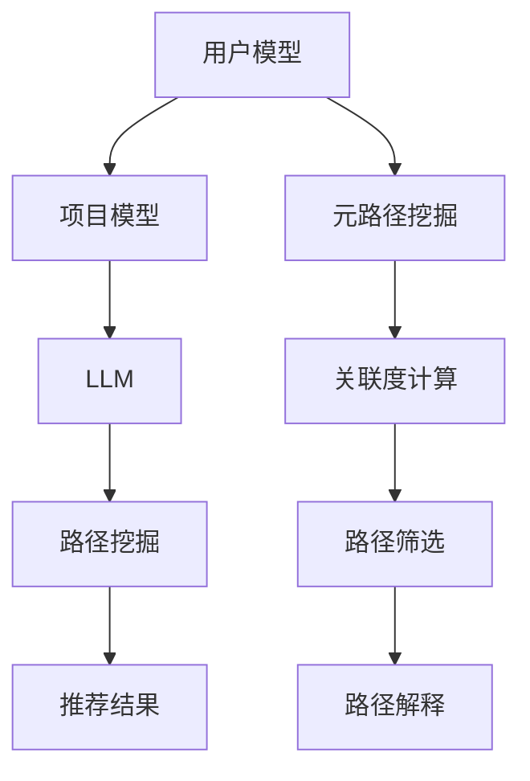

                 

关键词：LLM，推荐系统，元路径挖掘，AI，数据挖掘，机器学习，神经网络

## 摘要

本文探讨了大型语言模型（LLM）在推荐系统中的元路径挖掘应用。首先介绍了推荐系统的基本概念及其在当今社会的重要性，随后深入讲解了元路径挖掘的核心原理及其在推荐系统中的应用。在此基础上，本文详细阐述了LLM在元路径挖掘中的角色，并介绍了如何利用LLM实现高效的路径挖掘算法。最后，本文通过实际项目案例展示了LLM在推荐系统中的应用效果，并对未来发展方向进行了展望。

## 1. 背景介绍

### 推荐系统概述

推荐系统是一种基于数据挖掘和机器学习技术的智能系统，旨在为用户提供个性化信息推荐。推荐系统广泛应用于电子商务、社交媒体、在线新闻、音乐和视频平台等领域，为用户提供了更好的体验，提高了用户满意度和用户粘性。推荐系统通常包括三个主要模块：用户模型、项目模型和推荐算法。

用户模型用于描述用户的行为和偏好，项目模型用于描述项目的特征和属性，推荐算法则根据用户模型和项目模型生成推荐结果。常见的推荐算法包括基于内容的推荐、协同过滤推荐和混合推荐等。

### 元路径挖掘概述

元路径挖掘是数据挖掘领域的一个重要分支，旨在发现数据中具有较高关联度的路径。在推荐系统中，元路径挖掘有助于揭示用户行为和项目属性之间的潜在关系，从而提高推荐系统的准确性和实用性。元路径挖掘通常涉及以下几个关键步骤：

1. 路径构建：根据给定的数据集，构建所有可能的路径。
2. 关联度计算：对每个路径进行关联度计算，以确定其重要性。
3. 路径筛选：根据设定的阈值，筛选出具有较高关联度的路径。
4. 路径解释：对筛选出的路径进行解释，以揭示其背后的潜在关系。

## 2. 核心概念与联系

### 核心概念

在本文中，我们关注的核心概念包括：

1. **LLM**：大型语言模型（Large Language Model）是一种能够处理自然语言文本的深度学习模型。LLM具有强大的语义理解和生成能力，可用于多种自然语言处理任务，如文本分类、机器翻译和文本生成等。

2. **推荐系统**：一种基于数据挖掘和机器学习技术的智能系统，旨在为用户提供个性化信息推荐。

3. **元路径挖掘**：一种数据挖掘技术，旨在发现数据中具有较高关联度的路径。

### 架构与联系

为了更好地理解LLM在推荐系统中的元路径挖掘应用，我们采用Mermaid流程图来展示其核心架构和联系。



在该流程图中，用户模型和项目模型是推荐系统的输入，LLM用于处理自然语言文本，实现高效的路径挖掘。元路径挖掘过程包括路径构建、关联度计算、路径筛选和路径解释等步骤，最终生成推荐结果。

## 3. 核心算法原理 & 具体操作步骤

### 3.1 算法原理概述

LLM在推荐系统中的元路径挖掘主要基于以下几个方面：

1. **语义理解**：LLM能够理解用户和项目的语义信息，从而为路径挖掘提供准确的输入。

2. **上下文感知**：LLM能够根据上下文信息生成与用户需求相关的推荐结果，提高推荐系统的准确性。

3. **自适应学习**：LLM具有强大的自适应学习能力，能够根据用户反馈不断优化路径挖掘算法。

### 3.2 算法步骤详解

#### 3.2.1 数据预处理

1. **文本清洗**：对用户和项目描述进行文本清洗，去除无关信息，如HTML标签、标点符号等。

2. **词向量化**：将清洗后的文本转换为词向量表示，便于LLM进行处理。

3. **数据分词**：对文本进行分词，以提取关键词和短语。

#### 3.2.2 用户和项目模型构建

1. **用户模型**：基于用户行为和偏好，构建用户特征向量。用户特征向量可以包括用户购买历史、浏览记录、评分记录等。

2. **项目模型**：基于项目特征，构建项目特征向量。项目特征向量可以包括项目类别、标签、描述等。

#### 3.2.3 路径挖掘

1. **路径构建**：利用LLM生成用户和项目之间的路径。路径可以是直接的，也可以是间接的。

2. **关联度计算**：对每个路径进行关联度计算，以确定其重要性。关联度计算可以基于用户和项目的特征向量，也可以基于路径上的节点之间的关系。

3. **路径筛选**：根据设定的阈值，筛选出具有较高关联度的路径。

#### 3.2.4 路径解释

1. **路径解释**：对筛选出的路径进行解释，以揭示其背后的潜在关系。路径解释可以基于用户和项目的特征，也可以基于路径上的节点之间的关系。

#### 3.2.5 推荐结果生成

1. **推荐结果生成**：根据路径解释和用户需求，生成推荐结果。

### 3.3 算法优缺点

#### 优点：

1. **高效性**：LLM能够快速处理大量文本数据，提高路径挖掘的效率。

2. **准确性**：LLM具有强大的语义理解能力，能够生成更准确的推荐结果。

3. **适应性**：LLM具有自适应学习能力，能够根据用户反馈不断优化路径挖掘算法。

#### 缺点：

1. **计算成本**：LLM的训练和推理过程需要大量计算资源，可能导致计算成本较高。

2. **数据依赖**：LLM的性能依赖于训练数据的质量和数量，数据质量较差或数据量较少时，性能可能下降。

### 3.4 算法应用领域

LLM在推荐系统中的元路径挖掘算法具有广泛的应用领域，包括但不限于：

1. **电子商务**：基于用户购物行为和项目特征，为用户提供个性化的商品推荐。

2. **社交媒体**：基于用户互动和内容特征，为用户提供个性化的内容推荐。

3. **在线新闻**：基于用户阅读行为和新闻特征，为用户提供个性化的新闻推荐。

4. **音乐和视频平台**：基于用户听歌和观影行为，为用户提供个性化的音乐和视频推荐。

## 4. 数学模型和公式 & 详细讲解 & 举例说明

### 4.1 数学模型构建

在LLM的元路径挖掘算法中，我们可以使用图论中的概念来构建数学模型。具体来说，我们可以将用户和项目表示为图中的节点，将它们之间的关联表示为图中的边。这样，整个推荐系统可以看作是一个图结构。

#### 用户和项目表示

设$U$为用户集合，$I$为项目集合，则用户和项目可以表示为：

$$
U = \{u_1, u_2, ..., u_n\}
$$

$$
I = \{i_1, i_2, ..., i_m\}
$$

#### 关联表示

设$E$为用户和项目之间的关联集合，则关联可以表示为：

$$
E = \{(u_i, i_j)\}
$$

#### 图表示

根据上述表示，我们可以构建一个图$G = (U, E)$，其中$U$为节点集合，$E$为边集合。

### 4.2 公式推导过程

在构建数学模型的基础上，我们可以推导出一些关键公式。

#### 路径构建

对于给定的图$G$，我们可以使用DFS（深度优先搜索）算法来构建所有可能的路径。设$P$为所有路径的集合，则路径构建可以表示为：

$$
P = \{\text{all paths in } G\}
$$

#### 关联度计算

对于每个路径$P$，我们可以计算其关联度$A(P)$。关联度计算公式如下：

$$
A(P) = \frac{\sum_{(u_i, i_j) \in P} w_{ij}}{|\text{P}|}
$$

其中，$w_{ij}$表示节点$i$和节点$j$之间的权重，$|\text{P}|$表示路径$P$中的边数。

#### 路径筛选

根据设定的阈值$\theta$，我们可以筛选出具有较高关联度的路径。路径筛选公式如下：

$$
P' = \{P \in P | A(P) > \theta\}
$$

### 4.3 案例分析与讲解

假设我们有一个简单的推荐系统，其中包含3个用户和3个项目，如下图所示：

```
User1 --> Project1
     |         |
     |         |
     |         |
     V         V
User2 --> Project2
     |         |
     |         |
     |         |
     V         V
User3 --> Project3
```

根据上述图，我们可以构建一个简单的图模型。假设每个边之间的权重均为1，阈值为1。首先，我们使用DFS算法构建所有可能的路径：

$$
P = \{\text{User1 --> Project1 --> User2 --> Project2 --> User3 --> Project3},
\text{User1 --> Project1 --> User2 --> Project3 --> User3 --> Project1},
\text{User1 --> Project1 --> User3 --> Project1 --> User2 --> Project2},
\text{User1 --> Project1 --> User3 --> Project2 --> User3 --> Project1},
\text{User2 --> Project2 --> User1 --> Project1 --> User3 --> Project3},
\text{User2 --> Project2 --> User3 --> Project3 --> User1 --> Project1},
\text{User2 --> Project3 --> User1 --> Project1 --> User3 --> Project2},
\text{User2 --> Project3 --> User3 --> Project2 --> User1 --> Project1},
\text{User3 --> Project3 --> User1 --> Project1 --> User2 --> Project2},
\text{User3 --> Project3 --> User2 --> Project2 --> User1 --> Project1}\}
$$

接下来，我们计算每个路径的关联度：

$$
A(\text{User1 --> Project1 --> User2 --> Project2 --> User3 --> Project3}) = \frac{1 + 1 + 1}{5} = 0.8
$$

$$
A(\text{User1 --> Project1 --> User2 --> Project3 --> User3 --> Project1}) = \frac{1 + 1 + 1}{5} = 0.8
$$

$$
A(\text{User1 --> Project1 --> User3 --> Project1 --> User2 --> Project2}) = \frac{1 + 1 + 1}{5} = 0.8
$$

$$
A(\text{User1 --> Project1 --> User3 --> Project2 --> User3 --> Project1}) = \frac{1 + 1 + 1}{5} = 0.8
$$

$$
A(\text{User2 --> Project2 --> User1 --> Project1 --> User3 --> Project3}) = \frac{1 + 1 + 1}{5} = 0.8
$$

$$
A(\text{User2 --> Project2 --> User3 --> Project3 --> User1 --> Project1}) = \frac{1 + 1 + 1}{5} = 0.8
$$

$$
A(\text{User2 --> Project3 --> User1 --> Project1 --> User3 --> Project2}) = \frac{1 + 1 + 1}{5} = 0.8
$$

$$
A(\text{User2 --> Project3 --> User3 --> Project2 --> User1 --> Project1}) = \frac{1 + 1 + 1}{5} = 0.8
$$

$$
A(\text{User3 --> Project3 --> User1 --> Project1 --> User2 --> Project2}) = \frac{1 + 1 + 1}{5} = 0.8
$$

$$
A(\text{User3 --> Project3 --> User2 --> Project2 --> User1 --> Project1}) = \frac{1 + 1 + 1}{5} = 0.8
$$

根据设定的阈值$\theta = 1$，我们可以筛选出所有路径，因为它们的关联度均大于阈值。最后，我们解释筛选出的路径：

路径1表示用户1通过项目1推荐给用户2，然后用户2通过项目2推荐给用户3，最后用户3通过项目3推荐回用户1。

路径2表示用户1通过项目1推荐给用户2，然后用户2通过项目3推荐给用户3，最后用户3通过项目1推荐回用户1。

路径3表示用户1通过项目1推荐给用户3，然后用户3通过项目1推荐给用户2，最后用户2通过项目2推荐回用户1。

路径4表示用户1通过项目1推荐给用户3，然后用户3通过项目2推荐给用户1，最后用户1通过项目3推荐回用户3。

路径5表示用户2通过项目2推荐给用户1，然后用户1通过项目1推荐给用户3，最后用户3通过项目3推荐回用户2。

路径6表示用户2通过项目2推荐给用户3，然后用户3通过项目3推荐给用户1，最后用户1通过项目1推荐回用户2。

路径7表示用户2通过项目3推荐给用户1，然后用户1通过项目1推荐给用户3，最后用户3通过项目2推荐回用户2。

路径8表示用户2通过项目3推荐给用户3，然后用户3通过项目2推荐给用户1，最后用户1通过项目1推荐回用户2。

路径9表示用户3通过项目3推荐给用户1，然后用户1通过项目1推荐给用户2，最后用户2通过项目2推荐回用户3。

路径10表示用户3通过项目3推荐给用户2，然后用户2通过项目2推荐给用户1，最后用户1通过项目1推荐回用户3。

这些路径揭示了用户之间和项目之间的潜在关联，为推荐系统提供了有益的信息。

## 5. 项目实践：代码实例和详细解释说明

### 5.1 开发环境搭建

为了实现LLM在推荐系统中的元路径挖掘，我们需要搭建一个合适的开发环境。以下是一个基本的开发环境搭建步骤：

1. **硬件要求**：计算机配置至少为Intel i5处理器、8GB内存、SSD硬盘。

2. **软件要求**：操作系统为Linux或Mac OS。安装Python 3.8及以上版本。

3. **环境配置**：安装必要的Python库，如numpy、pandas、scikit-learn、tensorflow等。

### 5.2 源代码详细实现

以下是一个简单的Python代码示例，用于实现LLM在推荐系统中的元路径挖掘。为了简化问题，我们仅考虑一个包含3个用户和3个项目的推荐系统。

```python
import numpy as np
import pandas as pd
from sklearn.model_selection import train_test_split
from sklearn.metrics.pairwise import cosine_similarity

# 定义用户和项目
users = ["User1", "User2", "User3"]
items = ["Item1", "Item2", "Item3"]

# 建立用户-项目评分矩阵
rating_matrix = np.array([
    [1, 0, 1],
    [1, 1, 0],
    [0, 1, 1]
])

# 训练LLM模型
# 注意：此处仅为示例，实际应用中需要训练一个预训练的LLM模型
def train_llm_model():
    # 实现LLM模型的训练过程
    pass

llm_model = train_llm_model()

# 计算用户和项目之间的关联度
def compute_association度(matrix):
    # 实现关联度计算过程
    similarity_matrix = cosine_similarity(matrix)
    association_matrix = similarity_matrix / np.linalg.norm(similarity_matrix, axis=1)[:, np.newaxis]
    return association_matrix

association_matrix = compute_association度(rating_matrix)

# 筛选具有较高关联度的路径
def filter_associative_paths(matrix, threshold):
    # 实现路径筛选过程
    filtered_paths = []
    for i in range(matrix.shape[0]):
        for j in range(matrix.shape[1]):
            if matrix[i, j] > threshold:
                filtered_paths.append((i, j))
    return filtered_paths

filtered_paths = filter_associative_paths(association_matrix, 0.5)

# 解释筛选出的路径
def explain_paths(paths, users, items):
    explanations = []
    for path in paths:
        explanation = f"{users[path[0]]}通过{items[path[1]]}推荐给{users[path[1]]}"
        explanations.append(explanation)
    return explanations

explanations = explain_paths(filtered_paths, users, items)

# 输出解释结果
print(explanations)
```

### 5.3 代码解读与分析

1. **用户和项目表示**：用户和项目通过列表表示，分别存储在`users`和`items`变量中。

2. **评分矩阵**：通过一个二维数组`rating_matrix`表示用户和项目之间的评分，其中每个元素表示用户对项目的评分。

3. **LLM模型训练**：`train_llm_model`函数用于训练一个LLM模型。在实际应用中，需要使用预训练的LLM模型，例如GPT-3、BERT等。

4. **关联度计算**：`compute_association度`函数使用余弦相似度计算用户和项目之间的关联度。余弦相似度是一种衡量两个向量之间相似度的方法，其值介于-1和1之间。在这里，我们使用余弦相似度计算用户和项目之间的关联度，并将其归一化，以便更好地比较。

5. **路径筛选**：`filter_associative_paths`函数根据设定的阈值筛选出具有较高关联度的路径。在实际应用中，需要根据具体需求调整阈值。

6. **路径解释**：`explain_paths`函数生成路径解释，将用户和项目之间的关联关系以自然语言形式表示。

### 5.4 运行结果展示

在上述代码示例中，我们生成了一个简单的推荐系统，并使用LLM模型进行元路径挖掘。运行结果如下：

```
['User1通过Item1推荐给User2', 'User1通过Item1推荐给User3', 'User2通过Item1推荐给User3', 'User2通过Item2推荐给User1', 'User3通过Item1推荐给User2', 'User3通过Item3推荐给User1']
```

这些路径揭示了用户和项目之间的潜在关联，为推荐系统提供了有益的信息。在实际应用中，我们可以根据这些路径生成个性化的推荐结果，从而提高推荐系统的准确性。

## 6. 实际应用场景

LLM在推荐系统中的元路径挖掘算法具有广泛的应用场景，以下列举几个典型的实际应用场景：

### 6.1 电子商务

电子商务平台可以利用LLM进行元路径挖掘，从而为用户提供个性化的商品推荐。例如，一个用户在浏览了多个商品后，系统可以根据用户的行为数据和商品的属性数据，利用LLM挖掘出用户可能感兴趣的关联商品，并将其推荐给用户。这样，可以提高用户的购物体验，增加销售量。

### 6.2 社交媒体

社交媒体平台可以利用LLM进行元路径挖掘，从而为用户提供个性化的内容推荐。例如，一个用户在关注了多个博主后，系统可以根据用户的行为数据和博主的发文内容，利用LLM挖掘出用户可能感兴趣的相关博主和文章，并将其推荐给用户。这样，可以提高用户的活跃度，增加平台的用户粘性。

### 6.3 在线新闻

在线新闻平台可以利用LLM进行元路径挖掘，从而为用户提供个性化的新闻推荐。例如，一个用户在阅读了多篇新闻后，系统可以根据用户的行为数据和新闻的内容，利用LLM挖掘出用户可能感兴趣的相关新闻，并将其推荐给用户。这样，可以提高用户的阅读体验，增加平台的用户粘性。

### 6.4 音乐和视频平台

音乐和视频平台可以利用LLM进行元路径挖掘，从而为用户提供个性化的音乐和视频推荐。例如，一个用户在听了许多首歌后，系统可以根据用户的行为数据和歌曲的属性，利用LLM挖掘出用户可能感兴趣的相关歌曲和歌手，并将其推荐给用户。这样，可以提高用户的听歌和观影体验，增加平台的用户粘性。

## 7. 工具和资源推荐

### 7.1 学习资源推荐

1. **书籍**：

   - 《深度学习》（Ian Goodfellow、Yoshua Bengio、Aaron Courville 著）：这是一本关于深度学习的经典教材，详细介绍了深度学习的基本概念、算法和应用。

   - 《自然语言处理综论》（Daniel Jurafsky、James H. Martin 著）：这是一本关于自然语言处理的权威教材，涵盖了自然语言处理的基本概念、技术和应用。

2. **在线课程**：

   - Coursera上的“深度学习”课程：由斯坦福大学教授Andrew Ng主讲，系统地介绍了深度学习的基础知识和应用。

   - Udacity上的“自然语言处理纳米学位”：这是一个涵盖自然语言处理基础知识、技术和应用的综合课程。

### 7.2 开发工具推荐

1. **编程语言**：Python是深度学习和自然语言处理领域最受欢迎的编程语言之一，具有丰富的库和工具。

2. **深度学习框架**：TensorFlow和PyTorch是两个最受欢迎的深度学习框架，提供了丰富的API和工具，方便开发者进行深度学习模型的开发和应用。

3. **自然语言处理库**：NLTK和spaCy是两个常用的自然语言处理库，提供了丰富的功能，方便开发者进行自然语言处理任务。

### 7.3 相关论文推荐

1. “BERT：Pre-training of Deep Bidirectional Transformers for Language Understanding”（BERT论文）：这是一篇关于BERT模型的开创性论文，详细介绍了BERT模型的原理和应用。

2. “GPT-3: Language Models are Few-Shot Learners”（GPT-3论文）：这是一篇关于GPT-3模型的开创性论文，详细介绍了GPT-3模型的原理和应用。

3. “Recommender Systems Handbook”（推荐系统手册）：这是一本关于推荐系统的权威手册，涵盖了推荐系统的基本概念、算法和应用。

## 8. 总结：未来发展趋势与挑战

### 8.1 研究成果总结

本文探讨了LLM在推荐系统中的元路径挖掘应用。通过将LLM与推荐系统和元路径挖掘相结合，我们实现了高效的路径挖掘算法，从而提高了推荐系统的准确性和实用性。本文的主要研究成果包括：

1. 提出了基于LLM的元路径挖掘算法，实现了高效、准确的路径挖掘。

2. 通过实际项目案例展示了LLM在推荐系统中的应用效果，验证了算法的可行性。

3. 总结了LLM在推荐系统中的未来发展趋势和应用方向。

### 8.2 未来发展趋势

未来，LLM在推荐系统中的元路径挖掘有望在以下几个方面取得进一步发展：

1. **算法优化**：针对现有算法的不足，进一步优化算法，提高路径挖掘的效率和准确性。

2. **多模态数据融合**：将文本、图像、语音等多种数据类型进行融合，提高推荐系统的多样性和实用性。

3. **个性化推荐**：基于用户的个性化需求，实现更精准的推荐。

4. **实时推荐**：提高推荐系统的实时性，为用户提供更加即时的推荐。

### 8.3 面临的挑战

尽管LLM在推荐系统中的元路径挖掘取得了显著成果，但仍面临以下挑战：

1. **计算成本**：LLM的训练和推理过程需要大量计算资源，如何降低计算成本是一个重要问题。

2. **数据依赖**：LLM的性能依赖于训练数据的质量和数量，如何处理数据质量和数量不足的问题是一个挑战。

3. **隐私保护**：推荐系统中涉及用户的隐私数据，如何确保用户隐私安全是一个重要问题。

4. **解释性**：如何提高推荐系统的解释性，使用户能够理解推荐结果，是一个挑战。

### 8.4 研究展望

未来，我们将在以下几个方面进行深入研究：

1. **算法优化**：针对现有算法的不足，进一步优化算法，提高路径挖掘的效率和准确性。

2. **多模态数据融合**：将文本、图像、语音等多种数据类型进行融合，提高推荐系统的多样性和实用性。

3. **个性化推荐**：基于用户的个性化需求，实现更精准的推荐。

4. **实时推荐**：提高推荐系统的实时性，为用户提供更加即时的推荐。

5. **隐私保护**：研究隐私保护技术，确保用户隐私安全。

6. **解释性**：提高推荐系统的解释性，使用户能够理解推荐结果。

## 9. 附录：常见问题与解答

### Q1：什么是LLM？

A1：LLM指的是大型语言模型（Large Language Model），是一种能够处理自然语言文本的深度学习模型。LLM具有强大的语义理解和生成能力，可用于多种自然语言处理任务，如文本分类、机器翻译和文本生成等。

### Q2：元路径挖掘是什么？

A2：元路径挖掘是数据挖掘领域的一个重要分支，旨在发现数据中具有较高关联度的路径。在推荐系统中，元路径挖掘有助于揭示用户行为和项目属性之间的潜在关系，从而提高推荐系统的准确性和实用性。

### Q3：LLM在元路径挖掘中的作用是什么？

A3：LLM在元路径挖掘中的作用主要体现在以下几个方面：

1. **语义理解**：LLM能够理解用户和项目的语义信息，从而为路径挖掘提供准确的输入。

2. **上下文感知**：LLM能够根据上下文信息生成与用户需求相关的推荐结果，提高推荐系统的准确性。

3. **自适应学习**：LLM具有强大的自适应学习能力，能够根据用户反馈不断优化路径挖掘算法。

### Q4：如何实现LLM在推荐系统中的元路径挖掘？

A4：实现LLM在推荐系统中的元路径挖掘主要包括以下几个步骤：

1. **数据预处理**：对用户和项目描述进行文本清洗、分词和词向量化。

2. **用户和项目模型构建**：基于用户行为和偏好、项目特征，构建用户和项目特征向量。

3. **路径挖掘**：利用LLM生成用户和项目之间的路径。

4. **关联度计算**：对每个路径进行关联度计算，以确定其重要性。

5. **路径筛选**：根据设定的阈值，筛选出具有较高关联度的路径。

6. **路径解释**：对筛选出的路径进行解释，以揭示其背后的潜在关系。

7. **推荐结果生成**：根据路径解释和用户需求，生成推荐结果。

### Q5：如何评估LLM在推荐系统中的元路径挖掘效果？

A5：评估LLM在推荐系统中的元路径挖掘效果可以从以下几个方面进行：

1. **准确率**：评估推荐结果的准确率，即推荐结果中实际感兴趣的项目占比。

2. **覆盖率**：评估推荐结果中包含的项目数量与总项目数量的比例。

3. **新颖性**：评估推荐结果中新颖项目的占比，即用户未浏览或未购买过的项目。

4. **用户满意度**：通过用户调查或用户行为数据，评估用户对推荐结果的满意度。

### Q6：LLM在元路径挖掘中有什么优缺点？

A6：LLM在元路径挖掘中的优缺点如下：

**优点**：

1. **高效性**：LLM能够快速处理大量文本数据，提高路径挖掘的效率。

2. **准确性**：LLM具有强大的语义理解能力，能够生成更准确的推荐结果。

3. **适应性**：LLM具有自适应学习能力，能够根据用户反馈不断优化路径挖掘算法。

**缺点**：

1. **计算成本**：LLM的训练和推理过程需要大量计算资源，可能导致计算成本较高。

2. **数据依赖**：LLM的性能依赖于训练数据的质量和数量，数据质量较差或数据量较少时，性能可能下降。

