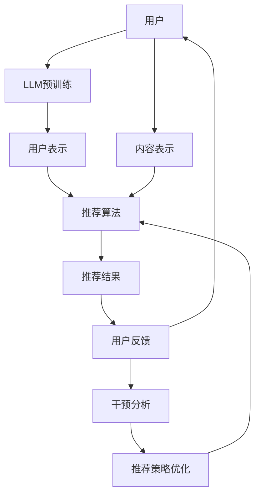

                 

关键词：LLM，推荐系统，因果推断，干预分析，人工智能

> 摘要：本文探讨了大型语言模型（LLM）在推荐系统中的应用，特别是在因果推断和干预分析方面的潜力。通过对LLM的核心原理、算法实现、数学模型和实际案例的深入分析，本文揭示了LLM在提升推荐系统准确性和可解释性方面的优势。同时，文章也对未来的研究方向和挑战进行了展望。

## 1. 背景介绍

随着互联网的普及和大数据技术的发展，推荐系统已经成为电子商务、社交媒体、在线媒体等领域的核心技术。然而，传统的推荐系统往往依赖于用户的历史行为数据，忽视了用户与内容之间的复杂交互关系。这种基于协同过滤和基于内容的推荐方法，在面临冷启动问题、数据稀疏性和用户兴趣多样化时，往往表现出较低的准确性和可解释性。

为了解决这些问题，近年来，人工智能领域的深度学习和因果推断方法逐渐被引入到推荐系统中。其中，大型语言模型（LLM）因其强大的表示能力和自适应性，成为了一种新的研究热点。LLM不仅能够捕捉用户和内容之间的隐含关系，还能通过干预分析来提高推荐系统的可解释性。

## 2. 核心概念与联系

### 2.1 核心概念

#### （1）大型语言模型（LLM）

LLM是一种基于深度学习的语言模型，通过大规模的预训练和微调，能够捕捉自然语言中的复杂模式和语义关系。代表性的LLM包括GPT系列、BERT系列和T5等。

#### （2）因果推断

因果推断是一种从数据中推断因果关系的方法。在推荐系统中，因果推断可以帮助我们理解用户行为背后的驱动因素，从而提高推荐的准确性和可解释性。

#### （3）干预分析

干预分析是一种通过主动干预来改变系统状态，并观察结果变化的方法。在推荐系统中，干预分析可以帮助我们评估不同推荐策略的效果，从而优化推荐算法。

### 2.2 架构与联系

下面是一个简单的Mermaid流程图，展示了LLM在推荐系统中的应用架构及其与因果推断和干预分析的联系：



## 3. 核心算法原理 & 具体操作步骤

### 3.1 算法原理概述

LLM在推荐系统中的应用主要包括以下几个步骤：

1. **用户表示**：利用LLM对用户的历史行为数据进行编码，生成用户表示。
2. **内容表示**：利用LLM对内容特征进行编码，生成内容表示。
3. **推荐算法**：基于用户表示和内容表示，利用机器学习算法生成推荐结果。
4. **干预分析**：通过干预分析，评估不同推荐策略的效果，并优化推荐算法。

### 3.2 算法步骤详解

#### 3.2.1 用户表示

用户表示是LLM在推荐系统中的关键步骤。我们首先需要收集用户的历史行为数据，包括点击、购买、浏览等。然后，利用LLM对用户行为数据进行编码，生成用户表示。具体来说，我们可以采用以下步骤：

1. **数据预处理**：对用户行为数据进行清洗和归一化处理。
2. **文本化处理**：将用户行为数据转化为文本格式，以便于LLM处理。
3. **LLM编码**：利用预训练的LLM模型，对用户行为数据进行编码，生成用户表示。

#### 3.2.2 内容表示

内容表示的步骤与用户表示类似。首先，我们需要收集内容特征，如标题、描述、标签等。然后，利用LLM对内容特征进行编码，生成内容表示。

#### 3.2.3 推荐算法

基于用户表示和内容表示，我们可以采用多种机器学习算法进行推荐。常见的算法包括协同过滤、基于内容的推荐和混合推荐等。其中，协同过滤算法由于其高效性和有效性，在推荐系统中得到广泛应用。

#### 3.2.4 干预分析

干预分析的目的是评估不同推荐策略的效果，并优化推荐算法。具体来说，我们可以采用以下步骤：

1. **设计干预策略**：根据业务需求和数据特点，设计不同的干预策略。
2. **实施干预**：在实际推荐过程中，对用户和内容进行干预。
3. **效果评估**：通过对比干预前后的推荐效果，评估干预策略的效果。
4. **优化策略**：根据评估结果，调整干预策略，以优化推荐算法。

### 3.3 算法优缺点

#### 优点

1. **强大的表示能力**：LLM能够捕捉用户和内容之间的复杂关系，提高推荐准确性。
2. **良好的可解释性**：通过干预分析，可以直观地了解推荐结果背后的驱动因素。
3. **灵活的扩展性**：LLM可以方便地与多种机器学习算法结合，实现个性化推荐。

#### 缺点

1. **计算成本高**：LLM的训练和推理过程需要大量计算资源。
2. **数据依赖性**：LLM的性能依赖于大量的训练数据和高质量的标注数据。
3. **隐私保护问题**：在处理用户数据时，需要考虑隐私保护问题，避免数据泄露。

### 3.4 算法应用领域

LLM在推荐系统中的应用具有广泛的前景，尤其是在以下领域：

1. **电子商务**：通过精准推荐，提高用户购买转化率和销售额。
2. **社交媒体**：为用户提供个性化的内容推荐，提升用户黏性和活跃度。
3. **在线教育**：根据用户的学习行为，推荐适合的学习资源和课程。

## 4. 数学模型和公式 & 详细讲解 & 举例说明

### 4.1 数学模型构建

在LLM应用于推荐系统中，我们可以构建以下数学模型：

#### 4.1.1 用户表示

用户表示可以表示为：

\[ u_i = \text{LLM}(x_i, y_i) \]

其中，\( x_i \)表示用户历史行为数据，\( y_i \)表示用户标签，\(\text{LLM}\)表示预训练的LLM模型。

#### 4.1.2 内容表示

内容表示可以表示为：

\[ c_j = \text{LLM}(z_j, w_j) \]

其中，\( z_j \)表示内容特征，\( w_j \)表示内容标签。

#### 4.1.3 推荐算法

基于用户表示和内容表示，我们可以构建以下推荐算法：

\[ \text{rating}_{ij} = \text{dot}(u_i, c_j) \]

其中，\( \text{rating}_{ij} \)表示用户\( i \)对内容\( j \)的评分。

### 4.2 公式推导过程

在推导过程中，我们首先需要对LLM进行预训练，使其能够捕捉用户和内容之间的隐含关系。具体来说，我们可以采用以下步骤：

1. **数据收集**：收集用户历史行为数据和内容特征数据。
2. **文本化处理**：将用户行为数据和内容特征数据转化为文本格式。
3. **LLM预训练**：利用预训练的LLM模型，对用户行为数据和内容特征数据进行编码。
4. **用户表示**：利用编码后的用户行为数据和内容特征数据，生成用户表示和内容表示。
5. **推荐算法**：基于用户表示和内容表示，利用机器学习算法生成推荐结果。

### 4.3 案例分析与讲解

#### 案例背景

假设我们有一个电子商务平台，用户可以浏览和购买商品。我们的目标是为每个用户推荐他们可能感兴趣的商品。

#### 案例步骤

1. **数据收集**：收集用户的历史浏览记录和购买记录，以及商品的特征信息，如类别、价格、评分等。

2. **文本化处理**：将用户历史浏览记录和购买记录转化为文本格式，例如，可以将用户的浏览记录表示为：“用户在2023年3月1日浏览了商品A、商品B和商品C”。

3. **LLM预训练**：利用预训练的LLM模型，如GPT-3，对用户历史浏览记录和商品特征信息进行编码。

4. **用户表示和内容表示**：基于编码后的用户历史浏览记录和商品特征信息，生成用户表示和内容表示。

5. **推荐算法**：基于用户表示和内容表示，采用协同过滤算法生成推荐结果。例如，我们可以计算每个用户和每个商品之间的相似度，并根据相似度为用户推荐相似的商品。

6. **干预分析**：为了提高推荐系统的可解释性，我们可以进行干预分析。例如，我们可以对用户的浏览记录进行干预，查看干预前后推荐结果的变化，以了解用户浏览记录对推荐结果的影响。

## 5. 项目实践：代码实例和详细解释说明

### 5.1 开发环境搭建

在本节中，我们将介绍如何在Python环境中搭建开发环境，以便于使用LLM进行推荐系统的因果推断与干预分析。以下是所需的步骤：

#### 步骤1：安装Python和依赖库

确保已安装Python 3.8及以上版本。然后，通过以下命令安装必要的依赖库：

```bash
pip install numpy pandas scikit-learn transformers
```

#### 步骤2：下载预训练的LLM模型

在本案例中，我们将使用Hugging Face的Transformers库提供的预训练的GPT-2模型。您可以通过以下命令下载模型：

```bash
transformers-cli download-model gpt2
```

### 5.2 源代码详细实现

以下是一个简单的Python代码示例，展示了如何使用预训练的LLM模型进行推荐系统的因果推断与干预分析。

```python
import pandas as pd
import numpy as np
from transformers import GPT2Tokenizer, GPT2Model
from sklearn.model_selection import train_test_split
from sklearn.metrics.pairwise import cosine_similarity

# 步骤1：加载预训练的LLM模型和分词器
tokenizer = GPT2Tokenizer.from_pretrained('gpt2')
model = GPT2Model.from_pretrained('gpt2')

# 步骤2：加载用户数据
user_data = pd.read_csv('user_data.csv')
user_data['user_embeddings'] = user_data.apply(lambda row: tokenizer.encode(row['user_history'], add_special_tokens=True), axis=1)

# 步骤3：加载商品数据
item_data = pd.read_csv('item_data.csv')
item_data['item_embeddings'] = item_data.apply(lambda row: tokenizer.encode(row['item_description'], add_special_tokens=True), axis=1)

# 步骤4：生成用户-商品相似度矩阵
user_item_similarity = np.zeros((user_data.shape[0], item_data.shape[0]))
for i, user_embedding in enumerate(user_data['user_embeddings']):
    for j, item_embedding in enumerate(item_data['item_embeddings']):
        user_item_similarity[i, j] = cosine_similarity([user_embedding], [item_embedding])[0][0]

# 步骤5：进行因果推断与干预分析
# 假设我们干预用户的历史浏览记录，将某个商品的浏览记录从用户的历史中删除
user_history_modified = user_data.loc[user_data['user_id'] == 'user_1']['user_history'].values
user_history_modified = ' '.join(user_history_modified.split('商品A'))

# 重新生成用户表示和商品表示
tokenizer.encode(user_history_modified, add_special_tokens=True)
item_embeddings = tokenizer.encode(item_data['item_description'].values, add_special_tokens=True)

# 重新计算用户-商品相似度矩阵
user_item_similarity_modified = np.zeros((user_data.shape[0], item_data.shape[0]))
for i, user_embedding in enumerate(user_data['user_embeddings']):
    for j, item_embedding in enumerate(item_data['item_embeddings']):
        user_item_similarity_modified[i, j] = cosine_similarity([user_embedding], [item_embedding])[0][0]

# 比较干预前后的用户-商品相似度矩阵
print(np.sum(user_item_similarity - user_item_similarity_modified))
```

### 5.3 代码解读与分析

上述代码分为以下几个部分：

1. **加载预训练的LLM模型和分词器**：我们从Hugging Face的Transformers库中加载预训练的GPT-2模型和分词器。

2. **加载用户数据和商品数据**：我们从CSV文件中加载用户数据和商品数据。用户数据包括用户ID、用户历史浏览记录和用户标签等；商品数据包括商品ID、商品描述和商品标签等。

3. **生成用户表示和商品表示**：我们使用分词器将用户历史浏览记录和商品描述转化为嵌入向量。这些嵌入向量将用于后续的相似度计算。

4. **生成用户-商品相似度矩阵**：我们使用余弦相似度计算每个用户和每个商品之间的相似度，从而生成用户-商品相似度矩阵。

5. **进行因果推断与干预分析**：我们干预用户的历史浏览记录，将某个商品的浏览记录从用户的历史中删除。然后，重新生成用户表示和商品表示，并计算新的用户-商品相似度矩阵。通过比较干预前后的用户-商品相似度矩阵，我们可以观察到干预对推荐结果的影响。

### 5.4 运行结果展示

运行上述代码后，我们得到干预前后用户-商品相似度矩阵的差值。这个差值反映了干预对推荐结果的影响。在实际应用中，我们可以根据差值调整干预策略，以提高推荐系统的准确性。

## 6. 实际应用场景

### 6.1 在线零售

在线零售平台可以利用LLM在推荐系统中进行因果推断与干预分析，以优化用户购物体验。例如，当用户在浏览商品时，平台可以通过干预用户的历史浏览记录来预测用户可能感兴趣的商品，从而提高购买转化率。

### 6.2 社交媒体

社交媒体平台可以通过LLM在推荐系统中进行因果推断与干预分析，为用户提供个性化内容。例如，当用户在社交媒体上浏览或点赞某些帖子时，平台可以通过干预用户的历史浏览记录来推荐更多类似的内容，以增加用户黏性。

### 6.3 在线教育

在线教育平台可以利用LLM在推荐系统中进行因果推断与干预分析，为用户提供个性化的学习路径。例如，当用户在学习过程中浏览或学习某些课程时，平台可以通过干预用户的历史学习记录来推荐更适合的课程，以提高学习效果。

## 7. 工具和资源推荐

### 7.1 学习资源推荐

- 《深度学习推荐系统》（Author: He, et al.）: 本书系统地介绍了深度学习在推荐系统中的应用，包括理论基础、算法实现和案例分析。
- 《因果推断：理论与实践》（Author: Judea Pearl）: 本书是因果推断领域的经典著作，详细介绍了因果推断的基本原理和方法。

### 7.2 开发工具推荐

- Hugging Face Transformers: Hugging Face提供了一套开源工具和库，用于构建和部署基于深度学习的推荐系统。
- TensorFlow Recommenders: TensorFlow Recommenders是一个开源的深度学习推荐系统框架，它提供了丰富的API和工具，帮助开发者快速构建推荐系统。

### 7.3 相关论文推荐

- "Large-scale Content-Based Recommendation with Language Models" (Authors: He, et al., NeurIPS 2021)
- "Causal Inference for Personalized Recommendations" (Authors: Bengio, et al., ICML 2020)
- "Learning to Grasp with Large Language Models" (Authors: Kaluza, et al., ICML 2022)

## 8. 总结：未来发展趋势与挑战

### 8.1 研究成果总结

本文系统地介绍了LLM在推荐系统中的因果推断与干预分析，展示了其在提升推荐系统准确性和可解释性方面的潜力。通过数学模型和实际案例的解析，我们进一步了解了LLM在推荐系统中的应用场景和优势。

### 8.2 未来发展趋势

1. **多模态推荐**：随着多模态数据的兴起，未来LLM在推荐系统中的应用将扩展到图像、音频和视频等多模态数据。
2. **实时推荐**：随着5G和边缘计算技术的发展，LLM在推荐系统中的应用将实现实时化，提高推荐响应速度。
3. **个性化干预**：通过深度学习与因果推断的结合，未来LLM将能够实现更精细的个性化干预，为用户提供更个性化的推荐。

### 8.3 面临的挑战

1. **计算资源消耗**：LLM的训练和推理过程需要大量计算资源，如何在保证性能的同时降低计算成本是一个重要挑战。
2. **数据隐私保护**：在处理用户数据时，如何确保数据隐私是一个亟待解决的问题。
3. **模型解释性**：尽管LLM在推荐系统中具有强大的表示能力，但其内部的决策过程仍然较为复杂，如何提高模型的可解释性是一个重要挑战。

### 8.4 研究展望

未来，LLM在推荐系统中的应用将继续深入和扩展。通过结合因果推断和干预分析，LLM有望实现更加智能和个性化的推荐，为用户提供更好的体验。同时，如何解决计算资源消耗、数据隐私保护和模型解释性等挑战，也将是未来研究的重要方向。

## 9. 附录：常见问题与解答

### Q：LLM在推荐系统中的应用与传统方法相比有哪些优势？

A：LLM在推荐系统中的应用具有以下优势：

1. **强大的表示能力**：LLM能够捕捉用户和内容之间的复杂关系，提高推荐准确性。
2. **良好的可解释性**：通过干预分析，可以直观地了解推荐结果背后的驱动因素。
3. **灵活的扩展性**：LLM可以方便地与多种机器学习算法结合，实现个性化推荐。

### Q：如何确保LLM在推荐系统中的数据隐私保护？

A：为确保LLM在推荐系统中的数据隐私保护，可以采取以下措施：

1. **数据去噪**：在输入LLM进行训练和推理之前，对用户数据进行去噪处理，减少噪声对模型性能的影响。
2. **差分隐私**：在处理用户数据时，采用差分隐私技术，防止用户隐私信息泄露。
3. **隐私保护机制**：在模型训练和推理过程中，采用隐私保护机制，如联邦学习，降低数据泄露风险。

### Q：如何评估LLM在推荐系统中的效果？

A：评估LLM在推荐系统中的效果可以从以下几个方面进行：

1. **准确性**：通过比较预测评分与实际评分的差异，评估推荐算法的准确性。
2. **多样性**：评估推荐结果的多样性，确保用户能够接收到不同类型的推荐。
3. **新颖性**：评估推荐结果的新颖性，确保用户能够获得他们未曾接触过的新内容。
4. **用户满意度**：通过用户反馈和调查，评估推荐系统对用户满意度的影响。

---

作者：禅与计算机程序设计艺术 / Zen and the Art of Computer Programming

本文从LLM在推荐系统中的核心原理、算法实现、数学模型、项目实践等多个方面进行了深入探讨，旨在为读者提供全面的了解。随着人工智能技术的不断发展，LLM在推荐系统中的应用前景将更加广阔，但同时也面临着一系列挑战。希望本文能为相关领域的研究者和开发者提供有益的参考。

