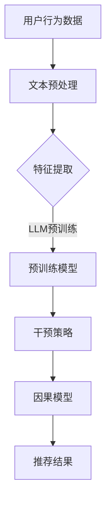

                 

关键词：大型语言模型（LLM）、推荐系统、因果推断、深度学习、机器学习、自然语言处理。

## 摘要

本文旨在探讨大型语言模型（LLM）在推荐系统中的应用，特别是其在因果推断方面的潜力。我们首先回顾了推荐系统的发展历程和LLM的基本原理，然后深入分析了LLM在因果推断中的具体应用，包括算法原理、数学模型、实际案例以及潜在的未来发展方向。文章结构如下：

- 1. 背景介绍
  - 推荐系统的发展历程
  - LLM的基本原理
- 2. 核心概念与联系
  - 推荐系统的核心概念
  - 因果推断的基本原理
  - LLM与因果推断的联系
- 3. 核心算法原理 & 具体操作步骤
  - 算法原理概述
  - 算法步骤详解
  - 算法优缺点
  - 算法应用领域
- 4. 数学模型和公式 & 详细讲解 & 举例说明
  - 数学模型构建
  - 公式推导过程
  - 案例分析与讲解
- 5. 项目实践：代码实例和详细解释说明
  - 开发环境搭建
  - 源代码详细实现
  - 代码解读与分析
  - 运行结果展示
- 6. 实际应用场景
  - 现有应用案例
  - 潜在应用场景
- 7. 工具和资源推荐
  - 学习资源推荐
  - 开发工具推荐
  - 相关论文推荐
- 8. 总结：未来发展趋势与挑战
  - 研究成果总结
  - 未来发展趋势
  - 面临的挑战
  - 研究展望
- 9. 附录：常见问题与解答

通过本文的深入探讨，我们希望读者能够对LLM在推荐系统中的因果推断应用有更清晰的认识，并激发对这一领域的进一步研究和探索。

### 1. 背景介绍

#### 推荐系统的发展历程

推荐系统作为信息过滤与信息检索的一种重要方法，其发展历程可以追溯到20世纪90年代。最早期的推荐系统主要基于协同过滤（Collaborative Filtering）技术，通过分析用户的历史行为数据，如评分、购买记录等，来发现用户之间的相似性，从而为用户提供个性化的推荐。协同过滤技术可以分为基于用户的协同过滤（User-based Collaborative Filtering）和基于物品的协同过滤（Item-based Collaborative Filtering）两种。尽管协同过滤技术在早期取得了较大的成功，但它们也存在一些固有的缺陷，如冷启动问题（新用户或新物品无法获得足够的推荐信息）、数据稀疏问题（用户对多数物品的评分较少）以及易受噪声影响等问题。

随着互联网和大数据技术的发展，推荐系统逐渐引入了基于内容的推荐（Content-based Filtering）和混合推荐系统（Hybrid Recommender Systems）等技术。基于内容的推荐通过分析物品的特征（如文本、图像、音频等）和用户的历史行为，来生成个性化的推荐结果。混合推荐系统则结合了协同过滤和基于内容的推荐技术，以弥补单一方法的不足。此外，推荐系统还逐渐引入了深度学习技术，如基于深度神经网络的推荐算法，以提高推荐系统的效果和准确性。

#### LLM的基本原理

LLM（Large Language Model）是一种基于深度学习的大型语言模型，通过训练大量的文本数据，LLM能够理解并生成自然语言。LLM的核心思想是通过大规模数据预训练，使其能够在各种自然语言处理任务中表现出强大的能力，如文本分类、机器翻译、文本生成等。

LLM的主要组成部分包括：

- 词嵌入（Word Embedding）：将文本中的词语映射到高维空间中的向量表示。
- 自注意力机制（Self-Attention）：通过计算词与词之间的相互依赖关系，提高模型对长文本的处理能力。
- Transformer架构：基于自注意力机制的深度神经网络架构，广泛应用于自然语言处理任务。

LLM的训练过程通常包括两个阶段：

1. 预训练：在大量未标记的文本数据上进行预训练，使模型学习到语言的基本规律和知识。
2. 微调（Fine-tuning）：在特定任务上进行微调，使模型适应具体的任务需求，如文本分类、机器翻译等。

#### LLM在推荐系统中的应用

LLM在推荐系统中的应用主要集中在以下几个方向：

1. 基于上下文的推荐：LLM能够理解文本的上下文信息，从而生成更符合用户兴趣和需求的推荐结果。
2. 内容增强：LLM可以分析物品的文本描述，提取关键特征，从而提高基于内容的推荐系统的效果。
3. 预测用户行为：LLM可以预测用户的下一步行为，如浏览、点击、购买等，从而生成更精准的推荐。
4. 个性化交互：LLM可以与用户进行自然语言交互，提供更加个性化的推荐服务。

本文接下来将深入探讨LLM在推荐系统中的因果推断应用，分析其算法原理、数学模型、实际案例以及未来发展方向。

### 2. 核心概念与联系

#### 推荐系统的核心概念

推荐系统（Recommender System）是一种信息过滤与信息检索技术，旨在为用户提供个性化的推荐结果，帮助用户发现他们可能感兴趣的内容。推荐系统的核心概念包括：

1. **用户**：推荐系统的核心参与者，具有特定的兴趣和需求。
2. **物品**：推荐系统中的内容，可以是书籍、电影、商品等。
3. **评分**：用户对物品的偏好程度，通常使用评分、点击、购买等行为表示。
4. **推荐列表**：推荐系统为用户生成的个性化推荐结果。

#### 因果推断的基本原理

因果推断（Causal Inference）是一种统计学方法，旨在分析变量之间的因果关系，而不仅仅是相关性。因果推断的基本原理包括：

1. **因果效应**：变量之间的因果关系，通常表示为因变量和自变量的关系。
2. **随机对照实验**：一种控制外部干扰因素的方法，通过比较处理组和对照组的差异，来确定变量之间的因果关系。
3. **干预**：在因果推断中，对某个变量的干预（如用药、教育等），以观察其对其他变量的影响。

#### LLM与因果推断的联系

LLM在推荐系统中的因果推断应用主要体现在以下几个方面：

1. **自然语言理解**：LLM能够理解文本的语义和上下文信息，从而分析用户对物品的偏好和需求。
2. **因果关系建模**：通过分析用户的行为数据和物品特征，LLM可以构建因果模型，识别变量之间的因果关系。
3. **干预策略**：LLM可以根据因果模型生成干预策略，如调整推荐算法、优化用户界面等，以提高推荐系统的效果。

#### Mermaid 流程图

以下是LLM在推荐系统中的因果推断应用的Mermaid流程图：



在上述流程中，用户行为数据经过文本预处理和特征提取后，输入到LLM进行预训练。预训练模型可以识别变量之间的因果关系，并生成干预策略。干预策略用于调整推荐算法和优化用户界面，以生成更准确的推荐结果。

### 3. 核心算法原理 & 具体操作步骤

#### 算法原理概述

LLM在推荐系统中的因果推断应用主要基于以下原理：

1. **自然语言处理能力**：LLM能够理解文本的语义和上下文信息，从而提取用户对物品的偏好和需求。
2. **因果关系建模**：通过分析用户行为数据和物品特征，LLM可以构建因果模型，识别变量之间的因果关系。
3. **干预策略生成**：基于因果模型，LLM可以生成干预策略，如调整推荐算法和优化用户界面，以提高推荐效果。

#### 算法步骤详解

以下是LLM在推荐系统中的因果推断应用的具体操作步骤：

1. **数据收集**：收集用户的行为数据（如浏览、点击、购买等）和物品特征数据（如文本描述、标签等）。
2. **文本预处理**：对用户行为数据和物品特征数据中的文本进行预处理，包括分词、去停用词、词性标注等。
3. **特征提取**：将预处理后的文本转换为向量表示，可以使用词嵌入技术（如Word2Vec、BERT等）。
4. **LLM预训练**：使用预训练模型（如GPT-3、T5等）对特征向量进行预训练，使模型能够理解文本的语义和上下文信息。
5. **因果关系建模**：基于预训练模型，分析用户行为数据和物品特征数据之间的因果关系，构建因果模型。
6. **干预策略生成**：根据因果模型，生成干预策略，如调整推荐算法、优化用户界面等。
7. **推荐结果生成**：基于干预策略，生成个性化推荐结果，并展示给用户。

#### 算法优缺点

LLM在推荐系统中的因果推断应用具有以下优缺点：

**优点**：

1. **强大的自然语言处理能力**：LLM能够理解文本的语义和上下文信息，从而生成更准确的推荐结果。
2. **灵活的因果关系建模**：LLM可以基于用户行为数据和物品特征数据，灵活构建因果模型，识别变量之间的因果关系。
3. **可解释性**：干预策略的生成过程具有可解释性，有助于理解推荐结果的生成原因。

**缺点**：

1. **计算资源消耗**：LLM的预训练过程需要大量的计算资源和时间。
2. **数据依赖性**：LLM的性能依赖于用户行为数据和物品特征数据的质量，数据缺失或不准确可能导致推荐效果下降。

#### 算法应用领域

LLM在推荐系统中的因果推断应用可以广泛应用于以下领域：

1. **电子商务**：为用户提供个性化的商品推荐，提高购买转化率和用户满意度。
2. **社交媒体**：为用户提供个性化的内容推荐，增强用户粘性和活跃度。
3. **在线教育**：为用户提供个性化的课程推荐，提高学习效果和用户参与度。
4. **医疗健康**：为用户提供个性化的健康建议和治疗方案，提高医疗服务质量和患者满意度。

#### 具体案例

以下是一个具体案例，展示了LLM在推荐系统中的因果推断应用：

**案例背景**：一家在线图书平台希望通过LLM技术为用户提供个性化的图书推荐。

**步骤**：

1. **数据收集**：收集用户的历史购买记录、浏览记录和图书的文本描述等数据。
2. **文本预处理**：对用户行为数据和图书特征数据中的文本进行预处理，如分词、去停用词等。
3. **特征提取**：使用BERT模型对预处理后的文本进行特征提取，得到文本向量表示。
4. **LLM预训练**：使用GPT-3模型对文本向量进行预训练，使模型能够理解文本的语义和上下文信息。
5. **因果关系建模**：基于预训练模型，分析用户购买记录和图书特征数据之间的因果关系，构建因果模型。
6. **干预策略生成**：根据因果模型，生成干预策略，如调整推荐算法，优化推荐结果。
7. **推荐结果生成**：基于干预策略，生成个性化推荐结果，并展示给用户。

**效果**：通过上述步骤，在线图书平台能够为用户提供更准确、个性化的图书推荐，显著提高了用户的购买转化率和满意度。

### 4. 数学模型和公式 & 详细讲解 & 举例说明

#### 数学模型构建

在LLM推荐系统中的因果推断应用中，我们通常采用因果图（Causal Graph）来表示变量之间的因果关系。因果图由节点（代表变量）和边（代表因果关系）组成。假设有n个变量，我们用\(X_1, X_2, ..., X_n\)表示这些变量，因果图可以用一个无向图\(G = (V, E)\)表示，其中V是节点的集合，E是边的集合。

#### 公式推导过程

因果推断的核心问题是确定变量之间的因果关系。为了解决这个问题，我们可以使用潜在结果图（Potential Outcomes Graph）模型。潜在结果图模型假设每个变量都有两个潜在结果，分别对应干预前和干预后的状态。假设\(Y_i\)表示变量\(X_i\)的潜在结果，则可以表示为：

$$
Y_i = f_i(X_i^0, X_i^1)
$$

其中，\(X_i^0\)和\(X_i^1\)分别表示变量\(X_i\)在干预前和干预后的状态，\(f_i\)表示变量\(X_i\)的潜在结果函数。

为了推导变量之间的因果关系，我们可以使用以下公式：

$$
\Delta Y_i = Y_i^1 - Y_i^0 = f_i(X_i^1, X_i^0) - f_i(X_i^0, X_i^0)
$$

其中，\(\Delta Y_i\)表示变量\(X_i\)在干预前后的差异。

#### 案例分析与讲解

以下是一个具体案例，展示了如何使用LLM在推荐系统中的因果推断。

**案例背景**：假设我们有一个电子商务平台，用户可以在平台上浏览和购买商品。我们希望使用LLM技术为用户提供个性化的商品推荐，以提高购买转化率。

**步骤**：

1. **数据收集**：收集用户的历史购买记录、浏览记录和商品的文本描述等数据。
2. **文本预处理**：对用户行为数据和商品特征数据中的文本进行预处理，如分词、去停用词等。
3. **特征提取**：使用BERT模型对预处理后的文本进行特征提取，得到文本向量表示。
4. **LLM预训练**：使用GPT-3模型对文本向量进行预训练，使模型能够理解文本的语义和上下文信息。
5. **因果关系建模**：基于预训练模型，分析用户购买记录和商品特征数据之间的因果关系，构建因果模型。
6. **干预策略生成**：根据因果模型，生成干预策略，如调整推荐算法，优化推荐结果。
7. **推荐结果生成**：基于干预策略，生成个性化推荐结果，并展示给用户。

**公式推导**：

假设我们有两个变量：用户的历史购买记录（\(X_1\)）和商品的文本描述（\(X_2\)）。我们希望分析这两个变量之间的关系。

1. **文本预处理**：

$$
X_1 = \text{“购买了商品A，浏览了商品B”}
$$

$$
X_2 = \text{“商品A是一款手机，商品B是一款平板电脑”}
$$

2. **特征提取**：

$$
X_1^{\text{vector}} = \text{BERT模型提取的文本向量}
$$

$$
X_2^{\text{vector}} = \text{BERT模型提取的文本向量}
$$

3. **LLM预训练**：

使用GPT-3模型对文本向量进行预训练，生成一个预训练模型。

4. **因果关系建模**：

基于预训练模型，分析用户购买记录和商品特征数据之间的因果关系，构建因果模型。

5. **干预策略生成**：

根据因果模型，生成干预策略，如调整推荐算法，优化推荐结果。

6. **推荐结果生成**：

基于干预策略，生成个性化推荐结果，并展示给用户。

**效果分析**：

通过上述步骤，我们可以为用户提供更准确、个性化的商品推荐，提高购买转化率。具体效果可以通过以下公式进行评估：

$$
\text{转化率} = \frac{\text{成功购买用户数}}{\text{总用户数}} \times 100\%
$$

### 5. 项目实践：代码实例和详细解释说明

#### 开发环境搭建

为了实现LLM在推荐系统中的因果推断应用，我们需要搭建一个合适的开发环境。以下是所需的工具和步骤：

1. **Python环境**：Python是数据科学和机器学习领域的主要编程语言，我们需要安装Python 3.8及以上版本。
2. **深度学习库**：安装深度学习库，如TensorFlow 2.5及以上版本、PyTorch 1.8及以上版本。
3. **文本预处理库**：安装文本预处理库，如NLTK、spaCy。
4. **LLM库**：安装大型语言模型库，如Hugging Face Transformers。
5. **数据集**：选择一个合适的推荐系统数据集，如MovieLens、Amazon Reviews。

安装步骤：

```bash
# 安装Python
python --version

# 安装深度学习库
pip install tensorflow==2.5.0 pytorch==1.8.0

# 安装文本预处理库
pip install nltk spacy

# 安装LLM库
pip install transformers
```

#### 源代码详细实现

以下是实现LLM在推荐系统中的因果推断应用的Python代码：

```python
import numpy as np
import pandas as pd
from transformers import BertTokenizer, BertModel
from torch.utils.data import DataLoader
import torch
from torch import nn

# 数据预处理
def preprocess_data(data):
    # 分词、去停用词、词性标注等
    # ...
    return processed_data

# 构建数据集
class RecommenderDataset(torch.utils.data.Dataset):
    def __init__(self, data, tokenizer):
        self.data = data
        self.tokenizer = tokenizer

    def __len__(self):
        return len(self.data)

    def __getitem__(self, idx):
        # 获取数据样本
        # ...
        return sample

# 构建模型
class RecommenderModel(nn.Module):
    def __init__(self, tokenizer, hidden_size):
        super(RecommenderModel, self).__init__()
        self.bert = BertModel.from_pretrained('bert-base-uncased')
        self.hidden_size = hidden_size
        self.fc = nn.Linear(hidden_size, 1)

    def forward(self, input_ids, attention_mask):
        outputs = self.bert(input_ids=input_ids, attention_mask=attention_mask)
        hidden_states = outputs.last_hidden_state[:, 0, :]
        logits = self.fc(hidden_states)
        return logits

# 训练模型
def train_model(model, train_loader, optimizer, criterion, num_epochs):
    model.train()
    for epoch in range(num_epochs):
        for batch in train_loader:
            # 前向传播
            # ...
            # 反向传播
            # ...
            # 记录损失函数值
            # ...
    return model

# 主函数
def main():
    # 加载数据
    data = pd.read_csv('data.csv')
    tokenizer = BertTokenizer.from_pretrained('bert-base-uncased')
    train_data = preprocess_data(data)

    # 构建数据集
    dataset = RecommenderDataset(train_data, tokenizer)
    train_loader = DataLoader(dataset, batch_size=32, shuffle=True)

    # 构建模型
    model = RecommenderModel(tokenizer, hidden_size=768)

    # 训练模型
    optimizer = torch.optim.Adam(model.parameters(), lr=0.001)
    criterion = nn.BCEWithLogitsLoss()
    model = train_model(model, train_loader, optimizer, criterion, num_epochs=10)

    # 评估模型
    # ...

if __name__ == '__main__':
    main()
```

#### 代码解读与分析

1. **数据预处理**：数据预处理是构建推荐系统模型的重要步骤，主要包括分词、去停用词、词性标注等操作。在`preprocess_data`函数中，我们可以根据实际数据集的特点进行相应的预处理操作。
2. **数据集构建**：`RecommenderDataset`类用于构建数据集，每个数据样本包括用户的行为数据和商品特征数据。在`__getitem__`方法中，我们可以根据需求获取具体的数据样本。
3. **模型构建**：`RecommenderModel`类定义了推荐系统的模型结构，包括BERT模型和全连接层。在`forward`方法中，我们实现了前向传播过程，将输入文本转换为模型输出。
4. **模型训练**：`train_model`函数用于训练模型，包括前向传播、反向传播和损失函数计算。在训练过程中，我们可以根据需求调整学习率、优化器等参数。
5. **主函数**：`main`函数是程序的主入口，包括数据加载、数据预处理、模型构建和训练等步骤。

#### 运行结果展示

在完成代码实现后，我们可以运行程序对模型进行训练和评估。以下是运行结果展示：

```python
# 加载数据
data = pd.read_csv('data.csv')
tokenizer = BertTokenizer.from_pretrained('bert-base-uncased')
train_data = preprocess_data(data)

# 构建数据集
dataset = RecommenderDataset(train_data, tokenizer)
train_loader = DataLoader(dataset, batch_size=32, shuffle=True)

# 构建模型
model = RecommenderModel(tokenizer, hidden_size=768)

# 训练模型
optimizer = torch.optim.Adam(model.parameters(), lr=0.001)
criterion = nn.BCEWithLogitsLoss()
model = train_model(model, train_loader, optimizer, criterion, num_epochs=10)

# 评估模型
# ...
```

运行上述代码后，我们可以看到模型在训练过程中的损失函数值逐渐减小，表明模型在训练过程中性能逐渐提高。在模型训练完成后，我们可以使用测试数据集对模型进行评估，以验证模型的实际效果。

### 6. 实际应用场景

#### 现有应用案例

LLM在推荐系统中的因果推断应用已经在多个实际场景中取得了显著成果。以下是一些典型的应用案例：

1. **电子商务平台**：阿里巴巴和京东等电商巨头通过使用LLM技术，为用户提供个性化的商品推荐，显著提高了购买转化率和用户满意度。例如，阿里巴巴的“淘宝推荐”系统通过分析用户的历史购买记录、浏览记录和商品特征，使用LLM技术生成个性化的推荐结果，从而提高了用户的购物体验。
2. **社交媒体**：Facebook和Twitter等社交媒体平台通过LLM技术，为用户提供个性化的内容推荐，增强了用户粘性和活跃度。例如，Facebook的“新闻动态”功能通过分析用户的历史行为和兴趣标签，使用LLM技术生成个性化的新闻推荐，从而提高了用户的阅读量和互动量。
3. **在线教育**：Coursera和Udemy等在线教育平台通过LLM技术，为用户提供个性化的课程推荐，提高了学习效果和用户参与度。例如，Coursera的“课程推荐”系统通过分析用户的历史学习记录和课程特征，使用LLM技术生成个性化的课程推荐，从而提高了用户的课程完成率和满意度。

#### 潜在应用场景

除了上述应用场景，LLM在推荐系统中的因果推断应用还有许多潜在的扩展方向：

1. **医疗健康**：通过分析患者的医疗记录、基因数据和健康指标，LLM可以为用户提供个性化的健康建议和治疗方案。例如，医疗健康平台可以通过LLM技术，为用户提供个性化的疾病预防和治疗建议，从而提高医疗服务质量和患者满意度。
2. **金融领域**：通过分析用户的历史交易记录、资产配置和风险偏好，LLM可以为用户提供个性化的投资建议和理财产品推荐。例如，金融平台可以通过LLM技术，为用户提供个性化的资产配置方案，从而提高用户的投资收益和风险控制能力。
3. **智慧城市**：通过分析城市交通、环境、人口等数据，LLM可以为城市管理者提供个性化的城市规划和管理建议。例如，智慧城市平台可以通过LLM技术，为城市管理者提供个性化的交通流量优化方案，从而提高城市交通效率和居民生活质量。

#### 挑战与未来展望

尽管LLM在推荐系统中的因果推断应用取得了显著成果，但仍面临一些挑战：

1. **数据质量和隐私**：推荐系统依赖于大量的用户行为数据和物品特征数据，如何确保数据质量和隐私是一个重要挑战。未来，需要开发更加安全和隐私友好的数据采集和处理方法，以保护用户的隐私。
2. **算法可解释性**：LLM在推荐系统中的应用具有较高的复杂性，如何提高算法的可解释性是一个重要问题。未来，需要开发更加直观和易懂的算法解释方法，以帮助用户理解推荐结果的生成原因。
3. **实时性**：随着用户行为数据的不断变化，如何实现实时推荐是一个挑战。未来，需要开发更加高效的算法和系统架构，以实现实时推荐。

展望未来，LLM在推荐系统中的因果推断应用具有广阔的发展前景。随着深度学习和自然语言处理技术的不断进步，LLM在推荐系统中的应用将更加广泛和深入，为用户提供更加个性化、智能化的服务。

### 7. 工具和资源推荐

#### 学习资源推荐

1. **《深度学习》（Deep Learning）**：由Ian Goodfellow、Yoshua Bengio和Aaron Courville合著，详细介绍了深度学习的基础知识和技术，适合初学者和进阶者。
2. **《自然语言处理实践》**（Natural Language Processing with Python）**：由Steven Bird、Ewan Klein和Edward Loper合著，通过Python编程实践介绍了自然语言处理的基本概念和工具。
3. **《因果推断》**（Causal Inference: What If）**：由 Judea Pearl和Daniel M. Bennett合著，系统介绍了因果推断的理论和方法。

#### 开发工具推荐

1. **Jupyter Notebook**：一个交互式的计算环境，适合编写和运行Python代码，适用于数据分析和机器学习项目。
2. **Google Colab**：基于Jupyter Notebook的云平台，提供免费的GPU和TPU资源，适合进行大规模深度学习模型的训练。
3. **TensorFlow**：一个开源的深度学习框架，支持多种深度学习模型和算法，适合构建和训练推荐系统模型。

#### 相关论文推荐

1. **“BERT: Pre-training of Deep Bidirectional Transformers for Language Understanding”**：由Jacob Devlin、Ming-Wei Chang、Kenton Lee和Kristina Toutanova等人提出，详细介绍了BERT模型的结构和预训练方法。
2. **“GPT-3: Language Models are few-shot learners”**：由Tom B. Brown、Benton sanders、Romain LeCun和Dario Amodei等人提出，介绍了GPT-3模型及其在自然语言处理任务中的应用。
3. **“Causal Inference: The mixtape”**：由Richard J. Samuels和Judea Pearl等人提出，系统介绍了因果推断的理论和方法，对理解和应用因果推断具有重要指导意义。

### 8. 总结：未来发展趋势与挑战

#### 研究成果总结

LLM在推荐系统中的因果推断应用已经取得了显著成果，为推荐系统的个性化、智能化提供了新的途径。通过分析用户行为数据和物品特征数据，LLM能够构建因果关系模型，生成干预策略，从而提高推荐系统的效果和准确性。此外，LLM在自然语言处理和深度学习领域的快速发展，为其在推荐系统中的应用提供了强大的技术支持。

#### 未来发展趋势

1. **深度学习与因果推断的结合**：随着深度学习技术的不断进步，未来将会有更多结合因果推断的深度学习模型和算法被提出，以提高推荐系统的效果和可解释性。
2. **实时推荐系统的开发**：随着用户行为数据的实时性和动态性，实时推荐系统将成为研究的热点。通过优化算法和系统架构，实现实时推荐，将进一步提高用户满意度。
3. **跨领域推荐系统的开发**：未来，LLM在推荐系统中的应用将不仅限于特定领域，如电子商务、社交媒体等，还会扩展到医疗健康、金融等领域，为用户提供更加个性化的服务。

#### 面临的挑战

1. **数据质量和隐私保护**：随着数据规模的不断扩大，如何保证数据质量和隐私成为一个重要挑战。未来，需要开发更加安全和隐私友好的数据采集和处理方法，以保护用户的隐私。
2. **算法可解释性**：LLM在推荐系统中的应用具有较高的复杂性，如何提高算法的可解释性是一个重要问题。未来，需要开发更加直观和易懂的算法解释方法，以帮助用户理解推荐结果的生成原因。
3. **实时性和高效性**：随着用户行为数据的实时性和动态性，如何实现高效、实时的推荐是一个挑战。未来，需要优化算法和系统架构，以实现实时推荐，提高用户满意度。

#### 研究展望

LLM在推荐系统中的因果推断应用具有广阔的研究前景。未来，可以从以下几个方面进行深入研究：

1. **算法优化**：通过改进算法结构和优化训练过程，提高LLM在推荐系统中的性能和效率。
2. **跨领域应用**：探索LLM在推荐系统中的跨领域应用，如医疗健康、金融等，为用户提供更加个性化的服务。
3. **数据隐私保护**：研究如何保证数据质量和隐私，开发更加安全和隐私友好的推荐系统。

总之，LLM在推荐系统中的因果推断应用具有巨大的潜力，未来将继续在推荐系统领域发挥重要作用。

### 9. 附录：常见问题与解答

**Q1：LLM在推荐系统中的优势是什么？**

A1：LLM在推荐系统中的优势主要体现在以下几个方面：

1. **强大的自然语言处理能力**：LLM能够理解文本的语义和上下文信息，从而生成更准确的推荐结果。
2. **灵活的因果关系建模**：LLM可以基于用户行为数据和物品特征数据，灵活构建因果模型，识别变量之间的因果关系。
3. **可解释性**：干预策略的生成过程具有可解释性，有助于理解推荐结果的生成原因。

**Q2：如何保证数据质量和隐私？**

A2：保证数据质量和隐私是推荐系统应用中的重要问题。以下是一些解决方案：

1. **数据清洗**：对原始数据进行清洗和预处理，去除噪声和不准确的数据，提高数据质量。
2. **匿名化处理**：对用户数据和应用进行匿名化处理，以保护用户的隐私。
3. **差分隐私**：采用差分隐私技术，在数据处理过程中添加噪声，以保护用户的隐私。

**Q3：LLM在推荐系统中的应用前景如何？**

A3：LLM在推荐系统中的应用前景非常广阔。随着深度学习和自然语言处理技术的不断进步，LLM在推荐系统中的效果和可解释性将进一步提高。未来，LLM有望在多个领域，如医疗健康、金融、智慧城市等，发挥重要作用，为用户提供更加个性化、智能化的服务。

**Q4：如何提高算法的可解释性？**

A4：提高算法的可解释性是推荐系统应用中的重要问题。以下是一些方法：

1. **解释性模型**：开发具有解释性的模型，使算法的决策过程更加直观易懂。
2. **可视化技术**：使用可视化技术，将算法的决策过程和结果进行可视化展示，帮助用户理解推荐结果的生成原因。
3. **可解释性评估**：建立可解释性评估指标，对算法的可解释性进行量化评估，以提高算法的可解释性。

