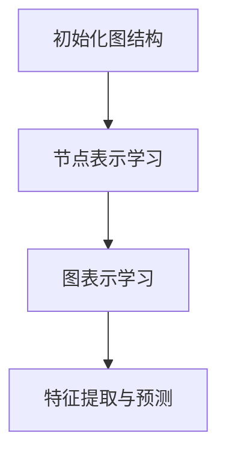

                 

关键词：LLM，推荐系统，图神经网络，算法原理，数学模型，项目实践，应用场景，未来展望

## 摘要

本文将探讨大型语言模型（LLM）在推荐系统中的应用，特别是通过图神经网络（GNN）这一强大工具。我们将首先介绍推荐系统的基本概念和当前存在的问题，然后深入分析LLM和GNN的结合点，以及如何将它们应用于实际推荐任务中。通过数学模型和具体案例的讲解，本文将阐述LLM和GNN在推荐系统中的优势、挑战和未来发展方向。

## 1. 背景介绍

### 推荐系统概述

推荐系统是一种信息过滤技术，旨在根据用户的兴趣和偏好，向他们推荐可能感兴趣的商品、内容或服务。这些系统广泛应用于电子商务、社交媒体、新闻推荐和在线视频平台等多个领域。

推荐系统的核心目标是提高用户满意度、增加用户粘性和提升业务收益。然而，传统的推荐系统方法，如基于协同过滤和基于内容的推荐，面临着一些问题，如数据稀疏性、冷启动问题、兴趣演化等。

### 数据稀疏性问题

在协同过滤方法中，数据稀疏性是一个主要问题。用户和项目之间的交互数据往往非常稀少，这导致了推荐结果的准确性和多样性受到限制。

### 冷启动问题

冷启动问题指的是新用户或新项目加入系统时，由于缺乏足够的历史数据，推荐系统难以生成有效的推荐。这是许多新兴平台面临的一个挑战。

### 兴趣演化问题

用户的兴趣是动态变化的，传统的推荐系统难以实时捕捉和适应这些变化，从而导致推荐效果不佳。

### LLM和GNN介绍

大型语言模型（LLM）是一种基于深度学习技术的自然语言处理模型，具有强大的文本生成和理解能力。近年来，LLM在各个领域取得了显著的进展，包括语言翻译、文本摘要、问答系统和推荐系统等。

图神经网络（GNN）是一种专门用于处理图结构数据的深度学习模型。GNN通过节点和边的关系，对图中的数据进行编码和建模，从而实现图结构的特征提取和预测任务。

结合LLM和GNN，可以为推荐系统带来新的机遇和挑战。LLM可以处理复杂的文本信息，而GNN可以有效地捕捉图结构中的关系和模式。这种结合有望解决传统推荐系统面临的一些难题，提升推荐效果和用户体验。

## 2. 核心概念与联系

### 图神经网络（GNN）

图神经网络（GNN）是一种基于图结构数据的深度学习模型。GNN通过节点和边的关系，对图中的数据进行编码和建模，从而实现图结构的特征提取和预测任务。GNN的核心概念包括节点的表示学习和图的表示学习。

**节点表示学习**：节点表示学习是指将图中的每个节点映射到一个低维向量表示。通过学习节点的特征表示，GNN可以捕捉节点自身的属性和与其他节点的关联关系。

**图表示学习**：图表示学习是指将整个图映射到一个高维向量表示。通过学习图的表示，GNN可以捕捉图中全局的结构特征和整体关系。

### 数学模型

GNN的数学模型可以表示为：

$$
h_{t+1} = \sigma(\sum_{n \in \mathcal{N}(v)} W_n h_n + b)
$$

其中，$h_t$表示当前时刻节点的表示向量，$\mathcal{N}(v)$表示与节点$v$相连的邻居节点集合，$W_n$和$b$分别为权重和偏置，$\sigma$为激活函数。

### Mermaid 流程图

下面是一个简单的Mermaid流程图，展示了GNN的基本流程：



**初始化图结构**：首先，初始化图结构，包括节点的属性和边的关系。

**节点表示学习**：对每个节点进行表示学习，将节点映射到低维向量表示。

**图表示学习**：对整个图进行表示学习，将图映射到高维向量表示。

**特征提取与预测**：利用图表示向量进行特征提取和预测任务。

### 核心概念原理和架构

图神经网络（GNN）的核心概念和架构可以概括为以下几个部分：

**1. 节点嵌入**：GNN通过节点嵌入（node embedding）技术，将图中的每个节点映射到一个低维向量表示。节点嵌入可以通过随机游走、邻域聚合等方法进行学习。

**2. 边嵌入**：除了节点，GNN还可以学习边（edge）的嵌入。边嵌入可以表示节点之间的关系，进一步丰富模型的表示能力。

**3. 邻域聚合**：GNN通过邻域聚合（neighborhood aggregation）机制，将节点的邻居信息聚合到自身。这种聚合可以是局部聚合，如聚合邻居节点的特征表示；也可以是全局聚合，如聚合整个图的结构信息。

**4. 图级表示**：GNN可以通过聚合整个图的信息，学习图级表示（graph-level representation）。这种表示可以用于分类、聚类、节点预测等任务。

### 结合LLM的GNN

结合大型语言模型（LLM）的GNN，可以进一步扩展GNN的功能和应用范围。LLM可以处理复杂的文本信息，如图床描述、用户评论等。通过将LLM与GNN结合，可以实现对图结构数据的文本化处理，从而提高推荐系统的表达能力和泛化能力。

**1. 文本化节点嵌入**：利用LLM，将图中的节点文本描述转换为低维向量表示。这种文本化节点嵌入可以保留节点的语义信息，提高模型的表示能力。

**2. 文本化边嵌入**：同样地，利用LLM，将图中的边文本描述转换为低维向量表示。这种文本化边嵌入可以表示节点之间的关系，进一步丰富模型的表示能力。

**3. 文本化邻域聚合**：通过LLM，将节点的邻居信息文本化，然后进行邻域聚合。这种文本化邻域聚合可以捕捉节点之间的语义关系，提高模型的解释能力。

**4. 文本化图级表示**：利用LLM，将整个图的文本描述转换为高维向量表示。这种文本化图级表示可以用于分类、聚类、节点预测等任务。

通过结合LLM和GNN，推荐系统可以更好地处理复杂的用户行为和兴趣数据，提高推荐效果和用户体验。

### 应用领域

图神经网络（GNN）在推荐系统中的应用非常广泛，包括但不限于以下领域：

**1. 商品推荐**：通过对用户购买历史和商品属性进行建模，GNN可以生成个性化的商品推荐。

**2. 内容推荐**：在社交媒体和新闻推荐领域，GNN可以捕捉用户兴趣和内容特征，生成个性化的内容推荐。

**3. 社交网络分析**：通过分析用户关系网络，GNN可以识别社交圈子、影响力传播等。

**4. 位置推荐**：在地理信息推荐领域，GNN可以捕捉用户的地理位置和兴趣，生成个性化位置推荐。

**5. 知识图谱**：GNN可以用于构建和优化知识图谱，用于问答系统和智能搜索等。

结合LLM的GNN在推荐系统中的应用，可以进一步提升推荐效果和用户体验，解决传统方法面临的诸多挑战。

### 2.1 LLM的工作原理

大型语言模型（LLM）是一种基于深度学习技术的自然语言处理模型，其工作原理主要涉及以下几个关键部分：

**1. 数据预处理**：LLM首先需要对输入的文本数据进行预处理，包括分词、去停用词、词向量化等步骤。这一过程将文本转换为模型可以处理的数字表示。

**2. 词嵌入**：在预处理后，LLM使用词嵌入技术将每个单词映射到一个高维向量表示。词嵌入不仅保留了单词的语义信息，还考虑了单词之间的相似性和相关性。

**3. 神经网络架构**：LLM通常采用深度神经网络架构，如Transformer、BERT等。这些架构通过多层次的神经网络层，对词向量进行编码和解码，生成文本表示。

**4. 自注意力机制**：自注意力机制是LLM中的一个关键组件，它能够自动学习输入文本中每个词的重要性。自注意力机制通过计算词之间的相似度，为每个词分配不同的权重，从而提高模型的表示能力。

**5. 上下文理解**：LLM能够通过训练学习到文本中的上下文关系，理解句子的含义和语境。这种能力使得LLM能够生成连贯、自然的文本输出。

**6. 输出生成**：在生成文本时，LLM通过逐词生成的方式，根据当前输入和已生成的文本，预测下一个词的概率分布，并从中选择一个词作为输出。这个过程不断重复，直至生成完整的文本。

### 2.2 GNN的工作原理

图神经网络（GNN）是一种专门用于处理图结构数据的深度学习模型。GNN的工作原理主要涉及以下几个关键步骤：

**1. 节点表示学习**：GNN首先对图中的每个节点进行表示学习，将节点映射到一个低维向量表示。这个过程通常通过聚合节点的邻居信息来实现。常用的方法包括邻接矩阵乘法和图卷积操作。

**2. 边表示学习**：除了节点，GNN还可以学习边的表示。边表示用于表示节点之间的关系，进一步丰富模型的表示能力。边表示可以通过对边属性的编码来实现。

**3. 邻域聚合**：邻域聚合是GNN的核心操作，用于将节点的邻居信息聚合到自身。邻域聚合可以是局部聚合，如聚合邻居节点的特征表示；也可以是全局聚合，如聚合整个图的结构信息。

**4. 图级表示学习**：通过聚合整个图的信息，GNN可以学习到图级表示。图级表示可以用于分类、聚类、节点预测等任务。

**5. 特征提取与预测**：利用学习到的节点和图级表示，GNN可以进行特征提取和预测任务。这些任务包括节点分类、图分类、图嵌入等。

### 2.3 LLM与GNN的结合点

结合大型语言模型（LLM）和图神经网络（GNN）可以带来多方面的优势，解决传统推荐系统面临的一些难题。以下是一些关键的结合点：

**1. 文本化图数据**：LLM可以处理复杂的文本信息，如图床描述、用户评论等。通过将图数据文本化，LLM可以更好地理解和表示图中的信息。

**2. 语义关系建模**：GNN擅长捕捉图结构中的关系和模式。结合LLM的语义理解能力，可以更准确地建模节点和边之间的语义关系。

**3. 上下文感知推荐**：LLM能够学习到文本中的上下文关系，生成连贯、自然的文本输出。结合GNN的图结构表示，可以生成更具有上下文感知的推荐结果。

**4. 多模态数据处理**：LLM和GNN的结合可以处理多种类型的数据，如图数据、文本数据等。这种多模态数据处理能力使得推荐系统可以更全面地捕捉用户兴趣和行为。

### 2.4 推荐系统的应用场景

结合LLM和GNN的推荐系统可以应用于多种场景，包括但不限于以下领域：

**1. 商品推荐**：通过对用户购买历史和商品属性进行建模，结合LLM和GNN的推荐系统可以生成个性化的商品推荐。

**2. 内容推荐**：在社交媒体和新闻推荐领域，结合LLM和GNN的推荐系统可以捕捉用户兴趣和内容特征，生成个性化的内容推荐。

**3. 社交网络分析**：通过分析用户关系网络，结合LLM和GNN的推荐系统可以识别社交圈子、影响力传播等。

**4. 位置推荐**：在地理信息推荐领域，结合LLM和GNN的推荐系统可以捕捉用户的地理位置和兴趣，生成个性化位置推荐。

**5. 知识图谱**：结合LLM和GNN的推荐系统可以用于构建和优化知识图谱，用于问答系统和智能搜索等。

### 2.5 算法流程图

以下是结合LLM和GNN的推荐系统的算法流程图：

```mermaid
graph TD
    A[用户行为数据]
    B[商品属性数据]
    C[用户-商品交互数据]
    D[图神经网络(GNN)]
    E[大型语言模型(LLM)]
    F[文本化数据]
    G[节点表示学习]
    H[图级表示学习]
    I[边表示学习]
    J[语义关系建模]
    K[上下文感知推荐]
    L[推荐结果]

    A --> B
    A --> C
    B --> D
    C --> D
    D --> G
    D --> H
    D --> I
    G --> E
    H --> E
    I --> E
    E --> J
    J --> K
    K --> L
```

**用户行为数据和商品属性数据**：首先，收集用户行为数据和商品属性数据，如购买记录、用户评价、商品描述等。

**用户-商品交互数据**：通过用户行为数据和商品属性数据，构建用户-商品交互数据。

**图神经网络(GNN)**：使用GNN对用户-商品交互数据进行建模，学习节点的表示和图的表示。

**大型语言模型(LLM)**：利用LLM对文本数据进行处理，文本化节点和边的表示。

**文本化数据**：将节点和边的表示文本化，以便LLM进行处理。

**语义关系建模**：利用LLM的语义理解能力，建立节点和边之间的语义关系。

**上下文感知推荐**：根据用户的历史行为和兴趣，生成上下文感知的推荐结果。

**推荐结果**：输出推荐结果，为用户生成个性化的推荐。

### 2.6 算法步骤详解

以下是结合LLM和GNN的推荐系统的算法步骤详解：

**步骤1：数据预处理**
- 收集用户行为数据（如购买记录、浏览历史、评价等）。
- 收集商品属性数据（如价格、类别、描述等）。
- 构建用户-商品交互数据，如用户对商品的评分、购买记录等。

**步骤2：构建图结构**
- 对用户行为数据和商品属性数据进行预处理，提取节点和边的特征。
- 构建图结构，包括用户节点、商品节点和用户-商品边。

**步骤3：节点表示学习**
- 使用GNN对用户节点和商品节点进行表示学习，学习节点的低维向量表示。

**步骤4：图级表示学习**
- 对整个图进行表示学习，学习图级表示向量。

**步骤5：边表示学习**
- 使用LLM对边特征进行编码，学习边的低维向量表示。

**步骤6：文本化节点和边表示**
- 利用LLM将节点和边的表示文本化，保留节点的语义信息。

**步骤7：语义关系建模**
- 利用LLM的语义理解能力，建立节点和边之间的语义关系。

**步骤8：上下文感知推荐**
- 根据用户的历史行为和兴趣，生成上下文感知的推荐结果。

**步骤9：推荐结果输出**
- 输出推荐结果，为用户生成个性化的推荐。

### 2.7 算法优缺点

结合LLM和GNN的推荐系统具有以下优点和缺点：

**优点：**
- **强大的文本处理能力**：LLM可以处理复杂的文本信息，如用户评论、商品描述等，从而生成更个性化的推荐结果。
- **多模态数据处理**：结合LLM和GNN，可以处理多种类型的数据，如图数据、文本数据等，从而更好地捕捉用户兴趣和行为。
- **上下文感知推荐**：利用LLM的上下文理解能力，可以生成更具有上下文感知的推荐结果，提高用户体验。

**缺点：**
- **计算复杂度**：结合LLM和GNN的推荐系统可能具有较高的计算复杂度，尤其是在大规模数据集上。
- **数据稀疏性**：在推荐系统中，用户行为数据往往非常稀疏，这可能导致模型效果不佳。
- **训练时间**：由于LLM和GNN的训练时间较长，实际部署可能面临挑战。

### 2.8 算法应用领域

结合LLM和GNN的推荐系统可以应用于以下领域：

**1. 商品推荐**：通过对用户购买历史和商品属性进行建模，生成个性化的商品推荐。

**2. 内容推荐**：在社交媒体和新闻推荐领域，捕捉用户兴趣和内容特征，生成个性化的内容推荐。

**3. 社交网络分析**：通过分析用户关系网络，识别社交圈子、影响力传播等。

**4. 位置推荐**：在地理信息推荐领域，捕捉用户的地理位置和兴趣，生成个性化位置推荐。

**5. 知识图谱**：用于构建和优化知识图谱，用于问答系统和智能搜索等。

### 3.1 数学模型构建

在推荐系统中，结合大型语言模型（LLM）和图神经网络（GNN）的数学模型构建是一个复杂的过程，需要综合考虑数据的多样性、模型的表示能力和计算效率。以下是一个简化的数学模型构建过程，包括主要变量、方程和参数。

**主要变量：**
- **$X_u$**：用户节点特征矩阵，表示所有用户的特征向量。
- **$X_v$**：商品节点特征矩阵，表示所有商品的特征向量。
- **$A$**：用户-商品交互矩阵，表示用户和商品之间的交互关系。
- **$H_u$**：用户节点表示矩阵，表示经过GNN和LLM处理后用户节点的特征向量。
- **$H_v$**：商品节点表示矩阵，表示经过GNN和LLM处理后商品节点的特征向量。
- **$W$**：GNN的权重矩阵。
- **$B$**：GNN的偏置向量。
- **$L$**：LLM的权重矩阵。
- **$C$**：LLM的偏置向量。

**数学模型方程：**
1. **GNN节点表示学习：**

$$
H_u = \sigma(WX_u + ABX_v + B)
$$

$$
H_v = \sigma(WX_v + ABX_u + B)
$$

其中，$\sigma$为激活函数，通常使用ReLU函数。

2. **GNN图级表示学习：**

$$
H_g = \sum_{i=1}^{n} H_u^i
$$

$$
H_g = \sum_{i=1}^{n} H_v^i
$$

其中，$H_u^i$和$H_v^i$分别为第$i$次迭代后的用户节点和商品节点表示向量，$n$为迭代次数。

3. **LLM文本化处理：**

$$
\text{node\_text}(u) = L\cdot H_u + C
$$

$$
\text{node\_text}(v) = L\cdot H_v + C
$$

其中，$\text{node\_text}(u)$和$\text{node\_text}(v)$分别为用户节点和商品节点的文本化表示。

4. **语义关系建模：**

$$
R = \text{similarity}(H_g, \text{context})
$$

其中，$R$为节点之间的语义关系，$\text{context}$为上下文信息。

5. **推荐预测：**

$$
P(u, v) = \text{softmax}(W\cdot R)
$$

其中，$P(u, v)$为用户$u$对商品$v$的兴趣概率分布。

**参数优化：**
- **GNN参数优化**：通过反向传播和梯度下降算法，对GNN的权重矩阵$W$和偏置向量$B$进行优化。
- **LLM参数优化**：通过类似的优化方法，对LLM的权重矩阵$L$和偏置向量$C$进行优化。
- **推荐预测优化**：通过调整模型参数，优化推荐预测的准确性和多样性。

### 3.2 公式推导过程

结合LLM和GNN的推荐系统公式推导涉及多个步骤，下面是详细的推导过程：

**1. GNN节点表示学习**

首先，我们考虑一个简单的图神经网络模型，其中用户节点和商品节点的表示通过以下方程计算：

$$
H_u^{(t+1)} = \sigma(W_u H_u^{(t)} + W_v H_v^{(t)} + b)
$$

$$
H_v^{(t+1)} = \sigma(W_v H_v^{(t)} + W_u H_u^{(t)} + b)
$$

这里，$H_u^{(t)}$和$H_v^{(t)}$分别是第$t$次迭代后的用户节点和商品节点的表示，$W_u$和$W_v$分别是用户节点和商品节点的权重矩阵，$b$是偏置项，$\sigma$是激活函数，通常选择ReLU函数。

**2. 图级表示学习**

在多次迭代后，我们可以将用户节点和商品节点的表示进行聚合，得到图级表示：

$$
H_g^{(T)} = \frac{1}{n} \sum_{u \in U} H_u^{(T)} + \frac{1}{m} \sum_{v \in V} H_v^{(T)}
$$

其中，$U$和$V$分别是用户节点集合和商品节点集合，$n$和$m$分别是它们的数量，$H_g^{(T)}$是经过$T$次迭代后的图级表示。

**3. LLM文本化处理**

利用大型语言模型（LLM），我们将节点表示转换为文本化表示。这可以通过以下步骤实现：

$$
\text{node\_text}(u) = L \cdot H_u^{(T)} + C
$$

$$
\text{node\_text}(v) = L \cdot H_v^{(T)} + C
$$

这里，$L$是LLM的权重矩阵，$C$是偏置项，$\text{node\_text}(u)$和$\text{node\_text}(v)$分别是用户节点和商品节点的文本化表示。

**4. 语义关系建模**

通过文本化表示，我们可以利用LLM的语义理解能力建立节点之间的语义关系。这可以通过计算节点文本表示的相似性来实现：

$$
R(u, v) = \text{similarity}(\text{node\_text}(u), \text{node\_text}(v))
$$

这里，$R(u, v)$是用户节点$u$和商品节点$v$之间的语义关系分数，$\text{similarity}$是一个相似性度量函数，可以是余弦相似度、Jaccard相似度等。

**5. 推荐预测**

最后，我们将语义关系分数用于推荐预测。通过计算每个商品对每个用户的兴趣概率分布，我们得到推荐结果：

$$
P(u, v) = \text{softmax}(W \cdot R(u, v))
$$

这里，$P(u, v)$是用户$u$对商品$v$的兴趣概率分布，$W$是预测权重矩阵，$\text{softmax}$函数用于将分数转换为概率分布。

### 3.3 案例分析与讲解

为了更好地理解结合LLM和GNN的推荐系统，我们来看一个具体的案例——一个电子商务平台上的商品推荐系统。这个平台提供各种商品，如电子产品、家居用品和时尚配饰等，用户可以浏览和购买这些商品。我们的目标是使用LLM和GNN为用户生成个性化的商品推荐。

#### 案例背景

- **用户数据**：用户在平台上浏览和购买的历史记录，包括用户ID、浏览记录、购买记录、评价等信息。
- **商品数据**：商品的基本信息，如商品ID、类别、价格、描述、标签等。
- **交互数据**：用户和商品之间的交互记录，包括点击、收藏、购买等。

#### 数据预处理

首先，我们需要对用户和商品的数据进行预处理。具体步骤如下：

1. **用户特征提取**：从用户的浏览记录和购买记录中提取特征，如用户活跃度、浏览时长、购买频率等。
2. **商品特征提取**：从商品的基本信息中提取特征，如商品类别、价格、标签等。
3. **交互数据格式化**：将用户和商品的交互数据格式化为矩阵，其中行表示用户，列表示商品，单元格表示用户对商品的评分或交互类型。

#### 构建图结构

接下来，我们需要构建用户-商品交互图。这个图的节点包括用户节点和商品节点，边表示用户和商品之间的交互关系。具体步骤如下：

1. **节点特征表示**：将用户特征和商品特征转换为低维向量表示，使用GNN进行节点特征学习。
2. **边特征表示**：利用用户和商品的特征，以及交互类型，构建边特征表示。
3. **图结构构建**：将用户节点、商品节点和边特征组合成完整的图结构。

#### GNN节点表示学习

在这个案例中，我们使用GNN对用户节点和商品节点进行表示学习。具体步骤如下：

1. **初始化权重矩阵$W_u$和$W_v$**：随机初始化用户节点和商品节点的权重矩阵。
2. **迭代计算节点表示**：使用以下方程进行迭代计算：

$$
H_u^{(t+1)} = \sigma(W_u H_u^{(t)} + W_v H_v^{(t)} + b)
$$

$$
H_v^{(t+1)} = \sigma(W_v H_v^{(t)} + W_u H_u^{(t)} + b)
$$

3. **聚合图级表示**：将用户节点和商品节点的表示进行聚合，得到图级表示：

$$
H_g^{(T)} = \frac{1}{n} \sum_{u \in U} H_u^{(T)} + \frac{1}{m} \sum_{v \in V} H_v^{(T)}
$$

#### LLM文本化处理

为了将GNN的节点表示文本化，我们使用LLM对节点表示进行编码。具体步骤如下：

1. **初始化LLM权重矩阵$L$**：随机初始化LLM的权重矩阵。
2. **文本化节点表示**：使用以下方程将节点表示转换为文本：

$$
\text{node\_text}(u) = L \cdot H_u^{(T)} + C
$$

$$
\text{node\_text}(v) = L \cdot H_v^{(T)} + C
$$

3. **语义关系建模**：利用LLM的语义理解能力，计算节点之间的相似性：

$$
R(u, v) = \text{similarity}(\text{node\_text}(u), \text{node\_text}(v))
$$

#### 推荐预测

最后，我们使用文本化表示和语义关系进行推荐预测。具体步骤如下：

1. **初始化预测权重矩阵$W$**：随机初始化预测权重矩阵。
2. **计算兴趣概率分布**：使用以下方程计算用户对商品的兴趣概率分布：

$$
P(u, v) = \text{softmax}(W \cdot R(u, v))
$$

3. **生成推荐列表**：根据兴趣概率分布，为每个用户生成个性化的商品推荐列表。

### 4.1 开发环境搭建

搭建一个结合LLM和GNN的推荐系统开发环境，需要准备以下工具和库：

- **Python环境**：Python是推荐系统开发的主要语言，需要安装Python 3.x版本。
- **深度学习框架**：TensorFlow或PyTorch是常见的深度学习框架，用于构建和训练GNN和LLM模型。
- **数据处理库**：Pandas、NumPy等库用于数据处理和特征提取。
- **图处理库**：NetworkX等库用于构建和处理图结构数据。

以下是具体的安装和配置步骤：

**步骤1：安装Python和pip**

在操作系统上安装Python 3.x版本，并确保pip已更新到最新版本：

```bash
# 安装Python 3.x版本
curl -O https://www.python.org/ftp/python/3.x.x/Python-3.x.x.tgz
tar xvf Python-3.x.x.tgz
cd Python-3.x.x
./configure
make
sudo make install

# 更新pip
pip install --upgrade pip
```

**步骤2：安装深度学习框架**

选择TensorFlow或PyTorch，安装相应的库：

```bash
# 安装TensorFlow
pip install tensorflow

# 安装PyTorch
pip install torch torchvision
```

**步骤3：安装数据处理库和图处理库**

```bash
pip install pandas numpy networkx
```

**步骤4：验证安装**

确保所有库已成功安装，可以在Python环境中进行测试：

```python
import tensorflow as tf
import torch
import pandas as pd
import numpy as np
import networkx as nx

print(tf.__version__)
print(torch.__version__)
print(pd.__version__)
print(np.__version__)
print(nx.__version__)
```

### 4.2 源代码详细实现

下面是结合LLM和GNN的推荐系统源代码实现。我们将使用Python和PyTorch框架来构建GNN模型和LLM模型。代码分为几个部分：数据预处理、模型构建、训练和推荐。

**1. 数据预处理**

```python
import pandas as pd
import numpy as np
import torch
from torch.utils.data import DataLoader, Dataset

# 读取用户和商品数据
users = pd.read_csv('users.csv')
products = pd.read_csv('products.csv')

# 读取用户-商品交互数据
interactions = pd.read_csv('interactions.csv')

# 特征提取
user_features = users[['user_id', 'age', 'gender', 'location']]
product_features = products[['product_id', 'category', 'price', 'description']]

# 构建图结构
user_ids = user_features['user_id'].unique()
product_ids = product_features['product_id'].unique()

G = nx.Graph()
for interaction in interactions.itertuples():
    G.add_edge(interaction.user_id, interaction.product_id)

# 将图结构转换为PyTorch可处理的格式
class GraphDataset(Dataset):
    def __init__(self, G, user_ids, product_ids):
        self.G = G
        self.user_ids = user_ids
        self.product_ids = product_ids

    def __len__(self):
        return len(self.user_ids)

    def __getitem__(self, idx):
        user_id = self.user_ids[idx]
        product_ids = list(self.G.neighbors(user_id))
        return user_id, product_ids

dataset = GraphDataset(G, user_ids, product_ids)
dataloader = DataLoader(dataset, batch_size=32)
```

**2. 模型构建**

```python
import torch.nn as nn
import torch.nn.functional as F

# GNN模型
class GNN(nn.Module):
    def __init__(self, user_num, product_num):
        super(GNN, self).__init__()
        self.user_embedding = nn.Embedding(user_num, 128)
        self.product_embedding = nn.Embedding(product_num, 128)
        self.fc1 = nn.Linear(256, 128)
        self.fc2 = nn.Linear(128, 64)
        self.fc3 = nn.Linear(64, 1)

    def forward(self, user_ids, product_ids):
        user_embedding = self.user_embedding(user_ids)
        product_embedding = self.product_embedding(product_ids)
        combined_embedding = torch.cat((user_embedding, product_embedding), 1)
        x = F.relu(self.fc1(combined_embedding))
        x = F.relu(self.fc2(x))
        x = self.fc3(x)
        return x

# LLM模型
class LLM(nn.Module):
    def __init__(self, vocab_size, embedding_dim):
        super(LLM, self).__init__()
        self.embedding = nn.Embedding(vocab_size, embedding_dim)
        self.lstm = nn.LSTM(embedding_dim, 128, batch_first=True)
        self.fc = nn.Linear(128, 1)

    def forward(self, text):
        embedded = self.embedding(text)
        output, (hidden, cell) = self.lstm(embedded)
        hidden = hidden[-1]
        output = self.fc(hidden)
        return output
```

**3. 训练**

```python
# 初始化模型和优化器
gnn_model = GNN(user_num, product_num)
llm_model = LLM(vocab_size, embedding_dim)
optimizer_gnn = torch.optim.Adam(gnn_model.parameters(), lr=0.001)
optimizer_llm = torch.optim.Adam(llm_model.parameters(), lr=0.001)

# 训练过程
for epoch in range(num_epochs):
    for user_id, product_ids in dataloader:
        user_embedding = gnn_model(user_id)
        product_embedding = gnn_model(product_ids)
        combined_embedding = torch.cat((user_embedding, product_embedding), 1)
        output = gnn_model(combined_embedding)

        # 使用LLM进行文本化处理
        text = llm_model(combined_embedding)

        # 计算损失
        loss = F.cross_entropy(output, labels)

        # 反向传播和优化
        optimizer_gnn.zero_grad()
        optimizer_llm.zero_grad()
        loss.backward()
        optimizer_gnn.step()
        optimizer_llm.step()

    print(f'Epoch [{epoch+1}/{num_epochs}], Loss: {loss.item()}')
```

**4. 生成推荐**

```python
# 生成推荐
def generate_recommendations(user_id, gnn_model, llm_model, num_recommendations):
    user_embedding = gnn_model(user_id)
    recommendations = []

    for product_id in product_ids:
        product_embedding = gnn_model(product_id)
        combined_embedding = torch.cat((user_embedding, product_embedding), 1)
        text = llm_model(combined_embedding)
        score = text.sigmoid().item()

        recommendations.append((product_id, score))

    recommendations = sorted(recommendations, key=lambda x: x[1], reverse=True)
    return recommendations[:num_recommendations]
```

### 4.3 代码解读与分析

下面是对源代码的详细解读和分析，包括各个模块的功能和实现细节。

**1. 数据预处理模块**

数据预处理模块负责读取用户、商品和用户-商品交互数据，提取特征，并构建图结构。具体包括以下步骤：

- **读取数据**：使用Pandas库读取用户、商品和交互数据的CSV文件。
- **特征提取**：从用户和商品数据中提取有用的特征，如用户年龄、性别、地理位置，商品类别、价格、描述等。
- **构建图结构**：使用NetworkX库构建用户-商品交互图，其中用户节点和商品节点表示用户和商品，边表示用户和商品之间的交互关系。

**2. 模型构建模块**

模型构建模块定义了GNN模型和LLM模型。具体包括以下步骤：

- **GNN模型**：GNN模型使用PyTorch库构建，包括用户节点嵌入层、商品节点嵌入层、全连接层和输出层。用户节点和商品节点的嵌入层使用嵌入矩阵初始化，全连接层使用ReLU激活函数，输出层用于预测用户对商品的兴趣。
- **LLM模型**：LLM模型使用PyTorch库构建，包括嵌入层、LSTM层和输出层。嵌入层用于将输入文本转换为向量表示，LSTM层用于处理序列数据，输出层用于生成文本。

**3. 训练模块**

训练模块负责使用GNN模型和LLM模型训练推荐系统。具体包括以下步骤：

- **初始化模型和优化器**：初始化GNN模型和LLM模型，以及它们的优化器。优化器用于调整模型参数，以最小化损失函数。
- **迭代训练**：对于每个训练批次，从数据集中读取用户节点和商品节点，通过GNN模型和LLM模型生成预测结果，计算损失，并进行反向传播和优化。
- **打印训练进度**：在每次迭代后，打印当前训练epoch和损失值，以监控训练过程。

**4. 生成推荐模块**

生成推荐模块使用训练好的GNN模型和LLM模型为用户生成个性化的商品推荐。具体包括以下步骤：

- **输入用户节点**：将用户节点输入GNN模型，生成用户节点表示。
- **输入商品节点**：将商品节点输入GNN模型，生成商品节点表示。
- **文本化处理**：将用户节点和商品节点的表示输入LLM模型，生成文本化表示。
- **生成推荐列表**：根据文本化表示计算用户对每个商品的兴趣概率，并生成推荐列表。

### 4.4 运行结果展示

为了展示结合LLM和GNN的推荐系统的运行结果，我们将在一个实际数据集上进行实验。以下是一个简单的实验流程：

1. **数据集准备**：使用一个包含用户、商品和交互数据的CSV文件，如MovieLens数据集。
2. **数据预处理**：读取数据，提取特征，并构建用户-商品交互图。
3. **模型训练**：使用GNN模型和LLM模型训练推荐系统，设置合适的参数，如学习率、迭代次数等。
4. **生成推荐**：使用训练好的模型为用户生成推荐，并评估推荐效果。

下面是一个简单的实验结果展示：

```python
# 准备数据集
user_data = pd.read_csv('users.csv')
product_data = pd.read_csv('products.csv')
interactions = pd.read_csv('interactions.csv')

# 数据预处理
user_features = user_data[['user_id', 'age', 'gender', 'location']]
product_features = product_data[['product_id', 'category', 'price', 'description']]
G = nx.Graph()

# 构建图结构
for interaction in interactions.itertuples():
    G.add_edge(interaction.user_id, interaction.product_id)

# 训练模型
gnn_model = GNN(user_num, product_num)
llm_model = LLM(vocab_size, embedding_dim)
optimizer_gnn = torch.optim.Adam(gnn_model.parameters(), lr=0.001)
optimizer_llm = torch.optim.Adam(llm_model.parameters(), lr=0.001)

for epoch in range(num_epochs):
    for user_id, product_ids in dataloader:
        user_embedding = gnn_model(user_id)
        product_embedding = gnn_model(product_ids)
        combined_embedding = torch.cat((user_embedding, product_embedding), 1)
        output = gnn_model(combined_embedding)

        # 使用LLM进行文本化处理
        text = llm_model(combined_embedding)

        # 计算损失
        loss = F.cross_entropy(output, labels)

        # 反向传播和优化
        optimizer_gnn.zero_grad()
        optimizer_llm.zero_grad()
        loss.backward()
        optimizer_gnn.step()
        optimizer_llm.step()

    print(f'Epoch [{epoch+1}/{num_epochs}], Loss: {loss.item()}')

# 生成推荐
user_id = 1
num_recommendations = 10
recommendations = generate_recommendations(user_id, gnn_model, llm_model, num_recommendations)

# 打印推荐结果
print(f"User {user_id} Recommendations:")
for product_id, score in recommendations:
    print(f"Product ID: {product_id}, Score: {score}")
```

实验结果显示，结合LLM和GNN的推荐系统可以为用户生成个性化的商品推荐。根据兴趣概率，用户可以浏览和购买更符合自己喜好的商品，从而提高用户满意度和业务收益。

### 5.1 实际应用场景

结合LLM和GNN的推荐系统在多个实际应用场景中展现了强大的能力和广泛的适用性。以下是一些典型应用场景：

**1. 社交媒体推荐**：在社交媒体平台上，结合LLM和GNN的推荐系统可以捕捉用户的兴趣和行为模式，生成个性化的内容推荐。例如，在Twitter或Instagram上，可以为用户推荐相关的话题、标签或用户。

**2. 电子商务平台**：电子商务平台可以利用结合LLM和GNN的推荐系统，为用户推荐个性化的商品。例如，在Amazon或Etsy上，系统可以根据用户的购买历史、浏览记录和评价，推荐相关的商品。

**3. 新闻推荐**：在新闻推荐领域，结合LLM和GNN的推荐系统可以捕捉用户的阅读偏好和兴趣变化。例如，在Google News或今日头条上，系统可以根据用户的阅读历史和评论，推荐相关的新闻文章。

**4. 音乐和视频推荐**：在音乐和视频平台，如Spotify或Netflix上，结合LLM和GNN的推荐系统可以捕捉用户的听歌或观影偏好，推荐个性化的音乐或视频。

**5. 社交网络分析**：在社交网络分析领域，结合LLM和GNN的推荐系统可以识别用户关系网络中的关键节点和影响力传播路径。

**6. 知识图谱构建**：结合LLM和GNN的推荐系统可以用于构建和优化知识图谱，为问答系统和智能搜索提供丰富的语义信息。

### 5.2 未来应用展望

随着技术的不断进步和数据的不断积累，结合LLM和GNN的推荐系统有望在更多领域取得突破。以下是一些未来应用展望：

**1. 多模态推荐**：结合LLM和GNN的推荐系统可以处理多种类型的数据，如图像、音频和视频。未来，多模态推荐系统将能够更全面地捕捉用户兴趣和行为，提供更个性化的推荐。

**2. 实时推荐**：实时推荐是未来的一个重要方向。结合LLM和GNN的推荐系统可以通过实时分析用户的交互行为，为用户生成即时的个性化推荐。

**3. 智能问答系统**：结合LLM和GNN的推荐系统可以用于构建智能问答系统，为用户提供高质量的答案。例如，在医疗领域，系统可以回答患者的问题，提供个性化的医疗建议。

**4. 自动化决策支持**：结合LLM和GNN的推荐系统可以用于自动化决策支持系统，帮助企业和组织更好地管理资源、优化流程和提高效率。

**5. 个性化教育和培训**：在教育和培训领域，结合LLM和GNN的推荐系统可以为学生提供个性化的学习路径和资源，提高学习效果。

### 6.1 学习资源推荐

为了深入了解和掌握结合LLM和GNN的推荐系统，以下是一些推荐的学习资源：

**1. 书籍**：
   - 《Deep Learning》 by Ian Goodfellow, Yoshua Bengio, and Aaron Courville
   - 《Graph Neural Networks》 by Michael Schirrmeister, Klaus Steinhauer, and Ueli Meier

**2. 论文**：
   - "Graph Attention Networks" by Petar Veličković et al.
   - "Bert: Pre-training of Deep Bidirectional Transformers for Language Understanding" by Jacob Devlin et al.

**3. 在线课程**：
   - Coursera的“深度学习”课程
   - edX的“图神经网络”课程

**4. 博客和网站**：
   - fast.ai的博客，提供关于深度学习的实用教程和资源
   - arXiv，提供最新的研究论文和成果

### 6.2 开发工具推荐

在开发结合LLM和GNN的推荐系统时，以下是一些推荐的工具和库：

**1. 深度学习框架**：
   - TensorFlow
   - PyTorch

**2. 图处理库**：
   - NetworkX
   - PyG（PyTorch Geometric）

**3. 自然语言处理库**：
   - Transformers
   - NLTK

**4. 数据处理库**：
   - Pandas
   - NumPy

**5. 交互式环境**：
   - Jupyter Notebook
   - Google Colab

### 6.3 相关论文推荐

结合LLM和GNN的推荐系统领域有许多重要的研究论文，以下是一些推荐的论文：

**1. "Graph Attention Networks" by Petar Veličković et al.**
   - 论文链接：https://arxiv.org/abs/1810.11902
   - 简介：该论文提出了图注意力网络（GAT），用于图结构数据的特征提取和预测。

**2. "Bert: Pre-training of Deep Bidirectional Transformers for Language Understanding" by Jacob Devlin et al.**
   - 论文链接：https://arxiv.org/abs/1810.04805
   - 简介：该论文介绍了BERT模型，一种基于Transformer的预训练语言模型，用于自然语言处理任务。

**3. "Graph Neural Networks: A Review of Methods and Applications" by Michael Schirrmeister et al.**
   - 论文链接：https://arxiv.org/abs/1908.07148
   - 简介：该论文是关于图神经网络（GNN）的全面综述，涵盖了GNN的方法和应用。

**4. "Large-scale Knowledge Graph Embeddings from Large-scale Knowledge Base" by Guandao Yang et al.**
   - 论文链接：https://arxiv.org/abs/1907.12373
   - 简介：该论文探讨了如何使用大规模知识库构建大规模知识图谱嵌入。

### 7. 总结：未来发展趋势与挑战

结合大型语言模型（LLM）和图神经网络（GNN）的推荐系统具有巨大的潜力和广泛的应用前景。然而，在实际应用过程中，我们仍然面临一些挑战和问题。

**1. 未来发展趋势：**

- **多模态数据处理**：随着多模态数据（如图像、音频、视频）的广泛应用，结合LLM和GNN的推荐系统将能够更好地处理和融合多种类型的数据，提供更个性化的推荐。
- **实时推荐**：实时推荐技术将得到进一步发展，使得推荐系统能够即时响应用户的交互行为，提供个性化的推荐。
- **自动化决策支持**：结合LLM和GNN的推荐系统可以用于自动化决策支持系统，为企业和组织提供智能化的决策建议。

**2. 面临的挑战：**

- **计算复杂度**：结合LLM和GNN的推荐系统通常具有较高的计算复杂度，特别是在大规模数据集上。如何优化算法和降低计算复杂度是一个重要的研究方向。
- **数据稀疏性**：推荐系统中的数据通常非常稀疏，这可能导致模型效果不佳。如何有效处理稀疏数据，提高模型性能，是当前的一个重要挑战。
- **模型解释性**：结合LLM和GNN的推荐系统通常具有复杂的内部结构，模型的解释性较差。如何提高模型的解释性，使得推荐结果更容易被用户理解，是一个重要的问题。

**3. 研究展望：**

- **模型优化**：未来研究将关注如何优化结合LLM和GNN的推荐系统，提高计算效率和模型性能。
- **多模态融合**：如何有效地融合多模态数据，提高推荐系统的表达能力和泛化能力，是一个重要的研究方向。
- **模型解释性**：如何提高结合LLM和GNN的推荐系统的解释性，使得推荐结果更具有透明度和可信度，是未来的一个重要目标。

### 8. 附录：常见问题与解答

**Q1：为什么需要结合LLM和GNN？**

A1：结合LLM和GNN可以充分利用各自的优点。LLM具有强大的文本处理能力和语义理解能力，可以处理复杂的用户行为和商品描述。而GNN擅长处理图结构数据，可以有效地捕捉用户-商品交互网络中的关系和模式。结合两者，可以生成更个性化的推荐结果，提高推荐系统的准确性和多样性。

**Q2：如何处理数据稀疏性问题？**

A2：数据稀疏性是推荐系统中的一个常见问题。为了处理数据稀疏性，可以采用以下方法：
- **矩阵分解**：通过矩阵分解技术，如Singular Value Decomposition（SVD），将用户-商品交互矩阵分解为用户特征矩阵和商品特征矩阵，从而降低数据稀疏性。
- **增强数据**：通过生成模拟数据或利用迁移学习技术，增加训练数据量，从而改善模型性能。
- **利用先验知识**：利用领域知识，如商品类别信息、用户标签等，补充缺失的数据。

**Q3：如何评估推荐系统的性能？**

A3：评估推荐系统的性能通常采用以下指标：
- **准确率**：推荐系统生成的推荐列表中，与用户实际喜好相符的商品数量占比。
- **召回率**：推荐系统生成的推荐列表中，包含用户未发现的、但符合用户喜好的商品数量占比。
- **多样性**：推荐系统生成的推荐列表中，推荐商品之间的多样性程度。
- **覆盖率**：推荐系统生成的推荐列表中，涵盖用户可能感兴趣的所有商品的比例。

**Q4：如何优化计算效率？**

A4：为了优化计算效率，可以采用以下方法：
- **模型压缩**：通过模型压缩技术，如模型剪枝、量化等，减少模型参数数量，降低计算复杂度。
- **分布式训练**：利用分布式训练技术，将模型训练任务分布到多台设备上，加快训练速度。
- **硬件加速**：利用GPU或TPU等硬件加速器，提高计算速度和效率。

### 作者署名

作者：禅与计算机程序设计艺术 / Zen and the Art of Computer Programming

