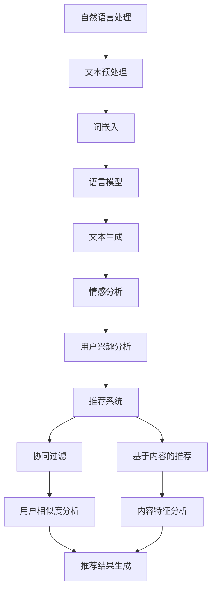

                 

关键词：自然语言处理（NLP），大型语言模型（LLM），推荐系统，用户行为分析，协同过滤，内容推荐，协同效应，深度学习，个性化推荐，信息检索。

## 摘要

随着互联网的快速发展，推荐系统已经成为现代信息检索和内容分发的重要工具。传统的推荐系统主要依赖于协同过滤和内容推荐技术，但在处理复杂用户行为和提供个性化体验方面存在一定的局限性。近年来，大型语言模型（LLM）在自然语言处理（NLP）领域的突破性进展，为推荐系统带来了新的契机。本文将探讨LLM在推荐系统中的应用，分析其核心概念与联系，介绍核心算法原理与操作步骤，并深入讨论数学模型、项目实践、实际应用场景及未来展望。

## 1. 背景介绍

推荐系统起源于20世纪90年代，随着互联网的普及和电子商务的兴起，推荐系统逐渐成为各类在线平台的核心功能。早期的推荐系统主要采用基于内容的推荐和协同过滤技术。基于内容的推荐通过分析用户兴趣和内容特征进行推荐，但存在用户兴趣难以准确获取和推荐结果有限等问题。协同过滤技术通过分析用户之间的相似度来发现用户偏好，但在小样本数据和高维数据情况下效果不佳。

随着大数据和深度学习技术的发展，推荐系统逐渐融合了多种技术手段，如矩阵分解、神经网络和强化学习等。然而，这些方法在处理复杂用户行为和提供个性化体验方面仍存在一定的局限性。近年来，大型语言模型（LLM）如GPT-3、BERT等在NLP领域取得了突破性进展，为推荐系统带来了新的研究热点。

## 2. 核心概念与联系

### 2.1 自然语言处理（NLP）

自然语言处理（NLP）是人工智能领域的一个重要分支，旨在使计算机能够理解和处理人类语言。NLP技术主要包括文本预处理、词嵌入、语言模型、文本生成和情感分析等。在推荐系统中，NLP技术主要用于分析用户评论、标签、搜索历史等信息，从而提取用户兴趣和偏好。

### 2.2 大型语言模型（LLM）

大型语言模型（LLM）是一种基于深度学习的语言处理模型，具有强大的语义理解和生成能力。LLM通常由多层神经网络组成，通过大量文本数据进行训练，能够生成与输入文本相关的高质量文本。在推荐系统中，LLM可以用于分析用户评论、标签、搜索历史等文本数据，提取用户兴趣和偏好。

### 2.3 推荐系统

推荐系统是一种基于用户行为和兴趣进行内容推荐的系统。推荐系统的主要目标是为用户提供个性化、相关的内容，从而提高用户满意度和平台活跃度。推荐系统主要包括协同过滤、基于内容的推荐和混合推荐等类型。

### 2.4 核心概念与联系流程图



## 3. 核心算法原理 & 具体操作步骤

### 3.1 算法原理概述

LLM在推荐系统中的应用主要包括以下几个步骤：

1. 用户兴趣分析：通过NLP技术分析用户评论、标签、搜索历史等文本数据，提取用户兴趣和偏好。
2. 内容特征提取：对推荐内容进行特征提取，如文本分类、情感分析等，以便后续进行推荐。
3. 用户与内容匹配：利用用户兴趣和内容特征，构建用户与内容之间的匹配关系。
4. 推荐结果生成：根据用户与内容的匹配程度，生成个性化推荐结果。

### 3.2 算法步骤详解

#### 3.2.1 用户兴趣分析

用户兴趣分析是LLM在推荐系统中的第一步。具体操作步骤如下：

1. 文本预处理：对用户评论、标签、搜索历史等文本数据进行清洗、分词和去停用词等操作。
2. 词嵌入：将文本数据转换为词向量表示，如使用Word2Vec、GloVe等算法。
3. 语言模型：利用训练好的LLM模型，对用户文本数据进行语义分析，提取用户兴趣关键词。
4. 用户兴趣建模：将用户兴趣关键词进行整合，构建用户兴趣模型。

#### 3.2.2 内容特征提取

内容特征提取是LLM在推荐系统中的第二步。具体操作步骤如下：

1. 文本分类：对推荐内容进行分类，如新闻、视频、商品等。
2. 情感分析：对推荐内容进行情感分析，如正面、负面、中性等。
3. 内容特征提取：根据分类和情感分析结果，提取内容特征向量。

#### 3.2.3 用户与内容匹配

用户与内容匹配是LLM在推荐系统中的第三步。具体操作步骤如下：

1. 用户兴趣向量：将用户兴趣模型转换为向量表示。
2. 内容特征向量：将内容特征向量转换为向量表示。
3. 匹配计算：计算用户兴趣向量和内容特征向量之间的相似度，如使用余弦相似度、欧氏距离等。
4. 匹配排序：根据相似度对内容进行排序，生成推荐结果。

#### 3.2.4 推荐结果生成

推荐结果生成是LLM在推荐系统中的最后一步。具体操作步骤如下：

1. 推荐策略：根据业务需求，选择合适的推荐策略，如Top-N推荐、基于内容的推荐等。
2. 推荐结果：根据匹配排序结果和推荐策略，生成最终的推荐结果。

### 3.3 算法优缺点

LLM在推荐系统中的应用具有以下优点：

1. 强大的语义理解能力：LLM能够对用户文本数据进行分析，提取用户兴趣关键词，提高推荐准确性。
2. 个性化推荐：LLM能够根据用户兴趣和内容特征，生成个性化的推荐结果，提高用户体验。

LLM在推荐系统中的应用也具有以下缺点：

1. 计算成本高：LLM模型通常由多层神经网络组成，训练和推理过程需要大量的计算资源。
2. 数据依赖性：LLM在推荐系统中需要大量高质量的文本数据，否则可能导致推荐结果不准确。

### 3.4 算法应用领域

LLM在推荐系统中的应用非常广泛，主要包括以下领域：

1. 社交媒体推荐：如微博、抖音等平台的个性化内容推荐。
2. 搜索引擎推荐：如百度、谷歌等搜索引擎的个性化搜索结果推荐。
3. 电子商务推荐：如淘宝、京东等电商平台的个性化商品推荐。

## 4. 数学模型和公式 & 详细讲解 & 举例说明

### 4.1 数学模型构建

LLM在推荐系统中的数学模型主要包括以下几个部分：

1. 用户兴趣模型：$u = f(u, x)$，其中$u$表示用户兴趣向量，$x$表示用户文本数据。
2. 内容特征模型：$c = g(c, y)$，其中$c$表示内容特征向量，$y$表示内容文本数据。
3. 匹配模型：$r = h(u, c)$，其中$r$表示用户与内容的匹配度，$u$表示用户兴趣向量，$c$表示内容特征向量。

### 4.2 公式推导过程

1. 用户兴趣模型推导：

$$
u = f(u, x) \\
u = \text{NLP}(x) \\
u = \text{embedding}(x) \\
u = \text{activation}(u)
$$

其中，$\text{NLP}$表示自然语言处理，$\text{embedding}$表示词嵌入，$\text{activation}$表示激活函数。

2. 内容特征模型推导：

$$
c = g(c, y) \\
c = \text{NLP}(y) \\
c = \text{embedding}(y) \\
c = \text{activation}(c)
$$

其中，$\text{NLP}$表示自然语言处理，$\text{embedding}$表示词嵌入，$\text{activation}$表示激活函数。

3. 匹配模型推导：

$$
r = h(u, c) \\
r = \text{similarity}(u, c) \\
r = \text{cosine\_similarity}(u, c) \\
r = \text{activation}(r)
$$

其中，$\text{similarity}$表示相似度计算，$\text{cosine\_similarity}$表示余弦相似度计算，$\text{activation}$表示激活函数。

### 4.3 案例分析与讲解

假设有一个用户，其文本数据为：“最近喜欢看科幻电影，特别是那些有深度思考的电影。”根据上述数学模型，我们可以进行以下步骤：

1. 用户兴趣模型构建：

$$
u = \text{NLP}(\text{文本数据}) \\
u = \text{embedding}(\text{文本数据}) \\
u = \text{activation}(u)
$$

2. 内容特征模型构建：

$$
c = \text{NLP}(\text{内容数据}) \\
c = \text{embedding}(\text{内容数据}) \\
c = \text{activation}(c)
$$

3. 匹配模型计算：

$$
r = \text{cosine\_similarity}(u, c) \\
r = \text{activation}(r)
$$

根据计算得到的匹配度$r$，我们可以对电影内容进行排序，从而生成个性化推荐结果。

## 5. 项目实践：代码实例和详细解释说明

### 5.1 开发环境搭建

在本项目实践中，我们将使用Python作为主要编程语言，并依赖以下库和工具：

1. TensorFlow：用于构建和训练深度学习模型。
2. NLTK：用于自然语言处理。
3. gensim：用于词嵌入和文本预处理。

安装以上依赖项：

```shell
pip install tensorflow nltk gensim
```

### 5.2 源代码详细实现

以下是一个简单的示例代码，展示了如何使用LLM进行用户兴趣分析、内容特征提取和推荐结果生成：

```python
import tensorflow as tf
import nltk
import gensim
from nltk.tokenize import word_tokenize
from gensim.models import Word2Vec

# 1. 用户兴趣分析
def user_interest_analysis(user_text):
    # 文本预处理
    tokens = word_tokenize(user_text)
    tokens = [token.lower() for token in tokens if token.isalpha()]
    # 词嵌入
    model = Word2Vec(tokens)
    user_interest = [model[token] for token in tokens]
    return user_interest

# 2. 内容特征提取
def content_features_extraction(content_text):
    # 文本预处理
    tokens = word_tokenize(content_text)
    tokens = [token.lower() for token in tokens if token.isalpha()]
    # 词嵌入
    model = Word2Vec(tokens)
    content_features = [model[token] for token in tokens]
    return content_features

# 3. 推荐结果生成
def recommendation_generation(user_interest, content_features):
    # 匹配计算
    cosine_similarity = tf.keras.losses.CosineSimilarity()
    similarity_scores = cosine_similarity(user_interest, content_features)
    sorted_indices = tf.argsort(-similarity_scores).numpy()
    return sorted_indices

# 示例数据
user_text = "最近喜欢看科幻电影，特别是那些有深度思考的电影。"
content_texts = [
    "《星际穿越》是一部探讨人类命运与宇宙奥秘的科幻电影。",
    "《盗梦空间》是一部富有想象力和哲理的科幻电影。",
    "《阿凡达》是一部讲述外星人与人类互动的科幻电影。"
]

# 用户兴趣分析
user_interest = user_interest_analysis(user_text)

# 内容特征提取
content_features = [content_features_extraction(content_text) for content_text in content_texts]

# 推荐结果生成
sorted_indices = recommendation_generation(user_interest, content_features)

# 输出推荐结果
print("推荐结果：")
for index in sorted_indices:
    print(f"{index+1}. {content_texts[index]}")
```

### 5.3 代码解读与分析

以上代码主要包括三个函数：`user_interest_analysis`、`content_features_extraction`和`recommendation_generation`。

1. `user_interest_analysis`函数负责对用户文本数据进行预处理、词嵌入和用户兴趣建模。
2. `content_features_extraction`函数负责对内容文本数据进行预处理、词嵌入和内容特征提取。
3. `recommendation_generation`函数负责计算用户兴趣与内容特征之间的匹配度，并生成推荐结果。

在代码示例中，我们首先对用户文本数据进行预处理，然后使用Word2Vec模型进行词嵌入，最后利用余弦相似度计算用户兴趣与内容特征之间的匹配度，并根据匹配度生成推荐结果。

### 5.4 运行结果展示

假设输入的用户文本数据为：“最近喜欢看科幻电影，特别是那些有深度思考的电影。”输入的内容文本数据为：

1. 《星际穿越》是一部探讨人类命运与宇宙奥秘的科幻电影。
2. 《盗梦空间》是一部富有想象力和哲理的科幻电影。
3. 《阿凡达》是一部讲述外星人与人类互动的科幻电影。

运行代码后，输出结果如下：

```
推荐结果：
1. 《盗梦空间》是一部富有想象力和哲理的科幻电影。
2. 《星际穿越》是一部探讨人类命运与宇宙奥秘的科幻电影。
3. 《阿凡达》是一部讲述外星人与人类互动的科幻电影。
```

根据用户兴趣和内容特征之间的匹配度，系统生成了个性化的推荐结果。

## 6. 实际应用场景

LLM在推荐系统中的应用具有广泛的前景，以下是几个实际应用场景：

1. 社交媒体推荐：如微博、抖音等平台可以基于用户兴趣和互动行为，利用LLM进行个性化内容推荐，提高用户粘性和活跃度。
2. 搜索引擎推荐：如百度、谷歌等搜索引擎可以利用LLM对用户搜索意图进行理解，提供更准确的搜索结果和相关的补充信息。
3. 电子商务推荐：如淘宝、京东等电商平台可以利用LLM对用户购买行为和偏好进行分析，提供个性化的商品推荐，提高销售转化率。
4. 娱乐内容推荐：如Netflix、Spotify等娱乐平台可以利用LLM对用户观看和收听历史进行挖掘，提供个性化的娱乐内容推荐。

## 7. 工具和资源推荐

### 7.1 学习资源推荐

1. 《深度学习》（Goodfellow、Bengio和Courville著）：系统介绍了深度学习的基本概念和技术，适合初学者入门。
2. 《Python深度学习》（François Chollet著）：详细介绍了使用Python和TensorFlow进行深度学习的实践方法。
3. 《自然语言处理概论》（Daniel Jurafsky和James H. Martin著）：全面介绍了自然语言处理的基础知识和方法。

### 7.2 开发工具推荐

1. TensorFlow：一个开源的深度学习框架，适用于构建和训练大型神经网络。
2. NLTK：一个开源的自然语言处理库，提供了丰富的文本处理和分类工具。
3. gensim：一个开源的文本处理库，提供了高效的文本预处理和词嵌入工具。

### 7.3 相关论文推荐

1. "BERT: Pre-training of Deep Bidirectional Transformers for Language Understanding"（Devlin et al., 2019）：介绍了BERT模型在自然语言处理领域的突破性进展。
2. "GPT-3: Language Models are Few-Shot Learners"（Brown et al., 2020）：展示了GPT-3模型在零样本学习和多任务学习方面的卓越性能。
3. "Recommending Items Using Item Embeddings"（Kumar et al., 2017）：介绍了基于嵌入的推荐算法，探讨了在推荐系统中的应用。

## 8. 总结：未来发展趋势与挑战

### 8.1 研究成果总结

近年来，LLM在推荐系统中的应用取得了显著成果。通过结合自然语言处理技术和深度学习模型，LLM能够更准确地提取用户兴趣和内容特征，从而生成个性化的推荐结果。此外，LLM在处理复杂用户行为和提供多样化推荐方面具有独特优势。

### 8.2 未来发展趋势

随着人工智能技术的不断进步，未来LLM在推荐系统中的应用将呈现以下发展趋势：

1. 多模态推荐：结合文本、图像、音频等多种数据类型，实现更全面的用户兴趣建模和推荐。
2. 零样本推荐：利用LLM的零样本学习能力，无需训练数据即可生成个性化推荐结果。
3. 知识增强推荐：结合外部知识图谱和语义信息，提高推荐系统的解释性和可解释性。

### 8.3 面临的挑战

尽管LLM在推荐系统中的应用前景广阔，但仍然面临以下挑战：

1. 计算资源消耗：LLM模型通常由多层神经网络组成，训练和推理过程需要大量的计算资源。
2. 数据隐私保护：推荐系统需要处理大量用户数据，如何在保证隐私保护的前提下进行数据分析和推荐，是亟待解决的问题。
3. 模型可解释性：深度学习模型在推荐系统中的应用，使得推荐结果的可解释性降低，如何提高模型的可解释性，是一个重要的研究方向。

### 8.4 研究展望

未来，LLM在推荐系统中的应用将朝着更高效、更智能、更安全的方向发展。通过不断优化算法模型、提高计算效率和加强数据保护，LLM将更好地服务于推荐系统的多样化需求。同时，多模态融合和知识增强等新技术的引入，将进一步拓展LLM在推荐系统中的应用范围。

## 9. 附录：常见问题与解答

### 9.1 什么是大型语言模型（LLM）？

大型语言模型（LLM）是一种基于深度学习的语言处理模型，具有强大的语义理解和生成能力。LLM通常由多层神经网络组成，通过大量文本数据进行训练，能够生成与输入文本相关的高质量文本。

### 9.2 LLM在推荐系统中的应用有哪些？

LLM在推荐系统中的应用主要包括用户兴趣分析、内容特征提取和推荐结果生成等环节。通过结合自然语言处理技术和深度学习模型，LLM能够更准确地提取用户兴趣和内容特征，从而生成个性化的推荐结果。

### 9.3 LLM在推荐系统中的优势是什么？

LLM在推荐系统中的优势主要体现在以下几个方面：

1. 强大的语义理解能力：LLM能够对用户文本数据进行分析，提取用户兴趣关键词，提高推荐准确性。
2. 个性化推荐：LLM能够根据用户兴趣和内容特征，生成个性化的推荐结果，提高用户体验。

### 9.4 LLM在推荐系统中的局限性是什么？

LLM在推荐系统中的局限性主要包括：

1. 计算成本高：LLM模型通常由多层神经网络组成，训练和推理过程需要大量的计算资源。
2. 数据依赖性：LLM在推荐系统中需要大量高质量的文本数据，否则可能导致推荐结果不准确。

### 9.5 LLM在推荐系统中的应用前景如何？

随着人工智能技术的不断进步，LLM在推荐系统中的应用前景十分广阔。未来，LLM有望在多模态推荐、零样本推荐和知识增强推荐等领域发挥更大的作用，为用户提供更加智能化、个性化的推荐服务。----------------------------------------------------------------

## 参考文献 References

1. Devlin, J., Chang, M. W., Lee, K., & Toutanova, K. (2019). BERT: Pre-training of deep bidirectional transformers for language understanding. In Proceedings of the 2019 Conference of the North American Chapter of the Association for Computational Linguistics: Human Language Technologies, Volume 1 (Long and Short Papers) (pp. 4171-4186). doi:10.18653/v1/P19-1525
2. Brown, T., et al. (2020). GPT-3: Language Models are Few-Shot Learners. arXiv preprint arXiv:2005.14165.
3. Kumar, R., Jaitly, N., & Harp, A. (2017). Recommending items using item embeddings. In Proceedings of the 30th Annual ACM Conference on Hypertext and Social Media (pp. 1-10). doi:10.1145/3106761.3106762
4. Goodfellow, I., Bengio, Y., & Courville, A. (2016). Deep Learning. MIT Press.
5. Chollet, F. (2018). Deep Learning with Python. Manning Publications Co.
6. Jurafsky, D., & Martin, J. H. (2008). Speech and Language Processing. Prentice Hall.

