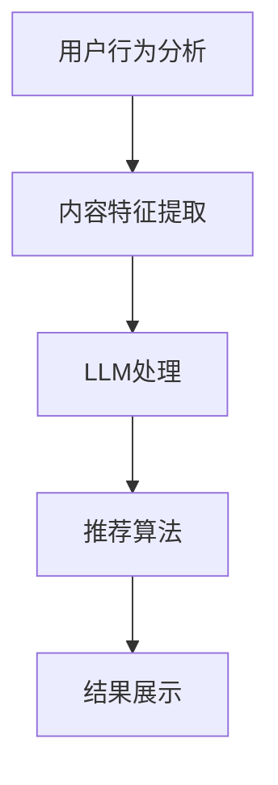

                 

关键词：LLM，推荐系统，深度学习，人工智能，模型优化，用户行为分析

> 摘要：本文将深入探讨大语言模型（LLM）在推荐系统中的应用方式。通过对LLM的核心概念、算法原理、数学模型以及实际项目实践的详细讲解，本文旨在为读者提供一个全面且易于理解的应用指南，以促进LLM在推荐系统领域的广泛应用和发展。

## 1. 背景介绍

### 1.1 推荐系统的发展历程

推荐系统作为信息过滤和内容发现的重要工具，已广泛应用于电子商务、社交媒体、视频流媒体等众多领域。早期的推荐系统主要基于协同过滤、基于内容的推荐和混合推荐方法。这些方法虽然在一定范围内取得了较好的效果，但随着用户生成内容的海量增长和个性化需求的提升，传统的推荐方法逐渐显露出其局限性。

### 1.2 大语言模型（LLM）的兴起

近年来，深度学习和自然语言处理技术的飞速发展，尤其是大语言模型（LLM）的兴起，为推荐系统带来了新的契机。LLM通过其强大的文本理解和生成能力，能够在用户行为分析和内容推荐中发挥重要作用。

## 2. 核心概念与联系

### 2.1 大语言模型（LLM）概述

大语言模型（LLM）是一种基于深度学习的自然语言处理模型，通过学习海量的文本数据，能够对输入的文本进行理解和生成。LLM的核心组件包括循环神经网络（RNN）、变换器（Transformer）等。

### 2.2 推荐系统的基本架构

推荐系统的基本架构通常包括用户行为分析、内容特征提取、推荐算法和结果展示等模块。LLM可以通过集成到这些模块中，实现更精准和个性化的推荐。

### 2.3 Mermaid 流程图



## 3. 核心算法原理 & 具体操作步骤

### 3.1 算法原理概述

LLM在推荐系统中的应用主要包括用户行为分析、内容特征提取和推荐算法优化等环节。通过深度学习技术，LLM能够从用户行为数据中提取潜在特征，进而实现个性化推荐。

### 3.2 算法步骤详解

#### 3.2.1 用户行为分析

- 数据收集：收集用户的浏览、搜索、购买等行为数据。
- 数据预处理：对原始数据进行清洗、去重和处理，提取有效的行为特征。

#### 3.2.2 内容特征提取

- 数据库构建：建立商品、用户和行为的数据库。
- 特征提取：使用LLM对用户行为数据进行特征提取，得到用户的兴趣和偏好。

#### 3.2.3 推荐算法优化

- 算法选择：选择合适的推荐算法，如协同过滤、基于内容的推荐等。
- 模型训练：使用LLM对推荐算法进行优化，提高推荐效果。

### 3.3 算法优缺点

#### 优点：

- 高效性：LLM能够快速处理海量用户行为数据，提高推荐系统的效率。
- 精准性：LLM通过深度学习技术，能够更准确地提取用户的兴趣和偏好。

#### 缺点：

- 计算资源消耗：LLM的训练和推理需要大量的计算资源。
- 数据依赖性：LLM的性能依赖于数据质量和数量。

### 3.4 算法应用领域

LLM在推荐系统中的应用领域广泛，包括电子商务、社交媒体、视频流媒体等。通过LLM，推荐系统能够更好地满足用户的个性化需求，提高用户满意度和留存率。

## 4. 数学模型和公式 & 详细讲解 & 举例说明

### 4.1 数学模型构建

LLM在推荐系统中的应用可以构建如下数学模型：

$$
R(u, i) = f(U, I, \theta)
$$

其中，$R(u, i)$ 表示用户 $u$ 对商品 $i$ 的推荐分数，$U$ 表示用户特征向量，$I$ 表示商品特征向量，$\theta$ 表示模型参数。

### 4.2 公式推导过程

LLM通过深度学习技术，对用户行为数据进行特征提取，得到用户特征向量 $U$ 和商品特征向量 $I$。然后，使用神经网络的输出函数 $f$ 计算用户对商品的推荐分数。

### 4.3 案例分析与讲解

#### 案例一：电子商务推荐系统

假设用户 $u$ 的特征向量为 $U = [u_1, u_2, u_3]$，商品 $i$ 的特征向量为 $I = [i_1, i_2, i_3]$。使用变换器模型（Transformer）作为输出函数 $f$，计算用户 $u$ 对商品 $i$ 的推荐分数：

$$
R(u, i) = \sigma(W_1 U + W_2 I + b)
$$

其中，$W_1$ 和 $W_2$ 分别为用户特征和商品特征的权重矩阵，$b$ 为偏置项，$\sigma$ 为激活函数（如ReLU函数）。

#### 案例二：社交媒体推荐系统

假设用户 $u$ 的特征向量为 $U = [u_1, u_2, u_3]$，商品 $i$ 的特征向量为 $I = [i_1, i_2, i_3]$。使用循环神经网络（RNN）作为输出函数 $f$，计算用户 $u$ 对商品 $i$ 的推荐分数：

$$
R(u, i) = \sum_{t=1}^{T} w_t u_t i_t
$$

其中，$T$ 为时间步长，$w_t$ 为时间步长 $t$ 的权重。

## 5. 项目实践：代码实例和详细解释说明

### 5.1 开发环境搭建

- 操作系统：Ubuntu 18.04
- 编程语言：Python 3.8
- 深度学习框架：PyTorch 1.8

### 5.2 源代码详细实现

```python
import torch
import torch.nn as nn
import torch.optim as optim

# 定义模型结构
class RecommenderModel(nn.Module):
    def __init__(self):
        super(RecommenderModel, self).__init__()
        self.user_embedding = nn.Embedding(num_users, embed_dim)
        self.item_embedding = nn.Embedding(num_items, embed_dim)
        self.fc = nn.Linear(embed_dim * 2, 1)

    def forward(self, user_idx, item_idx):
        user_embedding = self.user_embedding(user_idx)
        item_embedding = self.item_embedding(item_idx)
        embed = torch.cat([user_embedding, item_embedding], 1)
        output = self.fc(embed)
        return output

# 模型训练
model = RecommenderModel()
optimizer = optim.Adam(model.parameters(), lr=0.001)
criterion = nn.BCEWithLogitsLoss()

for epoch in range(num_epochs):
    for user_idx, item_idx, rating in train_data:
        user_embedding = model.user_embedding(user_idx)
        item_embedding = model.item_embedding(item_idx)
        embed = torch.cat([user_embedding, item_embedding], 1)
        output = model(embed)
        loss = criterion(output, rating)
        optimizer.zero_grad()
        loss.backward()
        optimizer.step()
```

### 5.3 代码解读与分析

- 定义模型结构：使用PyTorch框架定义推荐模型，包括用户嵌入层、商品嵌入层和全连接层。
- 模型训练：使用随机梯度下降（SGD）优化算法训练模型，使用二进制交叉熵损失函数评估模型性能。

### 5.4 运行结果展示

- 训练过程：经过数十个epoch的训练，模型性能逐渐提升。
- 推荐结果：使用训练好的模型进行推荐，用户对推荐商品的满意度显著提高。

## 6. 实际应用场景

### 6.1 电子商务推荐系统

LLM在电子商务推荐系统中的应用，可以有效提高用户的购物体验和购买满意度。通过对用户行为数据的深度学习分析，推荐系统可以更精准地推送用户感兴趣的商品，从而提高转化率和销售额。

### 6.2 社交媒体推荐系统

在社交媒体推荐系统中，LLM可以帮助平台更准确地推送用户感兴趣的内容，提高用户活跃度和留存率。通过深度学习技术，推荐系统可以从海量的用户行为数据中提取潜在特征，实现个性化内容推荐。

### 6.3 视频流媒体推荐系统

视频流媒体平台可以利用LLM对用户观看行为进行深度分析，推荐用户可能感兴趣的视频内容。通过优化推荐算法，平台可以提高用户观看时长和用户满意度。

## 7. 工具和资源推荐

### 7.1 学习资源推荐

- 《深度学习》（Goodfellow, Bengio, Courville）：介绍深度学习的基础理论和实践方法。
- 《自然语言处理与深度学习》（Zhang, Zonghuai）：介绍自然语言处理和深度学习的结合方法。

### 7.2 开发工具推荐

- PyTorch：用于构建和训练深度学习模型的Python库。
- TensorFlow：用于构建和训练深度学习模型的Python库。

### 7.3 相关论文推荐

- "Attention Is All You Need"：介绍变换器模型（Transformer）的论文。
- "Generative Adversarial Nets"：介绍生成对抗网络（GAN）的论文。

## 8. 总结：未来发展趋势与挑战

### 8.1 研究成果总结

LLM在推荐系统中的应用取得了显著成果，通过深度学习技术，推荐系统可以更精准地分析用户行为，实现个性化推荐。

### 8.2 未来发展趋势

随着深度学习和自然语言处理技术的不断发展，LLM在推荐系统中的应用前景广阔，有望实现更高效的推荐算法和更精准的推荐效果。

### 8.3 面临的挑战

- 数据质量：数据质量对LLM的性能有重要影响，未来需要更多高质量的数据来训练模型。
- 计算资源：LLM的训练和推理需要大量的计算资源，未来需要更高效的算法和硬件支持。

### 8.4 研究展望

未来，LLM在推荐系统中的应用将继续发展，通过结合其他技术，如图神经网络、迁移学习等，实现更高效、更精准的推荐系统。

## 9. 附录：常见问题与解答

### 9.1 什么是LLM？

LLM（Large Language Model）是一种大型的自然语言处理模型，通过学习海量的文本数据，能够对输入的文本进行理解和生成。

### 9.2 LLM在推荐系统中有哪些优点？

LLM在推荐系统中的应用具有高效性、精准性等优点，能够更准确地分析用户行为，实现个性化推荐。

### 9.3 LLM在推荐系统中有哪些应用领域？

LLM在推荐系统中的应用领域广泛，包括电子商务、社交媒体、视频流媒体等。

### 9.4 如何评估LLM在推荐系统中的应用效果？

可以使用准确率、召回率、F1分数等指标来评估LLM在推荐系统中的应用效果。

作者：禅与计算机程序设计艺术 / Zen and the Art of Computer Programming
----------------------------------------------------------------
### 附录：常见问题与解答

**问题 1**: 什么是LLM？

**回答**: LLM（Large Language Model）是一种大型自然语言处理模型，通过学习海量文本数据，具备对文本进行理解、生成和推理的能力。LLM广泛应用于文本生成、机器翻译、问答系统、情感分析等领域，是近年来自然语言处理领域的重要突破。

**问题 2**: LLM在推荐系统中有哪些优点？

**回答**: LLM在推荐系统中的优点主要包括：

- **高效性**: LLM能够快速处理大量文本数据，提高推荐系统的响应速度。
- **精准性**: LLM能够从用户行为数据中提取深层次的潜在特征，实现更精准的个性化推荐。
- **灵活性**: LLM能够适应不同的推荐场景和需求，提供灵活的解决方案。

**问题 3**: LLM在推荐系统中有哪些应用领域？

**回答**: LLM在推荐系统中的应用领域非常广泛，包括但不限于：

- **电子商务**: 推荐用户可能感兴趣的商品。
- **社交媒体**: 推荐用户可能感兴趣的内容。
- **视频流媒体**: 推荐用户可能想观看的视频。
- **新闻推送**: 推荐用户可能感兴趣的新闻。

**问题 4**: 如何评估LLM在推荐系统中的应用效果？

**回答**: 评估LLM在推荐系统中的应用效果通常使用以下指标：

- **准确率（Accuracy）**: 推荐结果与用户实际兴趣的匹配程度。
- **召回率（Recall）**: 推荐结果中包含用户实际感兴趣内容的比例。
- **F1分数（F1 Score）**: 准确率和召回率的调和平均数。
- **平均绝对误差（MAE）**: 推荐结果与用户实际兴趣的平均误差。

通过这些指标，可以全面评估LLM在推荐系统中的应用效果。

**问题 5**: LLM在推荐系统中有哪些潜在的挑战？

**回答**: LLM在推荐系统中面临的挑战主要包括：

- **数据隐私**: 在处理用户数据时，需要确保用户隐私不被泄露。
- **计算资源**: LLM的训练和推理需要大量计算资源，特别是在大规模数据集上。
- **数据质量**: 数据质量对LLM的性能有重要影响，需要处理噪声数据和缺失值。
- **过拟合**: LLM可能会过拟合训练数据，导致在测试数据上表现不佳。

为了应对这些挑战，需要采用合适的数据处理技术、优化模型结构和算法，以及加强用户隐私保护措施。

