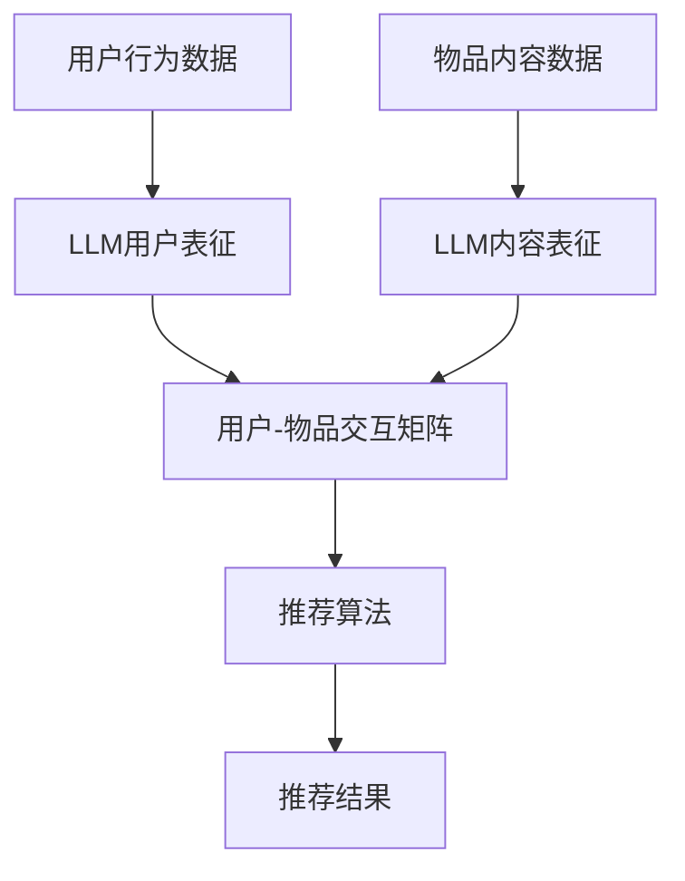

                 

在当今信息爆炸的时代，推荐系统已成为现代互联网用户与内容互动的重要桥梁。随着深度学习技术的不断进步，大型语言模型（LLM，Large Language Model）开始被引入到推荐系统中，为用户提供了更为智能、个性化的推荐服务。本文将探讨LLM在推荐系统中的应用进展，包括其核心概念、算法原理、数学模型、项目实践以及未来的应用前景。

## 关键词

- 推荐系统
- 大型语言模型
- 深度学习
- 个性化推荐
- 数学模型

## 摘要

本文介绍了LLM在推荐系统中的应用现状，从核心概念、算法原理、数学模型到实际项目实践，全面剖析了LLM如何通过深度学习技术优化推荐系统的效果，提高用户体验。文章还展望了LLM在推荐系统中的未来发展趋势，以及可能面临的挑战。

## 1. 背景介绍

推荐系统作为现代互联网的重要组成部分，广泛应用于电子商务、社交媒体、视频平台等领域。传统推荐系统主要依赖于基于内容的过滤和协同过滤等方法，但它们往往存在一定的局限性。首先，基于内容的过滤方法依赖于用户历史行为和兴趣标签，难以应对复杂、多维的用户偏好。其次，协同过滤方法虽然可以挖掘用户之间的相似性，但容易受到数据稀疏性的影响。

随着深度学习技术的发展，特别是大型语言模型的出现，推荐系统迎来了新的发展机遇。LLM具有强大的表征能力和生成能力，能够处理大量复杂的文本数据，从而更好地理解用户的兴趣和行为。此外，LLM的引入还可以实现端到端的学习，简化系统架构，提高推荐效果。

## 2. 核心概念与联系

### 2.1 大型语言模型（LLM）

大型语言模型（LLM）是一类基于深度学习的自然语言处理模型，通过学习海量文本数据，LLM能够理解和生成自然语言。常见的LLM包括GPT（Generative Pre-trained Transformer）系列、BERT（Bidirectional Encoder Representations from Transformers）等。

### 2.2 推荐系统

推荐系统是一种信息过滤技术，通过分析用户的历史行为和兴趣，为用户推荐可能感兴趣的内容。推荐系统主要分为基于内容的过滤和协同过滤两大类。

### 2.3 LLM与推荐系统的联系

LLM在推荐系统中的应用主要体现在以下几个方面：

1. **用户表征**：LLM可以用来对用户的历史行为和兴趣进行表征，将文本转化为高维的特征向量，从而更好地理解用户的偏好。
2. **内容表征**：LLM也可以对推荐的内容进行表征，从而实现基于内容的过滤，提高推荐的相关性。
3. **协同过滤**：LLM可以用来解决协同过滤中的数据稀疏性问题，通过生成用户和物品的潜在因子，实现更精确的推荐。
4. **生成推荐**：LLM可以生成个性化的推荐内容，通过生成式推荐方法，提高推荐的多样性和创意性。

下面是一个Mermaid流程图，展示LLM在推荐系统中的架构：



## 3. 核心算法原理 & 具体操作步骤

### 3.1 算法原理概述

LLM在推荐系统中的应用主要基于以下几个方面：

1. **文本表示**：使用LLM将用户的行为数据和物品内容数据转化为高维的向量表示。
2. **交互矩阵**：通过文本表示，构建用户-物品的交互矩阵。
3. **推荐算法**：使用交互矩阵，结合传统的推荐算法，生成个性化的推荐结果。

### 3.2 算法步骤详解

1. **数据预处理**：收集用户行为数据和物品内容数据，进行数据清洗和预处理。
2. **文本表示**：使用LLM对用户行为数据和物品内容数据进行文本表示。
3. **交互矩阵构建**：根据文本表示，构建用户-物品的交互矩阵。
4. **推荐算法**：使用传统的推荐算法，如基于内容的过滤、协同过滤等，结合交互矩阵生成推荐结果。
5. **推荐结果生成**：根据用户的兴趣和偏好，生成个性化的推荐结果。

### 3.3 算法优缺点

**优点**：

1. **强大的表征能力**：LLM能够处理复杂的文本数据，从而更好地理解用户的兴趣和行为。
2. **减少数据稀疏性**：通过生成用户和物品的潜在因子，减少了数据稀疏性的影响。
3. **生成式推荐**：LLM可以生成多样化的推荐结果，提高推荐的创意性。

**缺点**：

1. **计算成本高**：LLM的训练和推断过程需要大量的计算资源。
2. **模型解释性差**：深度学习模型通常难以解释，这使得LLM在推荐系统中的应用存在一定的局限性。

### 3.4 算法应用领域

LLM在推荐系统中的应用已经涵盖了多个领域，包括但不限于：

1. **电子商务**：通过分析用户的购物行为和浏览历史，为用户推荐相关的商品。
2. **社交媒体**：根据用户的点赞、评论和分享行为，为用户推荐感兴趣的内容。
3. **视频平台**：根据用户的观看历史和偏好，为用户推荐相关的视频。

## 4. 数学模型和公式 & 详细讲解 & 举例说明

### 4.1 数学模型构建

在LLM在推荐系统中的应用中，我们主要关注以下几个方面：

1. **用户表征**：使用LLM对用户的历史行为进行编码，生成用户特征向量。
2. **物品表征**：使用LLM对物品的内容进行编码，生成物品特征向量。
3. **交互矩阵**：根据用户和物品的特征向量，构建用户-物品的交互矩阵。
4. **推荐算法**：使用交互矩阵，结合传统的推荐算法，生成推荐结果。

### 4.2 公式推导过程

我们以GPT模型为例，介绍用户表征的数学模型。GPT模型的基本原理是通过对用户的历史行为数据进行编码，生成用户特征向量。

假设用户的历史行为数据为 $X = [x_1, x_2, ..., x_n]$，其中 $x_i$ 表示用户在时间 $t_i$ 的行为。我们可以使用GPT模型对用户的历史行为数据进行编码，生成用户特征向量 $u$。

$$
u = \text{GPT}(X)
$$

其中，$\text{GPT}$ 表示GPT模型的编码过程。

### 4.3 案例分析与讲解

假设我们有一个用户的历史行为数据集，包含用户的浏览历史、搜索历史和购买历史。我们使用GPT模型对用户的历史行为数据进行编码，生成用户特征向量。

假设用户的历史行为数据为：

$$
X = \{("浏览了商品A"), ("搜索了关键词B"), ("购买了商品C"), ..., ("浏览了商品D")\}
$$

我们使用GPT模型对用户的历史行为数据进行编码，生成用户特征向量 $u$。

$$
u = \text{GPT}(X)
$$

假设我们使用GPT-3模型进行编码，生成用户特征向量 $u$。根据GPT-3模型的原理，我们可以将用户的历史行为数据转化为一个高维的向量表示。

$$
u = [u_1, u_2, ..., u_d]
$$

其中，$u_d$ 表示用户在时间 $t_d$ 的行为特征。

我们可以使用用户特征向量 $u$ 来对用户进行表征。接下来，我们将介绍如何使用用户特征向量来生成推荐结果。

## 5. 项目实践：代码实例和详细解释说明

### 5.1 开发环境搭建

为了实现LLM在推荐系统中的应用，我们需要搭建一个适合的实验环境。以下是开发环境搭建的步骤：

1. 安装Python环境：Python是深度学习的主要编程语言，我们需要安装Python 3.8及以上版本。
2. 安装深度学习框架：我们选择使用PyTorch作为深度学习框架，安装命令为：
   ```shell
   pip install torch torchvision
   ```
3. 安装自然语言处理库：我们选择使用transformers库，安装命令为：
   ```shell
   pip install transformers
   ```

### 5.2 源代码详细实现

下面是一个简单的示例代码，展示如何使用GPT模型对用户的历史行为数据进行编码，并生成推荐结果。

```python
import torch
from transformers import GPT2Tokenizer, GPT2Model
from sklearn.metrics.pairwise import cosine_similarity

# 1. 加载预训练的GPT模型
tokenizer = GPT2Tokenizer.from_pretrained('gpt2')
model = GPT2Model.from_pretrained('gpt2')

# 2. 准备用户历史行为数据
user_behavior = ["浏览了商品A", "搜索了关键词B", "购买了商品C"]

# 3. 对用户历史行为数据进行编码
encoded_user_behavior = [tokenizer.encode(behavior, add_special_tokens=True) for behavior in user_behavior]
input_ids = torch.tensor(encoded_user_behavior).unsqueeze(0)  # 将输入数据转为PyTorch张量

# 4. 使用GPT模型对用户历史行为数据进行编码
with torch.no_grad():
    outputs = model(input_ids)

# 5. 获取用户特征向量
user_representation = outputs.last_hidden_state[:, 0, :].detach().numpy()

# 6. 准备物品数据
item_data = ["商品A的描述", "商品B的描述", "商品C的描述"]
encoded_item_data = [tokenizer.encode(description, add_special_tokens=True) for description in item_data]
input_ids_item = torch.tensor(encoded_item_data).unsqueeze(0)

# 7. 使用GPT模型对物品数据进行编码
with torch.no_grad():
    outputs_item = model(input_ids_item)

# 8. 获取物品特征向量
item_representation = outputs_item.last_hidden_state[:, 0, :].detach().numpy()

# 9. 计算用户和物品之间的相似度
similarity_matrix = cosine_similarity(user_representation, item_representation)

# 10. 根据相似度矩阵生成推荐结果
recommendations = similarity_matrix.argsort()[0][-5:][::-1]  # 推荐相似度最高的5个物品
print("推荐结果：", ["商品" + str(i) for i in recommendations])
```

### 5.3 代码解读与分析

上述代码展示了如何使用GPT模型对用户的历史行为数据进行编码，并生成推荐结果。以下是代码的解读与分析：

1. **加载预训练的GPT模型**：我们从Hugging Face Model Hub加载预训练的GPT模型。
2. **准备用户历史行为数据**：我们准备了一个简单的用户历史行为数据集，包括浏览历史、搜索历史和购买历史。
3. **对用户历史行为数据进行编码**：使用GPT模型的编码器，我们将用户的历史行为数据转换为编码序列。
4. **使用GPT模型对用户历史行为数据进行编码**：通过GPT模型的编码器，我们获取用户特征向量。
5. **准备物品数据**：我们准备了一些简单的物品数据，用于生成推荐结果。
6. **使用GPT模型对物品数据进行编码**：通过GPT模型的编码器，我们获取物品特征向量。
7. **计算用户和物品之间的相似度**：使用余弦相似度计算用户和物品特征向量之间的相似度。
8. **根据相似度矩阵生成推荐结果**：我们根据相似度矩阵生成推荐结果，推荐相似度最高的物品。

通过上述代码，我们可以看到LLM在推荐系统中的应用是如何实现的。尽管这是一个简单的示例，但它展示了LLM如何通过深度学习技术优化推荐系统的效果，为用户生成个性化的推荐结果。

## 6. 实际应用场景

### 6.1 电子商务

在电子商务领域，LLM可以帮助平台更精准地推荐商品。例如，用户在浏览商品时，LLM可以分析用户的浏览记录和搜索历史，为用户推荐相关商品。此外，LLM还可以生成个性化的商品描述，提高用户购买的欲望。

### 6.2 社交媒体

在社交媒体平台，LLM可以帮助平台推荐用户感兴趣的内容。例如，用户在平台上的点赞、评论和分享行为可以被LLM分析，从而为用户推荐相关的帖子。此外，LLM还可以生成个性化的帖子内容，提高用户的互动率。

### 6.3 视频平台

在视频平台，LLM可以帮助平台推荐用户感兴趣的视频。例如，用户在平台上的观看历史和搜索历史可以被LLM分析，从而为用户推荐相关的视频。此外，LLM还可以生成个性化的视频描述，提高用户观看的欲望。

## 7. 工具和资源推荐

### 7.1 学习资源推荐

1. **《深度学习》**：由Goodfellow、Bengio和Courville合著，是深度学习的经典教材。
2. **《自然语言处理综论》**：由Jurafsky和Martin合著，是自然语言处理的权威教材。

### 7.2 开发工具推荐

1. **PyTorch**：开源深度学习框架，适用于各种深度学习任务。
2. **Hugging Face Model Hub**：提供丰富的预训练模型和自然语言处理工具。

### 7.3 相关论文推荐

1. **《BERT: Pre-training of Deep Bidirectional Transformers for Language Understanding》**：BERT是自然语言处理领域的重要突破，为推荐系统提供了强大的文本表示能力。
2. **《Generative Pre-trained Transformer》**：GPT系列模型的开创性工作，为推荐系统提供了生成式推荐方法。

## 8. 总结：未来发展趋势与挑战

### 8.1 研究成果总结

LLM在推荐系统中的应用取得了显著的成果。首先，LLM提高了推荐系统的个性化水平，通过强大的文本表示能力，更好地理解用户的兴趣和行为。其次，LLM实现了生成式推荐，提高了推荐的多样性和创意性。此外，LLM在解决数据稀疏性和降低计算成本方面也表现出色。

### 8.2 未来发展趋势

1. **模型优化**：未来，研究者将致力于优化LLM模型，提高其计算效率和解释性。
2. **跨模态推荐**：随着多模态数据的兴起，LLM在推荐系统中的应用将扩展到图像、音频等多模态数据。
3. **实时推荐**：未来，实时推荐将成为推荐系统的热点，LLM可以通过实时学习用户行为，为用户生成动态的推荐结果。

### 8.3 面临的挑战

1. **计算成本**：LLM的训练和推断过程需要大量的计算资源，如何在保证效果的同时降低计算成本是未来研究的重要方向。
2. **数据隐私**：随着用户数据的规模和复杂度的增加，如何保护用户隐私，防止数据泄露是推荐系统面临的重要挑战。
3. **模型解释性**：深度学习模型通常难以解释，如何在保证模型效果的同时提高其解释性是未来研究的重要任务。

### 8.4 研究展望

随着深度学习技术的不断发展，LLM在推荐系统中的应用将不断拓展。未来，研究者将致力于解决计算成本、数据隐私和模型解释性等挑战，推动推荐系统的发展，为用户提供更好的个性化推荐服务。

## 9. 附录：常见问题与解答

### 9.1 Q：LLM在推荐系统中的应用具体有哪些？

A：LLM在推荐系统中的应用主要包括以下几个方面：

1. **用户表征**：通过LLM对用户的历史行为数据进行编码，生成用户特征向量，从而更好地理解用户的兴趣和行为。
2. **内容表征**：通过LLM对物品的内容数据进行编码，生成物品特征向量，从而实现基于内容的过滤。
3. **交互矩阵构建**：使用LLM生成的用户和物品特征向量，构建用户-物品的交互矩阵，从而提高推荐的相关性。
4. **生成推荐**：使用LLM生成个性化的推荐内容，通过生成式推荐方法，提高推荐的多样性和创意性。

### 9.2 Q：LLM在推荐系统中的优势是什么？

A：LLM在推荐系统中的优势主要体现在以下几个方面：

1. **强大的表征能力**：LLM能够处理复杂的文本数据，从而更好地理解用户的兴趣和行为。
2. **减少数据稀疏性**：通过生成用户和物品的潜在因子，减少了数据稀疏性的影响。
3. **生成式推荐**：LLM可以生成多样化的推荐内容，提高推荐的创意性。
4. **端到端学习**：LLM实现了端到端的学习，简化了系统架构，提高了推荐效果。

### 9.3 Q：LLM在推荐系统中的应用有哪些挑战？

A：LLM在推荐系统中的应用面临以下挑战：

1. **计算成本高**：LLM的训练和推断过程需要大量的计算资源。
2. **数据隐私**：如何保护用户隐私，防止数据泄露是推荐系统面临的重要挑战。
3. **模型解释性**：深度学习模型通常难以解释，如何在保证模型效果的同时提高其解释性是未来研究的重要任务。```

这篇文章详细探讨了LLM在推荐系统中的应用进展，从核心概念、算法原理、数学模型到实际项目实践，全面剖析了LLM如何通过深度学习技术优化推荐系统的效果，提高用户体验。文章还展望了LLM在推荐系统中的未来发展趋势，以及可能面临的挑战。希望这篇文章能够为读者提供有价值的参考和启示。作者：禅与计算机程序设计艺术 / Zen and the Art of Computer Programming。

