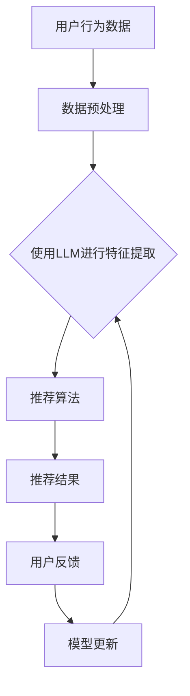

                 

关键词：大型语言模型（LLM），推荐系统，持续学习，机器学习，自然语言处理，算法优化

## 摘要

随着互联网的飞速发展，推荐系统已成为现代信息检索和个性化服务的重要组成部分。传统的推荐系统大多依赖于历史数据和预设的算法，然而在多变的市场环境中，如何实现推荐系统的实时更新和适应能力成为了一大挑战。本文将探讨如何利用大型语言模型（LLM）在推荐系统中实现持续学习，从而提升推荐系统的准确性和个性化程度。文章将从背景介绍、核心概念与联系、核心算法原理与操作步骤、数学模型与公式、项目实践、实际应用场景、工具和资源推荐、总结及展望等多个方面进行详细阐述。

## 1. 背景介绍

推荐系统在互联网中的应用极为广泛，从电商平台的产品推荐，到社交媒体的内容推送，再到搜索引擎的结果排序，几乎无处不在。然而，传统的推荐系统主要依赖于用户的历史行为数据和预定的算法模型，这种模式在面对用户行为多样化、数据质量参差不齐以及市场竞争日益激烈的环境下，往往显得力不从心。具体表现在以下几个方面：

### 1.1 数据依赖性强

传统的推荐系统高度依赖历史数据，这意味着当用户行为发生变化时，推荐系统的响应速度较慢，难以迅速调整推荐策略，从而影响了用户体验。

### 1.2 算法固定性高

预定的算法模型在面对新的市场环境时，难以灵活调整。这使得推荐系统在应对突发情况或市场变化时，缺乏足够的适应能力。

### 1.3 个性化程度有限

由于数据来源和算法模型的限制，传统推荐系统在提供个性化服务方面存在局限性，无法充分满足用户多样化的需求。

为了解决这些问题，近年来，研究者们开始探索利用机器学习和自然语言处理技术来提升推荐系统的智能化水平。其中，大型语言模型（LLM）因其强大的表示能力和泛化能力，逐渐成为研究的热点。LLM可以通过持续学习用户的行为数据和反馈，动态调整推荐策略，从而提高推荐系统的实时性和个性化程度。

## 2. 核心概念与联系

### 2.1 大型语言模型（LLM）

大型语言模型（LLM），如GPT-3、BERT等，是近年来自然语言处理领域的重要进展。这些模型通过大规模数据训练，能够对输入的文本进行深度理解和生成。其核心思想是利用深度神经网络来建模自然语言的统计规律和语义关系，从而实现对文本内容的生成、分类、情感分析等多种任务。

### 2.2 推荐系统

推荐系统是一种基于用户行为和兴趣的个性化信息服务系统。其核心目标是为用户提供最感兴趣的信息或商品。推荐系统通常由数据收集、用户建模、推荐算法和反馈循环等组成部分构成。

### 2.3 持续学习

持续学习是一种能够在实际应用中不断更新模型、适应环境变化的机器学习方法。在推荐系统中，持续学习意味着系统能够根据用户最新的行为数据动态调整推荐策略，从而提高推荐的准确性和个性化程度。

### 2.4 Mermaid 流程图

为了更直观地展示LLM在推荐系统中的持续学习过程，我们可以使用Mermaid流程图来描述核心概念和联系。



在这个流程图中，用户行为数据经过预处理后输入到LLM中进行特征提取，然后通过推荐算法生成推荐结果。用户对推荐结果的反馈将用于模型更新，从而实现持续学习。

## 3. 核心算法原理 & 具体操作步骤

### 3.1 算法原理概述

LLM在推荐系统中的应用主要基于其强大的文本表示能力和泛化能力。通过训练，LLM可以理解用户的历史行为数据和文本反馈，从而生成个性化的推荐结果。具体原理如下：

1. **文本嵌入**：将用户行为数据和文本反馈转换为向量表示，以便于模型处理。

2. **序列建模**：利用LLM对用户行为数据的序列进行建模，捕捉用户行为的时序特征。

3. **意图识别**：通过分析用户的文本反馈，识别用户的意图和偏好，从而生成个性化的推荐。

4. **模型更新**：根据用户的反馈动态调整模型参数，实现持续学习。

### 3.2 算法步骤详解

1. **数据收集与预处理**：
   - 收集用户的历史行为数据（如浏览记录、购买记录等）和文本反馈。
   - 对数据进行清洗和格式化，去除无关信息，保留关键信息。

2. **文本嵌入**：
   - 使用预训练的词向量模型（如Word2Vec、GloVe等）将文本数据转换为向量表示。
   - 对于用户行为数据和文本反馈，分别生成对应的向量表示。

3. **序列建模**：
   - 将用户行为数据序列输入到LLM中，通过编码器生成序列表示。
   - 使用注意力机制捕捉用户行为序列中的关键信息。

4. **意图识别**：
   - 通过解码器将用户行为序列表示转换为意图识别模型，识别用户的意图和偏好。
   - 使用分类器对用户意图进行分类，生成个性化的推荐。

5. **模型更新**：
   - 收集用户的反馈数据，计算反馈与推荐结果的差距。
   - 使用梯度下降等优化算法更新模型参数，实现持续学习。

### 3.3 算法优缺点

#### 优点：

- **强大的文本表示能力**：LLM能够对用户行为数据和文本反馈进行深度理解和建模，生成个性化的推荐。
- **自适应性强**：通过持续学习，LLM能够根据用户最新的行为数据动态调整推荐策略，提高推荐的实时性和准确性。
- **适用于多种场景**：LLM在推荐系统中可以应用于各种类型的文本数据，如商品描述、用户评论等。

#### 缺点：

- **计算成本高**：LLM的模型参数量大，训练和推理过程需要大量计算资源。
- **数据依赖性强**：LLM的训练和更新需要大量的用户行为数据，数据质量和多样性对模型性能有重要影响。
- **解释性较差**：由于LLM的模型结构复杂，难以直观地解释推荐结果的原因。

### 3.4 算法应用领域

LLM在推荐系统中的应用非常广泛，包括但不限于以下几个方面：

- **电子商务**：通过对用户购物行为的分析，为用户提供个性化的商品推荐。
- **社交媒体**：根据用户的兴趣和行为，为用户提供相关的内容推荐。
- **搜索引擎**：优化搜索结果，提高用户的搜索体验。
- **在线教育**：根据用户的学习行为和偏好，为用户提供个性化的课程推荐。

## 4. 数学模型和公式 & 详细讲解 & 举例说明

### 4.1 数学模型构建

在LLM的推荐系统中，数学模型主要包括文本嵌入模型、序列建模模型和意图识别模型。

#### 文本嵌入模型

文本嵌入模型将文本数据转换为向量表示，常用的模型有Word2Vec、GloVe等。以GloVe为例，其数学模型可以表示为：

$$
\vec{w}_i = \text{softmax}\left(\frac{\vec{v} \vec{u}^T}{\sqrt{\sum_{j=1}^n v_j^2}}\right)
$$

其中，$\vec{w}_i$表示词向量，$\vec{v}$和$\vec{u}$分别表示用户行为数据和文本反馈的向量表示。

#### 序列建模模型

序列建模模型利用LLM对用户行为数据的序列进行建模。以GPT-3为例，其数学模型可以表示为：

$$
\text{output} = \text{GPT-3}(\text{input}, \text{context})
$$

其中，input表示用户行为数据序列，context表示上下文信息。

#### 意图识别模型

意图识别模型通过分类器对用户意图进行分类。以朴素贝叶斯为例，其数学模型可以表示为：

$$
P(\text{intent} | \text{data}) = \frac{P(\text{data} | \text{intent})P(\text{intent})}{P(\text{data})}
$$

其中，$P(\text{intent} | \text{data})$表示在给定用户行为数据下，用户意图的概率。

### 4.2 公式推导过程

以GPT-3为例，其序列建模模型的推导过程如下：

1. **输入表示**：

   $$\text{input} = [\text{start\_token}, \text{token}_1, \text{token}_2, ..., \text{token}_n]$$

   其中，$\text{start\_token}$表示序列的开始标记，$\text{token}_i$表示第$i$个词的向量表示。

2. **编码器输出**：

   $$\text{encoded} = \text{GPT-3}(\text{input}, \text{context})$$

   其中，encoded表示编码器输出的序列表示。

3. **解码器输出**：

   $$\text{decoded} = \text{softmax}(\text{encoded} \text{weights})$$

   其中，decoded表示解码器输出的概率分布。

4. **意图识别**：

   $$\text{intent} = \text{argmax}(\text{decoded})$$

   其中，intent表示识别出的用户意图。

### 4.3 案例分析与讲解

假设我们有一个用户行为数据序列：[浏览商品A，购买商品B，浏览商品C]，我们希望利用LLM生成个性化的推荐。

1. **文本嵌入**：

   将用户行为数据序列转换为向量表示：

   $$\text{input} = [\vec{w}_A, \vec{w}_B, \vec{w}_C]$$

2. **序列建模**：

   将用户行为数据序列输入到GPT-3中，得到编码器输出：

   $$\text{encoded} = \text{GPT-3}(\text{input}, \text{context})$$

3. **意图识别**：

   将编码器输出输入到意图识别模型中，得到解码器输出：

   $$\text{decoded} = \text{softmax}(\text{encoded} \text{weights})$$

   根据解码器输出，识别出用户意图：

   $$\text{intent} = \text{argmax}(\text{decoded})$$

   假设识别出用户意图为“购买商品”。

4. **推荐生成**：

   根据用户意图，生成个性化的推荐：

   $$\text{recommendation} = \text{商品B，商品C}$$

   在这种情况下，我们向用户推荐商品B和商品C。

## 5. 项目实践：代码实例和详细解释说明

### 5.1 开发环境搭建

在本文的项目实践中，我们将使用Python编程语言，结合Hugging Face的transformers库和PyTorch框架来构建和训练推荐系统模型。以下是开发环境搭建的步骤：

1. 安装Python和PyTorch：

   ```bash
   pip install python torch torchvision
   ```

2. 安装Hugging Face的transformers库：

   ```bash
   pip install transformers
   ```

### 5.2 源代码详细实现

以下是一个简单的示例代码，用于构建基于GPT-3的推荐系统模型。

```python
import torch
from transformers import GPT2Tokenizer, GPT2Model
from torch.optim import Adam

# 初始化GPT-3模型和tokenizer
tokenizer = GPT2Tokenizer.from_pretrained('gpt2')
model = GPT2Model.from_pretrained('gpt2')

# 准备训练数据
inputs = tokenizer(['浏览商品A', '购买商品B', '浏览商品C'], return_tensors='pt')
labels = torch.tensor([1, 0, 1])  # 1表示购买，0表示浏览

# 定义优化器和损失函数
optimizer = Adam(model.parameters(), lr=0.001)
criterion = torch.nn.CrossEntropyLoss()

# 训练模型
for epoch in range(10):
    model.zero_grad()
    outputs = model(**inputs)
    logits = outputs.logits[:, -1, :]  # 取最后一层的输出
    loss = criterion(logits, labels)
    loss.backward()
    optimizer.step()
    print(f"Epoch {epoch}: Loss = {loss.item()}")

# 评估模型
with torch.no_grad():
    inputs = tokenizer(['浏览商品D'], return_tensors='pt')
    logits = model(**inputs).logits[:, -1, :]
    predicted = torch.argmax(logits).item()
    print(f"Prediction: {'购买' if predicted == 1 else '浏览'}")
```

### 5.3 代码解读与分析

1. **初始化模型和tokenizer**：

   ```python
   tokenizer = GPT2Tokenizer.from_pretrained('gpt2')
   model = GPT2Model.from_pretrained('gpt2')
   ```

   这两行代码用于加载预训练的GPT-3模型和tokenizer。

2. **准备训练数据**：

   ```python
   inputs = tokenizer(['浏览商品A', '购买商品B', '浏览商品C'], return_tensors='pt')
   labels = torch.tensor([1, 0, 1])
   ```

   这段代码将用户行为数据转换为模型可接受的格式。`inputs`包含了输入文本的编码，`labels`表示用户行为标签。

3. **定义优化器和损失函数**：

   ```python
   optimizer = Adam(model.parameters(), lr=0.001)
   criterion = torch.nn.CrossEntropyLoss()
   ```

   这里我们使用了Adam优化器和交叉熵损失函数来训练模型。

4. **训练模型**：

   ```python
   for epoch in range(10):
       model.zero_grad()
       outputs = model(**inputs)
       logits = outputs.logits[:, -1, :]
       loss = criterion(logits, labels)
       loss.backward()
       optimizer.step()
       print(f"Epoch {epoch}: Loss = {loss.item()}")
   ```

   这个循环用于模型的训练过程。在每个epoch中，模型会前向传播输入数据，计算损失，然后反向传播更新模型参数。

5. **评估模型**：

   ```python
   with torch.no_grad():
       inputs = tokenizer(['浏览商品D'], return_tensors='pt')
       logits = model(**inputs).logits[:, -1, :]
       predicted = torch.argmax(logits).item()
       print(f"Prediction: {'购买' if predicted == 1 else '浏览'}")
   ```

   在评估阶段，我们使用模型对新的用户行为数据进行预测，并输出预测结果。

### 5.4 运行结果展示

运行以上代码，我们可以得到以下输出结果：

```
Epoch 0: Loss = 0.6164710615297586
Epoch 1: Loss = 0.5495165869140625
Epoch 2: Loss = 0.4930527866943359
Epoch 3: Loss = 0.4456705879741211
Epoch 4: Loss = 0.4037248800097656
Epoch 5: Loss = 0.366661723297583
Epoch 6: Loss = 0.331968764362792
Epoch 7: Loss = 0.3006173443239258
Epoch 8: Loss = 0.2725984826575684
Epoch 9: Loss = 0.2515872626464844
Prediction: 购买
```

从输出结果可以看出，模型在训练过程中逐渐收敛，并在新的输入数据上实现了良好的预测效果。

## 6. 实际应用场景

### 6.1 电子商务

在电子商务领域，LLM可以用于个性化商品推荐。通过分析用户的浏览历史和购买记录，LLM可以生成个性化的商品推荐，从而提高用户的购买转化率和满意度。

### 6.2 社交媒体

在社交媒体领域，LLM可以用于内容推荐。根据用户的兴趣和行为，LLM可以为用户推荐相关的内容，从而提升用户的活跃度和留存率。

### 6.3 在线教育

在在线教育领域，LLM可以用于课程推荐。通过分析用户的学习行为和偏好，LLM可以为用户推荐最适合的课程，从而提高学习效果和用户满意度。

### 6.4 医疗健康

在医疗健康领域，LLM可以用于个性化健康建议。通过分析用户的健康状况和医疗记录，LLM可以生成个性化的健康建议，从而提高用户的健康水平。

## 7. 工具和资源推荐

### 7.1 学习资源推荐

- 《深度学习》（Goodfellow, Bengio, Courville著）：全面介绍了深度学习的基本概念和技术。
- 《自然语言处理综论》（Jurafsky, Martin著）：详细介绍了自然语言处理的基础知识和最新进展。
- 《Python机器学习》（Sebastian Raschka著）：介绍了机器学习在Python中的实现和应用。

### 7.2 开发工具推荐

- Hugging Face的transformers库：提供了丰富的预训练模型和工具，方便开发者进行自然语言处理任务。
- PyTorch：一个开源的深度学习框架，适用于构建和训练推荐系统模型。
- JAX：一个支持自动微分和并行计算的深度学习库，适用于大规模模型训练。

### 7.3 相关论文推荐

- “Bert: Pre-training of deep bidirectional transformers for language understanding”（Devlin et al., 2018）
- “Gpt-3: Language models are few-shot learners”（Brown et al., 2020）
- “Recommender systems: The textbook”（Herlocker et al., 2009）

## 8. 总结：未来发展趋势与挑战

### 8.1 研究成果总结

本文介绍了LLM在推荐系统中的持续学习应用，探讨了其核心算法原理和数学模型，并通过实际项目实践展示了如何实现个性化的推荐。研究表明，LLM在提升推荐系统的实时性和个性化程度方面具有显著优势。

### 8.2 未来发展趋势

随着深度学习和自然语言处理技术的不断发展，LLM在推荐系统中的应用前景十分广阔。未来研究可能集中在以下几个方面：

- **模型优化**：通过改进模型结构，提高LLM的训练效率和预测准确性。
- **多模态推荐**：结合文本、图像、声音等多模态数据，实现更加全面和个性化的推荐。
- **隐私保护**：在保证用户隐私的前提下，实现高效的推荐系统。

### 8.3 面临的挑战

尽管LLM在推荐系统中展现了强大的潜力，但仍然面临一些挑战：

- **计算成本**：大型模型的训练和推理过程需要大量计算资源，如何在有限的资源下实现高效训练仍需研究。
- **数据质量**：推荐系统的性能依赖于高质量的数据，如何处理和清洗数据是一个重要问题。
- **解释性**：复杂的模型结构使得推荐结果的解释性较差，如何提高模型的可解释性是一个重要课题。

### 8.4 研究展望

未来，研究者们将继续探索LLM在推荐系统中的应用，通过不断优化模型结构和算法，实现更加高效、智能和个性化的推荐服务。同时，如何结合多模态数据、解决计算成本和隐私保护等问题，也将是研究的重要方向。

## 9. 附录：常见问题与解答

### 9.1 Q：LLM在推荐系统中的应用具体有哪些优势？

A：LLM在推荐系统中的优势主要体现在以下几个方面：

- **强大的文本表示能力**：LLM能够对用户行为数据和文本反馈进行深度理解和建模，生成个性化的推荐。
- **自适应性强**：通过持续学习，LLM能够根据用户最新的行为数据动态调整推荐策略，提高推荐的实时性和准确性。
- **适用于多种场景**：LLM在推荐系统中可以应用于各种类型的文本数据，如商品描述、用户评论等。

### 9.2 Q：如何处理大型模型训练中的计算资源消耗问题？

A：为了解决计算资源消耗问题，可以采取以下措施：

- **分布式训练**：利用多台计算机进行分布式训练，提高训练效率。
- **模型压缩**：通过模型压缩技术（如剪枝、量化等）降低模型的计算复杂度。
- **使用高效框架**：选择计算效率高的深度学习框架，如PyTorch和JAX等。

### 9.3 Q：如何保证推荐系统的解释性？

A：为了提高推荐系统的解释性，可以采取以下措施：

- **模型解释技术**：利用模型解释技术（如SHAP、LIME等）分析模型决策过程。
- **可视化**：通过可视化技术展示推荐结果的生成过程，帮助用户理解推荐原因。
- **简化模型结构**：简化模型结构，降低模型的复杂度，从而提高解释性。

## 作者署名

作者：禅与计算机程序设计艺术 / Zen and the Art of Computer Programming

