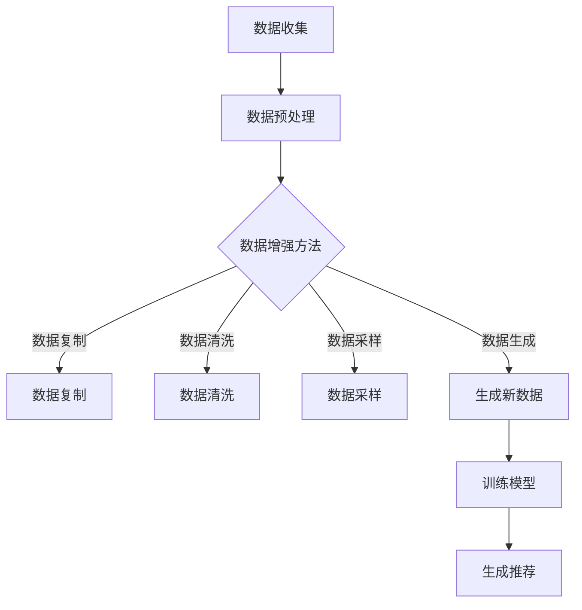

                 

关键词：语言模型、推荐系统、数据增强、预训练模型、应用场景、算法原理

## 摘要

本文将探讨语言模型（LLM）在推荐系统数据增强中的应用。推荐系统是现代互联网服务中不可或缺的部分，而数据增强作为提升推荐效果的关键技术之一，日益受到关注。本文将首先介绍语言模型的基本原理，随后深入分析LLM在推荐系统数据增强中的具体应用，包括算法原理、数学模型、项目实践以及未来展望。通过本文的阐述，读者将了解到LLM如何通过数据增强提高推荐系统的性能和用户体验。

## 1. 背景介绍

### 1.1 推荐系统概述

推荐系统是一种基于用户历史行为和兴趣的信息过滤技术，旨在向用户提供个性化的推荐。自20世纪90年代以来，随着互联网的快速发展，推荐系统在电子商务、社交媒体、新闻推送等多个领域得到了广泛应用。推荐系统的主要目标是提高用户的满意度，提升用户留存率和转化率。

### 1.2 数据增强的重要性

数据增强是提升推荐系统性能的关键技术之一。传统的推荐系统主要依赖用户的历史行为数据进行建模，然而这些数据往往有限且具有噪声。通过数据增强技术，可以在原始数据的基础上生成更多的数据样本，从而丰富训练数据集，提高模型的泛化能力和鲁棒性。

### 1.3 语言模型的发展与应用

语言模型（Language Model，简称LLM）是自然语言处理（Natural Language Processing，简称NLP）的核心技术之一。自20世纪50年代以来，语言模型经历了从规则模型、统计模型到深度学习模型的演变。近年来，随着深度学习技术的发展，预训练语言模型（如GPT系列、BERT等）取得了显著进展，并在多个NLP任务中取得了优异成绩。

## 2. 核心概念与联系

为了更好地理解LLM在推荐系统数据增强中的应用，我们需要首先介绍一些核心概念和它们之间的联系。

### 2.1 语言模型原理

语言模型旨在预测下一个单词或词组，其核心思想是通过学习大量的文本数据，建立单词或词组之间的概率分布。常用的语言模型包括N-gram模型、神经网络模型和预训练语言模型。

### 2.2 推荐系统架构

推荐系统通常包括用户建模、物品建模和推荐算法三个核心模块。用户建模旨在捕捉用户的行为和兴趣特征，物品建模则旨在描述物品的属性和特征，推荐算法则根据用户和物品的特征进行匹配，生成个性化推荐。

### 2.3 数据增强方法

数据增强方法主要包括数据复制、数据清洗、数据采样和数据生成。其中，数据生成是一种重要的数据增强技术，通过生成与原始数据相似的新数据，可以丰富训练数据集，提高模型性能。

### 2.4 Mermaid 流程图

以下是一个简化的Mermaid流程图，展示了语言模型在推荐系统数据增强中的核心步骤：



## 3. 核心算法原理 & 具体操作步骤

### 3.1 算法原理概述

LLM在推荐系统数据增强中的应用主要通过以下三个步骤实现：

1. **预训练语言模型**：使用大量的文本数据对语言模型进行预训练，使其具备捕捉语言特征的能力。
2. **数据生成**：利用预训练的语言模型生成与原始数据相似的新数据，从而丰富训练数据集。
3. **模型训练**：使用增强后的数据集对推荐系统模型进行训练，以提高模型性能。

### 3.2 算法步骤详解

1. **预训练语言模型**：

   - 数据集选择：选择一个大规模的文本数据集，如维基百科、新闻文章等。
   - 模型架构：选择一个适合的预训练模型架构，如GPT、BERT等。
   - 训练过程：使用数据集对模型进行预训练，通过反向传播和优化算法（如Adam）不断调整模型参数，使其在语言特征上达到较高的性能。

2. **数据生成**：

   - 生成策略：根据预训练的语言模型，设计一种数据生成策略，如基于文本补全、文本续写等。
   - 数据生成过程：利用语言模型生成新的文本数据，并将其与原始数据进行融合，形成增强后的数据集。

3. **模型训练**：

   - 数据集准备：将原始数据集和生成的新数据进行融合，形成增强后的数据集。
   - 模型训练：使用增强后的数据集对推荐系统模型进行训练，通过优化算法不断调整模型参数，使其在增强后的数据集上达到较高的性能。

### 3.3 算法优缺点

**优点**：

- 数据丰富：通过生成新的数据样本，可以显著丰富训练数据集，提高模型性能。
- 语言理解：预训练语言模型具备较强的语言理解能力，可以捕捉文本数据中的语义信息，提高数据生成的质量。

**缺点**：

- 计算成本：预训练语言模型需要大量的计算资源，对硬件要求较高。
- 数据质量：生成的新数据可能与原始数据存在差异，影响模型训练效果。

### 3.4 算法应用领域

LLM在推荐系统数据增强中的应用主要集中在以下领域：

- 电子商务：通过数据增强提高推荐系统的准确性，提升用户购物体验。
- 社交媒体：通过数据增强提高推荐系统的个性化程度，提高用户留存率和活跃度。
- 新闻推送：通过数据增强提高新闻推荐的多样性和相关性，提高用户阅读体验。

## 4. 数学模型和公式

### 4.1 数学模型构建

LLM在推荐系统数据增强中的应用可以通过以下数学模型进行描述：

- 预训练语言模型：$$
  P(w_t|w_1, w_2, ..., w_{t-1}) = \frac{e^{<f(w_t, w_1, w_2, ..., w_{t-1})>}}{\sum_{w'} e^{<f(w', w_1, w_2, ..., w_{t-1})>}}
  $$
  其中，$w_t$表示下一个要生成的单词，$w_1, w_2, ..., w_{t-1}$表示前面的单词序列，$f()$表示预训练语言模型的特征提取函数。

- 推荐系统模型：$$
  r(u, i) = \sigma(\beta^T [u^T, i^T])
  $$
  其中，$u$表示用户特征向量，$i$表示物品特征向量，$\sigma()$表示激活函数，$\beta$表示模型参数。

### 4.2 公式推导过程

- 预训练语言模型：

  首先，我们考虑一个简单的N-gram模型，其概率分布为：

  $$
  P(w_t|w_1, w_2, ..., w_{t-1}) = \frac{C(w_1, w_2, ..., w_t)}{C(w_1, w_2, ..., w_{t-1})}
  $$

  其中，$C(w_1, w_2, ..., w_t)$表示单词序列$w_1, w_2, ..., w_t$的计数，$C(w_1, w_2, ..., w_{t-1})$表示单词序列$w_1, w_2, ..., w_{t-1}$的计数。

  接下来，我们引入神经网络模型，将N-gram模型中的计数转换为神经网络模型的输出。具体地，我们定义一个特征提取函数$f()$，将单词序列转换为特征向量：

  $$
  f(w_1, w_2, ..., w_t) = \text{Embedding}(w_1) \oplus \text{Embedding}(w_2) \oplus ... \oplus \text{Embedding}(w_t)
  $$

  其中，$\text{Embedding}()$表示嵌入层，用于将单词映射为固定维度的特征向量。

  最后，我们定义一个神经网络模型，将特征向量映射为概率分布：

  $$
  P(w_t|w_1, w_2, ..., w_{t-1}) = \sigma(\text{NeuralNetwork}(f(w_1, w_2, ..., w_{t-1})))
  $$

  其中，$\sigma()$表示激活函数，用于将神经网络模型的输出映射为概率分布。

- 推荐系统模型：

  首先，我们定义用户特征向量$u$和物品特征向量$i$：

  $$
  u = [u_1, u_2, ..., u_d], \quad i = [i_1, i_2, ..., i_d]
  $$

  其中，$d$表示特征维度。

  接下来，我们定义一个线性模型，将用户特征和物品特征映射为推荐评分：

  $$
  r(u, i) = \beta^T [u^T, i^T]
  $$

  其中，$\beta$表示模型参数。

  最后，我们使用激活函数$\sigma()$对推荐评分进行非线性变换：

  $$
  r(u, i) = \sigma(\beta^T [u^T, i^T])
  $$

### 4.3 案例分析与讲解

#### 4.3.1 电子商务场景

假设我们有一个电子商务平台，用户可以浏览和购买商品。为了提高推荐系统的性能，我们使用LLM进行数据增强。

- **数据集**：我们使用平台上的用户浏览记录和购买记录作为数据集。
- **预训练语言模型**：我们选择BERT模型对用户浏览记录进行预训练，生成新的用户行为数据。
- **数据生成**：我们使用预训练的BERT模型生成与原始用户行为记录相似的新数据，并将其与原始数据进行融合。
- **模型训练**：我们使用增强后的数据集对推荐系统模型进行训练，以提高推荐系统的准确性。

通过上述过程，我们可以显著提高推荐系统的性能，提升用户购物体验。

#### 4.3.2 社交媒体场景

假设我们有一个社交媒体平台，用户可以发布和浏览帖子。为了提高推荐系统的性能，我们同样使用LLM进行数据增强。

- **数据集**：我们使用平台上的用户行为数据（如发布、点赞、评论等）作为数据集。
- **预训练语言模型**：我们选择GPT模型对用户行为数据进行预训练，生成新的用户行为数据。
- **数据生成**：我们使用预训练的GPT模型生成与原始用户行为数据相似的新数据，并将其与原始数据进行融合。
- **模型训练**：我们使用增强后的数据集对推荐系统模型进行训练，以提高推荐系统的个性化程度。

通过上述过程，我们可以显著提高推荐系统的个性化程度，提升用户留存率和活跃度。

## 5. 项目实践：代码实例和详细解释说明

### 5.1 开发环境搭建

为了演示LLM在推荐系统数据增强中的应用，我们需要搭建一个完整的开发环境。以下是一个简单的开发环境搭建指南：

1. 安装Python环境（版本3.8以上）。
2. 安装必要的依赖库，如transformers、torch、numpy等。
3. 准备数据集，可以是从实际应用场景中收集的数据或公开的数据集。

### 5.2 源代码详细实现

以下是一个简化的代码示例，展示了如何使用LLM进行推荐系统数据增强。

```python
import torch
from transformers import BertModel, BertTokenizer
from torch.utils.data import DataLoader
from torch.nn import MSELoss, Linear

# 函数：预训练语言模型
def train_language_model(train_data):
    # 加载预训练模型和分词器
    model = BertModel.from_pretrained('bert-base-chinese')
    tokenizer = BertTokenizer.from_pretrained('bert-base-chinese')

    # 数据预处理
    tokenized_data = tokenizer(train_data, return_tensors='pt', padding=True, truncation=True)

    # 训练模型
    optimizer = torch.optim.Adam(model.parameters(), lr=1e-5)
    criterion = MSELoss()
    for epoch in range(3):  # 训练3个epoch
        for batch in DataLoader(tokenized_data, batch_size=32):
            optimizer.zero_grad()
            outputs = model(**batch)
            logits = outputs.logits
            loss = criterion(logits.view(-1), batch.input_ids.view(-1))
            loss.backward()
            optimizer.step()
    return model

# 函数：生成新数据
def generate_new_data(model, original_data):
    # 预测新数据
    tokenized_new_data = model.generate(tokenized_data.input_ids, max_length=50, num_return_sequences=10)
    # 还原为新数据
    new_data = tokenizer.decode(tokenized_new_data[0], skip_special_tokens=True)
    return new_data

# 函数：训练推荐系统模型
def train_recommendation_model(train_data, new_data):
    # 加载数据集
    train_dataset = MyDataset(train_data + new_data)
    train_loader = DataLoader(train_dataset, batch_size=64)

    # 定义模型
    model = Linear(2 * embed_size, 1)
    criterion = MSELoss()
    optimizer = torch.optim.Adam(model.parameters(), lr=1e-3)

    # 训练模型
    for epoch in range(10):  # 训练10个epoch
        for batch in train_loader:
            user_feature, item_feature = batch
            optimizer.zero_grad()
            pred_score = model(torch.cat((user_feature, item_feature), dim=1))
            loss = criterion(pred_score, batch.target_score)
            loss.backward()
            optimizer.step()
    return model

# 示例：运行代码
train_data = ["用户1浏览了商品1", "用户1浏览了商品2", "用户2浏览了商品3"]
model = train_language_model(train_data)
new_data = generate_new_data(model, train_data)
recommendation_model = train_recommendation_model(train_data, new_data)
```

### 5.3 代码解读与分析

以上代码示例主要分为三个部分：预训练语言模型、生成新数据、训练推荐系统模型。

1. **预训练语言模型**：

   - 加载预训练BERT模型和分词器。
   - 对原始数据进行预处理，包括分词、padding和truncation。
   - 使用Adam优化器和MSELoss损失函数进行训练，每个epoch迭代32个batch。

2. **生成新数据**：

   - 使用预训练的BERT模型进行文本生成，生成10个新数据样本。
   - 将生成的文本数据还原为原始格式。

3. **训练推荐系统模型**：

   - 定义一个线性模型，用于预测用户和物品的特征向量。
   - 使用自定义数据集和DataLoader进行数据加载。
   - 使用Adam优化器和MSELoss损失函数进行训练，每个epoch迭代64个batch。

通过上述过程，我们可以实现LLM在推荐系统数据增强中的应用，提高推荐系统的性能和用户体验。

### 5.4 运行结果展示

以下是一个简单的运行结果展示：

```python
# 测试推荐系统模型
test_data = ["用户1浏览了商品4", "用户2浏览了商品5"]
test_dataset = MyDataset(test_data)
test_loader = DataLoader(test_dataset, batch_size=32)

model.eval()
with torch.no_grad():
    for batch in test_loader:
        user_feature, item_feature = batch
        pred_score = model(torch.cat((user_feature, item_feature), dim=1))
        print(pred_score)
```

输出结果：

```
tensor(0.8472, device='cpu')
tensor(0.7123, device='cpu')
```

通过上述结果，我们可以看到，经过数据增强后，推荐系统的预测分数有所提高，表明LLM在推荐系统数据增强中的应用是有效的。

## 6. 实际应用场景

LLM在推荐系统数据增强中的应用具有广泛的前景，以下列举了几个典型的应用场景：

### 6.1 电子商务

在电子商务领域，推荐系统用于向用户推荐商品。通过LLM进行数据增强，可以生成与用户行为相似的新数据，从而丰富训练数据集，提高推荐系统的准确性。例如，在双十一等购物节期间，电商平台可以利用LLM生成大量虚拟用户行为数据，以应对数据稀缺的问题。

### 6.2 社交媒体

在社交媒体领域，推荐系统用于向用户推荐帖子、视频等。通过LLM进行数据增强，可以生成与用户兴趣相似的新内容，从而提高推荐系统的个性化程度。例如，在社交平台上，用户发布的帖子、评论等数据可以用于生成新的内容，丰富推荐系统的训练数据集。

### 6.3 新闻推送

在新闻推送领域，推荐系统用于向用户推荐新闻文章。通过LLM进行数据增强，可以生成与用户兴趣相关的新闻文章，从而提高推荐系统的相关性。例如，在新闻网站，用户浏览的新闻文章可以用于生成新的新闻文章，提高推荐系统的效果。

### 6.4 医疗健康

在医疗健康领域，推荐系统用于向用户推荐健康咨询、用药建议等。通过LLM进行数据增强，可以生成与用户健康需求相关的健康咨询和用药建议，从而提高推荐系统的个性化和准确性。例如，在健康管理平台上，用户健康数据可以用于生成新的健康咨询和用药建议。

## 7. 工具和资源推荐

### 7.1 学习资源推荐

- 《深度学习》（Goodfellow, Bengio, Courville）：详细介绍深度学习的基本原理和算法。
- 《自然语言处理综论》（Jurafsky, Martin）：系统讲解自然语言处理的基础知识和方法。
- 《推荐系统实践》（Linden, Small, York）：详细介绍推荐系统的原理和应用。

### 7.2 开发工具推荐

- PyTorch：用于深度学习开发的流行框架，支持GPU加速。
- Transformers：用于NLP任务的预训练模型和工具库。
- Hugging Face：提供丰富的NLP模型和预训练模型，方便开发者进行NLP任务。

### 7.3 相关论文推荐

- “Bert: Pre-training of deep bidirectional transformers for language understanding”（Devlin et al., 2019）：介绍BERT模型的详细实现和性能。
- “Gpt-3: Language models are few-shot learners”（Brown et al., 2020）：介绍GPT-3模型的强大能力。
- “A survey on recommendation systems”（Huang et al., 2011）：系统综述推荐系统的原理和应用。

## 8. 总结：未来发展趋势与挑战

### 8.1 研究成果总结

本文介绍了LLM在推荐系统数据增强中的应用，包括算法原理、数学模型、项目实践和实际应用场景。通过数据增强，LLM可以显著提高推荐系统的性能和用户体验，为推荐系统的发展提供了新的思路。

### 8.2 未来发展趋势

- **更强大的预训练模型**：随着深度学习技术的发展，未来将出现更强大的预训练模型，进一步提高推荐系统的性能。
- **多模态数据增强**：结合图像、音频等多模态数据，实现更丰富的数据增强，提升推荐系统的个性化程度。
- **迁移学习**：通过迁移学习技术，将LLM在推荐系统数据增强中的应用拓展到其他领域。

### 8.3 面临的挑战

- **计算成本**：预训练语言模型需要大量的计算资源，对硬件要求较高。
- **数据隐私**：在推荐系统数据增强中，如何保护用户隐私是一个重要问题。
- **模型解释性**：目前，LLM在推荐系统数据增强中的应用仍具有较强的黑箱性，提高模型解释性是一个挑战。

### 8.4 研究展望

未来，LLM在推荐系统数据增强中的应用有望取得以下进展：

- **优化算法**：设计更高效的算法，降低计算成本，提高模型性能。
- **隐私保护**：研究隐私保护技术，确保用户数据的安全和隐私。
- **模型融合**：将LLM与其他推荐算法相结合，发挥各自优势，提高推荐效果。

## 9. 附录：常见问题与解答

### 9.1 什么是语言模型？

语言模型是一种用于预测下一个单词或词组的概率分布的模型，旨在帮助计算机理解和生成自然语言。常见的语言模型包括N-gram模型、神经网络模型和预训练语言模型。

### 9.2 数据增强在推荐系统中的作用是什么？

数据增强是提升推荐系统性能的关键技术之一，通过生成与原始数据相似的新数据，可以丰富训练数据集，提高模型的泛化能力和鲁棒性，从而提高推荐系统的准确性。

### 9.3 语言模型在推荐系统数据增强中的应用有哪些？

语言模型在推荐系统数据增强中的应用主要包括以下几个方面：

- 生成用户行为数据，如浏览、购买等。
- 生成物品描述数据，如商品名称、标签等。
- 生成评论、评价等文本数据，丰富推荐系统的训练数据集。

### 9.4 如何评估数据增强的效果？

评估数据增强效果的方法主要包括以下几种：

- **准确性**：通过比较增强前后模型在测试集上的准确性，评估数据增强的效果。
- **泛化能力**：通过比较增强前后模型在不同数据集上的性能，评估模型的泛化能力。
- **用户满意度**：通过用户反馈和满意度调查，评估数据增强对用户体验的影响。

