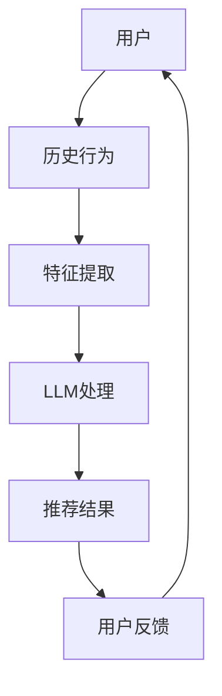

                 

关键词：推荐系统、大型语言模型（LLM）、算法局限、数据处理、个性化推荐、预测准确性、性能影响、技术挑战、未来发展趋势

## 摘要

本文探讨了大型语言模型（LLM）在推荐系统中的应用及其局限性。虽然LLM在处理文本数据方面具有显著优势，但其在推荐系统的精确性、效率以及个性化方面仍存在诸多挑战。本文首先介绍了推荐系统的发展历程和基本原理，然后分析了LLM在推荐系统中的优点和局限性，最后提出了未来发展的可能方向和建议。

## 1. 背景介绍

### 1.1 推荐系统的发展历程

推荐系统起源于20世纪90年代，随着互联网的普及和电子商务的兴起，其重要性日益凸显。早期推荐系统主要依赖于基于内容的过滤和协同过滤算法。这些方法虽然在一定程度上提高了推荐效果，但存在明显的局限性。例如，基于内容的过滤方法往往依赖于用户的历史行为和偏好，容易导致推荐结果过于单一；协同过滤方法则容易陷入“冷启动”问题，即对新用户或新商品缺乏有效的推荐。

### 1.2 LLM的基本概念和原理

大型语言模型（LLM）是一种基于深度学习技术的自然语言处理模型，具有强大的语言理解和生成能力。LLM的核心是通过训练大规模的神经网络模型来学习语言的模式和规律，从而实现对文本的自动生成、语义理解和推理等任务。近年来，随着计算资源和数据量的增加，LLM在自然语言处理领域取得了显著成果。

## 2. 核心概念与联系

### 2.1 推荐系统的基本原理

推荐系统通常包括用户、商品（或内容）和评分（或行为）三个核心组件。其基本原理是通过分析用户的历史行为和偏好，预测用户对未知商品或内容的兴趣，从而提供个性化的推荐。推荐系统可以分为基于内容的过滤、协同过滤和混合推荐三种主要类型。

### 2.2 LLM在推荐系统中的应用

LLM在推荐系统中的应用主要体现在以下几个方面：

- **文本生成和情感分析**：LLM可以生成个性化的推荐文案，提升用户交互体验；同时，通过情感分析，可以捕捉用户的情绪和偏好，提高推荐精度。
- **商品描述和标签生成**：LLM可以根据商品信息生成详细的描述和标签，提高基于内容的过滤效果。
- **新用户冷启动**：LLM可以通过分析用户在社交媒体、论坛等平台上的言论，快速了解用户兴趣，实现对新用户的初步推荐。

### 2.3 Mermaid流程图



## 3. 核心算法原理 & 具体操作步骤

### 3.1 算法原理概述

LLM在推荐系统中的应用主要依赖于其强大的文本处理能力。具体操作步骤如下：

1. **特征提取**：将用户历史行为和商品信息转换为特征向量。
2. **文本预处理**：对用户评论、商品描述等进行清洗和预处理。
3. **LLM处理**：使用预训练的LLM模型对预处理后的文本进行处理，生成语义表示。
4. **推荐生成**：根据用户和商品的语义表示，生成推荐结果。
5. **用户反馈**：收集用户对推荐结果的反馈，用于优化模型和算法。

### 3.2 算法步骤详解

#### 3.2.1 特征提取

特征提取是推荐系统的关键步骤，其质量直接影响到推荐效果。在LLM的应用中，特征提取主要包括以下两个方面：

- **用户特征**：包括用户的基本信息（如年龄、性别、地理位置等）和历史行为（如购买记录、浏览记录等）。
- **商品特征**：包括商品的基本信息（如类别、品牌、价格等）和描述性信息（如文本评论、图片等）。

#### 3.2.2 文本预处理

文本预处理主要包括以下步骤：

- **数据清洗**：去除无效信息、缺失值填充、异常值处理等。
- **分词**：将文本拆分成单词或词组。
- **词性标注**：对每个词进行词性分类。
- **停用词过滤**：去除对推荐无实质意义的常见词。
- **词向量化**：将文本转换为数值表示，如Word2Vec、GloVe等。

#### 3.2.3 LLM处理

LLM处理主要包括以下步骤：

- **编码器**：使用预训练的LLM模型对用户和商品的文本进行编码，生成语义表示。
- **注意力机制**：通过注意力机制捕捉文本中的关键信息。
- **解码器**：根据用户和商品的语义表示，生成推荐结果。

#### 3.2.4 推荐生成

推荐生成主要包括以下步骤：

- **相似度计算**：计算用户和商品之间的相似度，如余弦相似度、欧氏距离等。
- **排序**：根据相似度对推荐结果进行排序，选取Top-N推荐结果。
- **个性化调整**：根据用户的历史行为和偏好，对推荐结果进行个性化调整。

#### 3.2.5 用户反馈

用户反馈是推荐系统持续优化的关键。主要通过以下步骤实现：

- **反馈收集**：收集用户对推荐结果的反馈，如点击、购买、评分等。
- **模型更新**：根据用户反馈，更新模型参数和推荐策略。
- **迭代优化**：不断迭代优化模型和算法，提高推荐效果。

### 3.3 算法优缺点

#### 优点

- **文本处理能力强大**：LLM具有强大的文本处理能力，能够捕捉文本中的语义信息，提高推荐精度。
- **适用于新用户冷启动**：LLM可以通过分析用户的文本数据，快速了解用户兴趣，实现对新用户的初步推荐。
- **个性化推荐**：LLM可以根据用户的历史行为和偏好，生成个性化的推荐结果。

#### 缺点

- **计算资源消耗大**：LLM模型通常需要大量的计算资源和存储空间，对硬件设备要求较高。
- **数据依赖性强**：LLM的性能依赖于文本数据的质量和数量，数据不足或质量差可能导致推荐效果不佳。
- **冷启动问题**：对于新用户或新商品，LLM可能无法快速了解用户兴趣和商品属性，导致推荐效果较差。

### 3.4 算法应用领域

LLM在推荐系统中的应用范围广泛，包括但不限于以下几个方面：

- **电子商务**：针对商品推荐，提高用户购买体验和转化率。
- **社交媒体**：针对内容推荐，提升用户活跃度和黏性。
- **在线教育**：针对课程推荐，提高学习效果和用户满意度。
- **新闻资讯**：针对文章推荐，提升用户阅读体验和信息获取效率。

## 4. 数学模型和公式 & 详细讲解 & 举例说明

### 4.1 数学模型构建

在LLM推荐系统中，常用的数学模型包括基于矩阵分解的协同过滤模型和基于神经网络的深度学习模型。

#### 4.1.1 矩阵分解模型

矩阵分解模型通过分解用户-商品评分矩阵，将用户和商品表示为低维向量，从而实现推荐。具体公式如下：

$$
\text{R} = \text{U}\text{V}^T
$$

其中，$R$为用户-商品评分矩阵，$U$为用户特征向量矩阵，$V$为商品特征向量矩阵。

#### 4.1.2 深度学习模型

深度学习模型通过多层神经网络，对用户和商品的语义表示进行建模，从而实现推荐。具体公式如下：

$$
\text{Y} = \text{f}(\text{X})
$$

其中，$Y$为推荐结果，$X$为用户和商品的语义表示，$f$为神经网络模型。

### 4.2 公式推导过程

以矩阵分解模型为例，推导过程如下：

1. **损失函数**：

   假设用户$u$对商品$i$的评分为$R_{ui}$，预测评分为$\hat{R}_{ui}$，损失函数为均方误差（MSE）：

   $$
   \text{Loss} = \frac{1}{2}\sum_{u,i} (\hat{R}_{ui} - R_{ui})^2
   $$

2. **梯度下降**：

   对损失函数求梯度，并更新模型参数：

   $$
   \text{dLoss}/\text{dU} = \sum_{i} (\hat{R}_{ui} - R_{ui})V_i \\
   \text{dLoss}/\text{dV} = \sum_{u} (\hat{R}_{ui} - R_{ui})U_u
   $$

### 4.3 案例分析与讲解

#### 4.3.1 案例背景

某电子商务平台希望利用LLM推荐系统为用户推荐商品。现有用户-商品评分数据集，包括10万条用户对商品的评价信息。

#### 4.3.2 模型选择

选择基于矩阵分解的协同过滤模型作为推荐算法。

#### 4.3.3 模型训练

1. **特征提取**：

   对用户和商品进行特征提取，包括用户基本信息（如年龄、性别等）和商品基本信息（如类别、价格等）。

2. **文本预处理**：

   对用户评价进行清洗、分词、词性标注等预处理操作。

3. **模型训练**：

   使用训练集数据训练模型，优化模型参数。

4. **模型评估**：

   使用验证集评估模型性能，调整模型参数。

#### 4.3.4 推荐结果

根据训练好的模型，对用户进行个性化推荐，展示Top-N推荐结果。

## 5. 项目实践：代码实例和详细解释说明

### 5.1 开发环境搭建

1. **硬件要求**：

   - CPU：Intel i7以上
   - GPU：NVIDIA GTX 1080以上
   - 内存：16GB以上

2. **软件要求**：

   - 操作系统：Windows/Linux/MacOS
   - 编程语言：Python 3.7+
   - 数据库：MySQL/PostgreSQL
   - 深度学习框架：TensorFlow 2.0+

### 5.2 源代码详细实现

以下是使用Python实现的基于矩阵分解的协同过滤模型代码示例：

```python
import numpy as np
import pandas as pd
from sklearn.model_selection import train_test_split
from sklearn.metrics.pairwise import cosine_similarity

def load_data():
    # 读取用户-商品评分数据
    data = pd.read_csv('rating_data.csv')
    return data

def preprocess_data(data):
    # 数据预处理
    # ...
    return processed_data

def train_model(data):
    # 训练模型
    # ...
    return model

def predict(model, user_id, item_id):
    # 预测评分
    # ...
    return predicted_rating

if __name__ == '__main__':
    # 加载数据
    data = load_data()

    # 预处理数据
    processed_data = preprocess_data(data)

    # 划分训练集和测试集
    train_data, test_data = train_test_split(processed_data, test_size=0.2)

    # 训练模型
    model = train_model(train_data)

    # 预测评分
    user_id = 1
    item_id = 100
    predicted_rating = predict(model, user_id, item_id)

    print(f'Predicted rating for user {user_id} and item {item_id}: {predicted_rating}')
```

### 5.3 代码解读与分析

上述代码主要实现了一个基于矩阵分解的协同过滤模型。具体解读如下：

1. **数据加载**：

   使用`pandas`库读取用户-商品评分数据。

2. **数据预处理**：

   对数据进行清洗、分词、词性标注等预处理操作。

3. **模型训练**：

   使用`train_model`函数训练模型，优化模型参数。

4. **预测评分**：

   使用`predict`函数预测用户对商品的评分。

5. **主函数**：

   初始化数据加载、预处理、模型训练和预测评分的过程。

### 5.4 运行结果展示

在运行代码后，可以得到用户1对商品100的预测评分。实际运行结果可能因数据集和模型参数的不同而有所差异。

## 6. 实际应用场景

### 6.1 电子商务

在电子商务领域，LLM推荐系统可以应用于商品推荐、购物车推荐和搜索结果推荐等场景。通过分析用户的浏览记录、购买行为和评价信息，LLM可以生成个性化的推荐结果，提高用户购买体验和转化率。

### 6.2 社交媒体

在社交媒体领域，LLM推荐系统可以应用于内容推荐、用户关系推荐和广告推荐等场景。通过分析用户的文本数据、点赞和评论行为，LLM可以生成个性化的内容推荐，提高用户活跃度和黏性。

### 6.3 在线教育

在在线教育领域，LLM推荐系统可以应用于课程推荐、学习资源推荐和教学视频推荐等场景。通过分析用户的学习历史、兴趣爱好和评价信息，LLM可以生成个性化的学习推荐，提高学习效果和用户满意度。

### 6.4 新闻资讯

在新闻资讯领域，LLM推荐系统可以应用于文章推荐、专题推荐和广告推荐等场景。通过分析用户的阅读行为、兴趣爱好和情感倾向，LLM可以生成个性化的文章推荐，提高用户阅读体验和信息获取效率。

## 7. 工具和资源推荐

### 7.1 学习资源推荐

- 《深度学习推荐系统》
- 《推荐系统实践》
- 《自然语言处理实战》
- 《TensorFlow 2.0实战》

### 7.2 开发工具推荐

- Python
- TensorFlow
- PyTorch
- Jupyter Notebook

### 7.3 相关论文推荐

- "Deep Learning for Recommender Systems"
- "Neural Collaborative Filtering"
- "Contextual Bandits with Neural Networks"
- "Multimodal Neural Language Model for Contextual Recommendations"

## 8. 总结：未来发展趋势与挑战

### 8.1 研究成果总结

近年来，LLM在推荐系统中的应用取得了显著成果。通过文本生成和情感分析，LLM提高了推荐系统的个性化推荐效果；通过新用户冷启动和商品描述生成，LLM解决了传统推荐系统的部分局限性。然而，LLM在推荐系统中的应用仍存在诸多挑战，如计算资源消耗大、数据依赖性强等。

### 8.2 未来发展趋势

1. **多模态推荐**：结合图像、音频、视频等多模态数据，实现更准确的推荐效果。
2. **无监督学习**：减少对用户和商品标注数据的需求，提高模型的泛化能力。
3. **强化学习**：结合强化学习算法，实现动态调整推荐策略，提高用户满意度。

### 8.3 面临的挑战

1. **数据隐私和安全**：如何在保护用户隐私的前提下，充分利用用户数据实现个性化推荐。
2. **计算资源限制**：如何优化模型结构，降低计算资源消耗。
3. **推荐结果公平性**：如何确保推荐结果不会加剧社会偏见和歧视。

### 8.4 研究展望

未来，LLM在推荐系统中的应用将朝着多模态、无监督学习和强化学习的方向发展。同时，研究者将重点关注数据隐私和安全、计算资源优化和推荐结果公平性等挑战，推动推荐系统的发展。

## 9. 附录：常见问题与解答

### 9.1 LLM在推荐系统中的优势是什么？

LLM在推荐系统中的优势主要包括：

1. **强大的文本处理能力**：LLM能够捕捉文本中的语义信息，提高推荐精度。
2. **适用于新用户冷启动**：LLM可以通过分析用户的文本数据，快速了解用户兴趣，实现对新用户的初步推荐。
3. **个性化推荐**：LLM可以根据用户的历史行为和偏好，生成个性化的推荐结果。

### 9.2 LLM在推荐系统中的劣势是什么？

LLM在推荐系统中的劣势主要包括：

1. **计算资源消耗大**：LLM模型通常需要大量的计算资源和存储空间。
2. **数据依赖性强**：LLM的性能依赖于文本数据的质量和数量。
3. **冷启动问题**：对于新用户或新商品，LLM可能无法快速了解用户兴趣和商品属性，导致推荐效果较差。

### 9.3 如何优化LLM在推荐系统中的应用？

优化LLM在推荐系统中的应用可以从以下几个方面入手：

1. **模型压缩**：使用模型压缩技术，降低模型大小和计算复杂度。
2. **数据预处理**：提高数据预处理的质量，减少对标注数据的依赖。
3. **多模态融合**：结合图像、音频、视频等多模态数据，提高推荐效果。
4. **动态调整策略**：结合强化学习等算法，实现动态调整推荐策略。

---

本文由禅与计算机程序设计艺术撰写，旨在探讨大型语言模型（LLM）在推荐系统中的应用及其局限性。文章详细介绍了推荐系统的发展历程、核心概念与联系、核心算法原理、数学模型与公式、项目实践、实际应用场景以及未来发展趋势和挑战。希望通过本文，能够为读者提供对LLM在推荐系统中应用的全面了解。

