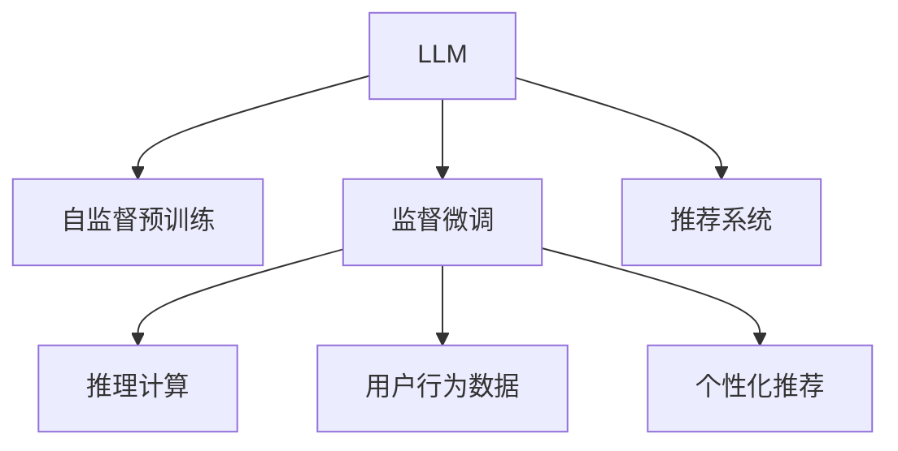

                 

# LLM在推荐系统的局限与成本：对算力需求的考量

> 关键词：大语言模型(LLM),推荐系统,算力需求,超大规模预训练,推理效率,资源优化

## 1. 背景介绍

### 1.1 问题由来
推荐系统在电子商务、媒体内容、社交网络等领域具有广泛的应用。其核心思想是通过对用户的历史行为、兴趣偏好等信息进行分析，推荐用户可能感兴趣的产品、内容或服务。传统的推荐系统主要依赖协同过滤、基于内容的推荐等方法，但这些方法存在数据稀疏性、冷启动等问题，难以应对大规模数据和复杂用户需求。近年来，基于深度学习的大语言模型(LLM)在推荐系统中的应用，逐渐成为新的研究热点。

大语言模型通过在海量无标签文本数据上进行自监督预训练，学习到丰富的语言表示。这些模型在文本生成、理解、分类、问答等任务上表现优异，被广泛应用于NLP领域。而将其应用到推荐系统中，有望实现对用户行为和意图的深层次理解，从而提供更加个性化、精准的推荐结果。

然而，基于LLM的推荐系统虽然理论上具有巨大潜力，但在实际应用中仍面临诸多挑战，尤其是算力需求高昂的问题。超大规模预训练和推理计算要求极高的硬件资源，如何高效利用这些资源，构建低成本、高效能的推荐系统，成为当前亟需解决的问题。本文将从算法原理、操作步骤、数学模型、应用场景等方面，系统介绍LLM在推荐系统的局限和成本考量，并提出一些优化建议。

### 1.2 问题核心关键点
目前，基于LLM的推荐系统主要面临以下几个关键问题：

- **算力需求高**：预训练和推理计算对GPU或TPU等高性能计算资源的需求巨大，如何优化算法和架构，降低算力成本，是一个重要的研究方向。
- **推理效率低**：超大规模LLM模型在推理阶段存在计算复杂度高、资源占用大的问题，如何提高推理效率，实现实时化推荐，是系统部署的关键挑战。
- **数据依赖性强**：推荐系统依赖于用户行为数据，如何高效利用标注数据，构建高效、鲁棒的模型，需要更加深入的研究。
- **模型鲁棒性不足**：LLM模型面对噪声数据、长尾数据等复杂场景，可能出现泛化性能下降的问题，如何提升模型的鲁棒性，是一个亟待解决的问题。
- **可解释性不足**：深度学习模型的"黑盒"特性，使得推荐系统的输出缺乏可解释性，如何赋予模型更强的解释能力，提高用户信任度，是实际应用中的一个重要考虑。

本文将围绕这些关键点，深入探讨LLM在推荐系统中的应用，分析其在算力、效率、数据、鲁棒性和可解释性等方面的局限与成本考量，并提供一些优化建议。

## 2. 核心概念与联系

### 2.1 核心概念概述

为了更好地理解基于LLM的推荐系统，本节将介绍几个密切相关的核心概念：

- **大语言模型(LLM)**：以自回归(如GPT)或自编码(如BERT)模型为代表的大规模预训练语言模型。通过在海量无标签文本数据上进行预训练，学习到通用的语言表示，具备强大的语言理解和生成能力。

- **推荐系统(Recommender System)**：通过分析用户历史行为、兴趣偏好等信息，推荐可能感兴趣的产品、内容或服务的系统。

- **深度学习(Deep Learning)**：一种基于神经网络的机器学习方法，通过多层次的非线性映射，实现对复杂数据的建模和预测。

- **自监督预训练(Self-Supervised Pretraining)**：指在大规模无标签数据上，通过构造自监督学习任务训练模型的过程。常见的自监督任务包括掩码语言建模、下一句预测等。

- **监督微调(Fine-Tuning)**：指在预训练模型的基础上，使用下游任务的少量标注数据，通过有监督学习优化模型在特定任务上的性能。

这些核心概念之间的逻辑关系可以通过以下Mermaid流程图来展示：



这个流程图展示了LLM、自监督预训练、监督微调、推荐系统之间的联系：

1. LLM通过自监督预训练获得基础能力。
2. 监督微调是在预训练模型的基础上，针对推荐任务进行优化，提升模型在特定任务上的性能。
3. 推荐系统利用微调后的模型进行个性化推荐。
4. 推理计算是推荐系统中不可或缺的环节，用于实时响应用户请求，进行推理预测。
5. 用户行为数据是推荐系统的数据来源，用于训练和更新模型。
6. 个性化推荐是推荐系统的核心功能，根据用户历史行为和兴趣生成推荐结果。

这些概念共同构成了基于LLM的推荐系统的理论基础和实现框架，使得LLM在推荐系统中的应用得以可能。

## 3. 核心算法原理 & 具体操作步骤
### 3.1 算法原理概述

基于LLM的推荐系统，本质上是一种深度学习的监督微调过程。其核心思想是：将预训练的LLM模型作为基础特征提取器，通过监督微调学习用户行为与推荐物品之间的映射关系，生成个性化推荐结果。

形式化地，假设预训练模型为 $M_{\theta}$，其中 $\theta$ 为预训练得到的模型参数。推荐系统的训练集为 $D=\{(x_i,y_i)\}_{i=1}^N$，其中 $x_i$ 为用户历史行为数据，$y_i$ 为用户可能感兴趣的物品。微调的目标是找到新的模型参数 $\hat{\theta}$，使得：

$$
\hat{\theta}=\mathop{\arg\min}_{\theta} \mathcal{L}(M_{\theta},D)
$$

其中 $\mathcal{L}$ 为推荐系统设计的损失函数，用于衡量模型预测输出与真实标签之间的差异。常见的损失函数包括交叉熵损失、均方误差损失等。

通过梯度下降等优化算法，微调过程不断更新模型参数 $\theta$，最小化损失函数 $\mathcal{L}$，使得模型输出逼近真实标签。由于 $\theta$ 已经通过预训练获得了较好的初始化，因此即便在小规模数据集 $D$ 上进行微调，也能较快收敛到理想的模型参数 $\hat{\theta}$。

### 3.2 算法步骤详解

基于LLM的推荐系统一般包括以下几个关键步骤：

**Step 1: 准备预训练模型和数据集**
- 选择合适的预训练语言模型 $M_{\theta}$ 作为初始化参数，如 BERT、GPT等。
- 准备推荐系统任务的标注数据集 $D$，划分为训练集、验证集和测试集。一般要求标注数据与预训练数据的分布不要差异过大。

**Step 2: 添加任务适配层**
- 根据推荐任务类型，在预训练模型顶层设计合适的输出层和损失函数。
- 对于推荐任务，通常在顶层添加全连接层或注意力机制，并使用负对数似然作为损失函数。
- 对于多类推荐任务，还可以使用交叉熵损失。

**Step 3: 设置微调超参数**
- 选择合适的优化算法及其参数，如 AdamW、SGD 等，设置学习率、批大小、迭代轮数等。
- 设置正则化技术及强度，包括权重衰减、Dropout、Early Stopping等。
- 确定冻结预训练参数的策略，如仅微调顶层，或全部参数都参与微调。

**Step 4: 执行梯度训练**
- 将训练集数据分批次输入模型，前向传播计算损失函数。
- 反向传播计算参数梯度，根据设定的优化算法和学习率更新模型参数。
- 周期性在验证集上评估模型性能，根据性能指标决定是否触发 Early Stopping。
- 重复上述步骤直到满足预设的迭代轮数或 Early Stopping 条件。

**Step 5: 测试和部署**
- 在测试集上评估微调后模型 $M_{\hat{\theta}}$ 的性能，对比微调前后的精度提升。
- 使用微调后的模型对新用户进行推荐，集成到实际的应用系统中。
- 持续收集新的用户行为数据，定期重新微调模型，以适应数据分布的变化。

以上是基于监督微调LLM进行推荐系统开发的完整流程。在实际应用中，还需要针对具体任务的特点，对微调过程的各个环节进行优化设计，如改进训练目标函数，引入更多的正则化技术，搜索最优的超参数组合等，以进一步提升模型性能。

### 3.3 算法优缺点

基于监督微调LLM的推荐系统，具有以下优点：

1. 快速高效。通过预训练模型进行微调，能够快速适应特定任务，提升推荐效果。
2. 模型效果好。微调后的LLM模型能够充分学习用户行为数据，生成更加精准的推荐结果。
3. 适应性强。LLM模型具有较强的泛化能力，能够较好地适应不同领域和不同规模的推荐任务。
4. 任务适应广。LLM模型可以应用于多种推荐任务，如商品推荐、内容推荐、用户推荐等，灵活性高。

同时，该方法也存在一些局限性：

1. 依赖标注数据。推荐系统的效果很大程度上取决于标注数据的质量和数量，获取高质量标注数据的成本较高。
2. 模型复杂度高。超大规模LLM模型的计算复杂度较高，硬件资源需求大。
3. 过拟合风险大。预训练模型的复杂结构容易在少样本情况下发生过拟合，影响泛化性能。
4. 可解释性不足。深度学习模型的"黑盒"特性，使得推荐系统的输出缺乏可解释性，难以满足用户信任需求。

尽管存在这些局限，但就目前而言，基于监督微调的推荐系统仍是一种高效、可靠的方法，得到了广泛的应用。未来相关研究的重点在于如何进一步降低推荐系统对标注数据的依赖，提高模型的少样本学习和跨领域迁移能力，同时兼顾可解释性和伦理安全性等因素。

### 3.4 算法应用领域

基于LLM的推荐系统在电商、社交、媒体等多个领域已经得到了广泛的应用，具体包括：

1. **电商推荐**：根据用户浏览、点击、购买行为，推荐商品和优惠信息。
2. **内容推荐**：根据用户阅读、观看、收藏行为，推荐新闻、文章、视频等内容。
3. **社交推荐**：根据用户好友关系、互动行为，推荐可能感兴趣的朋友或社区。
4. **个性化推荐引擎**：结合多种数据源，提供定制化推荐服务。

除了上述这些经典应用外，LLM在推荐系统中的应用也在不断拓展，如实时推荐、个性化广告投放、智能客服等，为电商、社交、媒体等行业带来了新的发展机遇。

## 4. 数学模型和公式 & 详细讲解

### 4.1 数学模型构建

本节将使用数学语言对基于LLM的推荐系统进行更加严格的刻画。

记预训练语言模型为 $M_{\theta}$，其中 $\theta$ 为模型参数。假设推荐系统的训练集为 $D=\{(x_i,y_i)\}_{i=1}^N$，其中 $x_i$ 为用户历史行为数据，$y_i$ 为用户可能感兴趣的物品。微调的目标是最小化经验风险，即找到最优参数：

$$
\theta^* = \mathop{\arg\min}_{\theta} \mathcal{L}(M_{\theta},D)
$$

其中 $\mathcal{L}$ 为推荐系统设计的损失函数，用于衡量模型预测输出与真实标签之间的差异。常见的损失函数包括交叉熵损失、均方误差损失等。

对于推荐系统，我们通常采用负对数似然损失函数，即：

$$
\ell(M_{\theta}(x),y) = -\log M_{\theta}(y|x)
$$

将其代入经验风险公式，得：

$$
\mathcal{L}(\theta) = -\frac{1}{N}\sum_{i=1}^N \ell(M_{\theta}(x_i),y_i)
$$

在得到损失函数的梯度后，即可带入参数更新公式，完成模型的迭代优化。重复上述过程直至收敛，最终得到适应推荐任务的最优模型参数 $\theta^*$。

### 4.2 公式推导过程

以下我们以推荐任务为例，推导负对数似然损失函数及其梯度的计算公式。

假设模型 $M_{\theta}$ 在输入 $x$ 上的输出为 $\hat{y}=M_{\theta}(x)$，表示用户可能感兴趣的物品。真实标签 $y \in \{1,0\}$。则负对数似然损失函数定义为：

$$
\ell(M_{\theta}(x),y) = -y\log M_{\theta}(1|x) - (1-y)\log M_{\theta}(0|x)
$$

将其代入经验风险公式，得：

$$
\mathcal{L}(\theta) = -\frac{1}{N}\sum_{i=1}^N [y_i\log M_{\theta}(1|x_i)+(1-y_i)\log(1-M_{\theta}(0|x_i))]
$$

根据链式法则，损失函数对参数 $\theta_k$ 的梯度为：

$$
\frac{\partial \mathcal{L}(\theta)}{\partial \theta_k} = -\frac{1}{N}\sum_{i=1}^N \frac{y_i}{M_{\theta}(1|x_i)} - \frac{1-y_i}{1-M_{\theta}(0|x_i)} \frac{\partial M_{\theta}(0|x_i)}{\partial \theta_k}
$$

其中 $\frac{\partial M_{\theta}(0|x_i)}{\partial \theta_k}$ 可进一步递归展开，利用自动微分技术完成计算。

在得到损失函数的梯度后，即可带入参数更新公式，完成模型的迭代优化。重复上述过程直至收敛，最终得到适应推荐任务的最优模型参数 $\theta^*$。

## 5. 项目实践：代码实例和详细解释说明
### 5.1 开发环境搭建

在进行推荐系统开发前，我们需要准备好开发环境。以下是使用Python进行TensorFlow开发的环境配置流程：

1. 安装Anaconda：从官网下载并安装Anaconda，用于创建独立的Python环境。

2. 创建并激活虚拟环境：
```bash
conda create -n tf-env python=3.8 
conda activate tf-env
```

3. 安装TensorFlow：根据CUDA版本，从官网获取对应的安装命令。例如：
```bash
conda install tensorflow -c tensorflow -c conda-forge
```

4. 安装各类工具包：
```bash
pip install numpy pandas scikit-learn matplotlib tqdm jupyter notebook ipython
```

完成上述步骤后，即可在`tf-env`环境中开始推荐系统开发。

### 5.2 源代码详细实现

下面我们以电商推荐任务为例，给出使用TensorFlow对BERT模型进行推荐系统微调的代码实现。

首先，定义推荐任务的数据处理函数：

```python
from transformers import BertTokenizer
from tensorflow.keras.preprocessing.text import Tokenizer
from tensorflow.keras.preprocessing.sequence import pad_sequences
import tensorflow as tf

class RecommendationDataset(tf.data.Dataset):
    def __init__(self, texts, labels, tokenizer, max_len=128):
        self.texts = texts
        self.labels = labels
        self.tokenizer = tokenizer
        self.max_len = max_len
        
    def __len__(self):
        return len(self.texts)
    
    def __getitem__(self, item):
        text = self.texts[item]
        label = self.labels[item]
        
        encoding = self.tokenizer(text, return_tensors='tf', max_length=self.max_len, padding='max_length', truncation=True)
        input_ids = encoding['input_ids']
        attention_mask = encoding['attention_mask']
        
        # 对token-wise的标签进行编码
        encoded_labels = [label2id[label] for label in self.labels] 
        encoded_labels.extend([label2id['O']] * (self.max_len - len(encoded_labels)))
        labels = tf.convert_to_tensor(encoded_labels, dtype=tf.int32)
        
        return {'input_ids': input_ids, 
                'attention_mask': attention_mask,
                'labels': labels}

# 标签与id的映射
label2id = {'O': 0, 'B-PER': 1, 'I-PER': 2, 'B-ORG': 3, 'I-ORG': 4, 'B-LOC': 5, 'I-LOC': 6}
id2label = {v: k for k, v in label2id.items()}

# 创建dataset
tokenizer = BertTokenizer.from_pretrained('bert-base-cased')

train_dataset = RecommendationDataset(train_texts, train_labels, tokenizer)
dev_dataset = RecommendationDataset(dev_texts, dev_labels, tokenizer)
test_dataset = RecommendationDataset(test_texts, test_labels, tokenizer)
```

然后，定义模型和优化器：

```python
from transformers import BertForTokenClassification, AdamW

model = BertForTokenClassification.from_pretrained('bert-base-cased', num_labels=len(label2id))

optimizer = AdamW(model.parameters(), lr=2e-5)
```

接着，定义训练和评估函数：

```python
from tensorflow.keras.optimizers.schedules import LearningRateScheduler
from sklearn.metrics import classification_report

def train_epoch(model, dataset, batch_size, optimizer, learning_rate):
    dataloader = dataset.batch(batch_size)
    model.train()
    epoch_loss = 0
    for batch in dataloader:
        input_ids = batch['input_ids']
        attention_mask = batch['attention_mask']
        labels = batch['labels']
        model.zero_grad()
        with tf.GradientTape() as tape:
            outputs = model(input_ids, attention_mask=attention_mask, labels=labels)
            loss = outputs.loss
        epoch_loss += loss
        grads = tape.gradient(loss, model.trainable_variables)
        optimizer.apply_gradients(zip(grads, model.trainable_variables))
    
    return epoch_loss / len(dataloader)

def evaluate(model, dataset, batch_size):
    dataloader = dataset.batch(batch_size)
    model.eval()
    preds, labels = [], []
    with tf.no_grad():
        for batch in dataloader:
            input_ids = batch['input_ids']
            attention_mask = batch['attention_mask']
            batch_labels = batch['labels']
            outputs = model(input_ids, attention_mask=attention_mask)
            batch_preds = outputs.logits.argmax(dim=2).numpy().tolist()
            batch_labels = batch_labels.numpy().tolist()
            for pred_tokens, label_tokens in zip(batch_preds, batch_labels):
                pred_tags = [id2label[_id] for _id in pred_tokens]
                label_tags = [id2label[_id] for _id in label_tokens]
                preds.append(pred_tags[:len(label_tags)])
                labels.append(label_tags)
                
    print(classification_report(labels, preds))
```

最后，启动训练流程并在测试集上评估：

```python
epochs = 5
batch_size = 16
learning_rate = tf.keras.optimizers.schedules.ExponentialDecay(2e-5, decay_steps=1000, decay_rate=0.95)

for epoch in range(epochs):
    loss = train_epoch(model, train_dataset, batch_size, optimizer, learning_rate)
    print(f"Epoch {epoch+1}, train loss: {loss:.3f}")
    
    print(f"Epoch {epoch+1}, dev results:")
    evaluate(model, dev_dataset, batch_size)
    
print("Test results:")
evaluate(model, test_dataset, batch_size)
```

以上就是使用TensorFlow对BERT进行电商推荐任务微调的完整代码实现。可以看到，得益于TensorFlow的强大封装，我们可以用相对简洁的代码完成BERT模型的加载和微调。

### 5.3 代码解读与分析

让我们再详细解读一下关键代码的实现细节：

**RecommendationDataset类**：
- `__init__`方法：初始化文本、标签、分词器等关键组件。
- `__len__`方法：返回数据集的样本数量。
- `__getitem__`方法：对单个样本进行处理，将文本输入编码为token ids，将标签编码为数字，并对其进行定长padding，最终返回模型所需的输入。

**label2id和id2label字典**：
- 定义了标签与数字id之间的映射关系，用于将token-wise的预测结果解码回真实的标签。

**训练和评估函数**：
- 使用TensorFlow的DataLoader对数据集进行批次化加载，供模型训练和推理使用。
- 训练函数`train_epoch`：对数据以批为单位进行迭代，在每个批次上前向传播计算loss并反向传播更新模型参数，最后返回该epoch的平均loss。
- 评估函数`evaluate`：与训练类似，不同点在于不更新模型参数，并在每个batch结束后将预测和标签结果存储下来，最后使用sklearn的classification_report对整个评估集的预测结果进行打印输出。

**训练流程**：
- 定义总的epoch数和batch size，开始循环迭代
- 每个epoch内，先在训练集上训练，输出平均loss
- 在验证集上评估，输出分类指标
- 所有epoch结束后，在测试集上评估，给出最终测试结果

可以看到，TensorFlow配合BERT模型的代码实现变得简洁高效。开发者可以将更多精力放在数据处理、模型改进等高层逻辑上，而不必过多关注底层的实现细节。

当然，工业级的系统实现还需考虑更多因素，如模型的保存和部署、超参数的自动搜索、更灵活的任务适配层等。但核心的微调范式基本与此类似。

## 6. 实际应用场景
### 6.1 电商推荐

基于LLM的电商推荐系统，可以帮助电商企业精准定位用户需求，提升个性化推荐效果，增加用户粘性和购买转化率。

具体而言，可以收集用户浏览、点击、购买历史数据，将商品名称、描述、标签等文本内容作为输入，用用户行为标签作为监督信号，在此基础上对预训练语言模型进行微调。微调后的模型能够理解用户需求，生成推荐商品列表，同时还能结合商品属性和评分等数据，提供更全面的推荐信息。

### 6.2 内容推荐

内容推荐系统在视频、音乐、新闻等领域有着广泛的应用。基于LLM的内容推荐系统能够自动理解用户兴趣，生成个性化的推荐内容，提高用户满意度和平台活跃度。

通过收集用户的观看、点赞、评论数据，将视频标题、描述、标签等文本内容作为输入，用观看次数、点赞数等行为标签作为监督信号，对预训练语言模型进行微调。微调后的模型能够理解视频风格、主题等特征，生成与用户兴趣匹配的推荐视频，同时还能推荐相关主题、作者等额外信息，提升用户体验。

### 6.3 社交推荐

社交推荐系统在社交网络、交友平台等领域有着广泛的应用。基于LLM的社交推荐系统能够自动理解用户社交行为，推荐可能感兴趣的朋友或社区，增强用户粘性和社区互动性。

通过收集用户的点赞、评论、好友关系等社交数据，将社交内容文本作为输入，用好友关系标签作为监督信号，对预训练语言模型进行微调。微调后的模型能够理解用户社交兴趣，推荐符合用户偏好的好友或社区，同时还能推荐相关话题、文章等额外信息，增强用户互动。

### 6.4 未来应用展望

随着LLM和微调方法的不断发展，基于微调的推荐系统将不断拓展应用场景，为更多领域带来变革性影响。

在智慧医疗领域，基于微调的推荐系统可以帮助医生推荐最合适的诊疗方案，加速医疗决策过程，提高诊疗质量。

在智能教育领域，微调技术可以应用于个性化学习推荐，根据学生的学习行为和偏好，推荐适合的课程和学习资料，提升学习效果。

在智慧城市治理中，微调模型可应用于城市事件推荐、舆情分析、应急指挥等环节，提高城市管理的自动化和智能化水平，构建更安全、高效的未来城市。

此外，在企业生产、社会治理、文娱传媒等众多领域，基于LLM的推荐系统也将不断涌现，为经济社会发展注入新的动力。相信随着技术的日益成熟，微调方法将成为推荐系统的重要范式，推动推荐技术向更广阔的领域加速渗透。

## 7. 工具和资源推荐
### 7.1 学习资源推荐

为了帮助开发者系统掌握基于LLM的推荐系统理论基础和实践技巧，这里推荐一些优质的学习资源：

1. 《深度学习与推荐系统》书籍：介绍深度学习在推荐系统中的应用，涵盖基础理论与实际案例。
2. CS234《深度学习中的推荐系统》课程：斯坦福大学开设的推荐系统课程，涵盖推荐系统原理、算法、评估等重要内容。
3. TensorFlow官方文档：TensorFlow的官方文档，提供了丰富的推荐系统相关资源，包括教程、样例和API文档。
4. PyTorch官方文档：PyTorch的官方文档，提供了许多预训练模型和推荐系统相关资源，是进行推荐系统开发的强大工具。
5. HuggingFace官方文档：HuggingFace的官方文档，提供了丰富的预训练模型和推荐系统相关资源，是进行推荐系统开发的强大工具。

通过对这些资源的学习实践，相信你一定能够快速掌握基于LLM的推荐系统的精髓，并用于解决实际的推荐问题。
### 7.2 开发工具推荐

高效的开发离不开优秀的工具支持。以下是几款用于LLM推荐系统开发的常用工具：

1. TensorFlow：基于Python的开源深度学习框架，支持分布式计算，适合大规模工程应用。
2. PyTorch：基于Python的开源深度学习框架，灵活动态的计算图，适合快速迭代研究。
3. HuggingFace库：提供多种预训练语言模型和推荐系统相关工具，方便开发者进行模型训练和推理。
4. Weights & Biases：模型训练的实验跟踪工具，可以记录和可视化模型训练过程中的各项指标，方便对比和调优。
5. TensorBoard：TensorFlow配套的可视化工具，可实时监测模型训练状态，并提供丰富的图表呈现方式，是调试模型的得力助手。
6. Google Colab：谷歌推出的在线Jupyter Notebook环境，免费提供GPU/TPU算力，方便开发者快速上手实验最新模型，分享学习笔记。

合理利用这些工具，可以显著提升LLM推荐系统的开发效率，加快创新迭代的步伐。

### 7.3 相关论文推荐

大语言模型和推荐系统的发展源于学界的持续研究。以下是几篇奠基性的相关论文，推荐阅读：

1. Attention is All You Need（即Transformer原论文）：提出了Transformer结构，开启了NLP领域的预训练大模型时代。
2. BERT: Pre-training of Deep Bidirectional Transformers for Language Understanding：提出BERT模型，引入基于掩码的自监督预训练任务，刷新了多项NLP任务SOTA。
3. Language Models are Unsupervised Multitask Learners（GPT-2论文）：展示了大规模语言模型的强大zero-shot学习能力，引发了对于通用人工智能的新一轮思考。
4. Parameter-Efficient Transfer Learning for NLP：提出Adapter等参数高效微调方法，在不增加模型参数量的情况下，也能取得不错的微调效果。
5. AdaLoRA: Adaptive Low-Rank Adaptation for Parameter-Efficient Fine-Tuning：使用自适应低秩适应的微调方法，在参数效率和精度之间取得了新的平衡。
6. Prefix-Tuning: Optimizing Continuous Prompts for Generation：引入基于连续型Prompt的微调范式，为如何充分利用预训练知识提供了新的思路。

这些论文代表了大语言模型推荐系统的发展脉络。通过学习这些前沿成果，可以帮助研究者把握学科前进方向，激发更多的创新灵感。

## 8. 总结：未来发展趋势与挑战
### 8.1 总结

本文对基于LLM的推荐系统进行了全面系统的介绍。首先阐述了LLM和推荐系统的发展背景和意义，明确了微调在拓展预训练模型应用、提升推荐效果方面的独特价值。其次，从原理到实践，详细讲解了监督微调的数学原理和关键步骤，给出了推荐系统开发的完整代码实例。同时，本文还广泛探讨了LLM在电商、社交、内容等多个领域的应用前景，展示了微调范式的巨大潜力。此外，本文精选了推荐系统的各类学习资源，力求为读者提供全方位的技术指引。

通过本文的系统梳理，可以看到，基于LLM的推荐系统正在成为推荐系统的重要范式，极大地拓展了预训练语言模型的应用边界，催生了更多的落地场景。受益于大规模语料的预训练，微调推荐系统能够更好地理解用户需求，生成个性化推荐结果，提升推荐效果。未来，伴随预训练语言模型和微调方法的不断演进，推荐系统必将进一步提升用户满意度，拓展应用范围，带来更多的商业价值和社会效益。

### 8.2 未来发展趋势

展望未来，基于LLM的推荐系统将呈现以下几个发展趋势：

1. 模型规模持续增大。随着算力成本的下降和数据规模的扩张，预训练语言模型的参数量还将持续增长。超大规模语言模型蕴含的丰富语言知识，有望支撑更加复杂多变的推荐任务。
2. 推荐算法多样化。除了传统的监督微调外，未来会涌现更多推荐算法，如协同过滤、基于内容的推荐、深度学习推荐等，为推荐系统带来更多的算法选择。
3. 少样本学习成为热点。随着用户数据多样性的增加，少样本推荐方法将受到更多关注，如何在大规模数据上实现高效推荐，是一个重要的研究方向。
4. 跨模态推荐兴起。未来的推荐系统将更多地融合视觉、听觉等多模态信息，构建更全面的用户画像，实现更精准的推荐。
5. 推荐系统智能化。结合知识图谱、因果推理等技术，推荐系统将具备更强的智能理解和推荐能力，实现更精准、更智能的推荐结果。
6. 推荐系统个性化。个性化推荐系统将成为未来发展的核心方向，如何构建高效的个性化推荐模型，实现用户行为数据的精准分析，是一个重要的研究课题。

以上趋势凸显了基于LLM的推荐系统的广阔前景。这些方向的探索发展，必将进一步提升推荐系统的性能和应用范围，为经济社会发展注入新的动力。

### 8.3 面临的挑战

尽管基于LLM的推荐系统已经取得了瞩目成就，但在迈向更加智能化、普适化应用的过程中，它仍面临诸多挑战：

1. 标注成本高昂。虽然微调可以降低对标注数据的依赖，但对于长尾应用场景，难以获得充足的高质量标注数据，成为制约微调性能的瓶颈。如何进一步降低推荐系统对标注样本的依赖，将是一大难题。
2. 模型复杂度高。超大规模LLM模型的计算复杂度较高，硬件资源需求大。如何优化算法和架构，降低算力成本，是一个重要的研究方向。
3. 模型鲁棒性不足。预训练模型的复杂结构容易在少样本情况下发生过拟合，影响泛化性能。如何提升模型的鲁棒性，是一个亟待解决的问题。
4. 可解释性不足。深度学习模型的"黑盒"特性，使得推荐系统的输出缺乏可解释性，难以满足用户信任需求。如何赋予模型更强的解释能力，提高用户信任度，是实际应用中的一个重要考虑。
5. 安全性问题突出。预训练语言模型可能学习到有害信息，通过微调传递到推荐系统中，产生误导性、歧视性的输出，给实际应用带来安全隐患。如何从数据和算法层面消除模型偏见，避免恶意用途，确保输出的安全性，也将是重要的研究课题。

尽管存在这些挑战，但通过不断优化算法和架构，提升模型鲁棒性和可解释性，减少对标注数据的依赖，以及构建安全可靠的系统，可以逐步克服这些问题，推动基于LLM的推荐系统向更广阔的应用领域发展。

### 8.4 研究展望

面对LLM推荐系统所面临的诸多挑战，未来的研究需要在以下几个方面寻求新的突破：

1. 探索无监督和半监督推荐方法。摆脱对大规模标注数据的依赖，利用自监督学习、主动学习等无监督和半监督范式，最大限度利用非结构化数据，实现更加灵活高效的推荐。
2. 研究参数高效和计算高效的推荐算法。开发更加参数高效的推荐方法，在固定大部分预训练参数的同时，只更新极少量的任务相关参数。同时优化推荐算法的计算图，减少前向传播和反向传播的资源消耗，实现更加轻量级、实时性的部署。
3. 融合因果和对比学习范式。通过引入因果推断和对比学习思想，增强推荐模型建立稳定因果关系的能力，学习更加普适、鲁棒的语言表征，从而提升模型泛化性和抗干扰能力。
4. 引入更多先验知识。将符号化的先验知识，如知识图谱、逻辑规则等，与神经网络模型进行巧妙融合，引导推荐过程学习更准确、合理的语言模型。同时加强不同模态数据的整合，实现视觉、听觉等多模态信息与文本信息的协同建模。
5. 结合因果分析和博弈论工具。将因果分析方法引入推荐模型，识别出推荐系统决策的关键特征，增强输出解释的因果性和逻辑性。借助博弈论工具刻画人机交互过程，主动探索并规避推荐系统的脆弱点，提高系统稳定性。
6. 纳入伦理道德约束。在推荐系统训练目标中引入伦理导向的评估指标，过滤和惩罚有偏见、有害的输出倾向。同时加强人工干预和审核，建立推荐系统的监管机制，确保输出符合人类价值观和伦理道德。

这些研究方向的探索，必将引领基于LLM的推荐系统向更高的台阶，为构建安全、可靠、可解释、可控的智能推荐系统铺平道路。面向未来，大语言模型推荐系统还需要与其他人工智能技术进行更深入的融合，如知识表示、因果推理、强化学习等，多路径协同发力，共同推动推荐技术的发展。只有勇于创新、敢于突破，才能不断拓展推荐系统的边界，让智能推荐系统更好地造福人类社会。

## 9. 附录：常见问题与解答

**Q1：推荐系统依赖标注数据吗？**

A: 推荐系统的效果很大程度上取决于标注数据的质量和数量，获取高质量标注数据的成本较高。因此，基于监督微调的推荐系统对标注数据的需求较大，但可通过多模态数据融合、无监督学习等技术降低对标注数据的依赖。

**Q2：推荐系统如何处理长尾数据？**

A: 长尾数据是推荐系统中常见的挑战。推荐系统可以采用多任务学习、生成对抗网络等方法，结合无标签数据进行处理。同时，引入用户行为数据的多样性，如历史行为、兴趣标签、社交关系等，增加推荐结果的多样性，提高对长尾数据的处理能力。

**Q3：推荐系统如何降低过拟合风险？**

A: 推荐系统可以采用正则化技术、数据增强、对抗训练等方法，降低过拟合风险。正则化技术包括L2正则、Dropout等，可以防止模型过度适应训练数据。数据增强可以通过生成对抗网络、标签平滑等技术，扩充训练集的多样性。对抗训练可以引入对抗样本，提高模型鲁棒性。

**Q4：推荐系统如何提升模型解释性？**

A: 推荐系统可以采用可解释性技术，如特征重要性分析、局部可解释模型等，提升模型的解释能力。同时，结合符号化的先验知识，如知识图谱、逻辑规则等，与神经网络模型进行融合，增强推荐系统的可解释性。

**Q5：推荐系统如何应对恶意攻击？**

A: 推荐系统可以采用数据清洗、安全认证等技术，防范恶意攻击。数据清洗可以过滤掉恶意数据和噪声数据，保证推荐系统输入的纯净性。安全认证可以通过用户授权、行为监控等手段，确保推荐系统的安全性。

通过本文的系统梳理，可以看到，基于LLM的推荐系统正在成为推荐系统的重要范式，极大地拓展了预训练语言模型的应用边界，催生了更多的落地场景。尽管面临诸多挑战，但通过不断优化算法和架构，提升模型鲁棒性和可解释性，减少对标注数据的依赖，以及构建安全可靠的系统，可以逐步克服这些问题，推动基于LLM的推荐系统向更广阔的应用领域发展。

---

作者：禅与计算机程序设计艺术 / Zen and the Art of Computer Programming

