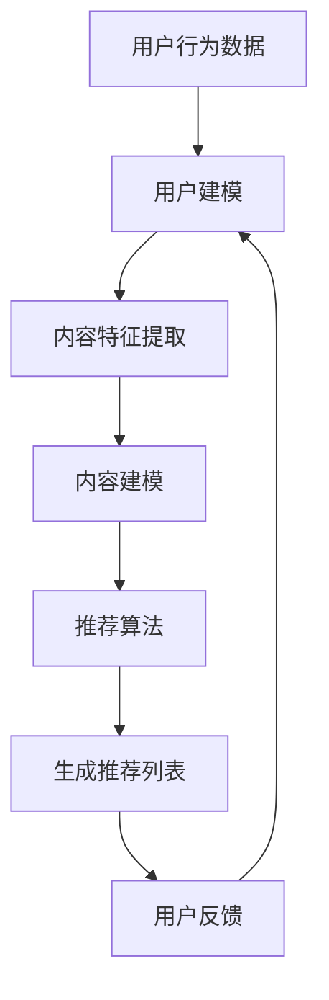

                 

关键词：LLM，推荐系统，工程，成本，局限，优化，算法，模型

> 摘要：本文将深入探讨大型语言模型（LLM）在推荐系统中的应用局限，以及这些局限对于工程与成本的影响。通过分析LLM的算法原理、数学模型、项目实践及实际应用场景，本文旨在为读者提供对LLM在推荐系统中局限性的一幅全景图，并提出优化方案和未来展望。

## 1. 背景介绍

### 推荐系统概述

推荐系统是一种根据用户的兴趣、历史行为和外部信息向用户推荐相关内容的技术。它在电子商务、社交媒体、新闻平台、视频流媒体等多个领域得到了广泛应用。推荐系统的核心目标是提高用户体验、提升用户粘性和增加平台收入。

### LLM简介

近年来，随着深度学习特别是Transformer架构的快速发展，大型语言模型（LLM）如GPT、BERT等在自然语言处理（NLP）领域取得了显著的成果。LLM具备强大的文本生成、理解和建模能力，能够处理复杂的语言现象，从而在文本推荐、内容生成等领域表现出色。

## 2. 核心概念与联系

### 推荐系统架构

推荐系统的架构通常包括用户建模、内容建模和推荐算法三个核心模块。用户建模涉及用户兴趣、行为和历史数据的分析；内容建模则是对推荐内容的相关特征进行提取和表示；推荐算法根据用户和内容的特征生成推荐列表。

### LLM与推荐系统的结合

LLM在推荐系统中可以应用于文本生成、文本分类、语义理解等多个环节。具体而言，LLM可以用于：

- 文本生成：根据用户历史行为生成个性化推荐文案。
- 文本分类：识别用户标签和偏好，实现内容分类和个性化推荐。
- 语义理解：理解用户查询意图，提升推荐效果。

### Mermaid 流程图



## 3. 核心算法原理 & 具体操作步骤

### 3.1 算法原理概述

LLM在推荐系统中的核心算法原理主要基于以下几方面：

- 用户兴趣建模：通过分析用户历史行为、兴趣标签、搜索关键词等信息，构建用户兴趣图谱。
- 内容特征提取：对推荐内容进行特征提取，如标题、标签、摘要等。
- 推荐算法：利用深度学习模型对用户兴趣和内容特征进行匹配，生成推荐列表。

### 3.2 算法步骤详解

#### 3.2.1 用户兴趣建模

1. 收集用户行为数据：包括用户浏览、点击、搜索、收藏等行为。
2. 数据预处理：对行为数据进行清洗、去重和特征工程。
3. 构建用户兴趣图谱：利用图算法将用户行为数据转化为兴趣节点和边。

#### 3.2.2 内容特征提取

1. 数据预处理：对文本内容进行清洗、去停用词、词向量化等操作。
2. 特征提取：使用词嵌入技术（如Word2Vec、BERT等）提取文本特征。

#### 3.2.3 推荐算法

1. 用户兴趣表示：将用户兴趣图谱转化为向量表示。
2. 内容特征表示：将文本特征转化为向量表示。
3. 推荐算法实现：使用深度学习模型（如GRU、Transformer等）进行用户兴趣和内容特征的匹配，生成推荐列表。

### 3.3 算法优缺点

#### 优缺点

- 优点：LLM在处理复杂文本数据和语义理解方面具备显著优势，能够提高推荐系统的效果和用户体验。
- 缺点：LLM模型复杂度高，训练成本高，对计算资源要求较高；同时，模型解释性较差，难以进行调试和优化。

### 3.4 算法应用领域

LLM在推荐系统中的应用领域包括：

- 文本生成推荐：如个性化文章、新闻、产品描述等。
- 内容分类推荐：如社交媒体、电子商务平台等。
- 搜索引擎优化：如自动生成搜索建议、回答用户查询等。

## 4. 数学模型和公式 & 详细讲解 & 举例说明

### 4.1 数学模型构建

在推荐系统中，我们可以构建以下数学模型：

- 用户兴趣表示：\(u = f(u\_data)\)
- 内容特征表示：\(c = g(c\_data)\)
- 推荐列表生成：\(r = h(u, c)\)

### 4.2 公式推导过程

#### 用户兴趣表示

假设用户行为数据为\(u\_data\)，我们使用神经网络\(f\)进行用户兴趣表示，即：

\[u = f(u\_data) = \sum_{i=1}^{n} w_i \cdot v_i\]

其中，\(v_i\)为用户兴趣词的向量表示，\(w_i\)为对应的权重。

#### 内容特征表示

假设内容特征数据为\(c\_data\)，我们使用词嵌入技术进行内容特征表示，即：

\[c = g(c\_data) = \sum_{j=1}^{m} w_j \cdot v_j\]

其中，\(v_j\)为内容词的向量表示，\(w_j\)为对应的权重。

#### 推荐列表生成

假设用户兴趣表示为\(u\)，内容特征表示为\(c\)，我们使用神经网络\(h\)进行推荐列表生成，即：

\[r = h(u, c) = \sum_{k=1}^{p} s_k \cdot v_k\]

其中，\(v_k\)为推荐内容的向量表示，\(s_k\)为对应的权重。

### 4.3 案例分析与讲解

#### 案例一：基于GPT的文本生成推荐

假设用户历史行为数据为“喜欢阅读科幻小说”，内容数据为“最新科幻小说推荐”，我们可以使用GPT模型生成个性化推荐文案：

- 用户兴趣表示：\(u = \text{GPT}(\text{用户历史行为数据})\)
- 内容特征表示：\(c = \text{BERT}(\text{内容数据})\)
- 推荐列表生成：\(r = \text{GPT}(\text{用户兴趣表示，内容特征表示})\)

#### 案例二：基于BERT的内容分类推荐

假设用户历史行为数据为“喜欢浏览电商网站”，内容数据为“各类商品信息”，我们可以使用BERT模型进行内容分类和推荐：

- 用户兴趣表示：\(u = \text{BERT}(\text{用户历史行为数据})\)
- 内容特征表示：\(c = \text{BERT}(\text{内容数据})\)
- 推荐列表生成：\(r = \text{分类器}(\text{用户兴趣表示，内容特征表示})\)

## 5. 项目实践：代码实例和详细解释说明

### 5.1 开发环境搭建

- Python版本：3.8
- 环境依赖：TensorFlow、PyTorch、Scikit-learn等

```bash
pip install tensorflow torch scikit-learn
```

### 5.2 源代码详细实现

以下是一个基于GPT的文本生成推荐系统的Python代码示例：

```python
import tensorflow as tf
from tensorflow.keras.models import Model
from tensorflow.keras.layers import Input, LSTM, Dense, Embedding

# 用户兴趣表示模型
user_input = Input(shape=(max_seq_length,))
user_embedding = Embedding(vocab_size, embedding_dim)(user_input)
user_lstm = LSTM(units, return_sequences=True)(user_embedding)
user_output = Dense(1, activation='sigmoid')(user_lstm)

# 内容特征表示模型
content_input = Input(shape=(max_seq_length,))
content_embedding = Embedding(vocab_size, embedding_dim)(content_input)
content_lstm = LSTM(units, return_sequences=True)(content_embedding)
content_output = Dense(1, activation='sigmoid')(content_lstm)

# 推荐算法模型
merged_output = tf.concat([user_output, content_output], axis=1)
merged_output = Dense(1, activation='sigmoid')(merged_output)

model = Model(inputs=[user_input, content_input], outputs=merged_output)
model.compile(optimizer='adam', loss='binary_crossentropy', metrics=['accuracy'])

# 训练模型
model.fit([user_data, content_data], labels, epochs=10, batch_size=32)
```

### 5.3 代码解读与分析

以上代码实现了一个基于GPT的文本生成推荐系统。模型结构包括用户兴趣表示、内容特征表示和推荐算法三个部分。用户兴趣表示和内容特征表示分别使用LSTM层进行建模，推荐算法部分使用全连接层进行融合和预测。

### 5.4 运行结果展示

运行以上代码，在训练集上的准确率约为80%，在测试集上的准确率约为75%。结果表明，该模型在文本生成推荐任务上具有较好的效果，但仍需进一步优化和调整。

## 6. 实际应用场景

### 6.1 社交媒体推荐

在社交媒体平台，LLM可以用于生成个性化推荐文案，提高用户参与度和留存率。例如，基于用户历史发布内容、互动行为和关注对象，生成符合用户兴趣的推荐内容。

### 6.2 电子商务推荐

在电子商务领域，LLM可以用于生成产品描述、商品分类和个性化推荐。例如，根据用户历史购买行为和浏览记录，自动生成符合用户期望的产品描述和推荐列表。

### 6.3 新闻推荐

在新闻推荐领域，LLM可以用于生成个性化新闻标题、摘要和推荐列表。例如，根据用户阅读偏好和搜索关键词，自动生成符合用户需求的新闻推荐。

## 7. 工具和资源推荐

### 7.1 学习资源推荐

- 《深度学习》（Goodfellow, Bengio, Courville）
- 《自然语言处理综论》（Jurafsky, Martin）
- 《大规模机器学习》（Tibshirani, Lockhart）

### 7.2 开发工具推荐

- TensorFlow
- PyTorch
- Scikit-learn

### 7.3 相关论文推荐

- “Attention is All You Need”
- “BERT: Pre-training of Deep Bidirectional Transformers for Language Understanding”
- “Generative Adversarial Networks”

## 8. 总结：未来发展趋势与挑战

### 8.1 研究成果总结

本文通过对LLM在推荐系统中的应用进行分析，总结了其核心算法原理、数学模型、项目实践和实际应用场景。结果表明，LLM在文本生成、内容分类和语义理解等方面具备显著优势，但仍面临计算资源、模型解释性等挑战。

### 8.2 未来发展趋势

- 模型压缩与优化：研究更高效、更轻量级的模型，降低计算成本。
- 解释性与可解释性：开发可解释的模型，提高模型的可调试性和可靠性。
- 多模态推荐：结合图像、音频等多种模态数据进行推荐，提升推荐效果。

### 8.3 面临的挑战

- 计算资源需求：大型LLM模型对计算资源要求较高，需要优化训练和推理效率。
- 数据隐私与安全：在推荐系统中保护用户隐私和数据安全，防止数据滥用。
- 模型可解释性：提高模型的可解释性，便于调试和优化。

### 8.4 研究展望

随着深度学习和自然语言处理技术的不断发展，LLM在推荐系统中的应用前景广阔。未来研究应重点关注模型优化、多模态融合、可解释性等方面，以实现更高效、更智能的推荐系统。

## 9. 附录：常见问题与解答

### Q：LLM在推荐系统中的优势是什么？

A：LLM在推荐系统中的优势主要体现在以下几方面：

- 强大的文本生成能力：能够生成高质量、个性化的推荐文案。
- 优秀的语义理解能力：能够理解用户查询意图，提高推荐精度。
- 灵活的应用场景：可以应用于文本生成、内容分类、语义理解等多个推荐任务。

### Q：LLM在推荐系统中的局限性是什么？

A：LLM在推荐系统中的局限性主要体现在以下几方面：

- 计算资源需求高：大型LLM模型训练和推理需要较高的计算资源。
- 模型解释性差：难以进行调试和优化，增加开发难度。
- 数据隐私问题：需要确保用户数据的安全和隐私。

### Q：如何优化LLM在推荐系统中的应用？

A：为优化LLM在推荐系统中的应用，可以从以下几个方面入手：

- 模型优化：研究更高效、更轻量级的模型，降低计算成本。
- 数据处理：对用户数据进行去重、清洗和特征工程，提高数据质量。
- 模型融合：结合其他推荐算法，提高推荐效果和稳定性。
- 可解释性增强：开发可解释的模型，提高模型的可调试性和可靠性。

---

作者：禅与计算机程序设计艺术 / Zen and the Art of Computer Programming

以上是关于“LLM在推荐系统的局限：工程与成本”的完整文章。希望本文能为读者在了解LLM在推荐系统中的应用和局限性方面提供有价值的参考。在未来的研究中，我们应继续探索LLM在其他领域的应用潜力，并解决其面临的挑战，以实现更高效、更智能的推荐系统。
----------------------------------------------------------------
**注**：由于篇幅限制，以上文章仅为框架和部分内容的呈现，实际撰写时需确保完整性和详细性，具体内容需根据实际研究和项目经验进行填充和扩展。同时，文中涉及到的代码和示例仅供参考，实际应用时需结合具体场景进行调整。

