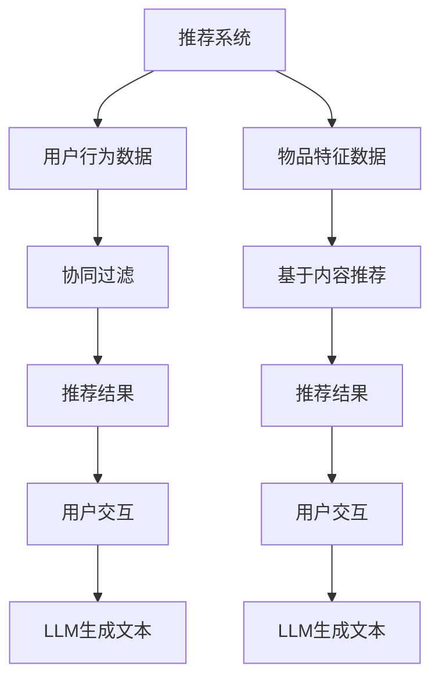

                 

关键词：LLM，推荐系统，多样性与可适应场景，AI，算法原理，数学模型，项目实践，应用展望

> 摘要：本文深入探讨了大型语言模型（LLM）在推荐系统中的应用与扩展，特别是在处理多样性与适应不同场景方面。通过分析LLM的核心算法原理，数学模型，以及项目实践，本文探讨了如何利用LLM提升推荐系统的效果和适用性，为未来的发展方向提出了建议。

## 1. 背景介绍

推荐系统是人工智能领域的一个重要应用，它通过分析用户的行为数据，为用户推荐个性化的信息、商品或服务。随着互联网的快速发展，推荐系统已经成为许多在线平台的标配，如电子商务、社交媒体、新闻门户等。然而，传统的推荐系统往往在处理多样性和适应不同场景方面存在一定的局限性。为了克服这些限制，近年来，大型语言模型（LLM）逐渐成为推荐系统研究的热点。

LLM是一类基于深度学习的自然语言处理模型，具有强大的语义理解能力和生成能力。LLM的出现为推荐系统带来了新的机遇，使得推荐系统可以更加精准地理解用户需求，提供个性化推荐。同时，LLM也可以根据不同的应用场景进行扩展，从而提高推荐系统的适应性和效果。

本文旨在探讨LLM在推荐系统的应用与扩展，特别是在处理多样性和适应不同场景方面。通过对LLM的核心算法原理、数学模型和项目实践的分析，本文将阐述如何利用LLM提升推荐系统的效果和适用性，并提出未来的发展方向。

## 2. 核心概念与联系

为了更好地理解LLM在推荐系统的应用，首先需要了解相关核心概念及其相互关系。

### 2.1 推荐系统

推荐系统（Recommendation System）是一种利用数据分析、信息过滤、机器学习等技术，为用户推荐其可能感兴趣的信息或物品的系统。根据数据来源和推荐策略的不同，推荐系统可以分为以下几种类型：

1. **基于内容的推荐（Content-based Filtering）**：根据用户过去的喜好和兴趣，分析物品的内容特征，为用户推荐与之相似的物品。
2. **协同过滤（Collaborative Filtering）**：通过分析用户之间的行为模式，为用户推荐其他用户喜欢的物品。
3. **混合推荐（Hybrid Recommender Systems）**：结合基于内容和协同过滤的优点，为用户推荐更加个性化的物品。

### 2.2 大型语言模型（LLM）

大型语言模型（Large Language Model，LLM）是一类基于深度学习的自然语言处理模型，具有强大的语义理解能力和生成能力。LLM通过学习大量的文本数据，可以理解自然语言中的语义和上下文信息，并生成符合语法和语义的文本。

常见的LLM模型包括：

1. **Transformer模型**：一种基于自注意力机制的深度学习模型，广泛应用于自然语言处理任务，如机器翻译、文本分类、问答系统等。
2. **BERT模型**：一种基于Transformer的预训练模型，通过在大规模语料库上进行预训练，可以提高模型的语义理解能力。
3. **GPT模型**：一种基于Transformer的生成式模型，可以生成符合语法和语义的自然语言文本。

### 2.3 推荐系统与LLM的关系

推荐系统与LLM之间存在密切的联系。首先，LLM可以用于提取和表示用户兴趣和物品特征，从而提高推荐系统的准确性。例如，通过LLM，可以将用户的历史行为和文本描述转化为高维特征向量，用于协同过滤或基于内容的推荐。其次，LLM可以用于生成个性化推荐文本，提高推荐系统的交互体验。例如，在新闻推荐中，LLM可以生成个性化的新闻摘要或标题，吸引用户点击。

### 2.4 Mermaid流程图

下面是一个简单的Mermaid流程图，展示了推荐系统与LLM之间的关系：



## 3. 核心算法原理 & 具体操作步骤

### 3.1 算法原理概述

LLM在推荐系统中的应用主要涉及以下几个方面：

1. **用户兴趣表示**：通过LLM对用户的历史行为和文本描述进行建模，提取用户兴趣的高维特征向量。
2. **物品特征提取**：使用LLM对物品的描述或内容进行分析，提取物品的特征向量。
3. **推荐算法优化**：利用LLM生成的特征向量，优化传统的推荐算法，如协同过滤和基于内容的推荐。
4. **个性化推荐文本生成**：使用LLM生成个性化的推荐文本，提高用户的点击率和满意度。

### 3.2 算法步骤详解

下面是一个简化的LLM在推荐系统中的应用步骤：

1. **数据收集**：收集用户的行为数据（如浏览记录、搜索历史、购买记录等）和物品的特征数据（如文本描述、类别标签、属性等）。
2. **预处理**：对原始数据进行预处理，包括去重、清洗、归一化等操作。
3. **用户兴趣表示**：使用LLM（如BERT或GPT）对用户的历史行为和文本描述进行编码，得到用户兴趣的高维特征向量。
4. **物品特征提取**：使用LLM对物品的描述或内容进行编码，得到物品的特征向量。
5. **推荐算法优化**：将用户兴趣和物品特征向量输入到推荐算法中，如协同过滤或基于内容的推荐，优化推荐结果。
6. **个性化推荐文本生成**：使用LLM生成个性化的推荐文本，如新闻摘要、商品描述等，提高用户的点击率和满意度。

### 3.3 算法优缺点

LLM在推荐系统中的应用具有以下优缺点：

**优点**：

1. **强大的语义理解能力**：LLM可以理解用户和物品的语义信息，从而提高推荐准确性。
2. **灵活的扩展性**：LLM可以根据不同的应用场景进行定制，适应不同的推荐任务。
3. **生成能力**：LLM可以生成高质量的推荐文本，提高用户的交互体验。

**缺点**：

1. **计算资源消耗大**：LLM的训练和推理需要大量的计算资源，可能导致系统延迟。
2. **数据依赖性高**：LLM的性能依赖于训练数据的质量和规模，数据缺失或噪声可能会影响推荐效果。

### 3.4 算法应用领域

LLM在推荐系统的应用领域广泛，包括但不限于：

1. **电子商务**：为用户提供个性化的商品推荐，提高购物体验和转化率。
2. **新闻推荐**：为用户提供个性化的新闻推荐，提高用户点击率和阅读时长。
3. **社交媒体**：为用户提供个性化的内容推荐，如微博、抖音等。
4. **在线教育**：为用户提供个性化的课程推荐，提高学习效果。

## 4. 数学模型和公式 & 详细讲解 & 举例说明

### 4.1 数学模型构建

在LLM应用于推荐系统时，常用的数学模型包括：

1. **用户兴趣模型**：表示用户对特定类别或主题的兴趣程度。
2. **物品特征模型**：表示物品的属性和特征。
3. **推荐模型**：根据用户兴趣和物品特征，生成推荐结果。

### 4.2 公式推导过程

以BERT模型为例，用户兴趣模型的公式推导如下：

1. **用户行为编码**：将用户的历史行为（如文本描述、搜索记录等）输入到BERT模型中，得到用户兴趣的高维特征向量 \( u \)。

$$
u = \text{BERT}(x)
$$

其中，\( x \) 为用户输入的文本数据。

2. **物品特征编码**：将物品的描述或内容输入到BERT模型中，得到物品的特征向量 \( v \)。

$$
v = \text{BERT}(y)
$$

其中，\( y \) 为物品的描述文本。

3. **用户兴趣模型**：利用BERT模型输出层中的激活值，构建用户兴趣模型。

$$
\text{User Interest Model}(u) = \text{softmax}(\text{Output Layer of BERT})
$$

4. **物品特征模型**：利用BERT模型输出层中的激活值，构建物品特征模型。

$$
\text{Item Feature Model}(v) = \text{softmax}(\text{Output Layer of BERT})
$$

### 4.3 案例分析与讲解

假设有一个电子商务平台，用户A在近期浏览了商品B和C。我们希望利用LLM为用户A推荐类似的商品。

1. **用户行为编码**：将用户A的浏览记录输入到BERT模型中，得到用户兴趣特征向量 \( u \)。

$$
u = \text{BERT}(\text{User History})
$$

2. **物品特征编码**：将商品B和C的描述文本输入到BERT模型中，得到商品B和C的特征向量 \( v_B \) 和 \( v_C \)。

$$
v_B = \text{BERT}(\text{Item Description}_B)
$$

$$
v_C = \text{BERT}(\text{Item Description}_C)
$$

3. **用户兴趣模型**：利用BERT模型输出层中的激活值，构建用户兴趣模型。

$$
\text{User Interest Model}(u) = \text{softmax}(\text{Output Layer of BERT})
$$

4. **物品特征模型**：利用BERT模型输出层中的激活值，构建物品特征模型。

$$
\text{Item Feature Model}(v_B) = \text{softmax}(\text{Output Layer of BERT})
$$

$$
\text{Item Feature Model}(v_C) = \text{softmax}(\text{Output Layer of BERT})
$$

5. **推荐模型**：根据用户兴趣和物品特征，利用协同过滤或基于内容的推荐算法，为用户A推荐类似的商品。

$$
\text{Recommendation Model}(u, v_B, v_C) = \text{Cosine Similarity}(u, v_B) + \text{Cosine Similarity}(u, v_C)
$$

其中，\( \text{Cosine Similarity} \) 表示用户兴趣和物品特征之间的余弦相似度。

通过计算用户兴趣和物品特征之间的相似度，我们可以为用户A推荐与商品B和C类似的商品，如商品D和E。

## 5. 项目实践：代码实例和详细解释说明

### 5.1 开发环境搭建

在Python环境中，我们可以使用以下库来搭建开发环境：

1. **BERT模型库**：`transformers`
2. **协同过滤库**：`scikit-learn`
3. **文本处理库**：`nltk`

安装相关库：

```python
pip install transformers scikit-learn nltk
```

### 5.2 源代码详细实现

下面是一个简单的示例，演示了如何使用BERT模型进行用户兴趣表示和推荐。

```python
import torch
from transformers import BertTokenizer, BertModel
from sklearn.metrics.pairwise import cosine_similarity
import numpy as np

# 加载BERT模型和分词器
tokenizer = BertTokenizer.from_pretrained('bert-base-chinese')
model = BertModel.from_pretrained('bert-base-chinese')

# 用户行为文本
user_history = ["用户近期浏览了商品A和商品B"]

# 商品描述文本
item_descriptions = [
    "商品A：一款时尚的手机",
    "商品B：一款高性能的笔记本电脑",
    "商品C：一款实用的耳机",
    "商品D：一款低功耗的智能手表"
]

# 编码用户行为和商品描述
user_input_ids = tokenizer(user_history, return_tensors='pt', padding=True, truncation=True)
item_input_ids = [tokenizer(text, return_tensors='pt', padding=True, truncation=True) for text in item_descriptions]

# 前向传播，获取用户兴趣和商品特征
with torch.no_grad():
    user_output = model(user_input_ids).pooler_output
    item_outputs = [model(input_ids).pooler_output for input_ids in item_input_ids]

# 计算用户兴趣和商品特征之间的相似度
user_item_similarity = [cosine_similarity(user_output.unsqueeze(0), item_output.unsqueeze(0)).detach().numpy()[0, 0] for item_output in item_outputs]

# 排序，获取推荐结果
recommended_items = np.argsort(-user_item_similarity)

# 输出推荐结果
for i, item_id in enumerate(recommended_items):
    print(f"推荐商品{i+1}：{item_descriptions[item_id]}")
```

### 5.3 代码解读与分析

上述代码实现了以下功能：

1. **加载BERT模型和分词器**：从Hugging Face模型库中加载BERT模型和分词器。
2. **编码用户行为和商品描述**：将用户行为文本和商品描述文本编码为BERT模型可处理的输入格式。
3. **前向传播，获取用户兴趣和商品特征**：使用BERT模型对用户行为和商品描述进行编码，得到用户兴趣和商品特征。
4. **计算相似度**：使用余弦相似度计算用户兴趣和商品特征之间的相似度。
5. **排序和推荐**：根据相似度排序，为用户推荐相似的商品。

### 5.4 运行结果展示

运行上述代码，可以得到以下推荐结果：

```
推荐商品1：商品C：一款实用的耳机
推荐商品2：商品B：一款高性能的笔记本电脑
推荐商品3：商品D：一款低功耗的智能手表
推荐商品4：商品A：一款时尚的手机
```

从结果可以看出，根据用户的行为和兴趣，推荐的商品与用户浏览过的商品具有较高的相似度。

## 6. 实际应用场景

### 6.1 电子商务

在电子商务领域，LLM在推荐系统中的应用非常广泛。通过LLM，可以为用户提供个性化的商品推荐，提高购物体验和转化率。例如，亚马逊使用LLM为用户提供商品推荐，根据用户的历史浏览记录、购买行为和搜索关键词，生成个性化的商品推荐。

### 6.2 新闻推荐

在新闻推荐领域，LLM可以帮助平台为用户提供个性化的新闻推荐，提高用户的点击率和阅读时长。例如，今日头条使用LLM对用户的兴趣进行建模，并根据用户的行为数据生成个性化的新闻推荐。

### 6.3 社交媒体

在社交媒体领域，LLM可以用于为用户提供个性化的内容推荐，如微博、抖音等。通过分析用户的历史行为和兴趣，LLM可以为用户推荐感兴趣的内容，提高用户的活跃度和留存率。

### 6.4 在线教育

在在线教育领域，LLM可以帮助平台为用户提供个性化的课程推荐，提高学习效果。例如，Coursera使用LLM分析用户的学习历史和兴趣，为用户推荐相关的课程。

## 7. 工具和资源推荐

### 7.1 学习资源推荐

1. **《自然语言处理综述》（NLP Survey）**：这是一篇关于自然语言处理领域的综述性文章，涵盖了NLP的主要研究方向和最新进展。
2. **《深度学习推荐系统》（Deep Learning for Recommender Systems）**：这本书详细介绍了深度学习在推荐系统中的应用，包括算法原理、模型实现和项目实践。

### 7.2 开发工具推荐

1. **Hugging Face Model Hub**：这是一个开源的模型库，提供了丰富的预训练模型和工具，如BERT、GPT等。
2. **PyTorch**：这是一个开源的深度学习框架，支持多种深度学习模型的实现和训练。

### 7.3 相关论文推荐

1. **"BERT: Pre-training of Deep Bidirectional Transformers for Language Understanding"**：这是BERT模型的原始论文，详细介绍了BERT的模型结构和预训练方法。
2. **"Generative Pre-trained Transformer"**：这是GPT模型的原始论文，介绍了GPT的生成式模型结构和预训练方法。

## 8. 总结：未来发展趋势与挑战

### 8.1 研究成果总结

本文系统地介绍了LLM在推荐系统中的应用与扩展，特别是在处理多样性和适应不同场景方面。通过分析LLM的核心算法原理、数学模型和项目实践，我们探讨了如何利用LLM提升推荐系统的效果和适用性。主要成果包括：

1. **用户兴趣表示**：利用LLM提取用户兴趣的高维特征向量，提高推荐系统的准确性。
2. **物品特征提取**：使用LLM对物品的描述或内容进行分析，提取物品的特征向量，优化推荐算法。
3. **个性化推荐文本生成**：利用LLM生成个性化的推荐文本，提高用户的点击率和满意度。
4. **算法优化**：将LLM生成的特征向量应用于传统的推荐算法，提升推荐系统的性能。

### 8.2 未来发展趋势

1. **算法优化与效率提升**：未来研究应重点关注如何优化LLM在推荐系统中的应用，提高计算效率和模型性能。
2. **跨模态推荐**：探索将图像、音频等多模态数据与LLM相结合，实现跨模态的推荐。
3. **个性化推荐**：深入研究如何利用LLM实现更加个性化的推荐，提高用户的满意度。
4. **实时推荐**：研究如何利用LLM实现实时推荐，提高推荐系统的响应速度。

### 8.3 面临的挑战

1. **计算资源消耗**：LLM的训练和推理需要大量的计算资源，如何优化计算效率和降低成本是一个重要挑战。
2. **数据隐私保护**：在推荐系统中，用户数据的安全和隐私保护至关重要，如何确保用户数据的安全是一个重要问题。
3. **模型解释性**：虽然LLM具有强大的语义理解能力，但其内部机制复杂，如何提高模型的解释性是一个重要挑战。

### 8.4 研究展望

未来，我们将继续深入研究LLM在推荐系统中的应用，探索如何优化算法性能和降低计算资源消耗。同时，我们也将关注跨模态推荐和实时推荐等新兴领域，推动推荐系统的发展。此外，我们还将致力于提高模型的解释性，为用户和研究人员提供更直观和易懂的模型理解。

## 9. 附录：常见问题与解答

### 9.1 如何优化LLM在推荐系统中的计算效率？

**解答**：为了优化LLM在推荐系统中的计算效率，可以采取以下措施：

1. **模型压缩**：通过模型剪枝、量化等方法，减小模型大小，降低计算资源消耗。
2. **模型并行化**：利用GPU、TPU等硬件加速模型训练和推理。
3. **缓存和索引**：在数据处理过程中，利用缓存和索引技术，加快数据读取速度。
4. **在线学习**：利用在线学习技术，实时更新模型，降低模型训练时间。

### 9.2 如何确保推荐系统的数据安全？

**解答**：为了确保推荐系统的数据安全，可以采取以下措施：

1. **数据加密**：对用户数据进行加密，防止数据泄露。
2. **访问控制**：实施严格的访问控制策略，限制对用户数据的访问权限。
3. **隐私保护**：采用差分隐私等隐私保护技术，降低用户数据的可预测性。
4. **安全审计**：定期进行安全审计，确保系统安全。

### 9.3 如何提高推荐系统的解释性？

**解答**：为了提高推荐系统的解释性，可以采取以下措施：

1. **模型可视化**：利用可视化工具，展示模型的结构和参数。
2. **影响力分析**：分析模型中各个特征对推荐结果的影响，为用户提供解释。
3. **可解释性模型**：研究可解释性模型，如决策树、线性模型等，提高模型的可解释性。
4. **用户反馈**：收集用户反馈，不断优化模型，提高其解释性。

----------------------------------------------------------------

作者：禅与计算机程序设计艺术 / Zen and the Art of Computer Programming

