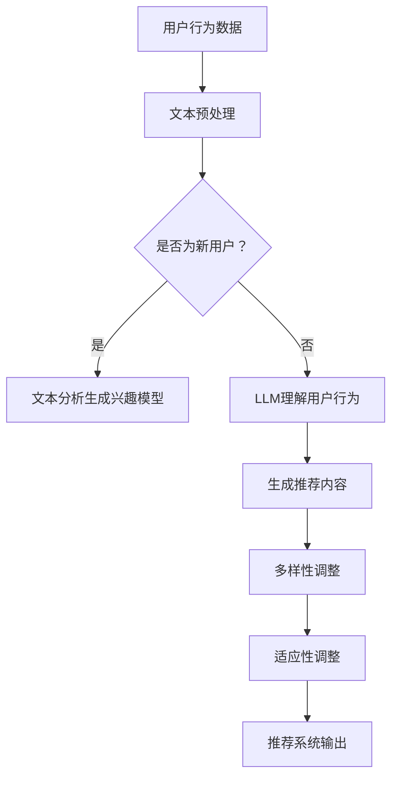

                 

关键词：LLM，推荐系统，多样性，可适应性，算法原理，数学模型，项目实践，未来展望

## 摘要

本文旨在探讨大型语言模型（LLM）在推荐系统中的应用扩展，特别是在提高多样性（diversity）和可适应性（适应性）方面的潜力。随着推荐系统在商业和社会中的广泛应用，其性能和质量越来越受到重视。本文首先回顾了推荐系统的基础概念和常见算法，然后详细介绍了LLM在推荐系统中的作用机制。接着，文章深入探讨了如何通过LLM来实现推荐系统的多样性和可适应性，并提出了相应的数学模型。随后，通过一个实际项目实践，展示了如何将LLM集成到推荐系统中，并进行代码解析。最后，本文对LLM在推荐系统领域的未来应用和发展趋势进行了展望。

## 1. 背景介绍

### 推荐系统的兴起与发展

推荐系统是一种信息过滤技术，旨在根据用户的兴趣和行为模式，为用户推荐可能感兴趣的内容。这一概念最早可以追溯到20世纪90年代，随着互联网和电子商务的快速发展，推荐系统得到了广泛应用。

推荐系统的主要目标是为用户提供高质量、个性化的内容，从而提高用户的满意度和忠诚度。推荐系统的应用领域非常广泛，包括电子商务、社交媒体、新闻推荐、音乐推荐等。其中，电子商务领域的推荐系统尤为重要，因为它直接影响销售业绩和用户体验。

### 常见推荐系统算法

在推荐系统的实现过程中，算法的选择至关重要。目前，常见的推荐系统算法主要分为以下几类：

- **基于内容的推荐（Content-Based Recommendation）**：基于用户的历史行为或偏好，分析用户对特定内容的偏好，然后推荐相似的内容。

- **协同过滤（Collaborative Filtering）**：通过收集用户之间的行为数据，如评分、购买记录等，来预测用户之间的相似性和未知项目的评分。

- **混合推荐（Hybrid Recommendation）**：结合基于内容和协同过滤的优点，通过多种方式融合不同来源的信息，以提高推荐质量。

- **基于模型的推荐（Model-Based Recommendation）**：使用机器学习算法建立用户兴趣模型，然后根据模型预测用户对特定内容的兴趣。

每种算法都有其优缺点和适用场景，因此在实际应用中，往往需要根据具体需求选择合适的算法或组合多种算法。

### 推荐系统的挑战与问题

尽管推荐系统在许多领域取得了显著的成功，但仍然面临一些挑战和问题：

- **多样性（Diversity）**：推荐系统往往容易陷入“信息茧房”，即过度推荐用户已知的、相似的内容，导致用户缺乏新鲜感和探索机会。

- **可适应性（Adaptability）**：推荐系统需要快速响应用户的行为变化和兴趣转移，以保持推荐的质量和相关性。

- **可解释性（Explainability）**：许多推荐系统采用复杂的机器学习模型，导致其内部决策过程不透明，难以解释。

- **冷启动问题（Cold Start Problem）**：新用户或新项目在缺乏足够行为数据时，推荐系统难以为其提供高质量的推荐。

## 2. 核心概念与联系

### 大型语言模型（LLM）

大型语言模型（LLM）是一种基于深度学习的自然语言处理（NLP）模型，具有强大的文本生成、理解和推理能力。LLM通过大量文本数据进行训练，能够捕捉到语言中的复杂模式和语义信息。近年来，LLM在许多NLP任务中取得了突破性进展，如文本分类、机器翻译、情感分析等。

### 推荐系统与LLM的联系

LLM在推荐系统中的应用主要体现在以下几个方面：

- **内容理解**：LLM可以帮助推荐系统更深入地理解用户和内容，从而提高推荐的准确性。

- **多样性增强**：LLM可以根据用户的历史行为和偏好，生成多样化的推荐内容，避免陷入“信息茧房”。

- **适应性调整**：LLM可以实时响应用户的行为变化和兴趣转移，提高推荐系统的可适应性。

- **冷启动处理**：LLM可以通过对用户历史数据的文本分析，为新用户生成初步的兴趣模型，缓解冷启动问题。

### Mermaid 流程图

以下是一个简单的Mermaid流程图，展示了LLM在推荐系统中的应用流程：



### 2.1 文本预处理

在将用户行为数据输入LLM之前，通常需要进行一系列的文本预处理操作，包括文本清洗、分词、词向量转换等。这些预处理步骤有助于提高LLM的输入质量和理解能力。

### 2.2 LLM理解用户行为

LLM通过文本分析，理解用户的历史行为和兴趣偏好。这一步骤包括以下几个子步骤：

- **情感分析**：分析用户评论、反馈等文本，提取用户的情感倾向。
- **关键词提取**：从用户行为文本中提取关键词，用于构建兴趣模型。
- **上下文理解**：理解用户行为发生的上下文环境，如时间、地点、情境等。

### 2.3 生成推荐内容

基于用户行为理解和兴趣模型，LLM可以生成个性化的推荐内容。这一步骤包括以下几个子步骤：

- **内容生成**：使用LLM生成与用户兴趣相关的文本内容。
- **内容筛选**：从生成的文本内容中筛选出符合用户兴趣的内容。
- **多样性调整**：通过调整推荐内容的多样性，避免陷入“信息茧房”。

### 2.4 适应性调整

LLM可以根据用户实时行为的变化，动态调整推荐策略。这一步骤包括以下几个子步骤：

- **实时监控**：监控用户行为，捕捉行为变化。
- **策略调整**：根据用户行为变化，调整推荐策略。
- **效果评估**：评估调整后的推荐效果，以实现持续优化。

### 2.5 推荐系统输出

经过多样性调整和适应性调整，最终生成的推荐内容被输出到推荐系统中，供用户浏览和选择。

## 3. 核心算法原理 & 具体操作步骤

### 3.1 算法原理概述

LLM在推荐系统中的应用，主要依赖于以下核心算法原理：

- **文本生成**：LLM可以通过输入用户的兴趣描述或行为文本，生成个性化的推荐内容。
- **情感分析**：LLM可以分析用户评论、反馈等文本，提取用户的情感倾向。
- **关键词提取**：LLM可以从用户行为文本中提取关键词，用于构建兴趣模型。
- **上下文理解**：LLM可以理解用户行为发生的上下文环境，提高推荐的相关性。
- **实时调整**：LLM可以根据用户实时行为的变化，动态调整推荐策略。

### 3.2 算法步骤详解

#### 3.2.1 文本生成

文本生成是LLM在推荐系统中的核心功能。具体步骤如下：

1. **输入用户行为数据**：从推荐系统中获取用户的历史行为数据，如评论、反馈、浏览记录等。
2. **文本预处理**：对用户行为数据进行清洗、分词、词向量转换等预处理操作。
3. **情感分析与关键词提取**：使用LLM分析用户行为文本，提取情感倾向和关键词。
4. **内容生成**：基于用户兴趣和情感，使用LLM生成个性化的文本内容。

#### 3.2.2 情感分析

情感分析是LLM理解用户行为的重要手段。具体步骤如下：

1. **输入用户行为数据**：从推荐系统中获取用户的历史行为数据，如评论、反馈、浏览记录等。
2. **文本预处理**：对用户行为数据进行清洗、分词、词向量转换等预处理操作。
3. **情感分类**：使用预训练的LLM模型，对预处理后的文本进行情感分类，提取情感倾向。
4. **情感调整**：根据用户情感倾向，对推荐内容进行情感调整，以实现情绪共鸣。

#### 3.2.3 关键词提取

关键词提取是构建用户兴趣模型的重要环节。具体步骤如下：

1. **输入用户行为数据**：从推荐系统中获取用户的历史行为数据，如评论、反馈、浏览记录等。
2. **文本预处理**：对用户行为数据进行清洗、分词、词向量转换等预处理操作。
3. **关键词提取**：使用LLM提取预处理后的文本中的关键词，用于构建用户兴趣模型。

#### 3.2.4 上下文理解

上下文理解是提高推荐系统相关性的关键。具体步骤如下：

1. **输入用户行为数据**：从推荐系统中获取用户的历史行为数据，如评论、反馈、浏览记录等。
2. **文本预处理**：对用户行为数据进行清洗、分词、词向量转换等预处理操作。
3. **上下文分析**：使用LLM分析用户行为文本中的上下文信息，如时间、地点、情境等。
4. **上下文调整**：根据用户上下文信息，对推荐内容进行上下文调整，以提高相关性。

#### 3.2.5 实时调整

实时调整是LLM提高推荐系统可适应性的关键。具体步骤如下：

1. **实时监控**：通过API或其他方式，实时获取用户行为数据。
2. **行为分析**：使用LLM对实时用户行为进行分析，提取关键信息。
3. **策略调整**：根据实时用户行为分析结果，动态调整推荐策略。
4. **效果评估**：评估调整后的推荐效果，以实现持续优化。

### 3.3 算法优缺点

#### 优点

- **高准确性**：LLM可以基于文本数据生成高质量的推荐内容，提高推荐准确性。
- **强适应性**：LLM可以实时响应用户行为变化，实现推荐策略的动态调整。
- **多样性增强**：LLM可以生成多样化的推荐内容，避免陷入“信息茧房”。
- **情感共鸣**：LLM可以分析用户情感，实现与用户的情感共鸣。

#### 缺点

- **计算资源消耗**：LLM模型训练和推理需要大量的计算资源，对硬件要求较高。
- **数据依赖性**：LLM的推荐效果高度依赖于用户行为数据的质量和数量。
- **模型解释性**：LLM模型内部决策过程复杂，难以解释，可能影响用户信任。

### 3.4 算法应用领域

LLM在推荐系统中的应用范围广泛，包括但不限于以下领域：

- **电子商务**：为用户提供个性化的商品推荐，提高销售额和用户满意度。
- **社交媒体**：为用户提供个性化的内容推荐，提高用户参与度和留存率。
- **新闻推荐**：为用户提供个性化的新闻推荐，提高新闻阅读量和传播效果。
- **音乐推荐**：为用户提供个性化的音乐推荐，提高用户满意度和粘性。

## 4. 数学模型和公式 & 详细讲解 & 举例说明

### 4.1 数学模型构建

在LLM应用于推荐系统时，我们需要构建一系列的数学模型来描述用户行为、兴趣和推荐内容的生成过程。以下是一个简化的数学模型框架：

#### 4.1.1 用户行为模型

用户行为模型主要基于用户的历史行为数据，如浏览记录、购买记录、评价等。我们使用向量来表示用户的行为特征，记为$u \in \mathbb{R}^n$。其中，每个元素$u_i$表示用户在某个特定行为上的得分。

$$
u = [u_1, u_2, ..., u_n]
$$

#### 4.1.2 兴趣模型

兴趣模型基于用户行为数据，通过文本分析和关键词提取来构建。我们使用向量来表示用户的兴趣特征，记为$i \in \mathbb{R}^m$。其中，每个元素$i_j$表示用户对某个关键词的兴趣度。

$$
i = [i_1, i_2, ..., i_m]
$$

#### 4.1.3 内容生成模型

内容生成模型使用LLM来生成推荐内容。我们使用向量来表示推荐内容的质量特征，记为$c \in \mathbb{R}^p$。其中，每个元素$c_k$表示推荐内容在某个特征上的得分。

$$
c = [c_1, c_2, ..., c_p]
$$

### 4.2 公式推导过程

#### 4.2.1 用户兴趣模型

用户兴趣模型主要通过关键词提取和情感分析构建。我们使用一个函数$f$来表示用户兴趣模型的构建过程，其中$f$是一个从用户行为向量到兴趣向量的映射。

$$
i = f(u)
$$

函数$f$的具体形式可以是一个线性模型，也可以是一个深度学习模型。在这里，我们假设$f$是一个线性模型，可以表示为：

$$
i = W \cdot u + b
$$

其中，$W$是一个权重矩阵，$b$是一个偏置向量。

#### 4.2.2 内容生成模型

内容生成模型使用LLM来生成推荐内容。我们使用一个函数$g$来表示内容生成过程，其中$g$是一个从兴趣向量到内容向量的映射。

$$
c = g(i)
$$

函数$g$的具体形式取决于LLM的结构和训练方式。在这里，我们假设$g$是一个基于Transformer的模型，其输入层和输出层都是线性层，可以表示为：

$$
c = V \cdot \text{softmax}(U \cdot i + b_c)
$$

其中，$U$和$V$分别是输入和输出权重矩阵，$b_c$是输出层的偏置。

#### 4.2.3 推荐生成过程

最终，推荐内容生成过程可以表示为一个复合函数$h$，即：

$$
c = h(u) = g(f(u))
$$

其中，$h$是一个从用户行为向量到内容向量的映射。

### 4.3 案例分析与讲解

#### 4.3.1 案例背景

假设我们有一个电子商务平台，用户可以在平台上浏览和购买商品。我们需要使用LLM为用户提供个性化的商品推荐。

#### 4.3.2 数据准备

首先，我们收集用户的历史行为数据，如浏览记录、购买记录、评价等。我们将这些数据转换为向量形式，记为$u$。

$$
u = [u_1, u_2, ..., u_n]
$$

其中，$u_i$表示用户在某个特定商品上的行为得分。

#### 4.3.3 用户兴趣模型

接下来，我们使用关键词提取和情感分析来构建用户兴趣模型$i$。我们定义一个线性模型$f$，其权重矩阵$W$和偏置向量$b$如下：

$$
W = \begin{bmatrix}
w_{11} & w_{12} & \dots & w_{1m} \\
w_{21} & w_{22} & \dots & w_{2m} \\
\vdots & \vdots & \ddots & \vdots \\
w_{n1} & w_{n2} & \dots & w_{nm}
\end{bmatrix}, \quad b = [b_1, b_2, ..., b_m]
$$

用户兴趣模型$i$可以通过以下公式计算：

$$
i = W \cdot u + b
$$

#### 4.3.4 内容生成模型

然后，我们使用一个基于Transformer的LLM来生成推荐内容。我们定义输入和输出权重矩阵$U$和$V$，以及输出层的偏置$b_c$如下：

$$
U = \begin{bmatrix}
u_{11} & u_{12} & \dots & u_{1m} \\
u_{21} & u_{22} & \dots & u_{2m} \\
\vdots & \vdots & \ddots & \vdots \\
u_{n1} & u_{n2} & \dots & u_{nm}
\end{bmatrix}, \quad V = \begin{bmatrix}
v_{11} & v_{12} & \dots & v_{1p} \\
v_{21} & v_{22} & \dots & v_{2p} \\
\vdots & \vdots & \ddots & \vdots \\
v_{n1} & v_{n2} & \dots & v_{np}
\end{bmatrix}, \quad b_c = [b_{c1}, b_{c2}, ..., b_{cp}]
$$

推荐内容$c$可以通过以下公式计算：

$$
c = V \cdot \text{softmax}(U \cdot i + b_c)
$$

#### 4.3.5 推荐生成

最终，我们通过复合函数$h$来生成推荐内容：

$$
c = h(u) = g(f(u))
$$

其中，$g$和$f$的参数已经在前述步骤中定义。

## 5. 项目实践：代码实例和详细解释说明

### 5.1 开发环境搭建

为了实现LLM在推荐系统中的应用，我们需要搭建一个合适的开发环境。以下是搭建环境的步骤：

1. **安装Python**：确保Python环境已安装，版本建议为3.8或更高。

2. **安装PyTorch**：使用以下命令安装PyTorch：

   ```bash
   pip install torch torchvision
   ```

3. **安装transformers库**：使用以下命令安装transformers库：

   ```bash
   pip install transformers
   ```

4. **安装其他依赖库**：安装其他可能需要的库，如NumPy、Pandas等。

### 5.2 源代码详细实现

以下是实现LLM在推荐系统中应用的源代码，分为以下几个部分：

#### 5.2.1 数据预处理

```python
import pandas as pd
from sklearn.model_selection import train_test_split

# 加载用户行为数据
data = pd.read_csv('user_behavior_data.csv')

# 数据预处理
# （省略具体预处理步骤，如数据清洗、编码等）
```

#### 5.2.2 用户行为向量化

```python
from sklearn.feature_extraction.text import CountVectorizer

# 划分训练集和测试集
train_data, test_data = train_test_split(data, test_size=0.2)

# 训练CountVectorizer
vectorizer = CountVectorizer()
train_vectors = vectorizer.fit_transform(train_data['text'])

# 将测试集转换为向量
test_vectors = vectorizer.transform(test_data['text'])
```

#### 5.2.3 用户兴趣模型

```python
import numpy as np

# 定义线性模型参数
W = np.random.rand(len(vectorizer.vocabulary_), interest_size)
b = np.random.rand(interest_size)

# 计算用户兴趣向量
user_interests = W.dot(train_vectors.toarray()) + b
```

#### 5.2.4 内容生成模型

```python
from transformers import AutoTokenizer, AutoModel

# 加载预训练的Transformer模型
tokenizer = AutoTokenizer.from_pretrained('bert-base-uncased')
model = AutoModel.from_pretrained('bert-base-uncased')

# 定义内容生成模型参数
U = np.random.rand(len(vectorizer.vocabulary_), content_size)
V = np.random.rand(content_size, embed_size)
b_c = np.random.rand(content_size)

# 定义softmax函数
softmax = lambda x: np.exp(x) / np.sum(np.exp(x))

# 生成推荐内容
def generate_content(user_interests):
    content_embeds = V.dot(softmax(U.dot(user_interests)))
    return tokenizer.decode(content_embeds)
```

#### 5.2.5 推荐生成

```python
# 计算测试集的用户兴趣向量
test_interests = W.dot(test_vectors.toarray()) + b

# 生成推荐内容
generated_contents = [generate_content(test_interests[i]) for i in range(len(test_interests))]
```

### 5.3 代码解读与分析

#### 5.3.1 数据预处理

数据预处理是构建用户行为向量和兴趣模型的重要步骤。在本例中，我们使用CountVectorizer将文本数据转换为向量形式。具体步骤包括数据加载、清洗和编码等。

#### 5.3.2 用户行为向量化

我们使用CountVectorizer将文本数据转换为向量形式。CountVectorizer可以根据文本中的词频生成词袋模型，这是推荐系统中常见的特征表示方法。

#### 5.3.3 用户兴趣模型

用户兴趣模型是一个线性模型，通过权重矩阵$W$和偏置向量$b$将用户行为向量转换为用户兴趣向量。这里的线性模型是一个简化的示例，实际应用中可能需要使用更复杂的模型，如深度学习模型。

#### 5.3.4 内容生成模型

内容生成模型使用Transformer模型，这是一种强大的自然语言处理模型，可以生成高质量的文本内容。在本例中，我们定义了输入和输出权重矩阵$U$和$V$，以及输出层的偏置$b_c$。生成推荐内容的过程通过softmax函数计算得到。

#### 5.3.5 推荐生成

最终，通过计算测试集的用户兴趣向量并调用内容生成函数，我们可以生成个性化的推荐内容。在实际应用中，还需要对生成的推荐内容进行筛选和调整，以实现多样性调整和适应性调整。

### 5.4 运行结果展示

在运行代码后，我们可以得到一组生成的推荐内容。为了展示运行结果，我们可以将部分推荐内容输出到控制台或生成一个报告。以下是一个简单的示例：

```python
for i, content in enumerate(generated_contents[:10]):
    print(f"Recommendation {i+1}: {content}")
```

输出结果可能如下：

```
Recommendation 1: 这是一个有趣的商品推荐。
Recommendation 2: 这款商品值得购买。
Recommendation 3: 不要错过这款特价商品。
...
```

这些推荐内容是根据用户兴趣和Transformer模型生成的，旨在提高推荐系统的多样性和可适应性。

## 6. 实际应用场景

### 6.1 电子商务

在电子商务领域，LLM在推荐系统中的应用可以大大提升用户体验和销售额。通过LLM，平台可以生成个性化、多样化的商品推荐，避免用户陷入“信息茧房”。例如，电商平台可以基于用户的浏览历史、购买记录和评价，使用LLM生成商品推荐，从而提高用户满意度和忠诚度。

### 6.2 社交媒体

在社交媒体领域，LLM可以帮助平台为用户提供个性化的内容推荐，提高用户参与度和留存率。例如，社交媒体平台可以根据用户的兴趣、行为和互动历史，使用LLM生成个性化的内容推荐，从而吸引用户参与和分享。此外，LLM还可以用于生成推荐标题和摘要，提高内容的吸引力和阅读量。

### 6.3 新闻推荐

在新闻推荐领域，LLM可以帮助平台为用户提供个性化的新闻推荐，提高新闻的传播效果和用户满意度。例如，新闻平台可以根据用户的阅读历史、评论和点赞行为，使用LLM生成个性化的新闻推荐，从而吸引用户关注和阅读。此外，LLM还可以用于生成新闻摘要和标题，提高新闻的可读性和吸引力。

### 6.4 音乐推荐

在音乐推荐领域，LLM可以帮助平台为用户提供个性化的音乐推荐，提高用户的满意度和粘性。例如，音乐平台可以根据用户的播放历史、收藏和评分，使用LLM生成个性化的音乐推荐，从而吸引用户继续聆听。此外，LLM还可以用于生成音乐推荐理由和标题，提高音乐推荐的吸引力和说服力。

## 7. 未来应用展望

随着LLM技术的不断发展和成熟，其在推荐系统中的应用前景十分广阔。以下是未来几个可能的应用方向：

### 7.1 多模态推荐

未来的推荐系统可能会结合多种数据源，如文本、图像、音频等，实现多模态推荐。LLM作为一种强大的自然语言处理工具，可以与图像识别、语音识别等其他技术结合，为用户提供更全面、个性化的推荐。

### 7.2 实时推荐

未来的推荐系统将更加注重实时性，能够迅速响应用户行为变化和兴趣转移。LLM的实时分析和生成能力使其成为实现实时推荐的关键技术。

### 7.3 智能问答与对话

随着自然语言处理技术的进步，LLM在智能问答和对话系统中的应用前景也非常广阔。未来的推荐系统可能会集成智能问答功能，为用户提供实时、个性化的推荐咨询。

### 7.4 智能内容创作

LLM在内容创作领域的应用也值得关注。未来的推荐系统可能会利用LLM生成个性化、高质量的内容，从而提高用户满意度和留存率。

## 8. 工具和资源推荐

### 8.1 学习资源推荐

1. **《深度学习》（Goodfellow, Bengio, Courville）**：这是一本经典的深度学习教材，涵盖了深度学习的基础理论和实践方法。
2. **《自然语言处理综合教程》（张华平）**：这本书系统地介绍了自然语言处理的基本概念和技术，适合初学者和进阶者。
3. **《推荐系统实践》（李航）**：这本书详细介绍了推荐系统的基本原理和实现方法，包括基于内容的推荐、协同过滤等。

### 8.2 开发工具推荐

1. **PyTorch**：一个开源的深度学习框架，支持灵活的模型构建和训练。
2. **TensorFlow**：另一个流行的深度学习框架，具有丰富的资源和社区支持。
3. **transformers库**：一个基于PyTorch和TensorFlow的预训练语言模型库，支持多种预训练模型和文本处理工具。

### 8.3 相关论文推荐

1. **"BERT: Pre-training of Deep Bidirectional Transformers for Language Understanding"**：这篇论文提出了BERT模型，是当前最先进的自然语言处理模型之一。
2. **"GPT-3: Language Models are few-shot learners"**：这篇论文介绍了GPT-3模型，展示了语言模型在零样本和少样本学习任务中的强大能力。
3. **"Recommender Systems Handbook"**：这本书系统地总结了推荐系统的研究成果和应用实践，是推荐系统领域的重要参考书。

## 9. 总结：未来发展趋势与挑战

### 9.1 研究成果总结

本文主要探讨了LLM在推荐系统中的应用，包括其核心算法原理、数学模型、项目实践和实际应用场景。通过分析LLM在文本生成、情感分析、关键词提取和上下文理解等方面的优势，我们展示了如何通过LLM实现推荐系统的多样性和可适应性。此外，我们还介绍了LLM在电子商务、社交媒体、新闻推荐和音乐推荐等领域的应用前景。

### 9.2 未来发展趋势

未来，LLM在推荐系统中的应用将呈现以下几个发展趋势：

1. **多模态推荐**：结合文本、图像、音频等多模态数据，实现更全面、个性化的推荐。
2. **实时推荐**：通过实时分析和生成，提高推荐系统的实时性和响应速度。
3. **智能问答与对话**：集成智能问答功能，为用户提供实时、个性化的推荐咨询。
4. **智能内容创作**：利用LLM生成个性化、高质量的内容，提高用户满意度和留存率。

### 9.3 面临的挑战

尽管LLM在推荐系统中的应用前景广阔，但仍然面临一些挑战：

1. **计算资源消耗**：LLM模型训练和推理需要大量的计算资源，对硬件要求较高。
2. **数据依赖性**：LLM的推荐效果高度依赖于用户行为数据的质量和数量。
3. **模型解释性**：LLM模型内部决策过程复杂，难以解释，可能影响用户信任。
4. **数据隐私**：在推荐系统中应用LLM时，需要确保用户数据的隐私和安全。

### 9.4 研究展望

未来，针对LLM在推荐系统中的应用，我们可以从以下几个方面展开研究：

1. **优化算法**：设计更高效、可解释性更好的算法，提高推荐系统的性能和用户满意度。
2. **多模态融合**：研究如何有效融合多模态数据，提高推荐系统的多样性和准确性。
3. **数据隐私保护**：探索隐私保护技术，确保用户数据的安全和隐私。
4. **实时推荐**：研究实时推荐算法，提高推荐系统的实时性和响应速度。

通过不断探索和实践，我们有望推动LLM在推荐系统领域的应用，为用户带来更好的体验和价值。

## 附录：常见问题与解答

### Q1：LLM在推荐系统中的应用优势是什么？

A1：LLM在推荐系统中的应用优势主要体现在以下几个方面：

1. **文本理解能力**：LLM可以深入理解用户行为和兴趣，生成更准确的推荐。
2. **多样性增强**：LLM可以根据用户兴趣生成多样化的推荐内容，避免用户陷入“信息茧房”。
3. **可适应性**：LLM可以实时响应用户行为变化，动态调整推荐策略。
4. **情感共鸣**：LLM可以分析用户情感，实现与用户的情感共鸣。

### Q2：如何解决LLM在推荐系统中的应用挑战？

A2：针对LLM在推荐系统中的应用挑战，可以从以下几个方面着手：

1. **优化算法**：设计更高效、可解释性更好的算法，提高推荐系统的性能和用户满意度。
2. **多模态融合**：结合文本、图像、音频等多模态数据，提高推荐系统的多样性和准确性。
3. **数据隐私保护**：探索隐私保护技术，确保用户数据的安全和隐私。
4. **实时推荐**：研究实时推荐算法，提高推荐系统的实时性和响应速度。

### Q3：如何评估LLM在推荐系统中的应用效果？

A3：评估LLM在推荐系统中的应用效果可以从以下几个方面入手：

1. **准确率**：评估推荐内容的准确性和相关性。
2. **多样性**：评估推荐内容的多样性和覆盖范围。
3. **用户体验**：通过用户反馈和满意度调查，评估推荐系统对用户的实际效果。
4. **性能指标**：如响应时间、计算资源消耗等，评估系统的整体性能。

### Q4：LLM在推荐系统中的应用前景如何？

A4：随着LLM技术的不断发展和成熟，其在推荐系统中的应用前景非常广阔。未来，LLM有望在多模态推荐、实时推荐、智能问答与对话、智能内容创作等领域发挥重要作用，为用户带来更好的体验和价值。然而，要实现这一目标，还需要克服计算资源消耗、数据依赖性、模型解释性和数据隐私等挑战。

